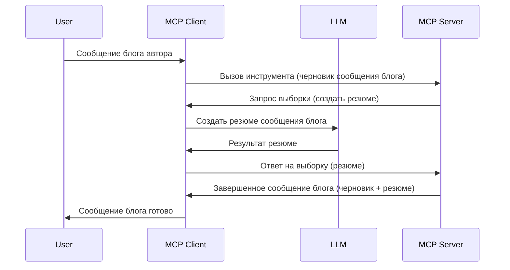

# Sampling — делегирование функций клиенту

> **Уведомление об устаревании:** кандидат на выпуск спецификации MCP `2026-07-28` отмечает Sampling как устаревший в пользу прямой интеграции с API поставщиков LLM. Sampling продолжит работать в версии `2025-11-25` и как минимум год после официального устаревания, поэтому всё, что изложено в этом уроке, остаётся актуальным — но новые серверные решения должны рассмотреть альтернативный подход. См. [Что меняется в MCP: Кандидат на выпуск 2026-07-28](../../01-CoreConcepts/mcp-2026-07-28-release-candidate.md).

Иногда требуется, чтобы MCP Клиент и MCP Сервер сотрудничали для достижения общей цели. Может быть случай, когда Серверу нужна помощь LLM, расположенного на клиенте. Для этой ситуации используется sampling.

Давайте рассмотрим несколько сценариев использования и как построить решение с применением sampling.

## Обзор

В этом уроке мы сосредоточимся на объяснении, когда и где использовать Sampling, а также как его настроить.

## Цели обучения

В этой главе мы:

- Объясним, что такое Sampling и когда его использовать.
- Покажем, как настроить Sampling в MCP.
- Приведём примеры использования Sampling на практике.

## Что такое Sampling и почему его использовать?

Sampling — это продвинутая функция, работающая следующим образом:



### Запрос Sampling

Хорошо, теперь у нас есть общее представление о правдоподобном сценарии, давайте поговорим о запросе sampling, который сервер отправляет клиенту. Вот как такой запрос может выглядеть в формате JSON-RPC:

```json
{
  "jsonrpc": "2.0",
  "id": 1,
  "method": "sampling/createMessage",
  "params": {
    "messages": [
      {
        "role": "user",
        "content": {
          "type": "text",
          "text": "Create a blog post summary of the following blog post: <BLOG POST>"
        }
      }
    ],
    "modelPreferences": {
      "hints": [
        {
          "name": "claude-3-sonnet"
        }
      ],
      "intelligencePriority": 0.8,
      "speedPriority": 0.5
    },
    "systemPrompt": "You are a helpful assistant.",
    "maxTokens": 100
  }
}
```

Здесь есть несколько важных моментов:

- Запрос (prompt), под content -> text, — это наша инструкция для LLM, чтобы она сделала резюме содержимого блога.

- **modelPreferences**. Этот раздел — рекомендация, предложение, какую конфигурацию использовать с LLM. Пользователь может либо следовать этим рекомендациям, либо изменить их. Здесь данные рекомендации по модели, скорости и приоритету интеллекта.
- **systemPrompt** — ваш обычный системный запрос, который придаёт LLM личность и содержит инструкции и указания.
- **maxTokens** — ещё одно свойство, указывающее рекомендованное количество токенов для выполнения этой задачи.

### Ответ Sampling

Этот ответ — то, что MCP Клиент в конечном итоге отправляет обратно MCP Серверу. Это результат вызова LLM клиентом, ожидания ответа и формирования этого сообщения. Вот как это может выглядеть в JSON-RPC:

```json
{
  "jsonrpc": "2.0",
  "id": 1,
  "result": {
    "role": "assistant",
    "content": {
      "type": "text",
      "text": "Here's your abstract <ABSTRACT>"
    },
    "model": "gpt-5",
    "stopReason": "endTurn"
  }
}
```

Обратите внимание, что ответ — это аннотация к блогу, как мы и просили. Также обратите внимание, что использованная модель не та, что была запрошена, а "gpt-5" вместо "claude-3-sonnet". Это иллюстрирует, что пользователь может изменить своё мнение о том, что использовать, и что ваш запрос sampling — рекомендация.

Итак, теперь, когда мы понимаем основной процесс и полезную задачу — "создание блога + аннотация", давайте посмотрим, что нужно сделать, чтобы это работало.

### Типы сообщений

Сообщения sampling не ограничиваются только текстом — вы также можете отправлять изображения и аудио. Вот как JSON-RPC выглядит по-разному:

**Текст**

```json
{
  "type": "text",
  "text": "The message content"
}
```

**Изображение**

```json
{
  "type": "image",
  "data": "base64-encoded-image-data",
  "mimeType": "image/jpeg"
}
```

**Аудио**

```json
{
  "type": "audio",
  "data": "base64-encoded-audio-data",
  "mimeType": "audio/wav"
}
```

> ЗАМЕТКА: для подробной информации о Sampling ознакомьтесь с [официальной документацией](https://modelcontextprotocol.io/specification/2025-11-25/client/sampling)

## Как настроить Sampling в клиенте

> Примечание: если вы создаёте только сервер, здесь много делать не нужно.

В клиенте вам нужно указать следующую функцию следующим образом:

```json
{
  "capabilities": {
    "sampling": {}
  }
}
```

Это будет учтено при инициализации выбранного клиента с сервером.

## Пример использования Sampling — Создание блога

Давайте вместе напишем сервер для sampling, нам нужно сделать следующее:

1. Создать инструмент на сервере.
1. Инструмент должен создать запрос sampling
1. Инструмент должен ждать ответа на запрос sampling от клиента.
1. Затем нужно сформировать результат работы инструмента.

Рассмотрим код шаг за шагом:

### -1- Создаём инструмент

**python**

```python
@mcp.tool()
async def create_blog(title: str, content: str, ctx: Context[ServerSession, None]) -> str:
    """Create a blog post and generate a summary"""

```

### -2- Создаём запрос sampling

Расширьте ваш инструмент следующим кодом:

**python**

```python
post = BlogPost(
        id=len(posts) + 1,
        title=title,
        content=content,
        abstract=""
    )

prompt = f"Create an abstract of the following blog post: title: {title} and draft: {content} "

result = await ctx.session.create_message(
        messages=[
            SamplingMessage(
                role="user",
                content=TextContent(type="text", text=prompt),
            )
        ],
        max_tokens=100,
)

```

### -3- Ждём ответа и возвращаем ответ

**python**

```python
post.abstract = result.content.text

posts.append(post)

# вернуть полный продукт
return json.dumps({
    "id": post.title,
    "abstract": post.abstract
})
```

### -4- Полный код

**python**

```python
from starlette.applications import Starlette
from starlette.routing import Mount, Host

from mcp.server.fastmcp import Context, FastMCP

from mcp.server.session import ServerSession
from mcp.types import SamplingMessage, TextContent

import json


from uuid import uuid4
from typing import List
from pydantic import BaseModel


mcp = FastMCP("Blog post generator")

# app = FastAPI()

posts = []

class BlogPost(BaseModel):
    id: int
    title: str
    content: str
    abstract: str

posts: List[BlogPost] = []

@mcp.tool()
async def create_blog(title: str, content: str, ctx: Context[ServerSession, None]) -> str:
    """Create a blog post and generate a summary"""

    post = BlogPost(
        id=len(posts) + 1,
        title=title,
        content=content,
        abstract=""
    )

    prompt = f"Create an abstract of the following blog post: title: {title} and draft: {content} "

    result = await ctx.session.create_message(
        messages=[
            SamplingMessage(
                role="user",
                content=TextContent(type="text", text=prompt),
            )
        ],
        max_tokens=100,
    )

    post.abstract = result.content.text

    posts.append(post)

    # вернуть полный пост блога
    return json.dumps({
        "id": post.title,
        "abstract": post.abstract
    })

if __name__ == "__main__":
    print("Starting server...")
    # mcp.run()
    mcp.run(transport="streamable-http")

# запустить приложение с помощью: python server.py
```

### -5- Тестирование в Visual Studio Code

Чтобы протестировать это в Visual Studio Code, сделайте следующее:

1. Запустите сервер в терминале
1. Добавьте его в *mcp.json* (и убедитесь, что он запущен), например так:

   ```json
   "servers": {
      "blog-server": {
        "type": "http",
        "url": "http://localhost:8000/mcp"
      }
   }
   ```

1. Введите запрос:

   ```text
   create a blog post named "Where Python comes from", the content is "Python is actually named after Monty Python Flying Circus"
   ```

1. Позвольте произойти sampling. При первом тесте появится дополнительное диалоговое окно, которое нужно будет принять, затем вы увидите обычное окно с запросом разрешения запустить инструмент.

1. Проверьте результаты. Вы увидите результаты красиво отображёнными в GitHub Copilot Chat, а также сможете просмотреть необработанный JSON-ответ.

**Бонус**. Инструменты Visual Studio Code прекрасно поддерживают sampling. Вы можете настроить доступ к Sampling на вашем установленном сервере так:

1. Перейдите в раздел расширений.
1. Нажмите значок шестерёнки у установленного сервера в разделе "MCP SERVERS - INSTALLED".
1 Выберите "Configure Model Access", здесь можно выбрать, какие модели GitHub Copilot разрешено использовать при выполнении sampling. Также можно просмотреть все последние запросы sampling, выбрав "Show Sampling requests".

## Задание

В этом задании вы создадите немного другой Sampling — интеграцию sampling, которая поддерживает генерацию описания продукта. Вот ваш сценарий:

**Сценарий**: сотрудник бэк-офиса в электронной коммерции испытывает трудности, т.к. создание описаний товаров занимает слишком много времени. Ваша задача — создать решение, в котором можно вызвать инструмент "create_product" с аргументами "title" и "keywords", и он должен выдать полный продукт, включая поле "description", которое должно быть заполнено LLM клиента.

ПОДСКАЗКА: используйте полученные ранее знания, чтобы построить этот сервер и его инструмент с помощью запроса sampling.

## Решение

[Решение](./solution/README.md)

## Основные выводы

Sampling — мощная функция, позволяющая серверу делегировать задачи клиенту, когда нужна помощь LLM.

## Что дальше

- [Глава 4 — Практическая реализация](../../04-PracticalImplementation/README.md)

---

<!-- CO-OP TRANSLATOR DISCLAIMER START -->
**Отказ от ответственности**:
Этот документ был переведен с использованием сервиса машинного перевода [Co-op Translator](https://github.com/Azure/co-op-translator). Несмотря на наши усилия по обеспечению точности, имейте в виду, что автоматический перевод может содержать ошибки или неточности. Оригинальный документ на его исходном языке следует считать авторитетным источником. Для получения критически важной информации рекомендуется обратиться к профессиональному человеческому переводу. Мы не несем ответственности за любые недоразумения или неправильные толкования, возникшие в результате использования этого перевода.
<!-- CO-OP TRANSLATOR DISCLAIMER END -->