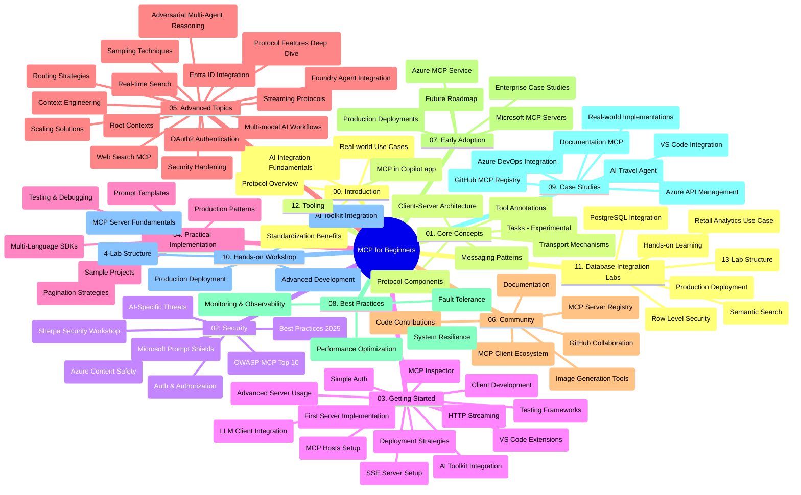

# Протокол Контекста Модели (MCP) для начинающих - Учебное руководство

Это учебное руководство предоставляет обзор структуры репозитория и его содержимого для учебного курса «Протокол Контекста Модели (MCP) для начинающих». Используйте это руководство, чтобы эффективно ориентироваться в репозитории и максимально использовать доступные ресурсы.

## Обзор репозитория

Протокол Контекста Модели (MCP) — это стандартизированная рамочная структура для взаимодействий между моделями ИИ и клиентскими приложениями. Изначально созданный компанией Anthropic, MCP сейчас поддерживается широкой сообществом MCP через официальную организацию на GitHub. Этот репозиторий предоставляет комплексный учебный курс с практическими примерами кода на C#, Java, JavaScript, Python и TypeScript, предназначенный для разработчиков ИИ, архитекторов систем и инженеров-программистов.

## Визуальная карта учебного курса

## Структура репозитория

Репозиторий организован в двенадцать основных разделов, каждый из которых посвящен различным аспектам MCP:

1. **Введение (00-Introduction/)**
   - Обзор Протокола Контекста Модели
   - Почему стандартизация важна в AI пайплайнах
   - Практические кейсы и преимущества

2. **Основные концепции (01-CoreConcepts/)**
   - Клиент-серверная архитектура
   - Ключевые компоненты протокола
   - Шаблоны сообщений в MCP
   - Взгляд в будущее: [Что меняется в MCP: кандидат в релиз 2026-07-28](./01-CoreConcepts/mcp-2026-07-28-release-candidate.md) — безсостояния̆ное ядро протокола, фреймворк расширений и запланированные устаревания Roots/Sampling/Logging в следующей версии спецификации

3. **Безопасность (02-Security/)**
   - Угрозы безопасности в системах на основе MCP
   - Лучшие практики для обеспечения безопасности реализации
   - Стратегии аутентификации и авторизации
   - **Комплексная документация по безопасности**:
     - Лучшие практики безопасности MCP 2025
     - Руководство по реализации Azure Content Safety
     - Контролли безопасности и техники MCP
     - Краткое руководство по лучшим практикам MCP
   - **Ключевые темы безопасности**:
     - Атаки с инъекцией подсказок и отравлением инструментов
     - Перехват сессий и проблемы confused deputy
     - Уязвимости пропуска токенов
     - Чрезмерные разрешения и контроль доступа
     - Безопасность цепочки поставок для компонентов ИИ
     - Интеграция Microsoft Prompt Shields

4. **Начало работы (03-GettingStarted/)**
   - Настройка и конфигурация среды
   - Создание базовых серверов и клиентов MCP
   - Интеграция с существующими приложениями
   - Включает разделы для:
     - Первой реализации сервера
     - Разработки клиента
     - Интеграции LLM клиента
     - Интеграции с VS Code
     - Сервер событий с отправкой (SSE)
     - Продвинутого использования сервера
     - HTTP стриминга
     - Интеграции AI Toolkit
     - Стратегий тестирования
     - Руководства по деплою

5. **Практическая реализация (04-PracticalImplementation/)**
   - Использование SDK на разных языках программирования
   - Методы отладки, тестирования и валидации
   - Создание повторно используемых шаблонов подсказок и рабочих процессов
   - Примеры проектов с образцами реализации

6. **Продвинутые темы (05-AdvancedTopics/)**
   - Техники инженерии контекста
   - Интеграция Foundry агентов
   - Мультимодальные AI рабочие процессы 
   - Демонстрации аутентификации OAuth2
   - Возможности поиска в реальном времени
   - Потоковая передача в реальном времени
   - Реализация корневых контекстов
   - Стратегии маршрутизации
   - Техники сэмплинга
   - Подходы к масштабированию
   - Вопросы безопасности
   - Интеграция безопасности Entra ID
   - Интеграция веб-поиска
   - Противоборствующее многoагентное рассуждение (шаблоны дебатов)

7. **Взносы сообщества (06-CommunityContributions/)**
   - Как вносить вклад в код и документацию
   - Совместная работа через GitHub
   - Улучшения на основе сообщества и обратная связь
   - Использование различных MCP клиентов (Claude Desktop, Cline, VSCode)
   - Работа с популярными MCP серверами, включая генерацию изображений

8. **Уроки раннего принятия (07-LessonsfromEarlyAdoption/)**
   - Реальные реализации и истории успеха
   - Создание и развертывание решений на основе MCP
   - Тенденции и будущая дорожная карта
   - **Руководство по серверам Microsoft MCP**: комплексное руководство по 10 готовым к продакшену серверам Microsoft MCP, включая:
     - Microsoft Learn Docs MCP Server
     - Azure MCP Server (15+ специализированных коннекторов)
     - GitHub MCP Server
     - Azure DevOps MCP Server
     - MarkItDown MCP Server
     - SQL Server MCP Server
     - Playwright MCP Server
     - Dev Box MCP Server
     - Microsoft Foundry MCP Server
     - Microsoft 365 Agents Toolkit MCP Server

9. **Лучшие практики (08-BestPractices/)**
   - Настройка производительности и оптимизация
   - Проектирование отказоустойчивых MCP систем
   - Стратегии тестирования и устойчивости

10. **Кейс-стади (09-CaseStudy/)**
    - **Семь комплексных исследований случаев**, демонстрирующих универсальность MCP в разнообразных сценариях:
    - **Агенты путешествий Azure AI**: оркестрация с множеством агентов с Azure OpenAI и AI Search
    - **Интеграция Azure DevOps**: автоматизация рабочих процессов с обновлениями данных YouTube
    - **Извлечение документов в реальном времени**: Python консольный клиент с HTTP стримингом
    - **Интерактивный генератор учебного плана**: веб-приложение Chainlit с разговорным ИИ
    - **Документация в редакторе**: интеграция VS Code с рабочими процессами GitHub Copilot
    - **Управление API Azure**: интеграция корпоративных API с созданием MCP сервера
    - **Реестр MCP GitHub**: развитие экосистемы и агентная интеграционная платформа
    - Примеры реализации охватывают интеграцию предприятий, производительность разработчиков и развитие экосистемы

11. **Практический семинар (10-StreamliningAIWorkflowsBuildingAnMCPServerWithAIToolkit/)**
    - Комплексный практический семинар, сочетающий MCP с AI Toolkit
    - Создание интеллектуальных приложений, объединяющих ИИ модели с реальными инструментами
    - Практические модули, охватывающие основы, разработку кастомных серверов и стратегии продакшен-деплоя
    - **Структура лабораторий**:
      - Лаборатория 1: Основы MCP сервера
      - Лаборатория 2: Продвинутая разработка MCP сервера
      - Лаборатория 3: Интеграция AI Toolkit
      - Лаборатория 4: Продакшен-деплой и масштабирование
    - Обучение на основе лабораторий с пошаговыми инструкциями

12. **Лаборатории интеграции MCP сервера с базами данных (11-MCPServerHandsOnLabs/)**
    - **Комплексный учебный путь из 13 лабораторий** для создания готовых к продакшену MCP серверов с интеграцией PostgreSQL
    - **Реальная реализация ритейл-аналитики** на примере кейса Zava Retail
    - **Корпоративные паттерны** включая безопасностяя уровня строк (Row Level Security, RLS), семантический поиск и многопользовательский доступ к данным
    - **Полная структура лабораторий**:
      - **Лаборатории 00-03: Основы** - Введение, архитектура, безопасность, настройка среды
      - **Лаборатории 04-06: Создание MCP сервера** - проектирование БД, реализация MCP сервера, разработка инструментов
      - **Лаборатории 07-09: Продвинутые функции** - семантический поиск, тестирование и отладка, интеграция с VS Code
      - **Лаборатории 10-12: Продакшен и лучшие практики** - деплой, мониторинг, оптимизация
    - **Используемые технологии**: фреймворк FastMCP, PostgreSQL, Azure OpenAI, Azure Container Apps, Application Insights
    - **Результаты обучения**: готовые к продакшену MCP серверы, паттерны интеграции баз данных, аналитика на базе ИИ, корпоративная безопасность

13. **Инструменты (12-tooling/)**
    - Узнайте, как использовать MCP в приложении Copilot и других инструментах

## Дополнительные ресурсы

Репозиторий включает поддерживающие ресурсы:

- **Папка изображений**: содержит диаграммы и иллюстрации, используемые в учебном курсе
- **Переводы**: поддержка мультиязычности с автоматическими переводами документации
- **Официальные ресурсы MCP**:
  - [Документация MCP](https://modelcontextprotocol.io/)
  - [Спецификация MCP](https://spec.modelcontextprotocol.io/)
  - [Репозиторий MCP на GitHub](https://github.com/modelcontextprotocol)

## Как использовать этот репозиторий

1. **Последовательное обучение**: Следуйте главам по порядку (с 00 по 11) для структурированного обучения.
2. **Фокус на конкретном языке**: если вас интересует определённый язык программирования, изучайте директории с примерами реализации на предпочтительном языке.
3. **Практическая реализация**: начните с раздела «Начало работы», чтобы настроить среду и создать первый MCP сервер и клиента.
4. **Продвинутый обзор**: когда освоитесь с основами, переходите к продвинутым темам для расширения знаний.
5. **Участие сообщества**: присоединяйтесь к сообществу MCP через обсуждения на GitHub и каналы Discord, чтобы связаться с экспертами и коллегами-разработчиками.

## Клиенты и инструменты MCP

Учебный курс охватывает различные клиенты и инструменты MCP:

1. **Официальные клиенты**:
   - Visual Studio Code 
   - MCP в Visual Studio Code
   - Claude Desktop
   - Claude в VSCode 
   - Claude API

2. **Клиенты сообщества**:
   - Cline (терминальный)
   - Cursor (редактор кода)
   - ChatMCP
   - Windsurf

3. **Инструменты управления MCP**:
   - MCP CLI
   - MCP Manager
   - MCP Linker
   - MCP Router

## Популярные MCP сервера

В репозитории представлены различные MCP серверы, включая:

1. **Официальные серверы Microsoft MCP**:
   - Microsoft Learn Docs MCP Server
   - Azure MCP Server (15+ специализированных коннекторов)
   - GitHub MCP Server
   - Azure DevOps MCP Server
   - MarkItDown MCP Server
   - SQL Server MCP Server
   - Playwright MCP Server
   - Dev Box MCP Server
   - Microsoft Foundry MCP Server
   - Microsoft 365 Agents Toolkit MCP Server

2. **Официальные серверы-референсы**:
   - Файловая система
   - Fetch
   - Память
   - Последовательное мышление

3. **Генерация изображений**:
   - Azure OpenAI DALL-E 3
   - Stable Diffusion WebUI
   - Replicate

4. **Инструменты разработки**:
   - Git MCP
   - Управление терминалом
   - Ассистент кода

5. **Специализированные серверы**:
   - Salesforce
   - Microsoft Teams
   - Jira & Confluence

## Вклад в проект

Этот репозиторий приветствует вклады от сообщества. См. раздел «Взносы сообщества» для рекомендаций по эффективному участию в экосистеме MCP.

----

*Это учебное руководство было обновлено 5 февраля 2026 года и отражает последнюю спецификацию MCP от 25-11-2025, предоставляя обзор репозитория на эту дату. Содержимое репозитория может обновляться после этой даты.*

*Дополнение (2 июля 2026): урок по кандидатуре в релиз MCP Спецификации `2026-07-28` был добавлен в раздел [01-CoreConcepts](./01-CoreConcepts/mcp-2026-07-28-release-candidate.md); базовая версия учебного курса остается 25-11-2025 до выхода новой спецификации.*

---

<!-- CO-OP TRANSLATOR DISCLAIMER START -->
**Отказ от ответственности**:
Этот документ был переведен с использованием сервиса машинного перевода [Co-op Translator](https://github.com/Azure/co-op-translator). Несмотря на наши усилия по обеспечению точности, имейте в виду, что автоматический перевод может содержать ошибки или неточности. Оригинальный документ на его исходном языке следует считать авторитетным источником. Для получения критически важной информации рекомендуется обратиться к профессиональному человеческому переводу. Мы не несем ответственности за любые недоразумения или неправильные толкования, возникшие в результате использования этого перевода.
<!-- CO-OP TRANSLATOR DISCLAIMER END -->