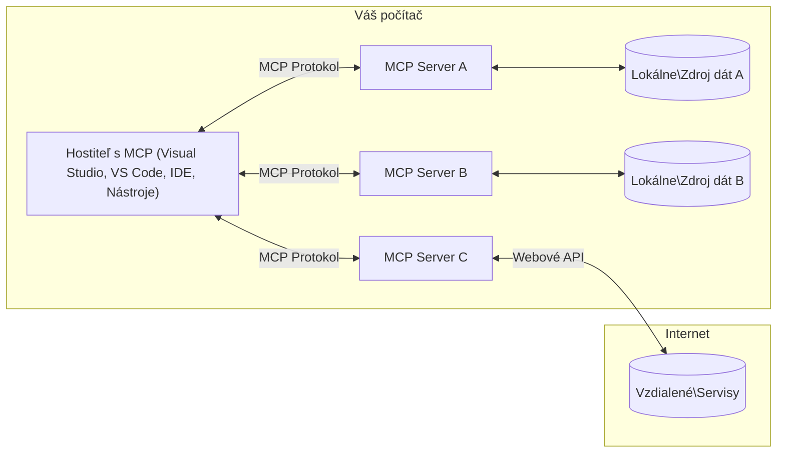

# MCP Základné koncepty: Ovládnutie protokolu Model Context pre integráciu AI

[](https://youtu.be/earDzWGtE84)

_(Kliknite na obrázok vyššie pre zobrazenie videa tejto lekcie)_

[Model Context Protocol (MCP)](https://github.com/modelcontextprotocol) je výkonný, štandardizovaný rámec, ktorý optimalizuje komunikáciu medzi veľkými jazykovými modelmi (LLMs) a externými nástrojmi, aplikáciami a zdrojmi dát. 
Tento sprievodca vás prevedie základnými konceptmi MCP. Naučíte sa o jeho klient-server architektúre, základných komponentoch, mechanikách komunikácie a najlepších postupoch implementácie.

- **Explicitný súhlas používateľa**: Všetky prístupy k dátam a operácie vyžadujú explicitné schválenie používateľa pred vykonaním. Používatelia musia jasne rozumieť, aké dáta budú prístupné a aké akcie budú vykonané, s podrobnou kontrolou oprávnení a povolení.

- **Ochrana súkromia dát**: Dáta používateľov sú zverejňované iba s explicitným súhlasom a musia byť chránené robustnými prístupovými kontrolami počas celého životného cyklu interakcie. Implementácie musia zabrániť neautorizovanému prenosu dát a udržiavať prísne hranice ochrany súkromia.

- **Bezpečnosť spúšťania nástrojov**: Každé spustenie nástroja vyžaduje explicitný súhlas používateľa s jasným pochopením funkcie nástroja, parametrov a možného dopadu. Robustné bezpečnostné hranice musia zabrániť neúmyselnému, nebezpečnému alebo škodlivému spusteniu nástrojov.

- **Bezpečnosť transportnej vrstvy**: Všetky komunikačné kanály by mali používať vhodné mechanizmy šifrovania a autentifikácie. Vzdialené pripojenia by mali implementovať bezpečné transportné protokoly a riadne spravovanie poverení.

#### Pokyny na implementáciu:

- **Správa oprávnení**: Implementujte jemnozrnné systémy oprávnení, ktoré umožňujú používateľom kontrolovať, ktoré servery, nástroje a zdroje sú dostupné
- **Autentifikácia a autorizácia**: Používajte bezpečné metódy autentifikácie (OAuth, API kľúče) s riadnym spravovaním tokenov a ich platnosti  
- **Validácia vstupov**: Validujte všetky parametre a vstupy dát podľa definovaných schém, aby ste predišli útokom typu injection
- **Auditné záznamy**: Viedajte komplexné záznamy všetkých operácií pre bezpečnostné monitorovanie a súlad

## Prehľad

Táto lekcia skúma základnú architektúru a komponenty, ktoré tvoria ekosystém Model Context Protocol (MCP). Naučíte sa o klient-server architektúre, kľúčových komponentoch a komunikačných mechanizmoch, ktoré poháňajú interakcie MCP.

## Kľúčové učebné ciele

Na konci tejto lekcie budete:

- Rozumieť klient-server architektúre MCP.
- Identifikovať úlohy a zodpovednosti Hostiteľov, Klientov a Serverov.
- Analyzovať hlavné vlastnosti, ktoré robia MCP flexibilnou integračnou vrstvou.
- Naučiť sa, ako prebieha tok informácií v ekosystéme MCP.
- Získať praktické poznatky prostredníctvom príkladov kódu v .NET, Java, Python a JavaScript.

## Architektúra MCP: Hlbší pohľad

Ekosystém MCP je postavený na modeli klient-server. Táto modulárna štruktúra umožňuje AI aplikáciám efektívne komunikovať s nástrojmi, databázami, API a kontextovými zdrojmi. Rozoberme si túto architektúru na jej základné komponenty.

V jadre MCP nasleduje klient-server architektúru, kde hostiteľská aplikácia môže pripojiť k viacerým serverom:



- **Hostitelia MCP**: Programy ako VSCode, Claude Desktop, IDE alebo AI nástroje, ktoré chcú pristupovať k dátam cez MCP
- **Klienti MCP**: Klienti protokolu, ktorí udržiavajú 1:1 spojenia so servermi
- **Servery MCP**: Ľahké programy, ktoré každý sprístupňujú špecifické schopnosti cez štandardizovaný Model Context Protocol
- **Lokálne zdroje dát**: Súbory, databázy a služby vo vašom počítači, ku ktorým môžu MCP servery bezpečne pristupovať
- **Vzdialené služby**: Externé systémy dostupné cez internet, ku ktorým sa MCP servery môžu pripojiť cez API.

MCP Protokol je vyvíjajúci sa štandard s verziami podľa dátumu (formát RRRR-MM-DD). Aktuálna verzia protokolu je **2025-11-25**. Najnovšie aktualizácie nájdete v [špecifikácii protokolu](https://modelcontextprotocol.io/specification/2025-11-25/)

> **Pohľad do budúcnosti:** kandidát na vydanie novej špecifikácie, **2026-07-28**, bol oznámený v máji 2026 a je plánovaný na vydanie 28. júla 2026. Robí protokol bezstavovým na transportnej vrstve (odstraňuje `initialize` handshake a session ID), formalizuje framework rozšírení a znižuje význam koreňov, vzorkovania a logovania v prospech novších vzorov. Kompletný rozbor nájdete v [Čo sa mení v MCP: Kandidát na vydanie 2026-07-28](./mcp-2026-07-28-release-candidate.md).

### 1. Hostitelia

V Model Context Protocol (MCP) sú **Hostitelia** AI aplikácie, ktoré slúžia ako primárne rozhranie, cez ktoré používatelia komunikujú s protokolom. Hostitelia koordinujú a spravujú pripojenia k viacerým MCP serverom vytváraním vyhradených MCP klientov pre každé serverové pripojenie. Príklady Hostiteľov zahŕňajú:

- **AI Aplikácie**: Claude Desktop, Visual Studio Code, Claude Code
- **Vývojové prostredia**: IDE a editory kódu s MCP integráciou  
- **Vlastné aplikácie**: Účelové AI agenti a nástroje

**Hostitelia** sú aplikácie, ktoré koordinujú interakcie AI modelov. Oni:

- **Orchestrujú AI modely**: Vykonávajú alebo interagujú s LLM na generovanie odpovedí a koordináciu AI pracovných tokov
- **Spravujú klientské pripojenia**: Vytvárajú a udržiavajú jedného MCP klienta na každé MCP serverové pripojenie
- **Riadiace používateľské rozhranie**: Riadia tok konverzácie, používateľské interakcie a prezentáciu odpovedí  
- **Uplatňujú bezpečnosť**: Kontrolujú oprávnenia, bezpečnostné obmedzenia a autentifikáciu
- **Riadia súhlas používateľa**: Spravujú schválenia používateľa pre zdieľanie dát a spustenie nástrojov


### 2. Klienti

**Klienti** sú kľúčové komponenty, ktoré udržiavajú vyhradené jedno-na-jedno spojenia medzi Hostiteľmi a MCP servermi. Každý MCP klient je vytvorený hosťom na pripojenie k špecifickému MCP serveru, čím zabezpečuje organizované a bezpečné komunikačné kanály. Viac klientov umožňuje Hostiteľom pripojenie k viacerým serverom súčasne.

**Klienti** sú komponenty konektora v rámci hostiteľskej aplikácie. Oni:

- **Protokolová komunikácia**: Posielajú JSON-RPC 2.0 požiadavky serverom s promptami a inštrukciami
- **Vyjednávanie schopností**: Vyjednávajú podporované funkcie a verzie protokolu so servermi počas inicializácie
- **Spustenie nástroja**: Spravujú požiadavky na spustenie nástrojov od modelov a spracúvajú odpovede
- **Aktualizácie v reálnom čase**: Spracúvajú notifikácie a aktualizácie v reálnom čase od serverov
- **Spracovanie odpovedí**: Spracúvajú a formátujú odpovede serverov na zobrazenie používateľom

### 3. Servery

**Servery** sú programy, ktoré poskytujú kontext, nástroje a schopnosti MCP klientom. Môžu byť spustené lokálne (na rovnakom stroji ako Hostiteľ) alebo vzdialene (na externých platformách) a sú zodpovedné za spracovanie požiadaviek klientov a poskytovanie štruktúrovaných odpovedí. Servery sprístupňujú konkrétne funkcie cez štandardizovaný Model Context Protocol.

**Servery** sú služby poskytujúce kontext a schopnosti. Oni:

- **Registrácia funkcií**: Registrujú a sprístupňujú dostupné primitívy (zdroje, prompt, nástroje) klientom
- **Spracovanie požiadaviek**: Prijímajú a vykonávajú volania nástrojov, požiadavky na zdroje a prompt od klientov
- **Poskytovanie kontextu**: Poskytujú kontextuálne informácie a dáta na zlepšenie odpovedí modelu
- **Správa stavu**: Udržiavajú stav relácie a spracovávajú stavové interakcie podľa potreby

- **Notifikácie v reálnom čase**: Posielajte notifikácie o zmenách a aktualizáciách schopností pripojeným klientom

Servery môžu vyvíjať ľubovoľní vývojári na rozšírenie schopností modelu špecializovanou funkcionalitou a podporujú scenáre nasadenia lokálne aj na diaľku.

### 4. Serverové primitívy

Servery v protokole Model Context Protocol (MCP) poskytujú tri základné **primitívy**, ktoré definujú fundamentálne stavebné prvky pre bohaté interakcie medzi klientmi, hostiteľmi a jazykovými modelmi. Tieto primitívy určujú typy kontextových informácií a dostupné akcie cez protokol.

Servers MCP môžu vystaviť ľubovoľnú kombináciu troch základných primítiv:

#### Zdroje

**Zdroje** sú dátové zdroje poskytujúce kontextové informácie AI aplikáciám. Predstavujú statický alebo dynamický obsah, ktorý môže zlepšiť porozumenie modelu a rozhodovanie:

- **Kontextové dáta**: Štruktúrované informácie a kontext pre spotrebu AI modelom
- **Znalostné bázy**: Repozitáre dokumentov, články, príručky a vedecké práce
- **Lokálne dátové zdroje**: Súbory, databázy a informácie o lokálnom systéme  
- **Externé dáta**: Odpovede API, webové služby a vzdialené systémové dáta
- **Dynamický obsah**: Dáta v reálnom čase, ktoré sa aktualizujú na základe externých podmienok

Zdroje sú identifikované URI a podporujú vyhľadávanie prostredníctvom metód `resources/list` a získavanie pomocou `resources/read`:

```text
file://documents/project-spec.md
database://production/users/schema
api://weather/current
```

#### Výzvy (Prompts)

**Výzvy (Prompts)** sú opakovane použiteľné šablóny, ktoré pomáhajú štruktúrovať interakcie s jazykovými modelmi. Poskytujú štandardizované vzory interakcií a šablónové pracovné postupy:

- **Interakcie založené na šablónach**: Predštruktúrované správy a začiatky konverzácií
- **Šablóny pracovných postupov**: Štandardizované sekvencie pre bežné úlohy a interakcie
- **Príklady s malým počtom vzoriek (Few-shot)**: Šablóny založené na príkladoch pre inštrukcie modelu
- **Systémové výzvy**: Základné výzvy definujúce správanie a kontext modelu
- **Dynamické šablóny**: Parametrizované výzvy, ktoré sa prispôsobujú konkrétnemu kontextu

Výzvy podporujú substitúciu premenných a môžu byť vyhľadávané cez `prompts/list` a získavané cez `prompts/get`:

```markdown
Generate a {{task_type}} for {{product}} targeting {{audience}} with the following requirements: {{requirements}}
```

#### Nástroje

**Nástroje** sú vykonateľné funkcie, ktoré môžu AI modely vyvolať na vykonanie konkrétnych akcií. Predstavujú "slovesá" ekosystému MCP, umožňujúc modelom interagovať s externými systémami:

- **Vykonateľné funkcie**: Osobitné operácie, ktoré môžu modely vyvolať s konkrétnymi parametrami
- **Integrácia externých systémov**: Volania API, dopyty do databázy, operácie so súbormi, výpočty
- **Jedinečná identita**: Každý nástroj má odlišný názov, popis a schému parametrov
- **Štruktúrované vstupy a výstupy**: Nástroje prijímajú validované parametre a vracajú štruktúrované, typované odpovede
- **Akčné schopnosti**: Umožňujú modelom vykonávať reálne akcie a získavať aktuálne dáta

Nástroje sú definované pomocou JSON Schema pre validáciu parametrov, vyhľadávané cez `tools/list` a vykonávané cez `tools/call`. Nástroje môžu obsahovať aj **ikony** ako ďalšie metadáta pre lepšiu prezentáciu v UI.

**Anotácie nástrojov**: Nástroje podporujú behaviorálne anotácie (napr. `readOnlyHint`, `destructiveHint`), ktoré popisujú, či je nástroj len na čítanie alebo destruktívny, čo pomáha klientom pri informovanom rozhodovaní o vykonaní nástroja.

Príklad definície nástroja:

```typescript
server.tool(
  "search_products", 
  {
    query: z.string().describe("Search query for products"),
    category: z.string().optional().describe("Product category filter"),
    max_results: z.number().default(10).describe("Maximum results to return")
  }, 
  async (params) => {
    // Vykonajte vyhľadávanie a vráťte štruktúrované výsledky
    return await productService.search(params);
  }
);
```

## Klientské primitívy

V protokole Model Context Protocol (MCP) môžu **klienti** vystaviť primitívy, ktoré umožňujú serverom požadovať ďalšie schopnosti od hostiteľskej aplikácie. Tieto klientské primitívy umožňujú bohatšie, interaktívnejšie implementácie serverov, ktoré môžu pristupovať k schopnostiam AI modelov a interakciám používateľov.

### Sampling (Vzorkovanie)

> **Oznámenie o zastaraní:** kandidatúra na vydanie z `2026-07-28` označuje Sampling ako zastaraný v prospech priamej integrácie s API poskytovateľov LLM. Pokračuje v práci v `2025-11-25` a aspoň rok po akomkoľvek zastaraní, ale nové návrhy by mali preferovať náhradný vzor. Pozri [What’s Changing in MCP: The 2026-07-28 Release Candidate](./mcp-2026-07-28-release-candidate.md).

**Sampling** umožňuje serverom požadovať dokončenia jazykového modelu z AI aplikácie klienta. Tento primitív umožňuje serverom pristupovať k schopnostiam LLM bez potreby vkladať vlastné závislosti na modeli:

- **Nezávislý prístup k modelu**: Servery môžu žiadať dokončenia bez zahrnutia LLM SDK alebo správy prístupu k modelu
- **AI iniciovaná serverom**: Umožňuje serverom autonómne generovať obsah použitím modelu klienta
- **Rekurzívne interakcie s LLM**: Podpora komplexných scenárov, kde servery potrebujú AI asistenciu na spracovanie
- **Generovanie dynamického obsahu**: Umožňuje serverom vytvárať kontextové odpovede pomocou modelu hostiteľa
- **Podpora volania nástrojov**: Servery môžu zahrnúť parametre `tools` a `toolChoice` na umožnenie modelu klienta vyvolávať nástroje počas sampling

Sampling sa inicializuje prostredníctvom metódy `sampling/complete`, kde servery posielajú požiadavky na dokončenie klientom.

### Roots (Korene)

> **Oznámenie o zastaraní:** kandidatúra na vydanie z `2026-07-28` označuje Roots ako zastarané v prospech parametrov nástrojov, URI zdrojov alebo serverovej konfigurácie. Pokračuje v práci v `2025-11-25` a aspoň rok po akomkoľvek zastaraní. Pozri [What’s Changing in MCP: The 2026-07-28 Release Candidate](./mcp-2026-07-28-release-candidate.md).

**Roots** poskytujú štandardizovaný spôsob, ako klienti môžu vystaviť hranice súborového systému serverom, čo pomáha serverom pochopiť, ku ktorým adresárom a súborom majú prístup:

- **Hranice súborového systému**: Definujú hranice, v ktorých môžu servery operovať v rámci súborového systému
- **Kontrola prístupu**: Pomáhajú serverom rozumieť, ku ktorým adresárom a súborom majú povolenie pristupovať
- **Dynamické aktualizácie**: Klienti môžu notifikovať servery o zmene zoznamu rootov
- **Identifikácia pomocou URI**: Roots používajú URI s protokolom `file://` na identifikáciu prístupných adresárov a súborov

Roots sa vyhľadávajú cez metódu `roots/list`, pričom klienti posielajú `notifications/roots/list_changed`, keď sa roots zmenia.

### Zhromažďovanie informácií (Elicitation)  

**Zhromažďovanie informácií (Elicitation)** umožňuje serverom požadovať ďalšie informácie alebo potvrdenie od používateľov prostredníctvom rozhrania klienta:

- **Požiadavky na vstup používateľa**: Servery môžu žiadať dodatočné informácie, keď sú potrebné na vykonanie nástrojov
- **Potvrdzovacie dialógy**: Požadujú súhlas používateľa na citlivé alebo zásadné operácie
- **Interaktívne pracovné postupy**: Umožňujú serverom vytvárať používateľské interakcie krok za krokom
- **Dynamické zberanie parametrov**: Zhromažďujú chýbajúce alebo voliteľné parametre počas vykonávania nástroja

Požiadavky na elicitation sa robia pomocou metódy `elicitation/request` na zhromažďovanie používateľského vstupu prostredníctvom rozhrania klienta.

**Elicitation v režime URL**: Servery môžu tiež požadovať používateľské interakcie založené na URL, ktoré umožňujú serverom smerovať používateľov na externé webové stránky na autentifikáciu, potvrdenie alebo zadávanie dát.

### Logovanie


> **Upozornenie na zastaranie:** kandidát na vydanie `2026-07-28` označuje Logging za zastaraný v prospech `stderr` pre stdio transporty a OpenTelemetry pre štruktúrovanú observabilitu. Pokračuje vo fungovaní v `2025-11-25` a aspoň rok po akomkoľvek zastaraní. Pozri [Čo sa mení v MCP: Kandidát na vydanie 2026-07-28](./mcp-2026-07-28-release-candidate.md).

**Logging** umožňuje serverom posielať klientom štruktúrované logovacie správy pre ladenie, monitorovanie a prevádzkovú viditeľnosť:

- **Podpora ladenia**: Umožniť serverom poskytovať podrobné logy vykonávania na riešenie problémov
- **Prevádzkové monitorovanie**: Posielať aktualizácie stavu a metriky výkonnosti klientom
- **Hlásenie chýb**: Poskytnúť podrobný kontext chýb a diagnostické informácie
- **Auditné stopy**: Vytvárať komplexné logy operácií a rozhodnutí servera

Logovacie správy sú posielané klientom, aby poskytli transparentnosť prevádzky servera a uľahčili ladenie.

## Tok informácií v MCP

Protokol Model Context Protocol (MCP) definuje štruktúrovaný tok informácií medzi hosťami, klientmi, servermi a modelmi. Pochopenie tohto toku pomáha objasniť, ako sa spracúvajú užívateľské požiadavky a ako sa externé nástroje a údaje integrujú do odpovedí modelu.

- **Hosť inicializuje spojenie**  
  Hostiteľská aplikácia (napríklad IDE alebo chatové rozhranie) nadviaže spojenie so serverom MCP, typicky cez STDIO, WebSocket alebo iný podporovaný transport.

- **Vyjednávanie schopností**  
  Klient (vložený v hostiteľovi) a server si vymieňajú informácie o svojich podporovaných funkciách, nástrojoch, zdrojoch a verziách protokolu. To zabezpečuje, že obe strany rozumejú, aké schopnosti sú k dispozícii počas relácie.

- **Užívateľská požiadavka**  
  Užívateľ komunikuje s hostiteľom (napr. zadá prompt alebo príkaz). Hosť zhromažďuje tento vstup a odovzdáva ho klientovi na spracovanie.

- **Použitie zdroja alebo nástroja**  
  - Klient môže žiadať o ďalší kontext alebo zdroje zo servera (napríklad súbory, databázové záznamy alebo články z databázy vedomostí) na obohatenie porozumenia modelu.
  - Ak model určí, že je potrebný nástroj (napr. na získanie dát, vykonanie výpočtu alebo volanie API), klient odošle serveru požiadavku na spustenie nástroja, špecifikujúc názov nástroja a parametre.

- **Vykonanie servera**  
  Server prijme požiadavku na zdroj alebo nástroj, vykoná potrebné operácie (napr. spustenie funkcie, dotaz na databázu alebo načítanie súboru) a vráti výsledky klientovi v štruktúrovanom formáte.

- **Generovanie odpovede**  
  Klient integruje odpovede servera (údaje zdrojov, výstupy nástrojov atď.) do prebiehajúcej interakcie modelu. Model používa tieto informácie na vytvorenie komplexnej a kontextuálne relevantnej odpovede.

- **Prezentácia výsledkov**  
  Hosť prijme konečný výstup od klienta a prezentuje ho užívateľovi, často vrátane textu vytvoreného modelom a akýchkoľvek výsledkov zo spustení nástrojov alebo vyhľadávania zdrojov.

Tento tok umožňuje MCP podporovať pokročilé, interaktívne a kontextovo uvedomelé AI aplikácie hladkým prepojením modelov s externými nástrojmi a zdrojmi dát.

## Architektúra protokolu a vrstvy

MCP pozostáva z dvoch odlišných architektonických vrstiev, ktoré spolupracujú na poskytnutí kompletného rámca pre komunikáciu:

### Dáta vrstva

**Vrstva dát** implementuje základný protokol MCP pomocou **JSON-RPC 2.0** ako jeho základu. Táto vrstva definuje štruktúru správ, sémantiku a vzory interakcie:

#### Hlavné komponenty:

- **Protokol JSON-RPC 2.0**: Všetka komunikácia používa štandardizovaný formát správ JSON-RPC 2.0 pre volania metód, odpovede a notifikácie
- **Manažment životného cyklu**: Rieši inicializáciu spojenia, vyjednávanie schopností a ukončenie relácie medzi klientmi a servermi
- **Serverové primitíva**: Umožňuje serverom poskytovať základnú funkcionalitu cez nástroje, zdroje a prompty
- **Klientové primitíva**: Umožňuje serverom žiadať vzorkovanie z LLM, vyžiadať užívateľský vstup a posielať logovacie správy
- **Real-time notifikácie**: Podporuje asynchrónne notifikácie pre dynamické aktualizácie bez polling

#### Kľúčové vlastnosti:

- **Vyjednávanie verzie protokolu**: Používa dátumové verzovanie (YYYY-MM-DD) na zabezpečenie kompatibility
- **Obnovenie schopností**: Klienti a servery si počas inicializácie vymieňajú informácie o podporovaných funkciách
- **Stavové relácie**: Udržiava stav spojenia v priebehu viacerých interakcií pre kontinuitu kontextu

### Transportná vrstva

**Transportná vrstva** spravuje komunikačné kanály, rámcovanie správ a autentifikáciu medzi účastníkmi MCP:

#### Podporované transportné mechanizmy:

1. **STDIO transport**:
   - Používa štandardné vstupné/výstupné prúdy pre priamu komunikáciu procesov
   - Optimálny pre lokálne procesy na rovnakom zariadení bez sieťovej réžie
   - Bežne používaný pre lokálne implementácie MCP serverov

2. **Streamovateľný HTTP transport**:
   - Používa HTTP POST pre správy klienta ku serveru  
   - Voliteľné Server-Sent Events (SSE) pre streamovanie zo servera ku klientovi
   - Umožňuje vzdialenú komunikáciu serverov cez siete
   - Podporuje štandardnú HTTP autentifikáciu (bearer tokeny, API kľúče, vlastné hlavičky)
   - MCP odporúča OAuth pre bezpečnú autentifikáciu založenú na tokenoch

#### Abstrakcia transportu:

Transportná vrstva abstrahuje detaily komunikácie od dátovej vrstvy, čím umožňuje rovnaký formát správ JSON-RPC 2.0 pre všetky transportné mechanizmy. Táto abstrakcia umožňuje aplikáciám hladko prepínať medzi lokálnymi a vzdialenými servermi.

### Bezpečnostné úvahy

Implementácie MCP musia dodržiavať viacero kľúčových bezpečnostných princípov na zaistenie bezpečných, dôveryhodných a zabezpečených interakcií v celom protokole:

- **Súhlas užívateľa a kontrola**: Užívateľ musí poskytnúť explicitný súhlas pred akýmkoľvek prístupom k dátam alebo vykonaním operácií. Mal by mať jasnú kontrolu nad tým, aké dáta sú zdieľané a ktoré akcie sú autorizované, podporené intuitívnymi užívateľskými rozhraniami na prehľadávanie a schvaľovanie aktivít.

- **Súkromie dát**: Užívateľské dáta môžu byť zverejnené len s explicitným súhlasom a musia byť chránené vhodnými prístupovými kontrolami. Implementácie MCP musia zabezpečiť ochranu pred neoprávneným prenosom dát a zachovať súkromie v priebehu všetkých interakcií.

- **Bezpečnosť nástrojov**: Pred spustením akéhokoľvek nástroja je potrebný explicitný súhlas užívateľa. Užívateľ by mal jasne rozumieť funkčnosti každého nástroja a musia byť presadzované robustné bezpečnostné hranice, aby sa zabránilo neúmyselnému alebo nebezpečnému spusteniu nástroja.

Dodržiavaním týchto bezpečnostných princípov MCP zabezpečuje dôveru užívateľov, ochranu súkromia a bezpečnosť naprieč všetkými interakciami protokolu a zároveň umožňuje silné AI integrácie.

## Ukážky kódu: Kľúčové komponenty

Nižšie sú uvedené ukážky kódu v niekoľkých populárnych programovacích jazykoch, ktoré ilustrujú, ako implementovať kľúčové komponenty a nástroje MCP servera.

### Príklad .NET: Vytvorenie jednoduchého MCP servera s nástrojmi

Tu je praktický príklad v .NET, ktorý demonštruje, ako implementovať jednoduchý MCP server s vlastnými nástrojmi. Tento príklad ukazuje, ako definovať a registrovať nástroje, spracovávať požiadavky a pripojiť server používajúc Model Context Protocol.

```csharp
using System;
using System.Threading.Tasks;
using ModelContextProtocol.Server;
using ModelContextProtocol.Server.Transport;
using ModelContextProtocol.Server.Tools;

public class WeatherServer
{
    public static async Task Main(string[] args)
    {
        // Create an MCP server
        var server = new McpServer(
            name: "Weather MCP Server",
            version: "1.0.0"
        );
        
        // Register our custom weather tool
        server.AddTool<string, WeatherData>("weatherTool", 
            description: "Gets current weather for a location",
            execute: async (location) => {
                // Call weather API (simplified)
                var weatherData = await GetWeatherDataAsync(location);
                return weatherData;
            });
        
        // Connect the server using stdio transport
        var transport = new StdioServerTransport();
        await server.ConnectAsync(transport);
        
        Console.WriteLine("Weather MCP Server started");
        
        // Keep the server running until process is terminated
        await Task.Delay(-1);
    }
    
    private static async Task<WeatherData> GetWeatherDataAsync(string location)
    {
        // This would normally call a weather API
        // Simplified for demonstration
        await Task.Delay(100); // Simulate API call
        return new WeatherData { 
            Temperature = 72.5,
            Conditions = "Sunny",
            Location = location
        };
    }
}

public class WeatherData
{
    public double Temperature { get; set; }
    public string Conditions { get; set; }
    public string Location { get; set; }
}
```

### Príklad Java: MCP serverové komponenty

Tento príklad demonštruje rovnakú registráciu MCP servera a nástroja ako vyššie uvedený príklad .NET, ale implementovaný v Jave.

```java
import io.modelcontextprotocol.server.McpServer;
import io.modelcontextprotocol.server.McpToolDefinition;
import io.modelcontextprotocol.server.transport.StdioServerTransport;
import io.modelcontextprotocol.server.tool.ToolExecutionContext;
import io.modelcontextprotocol.server.tool.ToolResponse;

public class WeatherMcpServer {
    public static void main(String[] args) throws Exception {
        // Vytvorte MCP server
        McpServer server = McpServer.builder()
            .name("Weather MCP Server")
            .version("1.0.0")
            .build();
            
        // Zaregistrujte nástroj na počasie
        server.registerTool(McpToolDefinition.builder("weatherTool")
            .description("Gets current weather for a location")
            .parameter("location", String.class)
            .execute((ToolExecutionContext ctx) -> {
                String location = ctx.getParameter("location", String.class);
                
                // Získajte údaje o počasí (zjednodušené)
                WeatherData data = getWeatherData(location);
                
                // Vráťte formátovanú odpoveď
                return ToolResponse.content(
                    String.format("Temperature: %.1f°F, Conditions: %s, Location: %s", 
                    data.getTemperature(), 
                    data.getConditions(), 
                    data.getLocation())
                );
            })
            .build());
        
        // Pripojte server pomocou stdio transportu
        try (StdioServerTransport transport = new StdioServerTransport()) {
            server.connect(transport);
            System.out.println("Weather MCP Server started");
            // Udržujte server v prevádzke až do ukončenia procesu
            Thread.currentThread().join();
        }
    }
    
    private static WeatherData getWeatherData(String location) {
        // Implementácia by zavolala API počasia
        // Zjednodušené pre ukážkové účely
        return new WeatherData(72.5, "Sunny", location);
    }
}

class WeatherData {
    private double temperature;
    private String conditions;
    private String location;
    
    public WeatherData(double temperature, String conditions, String location) {
        this.temperature = temperature;
        this.conditions = conditions;
        this.location = location;
    }
    
    public double getTemperature() {
        return temperature;
    }
    
    public String getConditions() {
        return conditions;
    }
    
    public String getLocation() {
        return location;
    }
}
```

### Príklad Python: Budovanie MCP servera

Tento príklad používa fastmcp, preto ho najskôr nainštalujte:

```python
pip install fastmcp
```
Ukážka kódu:

```python
#!/usr/bin/env python3
import asyncio
from fastmcp import FastMCP
from fastmcp.transports.stdio import serve_stdio

# Vytvorte server FastMCP
mcp = FastMCP(
    name="Weather MCP Server",
    version="1.0.0"
)

@mcp.tool()
def get_weather(location: str) -> dict:
    """Gets current weather for a location."""
    return {
        "temperature": 72.5,
        "conditions": "Sunny",
        "location": location
    }

# Alternatívny prístup pomocou triedy
class WeatherTools:
    @mcp.tool()
    def forecast(self, location: str, days: int = 1) -> dict:
        """Gets weather forecast for a location for the specified number of days."""
        return {
            "location": location,
            "forecast": [
                {"day": i+1, "temperature": 70 + i, "conditions": "Partly Cloudy"}
                for i in range(days)
            ]
        }

# Zaregistrujte nástroje triedy
weather_tools = WeatherTools()

# Spustite server
if __name__ == "__main__":
    asyncio.run(serve_stdio(mcp))
```

### Príklad JavaScript: Vytvorenie MCP servera

Tento príklad ukazuje vytvorenie MCP servera v JavaScript a ako zaregistrovať dva nástroje súvisiace s počasím.

```javascript
// Používanie oficiálneho SDK Model Context Protocol
import { McpServer } from "@modelcontextprotocol/sdk/server/mcp.js";
import { StdioServerTransport } from "@modelcontextprotocol/sdk/server/stdio.js";
import { z } from "zod"; // Pre overenie parametrov

// Vytvorte MCP server
const server = new McpServer({
  name: "Weather MCP Server",
  version: "1.0.0"
});

// Definujte nástroj na počasie
server.tool(
  "weatherTool",
  {
    location: z.string().describe("The location to get weather for")
  },
  async ({ location }) => {
    // Toto by bežne volalo API počasia
    // Zjednodušené pre demonštráciu
    const weatherData = await getWeatherData(location);
    
    return {
      content: [
        { 
          type: "text", 
          text: `Temperature: ${weatherData.temperature}°F, Conditions: ${weatherData.conditions}, Location: ${weatherData.location}` 
        }
      ]
    };
  }
);

// Definujte nástroj na predpoveď
server.tool(
  "forecastTool",
  {
    location: z.string(),
    days: z.number().default(3).describe("Number of days for forecast")
  },
  async ({ location, days }) => {
    // Toto by bežne volalo API počasia
    // Zjednodušené pre demonštráciu
    const forecast = await getForecastData(location, days);
    
    return {
      content: [
        { 
          type: "text", 
          text: `${days}-day forecast for ${location}: ${JSON.stringify(forecast)}` 
        }
      ]
    };
  }
);

// Pomocné funkcie
async function getWeatherData(location) {
  // Simulujte volanie API
  return {
    temperature: 72.5,
    conditions: "Sunny",
    location: location
  };
}

async function getForecastData(location, days) {
  // Simulujte volanie API
  return Array.from({ length: days }, (_, i) => ({
    day: i + 1,
    temperature: 70 + Math.floor(Math.random() * 10),
    conditions: i % 2 === 0 ? "Sunny" : "Partly Cloudy"
  }));
}

// Pripojte server pomocou stdio transportu
const transport = new StdioServerTransport();
server.connect(transport).catch(console.error);

console.log("Weather MCP Server started");
```

Tento príklad v JavaScripte demonštruje, ako vytvoriť MCP server pomocou Model Context Protocol SDK. Ukazuje, ako zaregistrovať dva nástroje s názvami `weatherTool` a `forecastTool` a sprístupniť ich klientom MCP cez `StdioServerTransport`.

## Bezpečnosť a autorizácia

MCP obsahuje niekoľko vstavaných konceptov a mechanizmov na riadenie bezpečnosti a autorizácie v celom protokole:

1. **Riadenie povolení nástrojov**:  
  Klienti môžu určiť, ktoré nástroje model môže počas relácie používať. Tým sa zabezpečí, že sú prístupné len explicitne autorizované nástroje, čím sa znižuje riziko neúmyselných alebo nebezpečných operácií. Povolenia môžu byť konfigurované dynamicky na základe užívateľských preferencií, organizačných politík alebo kontextu interakcie.

2. **Autentifikácia**:  
  Servery môžu vyžadovať autentifikáciu pred poskytnutím prístupu k nástrojom, zdrojom alebo citlivým operáciám. Môže ísť o API kľúče, OAuth tokeny alebo iné autentifikačné schémy. Správna autentifikácia zaručuje, že prístup majú len dôveryhodní klienti a užívatelia.

3. **Validácia**:  
  Pre všetky spustenia nástrojov sa vynucuje validácia parametrov. Každý nástroj definuje očakávané typy, formáty a obmedzenia pre svoje parametre a server validuje prichádzajúce požiadavky podľa toho. To zabraňuje neplatným alebo škodlivým vstupom k implementáciám nástrojov a pomáha udržiavať integritu operácií.

4. **Obmedzenie rýchlosti**:  
  Na zabránenie zneužitiu a zabezpečenie férového využívania zdrojov servera môžu MCP servery implementovať obmedzenie rýchlosti pre volania nástrojov a prístup k zdrojom. Obmedzenia môžu byť aplikované na užívateľa, reláciu alebo globálne a pomáhajú chrániť proti útokom na odmietnutie služby alebo nadmernému spotrebovaniu zdrojov.

V kombinácii tieto mechanizmy poskytujú MCP bezpečný základ pre integráciu jazykových modelov s externými nástrojmi a zdrojmi dát, pričom dávajú užívateľom a vývojárom jemné riadenie prístupu a použitia.

## Správy protokolu a tok komunikácie

MCP komunikácia používa štruktúrované správy **JSON-RPC 2.0** na zabezpečenie jasných a spoľahlivých interakcií medzi hosťami, klientmi a servermi. Protokol definuje konkrétne vzory správ pre rôzne typy operácií:

### Základné typy správ:

#### **Správy inicializácie**
- **Požiadavka `initialize`**: Nadväzuje spojenie a vyjednáva verziu protokolu a schopnosti
- **Odpoveď `initialize`**: Potvrdzuje podporované funkcie a informácie o serveri  
- **`notifications/initialized`**: Signalizuje, že inicializácia je dokončená a relácia je pripravená

#### **Objavovacie správy**
- **Požiadavka `tools/list`**: Zisťuje dostupné nástroje zo servera
- **Požiadavka `resources/list`**: Vypisuje dostupné zdroje (zdroje dát)
- **Požiadavka `prompts/list`**: Získava dostupné šablóny promptov

#### **Správy exekúcie**  
- **Požiadavka `tools/call`**: Spúšťa konkrétny nástroj s danými parametrami
- **Požiadavka `resources/read`**: Získava obsah zo špecifického zdroja
- **Požiadavka `prompts/get`**: Sťahuje šablónu promptu s voliteľnými parametrami

#### **Správy na strane klienta**
- **Požiadavka `sampling/complete`**: Server žiada klienta o doplnenie z LLM
- **`elicitation/request`**: Server žiada užívateľský vstup cez klientské rozhranie
- **Logovacie správy**: Server posiela klientovi štruktúrované logovacie správy

#### **Notifikačné správy**
- **`notifications/tools/list_changed`**: Server notifikujúci klienta o zmenách v zozname nástrojov
- **`notifications/resources/list_changed`**: Server notifikujúci klienta o zmenách v zozname zdrojov  
- **`notifications/prompts/list_changed`**: Server notifikujúci klienta o zmenách v zozname promptov

### Štruktúra správ:

Všetky MCP správy sa riadia formátom JSON-RPC 2.0 s:
- **Požiadavkami**: Obsahujú `id`, `method` a voliteľné `params`
- **Odpoveďami**: Obsahujú `id` a buď `result` alebo `error`  
- **Notifikáciami**: Obsahujú `method` a voliteľné `params` (bez `id` a bez očakávanej odpovede)

Táto štruktúrovaná komunikácia zabezpečuje spoľahlivé, sledovateľné a rozšíriteľné interakcie podporujúce pokročilé scenáre ako aktualizácie v reálnom čase, reťazenie nástrojov a robustné spracovanie chýb.

### Úlohy (experimentálne)

> **Výhľad:** kandidát na vydanie `2026-07-28` presúva Úlohy z experimentálnej základnej špecifikácie do samostatného rozšírenia Úloh s novo navrhnutým životným cyklom (`tasks/get`, `tasks/update`, `tasks/cancel`; `tasks/list` je odstránené). Ak vyvíjate podľa experimentálneho API uvedeného nižšie, plánujte migráciu. Pozri [Čo sa mení v MCP: Kandidát na vydanie 2026-07-28](./mcp-2026-07-28-release-candidate.md).

**Úlohy** sú experimentálna funkcia poskytujúca trvácne obaly vykonávania umožňujúce odložené získavanie výsledkov a sledovanie stavu pre požiadavky MCP:

- **Dlhodobé operácie**: Sledovanie náročných výpočtov, automatizácie pracovných tokov a dávkového spracovania
- **Odložené výsledky**: Pollovanie stavu úlohy a získavanie výsledkov po dokončení operácií
- **Sledovanie stavu**: Monitorovanie pokroku úlohy cez definované životné štádiá
- **Viacstupňové operácie**: Podpora komplexných pracovných tokov zahŕňajúcich viac interakcií

Úlohy obalia štandardné požiadavky MCP, aby umožnili asynchrónne vzory vykonávania pre operácie, ktoré nemôžu byť dokončené okamžite.

## Kľúčové závery

- **Architektúra**: MCP používa architektúru klient-server, kde hostia spravujú viac klientskej spojení so servermi
- **Účastníci**: Ekosystém zahŕňa hostí (AI aplikácie), klientov (protokolové konektory) a servery (poskytovateľov schopností)
- **Transportné mechanizmy**: Komunikácia podporuje STDIO (lokálne) a Streamovateľný HTTP s voliteľným SSE (vzdialené)
- **Základné primitíva**: Servery vystavujú nástroje (vykonateľné funkcie), zdroje (zdroje dát) a prompty (šablóny)
- **Klientové primitíva**: Servery môžu vyžadovať vzorkovanie (dopĺňanie LLM s podporou volania nástrojov), vyžiadanie (užívateľský vstup vrátane URL režimu), koreňové adresáre (hranice súborového systému) a logovanie od klientov
- **Experimentálne funkcie**: Úlohy poskytujú trvácne obaly pre dlhodobé operácie
- **Základ protokolu**: Postavený na JSON-RPC 2.0 s dátumovým verzovaním (aktuálne: 2025-11-25)
- **Schopnosti v reálnom čase**: Podporuje notifikácie pre dynamické aktualizácie a synchronizáciu v reálnom čase
- **Bezpečnosť na prvom mieste**: Explicitný súhlas užívateľa, ochrana súkromia dát a bezpečný transport sú základnými požiadavkami

## Cvičenie

Navrhnite jednoduchý MCP nástroj, ktorý by bol užitočný vo vašej oblasti. Definujte:
1. Ako by sa nástroj volal
2. Aké parametre by prijímal
3. Aký výstup by vracal
4. Ako by model mohol použiť tento nástroj na riešenie užívateľských problémov


---

## Čo ďalej

Ďalej: [Kapitola 2: Bezpečnosť](../02-Security/README.md)


Zaujíma vás, čo príde po `2025-11-25`? Prečítajte si [Čo sa mení v MCP: Kandidát na vydanie 2026-07-28](./mcp-2026-07-28-release-candidate.md).

---

<!-- CO-OP TRANSLATOR DISCLAIMER START -->
**Vyhlásenie o zodpovednosti**:
Tento dokument bol preložený pomocou AI prekladateľskej služby [Co-op Translator](https://github.com/Azure/co-op-translator). Hoci sa snažíme o presnosť, vezmite prosím na vedomie, že automatické preklady môžu obsahovať chyby alebo nepresnosti. Pôvodný dokument v jeho natívnom jazyku by mal byť považovaný za autoritatívny zdroj. Pre kritické informácie sa odporúča profesionálny ľudský preklad. Nie sme zodpovední za žiadne nedorozumenia alebo nesprávne interpretácie vyplývajúce z použitia tohto prekladu.
<!-- CO-OP TRANSLATOR DISCLAIMER END -->