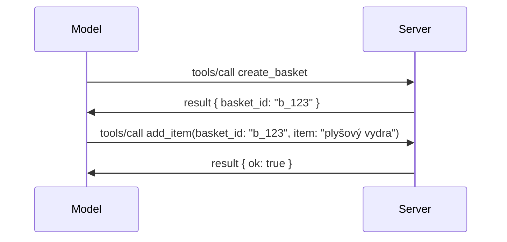

# Čo sa mení v MCP: Kandidát na vydanie 2026-07-28

> **Stav:** Kandidát na vydanie. Špecifikácia `2026-07-28` nie je v čase písania finálna. Bola oznámená 21. mája 2026 a plánuje sa vydanie 28. júla 2026. Všetko v tejto lekcii popisuje kandidáta na vydanie; pre najnovší stav si skontrolujte [návrh špecifikácie](https://modelcontextprotocol.io/specification/draft) a jej [zmeny](https://modelcontextprotocol.io/specification/draft/changelog) predtým, ako na ňu budete stavať. Zvyšok tohto kurzu je napísaný na základe aktuálne stabilného vydania, **MCP špecifikácia 2025-11-25**, a aktualizuje sa po vydaní `2026-07-28`.

## Prehľad

`2026-07-28` je najväčšia revízia MCP od jeho spustenia. Šesť návrhov vylepšení špecifikácie (SEPs) odstraňuje protokolové relácie a robí MCP bezstavovým na transportnej vrstve, rozšírenia sa stávajú prvo-triednym, verzovaným mechanizmom a niekoľko funkcií, ktoré ste sa už naučili v tomto kurze (Roots, Sampling, Logging), je označených ako zastaraných podľa novej životnej politiky funkcií. Táto lekcia zhrňuje, čo sa mení, prečo je to dôležité a čo to znamená pre kód, ktorý ste už napísali pre `2025-11-25`.

Zdroj: [Kandidát na vydanie MCP špecifikácie 2026-07-28](https://blog.modelcontextprotocol.io/posts/2026-07-28-release-candidate/) (Model Context Protocol Blog, David Soria Parra a Den Delimarsky).

## Ciele učenia

Na konci tejto lekcie budete schopní:

- Vysvetliť, prečo MCP prechádza na bezstavové jadro protokolu a aký problém to rieši pre horizontálne škálované nasadenia.
- Opísať, ako sa nahrádza handshake `initialize`/`initialized` a hlavička `Mcp-Session-Id`.
- Identifikovať nové hlavičky `Mcp-Method` a `Mcp-Name` a metadáta cache `ttlMs`/`cacheScope`.
- Spoznať rámec rozšírení a dve rozšírenia doručované s týmto vydaním: MCP Apps a Tasks.
- Vymenovať šesť autorizačných SEP, ktoré zvyšujú zabezpečenie súladu s OAuth 2.0 / OIDC.
- Identifikovať, ktoré jadrové funkcie (Roots, Sampling, Logging) sú teraz označené ako zastarané a čo to znamená v praxi.
- Vysvetliť zmenu Full JSON Schema 2020-12 pre nástroje `inputSchema`/`outputSchema`.

## Bezstavový protokol

Hlavná zmena: MCP sa stáva bezstavovým na vrstve protokolu.

### Predtým (2025-11-25): relácie vás viažu na jednu inštanciu servera

Volanie nástroja cez Streamable HTTP začína handshake `initialize`. Server odpovedá hlavičkou `Mcp-Session-Id`, ktorú musí niesť každá nasledujúca požiadavka:

```http
POST /mcp HTTP/1.1
Mcp-Session-Id: 1868a90c-3a3f-4f5b
Content-Type: application/json

{"jsonrpc":"2.0","id":2,"method":"tools/call",
 "params":{"name":"search","arguments":{"q":"otters"}}}
```

Keďže relácia je viazaná na ktorúkoľvek serverovú inštanciu, ktorá ju vytvorila, horizontálne škálované nasadenia potrebujú **sticky routing** na záťažiacom vyvažovači a **zdieľané ukladanie relácií** medzi inštanciami.

### Potom (2026-07-28): každá požiadavka je samostatná

```http
POST /mcp HTTP/1.1
MCP-Protocol-Version: 2026-07-28
Mcp-Method: tools/call
Mcp-Name: search
Content-Type: application/json

{"jsonrpc":"2.0","id":1,"method":"tools/call",
 "params":{"name":"search","arguments":{"q":"otters"},
           "_meta":{"io.modelcontextprotocol/clientInfo":{"name":"my-app","version":"1.0"}}}}
```

Každá serverová inštancia môže túto požiadavku spracovať. Kľúčové zmeny:

- **Handshake `initialize`/`initialized` je odstránený** ([SEP-2575](https://github.com/modelcontextprotocol/modelcontextprotocol/pull/2575)). Verzia protokolu, informácie o klientovi a schopnosti klienta sa presúvajú do `_meta` pri každej požiadavke. Nová metóda `server/discover` umožňuje klientovi získať schopnosti servera dopredu, keď ich potrebuje.
- **Hlavička `Mcp-Session-Id` a protokolová relácia sú odstránené** ([SEP-2567](https://github.com/modelcontextprotocol/modelcontextprotocol/pull/2567)). Stický routing a zdieľané ukladanie relácií už nie sú na vrstve protokolu potrebné.

### Bezstavový protokol, stavové aplikácie

Odstránenie protokolovej relácie neznamená, že váš server nemôže byť stavový. Odporúčaným vzorom je ten istý, ktorý HTTP API vždy používali: vytvoriť explicitný identifikátor (napr. `basket_id`, `browser_id`) pri jednom volaní nástroja a nechať model vrátiť tento identifikátor ako bežný argument pri následných volaniach.



Toto robí stav viditeľným a zmysluplným pre model namiesto toho, aby bol skrytý v transportných metadátach, a umožňuje akejkoľvek serverovej inštancii spracovať akékoľvek volanie.

### Požiadavky zo servera na klienta, preštruktúrované

Bezstavový protokol stále potrebuje spôsob, ako si server môže počas volania vypýtať od klienta niečo (napríklad výzvu na zadanie informácií):

- **Požiadavky iniciované serverom môžu byť vydané iba počas aktívneho spracovania požiadavky klienta** ([SEP-2260](https://github.com/modelcontextprotocol/modelcontextprotocol/pull/2260)) — predtým odporúčanie, teraz povinné. Používateľ nie je nikdy vyzvaný „z ničoho nič“.
- **Viackolové požiadavky** ([SEP-2322](https://github.com/modelcontextprotocol/modelcontextprotocol/pull/2322)) nahrádzajú držanie otvoreného SSE streamu. Namiesto toho server vráti `InputRequiredResult`:

  ```json
  {
    "resultType": "inputRequired",
    "inputRequests": {
      "confirm": {
        "type": "elicitation",
        "message": "Delete 3 files?",
        "schema": { "type": "boolean" }
      }
    },
    "requestState": "eyJzdGVwIjoxLCJmaWxlcyI6WyJhIiwiYiIsImMiXX0="
  }
  ```

  Klient zbiera odpovede a znovu posiela pôvodné volanie s `inputResponses` a s ekvivalentným `requestState`. Akákoľvek serverová inštancia môže vziať tento retry, pretože všetko potrebné je v payload.

### Jednoznačné smerovanie, cache, sledovateľnosť

Tri menšie zmeny uľahčujú prevádzku bezstavovej prevádzky:

- **Hlavičky `Mcp-Method` a `Mcp-Name` sú povinné na Streamable HTTP** ([SEP-2243](https://github.com/modelcontextprotocol/modelcontextprotocol/pull/2243)), aby záťažiace vyvažovače, brány a obmedzovače rýchlosti mohli smerovať podľa operácie bez nutnosti inšpekcie JSON tela. Servery odmietnu požiadavky, kde sa hlavičky a telo nezhodujú.
- **`tools/list` a výsledky čítania zdrojov nesú `ttlMs` a `cacheScope`** ([SEP-2549](https://github.com/modelcontextprotocol/modelcontextprotocol/pull/2549)), modelované podľa HTTP `Cache-Control`. Klienti vedia, ako dlho je výsledok zoznamu čerstvý a či je bezpečné ho zdieľať medzi používateľmi, bez potreby dlhodobého SSE streamu na sledovanie zmien.
- **Propagácia W3C Trace Context v `_meta` je zdokumentovaná** ([SEP-414](https://github.com/modelcontextprotocol/modelcontextprotocol/pull/414)), opravujúc názvy kľúčov `traceparent`, `tracestate` a `baggage`, takže distribuovaný sled môže sledovať volanie cez klientsky SDK, MCP server, a ďalšie systémy v backende kompatibilnom s [OpenTelemetry](https://opentelemetry.io/).

## Rozšírenia sa stávajú prvo-triednymi

Rozšírenia existovali neformálne v `2025-11-25`. [SEP-2133](https://github.com/modelcontextprotocol/modelcontextprotocol/pull/2133) ich formalizuje:

- Rozšírenia sú identifikované pomocou ID v tvare reverznej DNS.
- Negociujú sa prostredníctvom mapy `extensions` v schopnostiach klienta a servera.
- Žijú vo vlastných repozitároch `ext-*` s delegovanými správcomi a verzujú sa nezávisle od jadrovej špecifikácie.
- Nová „Extensions Track“ v procese SEP im dáva cestu od experimentálneho po oficiálne.

Toto vydanie prináša dve oficiálne rozšírenia.

### MCP Apps: serverom renderované používateľské rozhrania

[MCP Apps](https://blog.modelcontextprotocol.io/posts/2026-01-26-mcp-apps/) ([SEP-1865](https://github.com/modelcontextprotocol/modelcontextprotocol/pull/1865)) umožňujú serverom doručiť interaktívne HTML rozhrania, ktoré hostitelia vykresľujú v sandboxovanom iframe. Nástroje deklarujú svoje UI šablóny dopredu, aby hostitelia mohli prednačítať, ukladať do cache a bezpečnostne ich skontrolovať pred spustením. Základy tohto ste už prebrali v [Lekcii 15: MCP Apps](../03-GettingStarted/15-mcp-apps/README.md) — v rámci rámca rozšírení je MCP Apps teraz formálne rozšírenie, nie experimentálna jadrová funkcia.

### Tasks prechádza na rozšírenie

Tasks boli doručené ako experimentálna jadrová funkcia v `2025-11-25`. Produkčné používanie odhalilo dostatočne veľké zmeny, takže vhodným domovom je rozšírenie: [Tasks rozšírenie](https://github.com/modelcontextprotocol/modelcontextprotocol/pull/2663) mení životný cyklus okolo bezstavového modelu — server môže odpovedať na `tools/call` s úlohou (task) pomocou identifikátora, a klient ju ďalej riadi cez `tasks/get`, `tasks/update` a `tasks/cancel`. Vytváranie úloh je riadené serverom: klient deklaruje rozšírenie a server rozhoduje, kedy má byť volanie vykonané ako úloha. `tasks/list` je úplne odstránené, pretože nie je možné bezpečne vymedziť bez relácií.

> **Poznámka k migrácii:** ak ste implementovali experimentálne Tasks API z `2025-11-25`, budete musieť prejsť na nový životný cyklus rozšírenia — nie je spätne kompatibilný.

## Posilnenie autorizácie

Šesť SEP posilňuje [špecifikáciu autorizácie](https://modelcontextprotocol.io/specification/draft/basic/authorization) s cieľom lepšie zosúladiť s reálnymi nasadeniami OAuth 2.0 / OpenID Connect:

| SEP | Zmena |
|---|---|
| [SEP-2468](https://github.com/modelcontextprotocol/modelcontextprotocol/pull/2468) | Klienti musia overovať parameter `iss` v odpovediach autorizácie podľa [RFC 9207](https://www.rfc-editor.org/rfc/rfc9207), čím sa zmierňujú mix-up útoky bežné v režime MCP s jediným klientom a mnohými servermi. Budúca verzia bude vyžadovať odmietnutie odpovedí bez `iss`. |
| [SEP-837](https://github.com/modelcontextprotocol/modelcontextprotocol/pull/837) | Klienti deklarujú typ aplikácie OpenID Connect `application_type` počas Dynamickej registrácie klienta, čím sa zabráni, aby autorizačné servery predvolili desktop/CLI klienta na `"web"` a odmietli jeho redirect URI localhost. |
| [SEP-2352](https://github.com/modelcontextprotocol/modelcontextprotocol/pull/2352) | Klienti viažu registrované poverenia na `issuer` vydávajúceho autorizačného servera a zaregistrujú sa znova, ak zdroj migruje medzi autorizačnými servermi. |
| [SEP-2207](https://github.com/modelcontextprotocol/modelcontextprotocol/pull/2207) | Dokumentuje, ako požadovať refresh tokeny od autorizačných serverov OpenID Connect. |
| [SEP-2350](https://github.com/modelcontextprotocol/modelcontextprotocol/pull/2350) | Objasňuje akumuláciu scope počas step-up autorizácie. |
| [SEP-2351](https://github.com/modelcontextprotocol/modelcontextprotocol/pull/2351) | Objasňuje `.well-known` príponu pre discovery. |

Ak dnes vytvárate autorizačný server pre MCP, začnite dodávať `iss` v autorizáčných odpovediach — pozrite [02-Security](../02-Security/README.md) pre súčasné odporúčania autorizácie, na ktoré toto nadväzuje.

## Roots, Sampling a Logging sú zastarané

Podľa novej [životnej politiky funkcií](https://github.com/modelcontextprotocol/modelcontextprotocol/pull/2577) ([SEP-2577](https://github.com/modelcontextprotocol/modelcontextprotocol/pull/2577)) tri základné klientské primitíva, ktoré ste sa naučili v [Core Concepts](./README.md#roots), prechádzajú do stavu **Zastarané**:

| Funkcia | Odporúčaná náhrada |
|---|---|
| Roots | Parametre nástrojov, URI zdrojov alebo konfigurácia servera |
| Sampling | Priama integrácia s API poskytovateľov LLM |
| Logging | `stderr` pre stdio transporty; OpenTelemetry pre štruktúrovanú pozorovateľnosť |

Ide o **iba anotácie o zastaraní**: metódy, typy a príznaky schopností naďalej fungujú v tomto vydaní a v každej verzii špecifikácie zverejnenej do jedného roka. Kompletné odstránenie ktorejkoľvek z nich bude vyžadovať samostatné SEP podľa životnej politiky — takže nič sa dnes v existujúcich [Sampling](../03-GettingStarted/14-sampling/README.md) príkladoch nezlomí, ale nové servery by mali uprednostňovať náhradné vzory uvedené vyššie.

## Plná podpora JSON Schema 2020-12 pre nástroje

`inputSchema` a `outputSchema` nástrojov sú zdvihnuté na plnú úroveň [JSON Schema 2020-12](https://json-schema.org/draft/2020-12) ([SEP-2106](https://github.com/modelcontextprotocol/modelcontextprotocol/pull/2106)):

- Vstupné schémy si zachovávajú koreňové obmedzenie `type: "object"`, ale teraz umožňujú kompozíciu (`oneOf`, `anyOf`, `allOf`), podmienky a referencie (`$ref`, `$defs`).
- Výstupné schémy sú neobmedzené, a `structuredContent` môže byť akákoľvek JSON hodnota namiesto iba objektu.
- Implementácie nesmú automaticky dereferencovať externé `$ref` URI a mali by obmedziť hĺbku schémy a čas validácie (propagácia DoS útokov pri validácii schém na serveri).

Samostatne sa chyba kódu pre chýbajúci zdroj mení z vlastného MCP `-32002` na štandard JSON-RPC `-32602` (Invalid Params) ([SEP-2164](https://github.com/modelcontextprotocol/modelcontextprotocol/pull/2164)). Ak váš klient čaká doslovnú hodnotu `-32002`, budete ho musieť aktualizovať.

## Ako sa protokol bude vyvíjať ďalej

Toto vydanie obsahuje prerušujúce zmeny, ktoré správcovia MCP neplánujú, že budú zvykom. Tri riadiace SEP sa snažia tomu zabrániť:

- **Politika životného cyklu funkcie** dáva každej funkcii cestu Aktívna → Zastaraná → Odstránená s aspoň dvanásťmesačným odstupom medzi zastaraním a najskoršou možnou odstránením.
- **Rámec rozšírení** umožňuje nové schopnosti doručovať ako voliteľné rozšírenia a stabilizovať ich tam predtým, než (ak vôbec) sa presunú do jadrovej špecifikácie.

- SEP na štandardnej dráhe už nemôže dosiahnuť konečný status, kým v [conformance suite](https://github.com/modelcontextprotocol/conformance) nevznikne zodpovedajúci scenár ([SEP-2484](https://github.com/modelcontextprotocol/modelcontextprotocol/pull/2484)) — rovnaká sada, proti ktorej [SDK tier system](https://github.com/modelcontextprotocol/modelcontextprotocol/pull/1777) hodnotí oficiálne SDK.

## Časový harmonogram vydania a validácia

- Release kandidát bol uzamknutý 21. mája 2026.
- Konečná špecifikácia je plánovaná na 28. júla 2026.
- Desaťtýždňové obdobie medzi týmito dátumami umožňuje správcom SDK a implementátorom klientov overiť zmeny na reálnych pracovných záťažiach; od SDK úrovne 1 sa očakáva, že podporu dodajú počas tohto obdobia podľa [SDK tier system](https://modelcontextprotocol.io/docs/sdk).
- Kompletný súbor zmien sledujte v [návrhu špecifikácie](https://modelcontextprotocol.io/specification/draft) a jeho [changelog-u](https://modelcontextprotocol.io/specification/draft/changelog).

## Čo to znamená pre tento kurz

Všetko, čo ste sa doteraz naučili v tomto kurze, sa zameriava na **2025-11-25**, ktorá zostáva aktuálnou stabilnou špecifikáciou až do vydania `2026-07-28`. Konkrétne:

- **Sedenia a handshak `initialize`** (pokryté v [Core Concepts](./README.md) a [Lekcia 6: HTTP Streaming](../03-GettingStarted/06-http-streaming/README.md)) stále fungujú podľa dnešnej dokumentácie, ale očakávajte, že budú nahradené bezstavovým modelom požiadaviek vyššie po aktualizácii na kompatibilné SDK s `2026-07-28`.
- **Sampling a Roots** (tiež pokryté v [Core Concepts](./README.md)) zostávajú plne funkčné, ale sú zastarané — nové návrhy by mali preferovať náhradné vzory uvedené vyššie.
- **Experimentálna funkcia Tasks**, ak ste ju používali, bude potrebné migrovať do nového životného cyklu rozšírenia Tasks.
- **MCP Aplikácie** ([Lekcia 15](../03-GettingStarted/15-mcp-apps/README.md)) zostávajú v praxi nezmenené; len sa presunú pod formálny rámec Extensions.

## Ďalšie zdroje

- [Release kandidát MCP špecifikácie na 2026-07-28 (blogový príspevok)](https://blog.modelcontextprotocol.io/posts/2026-07-28-release-candidate/)
- [Budúcnosť MCP transportov](https://blog.modelcontextprotocol.io/posts/2025-12-19-mcp-transport-future/)
- [Návrh MCP špecifikácie](https://modelcontextprotocol.io/specification/draft)
- [Zmeny v MCP návrhu](https://modelcontextprotocol.io/specification/draft/changelog)
- [SEP smernice](https://modelcontextprotocol.io/community/sep-guidelines)
- [MCP SDK tier system](https://modelcontextprotocol.io/docs/sdk)

## Ďalšie kroky

Vráťte sa na [Core Concepts](./README.md) alebo pokračujte na [Security](../02-Security/README.md), aby ste videli, ako sa dnešné pokyny `2025-11-25` odrážajú v tom, čo prichádza.

---

<!-- CO-OP TRANSLATOR DISCLAIMER START -->
**Vyhlásenie o zodpovednosti**:
Tento dokument bol preložený pomocou AI prekladateľskej služby [Co-op Translator](https://github.com/Azure/co-op-translator). Hoci sa snažíme o presnosť, vezmite prosím na vedomie, že automatické preklady môžu obsahovať chyby alebo nepresnosti. Pôvodný dokument v jeho natívnom jazyku by mal byť považovaný za autoritatívny zdroj. Pre kritické informácie sa odporúča profesionálny ľudský preklad. Nie sme zodpovední za žiadne nedorozumenia alebo nesprávne interpretácie vyplývajúce z použitia tohto prekladu.
<!-- CO-OP TRANSLATOR DISCLAIMER END -->