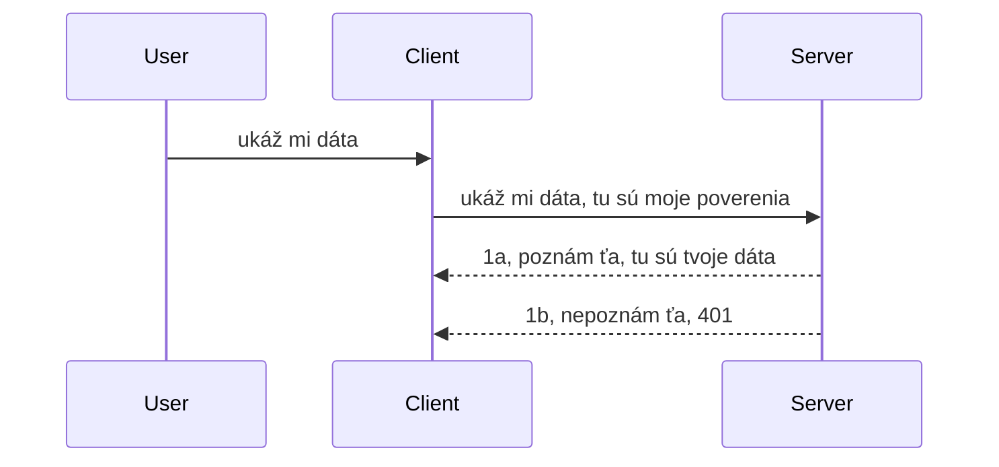

# Jednoduchá autentifikácia

MCP SDK podporujú použitie OAuth 2.1, čo je, pravdupovediac, dosť zložitý proces zahŕňajúci koncepty ako autentifikačný server, server so zdrojmi, odosielanie prihlasovacích údajov, získavanie kódu, výmenu kódu za bearer token, až kým nakoniec nezískate údaje zo zdroja. Ak nie ste zvyknutí na OAuth, čo je skvelá vec na implementovanie, je dobré začať s nejakou základnou úrovňou autentifikácie a postupne budovať čoraz lepšie zabezpečenie. Preto táto kapitola existuje, aby vás posunula k pokročilejšej autentifikácii.

## Autentifikácia, čo tým myslíme?

Autentifikácia je skrátený pojem pre overovanie a autorizáciu. Myšlienka je, že potrebujeme urobiť dve veci:

- **Overovanie identity (authentication)**, čo je proces zisťovania, či necháme osobu vstúpiť do nášho domu, či má právo byť „tu“, teda mať prístup k nášmu serveru zdrojov, kde fungujú funkcie nášho MCP servera.
- **Autorizácia (authorization)**, je proces zisťovania, či by mal používateľ mať prístup k týmto konkrétnym zdrojom, o ktoré žiada – napríklad tieto objednávky alebo produkty, alebo či môže iba čítať obsah, ale nemá právo mazať, ako ďalší príklad.

## Prihlasovacie údaje: ako systému povieme, kto sme

Väčšina webových vývojárov začne rozmýšľať v termínoch poskytnutia prihlasovacieho údaju serveru, zvyčajne tajomstva, ktoré hovorí, či je im povolené byť tu („Overovanie identity“). Tento údaj je zvyčajne base64 kódovaná verzia používateľského mena a hesla alebo API kľúč, ktorý jedinečne identifikuje konkrétneho používateľa.

To zahŕňa odoslanie cez hlavičku nazvanú „Authorization“ takto:

```json
{ "Authorization": "secret123" }
```

Toto sa zvyčajne nazýva základná autentifikácia. Ako potom funguje celkový tok:



Teraz keď rozumieme, ako to funguje z pohľadu toku, ako to implementujeme? Väčšina webových serverov má koncept, ktorý sa nazýva middleware, kus kódu, ktorý beží ako súčasť požiadavky a môže overiť prihlasovacie údaje, a ak sú platné, môže nechať požiadavku prejsť. Ak požiadavka nemá platné prihlasovacie údaje, dostanete chybu autentifikácie. Pozrime sa, ako to možno implementovať:

**Python**

```python
class AuthMiddleware(BaseHTTPMiddleware):
    async def dispatch(self, request, call_next):

        has_header = request.headers.get("Authorization")
        if not has_header:
            print("-> Missing Authorization header!")
            return Response(status_code=401, content="Unauthorized")

        if not valid_token(has_header):
            print("-> Invalid token!")
            return Response(status_code=403, content="Forbidden")

        print("Valid token, proceeding...")
       
        response = await call_next(request)
        # pridajte akékoľvek vlastné hlavičky zákazníka alebo nejako zmeňte odpoveď
        return response


starlette_app.add_middleware(CustomHeaderMiddleware)
```

Tu máme:

- Vytvorili sme middleware nazvaný `AuthMiddleware`, kde jeho metóda `dispatch` je vyvolaná webovým serverom.
- Middleware sme pridali do webového servera:

    ```python
    starlette_app.add_middleware(AuthMiddleware)
    ```

- Napísali sme validačnú logiku, ktorá kontroluje, či je hlavička Authorization prítomná a či je odoslané tajomstvo platné:

    ```python
    has_header = request.headers.get("Authorization")
    if not has_header:
        print("-> Missing Authorization header!")
        return Response(status_code=401, content="Unauthorized")

    if not valid_token(has_header):
        print("-> Invalid token!")
        return Response(status_code=403, content="Forbidden")
    ```

Ak je tajomstvo prítomné a platné, necháme požiadavku prejsť zavolaním `call_next` a vrátime odpoveď.

    ```python
    response = await call_next(request)
    # pridajte akékoľvek vlastné hlavičky alebo nejako zmeňte odpoveď
    return response
    ```

Funguje to tak, že ak je webová požiadavka smerovaná na server, middleware bude zavolaný a podľa svojej implementácie buď nechá požiadavku prejsť, alebo vráti chybu, ktorá indikuje, že klient nemá povolenie pokračovať.

**TypeScript**

Tu vytvárame middleware s populárnym frameworkom Express a zachytávame požiadavku predtým, ako dosiahne MCP Server. Tu je kód:

```typescript
function isValid(secret) {
    return secret === "secret123";
}

app.use((req, res, next) => {
    // 1. Je prítomný hlavička autorizácie?
    if(!req.headers["Authorization"]) {
        res.status(401).send('Unauthorized');
    }
    
    let token = req.headers["Authorization"];

    // 2. Skontrolujte platnosť.
    if(!isValid(token)) {
        res.status(403).send('Forbidden');
    }

   
    console.log('Middleware executed');
    // 3. Postupuje požiadavku do ďalšieho kroku v pipeline požiadaviek.
    next();
});
```

V tomto kóde:

1. Skontrolujeme, či hlavička Authorization vôbec existuje, ak nie, pošleme chybu 401.
2. Overíme, či je prihlasovací údaj/token platný, ak nie, pošleme chybu 403.
3. Nakoniec posunieme požiadavku ďalej v spracovaní a vrátime požadovaný zdroj.

## Cvičenie: Implementovať autentifikáciu

Využime naše znalosti a skúste to implementovať. Tu je plán:

Server

- Vytvorte webový server a inštanciu MCP.
- Implementujte middleware pre server.

Klient

- Odoslať webovú požiadavku s prihlasovacím údajom cez hlavičku.

### -1- Vytvorte webový server a inštanciu MCP

> **Pozrite sa dopredu:** príklad v TypeScript nižšie sleduje HTTP transporty v mape `transports` kľúčovanej podľa `mcp-session-id`, podľa **MCP Špecifikácie 2025-11-25**. Release candidate `2026-07-28` úplne odstraňuje handshake `initialize` a session ID, takže táto mapa transportov podľa session zmizne v prospech bezstavových, sebestačných požiadaviek. Pozrite [Čo sa mení v MCP: Release Candidate 2026-07-28](../../01-CoreConcepts/mcp-2026-07-28-release-candidate.md).

V prvom kroku potrebujeme vytvoriť inštanciu webového servera a MCP Servera.

**Python**

Tu vytvoríme inštanciu MCP servera, vytvoríme Starlette webovú aplikáciu a hosťujeme ju s uvicorn.

```python
# vytváranie MCP servera

app = FastMCP(
    name="MCP Resource Server",
    instructions="Resource Server that validates tokens via Authorization Server introspection",
    host=settings["host"],
    port=settings["port"],
    debug=True
)

# vytváranie starlette webovej aplikácie
starlette_app = app.streamable_http_app()

# spúšťanie aplikácie cez uvicorn
async def run(starlette_app):
    import uvicorn
    config = uvicorn.Config(
            starlette_app,
            host=app.settings.host,
            port=app.settings.port,
            log_level=app.settings.log_level.lower(),
        )
    server = uvicorn.Server(config)
    await server.serve()

run(starlette_app)
```

V tomto kóde:

- Vytvorili sme MCP Server.
- Zkonštruovali sme Starlette webovú aplikáciu z MCP Servera, `app.streamable_http_app()`.
- Hosťujeme a spúšťame web aplikáciu pomocou uvicorn `server.serve()`.

**TypeScript**

Tu vytvárame inštanciu MCP Servera.

```typescript
const server = new McpServer({
      name: "example-server",
      version: "1.0.0"
    });

    // ... nastaviť zdroje servera, nástroje a výzvy ...
```

Táto tvorba MCP Servera sa musí diať v rámci definície trasy POST /mcp, takže vezmime vyššie uvedený kód a presuňme ho takto:

```typescript
import express from "express";
import { randomUUID } from "node:crypto";
import { McpServer } from "@modelcontextprotocol/sdk/server/mcp.js";
import { StreamableHTTPServerTransport } from "@modelcontextprotocol/sdk/server/streamableHttp.js";
import { isInitializeRequest } from "@modelcontextprotocol/sdk/types.js"

const app = express();
app.use(express.json());

// Mapa na ukladanie transportov podľa ID relácie
const transports: { [sessionId: string]: StreamableHTTPServerTransport } = {};

// Spracovať POST požiadavky pre komunikáciu klient-server
app.post('/mcp', async (req, res) => {
  // Skontrolovať existujúce ID relácie
  const sessionId = req.headers['mcp-session-id'] as string | undefined;
  let transport: StreamableHTTPServerTransport;

  if (sessionId && transports[sessionId]) {
    // Znovu použiť existujúci transport
    transport = transports[sessionId];
  } else if (!sessionId && isInitializeRequest(req.body)) {
    // Nová inicializačná požiadavka
    transport = new StreamableHTTPServerTransport({
      sessionIdGenerator: () => randomUUID(),
      onsessioninitialized: (sessionId) => {
        // Uložiť transport podľa ID relácie
        transports[sessionId] = transport;
      },
      // Ochrana proti DNS rebindingu je predvolene vypnutá pre spätnú kompatibilitu. Ak spúšťate tento server
      // lokálne, uistite sa, že nastavíte:
      // enableDnsRebindingProtection: true,
      // allowedHosts: ['127.0.0.1'],
    });

    // Vyčistiť transport po zatvorení
    transport.onclose = () => {
      if (transport.sessionId) {
        delete transports[transport.sessionId];
      }
    };
    const server = new McpServer({
      name: "example-server",
      version: "1.0.0"
    });

    // ... nastaviť zdroje servera, nástroje a výzvy ...

    // Pripojiť sa k MCP serveru
    await server.connect(transport);
  } else {
    // Neplatná požiadavka
    res.status(400).json({
      jsonrpc: '2.0',
      error: {
        code: -32000,
        message: 'Bad Request: No valid session ID provided',
      },
      id: null,
    });
    return;
  }

  // Spracovať požiadavku
  await transport.handleRequest(req, res, req.body);
});

// Znovupoužiteľný handler pre GET a DELETE požiadavky
const handleSessionRequest = async (req: express.Request, res: express.Response) => {
  const sessionId = req.headers['mcp-session-id'] as string | undefined;
  if (!sessionId || !transports[sessionId]) {
    res.status(400).send('Invalid or missing session ID');
    return;
  }
  
  const transport = transports[sessionId];
  await transport.handleRequest(req, res);
};

// Spracovať GET požiadavky pre oznámenia zo servera na klienta cez SSE
app.get('/mcp', handleSessionRequest);

// Spracovať DELETE požiadavky na ukončenie relácie
app.delete('/mcp', handleSessionRequest);

app.listen(3000);
```

Teraz vidíte, ako sa tvorba MCP Servera presunula do `app.post("/mcp")`.

Pokračujme k ďalšiemu kroku vytvorenia middleware, aby sme mohli overiť prichádzajúci prihlasovací údaj.

### -2- Implementujte middleware pre server

Poďme k časti middleware. Tu vytvoríme middleware, ktorý bude hľadať prihlasovací údaj v hlavičke `Authorization` a overí ho. Ak je prijateľný, požiadavka bude pokračovať v spracovaní (napr. výpis nástrojov, čítanie zdroja alebo čokoľvek, čo požaduje MCP klient).

**Python**

Na vytvorenie middleware potrebujeme vytvoriť triedu, ktorá dedí z `BaseHTTPMiddleware`. Sú tu dva zaujímavé parametre:

- Požiadavka `request`, z ktorej čítame informácie z hlavičky.
- `call_next`, spätné volanie, ktoré musíme zavolať, ak klient priniesol príjateľný prihlasovací údaj.

Najskôr musíme riešiť prípad, ak chýba hlavička `Authorization`:

```python
has_header = request.headers.get("Authorization")

# hlavička nie je prítomná, zlyhaj s 401, inak pokračuj ďalej.
if not has_header:
    print("-> Missing Authorization header!")
    return Response(status_code=401, content="Unauthorized")
```

Tu posielame správu 401 unauthorized, pretože klient zlyháva v autentifikácii.

Ďalej, ak bol prihlasovací údaj odoslaný, musíme skontrolovať jeho platnosť takto:

```python
 if not valid_token(has_header):
    print("-> Invalid token!")
    return Response(status_code=403, content="Forbidden")
```

Všimnite si, že vyššie posielame správu 403 forbidden. Pozrime sa na kompletný middleware nižšie, ktorý implementuje všetko, čo sme vyššie spomenuli:

```python
class AuthMiddleware(BaseHTTPMiddleware):
    async def dispatch(self, request, call_next):

        has_header = request.headers.get("Authorization")
        if not has_header:
            print("-> Missing Authorization header!")
            return Response(status_code=401, content="Unauthorized")

        if not valid_token(has_header):
            print("-> Invalid token!")
            return Response(status_code=403, content="Forbidden")

        print("Valid token, proceeding...")
        print(f"-> Received {request.method} {request.url}")
        response = await call_next(request)
        response.headers['Custom'] = 'Example'
        return response

```

Skvelé, ale čo funkcia `valid_token`? Tu je nižšie:

```python
# NEPOUŽÍVAJTE do produkcie - zlepšite to !!
def valid_token(token: str) -> bool:
    # odstráňte predponu "Bearer "
    if token.startswith("Bearer "):
        token = token[7:]
        return token == "secret-token"
    return False
```

Samozrejme by sa to malo zlepšiť.

DÔLEŽITÉ: Tajomstvá ako toto NIKDY neukladajte do kódu. Ideálne by ste mali hodnoty, s ktorými porovnávate, načítať z dátového zdroja alebo od poskytovateľa identity (IDP), alebo ešte lepšie, nechať validáciu vykonávať priamo IDP.

**TypeScript**

Na implementáciu s Express musíme zavolať metódu `use`, ktorá prijíma middleware funkcie.

Musíme:

- Pristupovať k požiadavke a skontrolovať odovzdaný kredenciál v poli `Authorization`.
- Validovať prihlasovací údaj, a ak je platný, nechať požiadavku pokračovať a umožniť klientovi vykonať operácie MCP, ktoré požaduje (napr. výpis nástrojov, načítanie zdroja, alebo čokoľvek iné z MCP).

Tu kontrolujeme, či hlavička `Authorization` je prítomná, ak nie, zastavíme požiadavku:

```typescript
if(!req.headers["authorization"]) {
    res.status(401).send('Unauthorized');
    return;
}
```

Ak hlavička nie je vôbec zaslaná, dostanete chybu 401.

Potom skontrolujeme platnosť prihlasovacieho údaju, a ak nie je platný, opäť zastavíme požiadavku, ale so správe 403:

```typescript
if(!isValid(token)) {
    res.status(403).send('Forbidden');
    return;
} 
```

Všimnite si, že dostávate chybu 403.

Tu je kompletný kód:

```typescript
app.use((req, res, next) => {
    console.log('Request received:', req.method, req.url, req.headers);
    console.log('Headers:', req.headers["authorization"]);
    if(!req.headers["authorization"]) {
        res.status(401).send('Unauthorized');
        return;
    }
    
    let token = req.headers["authorization"];

    if(!isValid(token)) {
        res.status(403).send('Forbidden');
        return;
    }  

    console.log('Middleware executed');
    next();
});
```

Webový server je nastavený tak, aby prijímala middleware a kontrolovala prihlasovací údaj, ktorý nám klient dúfajme pošle. A čo klient samotný?

### -3- Odoslať webovú požiadavku s prihlasovacím údajom cez hlavičku

Musíme zabezpečiť, že klient posiela prihlasovací údaj v hlavičke. Keďže použijeme MCP klienta, musíme zistiť, ako to urobiť.

**Python**

Pre klienta musíme poslať hlavičku s našim prihlasovacím údajom takto:

```python
# NENASTAVUJTE hodnotu pevne v kóde, majte ju aspoň v premennej prostredia alebo v bezpečnejšom úložisku
token = "secret-token"

async with streamablehttp_client(
        url = f"http://localhost:{port}/mcp",
        headers = {"Authorization": f"Bearer {token}"}
    ) as (
        read_stream,
        write_stream,
        session_callback,
    ):
        async with ClientSession(
            read_stream,
            write_stream
        ) as session:
            await session.initialize()
      
            # TODO, čo chcete, aby client vykonal, napr. zoznam nástrojov, volanie nástrojov atď.
```

Všimnite si, ako vyplníme pole `headers` napríklad ` headers = {"Authorization": f"Bearer {token}"}`.

**TypeScript**

Môžeme to vyriešiť v dvoch krokoch:

1. Vyplniť konfiguračný objekt naším prihlasovacím údajom.
2. Poslať konfiguračný objekt do transportu.

```typescript

// NEpevne zadajte hodnotu ako je tu zobrazené. Minimálne ju majte ako premennú prostredia a používajte niečo ako dotenv (v režime vývoja).
let token = "secret123"

// definujte objekt možností pre klientsky transport
let options: StreamableHTTPClientTransportOptions = {
  sessionId: sessionId,
  requestInit: {
    headers: {
      "Authorization": "secret123"
    }
  }
};

// odovzdajte objekt možností transportu
async function main() {
   const transport = new StreamableHTTPClientTransport(
      new URL(serverUrl),
      options
   );
```

Tu vidíte, ako sme museli vytvoriť objekt `options` a umiestniť hlavičky pod vlastnosť `requestInit`.

DÔLEŽITÉ: Ako to odtiaľto vylepšiť? Súčasná implementácia má problémy. Najskôr, posielanie prihlasovacieho údaju takto je dosť rizikové, pokiaľ nemáte minimálne HTTPS. Aj tak môže byť prihlasovací údaj ukradnutý, takže potrebujete systém, kde môžete ľahko zrušiť token a pridať ďalšie kontroly, ako odkiaľ na svete prichádza, či požiadavka neprichádza príliš často (chovanie podobné botu), skrátka, je tu množstvo otázok.

Treba však povedať, že pre veľmi jednoduché API, kde nechcete, aby niekto volal vaše API bez autentifikácie, je to dobrý začiatok.

S týmto povedané, poďme trochu posilniť zabezpečenie použitím štandardizovaného formátu JSON Web Token, známeho tiež ako JWT alebo „JOT“ tokeny.

## JSON Web Tokeny, JWT

Takže sa snažíme zlepšiť odosielanie veľmi jednoduchých prihlasovacích údajov. Aké sú okamžité výhody prijatím JWT?

- **Vylepšenie bezpečnosti**. Pri základnej autentifikácii posielate používateľské meno a heslo ako base64 kódovaný token (alebo API kľúč) znova a znova, čo zvyšuje riziko. S JWT pošlete svoje používateľské meno a heslo a dostanete token na oplátku a je časovo obmedzený, teda vyprší po určitom čase. JWT vám umožňuje jednoducho používať jemné riadenie prístupu pomocou rolí, rozsahov a oprávnení.
- **Bezstavovosť a škálovateľnosť**. JWT sú sebestačné, nesú všetky informácie o používateľovi a odstraňujú potrebu ukladania serverovej session storage. Token môže byť overený aj lokálne.
- **Interoperabilita a federácia**. JWT sú centrálnou súčasťou OpenID Connect a používajú sa so známymi poskytovateľmi identity, ako Entra ID, Google Identity a Auth0. Umožňujú tiež single sign-on a oveľa viac, vďaka čomu sú enterprise-grade.
- **Modularita a flexibilita**. JWT sa môžu používať aj s API bránami ako Azure API Management, NGINX a ďalšími. Podporujú takisto autentifikačné scenáre a komunikáciu server-na-server vrátane scénarov impersonácie a delegovania.
- **Výkon a cachovanie**. JWT môžu byť uložené do cache po dekódovaní, čím sa znižuje potreba parsovania. To pomáha najmä pri aplikáciách s vysokou návštevnosťou, pretože zlepšuje priepustnosť a znižuje záťaž na infraštruktúru.
- **Pokročilé funkcie**. Podporujú introspekciu (overovanie platnosti na serveri) a revokáciu (neplatnosť tokenu).

S týmito výhodami sa pozrime, ako môžeme náš systém posunúť na ďalšiu úroveň.

## Premena základnej autentifikácie na JWT

Takže zmeny, ktoré potrebujeme urobiť na vrcholnej úrovni, sú:

- **Naučiť sa vytvárať JWT token** a pripraviť ho na posielanie z klienta na server.
- **Validovať JWT token**, a ak je platný, umožniť klientovi prístup k našim zdrojom.
- **Bezpečné ukladanie tokenu**. Ako tento token skladiť.
- **Chrániť cesty (routes)**. Potrebujeme chrániť cesty, v našom prípade aj konkrétne MCP funkcie.
- **Pridať refresh tokeny**. Zabezpečiť, že vytvoríme tokeny s krátkou životnosťou, ale aj refresh tokeny s dlhšou životnosťou, ktoré umožnia získať nové tokeny, ak tie vypršia. Tiež zabezpečiť refresh endpoint a stratégiu rotácie.

### -1- Vytvoriť JWT token

JWT token má nasledovné časti:

- **hlavička**, použitý algoritmus a typ tokenu.
- **telo (payload)**, požiadavky (claims), ako sub (používateľ alebo entita, ktorú token reprezentuje, zvyčajne userID v autentifikačnom scenári), exp (dátum exspirácie), role (rola).
- **podpis (signature)**, podpísaný tajomstvom alebo súkromným kľúčom.

Pre toto budeme konštruovať hlavičku, payload a kódovaný token.

**Python**

```python

import jwt
import jwt
from jwt.exceptions import ExpiredSignatureError, InvalidTokenError
import datetime

# Tajný kľúč použitý na podpísanie JWT
secret_key = 'your-secret-key'

header = {
    "alg": "HS256",
    "typ": "JWT"
}

# informácie o používateľovi a jeho nároky a čas expirácie
payload = {
    "sub": "1234567890",               # Predmet (ID používateľa)
    "name": "User Userson",                # Vlastný nárok
    "admin": True,                     # Vlastný nárok
    "iat": datetime.datetime.utcnow(),# Vydané
    "exp": datetime.datetime.utcnow() + datetime.timedelta(hours=1)  # Expirácia
}

# zakódovať to
encoded_jwt = jwt.encode(payload, secret_key, algorithm="HS256", headers=header)
```

V horeuvedenom kóde sme:

- Definovali hlavičku s algoritmom HS256 a typom JWT.
- Vytvorili payload obsahujúci subjekt alebo používateľské ID, používateľské meno, rolu, kedy bol token vydaný a kedy má expirovať, tým sme implementovali spomínaný časový limit.

**TypeScript**

Tu budeme potrebovať závislosti, ktoré nám pomôžu vytvoriť JWT token.

Závislosti

```sh

npm install jsonwebtoken
npm install --save-dev @types/jsonwebtoken
```

Teraz, keď to máme, vytvorme hlavičku, payload a následne kódovaný token.

```typescript
import jwt from 'jsonwebtoken';

const secretKey = 'your-secret-key'; // Použite premenné prostredia v produkcii

// Definujte náklad (payload)
const payload = {
  sub: '1234567890',
  name: 'User usersson',
  admin: true,
  iat: Math.floor(Date.now() / 1000), // Vydané o
  exp: Math.floor(Date.now() / 1000) + 60 * 60 // Platnosť vyprší o 1 hodinu
};

// Definujte hlavičku (voliteľné, jsonwebtoken nastavuje predvolené hodnoty)
const header = {
  alg: 'HS256',
  typ: 'JWT'
};

// Vytvorte token
const token = jwt.sign(payload, secretKey, {
  algorithm: 'HS256',
  header: header
});

console.log('JWT:', token);
```

Tento token je:

Podpísaný pomocou HS256
Platný 1 hodinu
Obsahuje požiadavky ako sub, name, admin, iat a exp.

### -2- Validovať token

Potrebujeme tiež validovať token, toto by sa malo robiť na serveri, aby sme zabezpečili, že to, čo klient posiela, je naozaj platné. Existuje mnoho kontrol, ktoré by sme mali vykonať, od validácie štruktúry až po platnosť. Odporúča sa tiež pridať ďalšie kontroly, napríklad či je používateľ v systéme a ďalšie.

Na validáciu tokenu ho musíme dekódovať, aby sme ho mohli čítať, a potom začať kontrolovať jeho platnosť:

**Python**

```python

# Dekódujte a overte JWT
try:
    decoded = jwt.decode(token, secret_key, algorithms=["HS256"])
    print("✅ Token is valid.")
    print("Decoded claims:")
    for key, value in decoded.items():
        print(f"  {key}: {value}")
except ExpiredSignatureError:
    print("❌ Token has expired.")
except InvalidTokenError as e:
    print(f"❌ Invalid token: {e}")

```


V tomto kóde voláme `jwt.decode` s tokenom, tajným kľúčom a zvoleným algoritmom ako vstupom. Všimnite si, ako používame konštrukt try-catch, pretože zlyhanie validácie vedie k vyvolaniu chyby.

**TypeScript**

Tu potrebujeme zavolať `jwt.verify`, aby sme získali dekódovanú verziu tokenu, ktorú môžeme ďalej analyzovať. Ak tento hovor zlyhá, znamená to, že štruktúra tokenu je nesprávna alebo už nie je platná.

```typescript

try {
  const decoded = jwt.verify(token, secretKey);
  console.log('Decoded Payload:', decoded);
} catch (err) {
  console.error('Token verification failed:', err);
}
```

POZNÁMKA: ako už bolo spomenuté, mali by sme vykonať ďalšie kontroly, aby sme sa uistili, že tento token odkazuje na používateľa v našom systéme a zaistili, že používateľ má práva, ktoré tvrdí, že má.

Ďalej sa pozrieme na riadenie prístupu založené na rolách, známe tiež ako RBAC.

## Pridanie riadenia prístupu založeného na rolách

Myšlienka je, že chceme vyjadriť, že rôzne role majú rôzne povolenia. Napríklad predpokladáme, že administrátor môže urobiť všetko, bežný používateľ môže čítať/písať a hosť môže iba čítať. Nasledujú teda niektoré možné úrovne povolení:

- Admin.Write 
- User.Read
- Guest.Read

Pozrime sa, ako môžeme implementovať takéto riadenie pomocou middleware. Middleware môžeme pridať na konkrétnu trasu, ako aj na všetky trasy.

**Python**

```python
from starlette.middleware.base import BaseHTTPMiddleware
from starlette.responses import JSONResponse
import jwt

# NEUMLIETAJ tajomstvo do kódu, toto je len na demonštračné účely. Načítaj ho z bezpečného miesta.
SECRET_KEY = "your-secret-key" # daj toto do env premennej
REQUIRED_PERMISSION = "User.Read"

class JWTPermissionMiddleware(BaseHTTPMiddleware):
    async def dispatch(self, request, call_next):
        auth_header = request.headers.get("Authorization")
        if not auth_header or not auth_header.startswith("Bearer "):
            return JSONResponse({"error": "Missing or invalid Authorization header"}, status_code=401)

        token = auth_header.split(" ")[1]
        try:
            decoded = jwt.decode(token, SECRET_KEY, algorithms=["HS256"])
        except jwt.ExpiredSignatureError:
            return JSONResponse({"error": "Token expired"}, status_code=401)
        except jwt.InvalidTokenError:
            return JSONResponse({"error": "Invalid token"}, status_code=401)

        permissions = decoded.get("permissions", [])
        if REQUIRED_PERMISSION not in permissions:
            return JSONResponse({"error": "Permission denied"}, status_code=403)

        request.state.user = decoded
        return await call_next(request)


```

Existuje niekoľko rôznych spôsobov, ako pridať middleware, ako je nižšie:

```python

# Alt 1: pridanie middleware počas tvorby aplikácie starlette
middleware = [
    Middleware(JWTPermissionMiddleware)
]

app = Starlette(routes=routes, middleware=middleware)

# Alt 2: pridanie middleware po tom, čo je aplikácia starlette už vytvorená
starlette_app.add_middleware(JWTPermissionMiddleware)

# Alt 3: pridanie middleware pre každú trasu
routes = [
    Route(
        "/mcp",
        endpoint=..., # spracovateľ
        middleware=[Middleware(JWTPermissionMiddleware)]
    )
]
```

**TypeScript**

Môžeme použiť `app.use` a middleware, ktorý sa spustí pri všetkých požiadavkách.

```typescript
app.use((req, res, next) => {
    console.log('Request received:', req.method, req.url, req.headers);
    console.log('Headers:', req.headers["authorization"]);

    // 1. Skontrolujte, či bol odoslaný autorizačný hlavička

    if(!req.headers["authorization"]) {
        res.status(401).send('Unauthorized');
        return;
    }
    
    let token = req.headers["authorization"];

    // 2. Skontrolujte, či je token platný
    if(!isValid(token)) {
        res.status(403).send('Forbidden');
        return;
    }  

    // 3. Skontrolujte, či používateľ tokenu existuje v našom systéme
    if(!isExistingUser(token)) {
        res.status(403).send('Forbidden');
        console.log("User does not exist");
        return;
    }
    console.log("User exists");

    // 4. Overte, či má token správne oprávnenia
    if(!hasScopes(token, ["User.Read"])){
        res.status(403).send('Forbidden - insufficient scopes');
    }

    console.log("User has required scopes");

    console.log('Middleware executed');
    next();
});

```

Existuje niekoľko vecí, ktoré môžeme nechať našu middleware robiť a ktoré naša middleware MALA by robiť, konkrétne:

1. Skontrolovať, či je prítomný hlavička autorizácie
2. Skontrolovať, či je token platný, voláme `isValid`, čo je metóda, ktorú sme napísali na kontrolu integrity a platnosti JWT tokenu.
3. Overiť, či používateľ existuje v našom systéme, toto by sme mali skontrolovať.

   ```typescript
    // používatelia v DB
   const users = [
     "user1",
     "User usersson",
   ]

   function isExistingUser(token) {
     let decodedToken = verifyToken(token);

     // TODO, skontrolovať, či používateľ existuje v DB
     return users.includes(decodedToken?.name || "");
   }
   ```

   Vyššie sme vytvorili veľmi jednoduchý zoznam `users`, ktorý by mal byť samozrejme v databáze.

4. Okrem toho by sme mali tiež skontrolovať, či token má správne povolenia.

   ```typescript
   if(!hasScopes(token, ["User.Read"])){
        res.status(403).send('Forbidden - insufficient scopes');
   }
   ```

   V tomto kóde z middleware kontrolujeme, či token obsahuje povolenie User.Read, ak nie, posielame chybu 403. Nižšie je pomocná metóda `hasScopes`.

   ```typescript
   function hasScopes(scope: string, requiredScopes: string[]) {
     let decodedToken = verifyToken(scope);
    return requiredScopes.every(scope => decodedToken?.scopes.includes(scope));
  }
   ```

Have a think which additional checks you should be doing, but these are the absolute minimum of checks you should be doing.

Using Express as a web framework is a common choice. There are helpers library when you use JWT so you can write less code.

- `express-jwt`, helper library that provides a middleware that helps decode your token.
- `express-jwt-permissions`, this provides a middleware `guard` that helps check if a certain permission is on the token.

Here's what these libraries can look like when used:

```typescript
const express = require('express');
const jwt = require('express-jwt');
const guard = require('express-jwt-permissions')();

const app = express();
const secretKey = 'your-secret-key'; // put this in env variable

// Decode JWT and attach to req.user
app.use(jwt({ secret: secretKey, algorithms: ['HS256'] }));

// Check for User.Read permission
app.use(guard.check('User.Read'));

// multiple permissions
// app.use(guard.check(['User.Read', 'Admin.Access']));

app.get('/protected', (req, res) => {
  res.json({ message: `Welcome ${req.user.name}` });
});

// Error handler
app.use((err, req, res, next) => {
  if (err.code === 'permission_denied') {
    return res.status(403).send('Forbidden');
  }
  next(err);
});

```

Teraz ste videli, ako sa middleware môže použiť na autentifikáciu aj autorizáciu, ale čo MCP, mení to, ako robíme autorizáciu? Poďme to zistiť v nasledujúcej časti.

### -3- Pridanie RBAC do MCP

Zatiaľ ste videli, ako môžete pridať RBAC prostredníctvom middleware, avšak pre MCP nie je jednoduchý spôsob, ako pridať RBAC na úrovni konkrétnej funkcie MCP, takže čo robíme? Jednoducho pridáme kód, ktorý kontroluje, či má klient práva na volanie konkrétneho nástroja:

Máte niekoľko rôznych možností, ako dosiahnuť RBAC na úrovni funkcie, tu sú niektoré:

- Pridať kontrolu pre každý nástroj, zdroj, prompt, kde je potrebné kontrolovať úroveň povolenia.

   **python**

   ```python
   @tool()
   def delete_product(id: int):
      try:
          check_permissions(role="Admin.Write", request)
      catch:
        pass # klient zlyhal pri autorizácii, vyvolať chybu autorizácie
   ```

   **typescript**

   ```typescript
   server.registerTool(
    "delete-product",
    {
      title: Delete a product",
      description: "Deletes a product",
      inputSchema: { id: z.number() }
    },
    async ({ id }) => {
      
      try {
        checkPermissions("Admin.Write", request);
        // todo, poslať id do productService a remote entry
      } catch(Exception e) {
        console.log("Authorization error, you're not allowed");  
      }

      return {
        content: [{ type: "text", text: `Deletected product with id ${id}` }]
      };
    }
   );
   ```


- Použiť pokročilý serverový prístup a spracovateľov požiadaviek, aby ste minimalizovali počet miest, kde je potrebná kontrola.

   **Python**

   ```python
   
   tool_permission = {
      "create_product": ["User.Write", "Admin.Write"],
      "delete_product": ["Admin.Write"]
   }

   def has_permission(user_permissions, required_permissions) -> bool:
      # oprávnenia používateľa: zoznam oprávnení, ktoré používateľ má
      # požadované oprávnenia: zoznam oprávnení potrebných pre nástroj
      return any(perm in user_permissions for perm in required_permissions)

   @server.call_tool()
   async def handle_call_tool(
     name: str, arguments: dict[str, str] | None
   ) -> list[types.TextContent]:
    # Predpokladaj, že request.user.permissions je zoznam oprávnení pre používateľa
     user_permissions = request.user.permissions
     required_permissions = tool_permission.get(name, [])
     if not has_permission(user_permissions, required_permissions):
        # Vyvolaj chybu "Nemáte oprávnenie volať nástroj {name}"
        raise Exception(f"You don't have permission to call tool {name}")
     # pokračuj a zavolaj nástroj
     # ...
   ```   
   

   **TypeScript**

   ```typescript
   function hasPermission(userPermissions: string[], requiredPermissions: string[]): boolean {
       if (!Array.isArray(userPermissions) || !Array.isArray(requiredPermissions)) return false;
       // Vráti true, ak má používateľ aspoň jedno požadované povolenie
       
       return requiredPermissions.some(perm => userPermissions.includes(perm));
   }
  
   server.setRequestHandler(CallToolRequestSchema, async (request) => {
      const { params: { name } } = request;
  
      let permissions = request.user.permissions;
  
      if (!hasPermission(permissions, toolPermissions[name])) {
         return new Error(`You don't have permission to call ${name}`);
      }
  
      // pokračujte..
   });
   ```

   Poznámka, musíte zabezpečiť, aby váš middleware priradil dekódovaný token k vlastnosti user požiadavky, aby bol vyššie uvedený kód jednoduchý.

### Zhrnutie

Teraz, keď sme diskutovali, ako vôbec pridať podporu RBAC a zvlášť pre MCP, je čas skúsiť implementovať zabezpečenie sami, aby ste pochopili predstavené koncepty.

## Zadanie 1: Vytvorte mcp server a mcp klient pomocou základnej autentifikácie

Tu použijete to, čo ste sa naučili o posielaní prihlasovacích údajov cez hlavičky.

## Riešenie 1

[Riešenie 1](./code/basic/README.md)

## Zadanie 2: Vylepšiť riešenie zo zadania 1 a použiť JWT

Vezmite prvé riešenie, ale tentokrát ho vylepšíme.

Namiesto Basic Auth použijeme JWT.

## Riešenie 2

[Riešenie 2](./solution/jwt-solution/README.md)

## Výzva

Pridajte RBAC pre nástroje, ktoré opisujeme v sekcii "Pridanie RBAC do MCP".

## Zhrnutie

Dúfajme, že ste sa v tejto kapitole veľa naučili, od absencie zabezpečenia, cez základné zabezpečenie, až po JWT a ako ho možno pridať do MCP.

Vybudovali sme pevný základ s vlastnými JWT, ale ako rastieme, posúvame sa k modelu identity založenému na štandardoch. Prijatie IdP ako Entra alebo Keycloak nám umožní presunúť vydávanie tokenov, validáciu a správu životného cyklu na dôveryhodnú platformu — čo nám uvoľní ruky sústrediť sa na logiku aplikácie a používateľskú skúsenosť.

Na to máme pokročilú [kapitolu o Entra](../../05-AdvancedTopics/mcp-security-entra/README.md)

## Čo ďalej

- Ďalej: [Nastavenie MCP hostiteľov](../12-mcp-hosts/README.md)

---

<!-- CO-OP TRANSLATOR DISCLAIMER START -->
**Vyhlásenie o zodpovednosti**:
Tento dokument bol preložený pomocou AI prekladateľskej služby [Co-op Translator](https://github.com/Azure/co-op-translator). Hoci sa snažíme o presnosť, vezmite prosím na vedomie, že automatické preklady môžu obsahovať chyby alebo nepresnosti. Pôvodný dokument v jeho natívnom jazyku by mal byť považovaný za autoritatívny zdroj. Pre kritické informácie sa odporúča profesionálny ľudský preklad. Nie sme zodpovední za žiadne nedorozumenia alebo nesprávne interpretácie vyplývajúce z použitia tohto prekladu.
<!-- CO-OP TRANSLATOR DISCLAIMER END -->