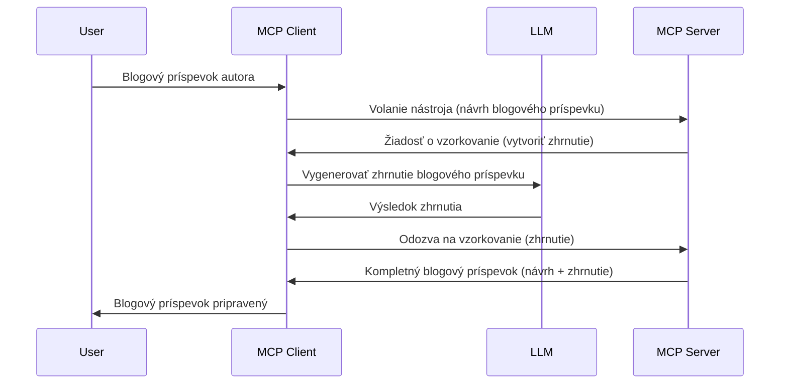

# Sampling - delegovanie funkcií na klienta

> **Upozornenie na ukončenie podpory:** kandidát špecifikácie MCP `2026-07-28` označuje Sampling za zastaraný v prospech priamej integrácie s API poskytovateľov LLM. Sampling naďalej funguje v `2025-11-25` a minimálne rok po akejkoľvek oficiálnej deprekácii, takže všetko v tejto lekcii zostáva platné — ale nové návrhy serverov by mali zvážiť náhradný spôsob. Pozri [Čo sa mení v MCP: Kandidát vydania 2026-07-28](../../01-CoreConcepts/mcp-2026-07-28-release-candidate.md).

Niekedy je potrebné, aby MCP klient a MCP server spolupracovali na dosiahnutí spoločného cieľa. Môžete mať situáciu, kedy server potrebuje pomoc LLM, ktorý beží na klientskej strane. V takomto prípade by ste mali použiť sampling.

Preskúmajme niekoľko prípadov použitia a ako vytvoriť riešenie zahŕňajúce sampling.

## Prehľad

V tejto lekcii sa zameriame na vysvetlenie, kedy a kde použiť Sampling a ako ho nakonfigurovať.

## Ciele učenia

V tejto kapitole:

- Vysvetlíme, čo je Sampling a kedy ho použiť.
- Ukážeme, ako nakonfigurovať Sampling v MCP.
- Poskytneme príklady Sampling v praxi.

## Čo je Sampling a prečo ho používať?

Sampling je pokročilá funkcia, ktorá funguje nasledovne:



### Sampling request

Dobre, teraz máme široký prehľad o dôveryhodnom scenári, poďme hovoriť o sampling požiadavke, ktorú server posiela klientovi. Takáto požiadavka môže vyzerať v JSON-RPC formáte takto:

```json
{
  "jsonrpc": "2.0",
  "id": 1,
  "method": "sampling/createMessage",
  "params": {
    "messages": [
      {
        "role": "user",
        "content": {
          "type": "text",
          "text": "Create a blog post summary of the following blog post: <BLOG POST>"
        }
      }
    ],
    "modelPreferences": {
      "hints": [
        {
          "name": "claude-3-sonnet"
        }
      ],
      "intelligencePriority": 0.8,
      "speedPriority": 0.5
    },
    "systemPrompt": "You are a helpful assistant.",
    "maxTokens": 100
  }
}
```

Stojí za to upozorniť na niekoľko vecí:

- Prompt, pod content -> text, je náš prompt, ktorý je inštrukciou pre LLM zhrnúť obsah blogového príspevku.

- **modelPreferences**. Táto sekcia je len preferencia, odporúčanie konfigurácie pre LLM. Používateľ si môže vybrať, či tieto odporúčania dodržiava alebo zmení. V tomto prípade sú tu odporúčania na model, rýchlosť a prioritu inteligencie.
- **systemPrompt**, toto je váš bežný systémový prompt, ktorý poskytuje LLM osobnosť a obsahuje pokyny.
- **maxTokens**, toto je ďalšia vlastnosť používaná na odporúčanie počtu tokenov, ktoré treba použiť pre túto úlohu.

### Sampling response

Táto odpoveď je to, čo MCP klient nakoniec odošle späť MCP serveru, a je výsledkom volania LLM, čakania na odpoveď a potom vytvorenia tejto správy. Môže vyzerať v JSON-RPC takto:

```json
{
  "jsonrpc": "2.0",
  "id": 1,
  "result": {
    "role": "assistant",
    "content": {
      "type": "text",
      "text": "Here's your abstract <ABSTRACT>"
    },
    "model": "gpt-5",
    "stopReason": "endTurn"
  }
}
```

Všimnite si, že odpoveď je abstrakt blogového príspevku, presne ako sme požadovali. Tiež si všimnite, že použitý `model` nie je ten, ktorý sme požadovali, ale "gpt-5" namiesto "claude-3-sonnet". Toto ilustruje, že používateľ môže zmeniť názor na to, čo použiť, a že vaša sampling požiadavka je odporúčanie.

Teraz, keď chápeme hlavný tok a užitočnú úlohu "vytváranie blogového príspevku + abstrakt", pozrime sa, čo musíme urobiť, aby to fungovalo.

### Typy správ

Sampling správy nie sú obmedzené len na text, ale môžete tiež posielať obrázky a audio. Tu je ukážka, ako JSON-RPC vyzerá inak:

**Text**

```json
{
  "type": "text",
  "text": "The message content"
}
```

**Obsah obrázku**

```json
{
  "type": "image",
  "data": "base64-encoded-image-data",
  "mimeType": "image/jpeg"
}
```

**Obsah audia**

```json
{
  "type": "audio",
  "data": "base64-encoded-audio-data",
  "mimeType": "audio/wav"
}
```

> POZNÁMKA: pre podrobnejšie informácie o Sampling si pozrite [oficiálnu dokumentáciu](https://modelcontextprotocol.io/specification/2025-11-25/client/sampling)

## Ako nakonfigurovať Sampling v klientovi

> Poznámka: ak vytvárate iba server, tu nemusíte robiť takmer nič.

V klientovi je potrebné nasledovne špecifikovať túto funkciu:

```json
{
  "capabilities": {
    "sampling": {}
  }
}
```

Toto bude následne automaticky rozpoznané pri inicializácii zvoleného klienta so serverom.

## Príklad Sampling v praxi - vytvorenie blogového príspevku

Napíšme spolu sampling server, potrebujeme urobiť nasledovné:

1. Vytvoriť nástroj na serveri.
1. Tento nástroj by mal vytvoriť sampling požiadavku.
1. Nástroj by mal čakať, kým klient odpovie na sampling požiadavku.
1. Potom by mal byť vytvorený výsledok nástroja.

Pozrime sa na kód po krokoch:

### -1- Vytvoriť nástroj

**python**

```python
@mcp.tool()
async def create_blog(title: str, content: str, ctx: Context[ServerSession, None]) -> str:
    """Create a blog post and generate a summary"""

```

### -2- Vytvoriť sampling požiadavku

Rozšírte svoj nástroj nasledovným kódom:

**python**

```python
post = BlogPost(
        id=len(posts) + 1,
        title=title,
        content=content,
        abstract=""
    )

prompt = f"Create an abstract of the following blog post: title: {title} and draft: {content} "

result = await ctx.session.create_message(
        messages=[
            SamplingMessage(
                role="user",
                content=TextContent(type="text", text=prompt),
            )
        ],
        max_tokens=100,
)

```

### -3- Čakať na odpoveď a vrátiť odpoveď

**python**

```python
post.abstract = result.content.text

posts.append(post)

# vrátiť celý produkt
return json.dumps({
    "id": post.title,
    "abstract": post.abstract
})
```

### -4- Kompletný kód

**python**

```python
from starlette.applications import Starlette
from starlette.routing import Mount, Host

from mcp.server.fastmcp import Context, FastMCP

from mcp.server.session import ServerSession
from mcp.types import SamplingMessage, TextContent

import json


from uuid import uuid4
from typing import List
from pydantic import BaseModel


mcp = FastMCP("Blog post generator")

# app = FastAPI()

posts = []

class BlogPost(BaseModel):
    id: int
    title: str
    content: str
    abstract: str

posts: List[BlogPost] = []

@mcp.tool()
async def create_blog(title: str, content: str, ctx: Context[ServerSession, None]) -> str:
    """Create a blog post and generate a summary"""

    post = BlogPost(
        id=len(posts) + 1,
        title=title,
        content=content,
        abstract=""
    )

    prompt = f"Create an abstract of the following blog post: title: {title} and draft: {content} "

    result = await ctx.session.create_message(
        messages=[
            SamplingMessage(
                role="user",
                content=TextContent(type="text", text=prompt),
            )
        ],
        max_tokens=100,
    )

    post.abstract = result.content.text

    posts.append(post)

    # vrátiť celý blogový príspevok
    return json.dumps({
        "id": post.title,
        "abstract": post.abstract
    })

if __name__ == "__main__":
    print("Starting server...")
    # mcp.run()
    mcp.run(transport="streamable-http")

# spustiť aplikáciu pomocou: python server.py
```

### -5- Testovanie vo Visual Studio Code

Na otestovanie vo Visual Studio Code urobte nasledovné:

1. Spustite server v termináli
1. Pridajte ho do *mcp.json* (a uistite sa, že je spustený), napríklad takto:

   ```json
   "servers": {
      "blog-server": {
        "type": "http",
        "url": "http://localhost:8000/mcp"
      }
   }
   ```

1. Zadajte prompt:

   ```text
   create a blog post named "Where Python comes from", the content is "Python is actually named after Monty Python Flying Circus"
   ```

1. Umožnite sampling. Pri prvom teste vám bude zobrazený ďalší dialóg, ktorý musíte prijať, potom uvidíte bežný dialóg s požiadavkou na spustenie nástroja.

1. Skontrolujte výsledky. Výsledky budú pekne zobrazené v GitHub Copilot Chat a môžete si tiež pozrieť surovú JSON odpoveď.

**Bonus**. Nástroje pre Visual Studio Code majú výbornú podporu pre sampling. Prístup k sampling funkciám na vašom nainštalovanom serveri môžete nakonfigurovať takto:

1. Prejdite do sekcie rozšírení.
1. Vyberte ikonu ozubeného kolieska vášho nainštalovaného servera v sekcii "MCP SERVERS - INSTALLED".
1 Vyberte "Configure Model Access", tu môžete vybrať, ktoré modely môže GitHub Copilot používať pri vykonávaní sampling. Tiež môžete vidieť všetky nedávne sampling požiadavky výberom "Show Sampling requests".

## Zadanie

V tomto zadaní vytvoríte mierne odlišný Sampling, konkrétne sampling integráciu podporujúcu generovanie produktu popisu. Tu je váš scenár:

**Scenár**: Pracovník back office v e-commerce potrebuje pomoc, pretože tvorba popisov produktov trvá príliš dlho. Vašou úlohou je vytvoriť riešenie, kde môžete zavolať nástroj "create_product" s argumentmi "title" a "keywords", a ten by mal vyprodukovať kompletný produkt vrátane poľa "description", ktoré vyplní LLM na klientovi.

TIP: použite, čo ste sa naučili skôr, na zostavenie tohto servera a jeho nástroja pomocou sampling požiadavky.

## Riešenie

[Riešenie](./solution/README.md)

## Kľúčové zhrnutie

Sampling je silná funkcia, ktorá umožňuje serveru delegovať úlohy klientovi, keď potrebuje pomoc LLM.

## Čo ďalej

- [Kapitola 4 - Praktická implementácia](../../04-PracticalImplementation/README.md)

---

<!-- CO-OP TRANSLATOR DISCLAIMER START -->
**Vyhlásenie o zodpovednosti**:
Tento dokument bol preložený pomocou AI prekladateľskej služby [Co-op Translator](https://github.com/Azure/co-op-translator). Hoci sa snažíme o presnosť, vezmite prosím na vedomie, že automatické preklady môžu obsahovať chyby alebo nepresnosti. Pôvodný dokument v jeho natívnom jazyku by mal byť považovaný za autoritatívny zdroj. Pre kritické informácie sa odporúča profesionálny ľudský preklad. Nie sme zodpovední za žiadne nedorozumenia alebo nesprávne interpretácie vyplývajúce z použitia tohto prekladu.
<!-- CO-OP TRANSLATOR DISCLAIMER END -->