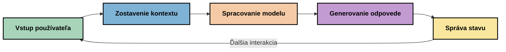
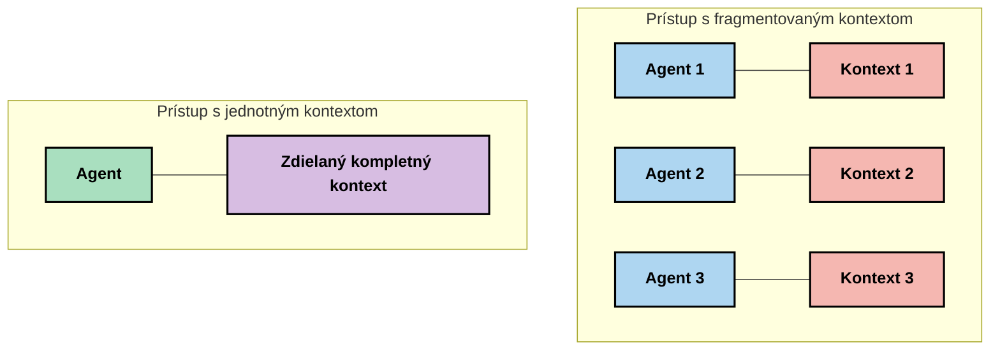
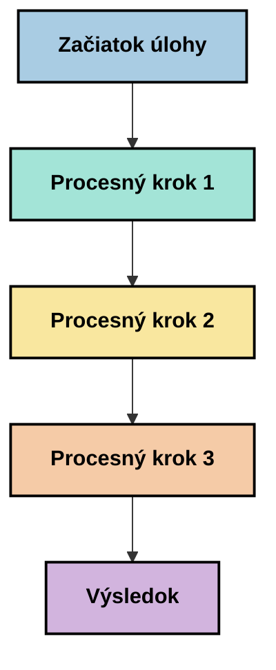
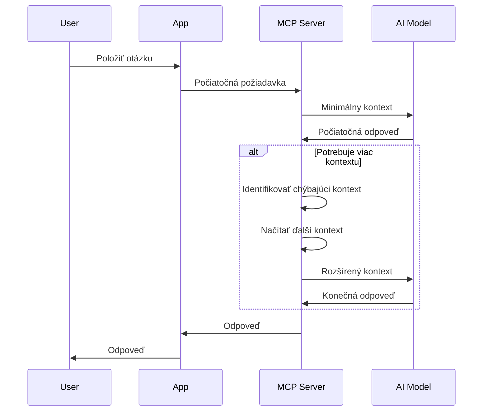
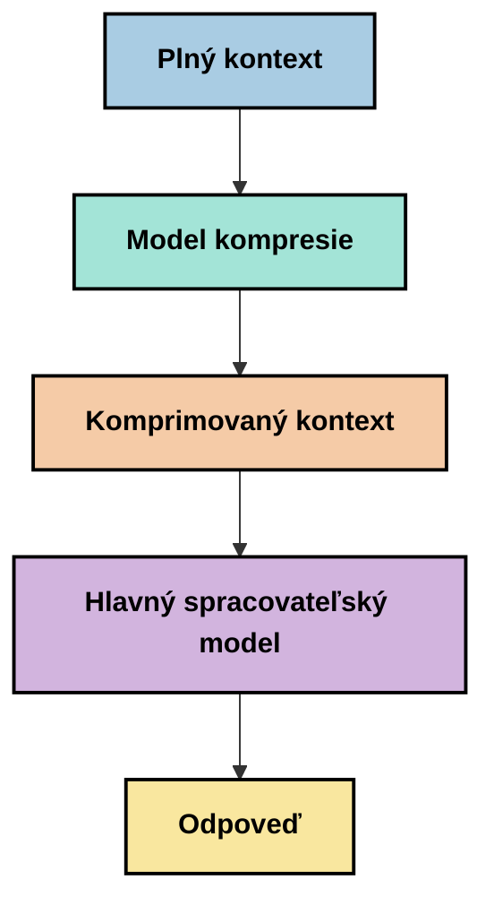
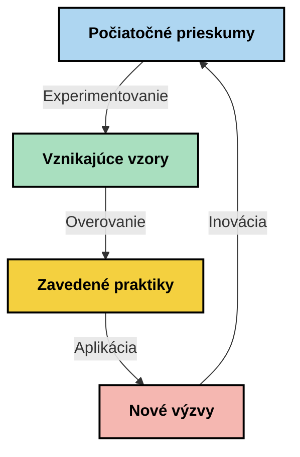

# Context Engineering: Novovznikajúci koncept v ekosystéme MCP

## Prehľad

Context engineering je novovznikajúci koncept v oblasti AI, ktorý skúma, ako je informácia štruktúrovaná, doručovaná a udržiavaná počas interakcií medzi klientmi a AI službami. Ako sa ekosystém Model Context Protocol (MCP) vyvíja, porozumenie tomu, ako efektívne spravovať kontext, naberá na význame. Tento modul predstavuje koncept kontextového inžinierstva a skúma jeho potenciálne použitia v implementáciách MCP.

## Ciele učenia

Na konci tohto modulu budete schopní:

- Pochopiť novovznikajúci koncept kontextového inžinierstva a jeho potenciálnu úlohu v aplikáciách MCP
- Identifikovať kľúčové výzvy v správe kontextu, ktoré rieši návrh protokolu MCP
- Preskúmať techniky na zlepšenie výkonu modelu cez lepšiu správu kontextu
- Zvážiť prístupy k meraniu a hodnoteniu efektívnosti kontextu
- Aplikovať tieto novovznikajúce koncepty na zlepšenie AI zážitkov prostredníctvom rámca MCP

## Úvod do kontextového inžinierstva

Kontextové inžinierstvo je novovznikajúci koncept zameraný na úmyselný návrh a správu toku informácií medzi používateľmi, aplikáciami a AI modelmi. Na rozdiel od etablovaných oblastí ako prompt engineering, kontextové inžinierstvo je ešte definované praktikmi, ktorí sa snažia vyriešiť jedinečné výzvy poskytovania AI modelom správnych informácií v správnom čase.

Ako sa veľké jazykové modely (LLM) vyvíjajú, dôležitosť kontextu sa stáva čoraz zrejmejšou. Kvalita, relevantnosť a štruktúra poskytnutého kontextu priamo ovplyvňujú výstupy modelu. Kontextové inžinierstvo skúma tento vzťah a usiluje sa vyvinúť princípy efektívnej správy kontextu.

> „V roku 2025 sú modely veľmi inteligentné. Ale ani ten najinteligentnejší človek nedokáže svoju prácu efektívne vykonať bez kontextu toho, čo má robiť... ‚Kontextové inžinierstvo‘ je ďalšia úroveň prompt engineering. Ide o to robiť to automaticky v dynamickom systéme.“ — Walden Yan, Cognition AI

Kontextové inžinierstvo môže zahŕňať:

1. **Výber kontextu**: Určenie, ktoré informácie sú relevantné pre danú úlohu
2. **Štruktúrovanie kontextu**: Organizovanie informácií na maximalizáciu porozumenia modelu
3. **Doručenie kontextu**: Optimalizácia spôsobu a času odoslania informácií modelom
4. **Udržiavanie kontextu**: Správa stavu a vývoja kontextu v čase
5. **Hodnotenie kontextu**: Meranie a zlepšovanie efektívnosti kontextu

Tieto oblasti sú obzvlášť relevantné pre ekosystém MCP, ktorý poskytuje štandardizovaný spôsob, ako aplikácie môžu poskytovať kontext veľkým jazykovým modelom.


## Perspektíva cesty kontextu

Jedným zo spôsobov, ako si predstaviť kontextové inžinierstvo, je sledovať cestu, ktorú informácia prechádza systémom MCP:



### Kľúčové fázy na ceste kontextu:

1. **Vstup používateľa**: Surové informácie od používateľa (text, obrázky, dokumenty)
2. **Zostavenie kontextu**: Kombinovanie vstupu používateľa so systémovým kontextom, históriou konverzácií a inými získanými informáciami
3. **Spracovanie modelom**: AI model spracuje zostavený kontext
4. **Generovanie odpovede**: Model vytvára výstupy na základe poskytnutého kontextu
5. **Správa stavu**: Systém aktualizuje svoj interný stav na základe interakcie

Táto perspektíva zdôrazňuje dynamickú povahu kontextu v AI systémoch a otvára dôležité otázky o tom, ako najlepšie spravovať informácie v každej fáze.

## Novovznikajúce princípy kontextového inžinierstva

Ako sa formuje oblasť kontextového inžinierstva, niektoré skoré princípy sa začínajú objavovať u praktikujúcich. Tieto princípy môžu pomôcť pri rozhodovaní o implementácii MCP:

### Princíp 1: Zdieľajte kontext kompletne

Kontext by mal byť zdieľaný úplne vo všetkých častiach systému, a nie roztrieštený medzi viacerými agentmi alebo procesmi. Keď je kontext distribuovaný, rozhodnutia prijaté v jednej časti systému môžu byť v rozpore s rozhodnutiami z iných častí.



V aplikáciách MCP to naznačuje navrhnúť systémy tak, aby kontext plynule prechádzal celým procesom namiesto jeho rozdeľovania.

### Princíp 2: Uznajte, že akcie nesú implicitné rozhodnutia

Každá akcia modelu obsahuje implicitné rozhodnutia o tom, ako interpretovať kontext. Keď viaceré komponenty pracujú na rôznych kontextoch, tieto implicitné rozhodnutia môžu byť v konflikte, čo vedie ku nekonzistentným výsledkom.

Tento princíp má dôležité dôsledky pre aplikácie MCP:
- Uprednostňovať lineárne spracovanie komplexných úloh pred paralelným vykonávaním s roztriešteným kontextom
- Zabezpečiť, aby všetky rozhodovacie body mali prístup k rovnakým kontextovým informáciám
- Navrhovať systémy tak, aby neskoršie kroky mohli vidieť celý kontext skorších rozhodnutí

### Princíp 3: Vyvážiť hĺbku kontextu s obmedzeniami okien

Ako sa konverzácie a procesy predlžujú, okná kontextu sa nakoniec zaplnia. Efektívne kontextové inžinierstvo skúma prístupy, ako zvládnuť napätie medzi komplexnosťou kontextu a technickými obmedzeniami.

Potenciálne prístupy, ktoré sa skúmajú, zahŕňajú:
- Kompresiu kontextu, ktorá zachováva podstatné informácie a zároveň znižuje použitie tokenov
- Postupné načítavanie kontextu na základe relevantnosti pre aktuálne potreby
- Zhrnutie predchádzajúcich interakcií s uchovaním kľúčových rozhodnutí a faktov

## Výzvy kontextu a návrh protokolu MCP

Model Context Protocol (MCP) bol navrhnutý s uvedomením si jedinečných výziev správy kontextu. Pochopenie týchto výziev pomáha vysvetliť kľúčové aspekty návrhu protokolu MCP:


### Výzva 1: Obmedzenia okna kontextu
Väčšina AI modelov má pevne stanovenú veľkosť okna kontextu, čo limituje množstvo informácií, ktoré môžu spracovať naraz.

**Odpoveď návrhu MCP:** 
- Protokol podporuje štruktúrovaný kontext založený na zdrojoch, ktoré možno efektívne odkazovať
- Zdroje môžu byť stránkované a načítavané postupne

### Výzva 2: Určenie relevantnosti
Určenie, ktorá informácia je najrelevantnejšia na zahrnutie do kontextu, je náročné.

**Odpoveď návrhu MCP:**
- Flexibilné nástroje umožňujú dynamické získavanie informácií podľa potreby
- Štruktúrované prompt-y umožňujú konzistentnú organizáciu kontextu

### Výzva 3: Pretrvávanie kontextu
Správa stavu počas interakcií vyžaduje dôkladné sledovanie kontextu.

**Odpoveď návrhu MCP:**
- Štandardizovaná správa relácií
- Jasne definované vzory interakcií pre evolúciu kontextu

### Výzva 4: Multimodálny kontext
Rôzne typy dát (text, obrázky, štruktúrované dáta) vyžadujú rôzne zaobchádzanie.

**Odpoveď návrhu MCP:**
- Návrh protokolu prispôsobuje rôznym typom obsahu
- Štandardizovaná reprezentácia multimodálnych informácií

### Výzva 5: Bezpečnosť a súkromie
Kontext často obsahuje citlivé informácie, ktoré je potrebné chrániť.

**Odpoveď návrhu MCP:**
- Jasné hranice medzi zodpovednosťami klienta a servera
- Možnosti lokálneho spracovania na minimalizáciu vystavenia dát

Pochopenie týchto výziev a spôsobov, ako ich MCP rieši, poskytuje základ pre skúmanie pokročilých techník kontextového inžinierstva.

## Novovznikajúce prístupy ku kontextovému inžinierstvu

Ako sa oblasť kontextového inžinierstva vyvíja, objavujú sa viaceré sľubné prístupy. Tieto predstavujú aktuálne myslenie, nie zavedené osvedčené postupy, a pravdepodobne sa budú meniť s pribúdajúcimi skúsenosťami s implementáciami MCP.

### 1. Lineárne spracovanie jedným vláknom

Na rozdiel od viacagentových architektúr, ktoré rozdeľujú kontext, niektorí praktici zistili, že lineárne spracovanie jedným vláknom prináša konzistentnejšie výsledky. Toto korešponduje s princípom udržiavania jednotného kontextu.



Aj keď sa tento prístup môže zdať menej efektívny ako paralelné spracovanie, často vedie k koherentnejším a spoľahlivejším výsledkom, pretože každý krok vychádza z úplného pochopenia predchádzajúcich rozhodnutí.

### 2. Členenie a prioritizácia kontextu

Rozdelenie veľkých kontextov na spravovateľné časti a uprednostnenie tých najdôležitejších.

```python
# Konceptuálny príklad: Rozdelenie kontextu na časti a prioritizácia
def process_with_chunked_context(documents, query):
    # 1. Rozdeľte dokumenty na menšie časti
    chunks = chunk_documents(documents)
    
    # 2. Vypočítajte skóre relevantnosti pre každú časť
    scored_chunks = [(chunk, calculate_relevance(chunk, query)) for chunk in chunks]
    
    # 3. Zoradiť časti podľa skóre relevantnosti
    sorted_chunks = sorted(scored_chunks, key=lambda x: x[1], reverse=True)
    
    # 4. Použite najrelevantnejšie časti ako kontext
    context = create_context_from_chunks([chunk for chunk, score in sorted_chunks[:5]])
    
    # 5. Spracujte s prioritizovaným kontextom
    return generate_response(context, query)
```

Koncept uvedený vyššie znázorňuje, ako môžeme rozdeliť veľké dokumenty na spravovateľné časti a vybrať len najrelevantnejšie kúsky pre kontext. Tento prístup pomáha pracovať v rámci obmedzení okna kontextu a zároveň využívať rozsiahle znalostné bázy.

### 3. Postupné načítanie kontextu

Načítavanie kontextu postupne podľa potreby namiesto všetkého naraz.



Postupné načítavanie kontextu začína minimálnym kontextom a rozširuje sa len keď je to potrebné. Toto môže významne znížiť používanie tokenov pri jednoduchých otázkach a zároveň zachovať schopnosť riešiť zložité dotazy.

### 4. Kompresia a zhrnutie kontextu

Znižovanie veľkosti kontextu pri zachovaní kľúčových informácií.



Kompresia kontextu sa zameriava na:
- Odstraňovanie redundantných informácií
- Zhrnutie rozsiahleho obsahu
- Extrahovanie kľúčových faktov a detailov
- Zachovanie kritických prvkov kontextu
- Optimalizáciu z hľadiska efektivity tokenov

Tento prístup môže byť mimoriadne hodnotný pre udržanie dlhých konverzácií v rámci okien kontextu alebo pre efektívne spracovanie veľkých dokumentov. Niektorí praktici používajú špecializované modely práve na kompresiu kontextu a zhrnutie histórie konverzácií.


## Prieskumné úvahy pri kontextovom inžinierstve

Pri skúmaní novovznikajúcej oblasti kontextového inžinierstva stojí za zváženie niekoľko úvah pri práci s implementáciami MCP. Nie sú to preskriptívne osvedčené postupy, ale oblasti skúmania, ktoré môžu priniesť zlepšenia vo vašom konkrétnom prípade použitia.

### Zvážte svoje ciele kontextu

Pred zavedením komplexných riešení správy kontextu jasne definujte, čo sa snažíte dosiahnuť:
- Aké konkrétne informácie model potrebuje na úspech?
- Ktoré informácie sú podstatné a ktoré doplnkové?
- Aké sú vaše výkonnostné obmedzenia (latencia, limity tokenov, náklady)?

### Preskúmajte vrstvené prístupy ku kontextu

Niektorí praktici dosahujú úspechy s kontextom usporiadaným do konceptuálnych vrstiev:
- **Jadrová vrstva**: Nevyhnutné informácie, ktoré model vždy potrebuje
- **Situacionálna vrstva**: Kontext špecifický pre aktuálnu interakciu
- **Podporná vrstva**: Dodatočné informácie, ktoré môžu byť užitočné
- **Núdzová vrstva**: Informácie prístupné iba v prípade potreby

### Preskúmajte stratégie získavania informácií

Efektívnosť vášho kontextu často závisí od spôsobu, akým získavate informácie:
- Sémantické vyhľadávanie a embeddings na vyhľadávanie konceptuálne relevantných informácií
- Vyhľadávanie podľa kľúčových slov pre konkrétne faktické detaily
- Hybridné prístupy kombinujúce viaceré metódy získavania
- Filtrovanie metadát na zužovanie rozsahu na základe kategórií, dátumov alebo zdrojov

### Experimentujte s koherenciou kontextu

Štruktúra a tok vášho kontextu môžu ovplyvniť porozumenie modelu:
- Zoskupovanie súvisiacich informácií dohromady
- Používanie konzistentného formátovania a organizácie
- Udržiavanie logického alebo chronologického poradia, kde je to vhodné
- Vyhýbanie sa protirečivým informáciám

### Zvážte kompromisy multiagentových architektúr

Hoci multiagentové architektúry sú populárne v mnohých AI rámcoch, prinášajú značné výzvy pre správu kontextu:
- Fragmentácia kontextu môže viesť k nekonzistentným rozhodnutiam medzi agentmi
- Paralelné spracovanie môže zavádzať konflikty ťažko zlučiteľné
- Komunikačné náklady medzi agentmi môžu znižovať výkonnostné zisky
- Na udržanie koherencie je potrebná komplexná správa stavu

V mnohých prípadoch môže singleagentový prístup s komplexnou správou kontextu prinášať spoľahlivejšie výsledky než viacero špecializovaných agentov s roztriešteným kontextom.

### Vyvíjajte metódy hodnotenia

Na zlepšenie kontextového inžinierstva v priebehu času zvažujte, ako budete merať úspešnosť:
- A/B testovanie rôznych štruktúr kontextu
- Monitorovanie používania tokenov a časov odozvy
- Sledovanie spokojnosti používateľov a mier dokončenia úloh
- Analýzu, kedy a prečo kontextové stratégie zlyhávajú

Tieto úvahy predstavujú aktívne oblasti skúmania v priestore kontextového inžinierstva. Ako sa pole vyvíja, pravdepodobne sa objavia definovanejšie vzory a postupy.

## Meranie efektívnosti kontextu: Vyvíjajúce sa rámce

Ako kontextové inžinierstvo vzniká ako koncept, praktici začínajú skúmať, ako by sa jeho efektívnosť mohla merať. Zatiaľ neexistuje zavedený rámec, ale uvažujú sa rôzne metriky, ktoré by mohli nasmerovať budúcu prácu.

### Potenciálne rozmery merania


#### 1. Úvahy o efektívnosti vstupu

- **Pomer kontext - odpoveď**: Koľko kontextu je potrebné vzhľadom na veľkosť odpovede?
- **Využitie tokenov**: Aké percento poskytnutých tokenov kontextu ovplyvňuje odpoveď?
- **Redukcia kontextu**: Ako efektívne môžeme komprimovať surové informácie?

#### 2. Výkonnostné úvahy

- **Vplyv na latenciu**: Ako správa kontextu ovplyvňuje čas odozvy?
- **Tokenová ekonomika**: Optimalizujeme používanie tokenov efektívne?
- **Presnosť získavania**: Ako relevantná je získaná informácia?
- **Využitie zdrojov**: Aké výpočtové zdroje sú potrebné?

#### 3. Úvahy o kvalite

- **Relevantnosť odpovede**: Ako dobre odpoveď adresuje otázku?
- **Faktuálna presnosť**: Zlepšuje správa kontextu faktickú presnosť?
- **Konzistencia**: Sú odpovede konzistentné pri podobných otázkach?
- **Miera halucinácií**: Znižuje lepší kontext halucinácie modelu?

#### 4. Úvahy o používateľskom zážitku

- **Miera opakovaných otázok**: Ako často používatelia potrebujú ďalšie objasnenie?
- **Dokončenie úloh**: Dokážu používatelia úspešne dokončiť svoje ciele?
- **Ukazovatele spokojnosti**: Ako používatelia hodnotia svoj zážitok?

### Prieskumné prístupy k meraniu

Pri experimentoch s kontextovým inžinierstvom v implementáciách MCP uvažujte o týchto prieskumných prístupoch:

1. **Základné porovnania**: Stanovte základné hodnoty s jednoduchými prístupmi ku kontextu pred testovaním sofistikovanejších metód

2. **Inkrementálne zmeny**: Meníte jeden aspekt správy kontextu naraz, aby sa izolovali jeho účinky

3. **Hodnotenie z pohľadu používateľa**: Kombinujte kvantitatívne metriky s kvalitatívnou spätnou väzbou používateľov

4. **Analýza zlyhaní**: Preskúmajte prípady, kde kontextové stratégie zlyhali, aby ste pochopili možné zlepšenia

5. **Viacdimenziálne hodnotenie**: Zvážte kompromisy medzi efektívnosťou, kvalitou a používateľským zážitkom

Tento experimentálny, viacrozmerný prístup k meraniu korešponduje s novovznikajúcou povahou kontextového inžinierstva.

## Záverečné myšlienky

Kontextové inžinierstvo je novovznikajúca oblasť skúmania, ktorá by mohla byť kľúčová pre efektívne aplikácie MCP. Starostlivým zvážením toku informácií vo vašom systéme môžete potenciálne vytvoriť AI zážitky, ktoré sú efektívnejšie, presnejšie a hodnotnejšie pre používateľov.

Techniky a prístupy popísané v tomto module predstavujú skoré myslenie v tejto oblasti, nie zavedené praktiky. Kontextové inžinierstvo sa môže vyvinúť do definovanejšej disciplíny, ako sa možnosti AI zlepšujú a naše poznatky prehlbujú. Zatiaľ sa zdá, že najproduktívnejším prístupom je experimentovanie spojené so starostlivým meraním.

## Potenciálne budúce smerovania

Oblasť kontextového inžinierstva je stále v raných štádiách, ale objavujú sa viaceré sľubné smery:

- Princípy kontextového inžinierstva môžu výrazne ovplyvniť výkon modelu, efektívnosť, používateľský zážitok a spoľahlivosť
- Jednovláknové prístupy s komplexnou správou kontextu môžu prekonať multiagentové architektúry v mnohých prípadoch použitia
- Špecializované modely na kompresiu kontextu sa môžu stať štandardnými súčasťami AI pipeline
- Napätie medzi úplnosťou kontextu a obmedzeniami tokenov pravdepodobne podnieti inováciu v správe kontextu
- Ako sa modely stávajú schopnejšími efektívnej komunikácie podobnej ľudskému jazyku, skutočná multi-agentná spolupráca môže byť životaschopnejšia
- Implementácie MCP sa môžu vyvíjať tak, aby štandardizovali vzory správy kontextu vychádzajúce zo súčasných experimentov



## Zdroje

### Oficiálne zdroje MCP
- [Stránka Model Context Protocol](https://modelcontextprotocol.io/)
- [Špecifikácia Model Context Protocol](https://github.com/modelcontextprotocol/modelcontextprotocol)

- [MCP Dokumentácia](https://modelcontextprotocol.io/docs)
- [MCP C# SDK](https://github.com/modelcontextprotocol/csharp-sdk)
- [MCP Python SDK](https://github.com/modelcontextprotocol/python-sdk)
- [MCP TypeScript SDK](https://github.com/modelcontextprotocol/typescript-sdk)
- [MCP Inspector](https://github.com/modelcontextprotocol/inspector) - Nástroj na vizuálne testovanie pre MCP servery

### Články o kontextovom inžinierstve
- [Nestavajte multi-agentov: Princípy kontextového inžinierstva](https://cognition.ai/blog/dont-build-multi-agents) - Pohľady Waldena Yana na princípy kontextového inžinierstva
- [Praktický návod na tvorbu agentov](https://cdn.openai.com/business-guides-and-resources/a-practical-guide-to-building-agents.pdf) - Sprievodca spoločnosti OpenAI o efektívnom návrhu agentov
- [Tvorba efektívnych agentov](https://www.anthropic.com/engineering/building-effective-agents) - Prístup spoločnosti Anthropic k vývoju agentov

### Súvisiaci výskum
- [Dynamické zosilnenie vyhľadávania pre veľké jazykové modely](https://arxiv.org/abs/2310.01487) - Výskum dynamických prístupov k vyhľadávaniu
- [Stratení uprostred: Ako jazykové modely využívajú dlhé kontexty](https://arxiv.org/abs/2307.03172) - Dôležitý výskum o vzoroch spracovania kontextu
- [Hierarchická generácia obrázkov na základe textu s CLIP latentmi](https://arxiv.org/abs/2204.06125) - Článok o DALL-E 2 s pohľadmi na štruktúrovanie kontextu
- [Preskúmanie úlohy kontextu v architektúrach veľkých jazykových modelov](https://aclanthology.org/2023.findings-emnlp.124/) - Nedávny výskum o spracovaní kontextu
- [Spolupráca viacerých agentov: Prehľad](https://arxiv.org/abs/2304.03442) - Výskum systémov viacerých agentov a ich výziev

### Ďalšie zdroje
- [Techniky optimalizácie kontextového okna](https://learn.microsoft.com/en-us/azure/ai-services/openai/concepts/context-window)
- [Pokročilé techniky RAG](https://www.microsoft.com/en-us/research/blog/retrieval-augmented-generation-rag-and-frontier-models/)
- [Dokumentácia Semantic Kernel](https://github.com/microsoft/semantic-kernel)
- [AI Toolkit pre správu kontextu](https://github.com/microsoft/aitoolkit)

## Čo nasleduje 

- [5.15 MCP vlastná doprava](../mcp-transport/README.md)

---

<!-- CO-OP TRANSLATOR DISCLAIMER START -->
**Vyhlásenie o zodpovednosti**:
Tento dokument bol preložený pomocou AI prekladateľskej služby [Co-op Translator](https://github.com/Azure/co-op-translator). Hoci sa snažíme o presnosť, vezmite prosím na vedomie, že automatické preklady môžu obsahovať chyby alebo nepresnosti. Pôvodný dokument v jeho natívnom jazyku by mal byť považovaný za autoritatívny zdroj. Pre kritické informácie sa odporúča profesionálny ľudský preklad. Nie sme zodpovední za žiadne nedorozumenia alebo nesprávne interpretácie vyplývajúce z použitia tohto prekladu.
<!-- CO-OP TRANSLATOR DISCLAIMER END -->