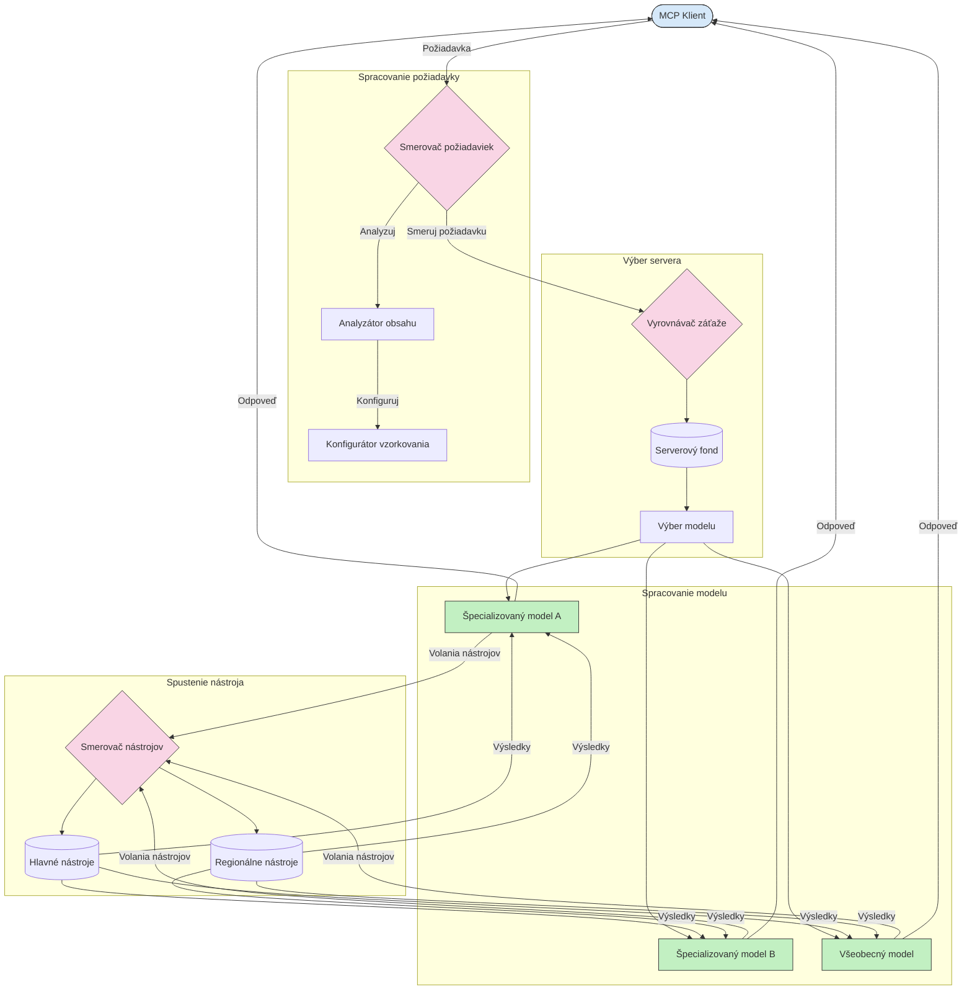

# Routovanie v protokole Model Context

Routovanie je nevyhnutné na smerovanie požiadaviek na príslušné modely, nástroje alebo služby v rámci ekosystému MCP.

## Úvod

Routovanie v protokole Model Context (MCP) zahŕňa smerovanie požiadaviek na najvhodnejšie modely alebo služby na základe rôznych kritérií, ako je typ obsahu, kontext používateľa a zaťaženie systému. To zabezpečuje efektívne spracovanie a optimálne využitie zdrojov.

## Ciele učenia

Na konci tejto lekcie budete schopní:

- Pochopiť princípy routovania v MCP.
- Implementovať routovanie založené na obsahu na smerovanie požiadaviek na špecializované služby.
- Použiť inteligentné stratégie vyvažovania záťaže na optimalizáciu využitia zdrojov.
- Implementovať dynamické routovanie nástrojov na základe kontextu požiadavky.

## Routovanie založené na obsahu

Routovanie založené na obsahu smeruje požiadavky na špecializované služby podľa obsahu požiadavky. Napríklad požiadavky súvisiace s generovaním kódu môžu byť smerované na špecializovaný kódovací model, zatiaľ čo požiadavky na kreatívne písanie môžu byť odoslané do modelu pre kreatívne písanie.

Pozrime sa na príklad implementácie v rôznych programovacích jazykoch.

<details>
<summary>.NET</summary>

```csharp
// .NET Example: Content-based routing in MCP
public class ContentBasedRouter
{
    private readonly Dictionary<string, McpClient> _specializedClients;
    private readonly RoutingClassifier _classifier;
    
    public ContentBasedRouter()
    {
        // Initialize specialized clients for different domains
        _specializedClients = new Dictionary<string, McpClient>
        {
            ["code"] = new McpClient("https://code-specialized-mcp.com"),
            ["creative"] = new McpClient("https://creative-specialized-mcp.com"),
            ["scientific"] = new McpClient("https://scientific-specialized-mcp.com"),
            ["general"] = new McpClient("https://general-mcp.com")
        };
        
        // Initialize content classifier
        _classifier = new RoutingClassifier();
    }
    
    public async Task<McpResponse> RouteAndProcessAsync(string prompt, IDictionary<string, object> parameters = null)
    {
        // Classify the prompt to determine the best specialized service
        string category = await _classifier.ClassifyPromptAsync(prompt);
        
        // Get the appropriate client or fall back to general
        var client = _specializedClients.ContainsKey(category) 
            ? _specializedClients[category] 
            : _specializedClients["general"];
            
        Console.WriteLine($"Routing request to {category} specialized service");
        
        // Send request to the selected service
        return await client.SendPromptAsync(prompt, parameters);
    }
    
    // Simple classifier for routing decisions
    private class RoutingClassifier
    {
        public Task<string> ClassifyPromptAsync(string prompt)
        {
            prompt = prompt.ToLowerInvariant();
            
            if (prompt.Contains("code") || prompt.Contains("function") || 
                prompt.Contains("program") || prompt.Contains("algorithm"))
            {
                return Task.FromResult("code");
            }
            
            if (prompt.Contains("story") || prompt.Contains("creative") || 
                prompt.Contains("imagine") || prompt.Contains("design"))
            {
                return Task.FromResult("creative");
            }
            
            if (prompt.Contains("science") || prompt.Contains("research") || 
                prompt.Contains("analyze") || prompt.Contains("study"))
            {
                return Task.FromResult("scientific");
            }
            
            return Task.FromResult("general");
        }
    }
}
```

V predchádzajúcom kóde sme:

- Vytvorili triedu `ContentBasedRouter`, ktorá smeruje požiadavky na základe obsahu promptu.
- Inicializovali špecializovaných klientov pre rôzne domény (kód, tvorivosť, vedecké, všeobecné).
- Implementovali jednoduchý klasifikátor, ktorý určuje kategóriu promptu a smeruje ho na príslušnú špecializovanú službu.
- Použili mechanizmus záložného riešenia na smerovanie požiadaviek na všeobecnú službu, ak nie je dostupná žiadna špecializovaná služba.
- Implementovali asynchrónne spracovanie na efektívnu obsluhu požiadaviek.
- Použili slovník na mapovanie kategórií obsahu na špecializovaných MCP klientov.
- Implementovali jednoduchý klasifikátor, ktorý analyzuje prompt a vracia príslušnú kategóriu.
- Použili špecializovaného klienta na odoslanie požiadavky a obdržanie odpovede.
- Zaobchádzali s prípadmi, keď prompt nezodpovedá žiadnej špecializovanej kategórii, smerovaním na všeobecnú službu.

</details>

## Inteligentné vyvažovanie záťaže

Vyvažovanie záťaže optimalizuje využitie zdrojov a zabezpečuje vysokú dostupnosť služieb MCP. Existujú rôzne spôsoby implementácie vyvažovania záťaže, ako napríklad round-robin, vážený čas odozvy alebo stratégie vedomé obsahu.

Pozrime sa na príklad implementácie, ktorý používa nasledujúce stratégie:

- **Round Robin**: Rovnomerne rozdeľuje požiadavky medzi dostupné servery.
- **Vážený čas odozvy**: Smeruje požiadavky na servery na základe ich priemerného času odozvy.
- **Vedomý obsahu**: Smeruje požiadavky na špecializované servery na základe obsahu požiadavky.

<details>
<summary>Java</summary>

```java
// Java príklad: Inteligentné vyvažovanie záťaže pre MCP servery
public class McpLoadBalancer {
    private final List<McpServerNode> serverNodes;
    private final LoadBalancingStrategy strategy;
    
    public McpLoadBalancer(List<McpServerNode> nodes, LoadBalancingStrategy strategy) {
        this.serverNodes = new ArrayList<>(nodes);
        this.strategy = strategy;
    }
    
    public McpResponse processRequest(McpRequest request) {
        // Vyberte najlepší server na základe stratégie
        McpServerNode selectedNode = strategy.selectNode(serverNodes, request);
        
        try {
            // Smerujte požiadavku na vybraný uzol
            return selectedNode.processRequest(request);
        } catch (Exception e) {
            // Riešte zlyhanie - implementujte logiku opakovania alebo záložného riešenia
            System.err.println("Error processing request on node " + selectedNode.getId() + ": " + e.getMessage());
            
            // Označte uzol ako potenciálne nezdravý
            selectedNode.recordFailure();
            
            // Vyskúšajte ďalší najlepší uzol ako záložný
            List<McpServerNode> remainingNodes = new ArrayList<>(serverNodes);
            remainingNodes.remove(selectedNode);
            
            if (!remainingNodes.isEmpty()) {
                McpServerNode fallbackNode = strategy.selectNode(remainingNodes, request);
                return fallbackNode.processRequest(request);
            } else {
                throw new RuntimeException("All MCP server nodes failed to process the request");
            }
        }
    }
    
    // Úloha overenia zdravia uzla
    public void startHealthChecks(Duration interval) {
        ScheduledExecutorService scheduler = Executors.newScheduledThreadPool(1);
        scheduler.scheduleAtFixedRate(() -> {
            for (McpServerNode node : serverNodes) {
                try {
                    boolean isHealthy = node.checkHealth();
                    System.out.println("Node " + node.getId() + " health status: " + 
                                      (isHealthy ? "HEALTHY" : "UNHEALTHY"));
                } catch (Exception e) {
                    System.err.println("Health check failed for node " + node.getId());
                    node.setHealthy(false);
                }
            }
        }, 0, interval.toMillis(), TimeUnit.MILLISECONDS);
    }
    
    // Rozhranie pre stratégie vyvažovania záťaže
    public interface LoadBalancingStrategy {
        McpServerNode selectNode(List<McpServerNode> nodes, McpRequest request);
    }
    
    // Stratégiu round-robin
    public static class RoundRobinStrategy implements LoadBalancingStrategy {
        private AtomicInteger counter = new AtomicInteger(0);
        
        @Override
        public McpServerNode selectNode(List<McpServerNode> nodes, McpRequest request) {
            List<McpServerNode> healthyNodes = nodes.stream()
                .filter(McpServerNode::isHealthy)
                .collect(Collectors.toList());
            
            if (healthyNodes.isEmpty()) {
                throw new RuntimeException("No healthy nodes available");
            }
            
            int index = counter.getAndIncrement() % healthyNodes.size();
            return healthyNodes.get(index);
        }
    }
    
    // Stratégiu s váženým časom odozvy
    public static class ResponseTimeStrategy implements LoadBalancingStrategy {
        @Override
        public McpServerNode selectNode(List<McpServerNode> nodes, McpRequest request) {
            return nodes.stream()
                .filter(McpServerNode::isHealthy)
                .min(Comparator.comparing(McpServerNode::getAverageResponseTime))
                .orElseThrow(() -> new RuntimeException("No healthy nodes available"));
        }
    }
    
    // Stratégiu zohľadňujúcu obsah
    public static class ContentAwareStrategy implements LoadBalancingStrategy {
        @Override
        public McpServerNode selectNode(List<McpServerNode> nodes, McpRequest request) {
            // Určte charakteristiky požiadavky
            boolean isCodeRequest = request.getPrompt().contains("code") || 
                                   request.getAllowedTools().contains("codeInterpreter");
            
            boolean isCreativeRequest = request.getPrompt().contains("creative") || 
                                       request.getPrompt().contains("story");
            
            // Nájdite špecializované uzly
            Optional<McpServerNode> specializedNode = nodes.stream()
                .filter(McpServerNode::isHealthy)
                .filter(node -> {
                    if (isCodeRequest && node.getSpecialization().equals("code")) {
                        return true;
                    }
                    if (isCreativeRequest && node.getSpecialization().equals("creative")) {
                        return true;
                    }
                    return false;
                })
                .findFirst();
            
            // Vráťte špecializovaný uzol alebo najmenej zaťažený uzol
            return specializedNode.orElse(
                nodes.stream()
                    .filter(McpServerNode::isHealthy)
                    .min(Comparator.comparing(McpServerNode::getCurrentLoad))
                    .orElseThrow(() -> new RuntimeException("No healthy nodes available"))
            );
        }
    }
}
```

V predchádzajúcom kóde sme:

- Vytvorili triedu `McpLoadBalancer`, ktorá spravuje zoznam MCP serverových nodov a smeruje požiadavky na základe zvolenej stratégie vyvažovania záťaže.
- Implementovali rôzne stratégie vyvažovania záťaže: `RoundRobinStrategy`, `ResponseTimeStrategy` a `ContentAwareStrategy`.
- Použili `ScheduledExecutorService` na periodickú kontrolu zdravia serverových nodov.
- Implementovali mechanizmus kontroly zdravia, ktorý označuje nodi ako zdravé alebo nezdravé na základe ich odpovede na kontroly zdravia.
- Zaobchádzali so spracovaním požiadaviek s ošetrením chýb a záložnou logikou na zabezpečenie vysokej dostupnosti.
- Použili triedu `McpServerNode` na reprezentáciu jednotlivých MCP serverových nodov vrátane ich stavu zdravia, priemerného času odozvy a aktuálneho zaťaženia.
- Implementovali triedu `McpRequest` na zapuzdrenie detailov požiadavky, ako je prompt a povolené nástroje.
- Použili Java Streams na filtrovanie a výber nodov na základe stavu zdravia a špecializácie.

</details>

## Dynamické routovanie nástrojov

Routovanie nástrojov zabezpečuje, že volania nástrojov sú smerované na najvhodnejšiu službu na základe kontextu. Napríklad volanie nástroja počasia môže byť potrebné smerovať na regionálny endpoint na základe polohy používateľa, alebo kalkulačný nástroj môže potrebovať použiť konkrétnu verziu API.

Pozrime sa na príklad implementácie, ktorý demonštruje dynamické routovanie nástrojov založené na analýze požiadavky, regionálnych endpointoch a podpore verzií.

<details>
<summary>Python</summary>

```python
# Príklad v Pythone: Dynamické smerovanie nástrojov na základe analýzy požiadavky
class McpToolRouter:
    def __init__(self):
        # Registrovať dostupné koncové body nástrojov
        self.tool_endpoints = {
            "weatherTool": "https://weather-service.example.com/api",
            "calculatorTool": "https://calculator-service.example.com/compute",
            "databaseTool": "https://database-service.example.com/query",
            "searchTool": "https://search-service.example.com/search"
        }
        
        # Regionálne koncové body pre globálnu distribúciu
        self.regional_endpoints = {
            "us": {
                "weatherTool": "https://us-west.weather-service.example.com/api",
                "searchTool": "https://us.search-service.example.com/search"
            },
            "europe": {
                "weatherTool": "https://eu.weather-service.example.com/api",
                "searchTool": "https://eu.search-service.example.com/search"
            },
            "asia": {
                "weatherTool": "https://asia.weather-service.example.com/api",
                "searchTool": "https://asia.search-service.example.com/search"
            }
        }
        
        # Podpora verzovania nástrojov
        self.tool_versions = {
            "weatherTool": {
                "default": "v2",
                "v1": "https://weather-service.example.com/api/v1",
                "v2": "https://weather-service.example.com/api/v2",
                "beta": "https://weather-service.example.com/api/beta"
            }
        }
    
    async def route_tool_request(self, tool_name, parameters, user_context=None):
        """Route a tool request to the appropriate endpoint based on context"""
        endpoint = self._select_endpoint(tool_name, parameters, user_context)
        
        if not endpoint:
            raise ValueError(f"No endpoint available for tool: {tool_name}")
        
        # Vykonať skutočnú požiadavku na vybraný koncový bod
        return await self._execute_tool_request(endpoint, tool_name, parameters)
    
    def _select_endpoint(self, tool_name, parameters, user_context=None):
        """Select the most appropriate endpoint based on context"""
        # Základný koncový bod z registra
        if tool_name not in self.tool_endpoints:
            return None
            
        base_endpoint = self.tool_endpoints[tool_name]
        
        # Skontrolovať, či potrebujeme použiť konkrétnu verziu nástroja
        if tool_name in self.tool_versions:
            version_info = self.tool_versions[tool_name]
            
            # Použiť špecifikovanú verziu alebo predvolenú
            requested_version = parameters.get("_version", version_info["default"])
            if requested_version in version_info:
                base_endpoint = version_info[requested_version]
        
        # Skontrolovať regionálne smerovanie, ak je región používateľa známy
        if user_context and "region" in user_context:
            user_region = user_context["region"]
            
            if user_region in self.regional_endpoints:
                regional_tools = self.regional_endpoints[user_region]
                
                if tool_name in regional_tools:
                    # Použiť koncový bod špecifický pre región
                    return regional_tools[tool_name]
        
        # Skontrolovať požiadavky na ukladanie dát podľa regiónu
        if user_context and "data_residency" in user_context:
            # Táto časť by implementovala logiku na zabezpečenie, aby dáta zostali v určenej jurisdikcii
            pass
        
        # Skontrolovať smerovanie na základe latencie
        if user_context and "latency_sensitive" in user_context and user_context["latency_sensitive"]:
            # Táto časť by implementovala logiku na výber koncového bodu s najnižšou latenciou
            pass
            
        return base_endpoint
        
    async def _execute_tool_request(self, endpoint, tool_name, parameters):
        """Execute the actual tool request to the selected endpoint"""
        try:
            async with aiohttp.ClientSession() as session:
                async with session.post(
                    endpoint,
                    json={"toolName": tool_name, "parameters": parameters},
                    headers={"Content-Type": "application/json"}
                ) as response:
                    if response.status == 200:
                        result = await response.json()
                        return result
                    else:
                        error_text = await response.text()
                        raise Exception(f"Tool execution failed: {error_text}")
        except Exception as e:
            # Implementovať logiku opakovania alebo stratégiu záložného riešenia
            print(f"Error executing tool {tool_name} at {endpoint}: {str(e)}")
            raise
```

V predchádzajúcom kóde sme:

- Vytvorili triedu `McpToolRouter`, ktorá spravuje routovanie nástrojov na základe analýzy požiadavky, regionálnych endpointov a podpory verzií.
- Registrovali dostupné endpointy nástrojov a regionálne endpointy pre globálne rozdelenie.
- Implementovali dynamickú logiku routovania, ktorá vyberá správny endpoint na základe kontextu používateľa, ako je región a požiadavky na ukladanie dát.
- Implementovali podporu verzií nástrojov, ktorá umožňuje používateľom špecifikovať, ktorú verziu nástroja chcú použiť.
- Použili asynchrónne HTTP požiadavky na vykonávanie volaní nástrojov a spracovanie odpovedí.

</details>

## Architektúra sampling a routovania v MCP

Sampling je kritickou súčasťou protokolu Model Context (MCP), ktorá umožňuje efektívne spracovanie a routovanie požiadaviek. Zahŕňa analýzu prichádzajúcich požiadaviek s cieľom určiť najvhodnejší model alebo službu na ich spracovanie na základe rôznych kritérií, ako je typ obsahu, kontext používateľa a zaťaženie systému.

Sampling a routovanie možno skombinovať na vytvorenie robustnej architektúry, ktorá optimalizuje využitie zdrojov a zabezpečuje vysokú dostupnosť. Proces sampling možno použiť na klasifikáciu požiadaviek, zatiaľ čo routovanie ich smeruje na príslušné modely alebo služby.

Nasledujúci diagram znázorňuje, ako sampling a routovanie spolupracujú v komplexnej architektúre MCP:



## Čo bude ďalej

- [5.6 Sampling](../mcp-sampling/README.md)

---

<!-- CO-OP TRANSLATOR DISCLAIMER START -->
**Vyhlásenie o zodpovednosti**:
Tento dokument bol preložený pomocou AI prekladateľskej služby [Co-op Translator](https://github.com/Azure/co-op-translator). Hoci sa snažíme o presnosť, vezmite prosím na vedomie, že automatické preklady môžu obsahovať chyby alebo nepresnosti. Pôvodný dokument v jeho natívnom jazyku by mal byť považovaný za autoritatívny zdroj. Pre kritické informácie sa odporúča profesionálny ľudský preklad. Nie sme zodpovední za žiadne nedorozumenia alebo nesprávne interpretácie vyplývajúce z použitia tohto prekladu.
<!-- CO-OP TRANSLATOR DISCLAIMER END -->