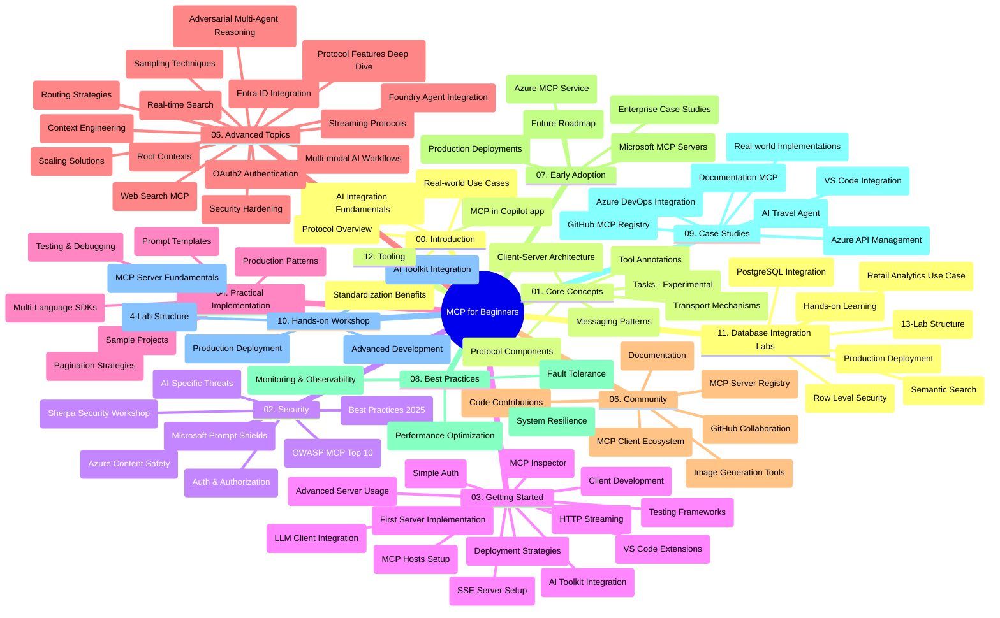

# Model Context Protocol (MCP) pre začiatočníkov - študijný sprievodca

Tento študijný sprievodca poskytuje prehľad štruktúry a obsahu repozitára pre kurz "Model Context Protocol (MCP) pre začiatočníkov". Použite tento sprievodcu na efektívnu navigáciu v repozitári a maximálne využitie dostupných zdrojov.

## Prehľad repozitára

Model Context Protocol (MCP) je štandardizovaný rámec pre interakcie medzi AI modelmi a aplikačnými klientmi. Pôvodne vytvorený spoločnosťou Anthropic, MCP je teraz spravovaný širšou komunitou MCP prostredníctvom oficiálnej organizácie na GitHube. Tento repozitár poskytuje komplexný kurz s praktickými príkladmi kódu v jazykoch C#, Java, JavaScript, Python a TypeScript, určený pre AI vývojárov, systémových architektov a softvérových inžinierov.

## Vizualizácia kurikula

## Štruktúra repozitára

Repozitár je organizovaný do dvanástich hlavných sekcií, z ktorých každá sa zameriava na rôzne aspekty MCP:

1. **Úvod (00-Introduction/)**
   - Prehľad Model Context Protocol
   - Prečo je štandardizácia dôležitá v AI pipeline
   - Praktické použitia a výhody

2. **Základné koncepty (01-CoreConcepts/)**
   - Klient-server architektúra
   - Kľúčové komponenty protokolu
   - Komunikačné vzory v MCP
   - Pohľad dopredu: [Čo sa mení v MCP: Kandidát špecifikácie 2026-07-28](./01-CoreConcepts/mcp-2026-07-28-release-candidate.md) — bezstavový jadro protokolu, rámec rozšírení a očakávané vyradenia Roots/Sampling/Logging v ďalšej verzii špecifikácie

3. **Bezpečnosť (02-Security/)**
   - Bezpečnostné hrozby v systémoch založených na MCP
   - Najlepšie postupy pre zabezpečenie implementácií
   - Stratégie autentifikácie a autorizácie
   - **Komplexná dokumentácia bezpečnosti**:
     - MCP Najlepšie bezpečnostné postupy 2025
     - Príručka implementácie Azure Content Safety
     - MCP bezpečnostné kontroly a techniky
     - Rýchly odkaz na MCP Najlepšie postupy
   - **Kľúčové bezpečnostné témy**:
     - Útoky injekcie príkazov a otravovanie nástrojov
     - Ukradnutie relácie a problémy zmätku zástupcu
     - Zraniteľnosti prenosu tokenov
     - Nadmerné oprávnenia a kontrola prístupu
     - Bezpečnosť dodávateľského reťazca pre AI komponenty
     - Integrácia Microsoft Prompt Shields

4. **Začíname (03-GettingStarted/)**
   - Nastavenie a konfigurácia prostredia
   - Vytvorenie základných MCP serverov a klientov
   - Integrácia s existujúcimi aplikáciami
   - Obsahuje sekcie pre:
     - Prvú implementáciu servera
     - Vývoj klienta
     - Integrácia LLM klienta
     - Integrácia do VS Code
     - Server-Sent Events (SSE) server
     - Pokročilé použitie servera
     - HTTP streamovanie
     - Integrácia AI Toolkit
     - Testovacie stratégie
     - Pokyny pre nasadenie

5. **Praktická implementácia (04-PracticalImplementation/)**
   - Používanie SDK v rôznych programovacích jazykoch
   - Techniky ladenia, testovania a validácie
   - Tvorba znovupoužiteľných prompt šablón a pracovných tokov
   - Vzorky projektov s príkladmi implementácie

6. **Pokročilé témy (05-AdvancedTopics/)**
   - Techniky inžinierstva kontextu
   - Integrácia Foundry agenta
   - Multi-modálne AI pracovné toky
   - Demonštrácie autentifikácie OAuth2
   - Možnosti vyhľadávania v reálnom čase
   - Streamovanie v reálnom čase
   - Implementácia Root contexts
   - Trasy (routing) stratégie
   - Techniký vzorkovania (sampling)
   - Prístupy k škálovaniu
   - Bezpečnostné úvahy
   - Integrácia bezpečnosti Entra ID
   - Integrácia webového vyhľadávania
   - Adversariálne viacagentové uvažovanie (debate patterns)

7. **Príspevky komunity (06-CommunityContributions/)**
   - Ako prispieť kódom a dokumentáciou
   - Spolupráca prostredníctvom GitHubu
   - Vylepšenia a spätná väzba riadená komunitou
   - Používanie rôznych MCP klientov (Claude Desktop, Cline, VSCode)
   - Práca s populárnymi MCP servermi vrátane generovania obrázkov

8. **Lekcie z raného nasadenia (07-LessonsfromEarlyAdoption/)**
   - Reálne implementácie a úspešné príbehy
   - Budovanie a nasadzovanie riešení založených na MCP
   - Trendy a budúca cesta
   - **Sprievodca Microsoft MCP servermi**: Kompletný sprievodca 10 produkčnými Microsoft MCP servermi vrátane:
     - Microsoft Learn Docs MCP Server
     - Azure MCP Server (15+ špecializovaných konektorov)
     - GitHub MCP Server
     - Azure DevOps MCP Server
     - MarkItDown MCP Server
     - SQL Server MCP Server
     - Playwright MCP Server
     - Dev Box MCP Server
     - Microsoft Foundry MCP Server
     - Microsoft 365 Agents Toolkit MCP Server

9. **Najlepšie postupy (08-BestPractices/)**
   - Ladenie výkonu a optimalizácia
   - Návrh MCP systémov odolných voči chybám
   - Testovanie a stratégie odolnosti

10. **Prípadové štúdie (09-CaseStudy/)**
    - **Sedem rozsiahlych prípadových štúdií** demonštrujúcich všestrannosť MCP v rôznych scenároch:
    - **Azure AI Travel Agents**: Multiagentová orchestrácia s Azure OpenAI a AI Search
    - **Integrácia Azure DevOps**: Automatizácia procesov workflow s aktualizáciami údajov z YouTube
    - **Získavanie dokumentácie v reálnom čase**: Python konzolový klient s HTTP streamovaním
    - **Interaktívny generátor študijných plánov**: Chainlit webová aplikácia s konverzačnou AI
    - **Dokumentácia v editore**: Integrácia VS Code s workflow GitHub Copilot
    - **Správa Azure API**: Podniková integrácia API s tvorbou MCP serverov
    - **GitHub MCP Registry**: Vývoj ekosystému a platforma agentovej integrácie
    - Príklady implementácií zahŕňajúce podnikové integrácie, produktivitu vývojárov a rozvoj ekosystému

11. **Praktický workshop (10-StreamliningAIWorkflowsBuildingAnMCPServerWithAIToolkit/)**
    - Komplexný praktický workshop kombinujúci MCP s AI Toolkit
    - Tvorba inteligentných aplikácií prepájajúcich AI modely s reálnymi nástrojmi
    - Praktické moduly pokrývajúce základy, vývoj vlastného servera a stratégie nasadenia do produkcie
    - **Štruktúra labu**:
      - Lab 1: Základy MCP servera
      - Lab 2: Pokročilý vývoj MCP servera
      - Lab 3: Integrácia AI Toolkit
      - Lab 4: Produkčné nasadenie a škálovanie
    - Výučba založená na laboratórnych cvičeniach s krok za krokom inštrukciami

12. **Laboratóriá integrácie databázy MCP servera (11-MCPServerHandsOnLabs/)**
    - **Komplexná 13-laboratórna učebná cesta** pre tvorbu produkčných MCP serverov s integráciou PostgreSQL
    - **Nasadenie reálnej analytiky maloobchodu** pomocou prípadu použitia Zava Retail
    - **Podnikové vzory** vrátane Row Level Security (RLS), sémantického vyhľadávania a prístupu k údajom viacerých nájomníkov
    - **Kompletná štruktúra laboratórií**:
      - **Lab 00-03: Základy** - Úvod, architektúra, bezpečnosť, nastavenie prostredia
      - **Lab 04-06: Tvorba MCP servera** - Návrh databázy, implementácia MCP servera, vývoj nástrojov
      - **Lab 07-09: Pokročilé funkcie** - Sémantické vyhľadávanie, testovanie a ladenie, integrácia VS Code
      - **Lab 10-12: Produkcia a najlepšie postupy** - Nasadenie, monitorovanie, optimalizácia
    - **Použité technológie**: FastMCP framework, PostgreSQL, Azure OpenAI, Azure Container Apps, Application Insights
    - **Výsledky učenia**: Produkčné MCP servery, vzory integrácie databázy, analytika poháňaná AI, podniková bezpečnosť

13. **Nástroje (12-tooling/)**
    - Naučte sa používať MCP v aplikácii Copilot a ďalších nástrojoch

## Ďalšie zdroje

Repozitár obsahuje doplnkové zdroje:

- **Priečinok obrázkov**: Obsahuje diagramy a ilustrácie používané v celom kurze
- **Preklady**: Podpora viacerých jazykov s automatizovanými prekladmi dokumentácie
- **Oficiálne MCP zdroje**:
  - [MCP Dokumentácia](https://modelcontextprotocol.io/)
  - [MCP Špecifikácia](https://spec.modelcontextprotocol.io/)
  - [MCP GitHub Repozitár](https://github.com/modelcontextprotocol)

## Ako používať tento repozitár

1. **Sekvenčné učenie**: Prejdite kapitoly v poradí (00 až 11) pre štruktúrovaný učebný zážitok.
2. **Jazykové zameranie**: Ak máte záujem o konkrétny programovací jazyk, preskúmajte adresáre vzoriek pre implementácie vo vašom preferovanom jazyku.
3. **Praktická implementácia**: Začnite sekciou "Začíname" pre nastavenie prostredia a vytvorenie prvého MCP servera a klienta.
4. **Pokročilý prieskum**: Akonáhle ovládnete základy, ponorte sa do pokročilých tém na rozšírenie vašich vedomostí.
5. **Zapojenie komunity**: Pridajte sa do komunity MCP prostredníctvom diskusií na GitHube a kanálov Discord, aby ste sa spojili s odborníkmi a ďalšími vývojármi.

## MCP klienti a nástroje

Kurz pokrýva rôznych MCP klientov a nástroje:

1. **Oficiálni klienti**:
   - Visual Studio Code
   - MCP vo Visual Studio Code
   - Claude Desktop
   - Claude vo VSCode
   - Claude API

2. **Klienti komunity**:
   - Cline (terminálový)
   - Cursor (editor kódu)
   - ChatMCP
   - Windsurf

3. **Nástroje na správu MCP**:
   - MCP CLI
   - MCP Manager
   - MCP Linker
   - MCP Router

## Populárne MCP servery

Repozitár predstavuje rôzne MCP servery, vrátane:

1. **Oficiálne Microsoft MCP servery**:
   - Microsoft Learn Docs MCP Server
   - Azure MCP Server (15+ špecializovaných konektorov)
   - GitHub MCP Server
   - Azure DevOps MCP Server
   - MarkItDown MCP Server
   - SQL Server MCP Server
   - Playwright MCP Server
   - Dev Box MCP Server
   - Microsoft Foundry MCP Server
   - Microsoft 365 Agents Toolkit MCP Server

2. **Oficiálne referenčné servery**:
   - Filesystem
   - Fetch
   - Memory
   - Sequential Thinking

3. **Generovanie obrázkov**:
   - Azure OpenAI DALL-E 3
   - Stable Diffusion WebUI
   - Replicate

4. **Nástroje pre vývoj**:
   - Git MCP
   - Terminal Control
   - Code Assistant

5. **Špecializované servery**:
   - Salesforce
   - Microsoft Teams
   - Jira & Confluence

## Prispievanie

Tento repozitár víta príspevky od komunity. Pozrite sekciu Príspevky komunity pre návod, ako efektívne prispievať do ekosystému MCP.

----

*Tento študijný sprievodca bol naposledy aktualizovaný 5. februára 2026, odrážajúc najnovšiu MCP špecifikáciu 2025-11-25 a poskytuje prehľad repozitára k tomuto dátumu. Obsah repozitára môže byť po tomto dátume aktualizovaný.*

*Dodatok (2. júla 2026): lekcia o `2026-07-28` Kandidátovi špecifikácie MCP bola pridaná v [01-CoreConcepts](./01-CoreConcepts/mcp-2026-07-28-release-candidate.md); základná línia kurikula zostáva 2025-11-25 až kým nová špecifikácia nebude vydaná.*

---

<!-- CO-OP TRANSLATOR DISCLAIMER START -->
**Vyhlásenie o zodpovednosti**:
Tento dokument bol preložený pomocou AI prekladateľskej služby [Co-op Translator](https://github.com/Azure/co-op-translator). Hoci sa snažíme o presnosť, vezmite prosím na vedomie, že automatické preklady môžu obsahovať chyby alebo nepresnosti. Pôvodný dokument v jeho natívnom jazyku by mal byť považovaný za autoritatívny zdroj. Pre kritické informácie sa odporúča profesionálny ľudský preklad. Nie sme zodpovední za žiadne nedorozumenia alebo nesprávne interpretácie vyplývajúce z použitia tohto prekladu.
<!-- CO-OP TRANSLATOR DISCLAIMER END -->