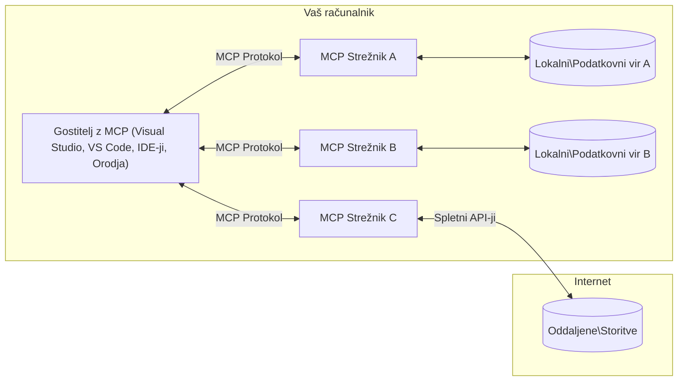

# Osnovni pojmi MCP: Obvladovanje protokola Model Context za integracijo AI

[](https://youtu.be/earDzWGtE84)

_(Kliknite na zgornjo sliko za ogled videa te lekcije)_

[Model Context Protocol (MCP)](https://github.com/modelcontextprotocol) je zmogljivo, standardizirano ogrodje, ki optimizira komunikacijo med velikimi jezikovnimi modeli (LLM) in zunanjimi orodji, aplikacijami ter viri podatkov.
Ta vodič vas bo popeljal skozi osnovne koncepte MCP. Spoznali boste njegovo arhitekturo klient-strežnik, ključne komponente, mehanizme komunikacije in najboljše prakse implementacije.

- **Izrecno soglasje uporabnika**: Ves dostop do podatkov in operacije zahtevajo izrecno odobritev uporabnika pred izvedbo. Uporabniki morajo jasno razumeti, kateri podatki bodo dostopni in kakšni ukrepi bodo izvedeni, z natančnim nadzorom dovoljenj in pooblastil.

- **Zaščita zasebnosti podatkov**: Uporabniški podatki so razkriti le z izrecnim soglasjem in morajo biti zaščiteni z robustnimi nadzornimi mehanizmi dostopa skozi celoten življenjski cikel interakcije. Implementacije morajo preprečiti nepooblaščeno prenos podatkov in ohraniti stroge meje zasebnosti.

- **Varnost izvajanja orodij**: Vsak poziv orodju zahteva izrecno soglasje uporabnika s popolnim razumevanjem funkcionalnosti orodja, parametrov in potencialnega vpliva. Močne varnostne meje morajo preprečiti nenamerno, nevarno ali zlonamerno izvajanje orodij.

- **Varnost transportne plasti**: Vsi komunikacijski kanali bi morali uporabljati ustrezno šifriranje in mehanizme preverjanja pristnosti. Oddaljene povezave naj uporabljajo varne transportne protokole in pravilno upravljanje poverilnic.

#### Smernice za implementacijo:

- **Upravljanje dovoljenj**: Implementirajte finonadzorne sisteme dovoljenj, ki uporabnikom omogočajo nadzor nad tem, do katerih strežnikov, orodij in virov je dostop
- **Preverjanje pristnosti & avtentikacija**: Uporabljajte varne metode preverjanja pristnosti (OAuth, API ključi) z ustreznim upravljanjem žetonov in potekom
- **Validacija vhodov**: Validirajte vse parametre in vhodne podatke glede na določene sheme, da preprečite napade z injekcijo
- **Revizijska beleženja**: Vzdržujte obsežne zapise vseh operacij za varnostno spremljanje in skladnost

## Pregled

Ta lekcija raziskuje temeljno arhitekturo in komponente, ki sestavljajo ekosistem Model Context Protocol (MCP). Spoznali boste arhitekturo klient-strežnik, ključne sestavine in mehanizme komunikacije, ki poganjajo interakcije MCP.

## Ključni cilji učenja

Do konca te lekcije boste:

- Razumeli arhitekturo klient-strežnik MCP.
- Prepoznali vloge in odgovornosti gostiteljev, klientov in strežnikov.
- Analizirali glavne značilnosti, ki MCP naredijo za prilagodljivo integracijsko plast.
- Spoznali tok informacij znotraj ekosistema MCP.
- Pridobili praktične vpoglede preko primerov kode v .NET, Java, Python in JavaScript.

## Arhitektura MCP: Globlji pogled

Ekosistem MCP temelji na modelu klient-strežnik. Ta modularna struktura omogoča AI aplikacijam učinkovito interakcijo z orodji, bazami podatkov, API-ji in kontekstualnimi viri. Razdelimo to arhitekturo na njene osnovne komponente.

V jedru MCP sledi arhitekturi klient-strežnik, kjer lahko gostiteljska aplikacija poveže več strežnikov:



- **Gostitelji MCP**: Programi kot so VSCode, Claude Desktop, IDE-ji ali AI orodja, ki želijo dostopati do podatkov preko MCP
- **Klienti MCP**: Protokolarni klienti, ki vzdržujejo 1:1 povezave s strežniki
- **Strežniki MCP**: Lahki programi, ki vsak zagotavljajo specifične zmogljivosti preko standardiziranega Model Context Protocol
- **Lokalni viri podatkov**: Datoteke, baze podatkov in storitve na vašem računalniku, do katerih lahko strežniki MCP varno dostopajo
- **Oddaljene storitve**: Zunanji sistemi, dostopni preko interneta, s katerimi se strežniki MCP lahko povežejo preko API-jev.

Protokol MCP je razvijajoči se standard, ki uporablja različice na osnovi datuma (format LLLL-MM-DD). Trenutna različica protokola je **2025-11-25**. Najnovejše posodobitve si lahko ogledate v [specifikaciji protokola](https://modelcontextprotocol.io/specification/2025-11-25/)

> **Pogled v prihodnost:** kandidat za izdajo naslednje različice specifikacije, **2026-07-28**, je bil najavljen maja 2026 in je načrtovan za izdajo 28. julija 2026. Ta različica naredi protokol brezstanjskega na transportni plasti (odstrani rokovanje `initialize` in ID-je sej), formalizira ogrodje Extensions ter opušča Roots, Sampling in Logging v prid novejšim vzorcem. Glejte [Kaj se spreminja v MCP: Kandidat za izdajo 2026-07-28](./mcp-2026-07-28-release-candidate.md) za celovit pregled.

### 1. Gostitelji

V Model Context Protocol (MCP) so **Gostitelji** AI aplikacije, ki služijo kot primarni vmesnik, preko katerega uporabniki komunicirajo s protokolom. Gostitelji koordinirajo in upravljajo povezave do več strežnikov MCP z ustvarjanjem namenski MCP klientov za vsako strežniško povezavo. Primeri gostiteljev vključujejo:

- **AI aplikacije**: Claude Desktop, Visual Studio Code, Claude Code
- **Razvojna okolja**: IDE-ji in urejevalniki kode z integracijo MCP
- **Prilagojene aplikacije**: Namenjena AI orodja in agenti

**Gostitelji** so aplikacije, ki usklajujejo interakcije AI modelov. Oni:

- **Orkestracija AI modelov**: Izvajajo ali sodelujejo z LLM za generiranje odzivov in koordinacijo AI delovnih tokov
- **Upravljanje klientskih povezav**: Ustvarjajo in vzdržujejo enega MCP klienta na povezavo s strežnikom MCP
- **Nadzor uporabniškega vmesnika**: Upravljajo potek pogovora, uporabniške interakcije in prikaz odgovorov
- **Izvajanje varnosti**: Nadzorujejo dovoljenja, varnostne omejitve in avtentikacijo
- **Obvladovanje uporabniškega soglasja**: Upravljajo uporabnikovo odobritev za deljenje podatkov in izvajanje orodij


### 2. Klienti

**Klienti** so ključne komponente, ki vzdržujejo namensko ena-na-ena povezavo med gostitelji in strežniki MCP. Vsak MCP klient ga gostitelj ustvari za povezavo s specifičnim strežnikom MCP, s čimer zagotavlja organizirane in varne komunikacijske kanale. Več klientov omogoča gostiteljem, da se hkrati povežejo z več strežniki.

**Klienti** so povezovalne komponente v gostiteljski aplikaciji. Oni:

- **Komunikacija po protokolu**: Pošiljajo zahtevke JSON-RPC 2.0 strežnikom z navodili in pozivi
- **Pogajanje o zmogljivostih**: Pregovarjajo o podprtih funkcijah in različicah protokola med inicializacijo
- **Izvajanje orodij**: Upravljajo zahteve po izvajanju orodij iz modelov in obdelujejo odgovore
- **Posodobitve v realnem času**: Obravnavajo obvestila in posodobitve v realnem času s strežnikov
- **Obdelava odgovorov**: Procesirajo in oblikujejo strežniške odgovore za prikaz uporabnikom

### 3. Strežniki

**Strežniki** so programi, ki zagotavljajo kontekst, orodja in zmogljivosti MCP klientom. Lahko delujejo lokalno (na istem računalniku kot gostitelj) ali oddaljeno (na zunanji platformi) in so odgovorni za obdelavo klientskih zahtev ter zagotavljanje strukturiranih odgovorov. Strežniki posredujejo specifične funkcionalnosti preko standardiziranega Model Context Protocol.

**Strežniki** so storitve, ki zagotavljajo kontekst in zmogljivosti. Oni:

- **Registracija funkcionalnosti**: Registrirajo in omogočijo dostop do razpoložljivih primitivov (viri, pozivi, orodja) klientom
- **Obdelava zahtev**: Prejemajo in izvajajo klice orodij, zahteve po virih in pozive od klientov
- **Zagotavljanje konteksta**: Zagotavljajo kontekstualne informacije in podatke za izboljšanje odgovorov modelov
- **Upravljanje stanja**: Ohranjajo stanje seje in obdelujejo interakcije, ki zahtevajo stanje, ko je to potrebno

- **Obvestila v realnem času**: Pošiljanje obvestil o spremembah zmožnosti in posodobitvah povezanih odjemalcev

Strežnike lahko razvije vsakdo za razširitev zmogljivosti modela s specializirano funkcionalnostjo, podpirajo pa tako lokalne kot oddaljene scenarije nameščanja.

### 4. Strežniški primitivci

Strežniki v protokolu Model Context Protocol (MCP) zagotavljajo tri osnovne **primitivce**, ki definirajo temeljne gradnike za bogate interakcije med odjemalci, gostitelji in jezikovnimi modeli. Ti primitivci določajo vrste kontekstualnih informacij in razpoložljivih dejanj prek protokola.

MCP strežniki lahko razkrijejo katerekoli kombinacije naslednjih treh osnovnih primitivcev:

#### Viri 

**Viri** so podatkovni viri, ki zagotavljajo kontekstualne informacije AI aplikacijam. Predstavljajo statično ali dinamično vsebino, ki lahko izboljša razumevanje modela in odločanje:

- **Kontekstualni podatki**: Strukturirane informacije in kontekst za porabo AI modela
- **Baze znanja**: Zbirke dokumentov, članki, priročniki in raziskovalni prispevki
- **Lokalni podatkovni viri**: Datoteke, zbirke podatkov in lokalne sistemske informacije  
- **Zunanji podatki**: Odzivi API-jev, spletne storitve in podatki oddaljenih sistemov
- **Dinamična vsebina**: Podatki v realnem času, ki se posodabljajo glede na zunanje pogoje

Viri so identificirani z URI-ji in podpirajo odkrivanje preko metod `resources/list` ter pridobivanje preko `resources/read`:

```text
file://documents/project-spec.md
database://production/users/schema
api://weather/current
```

#### Pozivi

**Pozivi** so ponovno uporabni predlogi, ki pomagajo strukturirati interakcije z jezikovnimi modeli. Zagotavljajo standardizirane vzorce interakcij in predtemplirane delovne tokove:

- **Interakcije na osnovi predlog**: Vnaprej strukturirana sporočila in začetki pogovorov
- **Delovni tokovi po predlogah**: Standardizirani zaporedni poteki za pogoste naloge in interakcije
- **Primeri z nekaj posnetki**: Predloge s primeri za usmerjanje modela
- **Sistemski pozivi**: Temeljni pozivi, ki določajo vedenje in kontekst modela
- **Dinamični predlogi**: Parametrizirani pozivi, ki se prilagajajo specifičnim kontekstom

Pozivi podpirajo zamenjavo spremenljivk in so dostopni preko `prompts/list` ter pridobljeni z `prompts/get`:

```markdown
Generate a {{task_type}} for {{product}} targeting {{audience}} with the following requirements: {{requirements}}
```

#### Orodja

**Orodja** so izvršljive funkcije, ki jih jezikovni modeli lahko pokličejo za izvedbo specifičnih dejanj. Predstavljajo "glagole" MCP ekosistema, ki omogočajo modelom interakcijo z zunanjimi sistemi:

- **Izvršljive funkcije**: Diskretne operacije, ki jih modeli lahko pokličejo s specifičnimi parametri
- **Integracija z zunanjimi sistemi**: Klici API-jev, poizvedbe po bazah podatkov, operacije z datotekami, izračuni
- **Edinstvena identiteta**: Vsako orodje ima edinstveno ime, opis in shemo parametrov
- **Strukturiran vhod/izhod**: Orodja sprejemajo potrjene parametre in vračajo strukturirane, tipizirane odzive
- **Zmožnosti dejanj**: Omogočajo modelom izvajanje dejanj v resničnem svetu in pridobivanje podatkov v živo

Orodja so definirana z JSON shemo za validacijo parametrov in so odkrita preko `tools/list`, izvršena z `tools/call`. Orodja lahko vključujejo tudi **ikone** kot dodatne metapodatke za boljšo predstavitev v uporabniškem vmesniku.

**Oznake orodij**: Orodja podpirajo vedenjske oznake (npr. `readOnlyHint`, `destructiveHint`), ki opisujejo, ali je orodje samo za branje ali destruktivno, s čimer pomagajo odjemalcem pri informiranih odločitvah o izvajanju orodij.

Primer definicije orodja:

```typescript
server.tool(
  "search_products", 
  {
    query: z.string().describe("Search query for products"),
    category: z.string().optional().describe("Product category filter"),
    max_results: z.number().default(10).describe("Maximum results to return")
  }, 
  async (params) => {
    // Izvedite iskanje in vrnite strukturirane rezultate
    return await productService.search(params);
  }
);
```

## Klientski primitivci

V protokolu Model Context Protocol (MCP) lahko **odjemalci** razkrijejo primitivce, ki omogočajo strežnikom zahtevanje dodatnih zmogljivosti od gostiteljske aplikacije. Ti klientski primitivci omogočajo bogatejše, bolj interaktivne strežniške implementacije, ki lahko dostopajo do zmogljivosti jezikovnih modelov in uporabniških interakcij.

### Vzorcevanje

> **Obvestilo o opustitvi:** kandidat za izdajo `2026-07-28` označuje Vzorcevanje kot opuščeno v prid neposredne integracije z API-ji ponudnikov LLM. Nadaljuje z delovanjem v `2025-11-25` in še vsaj eno leto po opustitvi, vendar naj novi načrti uporabljajo nadomestni vzorec. Glej [Kaj se spreminja v MCP: kandidat za izdajo 2026-07-28](./mcp-2026-07-28-release-candidate.md).

**Vzorcevanje** omogoča strežnikom zahtevati dopolnitve jezikovnega modela iz AI aplikacije odjemalca. Ta primitiv omogoča strežnikom dostop do zmogljivosti LLM brez vdelave lastnih odvisnosti modelov:

- **Neodvisen dostop do modela**: Strežniki lahko zahtevajo dopolnitve brez vključevanja SDK-jev LLM ali upravljanja dostopa do modela
- **AI, ki jo sprožijo strežniki**: Omogoča strežnikom samostojno generiranje vsebine z AI modelom odjemalca
- **Rekurzivne interakcije z LLM**: Podpira kompleksne scenarije, kjer strežniki potrebujejo pomoč AI za obdelavo
- **Dinamična generacija vsebine**: Omogoča strežnikom ustvarjanje kontekstualnih odgovorov z gostiteljskim modelom
- **Podpora klicu orodij**: Strežniki lahko vključijo parametra `tools` in `toolChoice`, da omogočijo modelu odjemalca klic orodij med vzorcevanjem

Vzorcevanje se sproži z metodo `sampling/complete`, kjer strežniki pošljejo zahteve za dopolnitve odjemalcem.

### Koreni

> **Obvestilo o opustitvi:** kandidat za izdajo `2026-07-28` označuje Korene kot opuščene v korist parametrov orodij, URI-jev virov ali konfiguracije strežnika. Še vedno deluje v `2025-11-25` in vsaj eno leto po opustitvi. Glej [Kaj se spreminja v MCP: kandidat za izdajo 2026-07-28](./mcp-2026-07-28-release-candidate.md).

**Koreni** zagotavljajo standardiziran način, kako odjemalci razkrivajo meje datotečnega sistema strežnikom, kar pomaga strežnikom razumeti, do katerih imenikov in datotek imajo dostop:

- **Meje datotečnega sistema**: Določajo meje, kjer lahko strežniki delujejo znotraj datotečnega sistema
- **Nadzor dostopa**: Pomagajo strežnikom razumeti, do katerih imenikov in datotek imajo dovoljenje za dostop
- **Dinamične posodobitve**: Odjemalci lahko obveščajo strežnike, ko se seznam korenov spremeni
- **Identifikacija na osnovi URI**: Koreni uporabljajo URI-je `file://` za identifikacijo dostopnih imenikov in datotek

Koreni so odkriti preko metode `roots/list`, odjemalci pa pošiljajo `notifications/roots/list_changed`, ko se koreni spremenijo.

### Povpraševanje  

**Povpraševanje** omogoča strežnikom, da preko odjemalskega vmesnika zahtevajo dodatne informacije ali potrditev uporabnikov:

- **Zahteve za uporabniški vnos**: Strežniki lahko zahtevajo dodatne informacije, kadar jih potrebujejo za izvršitev orodja
- **Pogovori za potrditev**: Zahtevanje uporabniškega soglasja za občutljive ali vplivne operacije
- **Interaktivni delovni tokovi**: Omogočajo strežnikom ustvarjanje korak-po-korak uporabniških interakcij
- **Dinamično zbiranje parametrov**: Zbiranje manjkajočih ali neobveznih parametrov med izvajanjem orodja

Zahteve za povpraševanje se izvajajo z metodo `elicitation/request` za zbiranje uporabniškega vnosa prek odjemalskega vmesnika.

**Povpraševanje na način URL:** Strežniki lahko prav tako zahtevajo URL-bazirane uporabniške interakcije, ki uporabnike usmerjajo na zunanje spletne strani za avtentikacijo, potrditev ali vnos podatkov.

### Beleženje


> **Obvestilo o ukinitvi:** kandidat za izdajo `2026-07-28` označuje beleženje kot ukinjeno v korist `stderr` za stdio transport in OpenTelemetry za strukturirano opazovanje. V različici `2025-11-25` še vedno deluje in še vsaj eno leto po kateri koli ukinitvi. Oglejte si [Kaj se spreminja v MCP: kandidat za izdajo 2026-07-28](./mcp-2026-07-28-release-candidate.md).

**Beleženje** omogoča strežnikom pošiljanje strukturiranih dnevniških sporočil odjemalcem za razhroščevanje, spremljanje in operativno preglednost:

- **Podpora za razhroščevanje**: Omogoča strežnikom podrobne zapise izvajanja za odpravljanje težav
- **Operativno spremljanje**: Pošilja posodobitve stanja in metrike zmogljivosti odjemalcem
- **Poročanje o napakah**: Zagotavlja podrobne kontekste napak in diagnostične informacije
- **Revidiranje**: Ustvarja obsežne zapise strežniških operacij in odločitev

Dnevniška sporočila se pošiljajo odjemalcem, da omogočijo preglednost strežniških operacij in olajšajo razhroščevanje.

## Pretok informacij v MCP

Protokol konteksta modela (MCP) določa strukturiran pretok informacij med gostitelji, odjemalci, strežniki in modeli. Razumevanje tega pretoka pomaga pojasniti, kako se obravnavajo uporabniški zahtevki in kako so zunanji pripomočki ter podatki integrirani v odgovore modela.

- **Gostitelj vzpostavi povezavo**  
  Gostiteljska aplikacija (kot je IDE ali klepetalni vmesnik) vzpostavi povezavo z MCP strežnikom, običajno prek STDIO, WebSocket ali drugega podprt transport.

- **Pogajanje zmožnosti**  
  Odjemalec (vgrajen v gostitelja) in strežnik si izmenjata informacije o podprtih funkcijah, orodjih, virih in različicah protokola. To zagotavlja, da obe strani razumeta, katere zmožnosti so na voljo za sejo.

- **Uporabnikov zahtevek**  
  Uporabnik komunicira z gostiteljem (npr. vnese poziv ali ukaz). Gostitelj zbere ta vhod in ga posreduje odjemalcu v obdelavo.

- **Uporaba vira ali orodja**  
  - Odjemalec lahko zahteva dodatni kontekst ali vire od strežnika (kot so datoteke, vnosi v podatkovni bazi ali članki iz baze znanja), da obogati razumevanje modela.
  - Če model ugotovi, da je potrebna uporaba orodja (npr. za pridobitev podatkov, izvedbo izračuna ali klic API-ja), odjemalec pošlje zahtevek za klic orodja strežniku, pri čemer navede ime orodja in parametre.

- **Izvajanje strežnika**  
  Strežnik prejme zahtevek za vir ali orodje, izvede potrebne operacije (kot je zaganjanje funkcije, poizvedba po podatkovni bazi ali pridobivanje datoteke) in rezultate vrne odjemalcu v strukturirani obliki.

- **Generiranje odgovora**  
  Odjemalec integrira strežniške odgovore (podatke vira, izhode orodij itd.) v tekočo interakcijo z modelom. Model uporabi te informacije za ustvarjanje obsežnega in kontekstualno relevantnega odgovora.

- **Predstavitev rezultata**  
  Gostitelj prejme končni izhod od odjemalca in ga predstavi uporabniku, pogosto vključno z generiranim besedilom modela ter vsemi rezultati izvajanja orodij ali iskanja virov.

Ta tok omogoča MCP podporo naprednim, interaktivnim in kontekstualno ozaveščenim AI aplikacijam s tekočim povezovanjem modelov z zunanjimi orodji in podatkovnimi viri.

## Arhitektura in plasti protokola

MCP je sestavljen iz dveh ločenih arhitekturnih plasti, ki skupaj zagotavljata celovit komunikacijski okvir:

### Plasten podatkov

**Plasten podatkov** uresničuje osnovni MCP protokol z uporabo **JSON-RPC 2.0** kot izhodišča. Ta plast definira strukturo sporočil, semantiko in vzorce interakcije:

#### Glavne komponente:

- **Protocol JSON-RPC 2.0**: Vsa komunikacija uporablja standardiziran format sporočil JSON-RPC 2.0 za klice metod, odgovore in obvestila
- **Upravljanje življenjskega cikla**: Obvladuje inicializacijo povezave, pogajanje o zmožnostih in zaključek seje med odjemalci in strežniki
- **Strežniški primitivni elementi**: Omogoča strežnikom osnovno funkcionalnost preko orodij, virov in pozivov
- **Odjemalski primitivni elementi**: Omogoča strežnikom zahtevanje vzorčenja iz LLM, pridobivanje uporabniškega vnosa in pošiljanje dnevniških sporočil
- **Opozorila v realnem času**: Podpira asinhrona obvestila za dinamične posodobitve brez padanja na čakanje

#### Ključne značilnosti:

- **Pogajanje o različici protokola**: Uporablja datumno različico (LLLL-MM-DD) za zagotovitev združljivosti
- **Odkritje zmožnosti**: Odjemalci in strežniki si ob inicializaciji izmenjujejo informacije o podpornih funkcijah
- **Stanjne seje**: Ohranja stanje povezave skozi več interakcij za kontinuiteto konteksta

### Plasten transporta

**Plasten transporta** upravlja komunikacijske kanale, okvirjenje sporočil in overjanje med udeleženci MCP:

#### Podprti transportni mehanizmi:

1. **STDIO Transport**:
   - Uporablja standardne vhodno/izhodne tokove za neposredno komunikacijo procesov
   - Optimalen za lokalne procese na isti napravi brez omrežnega stroška
   - Pogosto uporabljen za lokalne implementacije MCP strežnikov

2. **HTTP transport s pretakanjem**:
   - Uporablja HTTP POST za sporočila odjemalec-strežnik  
   - Neobvezni Server-Sent Events (SSE) za pretakanje od strežnika do odjemalca
   - Omogoča oddaljeno komunikacijo strežnikov prek omrežij
   - Podpira standardno HTTP overjanje (prenosne žetone, API ključe, prilagojene glave)
   - MCP priporoča OAuth za varno overjanje na osnovi žetonov

#### Abstrakcija transporta:

Transportna plast abstrahira komunikacijske podrobnosti od podatkovne plasti, kar omogoča isti format sporočil JSON-RPC 2.0 preko vseh transportnih mehanizmov. Ta abstrakcija omogoča aplikacijam nemoteno preklapljanje med lokalnimi in oddaljenimi strežniki.

### Varnostna razmišljanja

Implementacije MCP morajo upoštevati več ključnih varnostnih načel, da zagotovijo varne, zaupanja vredne in zaščitene interakcije skozi vse protokolarne operacije:

- **Privolitev in nadzor uporabnika**: Uporabniki morajo dati izrecno privolitev pred dostopom do podatkov ali izvajanjem operacij. Morajo imeti jasen nadzor nad tem, kateri podatki se delijo in katere dejavnosti so pooblaščene, podprto z intuitivnimi uporabniškimi vmesniki za pregled in odobritev.

- **Zasebnost podatkov**: Uporabniški podatki se lahko razkrijejo le z izrecno privolitvijo in morajo biti zaščiteni z ustreznim nadzorom dostopa. Implementacije MCP morajo varovati pred nepooblaščenim prenosom podatkov in zagotavljati ohranjanje zasebnosti skozi vse interakcije.

- **Varnost orodij**: Pred klicem kateregakoli orodja je potrebna izrecna privolitev uporabnika. Uporabniki morajo razumeti funkcionalnost vsakega orodja, vzpostavljene pa morajo biti robustne varnostne meje, ki preprečujejo nenamerno ali nevarno izvajanje orodij.

Z upoštevanjem teh varnostnih načel MCP zagotavlja zaupanje uporabnikov, zasebnost in varnost skozi vse protokolarne interakcije in hkrati omogoča zmogljive AI integracije.

## Primeri kode: Ključne komponente

Spodaj so prikazani primeri kode v več priljubljenih programskih jezikih, ki ilustrirajo kako uvesti ključne komponente MCP strežnika in orodja.

### .NET primer: Ustvarjanje preprostega MCP strežnika z orodji

Tukaj je praktičen primer kode v .NET, ki prikazuje, kako uvesti enostaven MCP strežnik s prilagojenimi orodji. Ta primer prikazuje, kako definirati in registrirati orodja, obdelovati zahtevke ter povezati strežnik z Model Context Protocol.

```csharp
using System;
using System.Threading.Tasks;
using ModelContextProtocol.Server;
using ModelContextProtocol.Server.Transport;
using ModelContextProtocol.Server.Tools;

public class WeatherServer
{
    public static async Task Main(string[] args)
    {
        // Create an MCP server
        var server = new McpServer(
            name: "Weather MCP Server",
            version: "1.0.0"
        );
        
        // Register our custom weather tool
        server.AddTool<string, WeatherData>("weatherTool", 
            description: "Gets current weather for a location",
            execute: async (location) => {
                // Call weather API (simplified)
                var weatherData = await GetWeatherDataAsync(location);
                return weatherData;
            });
        
        // Connect the server using stdio transport
        var transport = new StdioServerTransport();
        await server.ConnectAsync(transport);
        
        Console.WriteLine("Weather MCP Server started");
        
        // Keep the server running until process is terminated
        await Task.Delay(-1);
    }
    
    private static async Task<WeatherData> GetWeatherDataAsync(string location)
    {
        // This would normally call a weather API
        // Simplified for demonstration
        await Task.Delay(100); // Simulate API call
        return new WeatherData { 
            Temperature = 72.5,
            Conditions = "Sunny",
            Location = location
        };
    }
}

public class WeatherData
{
    public double Temperature { get; set; }
    public string Conditions { get; set; }
    public string Location { get; set; }
}
```

### Java primer: MCP strežniške komponente

Ta primer prikazuje enako registracijo MCP strežnika in orodij kot zgornji .NET primer, vendar implementiran v Javi.

```java
import io.modelcontextprotocol.server.McpServer;
import io.modelcontextprotocol.server.McpToolDefinition;
import io.modelcontextprotocol.server.transport.StdioServerTransport;
import io.modelcontextprotocol.server.tool.ToolExecutionContext;
import io.modelcontextprotocol.server.tool.ToolResponse;

public class WeatherMcpServer {
    public static void main(String[] args) throws Exception {
        // Ustvari MCP strežnik
        McpServer server = McpServer.builder()
            .name("Weather MCP Server")
            .version("1.0.0")
            .build();
            
        // Registriraj vremensko orodje
        server.registerTool(McpToolDefinition.builder("weatherTool")
            .description("Gets current weather for a location")
            .parameter("location", String.class)
            .execute((ToolExecutionContext ctx) -> {
                String location = ctx.getParameter("location", String.class);
                
                // Pridobi vremenske podatke (poenostavljeno)
                WeatherData data = getWeatherData(location);
                
                // Vrni formatiran odgovor
                return ToolResponse.content(
                    String.format("Temperature: %.1f°F, Conditions: %s, Location: %s", 
                    data.getTemperature(), 
                    data.getConditions(), 
                    data.getLocation())
                );
            })
            .build());
        
        // Poveži strežnik z uporabo stdio transporta
        try (StdioServerTransport transport = new StdioServerTransport()) {
            server.connect(transport);
            System.out.println("Weather MCP Server started");
            // Ohrani strežnik v teku, dokler proces ni končan
            Thread.currentThread().join();
        }
    }
    
    private static WeatherData getWeatherData(String location) {
        // Implementacija bi poklicala vremenski API
        // Poenostavljeno za primer demonstracije
        return new WeatherData(72.5, "Sunny", location);
    }
}

class WeatherData {
    private double temperature;
    private String conditions;
    private String location;
    
    public WeatherData(double temperature, String conditions, String location) {
        this.temperature = temperature;
        this.conditions = conditions;
        this.location = location;
    }
    
    public double getTemperature() {
        return temperature;
    }
    
    public String getConditions() {
        return conditions;
    }
    
    public String getLocation() {
        return location;
    }
}
```

### Python primer: Izgradnja MCP strežnika

Ta primer uporablja fastmcp, zato prosimo, da ga najprej namestite:

```python
pip install fastmcp
```
Primer kode:

```python
#!/usr/bin/env python3
import asyncio
from fastmcp import FastMCP
from fastmcp.transports.stdio import serve_stdio

# Ustvari strežnik FastMCP
mcp = FastMCP(
    name="Weather MCP Server",
    version="1.0.0"
)

@mcp.tool()
def get_weather(location: str) -> dict:
    """Gets current weather for a location."""
    return {
        "temperature": 72.5,
        "conditions": "Sunny",
        "location": location
    }

# Alternativni pristop z uporabo razreda
class WeatherTools:
    @mcp.tool()
    def forecast(self, location: str, days: int = 1) -> dict:
        """Gets weather forecast for a location for the specified number of days."""
        return {
            "location": location,
            "forecast": [
                {"day": i+1, "temperature": 70 + i, "conditions": "Partly Cloudy"}
                for i in range(days)
            ]
        }

# Registriraj orodja razreda
weather_tools = WeatherTools()

# Začni strežnik
if __name__ == "__main__":
    asyncio.run(serve_stdio(mcp))
```

### JavaScript primer: Ustvarjanje MCP strežnika

Ta primer prikazuje ustvarjanje MCP strežnika v JavaScriptu in kako registrirati dve orodji povezani s podatki o vremenu.

```javascript
// Uporaba uradnega Model Context Protocol SDK
import { McpServer } from "@modelcontextprotocol/sdk/server/mcp.js";
import { StdioServerTransport } from "@modelcontextprotocol/sdk/server/stdio.js";
import { z } from "zod"; // Za preverjanje parametrov

// Ustvari MCP strežnik
const server = new McpServer({
  name: "Weather MCP Server",
  version: "1.0.0"
});

// Določi orodje za vreme
server.tool(
  "weatherTool",
  {
    location: z.string().describe("The location to get weather for")
  },
  async ({ location }) => {
    // To bi običajno klicalo vremenski API
    // Poenostavljeno za demonstracijo
    const weatherData = await getWeatherData(location);
    
    return {
      content: [
        { 
          type: "text", 
          text: `Temperature: ${weatherData.temperature}°F, Conditions: ${weatherData.conditions}, Location: ${weatherData.location}` 
        }
      ]
    };
  }
);

// Določi orodje za napoved
server.tool(
  "forecastTool",
  {
    location: z.string(),
    days: z.number().default(3).describe("Number of days for forecast")
  },
  async ({ location, days }) => {
    // To bi običajno klicalo vremenski API
    // Poenostavljeno za demonstracijo
    const forecast = await getForecastData(location, days);
    
    return {
      content: [
        { 
          type: "text", 
          text: `${days}-day forecast for ${location}: ${JSON.stringify(forecast)}` 
        }
      ]
    };
  }
);

// Pomožne funkcije
async function getWeatherData(location) {
  // Simuliraj klic API-ja
  return {
    temperature: 72.5,
    conditions: "Sunny",
    location: location
  };
}

async function getForecastData(location, days) {
  // Simuliraj klic API-ja
  return Array.from({ length: days }, (_, i) => ({
    day: i + 1,
    temperature: 70 + Math.floor(Math.random() * 10),
    conditions: i % 2 === 0 ? "Sunny" : "Partly Cloudy"
  }));
}

// Poveži strežnik z uporabo stdio transporta
const transport = new StdioServerTransport();
server.connect(transport).catch(console.error);

console.log("Weather MCP Server started");
```

Ta JavaScript primer prikazuje, kako ustvariti MCP strežnik z uporabo Model Context Protocol SDK. Pokaže, kako registrirati dve orodji z imeni `weatherTool` in `forecastTool` in ju narediti na voljo MCP odjemalcem preko `StdioServerTransport`.

## Varnost in avtorizacija

MCP vključuje več vgrajenih konceptov in mehanizmov za upravljanje varnosti in avtorizacije skozi ves protokol:

1. **Nadzor dovoljenj orodij**:  
  Odjemalci lahko določijo, katera orodja lahko model uporablja med sejo. To zagotavlja, da so dostopna le izrecno pooblaščena orodja, s čimer se zmanjša tveganje nenamernih ali nevarnih operacij. Dovoljenja se lahko dinamično nastavijo glede na uporabniške preference, organizacijske politike ali kontekst interakcije.

2. **Overjanje**:  
  Strežniki lahko zahtevajo overjanje pred dovoljenjem dostopa do orodij, virov ali občutljivih operacij. To lahko vključuje API ključe, OAuth žetone ali druge sheme overjanja. Ustrezno overjanje zagotavlja, da lahko zmogljivosti strežnika kličejo le zaupanja vredni odjemalci in uporabniki.

3. **Preverjanje**:  
  Preverjanje parametrov se izvaja za vse klice orodij. Vsako orodje določi pričakovane tipe, formate in omejitve za svoje parametre, strežnik pa ustrezno preveri dohodne zahtevke. To preprečuje, da bi nepravilni ali zlonamerni vnosi dosegli implementacije orodij ter pomaga ohranjati integriteto operacij.

4. **Omejevanje hitrosti**:  
  Da se prepreči zloraba in zagotovita poštena uporaba strežniških virov, lahko MCP strežniki vpeljejo omejevanje hitrosti za klice orodij in dostop do virov. Omejitve se lahko nastavijo na uporabnika, sejo ali globalno in pomagajo zaščititi pred napadi zavrnitve storitve ali pretirane porabe virov.

S kombinacijo teh mehanizmov MCP zagotavlja varno podlago za integracijo jezikovnih modelov z zunanjimi orodji in podatkovnimi viri, hkrati pa uporabnikom in razvijalcem omogoča natančen nadzor dostopa in uporabe.

## Protokolarna sporočila in komunikacijski tok

MCP komunikacija uporablja strukturirana **JSON-RPC 2.0** sporočila za omogočanje jasnih in zanesljivih interakcij med gostitelji, odjemalci in strežniki. Protokol definira specifične vzorce sporočil za različne vrste operacij:

### Osnovne vrste sporočil:

#### **Inicijalizacijska sporočila**
- **Zahtevek `initialize`**: Vzpostavi povezavo in pogaja o različici protokola ter zmožnostih
- **Odgovor `initialize`**: Potrdi podprte funkcije in informacije o strežniku  
- **`notifications/initialized`**: Signalizira, da je inicializacija zaključena in seja pripravljena

#### **Sporočila za odkrivanje**
- **Zahtevek `tools/list`**: Odkrije na voljo orodja s strežnika
- **Zahtevek `resources/list`**: Navedba razpoložljivih virov (podatkovnih virov)
- **Zahtevek `prompts/list`**: Pridobi razpoložljive predloge pozivov

#### **Sporočila za izvajanje**  
- **Zahtevek `tools/call`**: Izvede določeno orodje s podanimi parametri
- **Zahtevek `resources/read`**: Pridobi vsebino določenega vira
- **Zahtevek `prompts/get`**: Pridobi predlogo poziva z neobveznimi parametri

#### **Sporočila z odjemalske strani**
- **Zahtevek `sampling/complete`**: Strežnik zahteva dokončanje LLM od odjemalca
- **`elicitation/request`**: Strežnik zahteva uporabniški vnos preko odjemalskega vmesnika
- **Dnevniki sporočil**: Strežnik pošilja strukturirana dnevniška sporočila odjemalcu

#### **Obvestilna sporočila**
- **`notifications/tools/list_changed`**: Strežnik obvešča odjemalca o spremembah orodij
- **`notifications/resources/list_changed`**: Strežnik obvešča odjemalca o spremembah virov  
- **`notifications/prompts/list_changed`**: Strežnik obvešča odjemalca o spremembah predlog pozivov

### Struktura sporočil:

Vsa MCP sporočila sledijo formatu JSON-RPC 2.0 z:
- **Zahtevnimi sporočili**: Vključujejo `id`, `method` in neobvezne `params`
- **Odgovornimi sporočili**: Vključujejo `id` in bodisi `result` ali `error`  
- **Obvestilnimi sporočili**: Vključujejo `method` in neobvezne `params` (brez `id` ali zahteve po odgovoru)

Ta strukturirana komunikacija zagotavlja zanesljive, sledljive in razširljive interakcije, ki podpirajo napredne scenarije, kot so posodobitve v realnem času, povezovanje orodij in robustno obvladovanje napak.

### Naloge (Eksperimentalno)

> **Poglejmo naprej:** kandidat za izdajo `2026-07-28` prestavi Naloge iz eksperimentalne osnovne specifikacije v namensko razširitev Naloge z prenovljenim življenjskim ciklom (`tasks/get`, `tasks/update`, `tasks/cancel`; `tasks/list` je odstranjen). Če gradite z eksperimentalnim API-jem, opisanem spodaj, načrtujte migracijo. Oglejte si [Kaj se spreminja v MCP: kandidat za izdajo 2026-07-28](./mcp-2026-07-28-release-candidate.md).

**Naloge** so eksperimentalna funkcija, ki zagotavlja trajne izvajalne ovojnice z možnostjo odloženega pridobivanja rezultatov in sledenja statusu MCP zahtevkov:

- **Dolgotrajne operacije**: Sledenje dragocenim izračunom, avtomatizacija potekov dela in obdelava v paketih
- **Odloženi rezultati**: Povpraševanje po statusu naloge in pridobivanje rezultatov, ko operacije zaključijo
- **Sledenje statusu**: Spremljanje napredka naloge skozi določena stanja življenjskega cikla
- **Večstopenjske operacije**: Podpora za kompleksne poteke dela, ki vključujejo več interakcij

Naloge ovijejo standardne MCP zahtevke, da omogočijo asinhrone vzorce izvajanja za operacije, ki se ne morejo takoj zaključiti.

## Ključne ugotovitve

- **Arhitektura**: MCP uporablja arhitekturo odjemalec-strežnik, kjer gostitelji upravljajo več odjemalskih povezav s strežniki
- **Udeleženci**: Ekosistem vključuje gostitelje (AI aplikacije), odjemalce (protokolarni priključki) in strežnike (ponudnike zmogljivosti)
- **Transportni mehanizmi**: Komunikacija podpira STDIO (lokalno) in HTTP s pretakanjem z neobveznim SSE (oddaljeno)
- **Osnovni primitivni elementi**: Strežniki nudijo orodja (izvedljive funkcije), vire (podatkovne vire) in pozive (predloge)
- **Odjemalski primitivni elementi**: Strežniki lahko zahtevajo vzorčenje (LLM zaključke s podporo klica orodij), pridobivanje vnosa (vključno z URL načinom), korenske meje (meje datotečnega sistema) in beleženje od odjemalcev
- **Eksperimentalne funkcije**: Naloge zagotavljajo trajne izvajalne ovojnice za dolgotrajne operacije
- **Osnova protokola**: Zgrajeno na JSON-RPC 2.0 z različicami, osnovanimi na datumu (trenutno: 2025-11-25)
- **Zmožnosti v realnem času**: Podpira obvestila za dinamične posodobitve in sinhronizacijo v realnem času
- **Varnost na prvem mestu**: Izrecna privolitev uporabnika, zaščita zasebnosti podatkov in varen transport so ključni zahtevi

## Vaja

Oblikujte preprosto MCP orodje, ki bi bilo uporabno na vašem področju. Določite:
1. Kako bi se orodje imenovalo
2. Katere parametre bi sprejelo
3. Kakšen izhod bi vrnilo
4. Kako bi model lahko uporabil to orodje za reševanje uporabnikovih problemov


---

## Kaj sledi

Naslednje: [Poglavje 2: Varnost](../02-Security/README.md)


Radovedni, kaj prihaja po `2025-11-25`? Preberite [Kaj se spreminja v MCP: Kandidat za izdajo 2026-07-28](./mcp-2026-07-28-release-candidate.md).

---

<!-- CO-OP TRANSLATOR DISCLAIMER START -->
**Omejitev odgovornosti**:
Ta dokument je bil preveden z uporabo AI prevajalske storitve [Co-op Translator](https://github.com/Azure/co-op-translator). Čeprav si prizadevamo za natančnost, vas prosimo, da upoštevate, da avtomatizirani prevodi lahko vsebujejo napake ali netočnosti. Izvirni dokument v njegovem izvirnem jeziku je treba obravnavati kot avtoritativni vir. Za kritične informacije je priporočljiv strokovni človeški prevod. Ne odgovarjamo za morebitna nesporazume ali napačne interpretacije, ki izhajajo iz uporabe tega prevoda.
<!-- CO-OP TRANSLATOR DISCLAIMER END -->