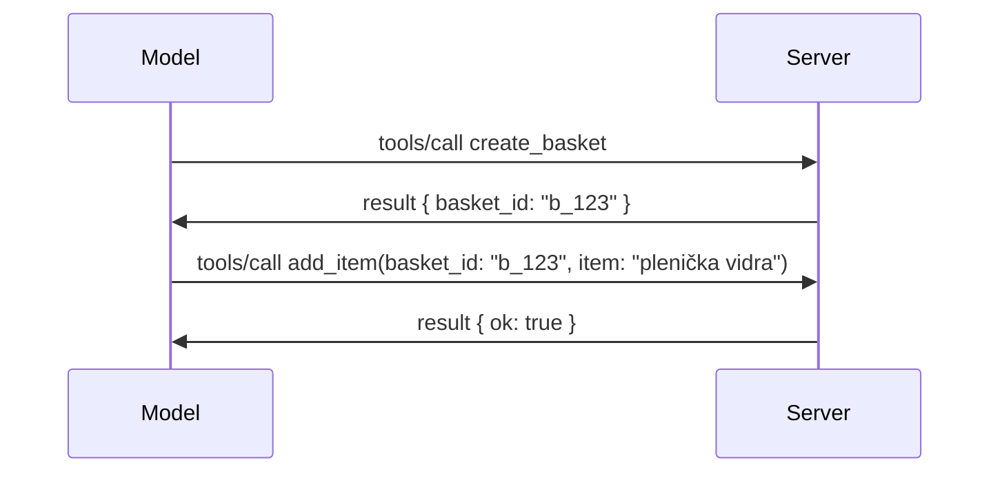

# Kaj se spreminja v MCP: Kandidat za izdajo 2026-07-28

> **Status:** Kandidat za izdajo. Specifikacija `2026-07-28` ob času pisanja ni dokončna. Objavljena je bila 21. maja 2026 in je predvidena za izdajo 28. julija 2026. Vse v tej lekciji opisuje kandidata za izdajo; pred gradnjo z njim preverite [osnutek specifikacije](https://modelcontextprotocol.io/specification/draft) in njen [dnevnik sprememb](https://modelcontextprotocol.io/specification/draft/changelog) za najnovejši status. Preostanek tega učnega načrta je napisan glede na trenutno stabilno izdajo, **MCP Specifikacija 2025-11-25**, in bo posodobljen, ko bo izšla različica `2026-07-28`.

## Pregled

`2026-07-28` je največja revizija MCP od njegove uvedbe. Šest Predlogov za izboljšanje specifikacije (SEP) odstrani seje na nivoju protokola in naredi MCP brezstaten na transportni plasti, razširitve postanejo prvič uraden, verzioniran mehanizem, nekatere funkcije, ki ste se jih naučili že prej v tem kurikulumu (Roots, Sampling, Logging), pa so označene kot zastarele po novi politiki življenjskega cikla. Ta lekcija povzema, kaj se spreminja, zakaj je to pomembno in kaj to pomeni za kodo, ki ste jo že napisali za `2025-11-25`.

Vir: [Kandidat za izdajo MCP specifikacije 2026-07-28](https://blog.modelcontextprotocol.io/posts/2026-07-28-release-candidate/) (Model Context Protocol Blog, David Soria Parra in Den Delimarsky).

## Cilji učenja

Do konca te lekcije boste znali:

- Pojasniti, zakaj MCP prehaja na brezstaten osrednji protokol in kateri problem to rešuje za horizontalno skalirane namestitve.
- Opisati, kako sta zamenjana rokovanje `initialize`/`initialized` in glava `Mcp-Session-Id`.
- Prepoznati nove glave `Mcp-Method` in `Mcp-Name` ter predpomnilne metapodatke `ttlMs`/`cacheScope`.
- Prepoznati ogrodje Extensions in dve razširitvi, ki izhajata s to izdajo: MCP Apps in Tasks.
- Našteti šest SEP za avtentikacijo, ki krepijo usklajenost z OAuth 2.0 / OIDC.
- Prepoznati, katere jedrne funkcije (Roots, Sampling, Logging) so sedaj zastarele in kaj to v praksi pomeni.
- Pojasniti spremembo Full JSON Schema 2020-12 za orodja `inputSchema`/`outputSchema`.

## Brezstaten protokol

Glavna sprememba: MCP postane brezstaten na nivoju protokola.

### Pred (2025-11-25): seje vežejo na en primerek strežnika

Klic orodja preko Streamable HTTP se začne z rokovanjem `initialize`. Strežnik odgovori z glavo `Mcp-Session-Id`, ki jo mora vsak naslednji zahtevek nositi:

```http
POST /mcp HTTP/1.1
Mcp-Session-Id: 1868a90c-3a3f-4f5b
Content-Type: application/json

{"jsonrpc":"2.0","id":2,"method":"tools/call",
 "params":{"name":"search","arguments":{"q":"otters"}}}
```

Ker je seja vezana na tisti strežnik, ki jo je izdal, horizontalno skalirane namestitve potrebujejo **lepljivo usmerjanje** na obremenitvenem uravnoteževalniku in **deljeno shrambo sej** med primerki.

### Po (2026-07-28): vsak zahtevek je samostojen

```http
POST /mcp HTTP/1.1
MCP-Protocol-Version: 2026-07-28
Mcp-Method: tools/call
Mcp-Name: search
Content-Type: application/json

{"jsonrpc":"2.0","id":1,"method":"tools/call",
 "params":{"name":"search","arguments":{"q":"otters"},
           "_meta":{"io.modelcontextprotocol/clientInfo":{"name":"my-app","version":"1.0"}}}}
```

Vsak strežnik lahko obdela ta zahtevek. Ključne spremembe:

- **Rokovanje `initialize`/`initialized` je odstranjeno** ([SEP-2575](https://github.com/modelcontextprotocol/modelcontextprotocol/pull/2575)). Verzija protokola, informacije o odjemalcu in zmožnosti odjemalca so preneseni v `_meta` v vsakem zahtevku. Nova metoda `server/discover` dovoljuje odjemalcu, da predhodno pridobi zmožnosti strežnika, kadar jih potrebuje.
- **Glava `Mcp-Session-Id` in seja na nivoju protokola sta odstranjeni** ([SEP-2567](https://github.com/modelcontextprotocol/modelcontextprotocol/pull/2567)). Lepljivo usmerjanje in deljenje shramb sej nista več potrebna na nivoju protokola.

### Brezstaten protokol, zdržljive aplikacije

Odstranitev seje na nivoju protokola ne pomeni, da vaš strežnik ne more biti zdržljiv. Priporočeni vzorec je isti, kot so HTTP API-ji vedno uporabljali: iz eni klic orodja ustvarite eksplicitno ročico (kot je `basket_id`, `browser_id`) in model naj to ročico vrača kot običajen argument pri nadaljnjih klicih.



To naredi stanje vidno in razumljivo za model, namesto da bi bilo skrito v metapodatkih transporta, in omogoča, da vsak strežnik obdela kateri koli klic.

### Zahtevki strežnika proti odjemalcu, prestrukturirani

Brezstaten protokol še vedno potrebuje način, da strežnik vpraša odjemalca nekaj med klicem (na primer poziv za pridobivanje podatkov):

- **Zahtevki, ki jih sproži strežnik, smejo biti izdani le, medtem ko strežnik aktivno obdeluje zahtevek odjemalca** ([SEP-2260](https://github.com/modelcontextprotocol/modelcontextprotocol/pull/2260)) — prej priporočilo, zdaj obvezno. Uporabnik nikoli ne dobi poziva iznenada.
- **Zahtevki z večkrožnim prenosom** ([SEP-2322](https://github.com/modelcontextprotocol/modelcontextprotocol/pull/2322)) nadomeščajo držanje odprtega SSE toka. Namesto tega strežnik vrne `InputRequiredResult`:

  ```json
  {
    "resultType": "inputRequired",
    "inputRequests": {
      "confirm": {
        "type": "elicitation",
        "message": "Delete 3 files?",
        "schema": { "type": "boolean" }
      }
    },
    "requestState": "eyJzdGVwIjoxLCJmaWxlcyI6WyJhIiwiYiIsImMiXX0="
  }
  ```

  Odjemalec zbere odgovore in ponovi izvorni klic z `inputResponses` in odmevanim `requestState`. Vsak strežnik lahko prevzame ponovitev, saj je vse potrebno v paketu.

### Usmerljivo, predpomnjeno, sledljivo

Tri manjše spremembe poskrbijo, da je brezstaten promet lažje upravljati:

- **Glave `Mcp-Method` in `Mcp-Name` so obvezne na Streamable HTTP** ([SEP-2243](https://github.com/modelcontextprotocol/modelcontextprotocol/pull/2243)), da lahko obremenitveni uravnoteževalniki, prehodi in omejevalniki hitrosti usmerjajo operacijo brez pregleda JSON telesa. Strežniki zavrnejo zahtevke, kjer se glave in telo ne ujemajo.
- **`tools/list` in rezultati branja virov vsebujejo `ttlMs` in `cacheScope`** ([SEP-2549](https://github.com/modelcontextprotocol/modelcontextprotocol/pull/2549)), po vzoru HTTP `Cache-Control`. Odjemalci vedo, koliko časa je rezultat seznama svež in ali ga je varno deliti med uporabniki, brez potrebe po dolgotrajnem SSE toku za obvestila o spremembah.
- **Dokumentirana je propagacija W3C Trace Context v `_meta`** ([SEP-414](https://github.com/modelcontextprotocol/modelcontextprotocol/pull/414)), popravljajoč imena ključev `traceparent`, `tracestate` in `baggage`, da lahko distribuirani sled spremlja klic skozi SDK odjemalca, MCP strežnik in spodnje sisteme v [OpenTelemetry](https://opentelemetry.io/)-kompatibilnem zaledju.

## Razširitve postanejo prvorazredne

Razširitve so neformalno obstajale v `2025-11-25`. [SEP-2133](https://github.com/modelcontextprotocol/modelcontextprotocol/pull/2133) jih formalizira:

- Razširitve so identificirane z obratnim DNS ID-jem.
- Pogovarjajo se skozi zemljevid `extensions` v zmogljivostih odjemalca in strežnika.
- Živijo v lastnih `ext-*` repozitorijih z dodeljenimi upravljavci in imajo ločeno verzioniranje od same specifikacije.
- Nov Extensions Track v SEP procesu jim omogoča pot od eksperimentalnih do uradnih.

Ta izdaja prinaša dve uradni razširitvi.

### MCP Apps: uporabniški vmesniki, ki jih strežnik renderira

[MCP Apps](https://blog.modelcontextprotocol.io/posts/2026-01-26-mcp-apps/) ([SEP-1865](https://github.com/modelcontextprotocol/modelcontextprotocol/pull/1865)) omogočajo strežnikom dostavo interaktivnih HTML vmesnikov, ki jih gostitelji prikazujejo v sandboxiranem iframe-u. Orodja vnaprej deklarirajo svoje predloge UI, da jih gostitelji lahko predpomnijo, hrani in varnostno pregledajo, preden karkoli teče. Osnove tega ste že pokrili v [Lekciji 15: MCP Apps](../03-GettingStarted/15-mcp-apps/README.md) — znotraj ogrodja Extensions je MCP Apps zdaj formalno razširitev namesto eksperimentalne jedrne funkcije.

### Tasks diplomira v razširitev

Tasks so bili kot eksperimentalna jedrna funkcija v `2025-11-25`. Uporaba v produkciji je pokazala dovolj sprememb, da je pravi dom zanjo razširitev: [Tasks razširitev](https://github.com/modelcontextprotocol/modelcontextprotocol/pull/2663) predela življenjski krog okoli brezstatenega modela — strežnik lahko odgovori na `tools/call` z ročico naloge, odjemalec pa jo vodi naprej z `tasks/get`, `tasks/update` in `tasks/cancel`. Ustvarjanje naloge je usmerjeno s strani strežnika: odjemalec oglašuje razširitev in strežnik odloča, kdaj se klic izvaja kot naloga. `tasks/list` je popolnoma odstranjena, saj je ne moremo varno omejiti brez sej.

> **Opomba o migraciji:** če ste implementirali eksperimentalni API Tasks `2025-11-25`, boste morali migrirati na nov življenjski cikel razširitve — ni združljiv nazaj.

## Okrepitev avtorizacije

Šest SEP okrepi [avtorizacijsko specifikacijo](https://modelcontextprotocol.io/specification/draft/basic/authorization) za boljšo usklajenost z javno rabo OAuth 2.0 / OpenID Connect:

| SEP | Sprememba |
|---|---|
| [SEP-2468](https://github.com/modelcontextprotocol/modelcontextprotocol/pull/2468) | Odjemalci morajo validirati parameter `iss` v avtorizacijskih odgovorih glede na [RFC 9207](https://www.rfc-editor.org/rfc/rfc9207), kar zmanjšuje napade z zamenjavo, pogoste v MCP vzorcu en odjemalec, mnogo strežnikov. Pri prihodnjih različicah bo potrebno zavrniti odgovore brez `iss`. |
| [SEP-837](https://github.com/modelcontextprotocol/modelcontextprotocol/pull/837) | Odjemalci med Dynamic Client Registration sporočajo `application_type` OpenID Connect, da se izognejo, da avtorizacijski strežniki nastavljajo namiznega/CLI odjemalca na `"web"` in zavrnejo njegovo preusmeritveno URI localhost. |
| [SEP-2352](https://github.com/modelcontextprotocol/modelcontextprotocol/pull/2352) | Odjemalci vežejo registrirane poverilnice na izdajo avtorizacijskega strežnika `issuer` in ponovno registrirajo, ko se vir premakne med strežnike. |
| [SEP-2207](https://github.com/modelcontextprotocol/modelcontextprotocol/pull/2207) | Dokumentira, kako zahtevati osvežitvene žetone od avtorizacijskih strežnikov v slogu OpenID Connect. |
| [SEP-2350](https://github.com/modelcontextprotocol/modelcontextprotocol/pull/2350) | Pojasnjuje akumulacijo obsega med višjo avtorizacijo. |
| [SEP-2351](https://github.com/modelcontextprotocol/modelcontextprotocol/pull/2351) | Pojasnjuje `.well-known` discovery pripono. |

Če danes gradite avtorizacijski strežnik za MCP, začnite zdaj zagotavljati `iss` v avtorizacijskih odgovorih — glejte [02-Security](../02-Security/README.md) za trenutno avtorizacijsko vodilo, na katerem bo to temeljilo.

## Roots, Sampling in Logging so zastareli

Po novi [politiki življenjskega kroga funkcij](https://github.com/modelcontextprotocol/modelcontextprotocol/pull/2577) ([SEP-2577](https://github.com/modelcontextprotocol/modelcontextprotocol/pull/2577)) tri jedrne strukturne enote, ki ste se jih naučili v [Osnovnih pojmih](./README.md#roots), dobijo status **Zastarelo**:

| Funkcija | Priporočena zamenjava |
|---|---|
| Roots | Parametri orodja, URI-ji virov, ali konfiguracija strežnika |
| Sampling | Neposredna integracija z API-ji ponudnikov LLM |
| Logging | `stderr` za stdio transporta; OpenTelemetry za strukturirano opazovanje |

To so **samo anotacijske zastarelosti**: metode, tipi in zastavice zmogljivosti še vedno delujejo v tej izdaji in v vseh verzijah specifikacije, ki bodo izdane v enem letu od te. Odstranitev katerekoli bo zahtevala poseben SEP po politiki življenjskega cikla — torej nič ne bo pokvarjeno v vaših obstoječih [Sampling](../03-GettingStarted/14-sampling/README.md) primerih danes, a novi strežniki naj raje uporabljajo zgornje vzorce.

## Polni JSON Schema 2020-12 za Orodja

`inputSchema` in `outputSchema` orodij sta dvignjena na poln [JSON Schema 2020-12](https://json-schema.org/draft/2020-12) ([SEP-2106](https://github.com/modelcontextprotocol/modelcontextprotocol/pull/2106)):

- Vhodne sheme ohranijo korensko omejitev `type: "object"`, a zdaj dovoljujejo kompozicijo (`oneOf`, `anyOf`, `allOf`), pogojne izraze in reference (`$ref`, `$defs`).
- Izhodne sheme niso omejene, `structuredContent` je lahko katerakoli JSON vrednost, ne samo objekt.
- Implementacije ne smejo samodejno dereferencirati zunanjih URI-jev `$ref` in bi morale omejiti globino sheme ter čas validacije (upoštevati treba tudi možnost zavrnitve storitve).

Ločeno se koda napake za manjkajoči vir spremeni iz MCP-specifičnega `-32002` v JSON-RPC standardni `-32602` (Neveljavni parametri) ([SEP-2164](https://github.com/modelcontextprotocol/modelcontextprotocol/pull/2164)). Če vaš odjemalec testira to literalno vrednost `-32002`, ga bo treba posodobiti.

## Kako se protokol razvija od tu naprej

Ta izdaja vsebuje prelomne spremembe, kar MCP upravljavci ne nameravajo postaviti kot pravilo za naprej. Tri upravljavski SEP-ji si prizadevajo preprečiti ponovitev:

- **Politika življenjskega cikla funkcij** določa za vsak feature pot Aktivno → Zastarelo → Odstranjeno z vsaj dvanajstimi meseci med zastarelostjo in najzgodnejšo možno odstranitevjo.
- **Ogrodje Extensions** omogoča, da nove zmogljivosti prihajajo kot prostovoljne razširitve in tam stabilizirajo, preden (če sploh) se premaknejo v jedro specifikacije.

- Standardni sled SEP ne more več doseči končnega statusa, dokler se ustrezen scenarij ne pojavi v [kompletu za skladnost](https://github.com/modelcontextprotocol/conformance) ([SEP-2484](https://github.com/modelcontextprotocol/modelcontextprotocol/pull/2484)) — isti komplet, proti kateremu [sistemski sloj SDK](https://github.com/modelcontextprotocol/modelcontextprotocol/pull/1777) ocenjuje uradne SDK-je.

## Časovni razpored izida in validacija

- Kandidat za izdajo je bil zaklenjen 21. maja 2026.
- Končna specifikacija je načrtovana za 28. julij 2026.
- Desettedenski interval med obema omogoča vzdrževalcem SDK in izvajalcem odjemalcev validacijo sprememb na pravih delovnih obremenitvah; pričakuje se, da bodo prvo-nivojski SDK-ji v tem času zagotovili podporo v skladu s [sistemom slojev SDK](https://modelcontextprotocol.io/docs/sdk).
- Spremljajte celoten nabor sprememb v [osnutku specifikacije](https://modelcontextprotocol.io/specification/draft) in njegovem [dnevniku sprememb](https://modelcontextprotocol.io/specification/draft/changelog).

## Kaj to pomeni za ta kurikulum

Vse, kar ste do zdaj izvedeli v tem tečaju, cilja na **2025-11-25**, ki ostaja trenutna stabilna specifikacija do izida `2026-07-28`. Konkretno:

- **Seje in rokovanje z `initialize`** (obdelano v [Temeljnih konceptih](./README.md) in [Lekciji 6: HTTP predvajanje](../03-GettingStarted/06-http-streaming/README.md)) še vedno delujejo kot danes, vendar pričakujte, da jih bo nadomestil prej opisani brezstanjevni model zahtev, ko boste nadgradili na SDK-je, združljive z `2026-07-28`.
- **Vzorčenje in korenine** (prav tako razložene v [Temeljnih konceptih](./README.md)) še vedno popolnoma delujeta, vendar sta zastarela — novi načrti naj raje uporabljajo zamenjalne vzorce, navedene zgoraj.
- **Poskusna funkcija Naloge**, če ste jo uporabljali, jo bo treba premakniti na nov življenjski cikel razširitve Naloge.
- **MCP aplikacije** ([Lekcija 15](../03-GettingStarted/15-mcp-apps/README.md)) v praksi niso prizadete; enostavno se premaknejo pod uradni okvir Razširitev.

## Dodatni viri

- [Kandidat za izdajo MCP specifikacije 2026-07-28 (objava na blogu)](https://blog.modelcontextprotocol.io/posts/2026-07-28-release-candidate/)
- [Prihodnost MCP prenosov](https://blog.modelcontextprotocol.io/posts/2025-12-19-mcp-transport-future/)
- [Osnutek MCP specifikacije](https://modelcontextprotocol.io/specification/draft)
- [Dnevnik sprememb MCP osnutka](https://modelcontextprotocol.io/specification/draft/changelog)
- [SEP smernice](https://modelcontextprotocol.io/community/sep-guidelines)
- [MCP sistem slojev SDK](https://modelcontextprotocol.io/docs/sdk)

## Naslednji koraki

Vrnite se na [Temeljne koncepte](./README.md) ali nadaljujte na [Varnost](../02-Security/README.md), da vidite, kako se današnje smernice za `2025-11-25` preslikajo na prihodnje spremembe.

---

<!-- CO-OP TRANSLATOR DISCLAIMER START -->
**Omejitev odgovornosti**:
Ta dokument je bil preveden z uporabo AI prevajalske storitve [Co-op Translator](https://github.com/Azure/co-op-translator). Čeprav si prizadevamo za natančnost, vas prosimo, da upoštevate, da avtomatizirani prevodi lahko vsebujejo napake ali netočnosti. Izvirni dokument v njegovem izvirnem jeziku je treba obravnavati kot avtoritativni vir. Za kritične informacije je priporočljiv strokovni človeški prevod. Ne odgovarjamo za morebitna nesporazume ali napačne interpretacije, ki izhajajo iz uporabe tega prevoda.
<!-- CO-OP TRANSLATOR DISCLAIMER END -->