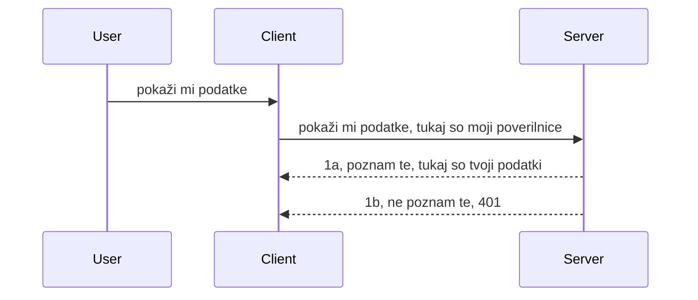

# Preprosta avtentikacija

MCP SDK-ji podpirajo uporabo OAuth 2.1, kar je pravzaprav precej zapleten proces, ki vključuje koncepte, kot so avtentikacijski strežnik, strežnik virov, pošiljanje poverilnic, pridobivanje kode, izmenjava kode za žeton nosilca, dokler končno ne dobite podatke o vašem viru. Če niste vajeni OAuth, kar je odlična stvar za implementacijo, je dobro, da začnete z osnovnim nivojem avtentikacije in postopoma gradite do vedno boljše varnosti. Zato obstaja ta poglavje, da vas pripravi na bolj napredno avtentikacijo.

## Avtentikacija, kaj to pomeni?

Avtentikacija je kratica za avtentikacijo in avtorizacijo. Idea je, da moramo narediti dve stvari:

- **Avtentikacija**, kar je proces ugotavljanja, ali osebi dovolimo vstop v naš dom, da ima pravico biti "tukaj", torej ima dostop do našega strežnika virov, kjer živijo funkcije MCP strežnika.
- **Avtorizacija**, je proces ugotavljanja, ali naj ima uporabnik dostop do teh specifičnih virov, ki jih zahteva, na primer teh naročil ali teh izdelkov, ali pa je dovoljena le branje vsebine, ne pa brisanje kot drugi primer.

## Poverilnice: kako sistemu povemo, kdo smo

No, večina spletnih razvijalcev začne razmišljati v smislu zagotavljanja poverilnice strežniku, običajno skrivnosti, ki pravi, ali jim je dovoljeno biti tukaj "Avtentikacija". Ta poverilnica je običajno base64 kodirana različica uporabniškega imena in gesla ali API ključ, ki edinstveno identificira določenega uporabnika.

To vključuje pošiljanje preko glave z imenom "Authorization" takole:

```json
{ "Authorization": "secret123" }
```

To se običajno imenuje osnovna avtentikacija. Kako potem splošni potek deluje, je takole:



Zdaj, ko razumemo, kako deluje iz poteka, kako to implementiramo? No, večina spletnih strežnikov ima koncept, imenovan middleware, kos kode, ki teče kot del zahteve in lahko preveri poverilnice ter, če so poverilnice veljavne, dovoli zahtevi prehod. Če zahteva nima veljavnih poverilnic, dobite avtentikacijsko napako. Poglejmo, kako lahko to implementiramo:

**Python**

```python
class AuthMiddleware(BaseHTTPMiddleware):
    async def dispatch(self, request, call_next):

        has_header = request.headers.get("Authorization")
        if not has_header:
            print("-> Missing Authorization header!")
            return Response(status_code=401, content="Unauthorized")

        if not valid_token(has_header):
            print("-> Invalid token!")
            return Response(status_code=403, content="Forbidden")

        print("Valid token, proceeding...")
       
        response = await call_next(request)
        # dodajte poljubne uporabniške glave ali kako drugače spremenite odziv
        return response


starlette_app.add_middleware(CustomHeaderMiddleware)
```

Tukaj imamo:

- Ustvarjen middleware z imenom `AuthMiddleware`, katerega metoda `dispatch` se kliče s strani spletnega strežnika.
- Middleware dodan spletnemu strežniku:

    ```python
    starlette_app.add_middleware(AuthMiddleware)
    ```

- Napisana logika preverjanja, ki preverja, ali je glava Authorization prisotna in če je posredovana skrivnost veljavna:

    ```python
    has_header = request.headers.get("Authorization")
    if not has_header:
        print("-> Missing Authorization header!")
        return Response(status_code=401, content="Unauthorized")

    if not valid_token(has_header):
        print("-> Invalid token!")
        return Response(status_code=403, content="Forbidden")
    ```

    če je skrivnost prisotna in veljavna, potem dovolimo zahtevo, da preide, z klicem `call_next` in vrnemo odgovor.

    ```python
    response = await call_next(request)
    # dodajte katerikoli kupčev header ali nekaj spremenite v odgovoru na kakršen koli način
    return response
    ```

Kako deluje je to, da se, če je spletni zahtevek poslan na strežnik, middleware sproži in glede na svojo implementacijo bodisi dopušča zahtevek ali pa vrne napako, ki kaže, da stranka ni dovoljena za nadaljevanje.

**TypeScript**

Tukaj ustvarimo middleware s priljubljenim ogrodjem Express in prestrežemo zahtevo, preden doseže MCP strežnik. Tukaj je koda za to:

```typescript
function isValid(secret) {
    return secret === "secret123";
}

app.use((req, res, next) => {
    // 1. Je prisotna avtentikacijska glava?
    if(!req.headers["Authorization"]) {
        res.status(401).send('Unauthorized');
    }
    
    let token = req.headers["Authorization"];

    // 2. Preveri veljavnost.
    if(!isValid(token)) {
        res.status(403).send('Forbidden');
    }

   
    console.log('Middleware executed');
    // 3. Posreduje zahtevo naslednjemu koraku v verigi zahtev.
    next();
});
```

V tej kodi:

1. Preverimo, ali je glava Authorization prisotna na prvem mestu, če ni, pošljemo napako 401.
2. Zagotovimo, da je poverilnica/žeton veljaven, če ni, pošljemo napako 403.
3. Nazadnje posreduje zahtevo v cevovodu in vrne iskani vir.

## Vaja: Implementiraj avtentikacijo

Vzemimo svoje znanje in poskusimo implementirati. Tukaj je načrt:

Strežnik

- Ustvari spletni strežnik in MCP instanco.
- Implementiraj middleware za strežnik.

Odjemalec

- Pošljite spletni zahtevek z poverilnico prek glave.

### -1- Ustvari spletni strežnik in MCP instanco

> **Pogled naprej:** spodnji primer TypeScript sledi HTTP prenosom v mapi `transports` po ključu `mcp-session-id`, skladno z **MCP specifikacijo 2025-11-25**. Kandidat za izdajo `2026-07-28` odstrani roko stiskanja in ID seje povsem, zato ta zemljevid prenosov na sejo izgine v prid brezstanja in samostojnih zahtev. Glej [Kaj se spreminja v MCP: Kandidat za izdajo 2026-07-28](../../01-CoreConcepts/mcp-2026-07-28-release-candidate.md).

V prvem koraku moramo ustvariti primerek spletnega strežnika in MCP strežnika.

**Python**

Tukaj ustvarimo MCP strežnik, ustvarimo starlette spletno aplikacijo in jo gostimo z uvicorn.

```python
# ustvarjanje MCP strežnika

app = FastMCP(
    name="MCP Resource Server",
    instructions="Resource Server that validates tokens via Authorization Server introspection",
    host=settings["host"],
    port=settings["port"],
    debug=True
)

# ustvarjanje starlette spletne aplikacije
starlette_app = app.streamable_http_app()

# poganjanje aplikacije preko uvicorn
async def run(starlette_app):
    import uvicorn
    config = uvicorn.Config(
            starlette_app,
            host=app.settings.host,
            port=app.settings.port,
            log_level=app.settings.log_level.lower(),
        )
    server = uvicorn.Server(config)
    await server.serve()

run(starlette_app)
```

V tej kodi:

- Ustvarite MCP strežnik.
- Konstruirajte starlette spletno aplikacijo iz MCP strežnika, `app.streamable_http_app()`.
- Gostite in strežite spletno aplikacijo z uvicorn `server.serve()`.

**TypeScript**

Tukaj ustvarimo MCP strežniški primerek.

```typescript
const server = new McpServer({
      name: "example-server",
      version: "1.0.0"
    });

    // ... nastavite strežniške vire, orodja in pozive ...
```

Ta ustvarjanje MCP strežnika se bo moralo zgoditi znotraj definicije poti POST /mcp, zato vzemimo zgornjo kodo in jo premaknimo tako:

```typescript
import express from "express";
import { randomUUID } from "node:crypto";
import { McpServer } from "@modelcontextprotocol/sdk/server/mcp.js";
import { StreamableHTTPServerTransport } from "@modelcontextprotocol/sdk/server/streamableHttp.js";
import { isInitializeRequest } from "@modelcontextprotocol/sdk/types.js"

const app = express();
app.use(express.json());

// Zemljevid za shranjevanje transportov po ID-ju seje
const transports: { [sessionId: string]: StreamableHTTPServerTransport } = {};

// Obdelava POST zahtevkov za komunikacijo od odjemalca do strežnika
app.post('/mcp', async (req, res) => {
  // Preveri obstoječi ID seje
  const sessionId = req.headers['mcp-session-id'] as string | undefined;
  let transport: StreamableHTTPServerTransport;

  if (sessionId && transports[sessionId]) {
    // Ponovna uporaba obstoječega transporta
    transport = transports[sessionId];
  } else if (!sessionId && isInitializeRequest(req.body)) {
    // Nova zahteva za inicializacijo
    transport = new StreamableHTTPServerTransport({
      sessionIdGenerator: () => randomUUID(),
      onsessioninitialized: (sessionId) => {
        // Shrani transport po ID-ju seje
        transports[sessionId] = transport;
      },
      // Zaščita pred DNS ponovno vezavo je privzeto onemogočena zaradi združljivosti z nazaj. Če poganjate ta strežnik
      // lokalno, zagotovite, da nastavite:
      // enableDnsRebindingProtection: true,
      // allowedHosts: ['127.0.0.1'],
    });

    // Očisti transport ob zaprtju
    transport.onclose = () => {
      if (transport.sessionId) {
        delete transports[transport.sessionId];
      }
    };
    const server = new McpServer({
      name: "example-server",
      version: "1.0.0"
    });

    // ... nastavi strežniške vire, orodja in pozive ...

    // Poveži se s strežnikom MCP
    await server.connect(transport);
  } else {
    // Neveljavna zahteva
    res.status(400).json({
      jsonrpc: '2.0',
      error: {
        code: -32000,
        message: 'Bad Request: No valid session ID provided',
      },
      id: null,
    });
    return;
  }

  // Obdelaj zahtevo
  await transport.handleRequest(req, res, req.body);
});

// Ponovno uporabljiv upravljalec za GET in DELETE zahtevke
const handleSessionRequest = async (req: express.Request, res: express.Response) => {
  const sessionId = req.headers['mcp-session-id'] as string | undefined;
  if (!sessionId || !transports[sessionId]) {
    res.status(400).send('Invalid or missing session ID');
    return;
  }
  
  const transport = transports[sessionId];
  await transport.handleRequest(req, res);
};

// Obdelaj GET zahtevke za obveščanje strežnika do odjemalca preko SSE
app.get('/mcp', handleSessionRequest);

// Obdelaj DELETE zahtevke za prekinitev seje
app.delete('/mcp', handleSessionRequest);

app.listen(3000);
```

Zdaj vidite, kako je bilo ustvarjanje MCP strežnika premaknjeno znotraj `app.post("/mcp")`.

Nadaljujmo na naslednji korak ustvarjanja middleware-a, da lahko preverimo prihajajoče poverilnice.

### -2- Implementiraj middleware za strežnik

Poskrbimo za del middleware-a. Tukaj bomo ustvarili middleware, ki išče poverilnico v glavi `Authorization` in jo validira. Če je sprejemljiva, bo zahteva nadaljevala z izvajanjem tistega, kar mora (npr. seznam orodij, branje vira ali kakršnakoli MCP funkcionalnost, ki jo kliče odjemalec).

**Python**

Za ustvarjanje middleware-a moramo ustvariti razred, ki podeduje `BaseHTTPMiddleware`. Obstajata dva zanimiva dela:

- Zahteva `request`, iz katere preberemo informacije iz glave.
- `call_next`, povratni klic, ki ga moramo sprožiti, če je stranka prinesla sprejemljivo poverilnico.

Najprej moramo obravnavati situacijo, če glava `Authorization` manjka:

```python
has_header = request.headers.get("Authorization")

# ni glave, neuspeh s 401, sicer nadaljuj.
if not has_header:
    print("-> Missing Authorization header!")
    return Response(status_code=401, content="Unauthorized")
```

Tukaj pošljemo sporočilo 401 neavtorizirano, saj stranka spodleti pri avtentikaciji.

Nato, če je bila predložena poverilnica, moramo preveriti njeno veljavnost tako:

```python
 if not valid_token(has_header):
    print("-> Invalid token!")
    return Response(status_code=403, content="Forbidden")
```

Opazite, da zgoraj pošljemo sporočilo 403 prepovedano. Poglejmo celoten middleware spodaj, ki implementira vse, kar smo omenili:

```python
class AuthMiddleware(BaseHTTPMiddleware):
    async def dispatch(self, request, call_next):

        has_header = request.headers.get("Authorization")
        if not has_header:
            print("-> Missing Authorization header!")
            return Response(status_code=401, content="Unauthorized")

        if not valid_token(has_header):
            print("-> Invalid token!")
            return Response(status_code=403, content="Forbidden")

        print("Valid token, proceeding...")
        print(f"-> Received {request.method} {request.url}")
        response = await call_next(request)
        response.headers['Custom'] = 'Example'
        return response

```

Super, ampak kaj pa funkcija `valid_token`? Tukaj je:

```python
# NE uporabljajte za produkcijo - izboljšajte to !!
def valid_token(token: str) -> bool:
    # odstranite predpono "Bearer "
    if token.startswith("Bearer "):
        token = token[7:]
        return token == "secret-token"
    return False
```

To je seveda za izboljšati.

POMEMBNO: Nikoli ne bi smeli imeti takih skrivnosti v kodi. Idealno bi bilo, da vrednost, s katero primerjamo, pridobite iz podatkovnega vira ali od IDP (ponudnik identitete) ali še bolje, naj IDP opravi preverjanje.

**TypeScript**

Za implementacijo s Express moramo poklicati metodo `use`, ki sprejema middleware funkcije.

Moramo:

- Interaktirati z zahtevo in preveriti posredovano poverilnico v lastnosti `Authorization`.
- Validirati poverilnico in če je veljavna, dovoliti nadaljevanje zahtevka ter izvajanje zahtev MCP stranke (npr. seznam orodij, branje vira ali karkoli drugega, povezano z MCP).

Tukaj preverjamo, ali je glava `Authorization` prisotna in če ni, ustavimo zahtevo:

```typescript
if(!req.headers["authorization"]) {
    res.status(401).send('Unauthorized');
    return;
}
```

Če glava ni poslana, prejmete napako 401.

Nato preverimo, ali je poverilnica veljavna, če ne, ponovno ustavimo zahtevo s nekoliko drugačnim sporočilom:

```typescript
if(!isValid(token)) {
    res.status(403).send('Forbidden');
    return;
} 
```

Opazite, da dobite napako 403.

Tukaj je celotna koda:

```typescript
app.use((req, res, next) => {
    console.log('Request received:', req.method, req.url, req.headers);
    console.log('Headers:', req.headers["authorization"]);
    if(!req.headers["authorization"]) {
        res.status(401).send('Unauthorized');
        return;
    }
    
    let token = req.headers["authorization"];

    if(!isValid(token)) {
        res.status(403).send('Forbidden');
        return;
    }  

    console.log('Middleware executed');
    next();
});
```

Nastavili smo spletni strežnik, da sprejema middleware za preverjanje poverilnic, ki jih upamo, da nam jih stranka pošlje. Kaj pa stranka sama?

### -3- Pošlji spletni zahtevek s poverilnico prek glave

Moramo zagotoviti, da stranka posreduje poverilnico preko glave. Ker bomo uporabili MCP odjemalca, moramo ugotoviti, kako se to naredi.

**Python**

Za odjemalca moramo predati glavo s poverilnico tako:

```python
# NE trdo kodirajte vrednosti, vsaj shranite jo v okoljsko spremenljivko ali bolj varno shrambo
token = "secret-token"

async with streamablehttp_client(
        url = f"http://localhost:{port}/mcp",
        headers = {"Authorization": f"Bearer {token}"}
    ) as (
        read_stream,
        write_stream,
        session_callback,
    ):
        async with ClientSession(
            read_stream,
            write_stream
        ) as session:
            await session.initialize()
      
            # NAREDIMO, kaj želite, da se naredi v odjemalcu, npr. seznam orodij, klic orodij itd.
```

Opazite, kako napolnimo lastnost `headers` takole ` headers = {"Authorization": f"Bearer {token}"}`.

**TypeScript**

To lahko rešimo v dveh korakih:

1. Napolnimo konfiguracijski objekt z našo poverilnico.
2. Predamo konfiguracijski objekt transportu.

```typescript

// NE trdo kodirajte vrednosti, kot je prikazano tukaj. Najmanj, kar lahko naredite, je, da jo imate kot okoljsko spremenljivko in uporabite nekaj, kot je dotenv (v razvojnem načinu).
let token = "secret123"

// definirajte objekt možnosti za transport odjemalca
let options: StreamableHTTPClientTransportOptions = {
  sessionId: sessionId,
  requestInit: {
    headers: {
      "Authorization": "secret123"
    }
  }
};

// posredujte objekt možnosti transportu
async function main() {
   const transport = new StreamableHTTPClientTransport(
      new URL(serverUrl),
      options
   );
```

Tukaj zgoraj vidite, kako smo morali ustvariti objekt `options` in postaviti naše glave pod lastnost `requestInit`.

POMEMBNO: Kako to izboljšati od tu naprej? Trenutna implementacija ima nekaj težav. Najprej, pošiljanje poverilnice tako je precej tvegano, razen če imate vsaj HTTPS. Tudi takrat lahko poverilnica postane ukradena, zato potrebujete sistem, kjer lahko preprosto prekličete žeton in dodate dodatne preglede, kot na primer, od kod na svetu prihaja, ali se zahtevek pojavlja preveč pogosto (obnašanje kot bot), na kratko, obstaja cel kup skrbi.

Vendar pa je treba povedati, za zelo preproste API-je, kjer nočete, da kdorkoli kliče vašo API brez avtentikacije, je to dober začetek.

S tem rečeno, poskusimo malo okrepiti varnost z uporabo standardiziranega formata, kot je JSON Web Token, znan tudi kot JWT ali "JOT" žetoni.

## JSON Web žetoni, JWT

Torej poskušamo izboljšati stvari od pošiljanja zelo enostavnih poverilnic. Kakšne so neposredne izboljšave, ki jih dobimo z uvedbo JWT?

- **Varnostne izboljšave**. Pri osnovni avtentikaciji pošiljate uporabniško ime in geslo kot base64 kodiran žeton (ali pošljete API ključ) vedno znova, kar povečuje tveganje. Z JWT pošljete svoje uporabniško ime in geslo in dobite žeton v zameno, ki je tudi časovno omejen, kar pomeni, da poteče. JWT omogoča enostavno uporabo finozrnate kontrole dostopa z uporabo vlog, obsegov in dovoljenj.
- **Brezstanje in skalabilnost**. JWT-ji so samostojni, vsebujejo vse uporabniške podatke in odpravlja potrebo po shranjevanju sej na strežniku. Žeton se lahko preverja tudi lokalno.
- **Medoperabilnost in federacija**. JWT-ji so osrednji del Open ID Connect in se uporabljajo z znanimi ponudniki identitete, kot so Entra ID, Google Identity in Auth0. Prav tako omogočajo uporabo enotne prijave in še veliko več, zaradi česar so primerni za podjetja.
- **Modularnost in prilagodljivost**. JWT-ji se lahko uporabljajo tudi z API Gateway-i, kot so Azure API Management, NGINX in drugi. Podpira tudi scenarije avtentikacije in komunikacijo strežnik-storitev, vključno s scenariji pooblastitev in delegacij.
- **Izvedba in predpomnjenje**. JWT-je lahko predpomnite po dekodiranju, kar zmanjša potrebo po analizi. To posebej pomaga pri aplikacijah z veliko prometa, saj izboljša prepustnost in zmanjša obremenitev izbrane infrastrukture.
- **Napredne funkcije**. Podpira tudi introspekcijo (preverjanje veljavnosti na strežniku) in preklic (neveljavnost žetona).

Z vsemi temi koristmi si poglejmo, kako lahko našo implementacijo dvignemo na višjo raven.

## Pretvarjanje osnovne avtentikacije v JWT

Torej spremembe, ki jih moramo narediti na širokem nivoju, so:

- **Naučiti se sestaviti JWT žeton** in ga pripraviti za pošiljanje od odjemalca do strežnika.
- **Validirati JWT žeton**, in če je veljaven, dovoliti odjemalcu dostop do naših virov.
- **Varen shranjevanje žetona**. Kako varno shraniti ta žeton.
- **Zaščititi poti**. Moramo zaščititi poti, v našem primeru zaščititi poti in specifične MCP funkcije.
- **Dodati osvežitvene žetone**. Poskrbimo, da ustvarimo žetone, ki so kratkotrajni, ter osvežitvene žetone, ki so dolgoročni in se lahko uporabijo za pridobivanje novih, če potečejo. Prav tako poskrbimo za osvežitveni konec in strategijo rotacije.

### -1- Sestavi JWT žeton

Najprej JWT žeton vsebuje naslednje dele:

- **glavo**, algoritem, ki se uporablja, in tip žetona.
- **tovor**, trditve, kot so sub (uporabnik ali entiteta, ki jo žeton predstavlja. V avtentikacijskem scenariju je to običajno uporabniški ID), exp (kadar poteče), role (vloga)
- **podpis**, podpisan s skrivnostjo ali zasebnim ključem.

Za to bomo morali sestaviti glavo, tovor in kodiran žeton.

**Python**

```python

import jwt
import jwt
from jwt.exceptions import ExpiredSignatureError, InvalidTokenError
import datetime

# Skrivni ključ, uporabljen za podpis JWT
secret_key = 'your-secret-key'

header = {
    "alg": "HS256",
    "typ": "JWT"
}

# informacije o uporabniku in njegove trditve ter čas poteka
payload = {
    "sub": "1234567890",               # Predmet (ID uporabnika)
    "name": "User Userson",                # Prilagojena trditev
    "admin": True,                     # Prilagojena trditev
    "iat": datetime.datetime.utcnow(),# Datum izdaje
    "exp": datetime.datetime.utcnow() + datetime.timedelta(hours=1)  # Potek
}

# kodiraj to
encoded_jwt = jwt.encode(payload, secret_key, algorithm="HS256", headers=header)
```

V zgornji kodi smo:

- Definirali glavo z uporabo HS256 kot algoritma in tip JWT.
- Sestavili tovor, ki vsebuje subjekt ali ID uporabnika, uporabniško ime, vlogo, čas izdaje in čas poteka, s čimer implementiramo časovno omejenost, ki smo jo prej omenili.

**TypeScript**

Tukaj bomo potrebovali nekaj odvisnosti, ki nam bodo pomagale sestaviti JWT žeton.

Odvisnosti

```sh

npm install jsonwebtoken
npm install --save-dev @types/jsonwebtoken
```

Zdaj, ko imamo to, ustvarimo glavo, tovor in preko tega sestavimo kodiran žeton.

```typescript
import jwt from 'jsonwebtoken';

const secretKey = 'your-secret-key'; // Uporabite okoljske spremenljivke v produkciji

// Določite vsebino
const payload = {
  sub: '1234567890',
  name: 'User usersson',
  admin: true,
  iat: Math.floor(Date.now() / 1000), // Izdan ob
  exp: Math.floor(Date.now() / 1000) + 60 * 60 // Poteka čez 1 uro
};

// Določite glavo (opcijsko, jsonwebtoken nastavi privzete vrednosti)
const header = {
  alg: 'HS256',
  typ: 'JWT'
};

// Ustvarite žeton
const token = jwt.sign(payload, secretKey, {
  algorithm: 'HS256',
  header: header
});

console.log('JWT:', token);
```

Ta žeton je:

Podpisan z uporabo HS256
Veljaven 1 uro
Vsebuje trditve kot sub, name, admin, iat in exp.

### -2- Validiraj žeton

Prav tako bomo morali validirati žeton, to je nekaj, kar bi morali narediti na strežniku, da zagotovimo, da je tisto, kar nam stranka pošilja, dejansko veljavno. Obstaja veliko preverjanj, ki jih moramo narediti tukaj, od validacije strukture do veljavnosti. Spodbujeni ste tudi, da dodate druga preverjanja, na primer, ali je uporabnik v vašem sistemu in podobno.

Za validacijo žetona ga moramo dekodirati, da ga lahko preberemo, nato začnemo preverjati njegovo veljavnost:

**Python**

```python

# Dekodirajte in preverite JWT
try:
    decoded = jwt.decode(token, secret_key, algorithms=["HS256"])
    print("✅ Token is valid.")
    print("Decoded claims:")
    for key, value in decoded.items():
        print(f"  {key}: {value}")
except ExpiredSignatureError:
    print("❌ Token has expired.")
except InvalidTokenError as e:
    print(f"❌ Invalid token: {e}")

```


V tej kodi kličemo `jwt.decode` z uporabo žetona, skrivnega ključa in izbranega algoritma kot vhod. Opazite, kako uporabljamo konstrukcijo try-catch, saj neuspešna validacija povzroči sprožitev napake.

**TypeScript**

Tukaj moramo poklicati `jwt.verify`, da dobimo razkodirano različico žetona, ki jo lahko dodatno analiziramo. Če ta klic ne uspe, to pomeni, da je struktura žetona nepravilna ali pa ni več veljaven.

```typescript

try {
  const decoded = jwt.verify(token, secretKey);
  console.log('Decoded Payload:', decoded);
} catch (err) {
  console.error('Token verification failed:', err);
}
```

OPOZORILO: kot smo že omenili, bi morali izvesti dodatne kontrole, da zagotovimo, da ta žeton kaže na uporabnika v našem sistemu in da ima uporabnik pravice, ki jih trdi, da jih ima.

Nadalje si oglejmo nadzor dostopa na podlagi vlog, znan tudi kot RBAC.

## Dodajanje nadzora dostopa na podlagi vlog

Ideja je, da želimo izraziti, da imajo različne vloge različne pravice. Na primer, predvidevamo, da lahko admin naredi vse, običajni uporabnik lahko bere/piše, gost pa lahko samo bere. Zato so tukaj nekaj možnih nivojev dovoljenj:

- Admin.Write
- User.Read
- Guest.Read

Poglejmo, kako lahko tak nadzor implementiramo z middleware-jem. Middleware lahko dodamo na posamezno pot ali za vse poti.

**Python**

```python
from starlette.middleware.base import BaseHTTPMiddleware
from starlette.responses import JSONResponse
import jwt

# NE imejte skrivnosti v kodi, kot je ta, to je samo za demonstracijo. Preberite jo iz varnega mesta.
SECRET_KEY = "your-secret-key" # postavite to v okoljsko spremenljivko
REQUIRED_PERMISSION = "User.Read"

class JWTPermissionMiddleware(BaseHTTPMiddleware):
    async def dispatch(self, request, call_next):
        auth_header = request.headers.get("Authorization")
        if not auth_header or not auth_header.startswith("Bearer "):
            return JSONResponse({"error": "Missing or invalid Authorization header"}, status_code=401)

        token = auth_header.split(" ")[1]
        try:
            decoded = jwt.decode(token, SECRET_KEY, algorithms=["HS256"])
        except jwt.ExpiredSignatureError:
            return JSONResponse({"error": "Token expired"}, status_code=401)
        except jwt.InvalidTokenError:
            return JSONResponse({"error": "Invalid token"}, status_code=401)

        permissions = decoded.get("permissions", [])
        if REQUIRED_PERMISSION not in permissions:
            return JSONResponse({"error": "Permission denied"}, status_code=403)

        request.state.user = decoded
        return await call_next(request)


```

Obstaja nekaj različnih načinov, kako dodati middleware, kot spodaj:

```python

# Alt 1: dodaj vmesnik medgradnika med gradnjo aplikacije starlette
middleware = [
    Middleware(JWTPermissionMiddleware)
]

app = Starlette(routes=routes, middleware=middleware)

# Alt 2: dodaj vmesnik medgradnika po tem, ko je aplikacija starlette že zgrajena
starlette_app.add_middleware(JWTPermissionMiddleware)

# Alt 3: dodaj vmesnik medgradnika na posamezno pot
routes = [
    Route(
        "/mcp",
        endpoint=..., # upravljavec
        middleware=[Middleware(JWTPermissionMiddleware)]
    )
]
```

**TypeScript**

Lahko uporabimo `app.use` in middleware, ki bo tekel za vse zahteve.

```typescript
app.use((req, res, next) => {
    console.log('Request received:', req.method, req.url, req.headers);
    console.log('Headers:', req.headers["authorization"]);

    // 1. Preverite, ali je bil poslan autorizacijski glava

    if(!req.headers["authorization"]) {
        res.status(401).send('Unauthorized');
        return;
    }
    
    let token = req.headers["authorization"];

    // 2. Preverite, ali je žeton veljaven
    if(!isValid(token)) {
        res.status(403).send('Forbidden');
        return;
    }  

    // 3. Preverite, ali uporabnik žetona obstaja v našem sistemu
    if(!isExistingUser(token)) {
        res.status(403).send('Forbidden');
        console.log("User does not exist");
        return;
    }
    console.log("User exists");

    // 4. Preverite, ali ima žeton ustrezna dovoljenja
    if(!hasScopes(token, ["User.Read"])){
        res.status(403).send('Forbidden - insufficient scopes');
    }

    console.log("User has required scopes");

    console.log('Middleware executed');
    next();
});

```

Obstaja kar nekaj stvari, ki jih lahko pustimo našemu middleware-ju in ki naj jih middleware NAJ naredi, in sicer:

1. Preveri, ali je prisoten authorization header
2. Preveri, ali je žeton veljaven, pokličemo `isValid`, kar je metoda, ki smo jo napisali in preverja celovitost in veljavnost JWT žetona.
3. Preveri, ali uporabnik obstaja v našem sistemu, to bi morali preveriti.

   ```typescript
    // uporabniki v podatkovni bazi
   const users = [
     "user1",
     "User usersson",
   ]

   function isExistingUser(token) {
     let decodedToken = verifyToken(token);

     // TODO, preveri, če uporabnik obstaja v podatkovni bazi
     return users.includes(decodedToken?.name || "");
   }
   ```

   Zgoraj smo ustvarili zelo enostaven seznam `users`, ki bi moral biti seveda v bazi podatkov.

4. Poleg tega bi morali tudi preveriti, ali ima žeton ustrezna dovoljenja.

   ```typescript
   if(!hasScopes(token, ["User.Read"])){
        res.status(403).send('Forbidden - insufficient scopes');
   }
   ```

   V kodi zgoraj znotraj middleware-ja preverjamo, da žeton vsebuje dovoljenje User.Read, če ne, vrnemo napako 403. Spodaj je pomočna metoda `hasScopes`.

   ```typescript
   function hasScopes(scope: string, requiredScopes: string[]) {
     let decodedToken = verifyToken(scope);
    return requiredScopes.every(scope => decodedToken?.scopes.includes(scope));
  }
   ```

Have a think which additional checks you should be doing, but these are the absolute minimum of checks you should be doing.

Using Express as a web framework is a common choice. There are helpers library when you use JWT so you can write less code.

- `express-jwt`, helper library that provides a middleware that helps decode your token.
- `express-jwt-permissions`, this provides a middleware `guard` that helps check if a certain permission is on the token.

Here's what these libraries can look like when used:

```typescript
const express = require('express');
const jwt = require('express-jwt');
const guard = require('express-jwt-permissions')();

const app = express();
const secretKey = 'your-secret-key'; // put this in env variable

// Decode JWT and attach to req.user
app.use(jwt({ secret: secretKey, algorithms: ['HS256'] }));

// Check for User.Read permission
app.use(guard.check('User.Read'));

// multiple permissions
// app.use(guard.check(['User.Read', 'Admin.Access']));

app.get('/protected', (req, res) => {
  res.json({ message: `Welcome ${req.user.name}` });
});

// Error handler
app.use((err, req, res, next) => {
  if (err.code === 'permission_denied') {
    return res.status(403).send('Forbidden');
  }
  next(err);
});

```

Zdaj ste videli, kako se middleware lahko uporablja tako za preverjanje pristnosti kot za avtorizacijo, kako pa MCP vpliva na način, kako izvajamo avtentikacijo? To bomo izvedeli v naslednjem poglavju.

### -3- Dodajanje RBAC za MCP

Do zdaj ste videli, kako dodati RBAC prek middleware-ja, vendar za MCP ni enostavnega načina za dodajanje RBAC na raven posamezne funkcije v MCP, kaj torej naredimo? Preprosto moramo dodati kodo, ki preveri, ali ima odjemalec pravice za klic določenega orodja:

Imate več različnih možnosti, kako doseči RBAC za posamezno funkcijo, tukaj je nekaj:

- Dodajte preverjanje za vsako orodje, vir, poziv, kjer morate preveriti nivo dovoljenja.

   **python**

   ```python
   @tool()
   def delete_product(id: int):
      try:
          check_permissions(role="Admin.Write", request)
      catch:
        pass # stranka ni uspela pri avtorizaciji, sproži napako avtorizacije
   ```

   **typescript**

   ```typescript
   server.registerTool(
    "delete-product",
    {
      title: Delete a product",
      description: "Deletes a product",
      inputSchema: { id: z.number() }
    },
    async ({ id }) => {
      
      try {
        checkPermissions("Admin.Write", request);
        // todo, pošlji id v productService in oddaljeno vnos
      } catch(Exception e) {
        console.log("Authorization error, you're not allowed");  
      }

      return {
        content: [{ type: "text", text: `Deletected product with id ${id}` }]
      };
    }
   );
   ```


- Uporabite napreden strežniški pristop in request handlerje, da zmanjšate mesta, kjer morate narediti preverjanje.

   **Python**

   ```python
   
   tool_permission = {
      "create_product": ["User.Write", "Admin.Write"],
      "delete_product": ["Admin.Write"]
   }

   def has_permission(user_permissions, required_permissions) -> bool:
      # user_permissions: seznam dovoljenj, ki jih ima uporabnik
      # required_permissions: seznam dovoljenj, potrebnih za orodje
      return any(perm in user_permissions for perm in required_permissions)

   @server.call_tool()
   async def handle_call_tool(
     name: str, arguments: dict[str, str] | None
   ) -> list[types.TextContent]:
    # Predpostavite, da je request.user.permissions seznam dovoljenj za uporabnika
     user_permissions = request.user.permissions
     required_permissions = tool_permission.get(name, [])
     if not has_permission(user_permissions, required_permissions):
        # Vrzi napako "Nimate dovoljenja za uporabo orodja {name}"
        raise Exception(f"You don't have permission to call tool {name}")
     # nadaljuj in pokliči orodje
     # ...
   ```   
   

   **TypeScript**

   ```typescript
   function hasPermission(userPermissions: string[], requiredPermissions: string[]): boolean {
       if (!Array.isArray(userPermissions) || !Array.isArray(requiredPermissions)) return false;
       // Vrni true, če ima uporabnik vsaj eno zahtevano dovoljenje
       
       return requiredPermissions.some(perm => userPermissions.includes(perm));
   }
  
   server.setRequestHandler(CallToolRequestSchema, async (request) => {
      const { params: { name } } = request;
  
      let permissions = request.user.permissions;
  
      if (!hasPermission(permissions, toolPermissions[name])) {
         return new Error(`You don't have permission to call ${name}`);
      }
  
      // nadaljuj..
   });
   ```

   Opomba, morate zagotoviti, da vaš middleware dodeli razkodiran žeton lastnosti user v zahtevku, da je zgornja koda poenostavljena.

### Povzetek

Zdaj, ko smo razpravljali, kako na splošno dodati podporo za RBAC in posebej za MCP, je čas, da poskusite sami implementirati varnost, da boste zagotovili razumevanje predstavljenih konceptov.

## Naloga 1: Zgradite MCP strežnik in MCP odjemalca z osnovno avtentikacijo

Tukaj boste uporabili, kar ste se naučili o pošiljanju poverilnic prek headerjev.

## Rešitev 1

[Rešitev 1](./code/basic/README.md)

## Naloga 2: Nadgradite rešitev iz Naloge 1 na uporabo JWT

Vzemite prvo rešitev, a tokrat jo izboljšajte.

Namesto uporabe Basic Auth uporabimo JWT.

## Rešitev 2

[Rešitev 2](./solution/jwt-solution/README.md)

## Izziv

Dodajte RBAC za posamezno orodje, kot opisano v poglavju "Dodaj RBAC za MCP".

## Povzetek

Upamo, da ste se v tem poglavju veliko naučili, od nobene varnosti, do osnovne varnosti, do JWT in kako ga lahko dodamo MCP.

Zgradili smo trdno osnovo s prilagojenimi JWT-ji, a ko rastemo, se premikamo k modelu identitete, ki temelji na standardih. Sprejemanje IdP-ja, kot sta Entra ali Keycloak, nam omogoča sprostitev izdaje, preverjanja in upravljanja življenjskega cikla žetonov na zaupanja vredni platformi — kar nas osvobaja, da se osredotočimo na logiko aplikacije in uporabniško izkušnjo.

Za to imamo naprednejše [poglavje o Entro](../../05-AdvancedTopics/mcp-security-entra/README.md)

## Kaj sledi

- Naslednje: [Nastavitev MCP gostiteljev](../12-mcp-hosts/README.md)

---

<!-- CO-OP TRANSLATOR DISCLAIMER START -->
**Omejitev odgovornosti**:
Ta dokument je bil preveden z uporabo AI prevajalske storitve [Co-op Translator](https://github.com/Azure/co-op-translator). Čeprav si prizadevamo za natančnost, vas prosimo, da upoštevate, da avtomatizirani prevodi lahko vsebujejo napake ali netočnosti. Izvirni dokument v njegovem izvirnem jeziku je treba obravnavati kot avtoritativni vir. Za kritične informacije je priporočljiv strokovni človeški prevod. Ne odgovarjamo za morebitna nesporazume ali napačne interpretacije, ki izhajajo iz uporabe tega prevoda.
<!-- CO-OP TRANSLATOR DISCLAIMER END -->