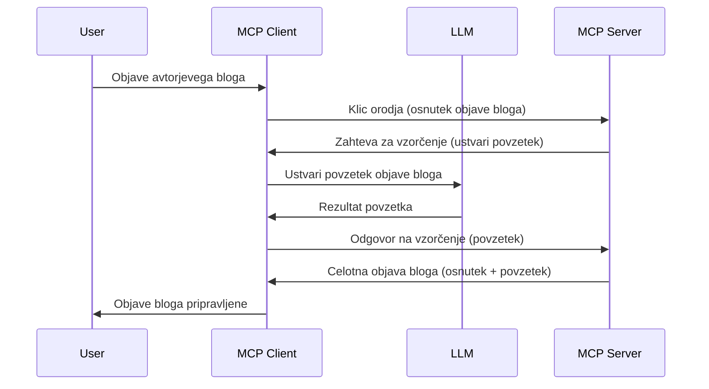

# Vzorcevanje - delegiranje funkcij odjemalcu

> **Obvestilo o opustitvi:** različica MCP specifikacije '2026-07-28' označuje vzorcevanje kot opuščeno v korist neposredne integracije z API-ji ponudnikov LLM. Vzorcevanje še vedno deluje v '2025-11-25' in še vsaj eno leto po uradni opustitvi, tako da vse v tej lekciji ostaja veljavno — vendar naj nove zasnove strežnikov ocenijo nadomestni vzorec. Glej [Kaj se spreminja v MCP: Kandidat za izdajo 2026-07-28](../../01-CoreConcepts/mcp-2026-07-28-release-candidate.md).

Včasih potrebujemo sodelovanje MCP odjemalca in MCP strežnika za dosego skupnega cilja. Morda imate primer, kjer strežnik potrebuje pomoč LLM-ja, ki teče na odjemalcu. V takšni situaciji je vzorcevanje tisto, kar morate uporabiti.

Raziščimo nekaj primerov uporabe in kako zgraditi rešitev, ki vključuje vzorcevanje.

## Pregled

V tej lekciji se osredotočamo na razlago, kdaj in kje uporabiti vzorcevanje ter kako ga konfigurirati.

## Cilji učenja

V tem poglavju bomo:

- Razložili, kaj je vzorcevanje in kdaj ga uporabiti.
- Pokažemo, kako konfigurirati vzorcevanje v MCP.
- Dali primere vzorcevanja v praksi.

## Kaj je vzorcevanje in zakaj ga uporabiti?

Vzorcevanje je napredna funkcija, ki deluje na naslednji način:



### Zahteva za vzorcevanje

Ok, zdaj imamo splošen pogled na verjeten scenarij, pogovorimo se o zahtevi za vzorcevanje, ki jo strežnik pošlje odjemalcu. Takšna zahteva v formatu JSON-RPC je lahko videti takole:

```json
{
  "jsonrpc": "2.0",
  "id": 1,
  "method": "sampling/createMessage",
  "params": {
    "messages": [
      {
        "role": "user",
        "content": {
          "type": "text",
          "text": "Create a blog post summary of the following blog post: <BLOG POST>"
        }
      }
    ],
    "modelPreferences": {
      "hints": [
        {
          "name": "claude-3-sonnet"
        }
      ],
      "intelligencePriority": 0.8,
      "speedPriority": 0.5
    },
    "systemPrompt": "You are a helpful assistant.",
    "maxTokens": 100
  }
}
```

Tu je nekaj stvari, ki jih je vredno izpostaviti:

- Poziv, pod content -> text, je naš poziv, ki je navodilo LLM-ju, naj povzame vsebino bloga.

- **modelPreferences**. Ta razdelek je ravno to, preference, priporočilo glede konfiguracije LLM-ja. Uporabnik se lahko odloči, ali bo sledil tem priporočilom ali jih spremenil. V tem primeru so priporočila glede uporabe modela in prioritete hitrosti ter inteligence.
- **systemPrompt**, to je vaš običajen sistemski poziv, ki da vašemu LLM-ju osebnost in vsebuje navodila.
- **maxTokens**, to je lastnost, ki pove, koliko tokenov je priporočeno za to opravilo.

### Odgovor na vzorcevanje

Ta odgovor je tisto, kar MCP odjemalec pošlje nazaj MCP strežniku in je rezultat klica LLM-ja, počakanja na odgovor ter sestave sporočila. Lahko je videti takole v JSON-RPC:

```json
{
  "jsonrpc": "2.0",
  "id": 1,
  "result": {
    "role": "assistant",
    "content": {
      "type": "text",
      "text": "Here's your abstract <ABSTRACT>"
    },
    "model": "gpt-5",
    "stopReason": "endTurn"
  }
}
```

Opazite, da je odgovor povzetek bloga, tako kot smo prosili. Prav tako opazite, da uporabljen `model` ni tisti, ki smo ga zahtevali, ampak "gpt-5" namesto "claude-3-sonnet". To ilustrira, da lahko uporabnik spremeni odločitev o uporabi in da je vaša zahteva za vzorcevanje priporočilo.

Ok, zdaj ko razumemo glavni tok in primerno opravilo za to "ustvarjanje blog zapisa + povzetek", poglejmo, kaj moramo narediti, da bo delovalo.

### Vrste sporočil

Sporočila za vzorcevanje niso omejena le na besedilo, ampak lahko pošljete tudi slike in zvok. Tako je izgled JSON-RPC drugačen:

**Besedilo**

```json
{
  "type": "text",
  "text": "The message content"
}
```

**Vsebina slike**

```json
{
  "type": "image",
  "data": "base64-encoded-image-data",
  "mimeType": "image/jpeg"
}
```

**Vsebina zvoka**

```json
{
  "type": "audio",
  "data": "base64-encoded-audio-data",
  "mimeType": "audio/wav"
}
```

> OPOMBA: za podrobnejše informacije o vzorčenju si oglejte [uradno dokumentacijo](https://modelcontextprotocol.io/specification/2025-11-25/client/sampling)

## Kako konfigurirati vzorcevanje v odjemalcu

> Opomba: če gradite samo strežnik, tukaj ni veliko potrebe po nastavitvah.

V odjemalcu morate funkcijo nastaviti na naslednji način:

```json
{
  "capabilities": {
    "sampling": {}
  }
}
```

To bo nato zajeto, ko se bo vaš izbrani odjemalec povezal s strežnikom.

## Primer vzorcevanja v praksi - Ustvarjanje blog zapisa

Napišimo skupaj vzorčni strežnik, za to moramo narediti naslednje:

1. Ustvariti orodje na strežniku.
1. Orodje naj ustvari zahtevo za vzorcevanje.
1. Orodje naj počaka na odgovor odjemalčeve zahteve za vzorcevanje.
1. Nato naj se ustvari rezultat orodja.

Poglejmo kodo korak za korakom:

### -1- Ustvari orodje

**python**

```python
@mcp.tool()
async def create_blog(title: str, content: str, ctx: Context[ServerSession, None]) -> str:
    """Create a blog post and generate a summary"""

```

### -2- Ustvari zahtevo za vzorcevanje

Razširite svoj alat z naslednjo kodo:

**python**

```python
post = BlogPost(
        id=len(posts) + 1,
        title=title,
        content=content,
        abstract=""
    )

prompt = f"Create an abstract of the following blog post: title: {title} and draft: {content} "

result = await ctx.session.create_message(
        messages=[
            SamplingMessage(
                role="user",
                content=TextContent(type="text", text=prompt),
            )
        ],
        max_tokens=100,
)

```

### -3- Počakaj na odgovor in ga vrni

**python**

```python
post.abstract = result.content.text

posts.append(post)

# vrni končni izdelek
return json.dumps({
    "id": post.title,
    "abstract": post.abstract
})
```

### -4- Celotna koda

**python**

```python
from starlette.applications import Starlette
from starlette.routing import Mount, Host

from mcp.server.fastmcp import Context, FastMCP

from mcp.server.session import ServerSession
from mcp.types import SamplingMessage, TextContent

import json


from uuid import uuid4
from typing import List
from pydantic import BaseModel


mcp = FastMCP("Blog post generator")

# app = FastAPI()

posts = []

class BlogPost(BaseModel):
    id: int
    title: str
    content: str
    abstract: str

posts: List[BlogPost] = []

@mcp.tool()
async def create_blog(title: str, content: str, ctx: Context[ServerSession, None]) -> str:
    """Create a blog post and generate a summary"""

    post = BlogPost(
        id=len(posts) + 1,
        title=title,
        content=content,
        abstract=""
    )

    prompt = f"Create an abstract of the following blog post: title: {title} and draft: {content} "

    result = await ctx.session.create_message(
        messages=[
            SamplingMessage(
                role="user",
                content=TextContent(type="text", text=prompt),
            )
        ],
        max_tokens=100,
    )

    post.abstract = result.content.text

    posts.append(post)

    # vrni celoten blog objavo
    return json.dumps({
        "id": post.title,
        "abstract": post.abstract
    })

if __name__ == "__main__":
    print("Starting server...")
    # mcp.run()
    mcp.run(transport="streamable-http")

# zaženi aplikacijo z: python server.py
```

### -5- Testiranje v Visual Studio Code

Za testiranje v Visual Studio Code naredite naslednje:

1. Zaženite strežnik v terminalu
1. Dodajte ga v *mcp.json* (in poskrbite, da je zagnan), nekaj takega:

   ```json
   "servers": {
      "blog-server": {
        "type": "http",
        "url": "http://localhost:8000/mcp"
      }
   }
   ```

1. Vnesite poziv:

   ```text
   create a blog post named "Where Python comes from", the content is "Python is actually named after Monty Python Flying Circus"
   ```

1. Dovolite vzorcevanje. Prvič ko to preizkušate, boste prejeli dodatno pogovorno okno, ki ga morate potrditi, nato pa običajno pogovorno okno za uporabo orodja.

1. Preverite rezultate. Videli jih boste lepo prikazane v GitHub Copilot Chat, lahko pa tudi pregledate surovi JSON odgovor.

**Bonus**. Orodja Visual Studio Code zelo dobro podpirajo vzorcevanje. Dostop do vzorcevanja na vašem nameščenem strežniku lahko konfigurirate tako, da:

1. Odprete razdelek z razširitvami.
1. Izberete ikono zobnika za vaš nameščeni strežnik v razdelku "MCP SERVERS - INSTALLED".
1 Izberete "Configure Model Access", kjer lahko izberete, katere modele lahko GitHub Copilot uporablja pri vzorčenju. Prav tako lahko vidite vse zadnje zahteve za vzorcevanje s klikom na "Show Sampling requests".

## Naloga

V tej nalogi boste zgradili nekoliko drugačno vzorčenje, in sicer integracijo vzorcevanja, ki podpira generiranje opisa izdelka. Tukaj je vaš scenarij:

**Scenarij**: Delo v upravi e-trgovine zahteva veliko časa za generiranje opisov izdelkov. Zato morate zgraditi rešitev, kjer lahko pokličete orodje "create_product" z argumentoma "title" in "keywords", ki naj ustvari celoten izdelek vključno z poljem "description", ki ga napolni odjemalčev LLM.

NAMIG: uporabite, kar ste se naučili prej, za konstrukcijo tega strežnika in njegovega orodja z uporabo zahteve za vzorcevanje.

## Rešitev

[Rešitev](./solution/README.md)

## Ključna spoznanja

Vzorcevanje je močna funkcija, ki omogoča strežniku, da delegira naloge odjemalcu, ko potrebuje pomoč LLM-ja.

## Kaj sledi

- [Poglavje 4 - Praktična implementacija](../../04-PracticalImplementation/README.md)

---

<!-- CO-OP TRANSLATOR DISCLAIMER START -->
**Omejitev odgovornosti**:
Ta dokument je bil preveden z uporabo AI prevajalske storitve [Co-op Translator](https://github.com/Azure/co-op-translator). Čeprav si prizadevamo za natančnost, vas prosimo, da upoštevate, da avtomatizirani prevodi lahko vsebujejo napake ali netočnosti. Izvirni dokument v njegovem izvirnem jeziku je treba obravnavati kot avtoritativni vir. Za kritične informacije je priporočljiv strokovni človeški prevod. Ne odgovarjamo za morebitna nesporazume ali napačne interpretacije, ki izhajajo iz uporabe tega prevoda.
<!-- CO-OP TRANSLATOR DISCLAIMER END -->