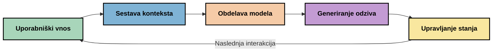
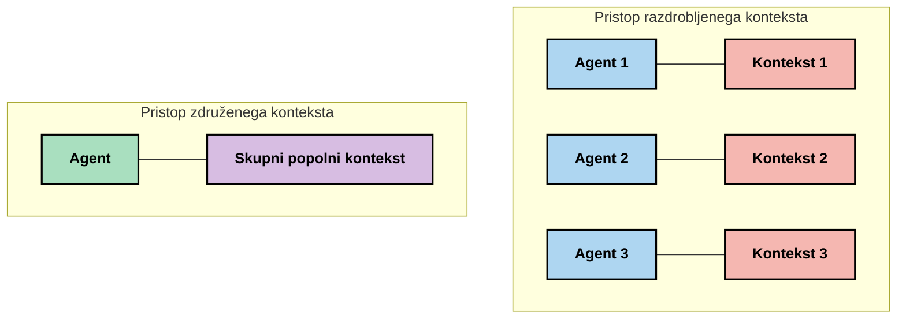
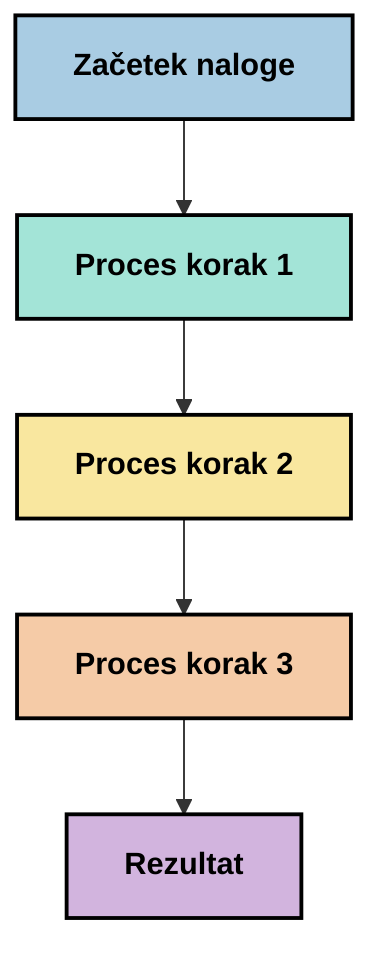
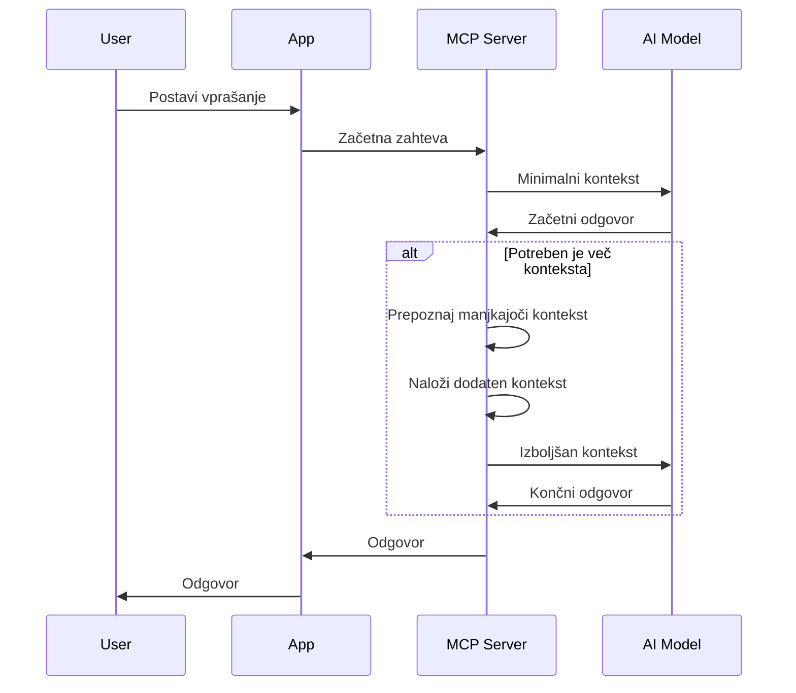
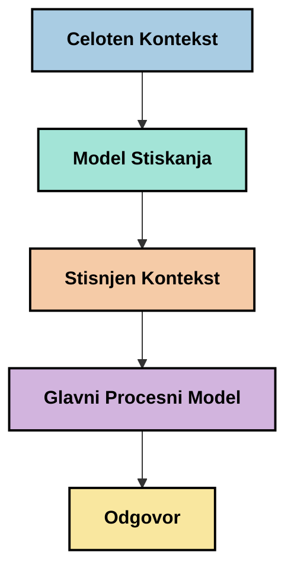
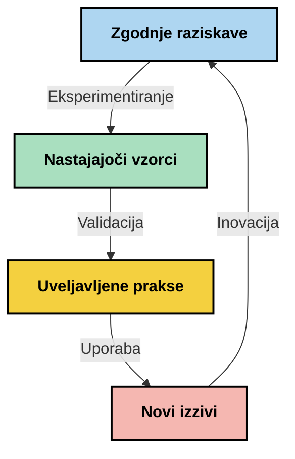

# Inženiring konteksta: Nastajajoči koncept v ekosistemu MCP

## Pregled

Inženiring konteksta je nastajajoči koncept na področju umetne inteligence, ki raziskuje, kako je informacija strukturirana, dostavljena in vzdrževana skozi interakcije med strankami in AI storitvami. Ko se ekosistem Model Context Protocol (MCP) razvija, postaja razumevanje učinkovitega upravljanja konteksta vse pomembnejše. Ta modul uvaja koncept inženiringa konteksta ter raziskuje njegove možne uporabe v implementacijah MCP.

## Cilji učenja

Do konca tega modula boste znali:

- Razumeti nastajajoči koncept inženiringa konteksta ter njegovo potencialno vlogo v aplikacijah MCP
- Prepoznati ključne izzive upravljanja konteksta, ki jih naslavlja zasnova protokola MCP
- Raziskati tehnike za izboljšanje zmogljivosti modela z boljšim upravljanjem konteksta
- Premisliti o pristopih za merjenje in ocenjevanje učinkovitosti konteksta
- Uporabiti te nastajajoče koncepte za izboljšanje AI izkušenj prek okvira MCP

## Uvod v inženiring konteksta

Inženiring konteksta je nastajajoči koncept, osredotočen na namensko zasnovo in upravljanje pretoka informacij med uporabniki, aplikacijami in AI modeli. V nasprotju z uveljavljenimi področji, kot je inženiring pozivov, inženiring konteksta še oblikujejo strokovnjaki, ki poskušajo rešiti edinstvene izzive zagotavljanja pravih informacij AI modelom ob pravem času.

Kako so se veliki jezikovni modeli (LLM) razvijali, je postajala pomembnost konteksta vse bolj očitna. Kakovost, ustreznost in struktura konteksta, ki ga posredujemo, neposredno vplivajo na izhod modela. Inženiring konteksta raziskuje to razmerje in si prizadeva razviti načela za učinkovito upravljanje konteksta.

> "Leta 2025 so modeli izredno inteligentni. A tudi najbolj pameten človek ne bo mogel učinkovito opravljati svojega dela brez konteksta tega, kaj se od njega zahteva... 'Inženiring konteksta' je naslednja stopnja inženiringa pozivov. Gre za avtomatsko izvajanje tega v dinamičnem sistemu." — Walden Yan, Cognition AI

Inženiring konteksta lahko zajema:

1. **Izbor konteksta**: Določanje, katere informacije so relevantne za določeno nalogo
2. **Strukturiranje konteksta**: Organizacija informacij za maksimalno razumevanje modela
3. **Dostava konteksta**: Optimizacija načina in časa pošiljanja informacij modelom
4. **Vzdrževanje konteksta**: Upravljanje stanja in razvoja konteksta skozi čas
5. **Ocenjevanje konteksta**: Merjenje in izboljševanje učinkovitosti konteksta

Ta področja so še posebej pomembna za ekosistem MCP, ki omogoča standardiziran način, kako aplikacije zagotovijo kontekst LLM-jem.


## Perspektiva poti konteksta

Eden od načinov za vizualizacijo inženiringa konteksta je sledenje poti, po kateri informacija potuje skozi MCP sistem:



### Ključne faze na poti konteksta:

1. **Vnos uporabnika**: Surove informacije od uporabnika (besedilo, slike, dokumenti)
2. **Sestavljanje konteksta**: Združevanje uporabniškega vnosa s sistemskim kontekstom, zgodovino pogovora in drugimi pridobljenimi informacijami
3. **Obdelava modela**: AI model obdela sestavljeni kontekst
4. **Generiranje odgovora**: Model ustvari izhode na podlagi posredovanega konteksta
5. **Upravljanje stanja**: Sistem posodobi notranje stanje na podlagi interakcije

Ta perspektiva poudarja dinamično naravo konteksta v AI sistemih in postavlja pomembna vprašanja o najboljšem upravljanju informacij v vsaki fazi.

## Nastajajoča načela inženiringa konteksta

Ko se področje inženiringa konteksta oblikuje, nekatera zgodnja načela že oblikujejo praktikanti. Ta načela lahko pomagajo voditi odločitve pri implementaciji MCP:

### Načelo 1: Delite kontekst v celoti

Konec bi moral biti v celoti deli med vsemi komponentami sistema, namesto da je razdrobljen med več agenti ali procesi. Ko je kontekst razporejen, se lahko odločitve, sprejete v enem delu sistema, razlikujejo od tistih v drugem delu.



V aplikacijah MCP to predlaga zasnovo sistemov, kjer kontekst nemoteno teče skozi celoten proces, namesto da bi bil razdeljen.

### Načelo 2: Prepoznajte, da dejanja nosijo implicitne odločitve

Vsako dejanje modela predstavlja implicitne odločitve o tem, kako interpretirati kontekst. Ko različne komponente delujejo na različnih kontekstih, lahko te implicitne odločitve povzročijo konflikte, kar vodi do neusklačenih rezultatov.

To načelo ima pomembne posledice za aplikacije MCP:
- Raje linearno obdelavo kompleksnih nalog kot paralelno izvajanje z razdrobljenim kontekstom
- Zagotovite, da imajo vse odločitvene točke dostop do enakih kontekstualnih informacij
- Zasnovajte sisteme tako, da kasnejši koraki vidijo celoten kontekst prejšnjih odločitev

### Načelo 3: Uravnotežite globino konteksta z omejitvami okna

Ko pogovori in procesi postajajo daljši, kontekstualna okna sčasoma pretečejo. Učinkovit inženiring konteksta raziskuje pristope za upravljanje tega napetostnega razmerja med obsežnim kontekstom in tehničnimi omejitvami.

Potencialni pristopi vključujejo:
- Stiskanje konteksta, ki ohranja ključne informacije in hkrati zmanjšuje uporabo tokenov
- Postopno nalaganje konteksta glede na njegovo relevantnost za trenutne potrebe
- Povzemanje prejšnjih interakcij ob ohranjanju ključnih odločitev in dejstev

## Izzivi konteksta in zasnova protokola MCP

Model Context Protocol (MCP) je bil zasnovan z zavedanjem edinstvenih izzivov upravljanja konteksta. Razumevanje teh izzivov pomaga razložiti ključne vidike zasnove protokola MCP:


### Izziv 1: Omejitve velikosti kontekstualnega okna
Večina AI modelov ima fiksno velikost kontekstualnega okna, kar omejuje količino informacij, ki jih lahko obdelajo naenkrat.

**Odgovor zasnove MCP:** 
- Protokol podpira strukturiran, na virih temelječ kontekst, ki se lahko učinkovito referencira
- Viri se lahko razvrstijo po straneh in naložijo postopoma

### Izziv 2: Določanje relevantnosti
Določanje, katere informacije so najbolj pomembne za vključitev v kontekst, je zahtevno.

**Odgovor zasnove MCP:**
- Prilagodljiva orodja omogočajo dinamično pridobivanje informacij glede na potrebe
- Strukturirani pozivi omogočajo dosledno organizacijo konteksta

### Izziv 3: Vzdrževanje konteksta
Upravljanje stanja skozi interakcije zahteva natančno sledenje kontekstu.

**Odgovor zasnove MCP:**
- Standardizirano upravljanje sej
- Jasno definirani vzorci interakcij za razvoj konteksta

### Izziv 4: Večmodalni kontekst
Različni tipi podatkov (besedilo, slike, strukturirani podatki) zahtevajo različno rokovanje.

**Odgovor zasnove MCP:**
- Zasnova protokola omogoča različne vrste vsebin
- Standardizirana predstavitev večmodalnih informacij

### Izziv 5: Varnost in zasebnost
Konec pogosto vsebuje občutljive informacije, ki jih je treba zaščititi.

**Odgovor zasnove MCP:**
- Jasne meje med odgovornostmi klienta in strežnika
- Lokalne možnosti obdelave za minimizacijo razkritja podatkov

Razumevanje teh izzivov in načina, kako jih MCP rešuje, nudi temelj za raziskovanje naprednejših tehnik inženiringa konteksta.

## Nastajajoči pristopi v inženiringu konteksta

Ko se področje inženiringa konteksta razvija, se pojavljajo nekateri obetavni pristopi. Ti predstavljajo trenutno razmišljanje in ne uveljavljene najboljše prakse, ki se bodo verjetno z razvojem izkušenj z implementacijami MCP še razvijale.

### 1. Linearna obdelava z eno nitjo

V nasprotju z večagentnimi arhitekturami, ki razporejajo kontekst, nekateri praktiki ugotavljajo, da linearna obdelava z eno nitjo prinaša bolj dosledne rezultate. To je skladno z načelom vzdrževanja enotnega konteksta.



Čeprav se ta pristop lahko zdi manj učinkovit kot vzporedna obdelava, pogosto prinaša bolj koherentne in zanesljive rezultate, ker vsak korak gradi na popolnem razumevanju prejšnjih odločitev.

### 2. Razbijanje in prioritetizacija konteksta

Razbijanje velikih kontekstov na obvladljive dele in prioritetizacija najpomembnejših segmentov.

```python
# Konceptualni primer: Razdeljevanje in prioritetna obdelava konteksta
def process_with_chunked_context(documents, query):
    # 1. Razdelite dokumente na manjše dele
    chunks = chunk_documents(documents)
    
    # 2. Izračunajte ocene relevantnosti za vsak del
    scored_chunks = [(chunk, calculate_relevance(chunk, query)) for chunk in chunks]
    
    # 3. Razvrstite dele po oceni relevantnosti
    sorted_chunks = sorted(scored_chunks, key=lambda x: x[1], reverse=True)
    
    # 4. Uporabite najbolj relevantne dele kot kontekst
    context = create_context_from_chunks([chunk for chunk, score in sorted_chunks[:5]])
    
    # 5. Obdelajte s prioritetnim kontekstom
    return generate_response(context, query)
```

Zgornji koncept prikazuje, kako bi lahko velike dokumente razdelili na obvladljive dele in izbrali le najbolj relevantne dele za kontekst. Ta pristop lahko pomaga delovati znotraj omejitev kontekstualnih oken ob hkratni uporabi velikih zbirk znanja.

### 3. Postopno nalaganje konteksta

Nalaganje konteksta postopoma, glede na potrebe, namesto vsega naenkrat.



Postopno nalaganje konteksta se začne z minimalnim kontekstom in ga razširja le po potrebi. To lahko znatno zmanjša uporabo tokenov pri enostavnih poizvedbah, hkrati pa ohranja sposobnost obdelave kompleksnih vprašanj.

### 4. Stiskanje in povzemanje konteksta

Zmanjševanje velikosti konteksta ob ohranjanju bistvenih informacij.



Stiskanje konteksta se osredotoča na:
- Odstranjevanje odvečnih informacij
- Povzemanje obsežnih vsebin
- Izločanje ključnih dejstev in podrobnosti
- Ohranjanje kritičnih elementov konteksta
- Optimizacijo učinkovitosti tokenov

Ta pristop je lahko še posebej dragocen za vzdrževanje dolgih pogovorov znotraj kontekstualnih oken ali za učinkovito obdelavo velikih dokumentov. Nekateri praktiki uporabljajo specializirane modele prav za stiskanje in povzemanje zgodovine pogovorov.


## Raziskovalni premisleki o inženiringu konteksta

Med raziskovanjem nastajajočega področja inženiringa konteksta je nekaj premislekov, ki jih je vredno upoštevati pri delu z implementacijami MCP. To niso predpisane najboljše prakse, temveč področja raziskovanja, ki lahko prinesejo izboljšave vašemu specifičnemu primeru uporabe.

### Premislite o svojih ciljih konteksta

Pred implementacijo kompleksnih rešitev za upravljanje konteksta jasno določite, kaj želite doseči:
- Katere specifične informacije model potrebuje za uspeh?
- Katero informacijo je bistvena, katera pa dopolnilna?
- Kakšne so vaše omejitve zmogljivosti (zakasnitev, omejitve tokenov, stroški)?

### Raziskujte plastičene pristope k kontekstu

Nekateri praktiki dosegajo uspeh s kontekstom, urejenim v konceptualnih plasteh:
- **Osnovna plast**: Bistvene informacije, ki jih model vedno potrebuje
- **Situacijska plast**: Kontekst, specifičen za trenutno interakcijo
- **Podporna plast**: Dodatne informacije, ki so lahko v pomoč
- **Rezervna plast**: Informacije, dostopne le po potrebi

### Raziščite strategije pridobivanja

Učinkovitost vašega konteksta pogosto temelji na načinu pridobivanja informacij:
- Semantično iskanje in vdelave za iskanje konceptualno relevantnih informacij
- Iskanje po ključnih besedah za točne dejstvene podrobnosti
- Hibridni pristopi, ki združujejo več metod pridobivanja
- Filtriranje metapodatkov za omejevanje obsega glede na kategorije, datume ali vire

### Eksperimentirajte s skladnostjo konteksta

Struktura in potek vašega konteksta lahko vplivata na razumevanje modela:
- Združevanje povezanih informacij
- Uporaba dosledne oblikovne in organizacijske strukture
- Ohranjanje logičnega ali kronološkega vrstnega reda, kjer je primerno
- Izogibanje protislovnim informacijam

### Pretehtajte prednosti in slabosti večagentnih arhitektur

Čeprav so večagentne arhitekture priljubljene v mnogih AI okvirih, prinašajo pomembne izzive za upravljanje konteksta:
- Razdrobljenost konteksta lahko vodi do nedoslednih odločitev med agenti
- Vzporedna obdelava lahko uvede spore, ki jih je težko uskladiti
- Komunikacijski režijski stroški med agenti lahko zmanjšajo pridobljene zmogljivosti
- Za vzdrževanje skladnosti je potrebno kompleksno upravljanje stanja

V mnogih primerih lahko pristop z enim agentom in celovitim upravljanjem konteksta prinese bolj zanesljive rezultate kot več specializiranih agentov z razdrobljenim kontekstom.

### Razvijajte metode ocenjevanja

Za izboljšanje inženiringa konteksta skozi čas premislite, kako boste merili uspeh:
- A/B testiranje različnih struktur konteksta
- Spremljanje uporabe tokenov in časov odziva
- Sledenje zadovoljstvu uporabnikov in stopnjam dokončanja nalog
- Analiza, kdaj in zakaj kontekstne strategije odpovedo

Ti premisleki predstavljajo aktivna področja raziskovanja na področju inženiringa konteksta. Ko se področje razvija, bodo verjetno nastale bolj dokončne smernice in prakse.

## Merjenje učinkovitosti konteksta: razvijajoči se okvir

Ko se inženiring konteksta pojavlja kot koncept, praktiki začenjajo raziskovati, kako lahko merimo njegovo učinkovitost. Noben uveljavljen okvir še ne obstaja, vendar se obravnavajo različni metrični kazalci, ki bi lahko usmerjali prihodnje delo.

### Potencialne dimenzije merjenja


#### 1. Premisleki o učinkovitosti vnosa

- **Razmerje konteksta do odgovora**: Koliko konteksta je potrebnega glede na velikost odgovora?
- **Uporaba tokenov**: Kolikšen odstotek posredovanih kontekstnih tokenov očitno vpliva na odgovor?
- **Zmanjšanje konteksta**: Kako učinkovito lahko stisnemo surovo informacijo?

#### 2. Premisleki o zmogljivosti

- **Vpliv zakasnitve**: Kako upravljanje konteksta vpliva na čas odziva?
- **Token ekonomija**: Ali optimiziramo uporabo tokenov učinkovito?
- **Natančnost pridobivanja**: Kako relevantne so pridobljene informacije?
- **Poraba virov**: Katere računalniške vire zahteva?

#### 3. Premisleki o kakovosti

- **Relevantnost odgovora**: Kako dobro odgovor naslavlja poizvedbo?
- **Faktična točnost**: Ali upravljanje konteksta izboljšuje dejansko pravilnost?
- **Doslednost**: So odgovori dosledni pri podobnih poizvedbah?
- **Stopnja halucinacij**: Ali boljši kontekst zmanjšuje halucinacije modela?

#### 4. Premisleki o uporabniški izkušnji

- **Stopnja nadaljnjih poizvedb**: Kako pogosto uporabniki potrebujejo pojasnila?
- **Dokončanje nalog**: Ali uporabniki uspešno dosežejo svoje cilje?
- **Kazalniki zadovoljstva**: Kako uporabniki ocenjujejo svojo izkušnjo?

### Raziskovalni pristopi k merjenju

Pri eksperimentiranju z inženiringom konteksta v implementacijah MCP upoštevajte te raziskovalne pristope:

1. **Primerjave izhodišč**: Določite izhodišče s preprostimi pristopi konteksta, preden preizkusite bolj sofisticirane metode

2. **Postopne spremembe**: Spreminjajte eno lastnost upravljanja konteksta naenkrat, da izolirate njen vpliv

3. **Uporabniško osredotočena ocena**: Združite kvantitativne metrike s kvalitativnim uporabniškim povratnim informacijam

4. **Analiza napak**: Preučite primere, ko kontekstne strategije odpovejo, da razumete možne izboljšave

5. **Večdimenzionalna ocena**: Premislite o kompromisih med učinkovitostjo, kakovostjo in uporabniško izkušnjo

Ta eksperimentalni, večplasten pristop k merjenju je skladen z nastajajočo naravo inženiringa konteksta.

## Zaključna razmišljanja

Inženiring konteksta je nastajajoče področje raziskovanja, ki bi lahko bilo osrednjega pomena za učinkovite aplikacije MCP. Z premišljenim razumevanjem, kako informacije potujejo skozi vaš sistem, lahko potencialno ustvarite AI izkušnje, ki so bolj učinkovite, natančne in dragocene za uporabnike.

Te tehnike in pristopi, predstavljeni v tem modulu, predstavljajo zgodnje razmišljanje na tem področju, ne uveljavljene prakse. Inženiring konteksta se lahko razvije v bolj definirano disciplino, kot se razvijajo zmogljivosti AI in poglablja naše razumevanje. Za zdaj se zdi, da je najbolj učinkovit pristop eksperimentiranje v kombinaciji z natančnim merjenjem.

## Potencialne prihodnje smeri

Področje inženiringa konteksta je še v zgodnjih fazah, vendar se pojavljajo nekatere obetavne smeri:

- Načela inženiringa konteksta bodo verjetno pomembno vplivala na zmogljivost modela, učinkovitost, uporabniško izkušnjo in zanesljivost
- Linearni pristopi z obsežnim upravljanjem konteksta lahko v mnogih primerih prekašajo večagentne arhitekture
- Specializirani modeli za stiskanje konteksta lahko postanejo standardni sestavni del AI procesov
- Napetost med popolnostjo konteksta in omejitvami tokenov bo verjetno spodbudila inovacije pri rokovanju s kontekstom
- Ko modeli postanejo bolj sposobni učinkovite, človeško podobne komunikacije, bo resnično večagentno sodelovanje bolj izvedljivo
- Implementacije MCP se bodo morda razvijale v smeri standardizacije vzorcev upravljanja konteksta, ki izhajajo iz trenutnih eksperimentov



## Viri

### Uradni viri MCP
- [Model Context Protocol Website](https://modelcontextprotocol.io/)
- [Model Context Protocol Specification](https://github.com/modelcontextprotocol/modelcontextprotocol)

- [MCP Dokumentacija](https://modelcontextprotocol.io/docs)
- [MCP C# SDK](https://github.com/modelcontextprotocol/csharp-sdk)
- [MCP Python SDK](https://github.com/modelcontextprotocol/python-sdk)
- [MCP TypeScript SDK](https://github.com/modelcontextprotocol/typescript-sdk)
- [MCP Inspector](https://github.com/modelcontextprotocol/inspector) - Orodje za vizualno testiranje MCP strežnikov

### Članki o inženirstvu konteksta
- [Ne gradite večagentnih sistemov: načela inženirstva konteksta](https://cognition.ai/blog/dont-build-multi-agents) - Walden Yanovi vpogledi v načela inženirstva konteksta
- [Praktični vodič za gradnjo agentov](https://cdn.openai.com/business-guides-and-resources/a-practical-guide-to-building-agents.pdf) - OpenAIjev vodič za učinkovito oblikovanje agentov
- [Gradnja učinkovitih agentov](https://www.anthropic.com/engineering/building-effective-agents) - Pristop Anthropic k razvoju agentov

### Sorodne raziskave
- [Dinamična nadgradnja iskanja za velike jezikovne modele](https://arxiv.org/abs/2310.01487) - Raziskave o dinamičnih pristopih iskanja
- [Izgubljeno na sredini: kako jezikovni modeli uporabljajo dolge kontekste](https://arxiv.org/abs/2307.03172) - Pomembna raziskava o vzorcih obdelave konteksta
- [Hierarhična generacija slik pogojena na besedilo z uporabo CLIP latentnih predstav](https://arxiv.org/abs/2204.06125) - DALL-E 2 članek z vpogledi v strukturo konteksta
- [Raziskovanje vloge konteksta v arhitekturah velikih jezikovnih modelov](https://aclanthology.org/2023.findings-emnlp.124/) - Nedavne raziskave o upravljanju konteksta
- [Sodelovanje več agentov: pregled](https://arxiv.org/abs/2304.03442) - Raziskave o sistemih z več agenti in njihovih izzivih

### Dodatni viri
- [Tehnike optimizacije kontekstnega okna](https://learn.microsoft.com/en-us/azure/ai-services/openai/concepts/context-window)
- [Napredne tehnike RAG](https://www.microsoft.com/en-us/research/blog/retrieval-augmented-generation-rag-and-frontier-models/)
- [Dokumentacija Semantic Kernel](https://github.com/microsoft/semantic-kernel)
- [Orodja AI za upravljanje konteksta](https://github.com/microsoft/aitoolkit)

## Kaj sledi 

- [5.15 MCP Custom Transport](../mcp-transport/README.md)

---

<!-- CO-OP TRANSLATOR DISCLAIMER START -->
**Omejitev odgovornosti**:
Ta dokument je bil preveden z uporabo AI prevajalske storitve [Co-op Translator](https://github.com/Azure/co-op-translator). Čeprav si prizadevamo za natančnost, vas prosimo, da upoštevate, da avtomatizirani prevodi lahko vsebujejo napake ali netočnosti. Izvirni dokument v njegovem izvirnem jeziku je treba obravnavati kot avtoritativni vir. Za kritične informacije je priporočljiv strokovni človeški prevod. Ne odgovarjamo za morebitna nesporazume ali napačne interpretacije, ki izhajajo iz uporabe tega prevoda.
<!-- CO-OP TRANSLATOR DISCLAIMER END -->