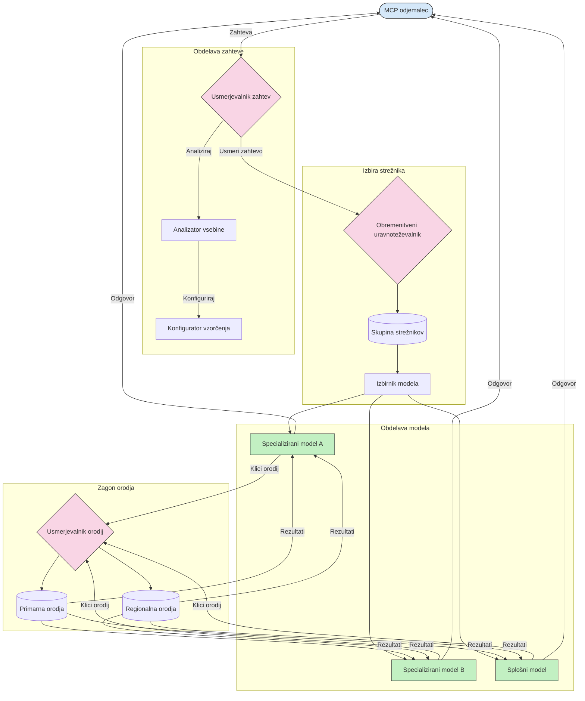

# Usmerjanje v protokolu konteksta modela

Usmerjanje je ključnega pomena za usmerjanje zahtev na ustrezne modele, orodja ali storitve znotraj ekosistema MCP.

## Uvod

Usmerjanje v protokolu konteksta modela (MCP) vključuje usmerjanje zahtev na najbolj primerne modele ali storitve na podlagi različnih kriterijev, kot so tip vsebine, uporabniški kontekst in obremenitev sistema. To zagotavlja učinkovito obdelavo in optimalno uporabo virov.

## Cilji učenja

Ob koncu te lekcije boste lahko:

- Razumeli princip usmerjanja v MCP.
- Implementirali usmerjanje na podlagi vsebine za usmerjanje zahtev k specializiranim storitvam.
- Uporabili inteligentne strategije uravnoteženja obremenitve za optimizacijo rabe virov.
- Implementirali dinamično usmerjanje orodij glede na kontekst zahteve.

## Usmerjanje na podlagi vsebine

Usmerjanje na podlagi vsebine usmerja zahteve k specializiranim storitvam glede na vsebino zahteve. Na primer, zahteve, povezane z generiranjem kode, se lahko usmerijo k specializiranemu modelu za kodo, medtem ko se ustvarjalne pisalne zahteve lahko pošljejo k modelu za ustvarjalno pisanje.

Poglejmo primer implementacije v različnih programskih jezikih.

<details>
<summary>.NET</summary>

```csharp
// .NET Example: Content-based routing in MCP
public class ContentBasedRouter
{
    private readonly Dictionary<string, McpClient> _specializedClients;
    private readonly RoutingClassifier _classifier;
    
    public ContentBasedRouter()
    {
        // Initialize specialized clients for different domains
        _specializedClients = new Dictionary<string, McpClient>
        {
            ["code"] = new McpClient("https://code-specialized-mcp.com"),
            ["creative"] = new McpClient("https://creative-specialized-mcp.com"),
            ["scientific"] = new McpClient("https://scientific-specialized-mcp.com"),
            ["general"] = new McpClient("https://general-mcp.com")
        };
        
        // Initialize content classifier
        _classifier = new RoutingClassifier();
    }
    
    public async Task<McpResponse> RouteAndProcessAsync(string prompt, IDictionary<string, object> parameters = null)
    {
        // Classify the prompt to determine the best specialized service
        string category = await _classifier.ClassifyPromptAsync(prompt);
        
        // Get the appropriate client or fall back to general
        var client = _specializedClients.ContainsKey(category) 
            ? _specializedClients[category] 
            : _specializedClients["general"];
            
        Console.WriteLine($"Routing request to {category} specialized service");
        
        // Send request to the selected service
        return await client.SendPromptAsync(prompt, parameters);
    }
    
    // Simple classifier for routing decisions
    private class RoutingClassifier
    {
        public Task<string> ClassifyPromptAsync(string prompt)
        {
            prompt = prompt.ToLowerInvariant();
            
            if (prompt.Contains("code") || prompt.Contains("function") || 
                prompt.Contains("program") || prompt.Contains("algorithm"))
            {
                return Task.FromResult("code");
            }
            
            if (prompt.Contains("story") || prompt.Contains("creative") || 
                prompt.Contains("imagine") || prompt.Contains("design"))
            {
                return Task.FromResult("creative");
            }
            
            if (prompt.Contains("science") || prompt.Contains("research") || 
                prompt.Contains("analyze") || prompt.Contains("study"))
            {
                return Task.FromResult("scientific");
            }
            
            return Task.FromResult("general");
        }
    }
}
```

V zgornji kodi smo:

- Ustvarili razred `ContentBasedRouter`, ki usmerja zahteve glede na vsebino poziva.
- Inicializirali specializirane kliente za različna področja (koda, ustvarjalnost, znanost, splošno).
- Implementirali preprost klasifikator, ki določi kategorijo poziva in ga usmeri na ustrezno specializirano storitev.
- Uporabili mehanizem za rezervno usmerjanje, ki zahteve usmeri na splošno storitev, če ni na voljo specializirane storitve.
- Implementirali asinhrono obdelavo za učinkovito ravnanje z zahtevami.
- Uporabili slovar za preslikavo vsebinskih kategorij na specializirane MCP kliente.
- Implementirali preprost klasifikator, ki analizira poziv in vrne ustrezno kategorijo.
- Uporabili specializiranega klienta za pošiljanje zahteve in prejem odgovora.
- Obdelali primere, ko poziv ne ustreza nobeni specializirani kategoriji, tako da smo ga usmerili na splošno storitev.

</details>

## Inteligentno uravnoteženje obremenitve

Uravnoteženje obremenitve optimizira rabo virov in zagotavlja visoko razpoložljivost za MCP storitve. Obstajajo različni načini za izvajanje uravnoteženja obremenitve, kot so round-robin, tehtani odzivni čas ali strategije, ki upoštevajo vsebino.

Poglejmo spodnji primer implementacije, ki uporablja naslednje strategije:

- **Round Robin**: Razporeja zahteve enakomerno med razpoložljive strežnike.
- **Tehtani odzivni čas**: Usmerja zahteve do strežnikov na podlagi njihovega povprečnega odzivnega časa.
- **Upoštevanje vsebine**: Usmerja zahteve na specializirane strežnike glede na vsebino zahteve.

<details>
<summary>Java</summary>

```java
// Java primer: Inteligentno uravnoteženje obremenitve za MCP strežnike
public class McpLoadBalancer {
    private final List<McpServerNode> serverNodes;
    private final LoadBalancingStrategy strategy;
    
    public McpLoadBalancer(List<McpServerNode> nodes, LoadBalancingStrategy strategy) {
        this.serverNodes = new ArrayList<>(nodes);
        this.strategy = strategy;
    }
    
    public McpResponse processRequest(McpRequest request) {
        // Izberi najboljši strežnik glede na strategijo
        McpServerNode selectedNode = strategy.selectNode(serverNodes, request);
        
        try {
            // Usmeri zahtevo na izbrani vozlišče
            return selectedNode.processRequest(request);
        } catch (Exception e) {
            // Obravnava napake - implementiraj logiko ponovnega poskusa ali rezervni načrt
            System.err.println("Error processing request on node " + selectedNode.getId() + ": " + e.getMessage());
            
            // Označi vozlišče kot potencialno nezdravo
            selectedNode.recordFailure();
            
            // Poskusi naslednje najboljše vozlišče kot rezervno možnost
            List<McpServerNode> remainingNodes = new ArrayList<>(serverNodes);
            remainingNodes.remove(selectedNode);
            
            if (!remainingNodes.isEmpty()) {
                McpServerNode fallbackNode = strategy.selectNode(remainingNodes, request);
                return fallbackNode.processRequest(request);
            } else {
                throw new RuntimeException("All MCP server nodes failed to process the request");
            }
        }
    }
    
    // Naloga preverjanja zdravja vozlišča
    public void startHealthChecks(Duration interval) {
        ScheduledExecutorService scheduler = Executors.newScheduledThreadPool(1);
        scheduler.scheduleAtFixedRate(() -> {
            for (McpServerNode node : serverNodes) {
                try {
                    boolean isHealthy = node.checkHealth();
                    System.out.println("Node " + node.getId() + " health status: " + 
                                      (isHealthy ? "HEALTHY" : "UNHEALTHY"));
                } catch (Exception e) {
                    System.err.println("Health check failed for node " + node.getId());
                    node.setHealthy(false);
                }
            }
        }, 0, interval.toMillis(), TimeUnit.MILLISECONDS);
    }
    
    // Vmesnik za strategije uravnoteženja obremenitve
    public interface LoadBalancingStrategy {
        McpServerNode selectNode(List<McpServerNode> nodes, McpRequest request);
    }
    
    // Strategija kroženja
    public static class RoundRobinStrategy implements LoadBalancingStrategy {
        private AtomicInteger counter = new AtomicInteger(0);
        
        @Override
        public McpServerNode selectNode(List<McpServerNode> nodes, McpRequest request) {
            List<McpServerNode> healthyNodes = nodes.stream()
                .filter(McpServerNode::isHealthy)
                .collect(Collectors.toList());
            
            if (healthyNodes.isEmpty()) {
                throw new RuntimeException("No healthy nodes available");
            }
            
            int index = counter.getAndIncrement() % healthyNodes.size();
            return healthyNodes.get(index);
        }
    }
    
    // Strategija tehtanega odzivnega časa
    public static class ResponseTimeStrategy implements LoadBalancingStrategy {
        @Override
        public McpServerNode selectNode(List<McpServerNode> nodes, McpRequest request) {
            return nodes.stream()
                .filter(McpServerNode::isHealthy)
                .min(Comparator.comparing(McpServerNode::getAverageResponseTime))
                .orElseThrow(() -> new RuntimeException("No healthy nodes available"));
        }
    }
    
    // Strategija, ki upošteva vsebino
    public static class ContentAwareStrategy implements LoadBalancingStrategy {
        @Override
        public McpServerNode selectNode(List<McpServerNode> nodes, McpRequest request) {
            // Določi značilnosti zahteve
            boolean isCodeRequest = request.getPrompt().contains("code") || 
                                   request.getAllowedTools().contains("codeInterpreter");
            
            boolean isCreativeRequest = request.getPrompt().contains("creative") || 
                                       request.getPrompt().contains("story");
            
            // Najdi specializirana vozlišča
            Optional<McpServerNode> specializedNode = nodes.stream()
                .filter(McpServerNode::isHealthy)
                .filter(node -> {
                    if (isCodeRequest && node.getSpecialization().equals("code")) {
                        return true;
                    }
                    if (isCreativeRequest && node.getSpecialization().equals("creative")) {
                        return true;
                    }
                    return false;
                })
                .findFirst();
            
            // Vrni specializirano vozlišče ali najmanj obremenjeno vozlišče
            return specializedNode.orElse(
                nodes.stream()
                    .filter(McpServerNode::isHealthy)
                    .min(Comparator.comparing(McpServerNode::getCurrentLoad))
                    .orElseThrow(() -> new RuntimeException("No healthy nodes available"))
            );
        }
    }
}
```

V zgornji kodi smo:

- Ustvarili razred `McpLoadBalancer`, ki upravlja seznam MCP strežniških vozlišč in usmerja zahteve glede na izbrano strategijo uravnoteženja obremenitve.
- Implementirali različne strategije uravnoteženja obremenitve: `RoundRobinStrategy`, `ResponseTimeStrategy` in `ContentAwareStrategy`.
- Uporabili `ScheduledExecutorService` za periodično preverjanje zdravja strežniških vozlišč.
- Implementirali mehanizem za preverjanje zdravja, ki vozlišča označuje kot zdrava ali nezdrava glede na njihov odziv.
- Obdelali zahteve z upravljanjem napak in rezervno logiko za zagotavljanje visoke razpoložljivosti.
- Uporabili razred `McpServerNode` za predstavitev posameznih MCP strežniških vozlišč, vključno z njihovim statusom zdravja, povprečnim odzivnim časom in trenutno obremenitvijo.
- Implementirali razred `McpRequest`, ki ovija podrobnosti zahteve, kot so poziv in dovoljena orodja.
- Uporabili Java Streams za filtriranje in izbiro vozlišč na podlagi statusa zdravja in specializacije.

</details>

## Dinamično usmerjanje orodij

Usmerjanje orodij zagotavlja, da so klici orodij usmerjeni na najbolj ustrezno storitev glede na kontekst. Na primer, klic vremenskega orodja se lahko usmeri na regionalno končno točko glede na lokacijo uporabnika, ali pa mora kalkulator uporabiti določeno različico API-ja.

Poglejmo primer implementacije, ki prikazuje dinamično usmerjanje orodij na podlagi analize zahtev, regionalnih končnih točk in podpore za različice.

<details>
<summary>Python</summary>

```python
# Python primer: Dinamično usmerjanje orodij na podlagi analize zahtevka
class McpToolRouter:
    def __init__(self):
        # Registrirajte razpoložljive končne točke orodij
        self.tool_endpoints = {
            "weatherTool": "https://weather-service.example.com/api",
            "calculatorTool": "https://calculator-service.example.com/compute",
            "databaseTool": "https://database-service.example.com/query",
            "searchTool": "https://search-service.example.com/search"
        }
        
        # Regionalne končne točke za globalno distribucijo
        self.regional_endpoints = {
            "us": {
                "weatherTool": "https://us-west.weather-service.example.com/api",
                "searchTool": "https://us.search-service.example.com/search"
            },
            "europe": {
                "weatherTool": "https://eu.weather-service.example.com/api",
                "searchTool": "https://eu.search-service.example.com/search"
            },
            "asia": {
                "weatherTool": "https://asia.weather-service.example.com/api",
                "searchTool": "https://asia.search-service.example.com/search"
            }
        }
        
        # Podpora za različice orodij
        self.tool_versions = {
            "weatherTool": {
                "default": "v2",
                "v1": "https://weather-service.example.com/api/v1",
                "v2": "https://weather-service.example.com/api/v2",
                "beta": "https://weather-service.example.com/api/beta"
            }
        }
    
    async def route_tool_request(self, tool_name, parameters, user_context=None):
        """Route a tool request to the appropriate endpoint based on context"""
        endpoint = self._select_endpoint(tool_name, parameters, user_context)
        
        if not endpoint:
            raise ValueError(f"No endpoint available for tool: {tool_name}")
        
        # Izvedite dejanski zahtevek na izbrano končno točko
        return await self._execute_tool_request(endpoint, tool_name, parameters)
    
    def _select_endpoint(self, tool_name, parameters, user_context=None):
        """Select the most appropriate endpoint based on context"""
        # Osnovna končna točka iz registra
        if tool_name not in self.tool_endpoints:
            return None
            
        base_endpoint = self.tool_endpoints[tool_name]
        
        # Preverite, ali moramo uporabiti določeno različico orodja
        if tool_name in self.tool_versions:
            version_info = self.tool_versions[tool_name]
            
            # Uporabite določeno različico ali privzeto
            requested_version = parameters.get("_version", version_info["default"])
            if requested_version in version_info:
                base_endpoint = version_info[requested_version]
        
        # Preverite regionalno usmerjanje, če je znana regija uporabnika
        if user_context and "region" in user_context:
            user_region = user_context["region"]
            
            if user_region in self.regional_endpoints:
                regional_tools = self.regional_endpoints[user_region]
                
                if tool_name in regional_tools:
                    # Uporabite končno točko, specifično za regijo
                    return regional_tools[tool_name]
        
        # Preverite zahteve za rezidentnost podatkov
        if user_context and "data_residency" in user_context:
            # To bi implementiralo logiko za zagotovitev, da podatki ostanejo v določeni jurisdikciji
            pass
        
        # Preverite usmerjanje na podlagi zakasnitve
        if user_context and "latency_sensitive" in user_context and user_context["latency_sensitive"]:
            # To bi implementiralo logiko za izbiro končne točke z najnižjo zakasnitvijo
            pass
            
        return base_endpoint
        
    async def _execute_tool_request(self, endpoint, tool_name, parameters):
        """Execute the actual tool request to the selected endpoint"""
        try:
            async with aiohttp.ClientSession() as session:
                async with session.post(
                    endpoint,
                    json={"toolName": tool_name, "parameters": parameters},
                    headers={"Content-Type": "application/json"}
                ) as response:
                    if response.status == 200:
                        result = await response.json()
                        return result
                    else:
                        error_text = await response.text()
                        raise Exception(f"Tool execution failed: {error_text}")
        except Exception as e:
            # Implementirajte logiko ponovnega poskusa ali strategijo zasilnega prehoda
            print(f"Error executing tool {tool_name} at {endpoint}: {str(e)}")
            raise
```

V zgornji kodi smo:

- Ustvarili razred `McpToolRouter`, ki upravlja usmerjanje orodij na podlagi analize zahtev, regionalnih končnih točk in podpore za različice.
- Registrirali razpoložljive končne točke orodij in regionalne končne točke za globalno distribucijo.
- Implementirali dinamično logiko usmerjanja, ki izbere ustrezno končno točko glede na uporabniški kontekst, kot sta regija in zahteve glede rezidence podatkov.
- Implementirali podporo za različice orodij, ki uporabnikom omogoča, da določijo, katero različico orodja želijo uporabiti.
- Uporabili asinhrone HTTP zahteve za izvajanje klicev orodij in obdelavo odgovorov.

</details>

## Vzorec in arhitektura usmerjanja v MCP

Vzorec je ključna komponenta protokola konteksta modela (MCP), ki omogoča učinkovito obdelavo in usmerjanje zahtev. Vzorec vključuje analizo dohodnih zahtev za določitev najbolj ustreznega modela ali storitve za njihovo obdelavo, na podlagi različnih kriterijev, kot so tip vsebine, uporabniški kontekst in obremenitev sistema.

Vzorec in usmerjanje se lahko kombinirata za ustvarjanje robustne arhitekture, ki optimizira rabo virov in zagotavlja visoko razpoložljivost. Proces vzorčenja se lahko uporabi za klasifikacijo zahtev, medtem ko usmerjanje zahteve usmeri na ustrezne modele ali storitve.

Spodnja shema ponazarja, kako vzorec in usmerjanje delujeta skupaj v celoviti arhitekturi MCP:



## Kaj sledi

- [5.6 Sampling](../mcp-sampling/README.md)

---

<!-- CO-OP TRANSLATOR DISCLAIMER START -->
**Omejitev odgovornosti**:
Ta dokument je bil preveden z uporabo AI prevajalske storitve [Co-op Translator](https://github.com/Azure/co-op-translator). Čeprav si prizadevamo za natančnost, vas prosimo, da upoštevate, da avtomatizirani prevodi lahko vsebujejo napake ali netočnosti. Izvirni dokument v njegovem izvirnem jeziku je treba obravnavati kot avtoritativni vir. Za kritične informacije je priporočljiv strokovni človeški prevod. Ne odgovarjamo za morebitna nesporazume ali napačne interpretacije, ki izhajajo iz uporabe tega prevoda.
<!-- CO-OP TRANSLATOR DISCLAIMER END -->