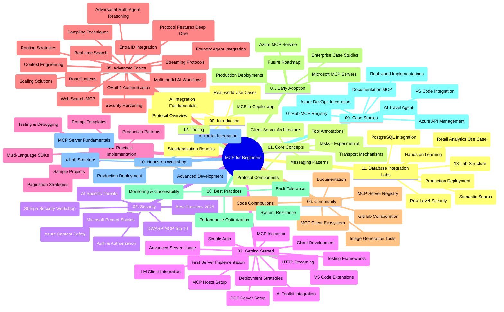

# Protokol modelnega konteksta (MCP) za začetnike - študijski vodič

Ta študijski vodič ponuja pregled strukture in vsebine repozitorija za učni načrt "Protokol modelnega konteksta (MCP) za začetnike". Uporabite ta vodič za učinkovito navigacijo po repozitoriju in kar najboljše izkoristite razpoložljive vire.

## Pregled repozitorija

Protokol modelnega konteksta (MCP) je standardiziran okvir za interakcije med AI modeli in odjemalskimi aplikacijami. Prvotno ga je ustvaril Anthropic, MCP pa zdaj vzdržuje širša skupnost MCP prek uradne organizacije GitHub. Ta repozitorij zagotavlja celovit učni načrt z interaktivnimi primeri kode v C#, Javi, JavaScriptu, Pythonu in TypeScriptu, namenjen razvijalcem AI, arhitektom sistemov in programskim inženirjem.

## Vizualna karta učnega načrta

## Struktura repozitorija

Repozitorij je organiziran v dvanajst glavnih razdelkov, ki se osredotočajo na različne vidike MCP:

1. **Uvod (00-Introduction/)**
   - Pregled protokola modelnega konteksta
   - Zakaj je standardizacija pomembna v AI potekih
   - Praktični primeri uporabe in koristi

2. **Osnovni koncepti (01-CoreConcepts/)**
   - Arhitektura odjemalec-strežnik
   - Ključne sestavine protokola
   - Vzorce za pošiljanje sporočil v MCP
   - Napovedi: [Kaj se spreminja v MCP: Kandidat za izdajo 2026-07-28](./01-CoreConcepts/mcp-2026-07-28-release-candidate.md) — jedro protokola brez stanja, okvir za razširitve ter pričakovane ukinitve Roots/Sampling/Logging v naslednji različici specifikacije

3. **Varnost (02-Security/)**
   - Varnostna tveganja v sistemih na osnovi MCP
   - Najboljše prakse za varno implementacijo
   - Strategije za preverjanje pristnosti in avtorizacijo
   - **Celovita varnostna dokumentacija**:
     - Najboljše prakse varnosti MCP 2025
     - Vodnik za izvajanje varnosti vsebine Azure
     - Nadzor in tehnike varnosti MCP
     - Hitri referenčni vodič najboljših praks MCP
   - **Ključne varnostne teme**:
     - Napadi s pozivnim injiciranjem in strupenjem orodij
     - Prevzem sej in težave z zmedeno pooblastitvijo (confused deputy)
     - Ranljivosti pri prehodu žetonov
     - Pretirano dovoljenje in nadzor dostopa
     - Varnost oskrbovalne verige za AI komponente
     - Integracija Microsoft Prompt Shields

4. **Začetek dela (03-GettingStarted/)**
   - Nastavitev in konfiguracija okolja
   - Ustvarjanje osnovnih MCP strežnikov in odjemalcev
   - Integracija z obstoječimi aplikacijami
   - Vključuje razdelke za:
     - Prva implementacija strežnika
     - Razvoj odjemalca
     - Integracija LLM odjemalca
     - Integracija v VS Code
     - Strežnik s Strežčenimi dogodki (Server-Sent Events, SSE)
     - Napredna uporaba strežnika
     - Pretakanje HTTP
     - Integracija AI orodjarne
     - Strategije testiranja
     - Priporočila za nameščanje

5. **Praktična implementacija (04-PracticalImplementation/)**
   - Uporaba SDK-jev v različnih programskih jezikih
   - Tehnike odpravljanja napak, testiranja in preverjanja
   - Oblikovanje ponovno uporabnih predlog in potekov pozivov
   - Vzorčni projekti s primeri implementacije

6. **Napredne teme (05-AdvancedTopics/)**
   - Tehnike inženiringa konteksta
   - Integracija Foundry agenta
   - Več-modalni AI poteki
   - Demonstracije preverjanja pristnosti OAuth2
   - Zmožnosti iskanja v realnem času
   - Pretakanje v realnem času
   - Implementacija Root kontekstov
   - Usmerjevalne strategije
   - Tehnike vzorčenja
   - Pristopi k skaliranju
   - Varnostni premisleki
   - Integracija varnosti Entra ID
   - Integracija spletnega iskanja
   - Protivajalno več-agentno razmišljanje (vzorce debat)

7. **Prispevki skupnosti (06-CommunityContributions/)**
   - Kako prispevati k kodi in dokumentaciji
   - Sodelovanje prek GitHub
   - Izboljšave in povratne informacije skupnosti
   - Uporaba različnih MCP odjemalcev (Claude Desktop, Cline, VSCode)
   - Delo s priljubljenimi MCP strežniki vključno s generiranjem slik

8. **Lekcije iz zgodnje uporabe (07-LessonsfromEarlyAdoption/)**
   - Implementacije v resničnem svetu in uspešne zgodbe
   - Gradnja in nameščanje rešitev na osnovi MCP
   - Trend in prihodnja razvojna pot
   - **Microsoft vodič po MCP strežnikih**: Celovit vodič po 10 proizvodno pripravljenih Microsoft MCP strežnikih, vključno z:
     - Microsoft Learn Docs MCP strežnik
     - Azure MCP strežnik (15+ specializiranih vmesnikov)
     - GitHub MCP strežnik
     - Azure DevOps MCP strežnik
     - MarkItDown MCP strežnik
     - SQL Server MCP strežnik
     - Playwright MCP strežnik
     - Dev Box MCP strežnik
     - Microsoft Foundry MCP strežnik
     - Microsoft 365 Agents Toolkit MCP strežnik

9. **Najboljše prakse (08-BestPractices/)**
   - Prilagajanje in optimizacija zmogljivosti
   - Oblikovanje MCP sistemov brez napak
   - Strategije testiranja in odpornosti

10. **Študije primerov (09-CaseStudy/)**
    - **Sedem celovitih študij primerov**, ki prikazujejo vsestranskost MCP v različnih scenarijih:
    - **Azure AI Travel Agents**: Orkestracija več agentov z Azure OpenAI in AI Iskanjem
    - **Integracija Azure DevOps**: Avtomatizacija potekov dela s posodobitvami podatkov YouTube
    - **Pridobivanje dokumentacije v realnem času**: Python konzolni odjemalec z HTTP pretakanjem
    - **Interaktivni generator učnih načrtov**: Chainlit spletna aplikacija z konverzacijskim AI
    - **Dokumentacija v urejevalniku**: Integracija VS Code z GitHub Copilot poteki
    - **Azure API Management**: Podjetniška API integracija z ustvarjanjem MCP strežnika
    - **Register MCP GitHub**: Razvoj ekosistema in platforma za agentno integracijo
    - Primeri implementacij, ki segajo od podjetniške integracije, produktivnosti razvijalcev do razvoja ekosistema

11. **Praktična delavnica (10-StreamliningAIWorkflowsBuildingAnMCPServerWithAIToolkit/)**
    - Celovita praktična delavnica, ki združuje MCP z AI Orodjarno
    - Gradnja inteligentnih aplikacij, ki povezujejo AI modele z orodji resničnega sveta
    - Praktični moduli, ki pokrivajo osnove, razvoj lastnih strežnikov in strategije produkcijskega nameščanja
    - **Struktura laboratorija**:
      - Laboratorij 1: Osnove MCP strežnika
      - Laboratorij 2: Napredni razvoj MCP strežnika
      - Laboratorij 3: Integracija AI Orodjarne
      - Laboratorij 4: Produkcijsko nameščanje in skaliranje
    - Pristop učenja na osnovi laboratorijev z navodili korak za korakom

12. **Laboratoriji za integracijo MCP strežnika z bazo podatkov (11-MCPServerHandsOnLabs/)**
    - **Celovit učni načrt s 13 laboratoriji** za gradnjo produkcijsko pripravljenih MCP strežnikov z integracijo PostgreSQL
    - **Implementacija resničnih maloprodajnih analiz** z uporabo primera Zava Retail
    - **Vzorce podjetniške ravni**, vključno z varnostjo na nivoju vrstic (RLS), semantičnim iskanjem in dostopom do več najemnikov
    - **Popolna struktura laboratorija**:
      - **Laboratoriji 00-03: Osnove** - Uvod, arhitektura, varnost, nastavitev okolja
      - **Laboratoriji 04-06: Gradnja MCP strežnika** - Oblikovanje baze podatkov, implementacija MCP strežnika, razvoj orodij
      - **Laboratoriji 07-09: Napredne funkcije** - Semantično iskanje, testiranje in odpravljanje napak, integracija VS Code
      - **Laboratoriji 10-12: Produkcija in najboljše prakse** - Namestitev, nadzor, optimizacija
    - **Uporabljene tehnologije**: okvir FastMCP, PostgreSQL, Azure OpenAI, Azure Container Apps, Application Insights
    - **Učne rezultate**: Produkcijsko pripravljeni MCP strežniki, vzorci integracije baze podatkov, analitika na osnovi AI, podjetniška varnost

13. **Orodja (12-tooling/)**
    - Naučite se, kako uporabljati MCP v aplikaciji Copilot in drugih orodjih

## Dodatni viri

Repozitorij vključuje podporne vire:

- **Mapa slik**: Vsebuje diagrame in ilustracije, uporabljene skozi učni načrt
- **Prevodi**: Podpora več jezikom z avtomatiziranimi prevodi dokumentacije
- **Uradni MCP viri**:
  - [MCP dokumentacija](https://modelcontextprotocol.io/)
  - [MCP specifikacija](https://spec.modelcontextprotocol.io/)
  - [MCP repozitorij GitHub](https://github.com/modelcontextprotocol)

## Kako uporabljati ta repozitorij

1. **Zaporedno učenje**: Sledite poglavjem po vrsti (od 00 do 11) za strukturirano učno izkušnjo.
2. **Osredotočenost na jezik**: Če vas zanima določen programski jezik, raziskujte imenike vzorcev za implementacije v izbranem jeziku.
3. **Praktična implementacija**: Začnite z razdelkom "Začetek dela" za nastavitev okolja in ustvarjanje prvega MCP strežnika in odjemalca.
4. **Napredna raziskovanja**: Ko boste obvladali osnove, se poglobite v napredne teme za širitev znanja.
5. **Vključenost skupnosti**: Pridružite se MCP skupnosti preko GitHub razprav in Discord kanalov, da se povežete s strokovnjaki in drugimi razvijalci.

## MCP odjemalci in orodja

Učni načrt pokriva različne MCP odjemalce in orodja:

1. **Uradni odjemalci**:
   - Visual Studio Code
   - MCP v Visual Studio Code
   - Claude Desktop
   - Claude v VSCode
   - Claude API

2. **Odjemalci skupnosti**:
   - Cline (na terminalu)
   - Cursor (urejevalnik kode)
   - ChatMCP
   - Windsurf

3. **Orodja za upravljanje MCP**:
   - MCP CLI
   - MCP Manager
   - MCP Linker
   - MCP Router

## Priljubljeni MCP strežniki

Repozitorij predstavlja različne MCP strežnike, med drugim:

1. **Uradni Microsoft MCP strežniki**:
   - Microsoft Learn Docs MCP strežnik
   - Azure MCP strežnik (15+ specializiranih povezovalnikov)
   - GitHub MCP strežnik
   - Azure DevOps MCP strežnik
   - MarkItDown MCP strežnik
   - SQL Server MCP strežnik
   - Playwright MCP strežnik
   - Dev Box MCP strežnik
   - Microsoft Foundry MCP strežnik
   - Microsoft 365 Agents Toolkit MCP strežnik

2. **Uradni referenčni strežniki**:
   - Datotečni sistem
   - Fetch
   - Pomnilnik
   - Zaporedno razmišljanje

3. **Generiranje slik**:
   - Azure OpenAI DALL-E 3
   - Stable Diffusion WebUI
   - Replicate

4. **Orodja za razvoj**:
   - Git MCP
   - Nadzor terminala
   - Asistent za kodo

5. **Specializirani strežniki**:
   - Salesforce
   - Microsoft Teams
   - Jira & Confluence

## Prispevanje

Ta repozitorij sprejema prispevke iz skupnosti. Oglejte si razdelek Prispevki skupnosti za navodila, kako učinkovito prispevati v ekosistem MCP.

----

*Ta študijski vodič je bil nazadnje posodobljen 5. februarja 2026, odražajoč najnovejšo MCP Specifikacijo 2025-11-25 in ponuja pregled repozitorija na ta datum. Vsebina repozitorija se lahko po tem datumu posodobi.*

*Dodatek (2. julij 2026): pod [01-CoreConcepts](./01-CoreConcepts/mcp-2026-07-28-release-candidate.md) je dodana lekcija o `2026-07-28` Kandidatu za izdajo MCP Specifikacije; osnovni učni načrt ostaja 2025-11-25 do izdaje nove specifikacije.*

---

<!-- CO-OP TRANSLATOR DISCLAIMER START -->
**Omejitev odgovornosti**:
Ta dokument je bil preveden z uporabo AI prevajalske storitve [Co-op Translator](https://github.com/Azure/co-op-translator). Čeprav si prizadevamo za natančnost, vas prosimo, da upoštevate, da avtomatizirani prevodi lahko vsebujejo napake ali netočnosti. Izvirni dokument v njegovem izvirnem jeziku je treba obravnavati kot avtoritativni vir. Za kritične informacije je priporočljiv strokovni človeški prevod. Ne odgovarjamo za morebitna nesporazume ali napačne interpretacije, ki izhajajo iz uporabe tega prevoda.
<!-- CO-OP TRANSLATOR DISCLAIMER END -->