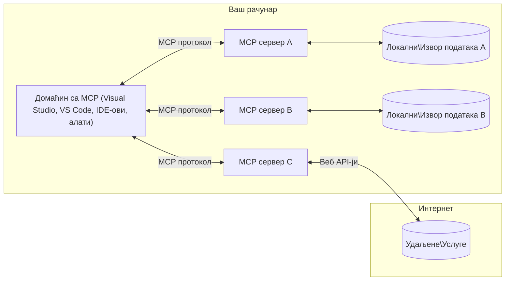

# MCP Основни Концепти: Мастеринг Протокола Контекста Модела за AI Интеграцију

[](https://youtu.be/earDzWGtE84)

_(Кликните на слику изнад да бисте погледали видео о овој лекцији)_

[Model Context Protocol (MCP)](https://github.com/modelcontextprotocol) је моћан, стандардизовани оквир који оптимизује комуникацију између Великих Језичких Модела (LLM) и екстерних алата, апликација и извора података.
Овај водич ће вас провести кроз основне концепте MCP-а. Научићете о његовој клијент-сервер архитектури, суштинским компонентама, механизмима комуникације и најбољим праксама имплементације.

- **Јасна корисничка сагласност**: Сав приступ подацима и операције захтевају изричиту корисничку дозволу пре извршења. Корисници морају јасно разумети које ће податке приступити и које радње ће бити извршене, уз грануларну контролу над дозволама и ауторизацијама.

- **Заштита приватности података**: Кориснички подаци су изложени само уз изричиту сагласност и морају бити заштићени снажним контролама приступа током целог животног циклуса интеракције. Имплементације морају спречити неовлашћени пренос података и одржавати строге границе приватности.

- **Безбедност извршења алата**: Свака активација алата захтева јасну корисничку дозволу са разумевањем функција алата, параметара и потенцијалног утицаја. Јаке безбедносне границе морају спречити нежељено, небезбедно или злонамерно извршење алата.

- **Безбедност транспортног слоја**: Сви канали комуникације треба да користе одговарајуће шифровање и механизме аутентикације. Удаљене везе треба да имплементирају безбедне транспортне протоколе и одговарајуће управљање акредитивима.

#### Упутства за имплементацију:

- **Управљање дозволама**: Имплементирати фино подешене системе дозвола који омогућавају корисницима контролу који сервери, алати и ресурси су доступни
- **Аутентификација и ауторизација**: Користити безбедне методе аутентификације (OAuth, API кључеви) са правилним управљањем токенима и истеком
- **Валидација улаза**: Проверити све параметре и улазне податке у складу са дефинисаним шемама да би се спречили инјекциони напади
- **Аудит логовање**: Одржавати комплетне записе свих операција за безбедносни надзор и усаглашеност

## Преглед

Ова лекција истражује основну архитектуру и компоненте које чине екосистем Model Context Protocol (MCP). Научићете о клијент-сервер архитектури, кључним компонентама и механизмима комуникације који покрећу MCP интеракције.

## Кључни циљеви учења

На крају ове лекције ћете:

- Разумети MCP клијент-сервер архитектуру.
- Идентификовати улоге и одговорности Домаћина, Клијената и Серверa.
- Анализирати основне карактеристике које чине MCP флексибилним слојем интеграције.
- Научити како информације протичу унутар MCP екосистема.
- Добити практичне увиде кроз примере кода у .NET, Јава, Пајтон и ЈаваСкрипт.

## MCP Архитектура: Детаљнији поглед

MCP екосистем је изграђен на клијент-сервер моделу. Ова модуларна структура омогућава AI апликацијама да ефикасно комуницирају са алатима, базама података, API-јима и контекстуалним ресурсима. Разложимо ову архитектуру на њене основне компоненте.

У срцу, MCP следи клијент-сервер архитектуру где једна апликација домаћин може да се повеже са више сервера:



- **MCP Домаћини**: Програми као што су VSCode, Claude Desktop, IDE-ови или AI алати који желе приступ подацима преко MCP
- **MCP Клијенти**: Протоколски клијенти који одржавају 1:1 везе са серверима
- **MCP Сервери**: Лагани програми који сваки пружају специфичне могућности кроз стандардизовани Model Context Protocol
- **Локални извори података**: Фајлови, базе података и сервиси вашег рачунара којима MCP сервери могу безбедно приступити
- **Удаљене услуге**: Екстерни системи доступни преко интернета којима MCP сервери могу приступити преко API-ја.

MCP Протокол је стандард у развоју који користи верзионисање засновано на датуму (формат ГГГГ-ММ-ДД). Тренутна верзија протокола је **2025-11-25**. Можете видети најновија ажурирања на [спецификацији протокола](https://modelcontextprotocol.io/specification/2025-11-25/)

> **У пракси:** кандидат за издање следеће спецификацијске верзије, **2026-07-28**, најављен је у мају 2026. и планиран за издавање 28. јула 2026. Он чини протокол бездржавним на транспортном слоју (уклања handshake `initialize` и session ID-ове), формализује оквир за додатке (Extensions) и обуставља Roots, Sampling и Logging у корист новијих обрасца. Погледајте [Шта се мења у MCP: кандидат за издање 2026-07-28](./mcp-2026-07-28-release-candidate.md) за комплетан преглед.

### 1. Домаћини

У Model Context Protocol (MCP), **Домаћини** су AI апликације које служе као примарни интерфејс преко којег корисници комуницирају са протоколом. Домаћини координирају и управљају везама према више MCP сервера креирајући посебне MCP клијенте за сваку серверску везу. Примери Домаћина укључују:

- **AI апликације**: Claude Desktop, Visual Studio Code, Claude Code
- **Развојна окружења**: IDE и уредници кода са MCP интеграцијом  
- **Прилагођене апликације**: Посебно изграђени AI агенти и алати

**Домаћини** су апликације које координишу интеракције AI модела. Они:

- **Оркестрирају AI моделе**: Извршавају или интерактују са LLM-овима да би генерисали одговоре и координисали AI токове рада
- **Управљају клијентским везама**: Креирају и одржавају по једног MCP клијента за сваку MCP сервер везу
- **Контролишу кориснички интерфејс**: Обрађују ток разговора, корисничке интеракције и приказ одговора  
- **Спроводе безбедност**: Контролишу дозволе, безбедносне ограничења и аутентификацију
- **Обрађују корисничку сагласност**: Управљају одобрењем корисника за дељење података и извршење алата


### 2. Клијенти

**Клијенти** су суштинске компоненте које одржавају посебне један-на-један везе између Домаћина и MCP сервера. Сваки MCP клијент је иницијализован од стране Домаћина да се повеже са специфичним MCP сервером, обезбеђујући организоване и безбедне канале комуникације. Више клијената омогућава Домаћинима да истовремено повежу више сервера.

**Клијенти** су конекторске компоненте у оквиру апликације домаћина. Они:

- **Протоколална комуникација**: Слање JSON-RPC 2.0 захтева серверима са упутствима и инструкцијама
- **Негoција могућности**: Проводе преговоре о подржаним функцијама и верзијама протокола са серверима током иницијализације
- **Извршење алата**: Управљају захтевима за извршење алата од модела и обрађују одговоре
- **Ажурирања у реалном времену**: Обрађују обавештења и ажурирања у реалном времену од сервера
- **Обрада одговора**: Обрађују и форматирају одговоре сервера за приказ корисницима

### 3. Сервери

**Сервери** су програми који обезбеђују контекст, алате и могућности MCP клијентима. Могу функционисати локално (на истом рачунару као и Домаћин) или удаљено (на спољашњим платформама), и одговорни су за обраду захтева клијената и пружање структурираних одговора. Сервери излазе одређену функционалност кроз стандардизовани Model Context Protocol.

**Сервери** су услуге које пружају контекст и могућности. Они:

- **Регистрација могућности**: Региструју и излажу расположиве примитиве (ресурсе, упите, алате) клијентима
- **Обрада захтева**: Пријем и извршење позива алата, захтева за ресурсе и упита клијената
- **Обезбеђење контекста**: Пружају контекстуалне информације и податке за унапређење одговора модела
- **Управљање стањем**: Одржавају стање сесије и обрађују интеракције са стањем када је потребно

- **Обавештења у реалном времену**: Слање обавештења о изменама могућности и ажурирањима повезаним клијентима

Сервере може развити било ко да прошири могућности модела са специјализованом функционалношћу, а подржавају и локалне и удаљене сценарије распоређивања.

### 4. Примитиви сервера

Сервери у Протоколу контекста модела (MCP) пружају три кључна **примитива** која дефинишу основне градивне блокове за богате интеракције између клијената, домаћина и језичких модела. Ови примитиви одређују типове контекстуалних информација и радњи доступних кроз протокол.

MCP сервери могу изложити било коју комбинацију следећа три основна примитива:

#### Ресурси

**Ресурси** су извори података који пружају контекстуалне информације AI апликацијама. Они представљају статички или динамички садржај који може побољшати разумевање модела и доношење одлука:

- **Контекстуални подаци**: Структуриране информације и контекст за коришћење AI модела
- **Базе знања**: Репозиторијуми докумената, чланци, приручници и научни радови
- **Локални извори података**: Фајлови, базе података и информације локалног система  
- **Спољни подаци**: API одговори, веб сервиси и удаљени системски подаци
- **Динамички садржај**: Подаци у реалном времену који се ажурирају у складу са спољним условима

Ресурси се идентификују URI-јевима и подржавају откривање путем метода `resources/list` и преузимање преко `resources/read`:

```text
file://documents/project-spec.md
database://production/users/schema
api://weather/current
```

#### Упитници

**Упитници** су поновљиви шаблони који помажу у структуирању интеракција са језичким моделима. Они пружају стандардиране обрасце интеракције и шаблонизоване токове рада:

- **Интеракције засноване на шаблонима**: Предструктуриране поруке и покретачи разговора
- **Шаблони тока рада**: Стандаризовани низови за уобичајене задатке и интеракције
- **Примери са мало примера**: Шаблони засновани на примерима за упутства модела
- **Системски упитници**: Основни упитници који дефинишу понашање и контекст модела
- **Динамички шаблони**: Параметризовани упитници који се прилагођавају специфичним контекстима

Упитници подржавају замене променљивих и могу се открити преко `prompts/list` и преузети са `prompts/get`:

```markdown
Generate a {{task_type}} for {{product}} targeting {{audience}} with the following requirements: {{requirements}}
```

#### Алати

**Алати** су извршне функције које AI модели могу позвати за обављање одређених радњи. Они представљају „глаголе“ MCP екосистема, омогућавајући моделима да комуницирају са спољним системима:

- **Извршне функције**: Дискретне операције које модели могу позвати са одређеним параметрима
- **Интеграција спољних система**: API позиви, упити базе података, операције са фајловима, прорачуни
- **Јединствени идентитет**: Сваки алат има јединствено име, опис и шему параметара
- **Структурирани улаз/излаз**: Алати примају верификоване параметре и враћају структуриране, типизиране одговоре
- **Могућности извршавања радњи**: Омогућавају моделима да изводе стварне радње и преузимају податке уживо

Алати се дефинишу помоћу JSON шеме за валидацију параметара и откривају се преко `tools/list` и покрећу путем `tools/call`. Алати могу такође укључивати **иконе** као додатне метаподатке за бољу презентацију у корисничком интерфејсу.

**Анотације алата**: Алати подржавају понашајне анотације (нпр. `readOnlyHint`, `destructiveHint`) које описују да ли је алат само за читање или деструктиван, помажући клијентима да доносе информисане одлуке о извршењу алата.

Пример дефиниције алата:

```typescript
server.tool(
  "search_products", 
  {
    query: z.string().describe("Search query for products"),
    category: z.string().optional().describe("Product category filter"),
    max_results: z.number().default(10).describe("Maximum results to return")
  }, 
  async (params) => {
    // Изврши претрагу и врати структуиране резултате
    return await productService.search(params);
  }
);
```

## Клијентски примитиви

У Протоколу контекста модела (MCP), **клијенти** могу излагати примитиве који омогућавају серверима да затраже додатне могућности од домаћинске апликације. Ови клијентски примитиви омогућавају богатије, интерактивније имплементације сервера које могу приступити могућностима AI модела и интеракцијама са корисницима.

### Примерковање

> **Обавештење о застаревању:** кандидат за издање `2026-07-28` означава Примерковање као застарело у корист директне интеграције са API-јевима провајдера LLM. Оно наставља да ради у `2025-11-25` и најмање годину дана након било ког застаревања, али нови дизајни треба да преферирају модел замене. Погледајте [Шта се мења у MCP: кандидат за издање 2026-07-28](./mcp-2026-07-28-release-candidate.md).

**Примерковање** омогућава серверима да затраже довршавање језичког модела из AI апликације клијента. Овај примитив омогућава серверима приступ могућностима LLM без укључивања сопствених зависности модела:

- **Приступ независан од модела**: Сервери могу тражити довршавање без укључивања LLM SDK-а или управљања приступом моделу
- **AI покренут од сервера**: Омогућава серверима аутономно генерисање садржаја користећи AI модел клијента
- **Рекурсивне LLM интеракције**: Подржава сложене сценарије у којима сервери требају AI помоћ за обраду
- **Динамичка генерисање садржаја**: Омогућава серверима да стварају контекстуалне одговоре користећи модел домаћина
- **Подршка за позивање алата**: Сервери могу укључити параметре `tools` и `toolChoice` да омогуће моделу клијента позивање алата током примерковања

Примерковање се покреће методом `sampling/complete`, где сервери шаљу захтеве за довршавање клијентима.

### Корени

> **Обавештење о застаревању:** кандидат за издање `2026-07-28` означава Корене као застареле у корист параметара алата, URI-јева ресурса или конфигурације сервера. Они настављају да раде у `2025-11-25` и најмање годину дана након било ког застаревања. Погледајте [Шта се мења у MCP: кандидат за издање 2026-07-28](./mcp-2026-07-28-release-candidate.md).

**Корени** пружају стандардирани начин за изложеност граница фајл система клијентима серверима, помажући серверима да разумеју на које директоријуме и фајлове имају приступ:

- **Границе фајл система**: Дефинишу границе где сервери могу да делују унутар фајл система
- **Контрола приступа**: Помажу серверима да разумеју којим директоријумима и фајловима имају дозволу за приступ
- **Динамичка ажурирања**: Клијенти могу обавештавати сервере када се листа корена промени
- **Идентификација заснована на URI-ју**: Корени користе `file://` URI-је за идентификовање приступачних директоријума и фајлова

Корени се откривају методом `roots/list`, а клијенти шаљу `notifications/roots/list_changed` када се корени промене.

### Испитивање  

**Испитивање** омогућава серверима да затраже додатне информације или потврду од корисника кроз интерфејс клијента:

- **Захтеви за унос корисника**: Сервери могу тражити додатне информације када су потребне за извршење алата
- **Дијалози за потврду**: Захтевају одобрење корисника за осетљиве или значајне операције
- **Интерактивни токови рада**: Омогућавају серверима да креирају корак-по-корак корисничке интеракције
- **Динамичко прикупљање параметара**: Прикупљају недостајуће или опционе параметре током извршења алата

Захтеви за испитивање се врше помоћу методе `elicitation/request` за прикупљање уноса корисника преко интерфејса клијента.

**Режим испитивања са URL-јем**: Сервери такође могу да захтевају интеракције са корисницима засноване на URL-јевима, омогућавајући серверима да усмеравају кориснике на спољне веб странице за аутентификацију, потврду или унос података.

### Логовање


> **Обавештење о застаревању:** кандидат за издање `2026-07-28` означава Логовање као застарело у корист `stderr` за stdio транспорте и OpenTelemetry за структурисану посматрачност. Настаје да ради у верзији `2025-11-25` и најмање годину дана након било ког застаревања. Погледајте [Шта се мења у MCP: Кандидат за издање 2026-07-28](./mcp-2026-07-28-release-candidate.md).

**Логовање** омогућава серверима да шаљу структурисане лог поруке клијентима за отклањање грешака, праћење и оперативну видљивост:

- **Подршка за отклањање грешака**: Омогућава серверима да пруже детаљне евиденције извршења за решавање проблема
- **Оперативно праћење**: Шаље обавештења о статусу и метрике перформанси клијентима
- **Извештавање о грешкама**: Пружа детаљан контекст грешака и дијагностичке информације
- **Ревизионе стазе**: Креира свеобухватне записе рада и одлука сервера

Лог поруке се шаљу клијентима како би се омогућила транспарентност у раду сервера и олакшало решавање грешака.

## Проток информација у MCP

Протокол контекста модела (MCP) дефинише структуриран проток информација између домаћина, клијената, сервера и модела. Разумевање овог протока помаже у појашњењу како се кориснички захтеви обрађују и како се спољни алати и подаци интегришу у одговоре модела.

- **Домаћин иницира везу**  
  Апликација домаћина (нпр. IDE или интерфејс за ћаскање) успоставља везу ка MCP серверу, обично преко STDIO, WebSocket-а или другог подржаног транспорта.

- **Неговање могућности**  
  Клијент (уграђен у домаћина) и сервер размењују информације о подржаним функцијама, алатима, ресурсима и верзијама протокола. Ово обезбеђује да обе стране разумеју које су могућности доступне за сесију.

- **Кориснички захтев**  
  Корисник комуницира са домаћином (нпр. уноси упит или команду). Домаћин прикупља овај унос и прослеђује га клијенту на обраду.

- **Коришћење ресурса или алата**  
  - Клијент може затражити додатни контекст или ресурсе од сервера (као што су фајлови, уноси у бази података или чланци из базе знања) да обогати разумевање модела.
  - Ако модел утврди да је алат потребан (нпр. за преузимање података, израду прорачуна или позив API-ја), клијент шаље захтев за позив алата серверу, наводећи име алата и параметре.

- **Извршење на серверу**  
  Сервер прими захтев за ресурс или алат, изврши потребне операције (као што је покретање функције, упит базе података или преузимање фајла), и враћа резултате клијенту у структурисаном формату.

- **Генерисање одговора**  
  Клијент интегрише одговоре сервера (податке ресурса, излазе алата итд.) у тренутну интеракцију са моделом. Модел користи ове информације да генерише свеобухватан и контекстуално релевантан одговор.

- **Презентација резултата**  
  Домаћин прими коначни излаз од клијента и представља га кориснику, често укључујући и текст генерисан од стране модела и резултате извршења алата или претрага ресурса.

Овај проток омогућава MCP да подржи напредне, интерактивне и контекстуално свесне AI апликације повезујући моделе са спољним алатима и изворима података на беспрекоран начин.

## Архитектура и слојеви протокола

MCP се састоји од два јасно раздвојена архитектонска слоја која заједно пружају комплетан комуникациони оквир:

### Слој података

**Слој података** имплементира основни MCP протокол користећи **JSON-RPC 2.0** као основу. Овај слој дефинише структуру порука, семантику и образце интеракције:

#### Основне компоненте:

- **JSON-RPC 2.0 протокол**: Цела комуникација користи стандардизовани формат порука JSON-RPC 2.0 за позиве метода, одговоре и нотификације
- **Управљање животним циклусом**: Руководи иницијализацијом везе, неговањем могућности и прекидом сесије између клијената и сервера
- **Серверске примитиве**: Омогућава серверима да пруже основну функционалност преко алата, ресурса и упита
- **Клијентске примитиве**: Омогућава серверима да захтевају узорковање из LLM, терају унос корисника и шаљу лог поруке
- **Нотификације у реалном времену**: Подржава асинхроне обавештења за динамичке измене без потребе за сталним упитима

#### Кључне карактеристике:

- **Неговање верзије протокола**: Користи верзионисање засновано на датуму (ГГГГ-ММ-ДД) како би се обезбедила компатибилност
- **Откривање могућности**: Клијенти и сервери размењују информације о подржаним функцијама током иницијализације
- **Сесије са статусом**: Одржава стање везе кроз више интеракција ради континуитета контекста

### Транспортни слој

**Транспортни слој** управља комуникационим каналима, форматирањем порука и аутентификацијом између MCP учесника:

#### Подржани транспортни механизми:

1. **STDIO транспорт**:
   - Користи стандардне улазно/излазне токове за директну процесну комуникацију
   - Оптималан за локалне процесе на истој машини без мрежног оптерећења
   - Често се користи за локалне MCP серверске имплементације

2. **Стримујући HTTP транспорт**:
   - Користи HTTP POST за поруке од клијента ка серверу  
   - Опционо Server-Sent Events (SSE) за стримовање од сервера ка клијенту
   - Омогућава комуникацију са удаљеним серверима преко мреже
   - Подржава стандардну HTTP аутентификацију (bearer токени, API кључеви, прилагођени хедери)
   - MCP препоручује OAuth за безбедну аутентификацију засновану на токенима

#### Абстракција транспорта:

Транспортни слој апстрахује детаље комуникације од слоја података, омогућавајући исти JSON-RPC 2.0 формат порука за све транспортне механизме. Ова апстракција омогућава апликацијама да лако пребаце локалне и удаљене сервере.

### Безбедносне разматрања

MCP имплементације морају поштовати неколико критичних безбедносних принципа како би осигурале безбедне, поуздане и сигурне интеракције у свим операцијама протокола:

- **Кориснички пристанак и контрола**: Корисници морају јасно дати пристанак пре него што било који податак буде приступљен или операције извршене. Треба да имају јасну контролу над тим који подаци се деле и које акције су одобрени, подржано интуитивним корисничким интерфејсима за преглед и одобравање активности.

- **Приватност података**: Кориснички подаци се могу открити само уз изричити пристанак и морају бити заштићени одговарајућом контролом приступа. MCP имплементације морају спречавати неовлашћен пренос података и осигурати да приватност буде очувана у току свих интеракција.

- **Сигурност алата**: Пре покретања било ког алата потребан је изричити кориснички пристанак. Корисници треба да имају јасно разумевање сваке функције алата, а морају бити спроведене јаке безбедносне границе како би се спречило ненамерно или несигурно извршење алата.

Поштовањем ових безбедносних принципа, MCP обезбеђује поверење корисника, приватност и безбедност кроз све интеракције протокола, истовремено омогућавајући моћне AI интеграције.

## Примери кода: Кључне компоненте

Испод су примери кода на неколико популарних програмских језика који илуструју како имплементирати кључне компоненте MCP сервера и алата.

### Пример .NET: Креирање једноставног MCP сервера са алатима

Ово је практичан .NET пример кода који показује како имплементирати једноставан MCP сервер са прилагођеним алатима. Пример показује како дефинисати и регистровати алате, руковати захтевима и повезати сервер користећи Протокол контекста модела.

```csharp
using System;
using System.Threading.Tasks;
using ModelContextProtocol.Server;
using ModelContextProtocol.Server.Transport;
using ModelContextProtocol.Server.Tools;

public class WeatherServer
{
    public static async Task Main(string[] args)
    {
        // Create an MCP server
        var server = new McpServer(
            name: "Weather MCP Server",
            version: "1.0.0"
        );
        
        // Register our custom weather tool
        server.AddTool<string, WeatherData>("weatherTool", 
            description: "Gets current weather for a location",
            execute: async (location) => {
                // Call weather API (simplified)
                var weatherData = await GetWeatherDataAsync(location);
                return weatherData;
            });
        
        // Connect the server using stdio transport
        var transport = new StdioServerTransport();
        await server.ConnectAsync(transport);
        
        Console.WriteLine("Weather MCP Server started");
        
        // Keep the server running until process is terminated
        await Task.Delay(-1);
    }
    
    private static async Task<WeatherData> GetWeatherDataAsync(string location)
    {
        // This would normally call a weather API
        // Simplified for demonstration
        await Task.Delay(100); // Simulate API call
        return new WeatherData { 
            Temperature = 72.5,
            Conditions = "Sunny",
            Location = location
        };
    }
}

public class WeatherData
{
    public double Temperature { get; set; }
    public string Conditions { get; set; }
    public string Location { get; set; }
}
```

### Пример у Јави: MCP серверске компоненте

Овај пример демонстрира исти MCP сервер и регистрацију алата као горњи .NET пример, али имплементиран у Јави.

```java
import io.modelcontextprotocol.server.McpServer;
import io.modelcontextprotocol.server.McpToolDefinition;
import io.modelcontextprotocol.server.transport.StdioServerTransport;
import io.modelcontextprotocol.server.tool.ToolExecutionContext;
import io.modelcontextprotocol.server.tool.ToolResponse;

public class WeatherMcpServer {
    public static void main(String[] args) throws Exception {
        // Креирај MCP сервер
        McpServer server = McpServer.builder()
            .name("Weather MCP Server")
            .version("1.0.0")
            .build();
            
        // Региструј алат за временску прогнозу
        server.registerTool(McpToolDefinition.builder("weatherTool")
            .description("Gets current weather for a location")
            .parameter("location", String.class)
            .execute((ToolExecutionContext ctx) -> {
                String location = ctx.getParameter("location", String.class);
                
                // Преузми податке о времену (поједностављено)
                WeatherData data = getWeatherData(location);
                
                // Врати форматирани одговор
                return ToolResponse.content(
                    String.format("Temperature: %.1f°F, Conditions: %s, Location: %s", 
                    data.getTemperature(), 
                    data.getConditions(), 
                    data.getLocation())
                );
            })
            .build());
        
        // Повежи сервер користећи стдио транспорт
        try (StdioServerTransport transport = new StdioServerTransport()) {
            server.connect(transport);
            System.out.println("Weather MCP Server started");
            // Одржи сервер активним док се процес не заврши
            Thread.currentThread().join();
        }
    }
    
    private static WeatherData getWeatherData(String location) {
        // Имплементација би позвала API за временску прогнозу
        // Пojедностављено у сврху примера
        return new WeatherData(72.5, "Sunny", location);
    }
}

class WeatherData {
    private double temperature;
    private String conditions;
    private String location;
    
    public WeatherData(double temperature, String conditions, String location) {
        this.temperature = temperature;
        this.conditions = conditions;
        this.location = location;
    }
    
    public double getTemperature() {
        return temperature;
    }
    
    public String getConditions() {
        return conditions;
    }
    
    public String getLocation() {
        return location;
    }
}
```

### Python пример: Изградња MCP сервера

Овај пример користи fastmcp, зато га прво инсталирајте:

```python
pip install fastmcp
```
Code Sample:

```python
#!/usr/bin/env python3
import asyncio
from fastmcp import FastMCP
from fastmcp.transports.stdio import serve_stdio

# Креирајте FastMCP сервер
mcp = FastMCP(
    name="Weather MCP Server",
    version="1.0.0"
)

@mcp.tool()
def get_weather(location: str) -> dict:
    """Gets current weather for a location."""
    return {
        "temperature": 72.5,
        "conditions": "Sunny",
        "location": location
    }

# Алтернативни приступ коришћењем класе
class WeatherTools:
    @mcp.tool()
    def forecast(self, location: str, days: int = 1) -> dict:
        """Gets weather forecast for a location for the specified number of days."""
        return {
            "location": location,
            "forecast": [
                {"day": i+1, "temperature": 70 + i, "conditions": "Partly Cloudy"}
                for i in range(days)
            ]
        }

# Региструјте класне алате
weather_tools = WeatherTools()

# Покрените сервер
if __name__ == "__main__":
    asyncio.run(serve_stdio(mcp))
```

### JavaScript пример: Креирање MCP сервера

Овај пример показује креирање MCP сервера у JavaScript-у и како регистровати два алата повезана са временом.

```javascript
// Користећи званични Model Context Protocol SDK
import { McpServer } from "@modelcontextprotocol/sdk/server/mcp.js";
import { StdioServerTransport } from "@modelcontextprotocol/sdk/server/stdio.js";
import { z } from "zod"; // За проверу параметара

// Креирај MCP сервер
const server = new McpServer({
  name: "Weather MCP Server",
  version: "1.0.0"
});

// Дефиниши алат за временску прогнозу
server.tool(
  "weatherTool",
  {
    location: z.string().describe("The location to get weather for")
  },
  async ({ location }) => {
    // Ово би обично позивало временски API
    // Поједностављено за демонстрацију
    const weatherData = await getWeatherData(location);
    
    return {
      content: [
        { 
          type: "text", 
          text: `Temperature: ${weatherData.temperature}°F, Conditions: ${weatherData.conditions}, Location: ${weatherData.location}` 
        }
      ]
    };
  }
);

// Дефиниши алат за прогнозу
server.tool(
  "forecastTool",
  {
    location: z.string(),
    days: z.number().default(3).describe("Number of days for forecast")
  },
  async ({ location, days }) => {
    // Ово би обично позивало временски API
    // Поједностављено за демонстрацију
    const forecast = await getForecastData(location, days);
    
    return {
      content: [
        { 
          type: "text", 
          text: `${days}-day forecast for ${location}: ${JSON.stringify(forecast)}` 
        }
      ]
    };
  }
);

// Помоћне функције
async function getWeatherData(location) {
  // Симулирај позив API-ја
  return {
    temperature: 72.5,
    conditions: "Sunny",
    location: location
  };
}

async function getForecastData(location, days) {
  // Симулирај позив API-ја
  return Array.from({ length: days }, (_, i) => ({
    day: i + 1,
    temperature: 70 + Math.floor(Math.random() * 10),
    conditions: i % 2 === 0 ? "Sunny" : "Partly Cloudy"
  }));
}

// Повежи сервер користећи stdio транспорт
const transport = new StdioServerTransport();
server.connect(transport).catch(console.error);

console.log("Weather MCP Server started");
```

Овај JavaScript пример показује како креирати MCP сервер користећи Model Context Protocol SDK. Приказује како регистровати два алата под именом `weatherTool` и `forecastTool` и учинити их доступним MCP клијентима преко `StdioServerTransport`.

## Безбедност и ауторизација

MCP садржи неколико уграђених концепата и механизама за управљање безбедношћу и ауторизацијом кроз цео протокол:

1. **Контрола дозвола за алате**:  
  Клијенти могу одредити које алате модел сме користити током сесије. Ово осигурава да су приступачни само изричито одобрени алати, смањујући ризик од ненамерних или несигурних операција. Дозволе могу бити динамички подешаване у складу са корисничким преференцама, организационим политикама или контекстом интеракције.

2. **Аутентификација**:  
  Сервери могу тражити аутентификацију пре него што одобре приступ алатима, ресурсима или осетљивим операцијама. Ово може укључивати API кључеве, OAuth токене или друге шеме аутентификације. Исправна аутентификација осигурава да само поуздани клијенти и корисници могу покретати серверске могућности.

3. **Валидација**:  
  Валидација параметара се спроводи за све позиве алата. Сваки алат дефинише очекиване типове, формате и ограничења својих параметара, а сервер проверава долазне захтеве у складу са тим. Ово спречава неисправне или злонамерне уносе да стигну до имплементација алата и помаже у очувању интегритета операција.

4. **Ограничење брзине (rate limiting)**:  
  Да би се спречиле злоупотребе и обезбедила фер употреба серверских ресурса, MCP сервери могу имплементирати ограничења брзине за позиве алата и приступ ресурсима. Ограничења могу бити по кориснику, по сесији или глобално, и помажу у заштити од напада онемогућавања услуге или претеране потрошње ресурса.

Комбиновањем ових механизама, MCP пружа сигурну основу за интеграцију језичких модела са спољним алатима и изворима података, омогућавајући корисницима и програмерима прецизну контролу приступа и употребе.

## Поруке протокола и проток комуникације

MCP комуникација користи структуриранe **JSON-RPC 2.0** поруке за олакшавање јасних и поузданих интеракција између домаћина, клијената и сервера. Протокол дефинише специфичне обрасце порука за различите типове операција:

### Основни типови порука:

#### **Поруке инициализације**
- **`initialize` захтев**: Успоставља везу и негује верзију протокола и могућности
- **`initialize` одговор**: Потврђује подржане функције и информације о серверу  
- **`notifications/initialized`**: Сигнализира да је иницијализација завршена и да је сесија спремна

#### **Поруке откривања**
- **`tools/list` захтев**: Открива доступне алате на серверу
- **`resources/list` захтев**: Листира доступне ресурсе (изворе података)
- **`prompts/list` захтев**: Преузима доступне шаблоне упита

#### **Поруке извршења**  
- **`tools/call` захтев**: Извршава одређени алат са датим параметрима
- **`resources/read` захтев**: Преузима садржај одређеног ресурса
- **`prompts/get` захтев**: Преузима шаблон упита са опционим параметрима

#### **Поруке на страни клијента**
- **`sampling/complete` захтев**: Сервер тражи LLM комплетирање од клијента
- **`elicitation/request`**: Сервер тражи кориснички унос кроз клијентски интерфејс
- **Поруке логовања**: Сервер шаље структурисане лог поруке клијенту

#### **Нотификационе поруке**
- **`notifications/tools/list_changed`**: Сервер обавештава клијента о изменама алата
- **`notifications/resources/list_changed`**: Сервер обавештава клијента о изменама ресурса  
- **`notifications/prompts/list_changed`**: Сервер обавештава клијента о изменама упита

### Структура поруке:

Све MCP поруке прате JSON-RPC 2.0 формат са:
- **Захтевним порукама**: Садрже `id`, `method` и опционалне `params`
- **Одговорним порукама**: Садрже `id` и или `result` или `error`  
- **Нотификационим порукама**: Садрже `method` и опционалне `params` (нема `id` и одговор није очекиван)

Ова структура комуникације обезбеђује поуздане, траживе и прошириве интеракције које подржавају напредне сценарије као што су ажурирања у реалном времену, ланци алата и робусно руковање грешкама.

### Задаци (експериментално)

> **Гледајући унапред:** кандидат за издање `2026-07-28` избацује Задаке из експерименталног језгра спецификације у посебан додатак за Задаке са редизајнираним животним циклусом (`tasks/get`, `tasks/update`, `tasks/cancel`; `tasks/list` је уклоњен). Ако градите на основи експерименталног API-а описаног испод, планирајте миграцију. Погледајте [Шта се мења у MCP: Кандидат за издање 2026-07-28](./mcp-2026-07-28-release-candidate.md).

**Задаци** су експериментална функција која пружа поуздане омотаче за извршење, омогућавајући одложено преузимање резултата и праћење статуса MCP захтева:

- **Дугачке операције**: Праћење скупих прорачуна, аутоматизације токова рада и пакет обработке
- **Одложени резултати**: Поруџбина статуса задатка и преузимање резултата када се операције заврше
- **Праћење статуса**: Контрола напретка задатка кроз дефинисане стадијуме животног циклуса
- **Вишестепене операције**: Подршка сложеним токовима рада који се протежу преко више интеракција

Задаци омотавају стандардне MCP захтеве како би омогућили асинхроне обрасце извршења за операције које не могу бити одмах завршене.

## Кључне поуке

- **Архитектура**: MCP користи клијент-сервер архитектуру где домаћини управљају више веза клијената ка серверима
- **Учесници**: Еко-систем обухвата домаћине (AI апликације), клијенте (повезнике протокола) и сервере (пружиоце могућности)
- **Транспортни механизми**: Комуникација подржава STDIO (локално) и Стримујући HTTP са опционалним SSE (удалјено)
- **Основне примитиве**: Сервери излажу алате (извршне функције), ресурсе (изворе података) и упите (образце)
- **Клијентске примитиве**: Сервери могу тражити узорковање (LLM комплетирања са подршком за позив алата), елицирање (кориснички унос укључујући режим URL-а), корене (границе фајл система) и логовање од клијената
- **Експерименталне функције**: Задаци пружају поуздане омотаче за дуготрајне операције
- **Ослоне на протокол**: Изграђен на JSON-RPC 2.0 са верзионисањем по датуму (тренутно: 2025-11-25)
- **Капацитети у реалном времену**: Подржава нотификације за динамичка ажурирања и синхронизацију у реалном времену
- **Безбедност на првом месту**: Јасан кориснички пристанак, заштита приватности података и безбедан транспорт су основни захтеви

## Вежба

Дизајнирајте једноставан MCP алат који би био користан у вашој области. Дефинишите:
1. Како би се алат звао
2. Које параметре би прихватао
3. Који би излаз враћао
4. Како би модел могао користити овај алат за решавање корисничких проблема


---

## Шта следи

Следеће: [Поглавље 2: Безбедност](../02-Security/README.md)


Радознали сте шта долази након `2025-11-25`? Прочитајте [Шта се мења у MCP: Кандидат за издање 2026-07-28](./mcp-2026-07-28-release-candidate.md).

---

<!-- CO-OP TRANSLATOR DISCLAIMER START -->
**Изјава о одрицању одговорности**:
Овај документ је преведен коришћењем услуге за аутоматски превод [Co-op Translator](https://github.com/Azure/co-op-translator). Иако тежимо тачности, имајте у виду да аутоматски преводи могу садржати грешке или нетачности. Оригинални документ на његовом изворном језику треба сматрати ауторитативним извором. За критичне информације препоручује се професионални људски превод. Нисмо одговорни за било каква неспоразума или погрешна тумачења која произилазе из коришћења овог превода.
<!-- CO-OP TRANSLATOR DISCLAIMER END -->