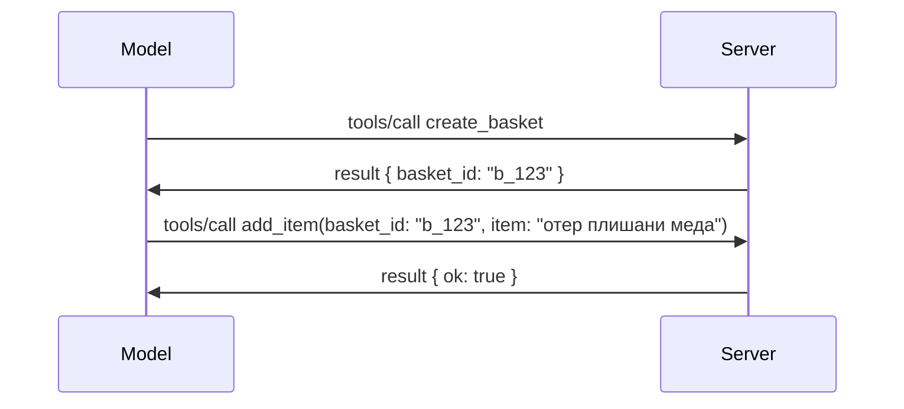

# Шта се мења у MCP: Кандидат за издање 2026-07-28

> **Статус:** Кандидат за издање. Спецификација `2026-07-28` није коначна у тренутку писања. Објављена је 21. маја 2026. и планирана је за пуштање 28. јула 2026. Све што је описано у овој лекцији односи се на кандидата за издање; проверите [нацрт спецификације](https://modelcontextprotocol.io/specification/draft) и њен [преглед измена](https://modelcontextprotocol.io/specification/draft/changelog) за најновији статус пре него што почнете са развојем. Остатак овог курикулума написан је за постојећу стабилну верзију, **MCP Спецификација 2025-11-25**, и биће ажуриран када `2026-07-28` буде објављен.

## Преглед

`2026-07-28` је највећа ревизија MCP-а од његовог покретања. Шест Предлога за унапређење Спецификације (SEPs) укидају сесије на нивоу протокола и чине MCP бездржавним на слоју транспорта, екстензије постају првокласни, верзиони механизам, а неколико функција које сте раније учили у овом курикулуму (Роотс, Самплинг, Логовање) се сада сматрају застарелим у складу са новом политиком животног циклуса. Ова лекција резимира шта се мења, зашто је то важно и шта то значи за код који сте већ написали за `2025-11-25`.

Извор: [Кандидат за издање MCP спецификације 2026-07-28](https://blog.modelcontextprotocol.io/posts/2026-07-28-release-candidate/) (Модел Контекст Протокол блог, Давид Сориа Парра и Ден Делимарски).

## Циљеви учења

На крају ове лекције, моћи ћете:

- Објаснити зашто MCP прелази на бездржавни протокол и који проблем то решава код хоризонтално скалабилних распореда.
- Описати како су замењени `initialize`/`initialized` „поздрав“ и заглавље `Mcp-Session-Id`.
- Препознати нова заглавља `Mcp-Method` и `Mcp-Name` као и метаподатке кеширања `ttlMs`/`cacheScope`.
- Упознати се са оквиром за екстензије и две екстензије које излазе са овим издањем: MCP Апликације и Задатке.
- Навести шест SEP-ова за ауторизацију који ојачавају поравнање са OAuth 2.0 / OIDC.
- Идентификовати која су језграна својства (Роотс, Самплинг, Логовање) сада застарела и шта то практично значи.
- Објаснити промену Фулл JSON Схеме 2020-12 за `inputSchema`/`outputSchema` алатке.

## Бездржавни протокол

Главна промена: MCP постаје бездржаван на нивоу протокола.

### Пре (2025-11-25): сесије вас обавезују на један серверски инстанс

Позив алата преко Стримабл HTTP-а почиње са `initialize` поздравом. Сервер одговара заглављем `Mcp-Session-Id` које сваки наредни захтев мора да носи:

```http
POST /mcp HTTP/1.1
Mcp-Session-Id: 1868a90c-3a3f-4f5b
Content-Type: application/json

{"jsonrpc":"2.0","id":2,"method":"tools/call",
 "params":{"name":"search","arguments":{"q":"otters"}}}
```

Због везаности сесије за серверски инстанс који ју је издао, хоризонтално скалиране имплементације захтевају **лепљиво усмеравање** на балансеру оптерећења и **заједничко складиште сесија** међу инстансима.

### После (2026-07-28): сваки захтев је самосталан

```http
POST /mcp HTTP/1.1
MCP-Protocol-Version: 2026-07-28
Mcp-Method: tools/call
Mcp-Name: search
Content-Type: application/json

{"jsonrpc":"2.0","id":1,"method":"tools/call",
 "params":{"name":"search","arguments":{"q":"otters"},
           "_meta":{"io.modelcontextprotocol/clientInfo":{"name":"my-app","version":"1.0"}}}}
```

Сваки серверски инстанс може обрадити овај захтев. Кључне промене:

- **Укидан је поздрав `initialize`/`initialized`** ([SEP-2575](https://github.com/modelcontextprotocol/modelcontextprotocol/pull/2575)). Верзија протокола, подаци о клијенту и могућности клијента прелазе у `_meta` на сваком захтеву. Нова метода `server/discover` омогућава клијенту да унапред преузме могућности сервера када су му потребне.
- **Укинуто је заглавље `Mcp-Session-Id` и сесије на нивоу протокола** ([SEP-2567](https://github.com/modelcontextprotocol/modelcontextprotocol/pull/2567)). Лепљиво усмеравање и заједничка складишта сесија више нису потребни на нивоу протокола.

### Бездржавни протокол, подржавајуће апликације

Укидање сесије на нивоу протокола не значи да ваш сервер не може да буде државан. Препоручени образац је исти који су HTTP API-ји увек користили: из једног позива алата узмите експлицитни идентификатор (нпр. `basket_id`, `browser_id`) и прођите тај идентификатор као обичан аргумент у каснијим позивима.



Ово чини државу видљивом и разумљивом моделу уместо да се крије у метаподацима транспорта, и омогућава било ком серверском инстансу да обради било који позив.

### Захтеви од сервера ка клијенту, реструктурирани

Бездржавни протокол и даље треба начин да сервер затражи нешто од клијента у току позива (нпр. упит за артикулацију):

- **Захтеви које иницира сервер могу се послати само док сервер активно обрађује захтев клијента** ([SEP-2260](https://github.com/modelcontextprotocol/modelcontextprotocol/pull/2260)) — раније препорука, сада обавеза. Корисник никада није изненада упитан.
- **Мулти Роунд-Трип захтеви** ([SEP-2322](https://github.com/modelcontextprotocol/modelcontextprotocol/pull/2322)) замењују држање овог ССЕ стрима отвореним. Уместо тога, сервер враћа `InputRequiredResult`:

  ```json
  {
    "resultType": "inputRequired",
    "inputRequests": {
      "confirm": {
        "type": "elicitation",
        "message": "Delete 3 files?",
        "schema": { "type": "boolean" }
      }
    },
    "requestState": "eyJzdGVwIjoxLCJmaWxlcyI6WyJhIiwiYiIsImMiXX0="
  }
  ```

Клијент прикупља одговоре и поново шаље оригинални позив са `inputResponses` плус истом `requestState`. Било који серверски инстанс може преузети покушај поново јер је све што је потребно у подацима.

### Усмерљиво, кеширајуће, трасирајуће

Три мање промене олакшавају рад са бездржавним саобраћајем:

- **Заглавља `Mcp-Method` и `Mcp-Name` су обавезна на Стримабл HTTP-у** ([SEP-2243](https://github.com/modelcontextprotocol/modelcontextprotocol/pull/2243)) да би балансери оптерећења, шлюзи и ограничивачи брзине могли усмеравати операције без читања JSON тела. Сервери одбијају захтеве у којима се заглавља и тело не слажу.
- **`tools/list` и резултати читања ресурса садрже `ttlMs` и `cacheScope`** ([SEP-2549](https://github.com/modelcontextprotocol/modelcontextprotocol/pull/2549)), моделирано по HTTP `Cache-Control`. Клијенти знају колико је листа свежа и да ли је безбедно делити је између корисника, без потребе за дуготрајним ССЕ стримом за разматрање промена.
- **Пропагација W3C Траце Цонтеекта у `_meta` је документована** ([SEP-414](https://github.com/modelcontextprotocol/modelcontextprotocol/pull/414)), исправљајући кључне називе `traceparent`, `tracestate` и `baggage` како би се дистрибуирани траг могао пратити кроз SDK клијента, MCP сервер и спољне системе у позадини компатибилној са [OpenTelemetry](https://opentelemetry.io/).

## Екстензије постају првокласне

Екстензије су формално постојале у `2025-11-25`. [SEP-2133](https://github.com/modelcontextprotocol/modelcontextprotocol/pull/2133) их формализује:

- Екстензије се идентификују по обрнутим DNS ИД-овима.
- Комуницирају се кроз мапу `extensions` у могућностима клијента и сервера.
- Налазе се у својим `ext-*` репозиторијумима са делегираним одржаваоцима и верзионирају се независно од језгра спецификације.
- Нови стаза у SEP процесу омогућава им напредовање од експерименталних до званичних.

Ово издање садржи две званичне екстензије.

### MCP Апликације: серверски приказани кориснички интерфејси

[MCP Апликације](https://blog.modelcontextprotocol.io/posts/2026-01-26-mcp-apps/) ([SEP-1865](https://github.com/modelcontextprotocol/modelcontextprotocol/pull/1865)) омогућавају серверима да испоручују интерактивне HTML интерфејсе које домаћини приказују у песковитом iframe-у. Алати декларишу своје UI шаблоне унапред да домаћини могу да их преузму, кеширају и безбедносно прегледају пре покретања. Основе овога сте већ учили у [Лекцији 15: MCP Апликације](../03-GettingStarted/15-mcp-apps/README.md) — под оквиром екстензија, MCP Апликације су сада формално екстензија уместо експерименталне језгра функције.

### Задатци постају екстензија

Задатци су били експериментална језграна функција у `2025-11-25`. Производна употреба је указала на потребу за поновним дизајном и њихово право место је као екстензија: [Tasks екстензија](https://github.com/modelcontextprotocol/modelcontextprotocol/pull/2663) мења животни циклус око бездржавног модела — сервер може одговорити на `tools/call` задатком, а клијент га управља путем `tasks/get`, `tasks/update` и `tasks/cancel`. Креирање задатака је усмерено од стране сервера: клијент оглашава екстензију, а сервер одлучује када позив треба да буде покренут као задатак. `tasks/list` је у потпуности уклоњен јер се не може безбедно ограничити без сесија.

> **Напомена о миграцији:** ако сте имплементирали експериментални API задатака из `2025-11-25`, мораћете да мигрирате на нови животни циклус екстензије — није уназад компатибилан.

## Ојачавање ауторизације

Шест SEP-ова ојачавају [спецификацију ауторизације](https://modelcontextprotocol.io/specification/draft/basic/authorization) у складу са реалним OAuth 2.0 / OpenID Connect распоредом:

| SEP | Промена |
|---|---|
| [SEP-2468](https://github.com/modelcontextprotocol/modelcontextprotocol/pull/2468) | Клијенти морају да проверавају `iss` параметар у одговорима ауторизације према [RFC 9207](https://www.rfc-editor.org/rfc/rfc9207), спречавајући нападе мешања који су чест у MCP-овом моделу један клијент, више сервера. Будућа верзија ће захтевати одбацивање одговора без `iss`. |
| [SEP-837](https://github.com/modelcontextprotocol/modelcontextprotocol/pull/837) | Клијенти декларишу `application_type` током Dynamic Client Registration, избегавајући да сервери ауторизације подразумевано постављају десктоп/CLI клијента као `"web"` и одбијају његов localhost redirect URI. |
| [SEP-2352](https://github.com/modelcontextprotocol/modelcontextprotocol/pull/2352) | Клијенти везују регистроване акредитиве за `issuer` овлашћеног сервера и поновно се региструју када се ресурс помери између овлашћених сервера. |
| [SEP-2207](https://github.com/modelcontextprotocol/modelcontextprotocol/pull/2207) | Документирају како захтевати refresh token од OpenID Connect типа аутораизационих сервера. |
| [SEP-2350](https://github.com/modelcontextprotocol/modelcontextprotocol/pull/2350) | Појашњава накупљање опсега током step-up ауторизације. |
| [SEP-2351](https://github.com/modelcontextprotocol/modelcontextprotocol/pull/2351) | Појашњава `.well-known` суфикс за откривање. |

Ако данас правите ауторизациони сервер за MCP, почните сада са слањем `iss` у одговорима — погледајте [02-Security](../02-Security/README.md) за тренутне смернице ауторизације на којима ће ово бити базирано.

## Роотс, Самплинг и Логовање су застарели

По новој [политици животног циклуса функција](https://github.com/modelcontextprotocol/modelcontextprotocol/pull/2577) ([SEP-2577](https://github.com/modelcontextprotocol/modelcontextprotocol/pull/2577)), три језграна примитива клијента које сте учили у [Језграним појмовима](./README.md#roots) добијају статус **Застарело**:

| Функција | Препоручена замена |
|---|---|
| Роотс | Параметри алата, URI-ји ресурса или конфигурација сервера |
| Самплинг | Директна интеграција са LLM провајдер API-јима |
| Логовање | `stderr` за stdio транспорте; OpenTelemetry за структурисану опсервабилност |

Ово су **само депрецатион означавања**: методе, типови и заставице могућности и даље раде у овом издању и у свакој спецификационој верзији објављеној у року од годину дана од њега. Укидање било које од њих захтеваће посебан SEP у оквиру политике животног циклуса — тако да ништа неће покварити ваше постојеће узорке [Самплинга](../03-GettingStarted/14-sampling/README.md) данас, али нови сервери треба да преферирају горе наведене обрасце као замену.

## Фулл JSON Схема 2020-12 за алате

`inputSchema` и `outputSchema` алата су подигнути на пуну [JSON Схему 2020-12](https://json-schema.org/draft/2020-12) ([SEP-2106](https://github.com/modelcontextprotocol/modelcontextprotocol/pull/2106)):

- Улазне шеме задржавају ограничење типа `object` али сада дозвољавају композиције (`oneOf`, `anyOf`, `allOf`), услове и референце (`$ref`, `$defs`).
- Излазне шеме су неограничене, а `structuredContent` сада може бити било која JSON вредност, не само објекат.
- Имплементације не смеју аутоматски да разрешавају спољне `$ref` URL-ове и треба ограничити дубину шема и време валидације (због претњи од услужног одбијања сервиса ако се валидација ради на серверу).

Посебно, код грешке за недостајући ресурс се мења из MCP-сопственог `-32002` у JSON-RPC стандардни `-32602` (Погрешни параметри) ([SEP-2164](https://github.com/modelcontextprotocol/modelcontextprotocol/pull/2164)). Ако ваш клијент реагује на дословни `-32002`, потребно га је ажурирати.

## Како се протокол даље развија

Ово издање садржи промене које нарушавају уназадну компатибилност, што MCP одржаваоци не намеравају да постане правило у будућности. Три SEP-а у управљању имају за циљ да то спрече:

- **Политика животног циклуса функције** даје свакој функцији пут од Активна → Застарела → Укинута са најмање дванаест месеци између застарења и најраније могуће уклањања.
- **Оквир за екстензије** омогућава новим могућностима да ипак изађу као изборне екстензије и тамо се стабилизују пре него што (ако икада) уђу у језгро спецификације.

- SEP са стандардаским стазом више не може достићи коначни статус док се не појави одговарајући сценарио у [conformance suite](https://github.com/modelcontextprotocol/conformance) ([SEP-2484](https://github.com/modelcontextprotocol/modelcontextprotocol/pull/2484)) — истом скупу у коме [SDK tier system](https://github.com/modelcontextprotocol/modelcontextprotocol/pull/1777) оцењује званичне SDK-ове.

## Временска линија издања и валидација

- Кандидат за издање је закључан 21. маја 2026.
- Коначна спецификација је заказана за 28. јул 2026.
- Десетонедељни период између ова два омогућава одржаваоцима SDK и клијентским имплементарима да верификују измене на реалним оптерећењима; очекује се да Tier 1 SDK-ови обезбеде подршку у овом периоду у оквиру [SDK tier system](https://modelcontextprotocol.io/docs/sdk).
- Пратите цео скуп промена у [draft спецификацији](https://modelcontextprotocol.io/specification/draft) и њеном [changelog](https://modelcontextprotocol.io/specification/draft/changelog).

## Шта ово значи за овај курикулум

Све што сте до сада научили у овом курсу циља на **2025-11-25**, који остаје тренутна стабилна спецификација до изласка `2026-07-28`. Конкретно:

- **Сесије и покретачки `initialize` руковет** (обухваћени у [Core Concepts](./README.md) и [Lesson 6: HTTP Streaming](../03-GettingStarted/06-http-streaming/README.md)) и даље раде као што је данас документовано, али очекује се да ће их заменити модел бездржавних захтева када надоградите на SDK-ове компатибилне са `2026-07-28`.
- **Sampling и Roots** (такође описани у [Core Concepts](./README.md)) и даље у потпуности функционишу, али су застарели — нови дизајни треба да користе горе наведене замене.
- **Експериментална функција Tasks**, ако сте је користили, ће морати да се мигрира на нови животни циклус Tasks екстензије.
- **MCP апликације** ([Lesson 15](../03-GettingStarted/15-mcp-apps/README.md)) практично остају непромењене; једноставно се премештају у оквир формалних екстензија.

## Додатни ресурси

- [Kандидат за издање MCP спецификације 2026-07-28 (блог пост)](https://blog.modelcontextprotocol.io/posts/2026-07-28-release-candidate/)
- [Будућност MCP транспорта](https://blog.modelcontextprotocol.io/posts/2025-12-19-mcp-transport-future/)
- [Nacrt MCP спецификације](https://modelcontextprotocol.io/specification/draft)
- [Љистa промена MCP nacrta](https://modelcontextprotocol.io/specification/draft/changelog)
- [SEP смернице](https://modelcontextprotocol.io/community/sep-guidelines)
- [MCP SDK Tier систем](https://modelcontextprotocol.io/docs/sdk)

## Следећи кораци

Вратите се на [Core Concepts](./README.md) или наставите на [Security](../02-Security/README.md) да бисте видели како данашња упутства `2025-11-25` одговарају ономе што долази.

---

<!-- CO-OP TRANSLATOR DISCLAIMER START -->
**Изјава о одрицању одговорности**:
Овај документ је преведен коришћењем услуге за аутоматски превод [Co-op Translator](https://github.com/Azure/co-op-translator). Иако тежимо тачности, имајте у виду да аутоматски преводи могу садржати грешке или нетачности. Оригинални документ на његовом изворном језику треба сматрати ауторитативним извором. За критичне информације препоручује се професионални људски превод. Нисмо одговорни за било каква неспоразума или погрешна тумачења која произилазе из коришћења овог превода.
<!-- CO-OP TRANSLATOR DISCLAIMER END -->