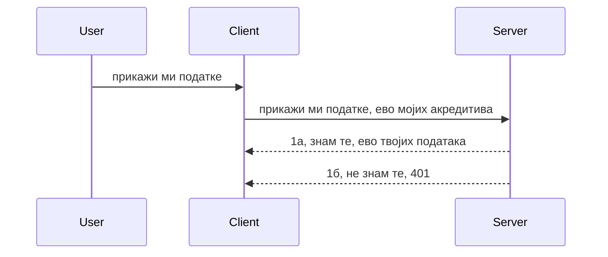

# Једноставна аутентификација

MCP SDK-ови подржавају коришћење OAuth 2.1 који је, да будемо искрени, прилично сложен процес који укључује концепте као што су аутентификациони сервер, сервер ресурса, слање акредитива, добијање кода, размена кода за носилачки токен док коначно не добијете своје податке ресурса. Ако нисте навикли на OAuth, што је сјајна ствар за имплементацију, добро је почети са неким основним нивоом аутентификације и развити бољу и сигурнију аутентификацију. Зато овај одељак постоји — да вас припреми за напреднију аутентификацију.

## Аутентификација, шта тачно мислимо?

Аутентификација је скраћеница за authentication и authorization. Идеја је да треба да урадимо две ствари:

- **Аутентификација**, што је процес провере да ли дозволити особи улазак у нашу кућу, да има право да буде "овде", односно да има приступ нашем серверу ресурса где се налазе функције нашег MCP сервера.
- **Ауторизација**, је процес провере да ли корисник треба да има приступ овим одређеним ресурсима које тражи, на пример ове поруџбине или ове производе, или да ли јој је дозвољено да чита садржај али не и да брише, као још један пример.

## Акредитиви: како систему кажемо ко смо

Па, већина веб програмера почиње да размишља у смислу давање акредитива серверу, обично тајне која каже да ли им је дозвољено овде да буду "Аутентификација". Овај акредитив је обично base64 кодирана верзија корисничког имена и лозинке или API кључ који јединствено идентификује одређеног корисника.

Ово подразумева слање преко заглавља под називом "Authorization" овако:

```json
{ "Authorization": "secret123" }
```

Ово се обично назива основна аутентификација. Како укупни ток функционише је на следећи начин:



Сада када разумемо како то функционише из угла тока, како то имплементирати? Па, већина веб сервера има концепт који се зове middleware, део кода који се извршава као део захтева који може да провери акредитиве, и ако су акредитиви валидни, омогућава да захтев прође. Ако захтев нема валидне акредитиве, добијате грешку аутентификације. Хајде да видимо како се ово може имплементирати:

**Python**

```python
class AuthMiddleware(BaseHTTPMiddleware):
    async def dispatch(self, request, call_next):

        has_header = request.headers.get("Authorization")
        if not has_header:
            print("-> Missing Authorization header!")
            return Response(status_code=401, content="Unauthorized")

        if not valid_token(has_header):
            print("-> Invalid token!")
            return Response(status_code=403, content="Forbidden")

        print("Valid token, proceeding...")
       
        response = await call_next(request)
        # додајте било какве корисничке заглавља или на неки начин измените одговор
        return response


starlette_app.add_middleware(CustomHeaderMiddleware)
```

Овде имамо:

- Креиран middleware који се зове `AuthMiddleware` у којем се позива метод `dispatch` од стране веб сервера.
- Додат middleware на веб сервер:

    ```python
    starlette_app.add_middleware(AuthMiddleware)
    ```

- Написана валидациона логика која проверава да ли заглавље Authorization постоји и да ли је послата тајна валидна:

    ```python
    has_header = request.headers.get("Authorization")
    if not has_header:
        print("-> Missing Authorization header!")
        return Response(status_code=401, content="Unauthorized")

    if not valid_token(has_header):
        print("-> Invalid token!")
        return Response(status_code=403, content="Forbidden")
    ```

    ако је тајна присутна и валидна, онда дозволимо да захтев прође позивајући `call_next` и враћамо одговор.

    ```python
    response = await call_next(request)
    # додај било које корисничке заглаве или на неки начин измене одговор
    return response
    ```

Како то функционише је да ако се направи веб захтев ка серверу, middleware ће бити позван и с обзиром на његову имплементацију, или ће пустити захтев да прође или ће вратити грешку која указује да клијент није овлашћен да настави.

**TypeScript**

Овде правимо middleware са популарним Express фрејмворком и пресрећемо захтев пре него што стигне до MCP сервера. Ево кода за то:

```typescript
function isValid(secret) {
    return secret === "secret123";
}

app.use((req, res, next) => {
    // 1. Да ли постоји Заглавље ауторизације?
    if(!req.headers["Authorization"]) {
        res.status(401).send('Unauthorized');
    }
    
    let token = req.headers["Authorization"];

    // 2. Проверите ваљаност.
    if(!isValid(token)) {
        res.status(403).send('Forbidden');
    }

   
    console.log('Middleware executed');
    // 3. Проследите захтев следећем кораку у низу обраде захтева.
    next();
});
```

У овом коду ми:

1. Проверавамо да ли је заглавље Authorization уопште присутно, ако није, шаљемо грешку 401.
2. Осигуравају да је акредитив/токен валидан, ако није шаљемо грешку 403.
3. Коначно пропушта захтев кроз pipeline и враћа тражени ресурс.

## Вежба: Имплементирај аутентификацију

Узмимо наше знање и покушајмо да га имплементирамо. Ево плана:

Сервер

- Креирати веб сервер и MCP инстанцу.
- Имплементирати middleware за сервер.

Клијент

- Послати веб захтев са акредитивима преко заглавља.

### -1- Креирај веб сервер и MCP инстанцу

> **Поглед унапред:** TypeScript пример испод прати HTTP транспорте у мапи `transports` кључаној по `mcp-session-id`, према **MCP спецификацији 2025-11-25**. Релиз кандидата `2026-07-28` уклања уопште `initialize` handshake и session ID, тако да ова мапа транспорта по сесији нестаје у корист бездржавних, самосталних захтева. Види [Шта се мења у MCP: 2026-07-28 релиз кандидат](../../01-CoreConcepts/mcp-2026-07-28-release-candidate.md).

У нашем првом кораку, потребно је да направимо инстанцу веб сервера и MCP сервера.

**Python**

Овде креирамо MCP сервер инстанцу, правимо starlette веб апликацију и хостирамо је помоћу uvicorn.

```python
# креирање MCP сервера

app = FastMCP(
    name="MCP Resource Server",
    instructions="Resource Server that validates tokens via Authorization Server introspection",
    host=settings["host"],
    port=settings["port"],
    debug=True
)

# креирање starlette веб апликације
starlette_app = app.streamable_http_app()

# сервирање апликације преко uvicorn-а
async def run(starlette_app):
    import uvicorn
    config = uvicorn.Config(
            starlette_app,
            host=app.settings.host,
            port=app.settings.port,
            log_level=app.settings.log_level.lower(),
        )
    server = uvicorn.Server(config)
    await server.serve()

run(starlette_app)
```

У овом коду:

- Креирамо MCP сервер.
- Конструишемо starlette веб апликацију из MCP сервера, `app.streamable_http_app()`.
- Хостирамо и сервирају веб апликацију користећи uvicorn `server.serve()`.

**TypeScript**

Овде креирамо MCP сервер инстанцу.

```typescript
const server = new McpServer({
      name: "example-server",
      version: "1.0.0"
    });

    // ... подесите ресурсе сервера, алате и упите ...
```

Ова креирање MCP сервера ће морати да се деси унутар наше POST /mcp дефиниције руте, па хајде да горе наведени код преместимо овако:

```typescript
import express from "express";
import { randomUUID } from "node:crypto";
import { McpServer } from "@modelcontextprotocol/sdk/server/mcp.js";
import { StreamableHTTPServerTransport } from "@modelcontextprotocol/sdk/server/streamableHttp.js";
import { isInitializeRequest } from "@modelcontextprotocol/sdk/types.js"

const app = express();
app.use(express.json());

// Мапа за чување транспорта по ID сесије
const transports: { [sessionId: string]: StreamableHTTPServerTransport } = {};

// Обрада POST захтева за комуникацију клијент-сервер
app.post('/mcp', async (req, res) => {
  // Провера да ли постоји ID сесије
  const sessionId = req.headers['mcp-session-id'] as string | undefined;
  let transport: StreamableHTTPServerTransport;

  if (sessionId && transports[sessionId]) {
    // Поновна употреба постојећег транспорта
    transport = transports[sessionId];
  } else if (!sessionId && isInitializeRequest(req.body)) {
    // Нови иницијални захтев
    transport = new StreamableHTTPServerTransport({
      sessionIdGenerator: () => randomUUID(),
      onsessioninitialized: (sessionId) => {
        // Чување транспорта по ID сесије
        transports[sessionId] = transport;
      },
      // Заштита од DNS ребајндинга је подразумевано искључена ради уназадне компатибилности. Ако покрећете овај сервер
      // локално, обавезно поставите:
      // enableDnsRebindingProtection: true,
      // allowedHosts: ['127.0.0.1'],
    });

    // Очистити транспорт када је затворен
    transport.onclose = () => {
      if (transport.sessionId) {
        delete transports[transport.sessionId];
      }
    };
    const server = new McpServer({
      name: "example-server",
      version: "1.0.0"
    });

    // ... подешавање ресурса сервера, алата и подстицаја ...

    // Повезивање са MCP сервером
    await server.connect(transport);
  } else {
    // Неважећи захтев
    res.status(400).json({
      jsonrpc: '2.0',
      error: {
        code: -32000,
        message: 'Bad Request: No valid session ID provided',
      },
      id: null,
    });
    return;
  }

  // Обрада захтева
  await transport.handleRequest(req, res, req.body);
});

// Поновно употребљив обрађивач за GET и DELETE захтеве
const handleSessionRequest = async (req: express.Request, res: express.Response) => {
  const sessionId = req.headers['mcp-session-id'] as string | undefined;
  if (!sessionId || !transports[sessionId]) {
    res.status(400).send('Invalid or missing session ID');
    return;
  }
  
  const transport = transports[sessionId];
  await transport.handleRequest(req, res);
};

// Обрада GET захтева за обавештења са сервера ка клијенту путем SSE
app.get('/mcp', handleSessionRequest);

// Обрада DELETE захтева за завршетак сесије
app.delete('/mcp', handleSessionRequest);

app.listen(3000);
```

Сада видите да је креирање MCP сервера премештено унутар `app.post("/mcp")`.

Хајде да пређемо на следећи корак — креирање middleware-а да бисмо могли валидирати долазне акредитиве.

### -2- Имплементирај middleware за сервер

Следи middleware део. Овде ћемо направити middleware који тражи акредитив у `Authorization` заглављу и валидацијује га. Ако је прихватљив, захтев ће наставити да ради оно што треба (нпр. листање алата, читање ресурса или било која MCP функционалност коју клијент тражи).

**Python**

За креирање middleware-а, потребно је направити класу која наследи `BaseHTTPMiddleware`. Постоје два занимљива дела:

- Захтев `request`, од кога читамо информације из заглавља.
- `call_next` позив који треба извршити ако клијент донесе прихватљив акредитив.

Прво, морамо да обрадимо случај ако `Authorization` заглавље недостаје:

```python
has_header = request.headers.get("Authorization")

# нема заглавља, неуспех са 401, у супротном настави.
if not has_header:
    print("-> Missing Authorization header!")
    return Response(status_code=401, content="Unauthorized")
```

Овде шаљемо 401 поруку о неовлашћеном приступу јер клијент није успео у аутентификацији.

Затим, ако је акредитив послат, морамо да проверимо његову валидност овако:

```python
 if not valid_token(has_header):
    print("-> Invalid token!")
    return Response(status_code=403, content="Forbidden")
```

Примећујете да шаљемо 403 поруку о забрани горе. Хајде да видимо цео middleware који имплементира све што је наведено:

```python
class AuthMiddleware(BaseHTTPMiddleware):
    async def dispatch(self, request, call_next):

        has_header = request.headers.get("Authorization")
        if not has_header:
            print("-> Missing Authorization header!")
            return Response(status_code=401, content="Unauthorized")

        if not valid_token(has_header):
            print("-> Invalid token!")
            return Response(status_code=403, content="Forbidden")

        print("Valid token, proceeding...")
        print(f"-> Received {request.method} {request.url}")
        response = await call_next(request)
        response.headers['Custom'] = 'Example'
        return response

```

Одлично, али шта је са функцијом `valid_token`? Ево је испод:

```python
# НЕ користите за продукцију - унапредите то !!
def valid_token(token: str) -> bool:
    # уклоните префикс "Bearer "
    if token.startswith("Bearer "):
        token = token[7:]
        return token == "secret-token"
    return False
```

Ово би наравно требало побољшати.

ВАЖНО: Никада не би требало да чувате тајне овакве у коду. У идеалном случају, вредност са којом се упоређује треба добити из извора података или од IDP (продавца идентитета) или још боље, нека IDP ради проверу.

**TypeScript**

За имплементацију са Express, потребно је позвати метод `use` који узима middleware функције.

Потребно је:

- Радити са захтевом да проверимо прослеђени акредитив у својству `Authorization`.
- Валидирати акредитив, и ако је тако, пустити да захтев настави и омогућити да MCP захтев клијента ради шта треба (нпр. листање алата, читање ресурса или било шта у вези MCP-а).

Овде проверавамо да ли је заглавље `Authorization` присутно и ако није, заустављамо захтев:

```typescript
if(!req.headers["authorization"]) {
    res.status(401).send('Unauthorized');
    return;
}
```

Ако заглавље уопште није послато, добијате 401.

Затим проверавамо да ли је акредитив валидан, ако није, поново заустављамо захтев, али са мало другачијом поруком:

```typescript
if(!isValid(token)) {
    res.status(403).send('Forbidden');
    return;
} 
```

Примећујете да сада добијате 403 грешку.

Ево целог кода:

```typescript
app.use((req, res, next) => {
    console.log('Request received:', req.method, req.url, req.headers);
    console.log('Headers:', req.headers["authorization"]);
    if(!req.headers["authorization"]) {
        res.status(401).send('Unauthorized');
        return;
    }
    
    let token = req.headers["authorization"];

    if(!isValid(token)) {
        res.status(403).send('Forbidden');
        return;
    }  

    console.log('Middleware executed');
    next();
});
```

Поставили смо веб сервер да прихвати middleware који проверава акредитив који нам клијент надамо се шаље. А шта је са самим клијентом?

### -3- Пошаљи веб захтев са акредитивима преко заглавља

Морамо обезбедити да клијент шаље акредитив кроз заглавље. Пошто ћемо користити MCP клијента за то, потребно је знати како се то ради.

**Python**

За клијента, потребно је послати заглавље са нашим акредитивом овако:

```python
# НЕ постављај вредност директно у код, минимално је чувај у променљивој окружења или у безбеднијем складишту
token = "secret-token"

async with streamablehttp_client(
        url = f"http://localhost:{port}/mcp",
        headers = {"Authorization": f"Bearer {token}"}
    ) as (
        read_stream,
        write_stream,
        session_callback,
    ):
        async with ClientSession(
            read_stream,
            write_stream
        ) as session:
            await session.initialize()
      
            # ЗАДАТАК, шта желиш да се уради у клијенту, нпр. набројати алате, позвати алате итд.
```

Примећујете како попуњавамо својство `headers` овако ` headers = {"Authorization": f"Bearer {token}"}`.

**TypeScript**

Ово можемо решити у два корака:

1. Попунити конфигурациони објекат са нашим акредитивом.
2. Проследити конфигурациони објекат транспорту.

```typescript

// НЕ убацујте вредност као овде. Најмање, поставите је као променљиву окружења и користите нешто као dotenv (у режиму развоја).
let token = "secret123"

// дефинишите објекат са опцијама за клијентски транспорт
let options: StreamableHTTPClientTransportOptions = {
  sessionId: sessionId,
  requestInit: {
    headers: {
      "Authorization": "secret123"
    }
  }
};

// проследите објекат опција транспорту
async function main() {
   const transport = new StreamableHTTPClientTransport(
      new URL(serverUrl),
      options
   );
```

Овде видите како смо морали да направимо `options` објекат и ставимо наша заглавља у својство `requestInit`.

ВАЖНО: Како то побољшати? Тренутна имплементација има неке проблеме. Прво, слање акредитива овако је прилично ризично осим ако немате барем HTTPS. Чак и онда, акредитив може бити украден па је потребан систем где се лако може поништити токен и додати додатне провере као нпр. одакле покушај долази, да ли се захтеви јављају превише често (понашање ботова), укратко, постоје бројне бриге.

Међутим, за врло једноставне API-је где не желите да неко користи ваш API без аутентификације, ово је добар почетак.

Са тим реченим, покушајмо мало ојачати безбедност коришћењем стандардног формата као што је JSON Web Token, познатог као JWT или "JOT" токени.

## JSON Web Tokens, JWT

Дакле, покушавамо да побољшамо ствари у односу на слање врло једноставних акредитива. Које су непосредне предности коришћења JWT?

- **Побољшање безбедности**. У основној аутентификацији, корисничко име и лозинка се шаљу као base64 кодирани токен (или се шаље API кључ) изнова и изнова што повећава ризик. Са JWT, шаљете корисничко име и лозинку и добијате токен заузврат који је временски ограничен, односно истиче. JWT вам омогућава да лако користите прецизну контролу приступа кроз улоге, обим и дозволе.
- **Бездржавност и скалабилност**. JWT су самостални, носе све корисничке информације и елиминишу потребу за серверском сесијском меморијом. Токен може бити верификован локално.
- **Интероперабилност и федерација**. JWT је централни део Open ID Connect и користи се са познатим провајдерима идентитета као што су Entra ID, Google Identity и Auth0. Омогућује и једнократну пријаву и још много тога што га чини прихватљивим у ентерпрајз окружењима.
- **Модуларност и флексибилност**. JWT се такође може користити са API Gateway-има као што су Azure API Management, NGINX и осталима. Подржава и сценарије аутентификације и комуникације сервис-сервис укључујући импersonацију и делегирање.
- **Перформансе и кеширање**. JWT могу бити кеширани након декодирања чиме се смањује потреба за парсирањем. Ово помаже посебно апликацијама са великим прометом јер побољшава пропусност и смањује оптерећење инфраструктуре.
- **Напредне могућности**. Такође подржава инстраспекцију (проверу валидности на серверу) и поништавање (учинити токен неважећим).

Са свим овим предностима, хајде да видимо како можемо нашу имплементацију подићи на виши ниво.

## Пребацивање основне аутентификације у JWT

Дакле, промјене на високом нивоу које треба направити су:

- **Научити како конструисати JWT токен** и припремити га за слање са клијента ка серверу.
- **Валидирати JWT токен**, и ако је валидан, дозволити клиенту приступ ресурсима.
- **Сигурно складиштење токена**. Како чувати овај токен.
- **Заштитити руте**. Потребно је заштитити руте, у нашем случају, заштитити руте и специфичне MCP функције.
- **Додати refresh токене**. Обезбедити да токени буду краткотрајни али да постоје дуготрајни refresh токени који се могу користити за добијање нових токена ако истекну. Такође обезбедити крајњу тачку refresh-а и стратегију ротације.

### -1- Конструиши JWT токен

Прво, JWT токен има следеће делове:

- **заглавље**, алгоритам који се користи и тип токена.
- **payload**, наводи, као sub (корисник или ентитет који токен представља. У аутентификацијском сценарију ово је обично кориснички ID), exp (када истиче), role (улога)
- **потпис**, потписан тајном или приватним кључем.

За ово, морамо конструисати заглавље, payload и кодирани токен.

**Python**

```python

import jwt
import jwt
from jwt.exceptions import ExpiredSignatureError, InvalidTokenError
import datetime

# Тајни кључ који се користи за потписивање JWT-а
secret_key = 'your-secret-key'

header = {
    "alg": "HS256",
    "typ": "JWT"
}

# информације о кориснику и његове захтеве и време истека
payload = {
    "sub": "1234567890",               # Субјекат (ИД корисника)
    "name": "User Userson",                # Прилагођени захтев
    "admin": True,                     # Прилагођени захтев
    "iat": datetime.datetime.utcnow(),# Време издавања
    "exp": datetime.datetime.utcnow() + datetime.timedelta(hours=1)  # Време истека
}

# енкодирај то
encoded_jwt = jwt.encode(payload, secret_key, algorithm="HS256", headers=header)
```

У горе наведеном коду смо:

- Дефинисали заглавље користећи HS256 као алгоритам и type као JWT.
- Конструисали payload који садржи subject или кориснички id, корисничко име, улогу, време издавања и време истека чиме смо имплементирали временско ограничење.

**TypeScript**

Овде ће нам бити потребне неке зависности које ће нам помоћи да конструишемо JWT токен.

Зависности

```sh

npm install jsonwebtoken
npm install --save-dev @types/jsonwebtoken
```

Сада када то имамо, хајде да креирамо заглавље, payload и тиме направимо кодирани токен.

```typescript
import jwt from 'jsonwebtoken';

const secretKey = 'your-secret-key'; // Користите променљиве окружења у продукцији

// Дефинишите садржај (payload)
const payload = {
  sub: '1234567890',
  name: 'User usersson',
  admin: true,
  iat: Math.floor(Date.now() / 1000), // Време издавања
  exp: Math.floor(Date.now() / 1000) + 60 * 60 // Истиче за 1 сат
};

// Дефинишите заглавље (опционо, jsonwebtoken поставља подразумеване вредности)
const header = {
  alg: 'HS256',
  typ: 'JWT'
};

// Креирајте токен
const token = jwt.sign(payload, secretKey, {
  algorithm: 'HS256',
  header: header
});

console.log('JWT:', token);
```

Овај токен је:

Потписан коришћењем HS256
Важи 1 сат
Садржи наводе као sub, name, admin, iat и exp.

### -2- Валидирај токен

Такође ћемо морати да валидирамо токен, што је нешто што треба урадити на серверу да бисмо били сигурни да је оно што нам клијент шаље заиста валидно. Постоје многе провере које треба да урадимо овде, од валидирања структуре до ваљаности. Подстиче се и да додате друге провере да видите да ли је корисник у вашем систему и још много тога.

Да бисмо валидирали токен, морамо га декодирати да бисмо га прочитали и онда проверити његову ваљаност:

**Python**

```python

# Декодујте и проверите JWT
try:
    decoded = jwt.decode(token, secret_key, algorithms=["HS256"])
    print("✅ Token is valid.")
    print("Decoded claims:")
    for key, value in decoded.items():
        print(f"  {key}: {value}")
except ExpiredSignatureError:
    print("❌ Token has expired.")
except InvalidTokenError as e:
    print(f"❌ Invalid token: {e}")

```


У овом коду позивамо `jwt.decode` користећи токен, тајни кључ и изабрани алгоритам као улаз. Обратите пажњу како користимо конструкцију try-catch јер неуспешна валидација доводи до подизања грешке.

**TypeScript**

Овде морамо позвати `jwt.verify` да бисмо добили декодовану верзију токена коју можемо даље анализирати. Ако овај позив не успе, то значи да је структура токена нетачна или је он више није валидан.

```typescript

try {
  const decoded = jwt.verify(token, secretKey);
  console.log('Decoded Payload:', decoded);
} catch (err) {
  console.error('Token verification failed:', err);
}
```

НАПОМЕНА: као што је раније поменуто, требало би извршити додатне провере како бисмо осигурали да овај токен указује на корисника у нашем систему и да корисник има права која тврди да има.

Сада да погледамо контролу приступа засновану на улогама, познату као RBAC.

## Додавање контроле приступа засноване на улогама

Идеја је да желимо да изразимо да различите улоге имају различита овлашћења. На пример, претпостављамо да администратор може све, да обичан корисник може читати/писати, а да гост може само читати. Стога, ево неколико могућих нивоа овлашћења:

- Admin.Write
- User.Read
- Guest.Read

Погледајмо како можемо имплементирати овакву контролу помоћу middleware-а. Middleware-и се могу додавати по маршрути, као и за све маршруте.

**Python**

```python
from starlette.middleware.base import BaseHTTPMiddleware
from starlette.responses import JSONResponse
import jwt

# НЕ држите тајну у коду као овде, ово је само за демонстрацију. Учитајте је из безбедног места.
SECRET_KEY = "your-secret-key" # ставите ово у променљиву окружења
REQUIRED_PERMISSION = "User.Read"

class JWTPermissionMiddleware(BaseHTTPMiddleware):
    async def dispatch(self, request, call_next):
        auth_header = request.headers.get("Authorization")
        if not auth_header or not auth_header.startswith("Bearer "):
            return JSONResponse({"error": "Missing or invalid Authorization header"}, status_code=401)

        token = auth_header.split(" ")[1]
        try:
            decoded = jwt.decode(token, SECRET_KEY, algorithms=["HS256"])
        except jwt.ExpiredSignatureError:
            return JSONResponse({"error": "Token expired"}, status_code=401)
        except jwt.InvalidTokenError:
            return JSONResponse({"error": "Invalid token"}, status_code=401)

        permissions = decoded.get("permissions", [])
        if REQUIRED_PERMISSION not in permissions:
            return JSONResponse({"error": "Permission denied"}, status_code=403)

        request.state.user = decoded
        return await call_next(request)


```

Постоји неколико различитих начина за додавање middleware-а као у примеру испод:

```python

# Алт 1: додајте middleware током конструкције starlette апликације
middleware = [
    Middleware(JWTPermissionMiddleware)
]

app = Starlette(routes=routes, middleware=middleware)

# Алт 2: додајте middleware након што је starlette апликација већ конструисана
starlette_app.add_middleware(JWTPermissionMiddleware)

# Алт 3: додајте middleware по рути
routes = [
    Route(
        "/mcp",
        endpoint=..., # руковаоц
        middleware=[Middleware(JWTPermissionMiddleware)]
    )
]
```

**TypeScript**

Можемо користити `app.use` и middleware који ће се покретати за све захтеве.

```typescript
app.use((req, res, next) => {
    console.log('Request received:', req.method, req.url, req.headers);
    console.log('Headers:', req.headers["authorization"]);

    // 1. Провери да ли је заглавље ауторизације послато

    if(!req.headers["authorization"]) {
        res.status(401).send('Unauthorized');
        return;
    }
    
    let token = req.headers["authorization"];

    // 2. Провери да ли је токен важећи
    if(!isValid(token)) {
        res.status(403).send('Forbidden');
        return;
    }  

    // 3. Провери да ли корисник токена постоји у нашем систему
    if(!isExistingUser(token)) {
        res.status(403).send('Forbidden');
        console.log("User does not exist");
        return;
    }
    console.log("User exists");

    // 4. Потврди да токен има одговарајуће дозволе
    if(!hasScopes(token, ["User.Read"])){
        res.status(403).send('Forbidden - insufficient scopes');
    }

    console.log("User has required scopes");

    console.log('Middleware executed');
    next();
});

```

Постоји доста ствари које можемо дозволити нашем middleware-у и које наш middleware ТРЕБА да ради, а то су:

1. Провера да ли је присутан authorization хеадер
2. Провера валидности токена, позивамо `isValid` који је метода коју смо написали и која проверава интегритет и валидност JWT токена.
3. Провера да ли корисник постоји у нашем систему, то треба проверити.

   ```typescript
    // корисници у бази података
   const users = [
     "user1",
     "User usersson",
   ]

   function isExistingUser(token) {
     let decodedToken = verifyToken(token);

     // ЗА УРАДИТИ, проверити да ли корисник постоји у бази података
     return users.includes(decodedToken?.name || "");
   }
   ```

   Горе смо креирали врло једноставну листу `users`, која би наравно требало да буде у бази података.

4. Поред тога, требало би да проверимо да ли токен има одговарајућа овлашћења.

   ```typescript
   if(!hasScopes(token, ["User.Read"])){
        res.status(403).send('Forbidden - insufficient scopes');
   }
   ```

   У овом коду из middleware-а проверивамо да ли токен садржи User.Read овлашћење, ако не пошаљемо 403 грешку. Испод се налази помоћна метода `hasScopes`.

   ```typescript
   function hasScopes(scope: string, requiredScopes: string[]) {
     let decodedToken = verifyToken(scope);
    return requiredScopes.every(scope => decodedToken?.scopes.includes(scope));
  }
   ```

Have a think which additional checks you should be doing, but these are the absolute minimum of checks you should be doing.

Using Express as a web framework is a common choice. There are helpers library when you use JWT so you can write less code.

- `express-jwt`, helper library that provides a middleware that helps decode your token.
- `express-jwt-permissions`, this provides a middleware `guard` that helps check if a certain permission is on the token.

Here's what these libraries can look like when used:

```typescript
const express = require('express');
const jwt = require('express-jwt');
const guard = require('express-jwt-permissions')();

const app = express();
const secretKey = 'your-secret-key'; // put this in env variable

// Decode JWT and attach to req.user
app.use(jwt({ secret: secretKey, algorithms: ['HS256'] }));

// Check for User.Read permission
app.use(guard.check('User.Read'));

// multiple permissions
// app.use(guard.check(['User.Read', 'Admin.Access']));

app.get('/protected', (req, res) => {
  res.json({ message: `Welcome ${req.user.name}` });
});

// Error handler
app.use((err, req, res, next) => {
  if (err.code === 'permission_denied') {
    return res.status(403).send('Forbidden');
  }
  next(err);
});

```

Сада када сте видели како middleware може да се користи и за аутентификацију и за ауторизацију, шта је са MCP-ом, да ли он мења начин на који радимо аутентикацију? Хајде да сазнамо у следећем одељку.

### -3- Додавање RBAC-а на MCP

До сада сте видели како можете додати RBAC преко middleware-а, међутим за MCP не постоји лак начин за додавање RBAC-а по функцији у MCP-у, па шта радимо? Па, само морамо додати код као што је овај који проверава у овом случају да ли клијент има права да позове одређени алат:

Имамо више различитих опција како да остваримо per feature RBAC, ево неких:

- Додајте проверу за сваки алат, ресурс, упит где вам треба провера нивоа овлашћења.

   **python**

   ```python
   @tool()
   def delete_product(id: int):
      try:
          check_permissions(role="Admin.Write", request)
      catch:
        pass # клијент није успео у ауторизацији, изазвај грешку ауторизације
   ```

   **typescript**

   ```typescript
   server.registerTool(
    "delete-product",
    {
      title: Delete a product",
      description: "Deletes a product",
      inputSchema: { id: z.number() }
    },
    async ({ id }) => {
      
      try {
        checkPermissions("Admin.Write", request);
        // уради, пошаљи ид у productService и удаљени улаз
      } catch(Exception e) {
        console.log("Authorization error, you're not allowed");  
      }

      return {
        content: [{ type: "text", text: `Deletected product with id ${id}` }]
      };
    }
   );
   ```


- Користите напреднији приступ сервера и обрађиваче захтева тако да минимализујете број места на којима морате извршити проверу.

   **Python**

   ```python
   
   tool_permission = {
      "create_product": ["User.Write", "Admin.Write"],
      "delete_product": ["Admin.Write"]
   }

   def has_permission(user_permissions, required_permissions) -> bool:
      # user_permissions: листа дозвола које корисник има
      # required_permissions: листа дозвола потребних за алат
      return any(perm in user_permissions for perm in required_permissions)

   @server.call_tool()
   async def handle_call_tool(
     name: str, arguments: dict[str, str] | None
   ) -> list[types.TextContent]:
    # Претпоставите да је request.user.permissions листа дозвола за корисника
     user_permissions = request.user.permissions
     required_permissions = tool_permission.get(name, [])
     if not has_permission(user_permissions, required_permissions):
        # Подигни грешку "Немате дозволу да позовете алат {name}"
        raise Exception(f"You don't have permission to call tool {name}")
     # настави и позови алат
     # ...
   ```   
   

   **TypeScript**

   ```typescript
   function hasPermission(userPermissions: string[], requiredPermissions: string[]): boolean {
       if (!Array.isArray(userPermissions) || !Array.isArray(requiredPermissions)) return false;
       // Врати true ако корисник има бар једно од потребних овлашћења
       
       return requiredPermissions.some(perm => userPermissions.includes(perm));
   }
  
   server.setRequestHandler(CallToolRequestSchema, async (request) => {
      const { params: { name } } = request;
  
      let permissions = request.user.permissions;
  
      if (!hasPermission(permissions, toolPermissions[name])) {
         return new Error(`You don't have permission to call ${name}`);
      }
  
      // настави..
   });
   ```

   Имајте у виду да ће бити потребно да ваш middleware додели декодовани токен својству user у захтеву како би претходни код био једноставан.

### Резиме

Сада када смо разговарали о томе како уопштено додати подршку за RBAC и посебно за MCP, време је да покушате сами да имплементирате безбедност како бисте били сигурни да сте разумели представљене концепте.

## Задатак 1: Направите MCP сервер и MCP клијента користећи базичну аутентификацију

Овде ћете применити оно што сте научили у вези са слањем акредитива преко заглавља.

## Решење 1

[Решење 1](./code/basic/README.md)

## Задатак 2: Надоградите решење из Задатка 1 да користи JWT

Узмите прво решење али овог пута, хајде да га унапредимо.

Уместо коришћења Basic Auth, користимо JWT.

## Решење 2

[Решење 2](./solution/jwt-solution/README.md)

## Изазов

Додајте RBAC по алату који описујемо у одељку "Додавање RBAC-а на MCP".

## Резиме

Надамо се да сте много научили у овом поглављу, од потпуног недостатка безбедности, преко основне безбедности, до JWT-а и како се он може додати MCP-у.

Изградили смо солидну основу са кастом JWT-овима, али како растемо, крећемо се ка моделу идентитета заснованом на стандардима. Примена IdP-а као што су Entra или Keycloak омогућава нам да препустимо издавање, проверу и управљање животним циклусом токена поузданој платформи — чиме добијамо могућност да се фокусирамо на логику апликације и корисничко искуство.

За то имамо напредније [поглавље о Entra](../../05-AdvancedTopics/mcp-security-entra/README.md)

## Шта следи

- Следеће: [Подешавање MCP хостова](../12-mcp-hosts/README.md)

---

<!-- CO-OP TRANSLATOR DISCLAIMER START -->
**Изјава о одрицању одговорности**:
Овај документ је преведен коришћењем услуге за аутоматски превод [Co-op Translator](https://github.com/Azure/co-op-translator). Иако тежимо тачности, имајте у виду да аутоматски преводи могу садржати грешке или нетачности. Оригинални документ на његовом изворном језику треба сматрати ауторитативним извором. За критичне информације препоручује се професионални људски превод. Нисмо одговорни за било каква неспоразума или погрешна тумачења која произилазе из коришћења овог превода.
<!-- CO-OP TRANSLATOR DISCLAIMER END -->