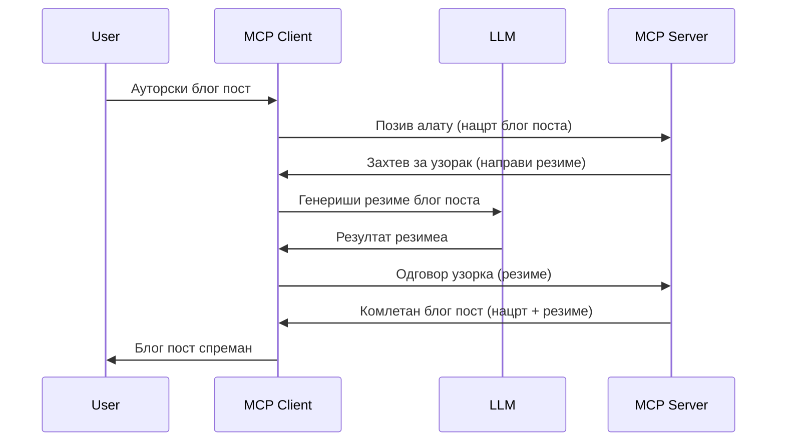

# Узорак - делегирање функција Клијенту

> **Обавештење о обустави:** кандидат за издање MCP спецификације `2026-07-28` означава Sampling као застарелу у корист директне интеграције са LLM API-јима добављача. Sampling наставља да ради у `2025-11-25` и најмање годину дана након било какве формалне обуставе, тако да све у овом лекцији остаје важеће — али нови дизајн сервера треба да процени облик замене. Погледајте [Шта се мења у MCP: кандидат за издање 2026-07-28](../../01-CoreConcepts/mcp-2026-07-28-release-candidate.md).

Понекад је неопходна сарадња MCP Клијента и MCP Сервера ради постизања заједничког циља. Могуће је имати ситуацију у којој Сервер захтева помоћ LLM који се налази на клијенту. За овакву ситуацију, Sampling је оно што треба да користите.

Хајде да истражимо неке употребне случајеве и како направити решење које укључује Sampling.

## Преглед

У овој лекцији фокусираћемо се на објашњење када и где користити Sampling и како га конфигурисати.

## Циљеви учења

У овом поглављу ћемо:

- Објаснити шта је Sampling и када га користити.
- Показати како конфигурисати Sampling у MCP.
- Презентовати примере коришћења Sampling-а у пракси.

## Шта је Sampling и зашто га користити?

Sampling је напредна функција која ради на следећи начин:



### Захтев за Sampling

Ево сада широког прегледа вероватног сценарија, хајде да разговарамо о захтеву за Sampling који сервер шаље назад клијенту. Ево како захтев може изгледати у JSON-RPC формату:

```json
{
  "jsonrpc": "2.0",
  "id": 1,
  "method": "sampling/createMessage",
  "params": {
    "messages": [
      {
        "role": "user",
        "content": {
          "type": "text",
          "text": "Create a blog post summary of the following blog post: <BLOG POST>"
        }
      }
    ],
    "modelPreferences": {
      "hints": [
        {
          "name": "claude-3-sonnet"
        }
      ],
      "intelligencePriority": 0.8,
      "speedPriority": 0.5
    },
    "systemPrompt": "You are a helpful assistant.",
    "maxTokens": 100
  }
}
```

Вреди истаћи неколико ствари овде:

- Prompt, под content -> text, је наш упит који је упутство LLM-у да сажме садржај блог поста.

- **modelPreferences**. Овај одељак је управо то, преференца, препорука о томе коју конфигурацију треба користити са LLM-ом. Корисник може изабрати да ли ће пратити ове препоруке или их изменити. У овом случају постоје препоруке о моделу за коришћење, приоритету брзине и интелигенције.
- **systemPrompt**, ово је ваш уобичајени системски упит који вашем LLM-у даје личност и садржи упутства.
- **maxTokens**, ово је други параметар који говори колико токена је препоручено за ову задатак.

### Одговор на Sampling

Овај одговор MCP Клијент на крају шаље назад MCP Серверу и он је резултат позива клијента LLM-у, чекања на одговор и затим конструкције ове поруке. Ево како то може изгледати у JSON-RPC-у:

```json
{
  "jsonrpc": "2.0",
  "id": 1,
  "result": {
    "role": "assistant",
    "content": {
      "type": "text",
      "text": "Here's your abstract <ABSTRACT>"
    },
    "model": "gpt-5",
    "stopReason": "endTurn"
  }
}
```

Обратите пажњу како је одговор сажетак блог поста баш онако како смо тражили. Такође приметите да коришћени `model` није онај који смо тражили већ "gpt-5" уместо "claude-3-sonnet". Ово илуструје да корисник може променити мишљење о томе шта да користи и да је ваш sampling захтев само препорука.

Сада када разумемо главни ток и корисну примену за "креирање блог поста + сажетак", хајде да видимо шта треба да урадимо да то ради.

### Типови порука

Sampling поруке нису ограничене само на текст већ можете слати и слике и аудио. Ево како JSON-RPC изгледа другачије:

**Текст**

```json
{
  "type": "text",
  "text": "The message content"
}
```

**Садржај слике**

```json
{
  "type": "image",
  "data": "base64-encoded-image-data",
  "mimeType": "image/jpeg"
}
```

**Садржај звука**

```json
{
  "type": "audio",
  "data": "base64-encoded-audio-data",
  "mimeType": "audio/wav"
}
```

> НАПОМЕНА: за детаљније информације о Sampling-у, погледајте [званичну документацију](https://modelcontextprotocol.io/specification/2025-11-25/client/sampling)

## Како конфигурисати Sampling у Клијенту

> Напомена: ако правите само сервер, овде не треба много тога радити.

У клијенту треба да наведете следећу функцију овако:

```json
{
  "capabilities": {
    "sampling": {}
  }
}
```

Ово ће бити препознато када изабрани клијент иницијализује везу са сервером.

## Пример Sampling-а у пракси - Креирање блог поста

Хајде да заједно кодирамо sampling сервер, мораћемо да урадимо следеће:

1. Направите алат на Серверу.
1. Тај алат треба да креира sampling захтев
1. Алат треба да чека на одговор на sampling захтев клијента.
1. Затим треба да се произведе резултат алата.

Хајде да видимо код корак по корак:

### -1- Креирање алата

**python**

```python
@mcp.tool()
async def create_blog(title: str, content: str, ctx: Context[ServerSession, None]) -> str:
    """Create a blog post and generate a summary"""

```

### -2- Креирање sampling захтева

Проширите ваш алат следећим кодом:

**python**

```python
post = BlogPost(
        id=len(posts) + 1,
        title=title,
        content=content,
        abstract=""
    )

prompt = f"Create an abstract of the following blog post: title: {title} and draft: {content} "

result = await ctx.session.create_message(
        messages=[
            SamplingMessage(
                role="user",
                content=TextContent(type="text", text=prompt),
            )
        ],
        max_tokens=100,
)

```

### -3- Чекање на одговор и повраћај одговора

**python**

```python
post.abstract = result.content.text

posts.append(post)

# врати комплетан производ
return json.dumps({
    "id": post.title,
    "abstract": post.abstract
})
```

### -4- Комплетан код

**python**

```python
from starlette.applications import Starlette
from starlette.routing import Mount, Host

from mcp.server.fastmcp import Context, FastMCP

from mcp.server.session import ServerSession
from mcp.types import SamplingMessage, TextContent

import json


from uuid import uuid4
from typing import List
from pydantic import BaseModel


mcp = FastMCP("Blog post generator")

# апп = FastAPI()

posts = []

class BlogPost(BaseModel):
    id: int
    title: str
    content: str
    abstract: str

posts: List[BlogPost] = []

@mcp.tool()
async def create_blog(title: str, content: str, ctx: Context[ServerSession, None]) -> str:
    """Create a blog post and generate a summary"""

    post = BlogPost(
        id=len(posts) + 1,
        title=title,
        content=content,
        abstract=""
    )

    prompt = f"Create an abstract of the following blog post: title: {title} and draft: {content} "

    result = await ctx.session.create_message(
        messages=[
            SamplingMessage(
                role="user",
                content=TextContent(type="text", text=prompt),
            )
        ],
        max_tokens=100,
    )

    post.abstract = result.content.text

    posts.append(post)

    # врати цео блог пост
    return json.dumps({
        "id": post.title,
        "abstract": post.abstract
    })

if __name__ == "__main__":
    print("Starting server...")
    # мцп.рун()
    mcp.run(transport="streamable-http")

# покрени апликацију са: python server.py
```

### -5- Тестирање у Visual Studio Code

Да бисте тестирали ово у Visual Studio Code, урадите следеће:

1. Покрените сервер у терминалу
1. Додајте га у *mcp.json* (и уверите се да је покренут), нешто овако:

   ```json
   "servers": {
      "blog-server": {
        "type": "http",
        "url": "http://localhost:8000/mcp"
      }
   }
   ```

1. Откуцајте упит:

   ```text
   create a blog post named "Where Python comes from", the content is "Python is actually named after Monty Python Flying Circus"
   ```

1. Дозволите да се Sampling одвија. Први пут када ово тестирате добићете додатни дијалог који морате прихватити, а затим ћете видети уобичајени дијалог који тражи да покренете алат

1. Прегледајте резултате. Видећете резултате лепо приказане у GitHub Copilot Chat-у али и сирови JSON одговор.

**Бонус**. Visual Studio Code има одличну подршку за Sampling. Можете конфигурисати приступ Sampling-у на вашем инсталираном серверу тако што ћете отићи овако:

1. Идите у секцију за екстензије.
1. Изаберите икону зупчаника за ваш инсталирани сервер у одељку "MCP SERVERS - INSTALLED".
1 Изаберите "Configure Model Access", овде можете изабрати које моделе GitHub Copilot сме да користи приликом Sampling-а. Можете такође видети све недавно извршене sampling захтеве кликом на "Show Sampling requests".

## Задатак

У овом задатку направићете мало другачији Sampling, односно интеграцију за sampling која подржава генерисање описа производа. Ево вашег сценарија:

**Сценарио**: Радник из позадинске канцеларије у е-трговини има потребу јер му одузима превише времена генерисање описа производа. Стога треба да направите решење где можете позвати алат "create_product" са аргументима "title" и "keywords" и он треба да произведе комплетан производ укључујући поље "description" које треба да попуни LLM клијента.

САВЕТ: искористите оно што сте раније научили да конструишете овај сервер и његов алат користећи sampling захтев.

## Решење

[Решење](./solution/README.md)

## Кључне појмове

Sampling је моћна функција која омогућава серверу да делегира задатке клијенту када му је потребна помоћ LLM-а.

## Шта следи

- [Поглавље 4 - Практична примена](../../04-PracticalImplementation/README.md)

---

<!-- CO-OP TRANSLATOR DISCLAIMER START -->
**Изјава о одрицању одговорности**:
Овај документ је преведен коришћењем услуге за аутоматски превод [Co-op Translator](https://github.com/Azure/co-op-translator). Иако тежимо тачности, имајте у виду да аутоматски преводи могу садржати грешке или нетачности. Оригинални документ на његовом изворном језику треба сматрати ауторитативним извором. За критичне информације препоручује се професионални људски превод. Нисмо одговорни за било каква неспоразума или погрешна тумачења која произилазе из коришћења овог превода.
<!-- CO-OP TRANSLATOR DISCLAIMER END -->