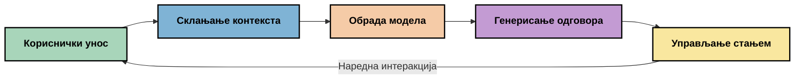
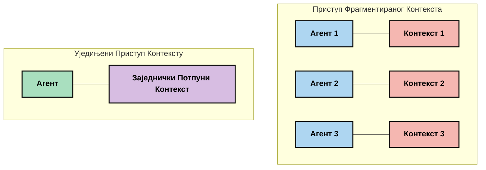
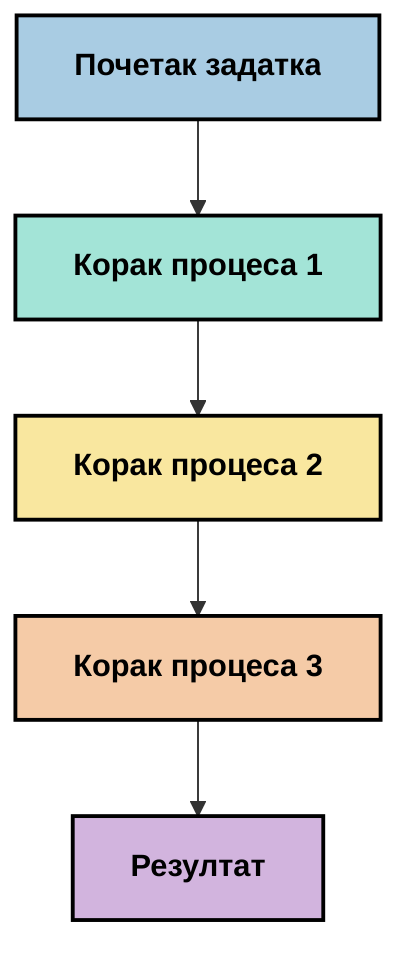
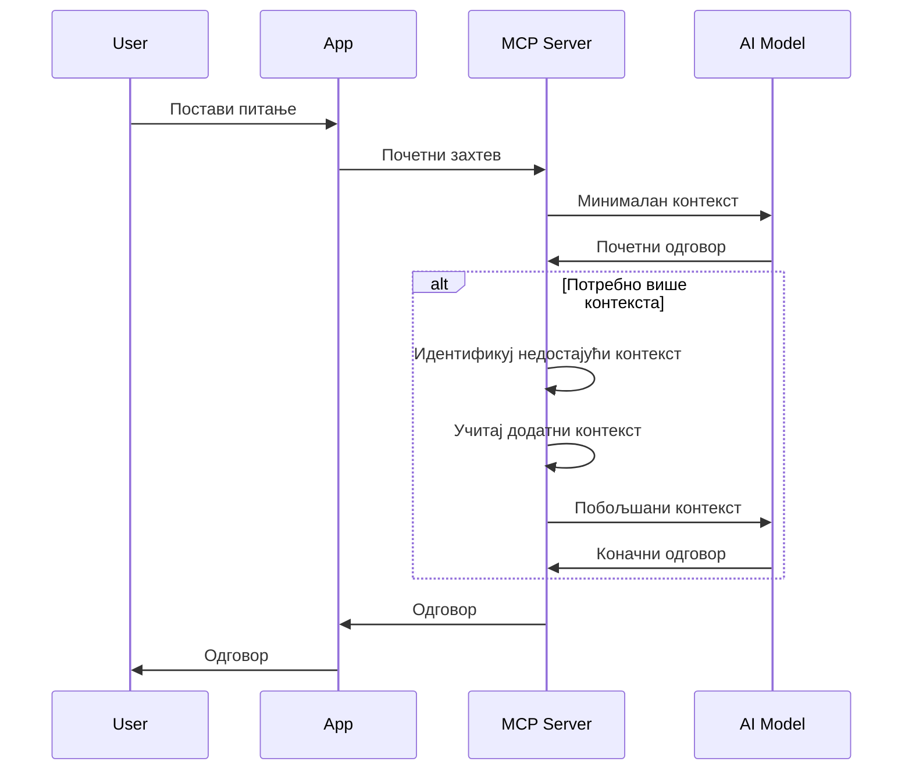
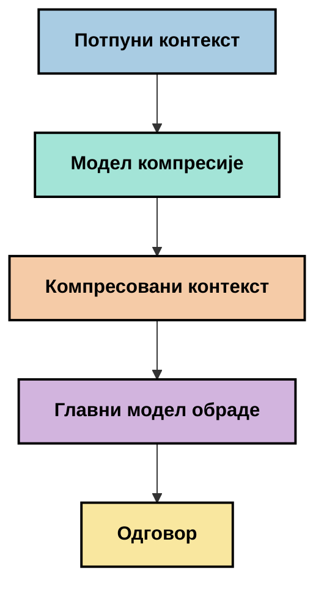
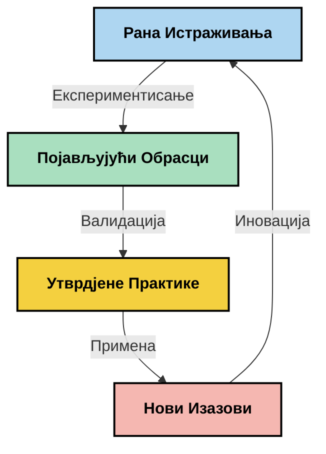

# Инжењеринг контекста: Нови концепт у MCP екосистему

## Преглед

Инжењеринг контекста је нови концепт у области вештачке интелигенције који испитује како се информације структуирају, достављају и одржавају током интеракција између корисника и AI сервиса. Како се екосистем Model Context Protocol (MCP) развија, разумевање како ефикасно управљати контекстом постаје све важније. Овај модул уводи концепт инжењеринга контекста и истражује његове потенцијалне примене у MCP имплементацијама.

## Циљеви учења

До краја овог модула, моћи ћете да:

- Разумете нови концепт инжењеринга контекста и његову потенцијалну улогу у MCP апликацијама
- Идентификујете кључне изазове у управљању контекстом које MCP протокол решава
- Истражите технике за побољшање перформанси модела кроз боље руковање контекстом
- Размотрите приступе за мерење и процену ефикасности контекста
- Примените ове нове концепте за унапређење AI искустава кроз MCP оквир

## Увод у инжењеринг контекста

Инжењеринг контекста је нови концепт фокусиран на намерни дизајн и управљање протоком информација између корисника, апликација и AI модела. За разлику од успостављених области као што је prompt engineering, инжењеринг контекста је још увек у процесу дефинисања од стране практичара док се трудe да реше јединствене изазове давање AI моделима праве информације у правом тренутку.

Како су велики језички модели (LLMs) еволуирали, значај контекста постаје све очигледнији. Квалитет, релевантност и структура контекста који пружамо директно утичу на излаз модела. Инжењеринг контекста истражује ову везу и настоји да развије принципе за ефективно управљање контекстом.

> „Године 2025, модели су изузетно интелигентни. Али чак и најпаметнији човек неће моћи ефикасно да обави свој посао без контекста онога што му се тражи... 'Инжењеринг контекста' је следећи ниво prompt engineering-а. Ради се о аутоматском извршавању у динамичном систему.“ — Валден Јан, Cognition AI

Инжењеринг контекста може обухватити:

1. **Избор контекста**: Одређивање које су информације релевантне за одређени задатак
2. **Структурирање контекста**: Организација информација за максимално разумевање модела
3. **Испорука контекста**: Оптимизација начина и тренутка слања информација моделима
4. **Одржавање контекста**: Управљање стањем и развојем контекста током времена
5. **Процена контекста**: Мерење и побољшање ефикасности контекста

Ова подручја су посебно релевантна за MCP екосистем који пружа стандардирани начин да апликације преносе контекст LLM моделима.


## Перспектива путовања контекста

Један начин да се визуализује инжењеринг контекста јесте праћење путовања које информација прави кроз MCP систем:



### Кључне фазе путовања контекста:

1. **Унос корисника**: Сирове информације од корисника (текст, слике, документи)
2. **Састављање контекста**: Комбинација уноса корисника са системским контекстом, историјом разговора и другим преузетим информацијама
3. **Обрада модела**: AI модел обрађује састављени контекст
4. **Генерисање одговора**: Модел производи излаз на основу датог контекста
5. **Управљање стањем**: Систем ажурира интерно стање на основу интеракције

Ова перспектива илуструје динамичку природу контекста у AI системима и покреће важна питања о томе како најбоље управљати информацијама у свакој фази.

## Нови принципи у инжењерингу контекста

Како се област инжењеринга контекста обликује, неки рани принципи почињу да се истичу од стране практичара. Ови принципи могу помоћи да се информишу избори при имплементацији MCP:

### Принцип 1: Потпуно дељење контекста

Контекст треба делити у целини између свих компоненти система, а не фрагментисати преко више агената или процеса. Када је контекст раздвојен, одлуке донете у једном делу могу бити у конфликту са оним донетим другде.



У MCP апликацијама ово сугерира дизајн система где контекст несметано тече кроз цео процес, уместо да је подељен на одељке.

### Принцип 2: Препознавање да акције носе имплицитне одлуке

Свакa акцијa коју модел предузме подразумева имплицитне одлуке о томе како тумачити контекст. Када више компоненти делује на различитим контекстима, ове имплицитне одлуке могу бити у сукобу и довести до неусклађених резултата.

Овај принцип има важне импликације за MCP апликације:
- Преферирајте линеарну обраду сложених задатака уместо паралелног извршавања са фрагментираним контекстом
- Осигурајте да све тачке одлуке имају приступ истајемо контекстуалним информацијама
- Дизајнирајте системе где каснији кораци могу видети цео контекст ранијих одлука

### Принцип 3: Баланс дубине контекста са ограничењима прозора

Како разговори и процеси постају дужи, контекст прозори се у конечном броју препуне. Ефикасан инжењеринг контекста истражује приступе за управљање овим конфликтом између свеобухватног контекста и техничких ограничења.

Потенцијални приступи који се истражују укључују:
- Компресија контекста која одржава суштинске информације док смањује коришћење токена
- Прогресивно учитавање контекста на основу релевантности тренутним потребама
- Сажимање претходних интеракција уз очување кључних одлука и чињеница

## Изазови контекста и дизајн MCP протокола

Model Context Protocol (MCP) је дизајниран уз свест о јединственим изазовима управљања контекстом. Разумевање ових изазова помаже да се објасне кључни аспекти дизајна MCP протокола:


### Изазов 1: Ограничења прозора контекста
Већина AI модела има фиксну величину контекст прозора, што ограничава колико информација могу обрадити одједном.

**Одговор MCP дизајна:** 
- Протокол подржава структуриран и ресурсно базиран контекст који се може ефикасно референцирати
- Ресурси се могу пейџирати и сабирати прогресивно

### Изазов 2: Одређивање релевантности
Тешко је утврдити које су информације најрелевантније за укључивање у контекст.

**Одговор MCP дизајна:**
- Флексибилни алати омогућују динамичко преузимање информација по потреби
- Структурирани prompts омогућују доследну организацију контекста

### Изазов 3: Постојаност контекста
Управљање стањем током интеракција захтева пажљиво праћење контекста.

**Одговор MCP дизајна:**
- Стандардизовано управљање сесијама
- Јасно дефинисани обрасци интеракције за еволуцију контекста

### Изазов 4: Мултимодални контекст
Различите врсте података (текст, слике, структурирани подаци) захтевају различите начине обраде.

**Одговор MCP дизајна:**
- Дизајн протокола прилагођен разним типовима садржаја
- Стандардизована репрезентација мултимодалних информација

### Изазов 5: Безбедност и приватност
Контекст често садржи осетљиве информације које морају бити заштићене.

**Одговор MCP дизајна:**
- Јасне границе у одговорностима клијента и сервера
- Опције локалне обраде ради минимализације изложености података

Разумевање ових изазова и како их MCP решава пружа основу за истраживање напреднијих техника инжењеринга контекста.

## Нови приступи инжењерингу контекста

Како се област инжењеринга контекста развија, појављују се неки обећавајући приступи. Они представљају тренутна размишљања, а не утврђене најбоље праксе, и вероватно ће се еволуирати како стечемо више искуства са MCP имплементацијама.

### 1. Једнонишка линеарна обрада

За разлику од мулти-агентских архитектура које дистрибуирају контекст, неки практичари проналазе да једнонишка линеарна обрада даје доследније резултате. Ово је у складу са принципом одржавања јединственог контекста.



Иако овај приступ може изгледати мање ефикасан од паралелне обраде, често даје кохерентније и поузданије резултате зато што сваки корак гради на потпуном разумевању претходних одлука.

### 2. Деловање и приоритизација контекста

Разбијање великих контекста на управљиве делове и приоритизација најважнијег.

```python
# Концептуални пример: Чување и приоритизација контекста
def process_with_chunked_context(documents, query):
    # 1. Подели документе на мање делове
    chunks = chunk_documents(documents)
    
    # 2. Израчунај релевантне оцене за сваки део
    scored_chunks = [(chunk, calculate_relevance(chunk, query)) for chunk in chunks]
    
    # 3. Сортирај делове по релевантној оцени
    sorted_chunks = sorted(scored_chunks, key=lambda x: x[1], reverse=True)
    
    # 4. Користи најрелевантније делове као контекст
    context = create_context_from_chunks([chunk for chunk, score in sorted_chunks[:5]])
    
    # 5. Обради уз приоритетни контекст
    return generate_response(context, query)
```

Концепт изнад илуструје како можемо раздвојити велике документе на управљиве делове и изабрати само најрелевантније за контекст. Овај приступ помаже рад у оквиру ограничења контекст прозора уз коришћење великих база знања.

### 3. Прогресивно учитавање контекста

Учитавање контекста постепено, по потреби, уместо одједном.



Прогресивно учитавање контекста почиње са минималним контекстом и шири га само када је неопходно. Ово може значајно смањити коришћење токена за једноставна питања уз одржавање могућности решавања комплексних.

### 4. Компресија и сажимање контекста

Смањивање величине контекста уз очување кључних информација.



Компресија контекста фокусира се на:
- Уклањање понављајућих информација
- Сажимање дугачког садржаја
- Издвајање кључних чињеница и детаља
- Очување критичних елемената контекста
- Оптимизацију ради ефикасности токена

Овај приступ може бити нарочито вредан за одржавање дугих разговора унутар контекст прозора или за ефикасну обраду великих докумената. Неки практичари користе специјализоване моделе посебно за компресију и сажимање историје разговора.


## Разматрања у инжењерингу контекста за истраживање

Док истражујемо нову област инжењеринга контекста, неколико разматрања вреди имати на уму када радите са MCP имплементацијама. Ово нису прескриптивне најбоље праксе већ области истраживања које могу донети побољшања у вашем специфичном случају.

### Размислите о својим циљевима контекста

Пре него што имплементирате комплексна решења за управљање контекстом, јасно артикулишите шта желите постићи:
- Које конкретне информације модел треба да буде успешан?
- Које су информације есенцијалне, а које допунске?
- Која су ваша ограничења перформанси (латенција, лимити токена, трошкови)?

### Истражите слојевите приступе контексту

Неки практичари налазе успех са контекстом организованим у концептуалне слојеве:
- **Основни слој**: Есенцијалне информације које модел увек треба
- **Ситуациони слој**: Контекст специфичан за текућу интеракцију
- **Подржавајући слој**: Додатне корисне информације
- **Резервни слој**: Информације приступачне само када су потребне

### Истражите стратегије претраживања

Ефикасност вашег контекста често зависи од начина на који преузимате информације:
- Семантичко претраживање и уграђивања за проналажење концептуално релевантних информација
- Претраживање базирано на кључним речима за специфичне чињеничне детаље
- Хибридни приступи који комбинују више метода преузимања
- Филтрирање метаподатака ради сужавања домета по категоријама, датумима или изворима

### Експериментишите са кохеренцијом контекста

Структура и ток вашег контекста могу утицати на разумевање модела:
- Груписање релевантних информација заједно
- Коришћење доследног форматирања и организације
- Одржавање логичног или хронолошког редоследа где је прикладно
- Избегавање контрадикторних информација

### Процените компромисе мулти-агентских архитектура

Иако су мульти-агентске архитектуре популарне у многим AI оквирима, оне доносе значајне изазове у управљању контекстом:
- Фрагментација контекста може довести до неусклађених одлука између агената
- Паралелна обрада може увести сукобе који су тешки за помирење
- Комплексност комуникације између агената може поништити добитке у перформансама
- Потребно је комплексно управљање стањем да се одржи кохеренција

У многим случајевима, приступ са једним агентом и свеобухватним управљањем контекстом може дати поузданије резултате него више специјализованих агената са фрагментираним контекстом.

### Развијте методе процене

Да бисте с временом побољшали инжењеринг контекста, размислите како ћете мерити успех:
- А/Б тестирање различитих структура контекста
- Пратити коришћење токена и време одговора
- Пратите задовољство корисника и стопе завршетка задатака
- Анализирање када и зашто стратегије контекста не успевају

Ова разматрања представљају активна подручја истраживања у области инжењеринга контекста. Како се област сазрева, вероватно ће се појавити јаснији узорци и праксе.

## Мерење ефикасности контекста: Еволутивни оквир

Како се инжењеринг контекста јавља као концепт, практичари почињу да истражују како бисмо могли мерити његову ефикасност. Званичан оквир још не постоји, али разни параметри се разматрају који могу помоћи у вођењу будућег рада.

### Потенцијалне димензије мерења


#### 1. Разматрања ефикасности уноса

- **Однос контекст-одговор**: Колико контекста је потребно у односу на величину одговора?
- **Коришћење токена**: Који проценат токена из контекста утиче на одговор?
- **Смањење контекста**: Колико ефикасно можемо компримовати сирове информације?

#### 2. Разматрања перформанси

- **Утицај латенције**: Како управљање контекстом утиче на време одговора?
- **Економија токена**: Да ли оптимизујемо коришћење токена ефикасно?
- **Прецизност преузимања**: Колико је релевантна преузета информација?
- **Коришћење ресурса**: Који рачунарски ресурси су потребни?

#### 3. Разматрања квалитета

- **Релевантност одговора**: Колико добро одговор решава упит?
- **Чињенична тачност**: Да ли управљање контекстом побољшава чињеничну исправност?
- **Доследност**: Да ли су одговори доследни код сличних упита?
- **Стопа халуцинација**: Да ли бољи контекст смањује халуцинације модела?

#### 4. Разматрања корисничког искуства

- **Стопа накнадних питања**: Колико често корисници траже појашњење?
- **Завршетак задатка**: Да ли корисници успешно постижу своје циљеве?
- **Показатељи задовољства**: Како корисници оцењују своје искуство?

### Истраживачки приступи мерењу

При експериментисању са инжењерингом контекста у MCP имплементацијама, размотрите ове истраживачке приступе:

1. **Поређења са основним нивоом**: Успоставите основни ниво једноставним приступима контексту пре тестирања напреднијих метода

2. **Инкременталне промене**: Мењајте један аспект управљања контекстом истовремено да бисте изоловали ефекте

3. **Евалуација усмерена на корисника**: Комбинујте квантитативне метрике са квалитативним повратним информацијама корисника

4. **Анализа неуспеха**: Испитајте случајеве где стратегије контекста не успевају како бисте разумели потенцијална побољшања

5. **Вишедимензионална процена**: Размотрите компромисе између ефикасности, квалитета и корисничког искуства

Ова експериментална, вишеструка перспектива мерења у складу је са природом која се развија у инжењерингу контекста.

## Закључна размишљања

Инжењеринг контекста је нова област истраживања која може постати кључна за ефективне MCP апликације. Мисаоно разматрање како информације протичу кроз ваш систем може потенцијално створити AI искуства која су ефикаснија, прецизнија и вреднија за кориснике.

Технике и приступи описани у овом модулу представљају ране идеје у овој области, а не устаљене праксе. Инжењеринг контекста може постати дефинисанија дисциплина како AI могућности еволуирају и наше разумевање се продубљује. За сада, експериментисање у комбинацији са пажљивим мерењем делује као најпродуктивнији приступ.

## Потенцијални будући правци

Област инжењеринга контекста је још увек у раној фази, али неки обећавајући правци се појављују:

- Принципи инжењеринга контекста могу значајно утицати на перформансе модела, ефикасност, корисничко искуство и поузданост
- Једнонишки приступи са свеобухватним управљањем контекстом могу превазићи мулти-агентске архитектуре за многе случајеве коришћења
- Специјализовани модели компресије контекста могу постати стандардни елементи AI цевовода
- Конфликт између потпуности контекста и ограничења токена вероватно ће подстаћи иновације у руковању контекстом
- Како модели постају способнији за ефикасну комуникацију налик људској, права мулти-агентска сарадња може постати изводљивија
- MCP имплементације могу еволуирати да стандардују обрасце управљања контекстом који произлазе из тренутних експеримената



## Ресурси

### Званични MCP ресурси
- [Model Context Protocol Website](https://modelcontextprotocol.io/)
- [Model Context Protocol Specification](https://github.com/modelcontextprotocol/modelcontextprotocol)

- [MCP документација](https://modelcontextprotocol.io/docs)
- [MCP C# SDK](https://github.com/modelcontextprotocol/csharp-sdk)
- [MCP Python SDK](https://github.com/modelcontextprotocol/python-sdk)
- [MCP TypeScript SDK](https://github.com/modelcontextprotocol/typescript-sdk)
- [MCP инспектор](https://github.com/modelcontextprotocol/inspector) - алат за визуелно тестирање MCP сервера

### Чланци о инжењерингу контекста
- [Не правите мулти-агенте: Принципи инжењеринга контекста](https://cognition.ai/blog/dont-build-multi-agents) - увиди Валдена Јана о принципима инжењеринга контекста
- [Практичан водич за прављење агената](https://cdn.openai.com/business-guides-and-resources/a-practical-guide-to-building-agents.pdf) - OpenAI водич за ефикасан дизајн агената
- [Прављење ефикасних агената](https://www.anthropic.com/engineering/building-effective-agents) - подход Anthropic-а развоју агената

### Повезана истраживања
- [Динамичко повећање приступа за велике језичке моделе](https://arxiv.org/abs/2310.01487) - истраживање динамичких приступа
- [Загубљени у средини: Како језички модели користе дуге контексте](https://arxiv.org/abs/2307.03172) - важна истраживања о обрасцима обраде контекста
- [Хијерархијска генерација слика условљена текстом уз CLIP латенте](https://arxiv.org/abs/2204.06125) - рад ДАЛЛ-Е 2 са увидом у структуирање контекста
- [Истраживање улоге контекста у архитектурама великих језичких модела](https://aclanthology.org/2023.findings-emnlp.124/) - новија истраживања о руковању контекстом
- [Колаборација мулти-агената: Преглед](https://arxiv.org/abs/2304.03442) - истраживање о системима са више агената и њиховим изазовима

### Додатни ресурси
- [Технике оптимизације контекст прозора](https://learn.microsoft.com/en-us/azure/ai-services/openai/concepts/context-window)
- [Напредне RAG технике](https://www.microsoft.com/en-us/research/blog/retrieval-augmented-generation-rag-and-frontier-models/)
- [Документација Semantic Kernel](https://github.com/microsoft/semantic-kernel)
- [AI алат за управљање контекстом](https://github.com/microsoft/aitoolkit)

## Шта следи

- [5.15 MCP прилагођени транспорт](../mcp-transport/README.md)

---

<!-- CO-OP TRANSLATOR DISCLAIMER START -->
**Изјава о одрицању одговорности**:
Овај документ је преведен коришћењем услуге за аутоматски превод [Co-op Translator](https://github.com/Azure/co-op-translator). Иако тежимо тачности, имајте у виду да аутоматски преводи могу садржати грешке или нетачности. Оригинални документ на његовом изворном језику треба сматрати ауторитативним извором. За критичне информације препоручује се професионални људски превод. Нисмо одговорни за било каква неспоразума или погрешна тумачења која произилазе из коришћења овог превода.
<!-- CO-OP TRANSLATOR DISCLAIMER END -->