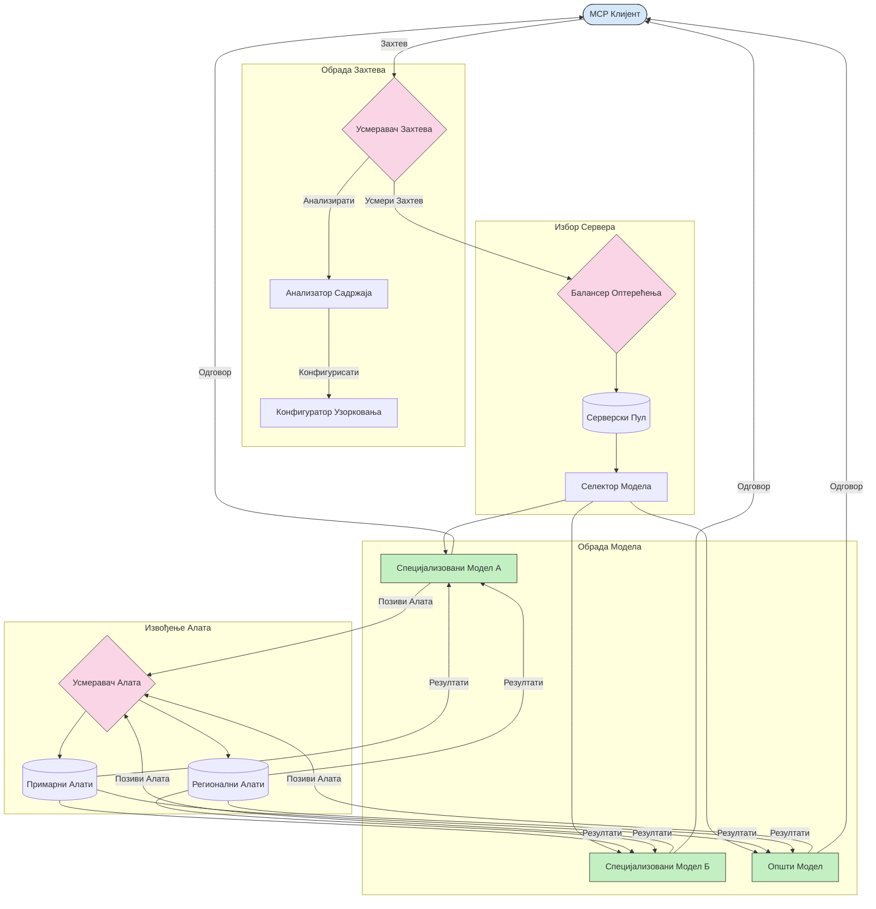

# Роутинг у Протоколу Контекста Модела

Роутинг је суштински за усмеравање захтева ка одговарајућим моделима, алатима или услугама у оквиру MCP екосистема.

## Увод

Роутинг у Протоколу Контекста Модела (MCP) подразумева усмеравање захтева ка најприкладнијим моделима или услугама на основу различитих критеријума као што су тип садржаја, кориснички контекст и оптерећење система. Ово обезбеђује ефикасну обраду и оптималну употребу ресурса.

## Циљеви учења

На крају ове лекције моћи ћете да:

- Разумете принципе роутинга у MCP.
- Имплементирате роутинг заснован на садржају како бисте усмерили захтеве ка специјализованим услугама.
- Примените интелигентне стратегије балансирања оптерећења за оптимизацију употребе ресурса.
- Имплементирате динамички роутинг алата на основу контекста захтева.

## Роутинг заснован на садржају

Роутинг заснован на садржају усмерава захтеве ка специјализованим услугама на основу садржаја захтева. На пример, захтеви везани за генерисање кода могу бити усмерени ка специјализованом моделу за код, док захтеви за креативно писање могу бити послати ка моделу за креативно писање.

Погледајмо пример имплементације на различитим програмским језицима.

<details>
<summary>.NET</summary>

```csharp
// .NET Example: Content-based routing in MCP
public class ContentBasedRouter
{
    private readonly Dictionary<string, McpClient> _specializedClients;
    private readonly RoutingClassifier _classifier;
    
    public ContentBasedRouter()
    {
        // Initialize specialized clients for different domains
        _specializedClients = new Dictionary<string, McpClient>
        {
            ["code"] = new McpClient("https://code-specialized-mcp.com"),
            ["creative"] = new McpClient("https://creative-specialized-mcp.com"),
            ["scientific"] = new McpClient("https://scientific-specialized-mcp.com"),
            ["general"] = new McpClient("https://general-mcp.com")
        };
        
        // Initialize content classifier
        _classifier = new RoutingClassifier();
    }
    
    public async Task<McpResponse> RouteAndProcessAsync(string prompt, IDictionary<string, object> parameters = null)
    {
        // Classify the prompt to determine the best specialized service
        string category = await _classifier.ClassifyPromptAsync(prompt);
        
        // Get the appropriate client or fall back to general
        var client = _specializedClients.ContainsKey(category) 
            ? _specializedClients[category] 
            : _specializedClients["general"];
            
        Console.WriteLine($"Routing request to {category} specialized service");
        
        // Send request to the selected service
        return await client.SendPromptAsync(prompt, parameters);
    }
    
    // Simple classifier for routing decisions
    private class RoutingClassifier
    {
        public Task<string> ClassifyPromptAsync(string prompt)
        {
            prompt = prompt.ToLowerInvariant();
            
            if (prompt.Contains("code") || prompt.Contains("function") || 
                prompt.Contains("program") || prompt.Contains("algorithm"))
            {
                return Task.FromResult("code");
            }
            
            if (prompt.Contains("story") || prompt.Contains("creative") || 
                prompt.Contains("imagine") || prompt.Contains("design"))
            {
                return Task.FromResult("creative");
            }
            
            if (prompt.Contains("science") || prompt.Contains("research") || 
                prompt.Contains("analyze") || prompt.Contains("study"))
            {
                return Task.FromResult("scientific");
            }
            
            return Task.FromResult("general");
        }
    }
}
```

У претходном коду смо:

- Креирали класу `ContentBasedRouter` која усмерава захтеве на основу садржаја промпта.
- Иницијализовали специјализоване клијенте за различите домене (код, креативно, научно, општи).
- Имплементирали једноставан класификатор који одређује категорију промпта и усмерава га ка одговарајућој специјализованој услузи.
- Користили механизм падајуће резерве за усмеравање захтева ка општој услузи ако специјализована услуга није доступна.
- Имплементирали асинхрону обраду за ефикасно руковање захтевима.
- Користили речник за мапирање категорија садржаја ка специјализованим MCP клијентима.
- Имплементирали једноставан класификатор који анализира промпт и враћа одговарајућу категорију.
- Користили специјализованог клијента за слање захтева и пријем одговора.
- Руководили се случајевима када промпт не одговара ниједној специјализованој категорији усмеравајући га на општу услугу.

</details>

## Интелигентно балансирање оптерећења

Балансирање оптерећења оптимизује коришћење ресурса и обезбеђује високу доступност за MCP услуге. Постоје различити начини имплементације балансирања оптерећења, као што су ротација (round-robin), тежинско време одговора или стратегије осетљиве на садржај.

Погледајмо пример имплементације који користи следеће стратегије:

- **Ротација (Round Robin)**: Равномерно распоређује захтеве између доступних сервера.
- **Тежинско време одговора**: Усмерава захтеве ка серверима на основу њиховог просечног времена одговора.
- **Осетљиво на садржај**: Усмерава захтеве ка специјализованим серверима на основу садржаја захтева.

<details>
<summary>Java</summary>

```java
// Java пример: Интелигентно балансирање оптерећења за MCP сервере
public class McpLoadBalancer {
    private final List<McpServerNode> serverNodes;
    private final LoadBalancingStrategy strategy;
    
    public McpLoadBalancer(List<McpServerNode> nodes, LoadBalancingStrategy strategy) {
        this.serverNodes = new ArrayList<>(nodes);
        this.strategy = strategy;
    }
    
    public McpResponse processRequest(McpRequest request) {
        // Изаберите најбољи сервер на основу стратегије
        McpServerNode selectedNode = strategy.selectNode(serverNodes, request);
        
        try {
            // Усмерите захтев ка изабраном чвору
            return selectedNode.processRequest(request);
        } catch (Exception e) {
            // Обрадите неуспех - имплементирајте логику поновног покушаја или резервне варијанте
            System.err.println("Error processing request on node " + selectedNode.getId() + ": " + e.getMessage());
            
            // Означите чвор као потенцијално нездрав
            selectedNode.recordFailure();
            
            // Покушајте следећи најбољи чвор као резерву
            List<McpServerNode> remainingNodes = new ArrayList<>(serverNodes);
            remainingNodes.remove(selectedNode);
            
            if (!remainingNodes.isEmpty()) {
                McpServerNode fallbackNode = strategy.selectNode(remainingNodes, request);
                return fallbackNode.processRequest(request);
            } else {
                throw new RuntimeException("All MCP server nodes failed to process the request");
            }
        }
    }
    
    // Задаци провере здравља чвора
    public void startHealthChecks(Duration interval) {
        ScheduledExecutorService scheduler = Executors.newScheduledThreadPool(1);
        scheduler.scheduleAtFixedRate(() -> {
            for (McpServerNode node : serverNodes) {
                try {
                    boolean isHealthy = node.checkHealth();
                    System.out.println("Node " + node.getId() + " health status: " + 
                                      (isHealthy ? "HEALTHY" : "UNHEALTHY"));
                } catch (Exception e) {
                    System.err.println("Health check failed for node " + node.getId());
                    node.setHealthy(false);
                }
            }
        }, 0, interval.toMillis(), TimeUnit.MILLISECONDS);
    }
    
    // Интерфејс за стратегије балансирања оптерећења
    public interface LoadBalancingStrategy {
        McpServerNode selectNode(List<McpServerNode> nodes, McpRequest request);
    }
    
    // Ротациона стратегија
    public static class RoundRobinStrategy implements LoadBalancingStrategy {
        private AtomicInteger counter = new AtomicInteger(0);
        
        @Override
        public McpServerNode selectNode(List<McpServerNode> nodes, McpRequest request) {
            List<McpServerNode> healthyNodes = nodes.stream()
                .filter(McpServerNode::isHealthy)
                .collect(Collectors.toList());
            
            if (healthyNodes.isEmpty()) {
                throw new RuntimeException("No healthy nodes available");
            }
            
            int index = counter.getAndIncrement() % healthyNodes.size();
            return healthyNodes.get(index);
        }
    }
    
    // Стратегија одговора с тежином времена
    public static class ResponseTimeStrategy implements LoadBalancingStrategy {
        @Override
        public McpServerNode selectNode(List<McpServerNode> nodes, McpRequest request) {
            return nodes.stream()
                .filter(McpServerNode::isHealthy)
                .min(Comparator.comparing(McpServerNode::getAverageResponseTime))
                .orElseThrow(() -> new RuntimeException("No healthy nodes available"));
        }
    }
    
    // Стратегија свесна садржаја
    public static class ContentAwareStrategy implements LoadBalancingStrategy {
        @Override
        public McpServerNode selectNode(List<McpServerNode> nodes, McpRequest request) {
            // Одредите карактеристике захтева
            boolean isCodeRequest = request.getPrompt().contains("code") || 
                                   request.getAllowedTools().contains("codeInterpreter");
            
            boolean isCreativeRequest = request.getPrompt().contains("creative") || 
                                       request.getPrompt().contains("story");
            
            // Пронађите специјализоване чворове
            Optional<McpServerNode> specializedNode = nodes.stream()
                .filter(McpServerNode::isHealthy)
                .filter(node -> {
                    if (isCodeRequest && node.getSpecialization().equals("code")) {
                        return true;
                    }
                    if (isCreativeRequest && node.getSpecialization().equals("creative")) {
                        return true;
                    }
                    return false;
                })
                .findFirst();
            
            // Вратите специјализовани или најмање оптерећени чвор
            return specializedNode.orElse(
                nodes.stream()
                    .filter(McpServerNode::isHealthy)
                    .min(Comparator.comparing(McpServerNode::getCurrentLoad))
                    .orElseThrow(() -> new RuntimeException("No healthy nodes available"))
            );
        }
    }
}
```

У претходном коду смо:

- Креирали класу `McpLoadBalancer` која управља списком MCP серверских чворова и усмерава захтеве на основу изабране стратегије балансирања оптерећења.
- Имплементирали различите стратегије балансирања оптерећења: `RoundRobinStrategy`, `ResponseTimeStrategy` и `ContentAwareStrategy`.
- Користили `ScheduledExecutorService` за периодичну проверу здравственог стања серверских чворова.
- Имплементирали механизам провере здравља који означава чворове као здраве или нездраве на основу њихових одговора на провере здравља.
- Руководили обрадом захтева са управљањем грешкама и логиком падајуће резерве како би се обезбедила висока доступност.
- Користили класу `McpServerNode` за представљање појединачних MCP серверских чворова, укључујући њихов статус здравља, просечно време одговора и тренутно оптерећење.
- Имплементирали класу `McpRequest` за обухватање детаља захтева као што су промпт и дозвољени алати.
- Користили Java Streams за филтрирање и избор чворова на основу здравственог статуса и специјализације.

</details>

## Динамички роутинг алата

Роутинг алата обезбеђује да позиви алата буду усмерени ка најприкладнијој услузи на основу контекста. На пример, позив алата за временску прогнозу може бити усмерен ка регионалном ендпоинту на основу локације корисника, или алат калкулатор може користити одређену верзију API-ја.

Погледајмо пример имплементације која показује динамички роутинг алата на основу анализе захтева, регионалних ендпоинта и подршке верзионисања.

<details>
<summary>Python</summary>

```python
# Питхон пример: Динамичко усмеравање алата засновано на анализи захтева
class McpToolRouter:
    def __init__(self):
        # Региструјте доступне крајње тачке алата
        self.tool_endpoints = {
            "weatherTool": "https://weather-service.example.com/api",
            "calculatorTool": "https://calculator-service.example.com/compute",
            "databaseTool": "https://database-service.example.com/query",
            "searchTool": "https://search-service.example.com/search"
        }
        
        # Регионалне крајње тачке за глобалну дистрибуцију
        self.regional_endpoints = {
            "us": {
                "weatherTool": "https://us-west.weather-service.example.com/api",
                "searchTool": "https://us.search-service.example.com/search"
            },
            "europe": {
                "weatherTool": "https://eu.weather-service.example.com/api",
                "searchTool": "https://eu.search-service.example.com/search"
            },
            "asia": {
                "weatherTool": "https://asia.weather-service.example.com/api",
                "searchTool": "https://asia.search-service.example.com/search"
            }
        }
        
        # Подршка за верзионисање алата
        self.tool_versions = {
            "weatherTool": {
                "default": "v2",
                "v1": "https://weather-service.example.com/api/v1",
                "v2": "https://weather-service.example.com/api/v2",
                "beta": "https://weather-service.example.com/api/beta"
            }
        }
    
    async def route_tool_request(self, tool_name, parameters, user_context=None):
        """Route a tool request to the appropriate endpoint based on context"""
        endpoint = self._select_endpoint(tool_name, parameters, user_context)
        
        if not endpoint:
            raise ValueError(f"No endpoint available for tool: {tool_name}")
        
        # Испуни стварни захтев ка изабраној крајњој тачки
        return await self._execute_tool_request(endpoint, tool_name, parameters)
    
    def _select_endpoint(self, tool_name, parameters, user_context=None):
        """Select the most appropriate endpoint based on context"""
        # Основна крајња тачка из регистра
        if tool_name not in self.tool_endpoints:
            return None
            
        base_endpoint = self.tool_endpoints[tool_name]
        
        # Провери да ли треба користити одређену верзију алата
        if tool_name in self.tool_versions:
            version_info = self.tool_versions[tool_name]
            
            # Користи назначену верзију или подразумевану
            requested_version = parameters.get("_version", version_info["default"])
            if requested_version in version_info:
                base_endpoint = version_info[requested_version]
        
        # Провери усмеравање по региону ако је познат регион корисника
        if user_context and "region" in user_context:
            user_region = user_context["region"]
            
            if user_region in self.regional_endpoints:
                regional_tools = self.regional_endpoints[user_region]
                
                if tool_name in regional_tools:
                    # Користи крајњу тачку специфичну за регион
                    return regional_tools[tool_name]
        
        # Провери захтеве за боравак података
        if user_context and "data_residency" in user_context:
            # Ово би имплементирало логику за осигурање да подаци остају у назначеној јурисдикцији
            pass
        
        # Провери усмеравање засновано на латенцији
        if user_context and "latency_sensitive" in user_context and user_context["latency_sensitive"]:
            # Ово би имплементирало логику за избор крајње тачке са најнижом латенцијом
            pass
            
        return base_endpoint
        
    async def _execute_tool_request(self, endpoint, tool_name, parameters):
        """Execute the actual tool request to the selected endpoint"""
        try:
            async with aiohttp.ClientSession() as session:
                async with session.post(
                    endpoint,
                    json={"toolName": tool_name, "parameters": parameters},
                    headers={"Content-Type": "application/json"}
                ) as response:
                    if response.status == 200:
                        result = await response.json()
                        return result
                    else:
                        error_text = await response.text()
                        raise Exception(f"Tool execution failed: {error_text}")
        except Exception as e:
            # Имплементирај логику поновног покушаја или резервну стратегију
            print(f"Error executing tool {tool_name} at {endpoint}: {str(e)}")
            raise
```

У претходном коду смо:

- Креирали класу `McpToolRouter` која управља роутингом алата на основу анализе захтева, регионалних ендпоинта и подршке верзионисања.
- Регистровали расположиве ендпоинте алата и регионалне ендпоинте за глобалну дистрибуцију.
- Имплементирали динамичку логику роутинга која бира одговарајући ендпоинт на основу корисничког контекста, као што су регион и захтеви за резиденцијом података.
- Имплементирали подршку за верзионисање алата, омогућавајући корисницима да специфицирају коју верзију алата желе да користе.
- Користили асинхроне HTTP захтеве за извршавање позива алата и руковање одговорима.

</details>

## Архитектура узорковања и роутинга у MCP

Узорковање је критична компонента Протокола Контекста Модела (MCP) која омогућава ефикасну обраду и роутинг захтева. Обухвата анализу улазећих захтева да би се одредио најприкладнији модел или услуга која ће их обрадити, на основу различитих критеријума као што су тип садржаја, кориснички контекст и оптерећење система.

Узорковање и роутинг могу бити комбиновани у робусну архитектуру која оптимизује искоришћење ресурса и обезбеђује високу доступност. Процес узорковања може се користити за класификацију захтева, док их роутинг усмерава ка одговарајућим моделима или услугама.

Дијаграм испод илуструје како узорковање и роутинг заједно функционишу у свеобухватној MCP архитектури:



## Шта следи

- [5.6 Узорковање](../mcp-sampling/README.md)

---

<!-- CO-OP TRANSLATOR DISCLAIMER START -->
**Изјава о одрицању одговорности**:
Овај документ је преведен коришћењем услуге за аутоматски превод [Co-op Translator](https://github.com/Azure/co-op-translator). Иако тежимо тачности, имајте у виду да аутоматски преводи могу садржати грешке или нетачности. Оригинални документ на његовом изворном језику треба сматрати ауторитативним извором. За критичне информације препоручује се професионални људски превод. Нисмо одговорни за било каква неспоразума или погрешна тумачења која произилазе из коришћења овог превода.
<!-- CO-OP TRANSLATOR DISCLAIMER END -->