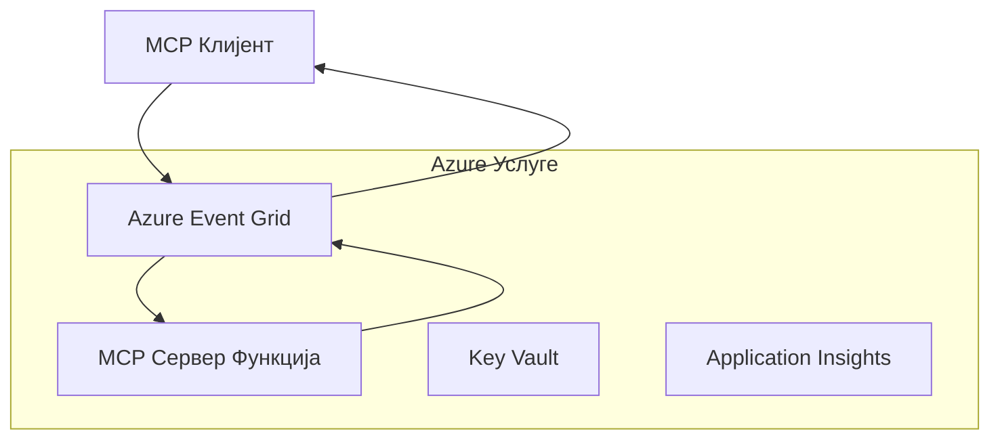
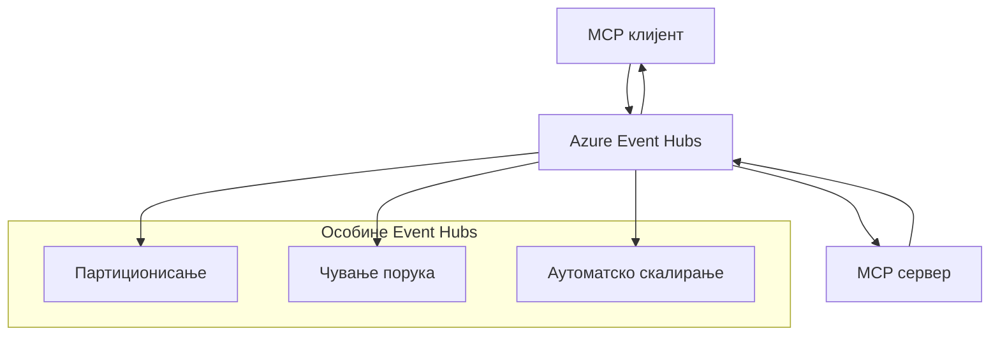

# MCP Прилагођени Транспорт - Водич за Напредну Имплементацију

Протокол Контекста Модела (MCP) пружа флексибилност у механизмима транспорта, омогућавајући прилагођене имплементације за специјализована предузећа окружења. Овај напредни водич истражује прилагођене транспортне имплементације користећи Azure Event Grid и Azure Event Hubs као практичне примере за израду скалабилних, облачно-родних MCP решења.

> **Гледајући унапред:** овај водич је написан према **MCP Спецификацији 2025-11-25**, где се наредност сесије мора очувати по сесији (погледајте Протокол Порука доле). Кандидат за издање `2026-07-28` у потпуности уклања протоколску сесију и захтева `Mcp-Method`/`Mcp-Name` заглавља како би гатеваи-ји и прилагођени транспорти могли усмеравати по захтеву уместо по сесији. Погледајте [Шта се мења у MCP: Кандидат за издање 2026-07-28](../../01-CoreConcepts/mcp-2026-07-28-release-candidate.md).

## Увод

Док MCP стандардни транспорти (stdio и HTTP стриминг) служе већини случајева употребе, предузећа често захтевају специјализоване транспортне механизме за побољшану скалабилност, поузданост и интеграцију са постојећом облачном инфраструктуром. Прилагођени транспорти омогућавају MCP-у да искористи облачно-родне услуге размене порука за асинхрону комуникацију, догађаје вођене архитектуре и дистрибуирано процесирање.

Овај час истражује напредне транспортне имплементације засноване на најновијој MCP спецификацији (2025-11-25), Azure услугама размене порука и устаљеним предузетничким интеграционим паттернима.

### **MCP Транспортна Архитектура**

**Из MCP Спецификације (2025-11-25):**

- **Стандардни Транспорти**: stdio (препоручено), HTTP стриминг (за удаљене сценарије)
- **Прилагођени Транспорти**: Било који транспорт који имплементира MCP протокол размене порука
- **Формат Поруке**: JSON-RPC 2.0 са MCP-специфичним проширењима
- **Двуосмерна Комуникација**: Потребна је пунодуплекс комуникација за нотификације и одговоре

## Циљеви Ученија

До краја овог напредног часа, моћи ћете да:

- **Разумете Захтеве Прилагођеног Транспорта**: Имплементирајте MCP протокол преко било ког транспортног слоја уз одржавање усклађености
- **Направите Azure Event Grid Транспорт**: Креирајте MCP сервере вођене догађајима користећи Azure Event Grid за серверлес скалабилност
- **Имплементирајте Azure Event Hubs Транспорт**: Дизајнирајте MCP решења високог протока користећи Azure Event Hubs за стриминг у реалном времену
- **Примените Предузетничке Паттерне**: Интегришите прилагођене транспорте са постојећом Azure инфраструктуром и моделима безбедности
- **Решите Поузданост Транспорта**: Имплементирајте издржљивост порука, наручивање и руковање грешкама за предузетничке сценарије
- **Оптимизујте Перформансе**: Дизајнирајте транспортна решења за захтеве скале, латенције и пропусности

## **Захтеви за Транспорт**

### **Основни Захтеви из MCP Спецификације (2025-11-25):**

```yaml
Message Protocol:
  format: "JSON-RPC 2.0 with MCP extensions"
  bidirectional: "Full duplex communication required"
  ordering: "Message ordering must be preserved per session"
  
Transport Layer:
  reliability: "Transport MUST handle connection failures gracefully"
  security: "Transport MUST support secure communication"
  identification: "Each session MUST have unique identifier"
  
Custom Transport:
  compliance: "MUST implement complete MCP message exchange"
  extensibility: "MAY add transport-specific features"
  interoperability: "MUST maintain protocol compatibility"
```

## **Имплементација Azure Event Grid Транспорта**

Azure Event Grid пружа серверлес сервис усмеравanja догађаја идеалан за MCP архитектуре вођене догађајима. Ова имплементација демонстрира како изградити скалабилне, лабаво повезане MCP системе.

### **Преглед Архитектуре**



### **C# Имплементација - Event Grid Транспорт**

```csharp
using Azure.Messaging.EventGrid;
using Microsoft.Extensions.Azure;
using System.Text.Json;

public class EventGridMcpTransport : IMcpTransport
{
    private readonly EventGridPublisherClient _publisher;
    private readonly string _topicEndpoint;
    private readonly string _clientId;
    
    public EventGridMcpTransport(string topicEndpoint, string accessKey, string clientId)
    {
        _publisher = new EventGridPublisherClient(
            new Uri(topicEndpoint), 
            new AzureKeyCredential(accessKey));
        _topicEndpoint = topicEndpoint;
        _clientId = clientId;
    }
    
    public async Task SendMessageAsync(McpMessage message)
    {
        var eventGridEvent = new EventGridEvent(
            subject: $"mcp/{_clientId}",
            eventType: "MCP.MessageReceived",
            dataVersion: "1.0",
            data: JsonSerializer.Serialize(message))
        {
            Id = Guid.NewGuid().ToString(),
            EventTime = DateTimeOffset.UtcNow
        };
        
        await _publisher.SendEventAsync(eventGridEvent);
    }
    
    public async Task<McpMessage> ReceiveMessageAsync(CancellationToken cancellationToken)
    {
        // Event Grid is push-based, so implement webhook receiver
        // This would typically be handled by Azure Functions trigger
        throw new NotImplementedException("Use EventGridTrigger in Azure Functions");
    }
}

// Azure Function for receiving Event Grid events
[FunctionName("McpEventGridReceiver")]
public async Task<IActionResult> HandleEventGridMessage(
    [EventGridTrigger] EventGridEvent eventGridEvent,
    ILogger log)
{
    try
    {
        var mcpMessage = JsonSerializer.Deserialize<McpMessage>(
            eventGridEvent.Data.ToString());
        
        // Process MCP message
        var response = await _mcpServer.ProcessMessageAsync(mcpMessage);
        
        // Send response back via Event Grid
        await _transport.SendMessageAsync(response);
        
        return new OkResult();
    }
    catch (Exception ex)
    {
        log.LogError(ex, "Error processing Event Grid MCP message");
        return new BadRequestResult();
    }
}
```

### **TypeScript Имплементација - Event Grid Транспорт**

```typescript
import { EventGridPublisherClient, AzureKeyCredential } from "@azure/eventgrid";
import { McpTransport, McpMessage } from "./mcp-types";

export class EventGridMcpTransport implements McpTransport {
    private publisher: EventGridPublisherClient;
    private clientId: string;
    
    constructor(
        private topicEndpoint: string,
        private accessKey: string,
        clientId: string
    ) {
        this.publisher = new EventGridPublisherClient(
            topicEndpoint,
            new AzureKeyCredential(accessKey)
        );
        this.clientId = clientId;
    }
    
    async sendMessage(message: McpMessage): Promise<void> {
        const event = {
            id: crypto.randomUUID(),
            source: `mcp-client-${this.clientId}`,
            type: "MCP.MessageReceived",
            time: new Date(),
            data: message
        };
        
        await this.publisher.sendEvents([event]);
    }
    
    // Догађајно вођени пријем путем Azure Functions
    onMessage(handler: (message: McpMessage) => Promise<void>): void {
        // Имплементација би користила Azure Functions Event Grid тригер
        // Ово је концептуални интерфејс за примаоца webhook-а
    }
}

// Azure Functions имплементација
import { app, InvocationContext, EventGridEvent } from "@azure/functions";

app.eventGrid("mcpEventGridHandler", {
    handler: async (event: EventGridEvent, context: InvocationContext) => {
        try {
            const mcpMessage = event.data as McpMessage;
            
            // Обрада MCP поруке
            const response = await mcpServer.processMessage(mcpMessage);
            
            // Слање одговора путем Event Grid-а
            await transport.sendMessage(response);
            
        } catch (error) {
            context.error("Error processing MCP message:", error);
            throw error;
        }
    }
});
```

### **Python Имплементација - Event Grid Транспорт**

```python
from azure.eventgrid import EventGridPublisherClient, EventGridEvent
from azure.core.credentials import AzureKeyCredential
import asyncio
import json
from typing import Callable, Optional
import uuid
from datetime import datetime

class EventGridMcpTransport:
    def __init__(self, topic_endpoint: str, access_key: str, client_id: str):
        self.client = EventGridPublisherClient(
            topic_endpoint, 
            AzureKeyCredential(access_key)
        )
        self.client_id = client_id
        self.message_handler: Optional[Callable] = None
    
    async def send_message(self, message: dict) -> None:
        """Send MCP message via Event Grid"""
        event = EventGridEvent(
            data=message,
            subject=f"mcp/{self.client_id}",
            event_type="MCP.MessageReceived",
            data_version="1.0"
        )
        
        await self.client.send(event)
    
    def on_message(self, handler: Callable[[dict], None]) -> None:
        """Register message handler for incoming events"""
        self.message_handler = handler

# Имплементација Azure Functions
import azure.functions as func
import logging

def main(event: func.EventGridEvent) -> None:
    """Azure Functions Event Grid trigger for MCP messages"""
    try:
        # Парсирај MCP поруку из Event Grid догађаја
        mcp_message = json.loads(event.get_body().decode('utf-8'))
        
        # Обради MCP поруку
        response = process_mcp_message(mcp_message)
        
        # Пошаљи одговор назад преко Event Grid
        # (Имплементација би креирала новог Event Grid клијента)
        
    except Exception as e:
        logging.error(f"Error processing MCP Event Grid message: {e}")
        raise
```

## **Имплементација Azure Event Hubs Транспорта**

Azure Event Hubs пружа могућности стриминга високог протока и рада у реалном времену за MCP сценарије које захтевају ниску латенцију и велики обим порука.

### **Преглед Архитектуре**



### **C# Имплементација - Event Hubs Транспорт**

```csharp
using Azure.Messaging.EventHubs;
using Azure.Messaging.EventHubs.Producer;
using Azure.Messaging.EventHubs.Consumer;
using System.Text;

public class EventHubsMcpTransport : IMcpTransport, IDisposable
{
    private readonly EventHubProducerClient _producer;
    private readonly EventHubConsumerClient _consumer;
    private readonly string _consumerGroup;
    private readonly CancellationTokenSource _cancellationTokenSource;
    
    public EventHubsMcpTransport(
        string connectionString, 
        string eventHubName,
        string consumerGroup = "$Default")
    {
        _producer = new EventHubProducerClient(connectionString, eventHubName);
        _consumer = new EventHubConsumerClient(
            consumerGroup, 
            connectionString, 
            eventHubName);
        _consumerGroup = consumerGroup;
        _cancellationTokenSource = new CancellationTokenSource();
    }
    
    public async Task SendMessageAsync(McpMessage message)
    {
        var messageBody = JsonSerializer.Serialize(message);
        var eventData = new EventData(Encoding.UTF8.GetBytes(messageBody));
        
        // Add MCP-specific properties
        eventData.Properties.Add("MessageType", message.Method ?? "response");
        eventData.Properties.Add("MessageId", message.Id);
        eventData.Properties.Add("Timestamp", DateTimeOffset.UtcNow);
        
        await _producer.SendAsync(new[] { eventData });
    }
    
    public async Task StartReceivingAsync(
        Func<McpMessage, Task> messageHandler)
    {
        await foreach (PartitionEvent partitionEvent in _consumer.ReadEventsAsync(
            _cancellationTokenSource.Token))
        {
            try
            {
                var messageBody = Encoding.UTF8.GetString(
                    partitionEvent.Data.EventBody.ToArray());
                var mcpMessage = JsonSerializer.Deserialize<McpMessage>(messageBody);
                
                await messageHandler(mcpMessage);
            }
            catch (Exception ex)
            {
                // Handle deserialization or processing errors
                Console.WriteLine($"Error processing message: {ex.Message}");
            }
        }
    }
    
    public void Dispose()
    {
        _cancellationTokenSource?.Cancel();
        _producer?.DisposeAsync().AsTask().Wait();
        _consumer?.DisposeAsync().AsTask().Wait();
        _cancellationTokenSource?.Dispose();
    }
}
```

### **TypeScript Имплементација - Event Hubs Транспорт**

```typescript
import { 
    EventHubProducerClient, 
    EventHubConsumerClient, 
    EventData 
} from "@azure/event-hubs";

export class EventHubsMcpTransport implements McpTransport {
    private producer: EventHubProducerClient;
    private consumer: EventHubConsumerClient;
    private isReceiving = false;
    
    constructor(
        private connectionString: string,
        private eventHubName: string,
        private consumerGroup: string = "$Default"
    ) {
        this.producer = new EventHubProducerClient(
            connectionString, 
            eventHubName
        );
        this.consumer = new EventHubConsumerClient(
            consumerGroup,
            connectionString,
            eventHubName
        );
    }
    
    async sendMessage(message: McpMessage): Promise<void> {
        const eventData: EventData = {
            body: JSON.stringify(message),
            properties: {
                messageType: message.method || "response",
                messageId: message.id,
                timestamp: new Date().toISOString()
            }
        };
        
        await this.producer.sendBatch([eventData]);
    }
    
    async startReceiving(
        messageHandler: (message: McpMessage) => Promise<void>
    ): Promise<void> {
        if (this.isReceiving) return;
        
        this.isReceiving = true;
        
        const subscription = this.consumer.subscribe({
            processEvents: async (events, context) => {
                for (const event of events) {
                    try {
                        const messageBody = event.body as string;
                        const mcpMessage: McpMessage = JSON.parse(messageBody);
                        
                        await messageHandler(mcpMessage);
                        
                        // Ажурирај контролну тачку за доставу најмање једном
                        await context.updateCheckpoint(event);
                    } catch (error) {
                        console.error("Error processing Event Hubs message:", error);
                    }
                }
            },
            processError: async (err, context) => {
                console.error("Event Hubs error:", err);
            }
        });
    }
    
    async close(): Promise<void> {
        this.isReceiving = false;
        await this.producer.close();
        await this.consumer.close();
    }
}
```

### **Python Имплементација - Event Hubs Транспорт**

```python
from azure.eventhub import EventHubProducerClient, EventHubConsumerClient
from azure.eventhub import EventData
import json
import asyncio
from typing import Callable, Dict, Any
import logging

class EventHubsMcpTransport:
    def __init__(
        self, 
        connection_string: str, 
        eventhub_name: str,
        consumer_group: str = "$Default"
    ):
        self.producer = EventHubProducerClient.from_connection_string(
            connection_string, 
            eventhub_name=eventhub_name
        )
        self.consumer = EventHubConsumerClient.from_connection_string(
            connection_string,
            consumer_group=consumer_group,
            eventhub_name=eventhub_name
        )
        self.is_receiving = False
    
    async def send_message(self, message: Dict[str, Any]) -> None:
        """Send MCP message via Event Hubs"""
        event_data = EventData(json.dumps(message))
        
        # Додај својства специфична за MCP
        event_data.properties = {
            "messageType": message.get("method", "response"),
            "messageId": message.get("id"),
            "timestamp": "2025-01-14T10:30:00Z"  # Користи стварно време
        }
        
        async with self.producer:
            event_data_batch = await self.producer.create_batch()
            event_data_batch.add(event_data)
            await self.producer.send_batch(event_data_batch)
    
    async def start_receiving(
        self, 
        message_handler: Callable[[Dict[str, Any]], None]
    ) -> None:
        """Start receiving MCP messages from Event Hubs"""
        if self.is_receiving:
            return
        
        self.is_receiving = True
        
        async with self.consumer:
            await self.consumer.receive(
                on_event=self._on_event_received(message_handler),
                starting_position="-1"  # Почни од почетка
            )
    
    def _on_event_received(self, handler: Callable):
        """Internal event handler wrapper"""
        async def handle_event(partition_context, event):
            try:
                # Анализирај MCP поруку из догађаја Event Hubs
                message_body = event.body_as_str(encoding='UTF-8')
                mcp_message = json.loads(message_body)
                
                # Обради MCP поруку
                await handler(mcp_message)
                
                # Ажурирај контролну тачку за доставу бар једном
                await partition_context.update_checkpoint(event)
                
            except Exception as e:
                logging.error(f"Error processing Event Hubs message: {e}")
        
        return handle_event
    
    async def close(self) -> None:
        """Clean up transport resources"""
        self.is_receiving = False
        await self.producer.close()
        await self.consumer.close()
```

## **Напредни Транспортни Паттерни**

### **Издржљивост и Поузданост Порука**

```csharp
// Implementing message durability with retry logic
public class ReliableTransportWrapper : IMcpTransport
{
    private readonly IMcpTransport _innerTransport;
    private readonly RetryPolicy _retryPolicy;
    
    public async Task SendMessageAsync(McpMessage message)
    {
        await _retryPolicy.ExecuteAsync(async () =>
        {
            try
            {
                await _innerTransport.SendMessageAsync(message);
            }
            catch (TransportException ex) when (ex.IsRetryable)
            {
                // Log and retry
                throw;
            }
        });
    }
}
```

### **Интеграција Безбедности Транспорта**

```csharp
// Integrating Azure Key Vault for transport security
public class SecureTransportFactory
{
    private readonly SecretClient _keyVaultClient;
    
    public async Task<IMcpTransport> CreateEventGridTransportAsync()
    {
        var accessKey = await _keyVaultClient.GetSecretAsync("EventGridAccessKey");
        var topicEndpoint = await _keyVaultClient.GetSecretAsync("EventGridTopic");
        
        return new EventGridMcpTransport(
            topicEndpoint.Value.Value,
            accessKey.Value.Value,
            Environment.MachineName
        );
    }
}
```

### **Надзор и Опсервабилност Транспорта**

```csharp
// Adding telemetry to custom transports
public class ObservableTransport : IMcpTransport
{
    private readonly IMcpTransport _transport;
    private readonly ILogger _logger;
    private readonly TelemetryClient _telemetryClient;
    
    public async Task SendMessageAsync(McpMessage message)
    {
        using var activity = Activity.StartActivity("MCP.Transport.Send");
        activity?.SetTag("transport.type", "EventGrid");
        activity?.SetTag("message.method", message.Method);
        
        var stopwatch = Stopwatch.StartNew();
        
        try
        {
            await _transport.SendMessageAsync(message);
            
            _telemetryClient.TrackDependency(
                "EventGrid",
                "SendMessage",
                DateTime.UtcNow.Subtract(stopwatch.Elapsed),
                stopwatch.Elapsed,
                true
            );
        }
        catch (Exception ex)
        {
            _telemetryClient.TrackException(ex);
            throw;
        }
    }
}
```

## **Сценарији Предузетничке Интеграције**

### **Сценарио 1: Дистрибуирано MCP Процесирање**

Коришћење Azure Event Grid за дистрибуцију MCP захтева преко више нодова за процесирање:

```yaml
Architecture:
  - MCP Client sends requests to Event Grid topic
  - Multiple Azure Functions subscribe to process different tool types
  - Results aggregated and returned via separate response topic
  
Benefits:
  - Horizontal scaling based on message volume
  - Fault tolerance through redundant processors
  - Cost optimization with serverless compute
```

### **Сценарио 2: MCP Стриминг у Реалном Времену**

Коришћење Azure Event Hubs за интеракције високог фреквенцијског MCP:

```yaml
Architecture:
  - MCP Client streams continuous requests via Event Hubs
  - Stream Analytics processes and routes messages
  - Multiple consumers handle different aspect of processing
  
Benefits:
  - Low latency for real-time scenarios
  - High throughput for batch processing
  - Built-in partitioning for parallel processing
```

### **Сценарио 3: Хибридна Транспортна Архитектура**

Комбиновање више транспорта за различите случајеве употребе:

```csharp
public class HybridMcpTransport : IMcpTransport
{
    private readonly IMcpTransport _realtimeTransport; // Event Hubs
    private readonly IMcpTransport _batchTransport;    // Event Grid
    private readonly IMcpTransport _fallbackTransport; // HTTP Streaming
    
    public async Task SendMessageAsync(McpMessage message)
    {
        // Route based on message characteristics
        var transport = message.Method switch
        {
            "tools/call" when IsRealtime(message) => _realtimeTransport,
            "resources/read" when IsBatch(message) => _batchTransport,
            _ => _fallbackTransport
        };
        
        await transport.SendMessageAsync(message);
    }
}
```

## **Оптимизација Перформанси**

### **Груписање Порука за Event Grid**

```csharp
public class BatchingEventGridTransport : IMcpTransport
{
    private readonly List<McpMessage> _messageBuffer = new();
    private readonly Timer _flushTimer;
    private const int MaxBatchSize = 100;
    
    public async Task SendMessageAsync(McpMessage message)
    {
        lock (_messageBuffer)
        {
            _messageBuffer.Add(message);
            
            if (_messageBuffer.Count >= MaxBatchSize)
            {
                _ = Task.Run(FlushMessages);
            }
        }
    }
    
    private async Task FlushMessages()
    {
        List<McpMessage> toSend;
        lock (_messageBuffer)
        {
            toSend = new List<McpMessage>(_messageBuffer);
            _messageBuffer.Clear();
        }
        
        if (toSend.Any())
        {
            var events = toSend.Select(CreateEventGridEvent);
            await _publisher.SendEventsAsync(events);
        }
    }
}
```

### **Стратегија Партиционисања за Event Hubs**

```csharp
public class PartitionedEventHubsTransport : IMcpTransport
{
    public async Task SendMessageAsync(McpMessage message)
    {
        // Partition by client ID for session affinity
        var partitionKey = ExtractClientId(message);
        
        var eventData = new EventData(JsonSerializer.SerializeToUtf8Bytes(message))
        {
            PartitionKey = partitionKey
        };
        
        await _producer.SendAsync(new[] { eventData });
    }
}
```

## **Тестирање Прилагођених Транспорта**

### **Јединично Тестирање са Тест Дупликатима**

```csharp
[Test]
public async Task EventGridTransport_SendMessage_PublishesCorrectEvent()
{
    // Arrange
    var mockPublisher = new Mock<EventGridPublisherClient>();
    var transport = new EventGridMcpTransport(mockPublisher.Object);
    var message = new McpMessage { Method = "tools/list", Id = "test-123" };
    
    // Act
    await transport.SendMessageAsync(message);
    
    // Assert
    mockPublisher.Verify(
        x => x.SendEventAsync(
            It.Is<EventGridEvent>(e => 
                e.EventType == "MCP.MessageReceived" &&
                e.Subject == "mcp/test-client"
            )
        ),
        Times.Once
    );
}
```

### **Интеграционо Тестирање са Azure Test Containers**

```csharp
[Test]
public async Task EventHubsTransport_IntegrationTest()
{
    // Using Testcontainers for integration testing
    var eventHubsContainer = new EventHubsContainer()
        .WithEventHub("test-hub");
    
    await eventHubsContainer.StartAsync();
    
    var transport = new EventHubsMcpTransport(
        eventHubsContainer.GetConnectionString(),
        "test-hub"
    );
    
    // Test message round-trip
    var sentMessage = new McpMessage { Method = "test", Id = "123" };
    McpMessage receivedMessage = null;
    
    await transport.StartReceivingAsync(msg => {
        receivedMessage = msg;
        return Task.CompletedTask;
    });
    
    await transport.SendMessageAsync(sentMessage);
    await Task.Delay(1000); // Allow for message processing
    
    Assert.That(receivedMessage?.Id, Is.EqualTo("123"));
}
```

## **Најбоље Практике и Упутства**

### **Принципи Дизајна Транспорта**

1. **Идeмпотентност**: Обезбедите да обрада порука буде идемпотентна за руковање дупликатима
2. **Руковање Грешкама**: Имплементирајте свеобухватно руковање грешкама и редове мртвих порука
3. **Надзор**: Додајте детаљну телеметрију и провере здравља
4. **Безбедност**: Користите управљане идентитете и приступ најмањих привилегија
5. **Перформансе**: Дизајнирајте у складу са специфичним захтевима за латенцију и пропусност

### **Azure-Специфичне Препоруке**

1. **Користите Управљани Идентитет**: Избегавајте стрингове за везу у продукцији
2. **Имплементирајте Прекидаче Колa**: Заштитите се од прекида у Azure услугама
3. **Пратите Трошкове**: Пратите обим порука и трошкове процесирања
4. **Планирајте за Скалу**: Рано дизајнирајте стратегије партиционисања и скалирања
5. **Тестирајте Темељно**: Користите Azure DevTest Labs за свеобухватно тестирање

## **Закључак**

Прилагођени MCP транспорти омогућавају моћне предузетничке сценарије користећи Azure услуге размене порука. Имплементирајући Event Grid или Event Hubs транспорте, можете изградити скалабилна, поуздана MCP решења која се неприметно интегришу са постојећом Azure инфраструктуром.

Примерi наведени приказују производно спремне паттерне за имплементацију прилагођених транспорта уз одржавање усаглашености са MCP протоколом и Azure најбољим праксама.

## **Додатни Ресурси**

- [MCP Спецификација 2025-11-25](https://modelcontextprotocol.io/specification/2025-11-25/)
- [Документација Azure Event Grid](https://docs.microsoft.com/azure/event-grid/)
- [Документација Azure Event Hubs](https://docs.microsoft.com/azure/event-hubs/)
- [Azure Functions Event Grid Триггер](https://docs.microsoft.com/azure/azure-functions/functions-bindings-event-grid)
- [Azure SDK за .NET](https://github.com/Azure/azure-sdk-for-net)
- [Azure SDK за TypeScript](https://github.com/Azure/azure-sdk-for-js)
- [Azure SDK за Python](https://github.com/Azure/azure-sdk-for-python)

---

> *Овај водич се фокусира на практичне имплементационе паттерне за производне MCP системе. Увек валидајте имплементације транспорта према вашим специфичним захтевима и ограничењима Azure услуга.*
> **Тренутни Стандард**: Овај водич одражава [MCP Спецификацију 2025-11-25](https://modelcontextprotocol.io/specification/2025-11-25/) захтеве за транспорт и напредне транспортне паттерне за предузетничка окружења.


## Шта Следи
- [6. Заједнички Доприноси](../../06-CommunityContributions/README.md)

---

<!-- CO-OP TRANSLATOR DISCLAIMER START -->
**Изјава о одрицању одговорности**:
Овај документ је преведен коришћењем услуге за аутоматски превод [Co-op Translator](https://github.com/Azure/co-op-translator). Иако тежимо тачности, имајте у виду да аутоматски преводи могу садржати грешке или нетачности. Оригинални документ на његовом изворном језику треба сматрати ауторитативним извором. За критичне информације препоручује се професионални људски превод. Нисмо одговорни за било каква неспоразума или погрешна тумачења која произилазе из коришћења овог превода.
<!-- CO-OP TRANSLATOR DISCLAIMER END -->