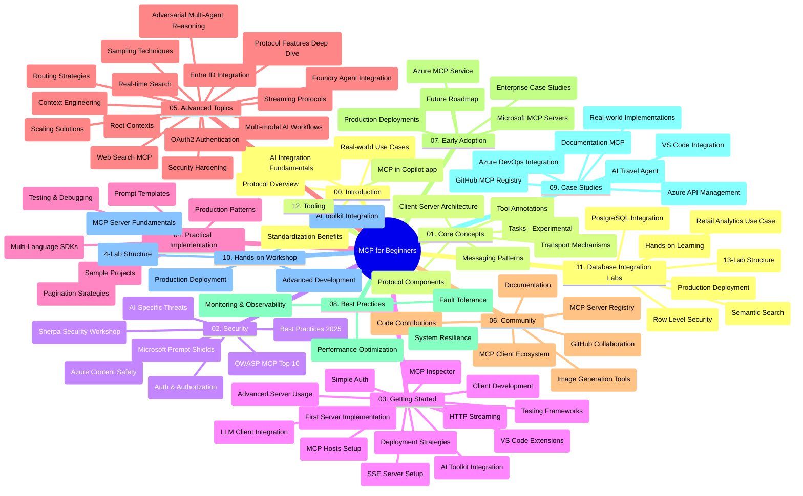

# Протокол Контекста Модела (MCP) за Почетнике - Водич за учење

Овај водич за учење пружа преглед структуре и садржаја репозиторијума за курс "Протокол Контекста Модела (MCP) за Почетнике". Користите овај водич да ефикасно навигирате кроз репозиторијум и максимално искористите доступне ресурсе.

## Преглед Репозиторијума

Протокол Контекста Модела (MCP) је стандардизовани оквир за интеракције између AI модела и клијент апликација. Првобитно креиран од стране Anthropic-a, MCP сада одржава широка заједница MCP-а преко званичне организације на GitHub-у. Овај репозиторијум пружа свеобухватни курс са практичним примерима кода у C#, Java, JavaScript, Python и TypeScript, дизајниран за AI програмере, архитекте система и инжењере софтвера.

## Визуелна Мапа Курса

## Структура Репозиторијума

Репозиторијум је организован у дванаест главних секција, од којих се свака фокусира на различите аспекте MCP-а:

1. **Увод (00-Introduction/)**
   - Преглед Протокола Контекста Модела
   - Зашто је стандардизација важна у AI процесима
   - Практичне примере и користи

2. **Основни Концепти (01-CoreConcepts/)**
   - Клијент-сервер архитектура
   - Кључне компоненте протокола
   - Обрасци слања порука у MCP-у
   - Поглед у будућност: [Шта се мења у MCP-у: Кандидат за издање 2026-07-28](./01-CoreConcepts/mcp-2026-07-28-release-candidate.md) — бездржавни језгро протокола, оквир екстензија и очекиване депрекације Roots/Sampling/Logging у следећој верзији спецификације

3. **Безбедност (02-Security/)**
   - Безбедносне претње у системима заснованим на MCP-у
   - Најбоље праксе за обезбеђивање имплементација
   - Стратегије аутентификације и ауторизације
   - **Обимна безбедносна документација**:
     - Најбоље праксе безбедности MCP 2025
     - Водич за имплементацију заштите садржаја Azure
     - MCP контроле и технике безбедности
     - Брзи референтни водич најбољих пракси MCP
   - **Кључне безбедносне теме**:
     - Напади убризгавања упита и тровања алата
     - Отмица сесија и проблеми са збуњеним заменицама
     - Резалти улаза токена
     - Прекомерне дозволе и контролa приступа
     - Безбедност ланца снабдевања AI компоненти
     - Интеграција Microsoft Prompt Shields

4. **Почетак рада (03-GettingStarted/)**
   - Подешавање и конфигурација окружења
   - Креирање основних MCP сервера и клијената
   - Интеграција са постојећим апликацијама
   - Обухвата секције за:
     - Прва имплементација сервера
     - Развој клијента
     - Интеграција LLM клијента
     - Интеграција у VS Code
     - Сервер Слања Догађаја (SSE)
     - Напредна употреба сервера
     - HTTP стриминг
     - Интеграција AI Toolkit-а
     - Стратегије тестирања
     - Упутства за распоређивање

5. **Практична Имплементација (04-PracticalImplementation/)**
   - Коришћење SDK-а у различитим програмским језицима
   - Технике отклањања грешака, тестирања и валидације
   - Креирање поновљивих шаблона упита и радних токова
   - Пример пројеката са примерима имплементације

6. **Напредне Теме (05-AdvancedTopics/)**
   - Технике инжењеринга контекста
   - Интеграција Foundry агента
   - Мултимодални AI радни токови
   - Демо-аутентификације са OAuth2
   - Могућности претраживања у реалном времену
   - Стриминг у реалном времену
   - Имплементација Root контекста
   - Стратегије усмеравања
   - Технике узорковања
   - Приступи скалабилности
   - Безбедносна разматрања
   - Интеграција безбедности Entra ID
   - Интеграција веб претраге
   - Адверзијални мулти-агент разлози (обрасци дебате)

7. **Заједнички Доприноси (06-CommunityContributions/)**
   - Како допринети коду и документацији
   - Сарадња преко GitHub-а
   - Побољшања и повратне информације подржане заједницом
   - Коришћење различитих MCP клијената (Claude Desktop, Cline, VSCode)
   - Рад са популарним MCP серверима укључујући генерисање слика

8. **Поуке из Ране Употребе (07-LessonsfromEarlyAdoption/)**
   - Имплементације у стварном свету и успешне приче
   - Креирање и распоређивање решења заснованих на MCP-у
   - Трендови и будућа мапа пута
   - **Водич за Microsoft MCP сервере**: Обухватан водич за 10 производно спремних Microsoft MCP сервера укључујући:
     - Microsoft Learn Docs MCP сервер
     - Azure MCP сервер (15+ специјализованих конектора)
     - GitHub MCP сервер
     - Azure DevOps MCP сервер
     - MarkItDown MCP сервер
     - SQL Server MCP сервер
     - Playwright MCP сервер
     - Dev Box MCP сервер
     - Microsoft Foundry MCP сервер
     - Microsoft 365 Agents Toolkit MCP сервер

9. **Најбоље Праксе (08-BestPractices/)**
   - Подешавање перформанси и оптимизација
   - Дизајн MCP система отпорних на грешке
   - Стратегије тестирања и отпорности

10. **Студије Случаја (09-CaseStudy/)**
    - **Седам свеобухватних студија случаја** које показују свестраност MCP-а у различитим сценаријима:
    - **Azure AI Travel Agents**: Мулти-агентска оркестрација са Azure OpenAI и AI Search-ом
    - **Интеграција Azure DevOps-а**: Аутоматизација процеса радног тока са ажурирањима података са YouTube-а
    - **Претрага докумената у реалном времену**: Python конзолни клијент са стриминг HTTP-ом
    - **Интерактивни генератор плана учења**: Chainlit веб апликација са конверзационим AI-јем
    - **Документација у уређивачу**: Интеграција у VS Code са GitHub Copilot радним токовима
    - **Azure API Management**: Ентерпрајз API интеграција са креирањем MCP сервера
    - **GitHub MCP Registry**: Платформа за развој екосистема и агентску интеграцију
    - Пример имплементација обухватајући ентерпрајз интеграцију, продуктивност програмера и развој екосистема

11. **Практична Радионица (10-StreamliningAIWorkflowsBuildingAnMCPServerWithAIToolkit/)**
    - Свеобухватна практична радионица која комбинује MCP и AI Toolkit
    - Креирање интелигентних апликација које повезују AI моделе са алатима из стварног света
    - Практични модули који покривају основе, развој прилагођених сервера и стратешко распоређивање у продукцији
    - **Структура лабораторијских вежби**:
      - Лабораторија 1: Основе MCP сервера
      - Лабораторија 2: Напредни развој MCP сервера
      - Лабораторија 3: Интеграција AI Toolkit-а
      - Лабораторија 4: Распоређивање у продукцији и скалирање
    - Приступ учењу заснован на лабораторијским вежбама са упутствима корак по корак

12. **MCP Сервер Лабораторије за Интеграцију Базе Података (11-MCPServerHandsOnLabs/)**
    - **Свеобухватан пут учења са 13 лабораторијских вежби** за креирање производно спремних MCP сервера са PostgreSQL интеграцијом
    - **Имплементација аналитике малопродаје из стварног света** користећи пример Zava Retail
    - **Обрасци ентерпрајз класе** укључујућиБезбедност на нивоу редова (RLS), семантичку претрагу и приступ подацима више корисника
    - **Комплетна структура лабораторија**:
      - **Лабораторије 00-03: Основа** - Увод, Архитектура, Безбедност, Подешавање окружења
      - **Лабораторије 04-06: Креирање MCP сервера** - Дизајн базе података, Имплементација MCP сервера, Развој алата
      - **Лабораторије 07-09: Напредне Функције** - Семантичка претрага, Тестирање и отклањање грешака, Интеграција са VS Code
      - **Лабораторије 10-12: Продукција и Најбоље Праксе** - Распоређивање, Мониторинг, Оптимизација
    - **Обухваћене технологије**: FastMCP оквир, PostgreSQL, Azure OpenAI, Azure Container Apps, Application Insights
    - **Циљеви учења**: Производно спремни MCP сервери, обрасци интеграције базе података, аналитика покретана AI-јем, безбедност ентерпрајз класе

13. **Алати (12-tooling/)**
    - Научите како да користите MCP у апликацији Copilot и другим алатима

## Додатни Ресурси

Репозиторијум укључује пратеће ресурсе:

- **Фолдер слика**: Садржи дијаграме и илустрације коришћене кроз курс
- **Преводи**: Подршка више језика са аутоматизованим преводима документације
- **Званични MCP Ресурси**:
  - [MCP Документација](https://modelcontextprotocol.io/)
  - [MCP Спецификација](https://spec.modelcontextprotocol.io/)
  - [MCP GitHub Репозиторијум](https://github.com/modelcontextprotocol)

## Како Користити Овај Репозиторијум

1. **Секвенцијално учење**: Пратите поглавља по редоследу (од 00 до 11) за структуриран преглед.
2. **Фокус на одређени језик**: Ако вас занима неки посебан програмски језик, истражите директоријуме са примерима за имплементације на том језику.
3. **Практична имплементација**: Почните са секцијом "Почетак рада" да бисте подесили окружење и креирали први MCP сервер и клијента.
4. **Напредна истраживања**: Када савладате основе, уроните у напредне теме да бисте проширили своје знање.
5. **Укључивање у заједницу**: Придружите се MCP заједници кроз GitHub дискусије и Discord канале да се повежете са експертима и колегама програмерима.

## MCP Клијенти и Алати

Курс покрива различите MCP клијенте и алате:

1. **Званични клијенти**:
   - Visual Studio Code
   - MCP у Visual Studio Code
   - Claude Desktop
   - Claude у VSCode
   - Claude API

2. **Клијенти заједнице**:
   - Cline (терминалски)
   - Cursor (уређивач кода)
   - ChatMCP
   - Windsurf

3. **MCP алати за управљање**:
   - MCP CLI
   - MCP Manager
   - MCP Linker
   - MCP Router

## Популарни MCP Сервери

Репозиторијум представља разне MCP сервере, укључујући:

1. **Званични Microsoft MCP сервери**:
   - Microsoft Learn Docs MCP сервер
   - Azure MCP сервер (15+ специјализованих конектора)
   - GitHub MCP сервер
   - Azure DevOps MCP сервер
   - MarkItDown MCP сервер
   - SQL Server MCP сервер
   - Playwright MCP сервер
   - Dev Box MCP сервер
   - Microsoft Foundry MCP сервер
   - Microsoft 365 Agents Toolkit MCP сервер

2. **Званични референтни сервери**:
   - Фајл систем
   - Fetch
   - Memory
   - Sequential Thinking

3. **Генерисање слика**:
   - Azure OpenAI DALL-E 3
   - Stable Diffusion WebUI
   - Replicate

4. **Развојни алати**:
   - Git MCP
   - Terminal Control
   - Code Assistant

5. **Специјализовани сервери**:
   - Salesforce
   - Microsoft Teams
   - Jira & Confluence

## Доприноси

Овај репозиторијум поздравља доприносе заједнице. Погледајте одељак Заједнички Доприноси за смернице како ефикасно допринети MCP екосистему.

----

*Овај водич за учење последњи пут је ажуриран 5. фебруара 2026, рефлектујући најновију MCP Спецификацију 2025-11-25 и пружа преглед репозиторијума закључно са тим датумом. Садржај репозиторијума може бити ажуриран након тог датума.*

*Додатак (2. јул 2026): Додато је поглавље о `2026-07-28` MCP спецификацији Кандидата за издање у оквиру [01-CoreConcepts](./01-CoreConcepts/mcp-2026-07-28-release-candidate.md); основа курикулума остаје 2025-11-25 док се не објави нова спецификација.*

---

<!-- CO-OP TRANSLATOR DISCLAIMER START -->
**Изјава о одрицању одговорности**:
Овај документ је преведен коришћењем услуге за аутоматски превод [Co-op Translator](https://github.com/Azure/co-op-translator). Иако тежимо тачности, имајте у виду да аутоматски преводи могу садржати грешке или нетачности. Оригинални документ на његовом изворном језику треба сматрати ауторитативним извором. За критичне информације препоручује се професионални људски превод. Нисмо одговорни за било каква неспоразума или погрешна тумачења која произилазе из коришћења овог превода.
<!-- CO-OP TRANSLATOR DISCLAIMER END -->