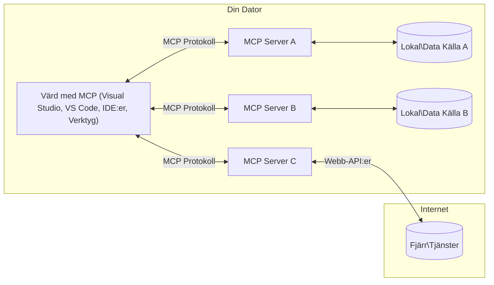

# MCP Kärnbegrepp: Bemästra Model Context Protocol för AI-integration

[](https://youtu.be/earDzWGtE84)

_(Klicka på bilden ovan för att se video av denna lektion)_

[Model Context Protocol (MCP)](https://github.com/modelcontextprotocol) är ett kraftfullt, standardiserat ramverk som optimerar kommunikationen mellan stora språkmodeller (LLMs) och externa verktyg, applikationer och datakällor.
Denna guide tar dig igenom MCP:s kärnbegrepp. Du kommer att lära dig om dess klient-server-arkitektur, viktiga komponenter, kommunikationsmekanik och bästa implementeringspraxis.

- **Explicit användarsamtycke**: All datatillgång och operationer kräver tydligt användargodkännande innan utförande. Användarna måste klart förstå vilken data som kommer att nås och vilka åtgärder som ska utföras, med detaljerad kontroll över behörigheter och auktoriseringar.

- **Datasäkerhet och integritet**: Användardata exponeras endast med explicit samtycke och måste skyddas av robusta åtkomstkontroller under hela interaktionslivscykeln. Implementeringar måste förhindra obehörig dataöverföring och upprätthålla strikta integritetsgränser.

- **Säkerhet vid verktygskörning**: Varje verktygsanrop kräver tydligt användarsamtycke med förståelse för verktygets funktion, parametrar och potentiella påverkan. Robust säkerhetsavgränsning måste förhindra oavsiktlig, osäker eller skadlig verktygskörning.

- **Säkerhet på transportlaget**: Alla kommunikationskanaler bör använda lämplig kryptering och autentiseringsmekanismer. Fjärranslutningar ska implementera säkra transportprotokoll och korrekt hantering av autentiseringsuppgifter.

#### Implementeringsriktlinjer:

- **Behörighetshantering**: Implementera finmaskiga behörighetssystem som tillåter användare att kontrollera vilka servrar, verktyg och resurser som är åtkomliga.
- **Autentisering och auktorisation**: Använd säkra autentiseringsmetoder (OAuth, API-nycklar) med korrekt hantering av token och utgång.
- **Inmatningsvalidering**: Validera alla parametrar och dataingångar enligt definierade scheman för att förhindra injektionsattacker.
- **Revisionsloggning**: Bibehåll omfattande loggar över alla operationer för säkerhetsövervakning och efterlevnad.

## Översikt

Denna lektion utforskar den grundläggande arkitekturen och komponenterna som utgör Model Context Protocol (MCP) ekosystemet. Du kommer att lära dig om klient-server-arkitekturen, nyckelkomponenter och kommunikationsmekanismer som driver MCP-interaktioner.

## Viktiga lärandemål

I slutet av denna lektion kommer du att:

- Förstå MCP:s klient-server-arkitektur.
- Identifiera roller och ansvar för Hosts, Clients och Servers.
- Analysera kärnfunktionerna som gör MCP till ett flexibelt integrationslager.
- Lära dig hur information flödar inom MCP-ekosystemet.
- Få praktiska insikter genom kodexempel i .NET, Java, Python och JavaScript.

## MCP-arkitektur: En djupare titt

MCP-ekosystemet bygger på en klient-server-modell. Denna modulära struktur tillåter AI-applikationer att effektivt interagera med verktyg, databaser, API:er och kontextuella resurser. Låt oss bryta ned denna arkitektur i dess kärnkomponenter.

I grunden följer MCP en klient-server-arkitektur där en värdapplikation kan ansluta till flera servrar:



- **MCP Hosts**: Program som VSCode, Claude Desktop, IDE:er eller AI-verktyg som vill komma åt data via MCP.
- **MCP Clients**: Protokollklienter som upprätthåller 1:1-anslutningar med servrar.
- **MCP Servers**: Lätta program som var och en exponerar specifika kapabiliteter genom det standardiserade Model Context Protocol.
- **Lokala datakällor**: Datorns filer, databaser och tjänster som MCP-servrar kan komma åt säkert.
- **Fjärrtjänster**: Externa system tillgängliga över internet som MCP-servrar kan ansluta till via API:er.

MCP-protokollet är en utvecklande standard med datum-baserad versionshantering (YYYY-MM-DD-format). Den nuvarande protokollversionen är **2025-11-25**. Du kan se senaste uppdateringarna av [protokollspecificeringen](https://modelcontextprotocol.io/specification/2025-11-25/)

> **Framåtblick:** en releasekandidat för nästa specifikationsversion, **2026-07-28**, tillkännagavs i maj 2026 och planeras släppas den 28 juli 2026. Den gör protokollet stateless på transportlagret (tar bort `initialize`-handshake och sessions-ID:n), formaliserar ett Extensions-ramverk och avvecklar Roots, Sampling och Logging till förmån för nyare mönster. Se [Vad som ändras i MCP: 2026-07-28 Release Candidate](./mcp-2026-07-28-release-candidate.md) för en fullständig genomgång.

### 1. Hosts

I Model Context Protocol (MCP) är **Hosts** AI-applikationer som fungerar som den primära gränssnittet genom vilket användare interagerar med protokollet. Hosts koordinerar och hanterar anslutningar till flera MCP-servrar genom att skapa dedikerade MCP-klienter för varje serveranslutning. Exempel på Hosts inkluderar:

- **AI-applikationer**: Claude Desktop, Visual Studio Code, Claude Code
- **Utvecklingsmiljöer**: IDE:er och kodredigerare med MCP-integration
- **Specialanpassade applikationer**: Skräddarsydda AI-agenter och verktyg

**Hosts** är applikationer som koordinerar AI-modellinteraktioner. De:

- **Orkestrerar AI-modeller**: Utför eller interagerar med LLMs för att generera svar och koordinera AI-arbetsflöden.
- **Hanterar klientanslutningar**: Skapar och underhåller en MCP-klient per MCP-serveranslutning.
- **Kontrollerar användargränssnitt**: Hanterar konversationsflöde, användarinteraktioner och svarspresentation.
- **Upprätthåller säkerhet**: Kontrollerar behörigheter, säkerhetsrestriktioner och autentisering.
- **Hantera användarsamtycke**: Hanterar användargodkännande för datadelning och verktygskörning.


### 2. Clients

**Clients** är viktiga komponenter som upprätthåller dedikerade en-till-en-anslutningar mellan Hosts och MCP-servrar. Varje MCP-klient instansieras av Host för att ansluta till en specifik MCP-server, vilket säkerställer organiserade och säkra kommunikationskanaler. Flera klienter gör det möjligt för Hosts att ansluta till flera servrar samtidigt.

**Clients** är anslutningskomponenter i värdapplikationen. De:

- **Protokollkommunikation**: Skickar JSON-RPC 2.0-förfrågningar till servrar med promptar och instruktioner.
- **Kapabilitetsförhandling**: Förhandlar om stöd för funktioner och protokollversioner med servrar under initiering.
- **Verktygskörning**: Hanterar verktygskörningsförfrågningar från modeller och processar svar.
- **Uppdateringar i realtid**: Hanterar notifieringar och uppdateringar i realtid från servrar.
- **Svarshantering**: Processar och formaterar serversvar för visning för användare.

### 3. Servers

**Servers** är program som tillhandahåller kontext, verktyg och kapabiliteter till MCP-klienter. De kan köras lokalt (på samma dator som Host) eller fjärrstyrt (på externa plattformar) och ansvarar för att hantera klientförfrågningar och tillhandahålla strukturerade svar. Servrar exponerar specifik funktionalitet via det standardiserade Model Context Protocol.

**Servers** är tjänster som erbjuder kontext och kapabiliteter. De:

- **Funktionsregistrering**: Registrerar och exponerar tillgängliga primitiva resurser (resurser, promptar, verktyg) till klienter.
- **Förfrågningshantering**: Tar emot och utför verktygsanrop, resursförfrågningar och promptförfrågningar från klienter.
- **Kontexttillhandahållande**: Ger kontextuell information och data för att förbättra modellsvar.
- **Tillståndshantering**: Bibehåller sessionsstatus och hanterar tillståndsberoende interaktioner vid behov.
- **Notifieringar i realtid**: Skickar notifieringar om kapabilitetsändringar och uppdateringar till anslutna klienter.

Servrar kan utvecklas av vem som helst för att utöka modellkapabiliteter med specialiserad funktionalitet, och de stöder både lokala och fjärrdistributioner.

### 4. Serverprimitiver

Servrar i Model Context Protocol (MCP) tillhandahåller tre kärn**primitiver** som definierar grundläggande byggstenar för rika interaktioner mellan klienter, värdar och språkmodeller. Dessa primitivspecificerar vilka typer av kontextuell information och åtgärder som är tillgängliga via protokollet.

MCP-servrar kan exponera valfri kombination av följande tre kärnprimitiver:

#### Resurser

**Resurser** är datakällor som tillhandahåller kontextuell information till AI-applikationer. De representerar statiskt eller dynamiskt innehåll som kan förbättra modellförståelse och beslutsfattande:

- **Kontextuell data**: Strukturerad information och kontext för AI-modellkonsumtion
- **Kunskapsbaser**: Dokumentarkiv, artiklar, manualer och forskningsartiklar
- **Lokala datakällor**: Filer, databaser och lokal systeminformation
- **Extern data**: API-svar, webbtjänster och fjärrsystemdata
- **Dynamiskt innehåll**: Realtidsdata som uppdateras baserat på externa villkor

Resurser identifieras via URI:er och stödjer upptäckt genom `resources/list` samt hämtning via `resources/read` metoder:

```text
file://documents/project-spec.md
database://production/users/schema
api://weather/current
```

#### Prompter

**Prompter** är återanvändbara mallar som hjälper till att strukturera interaktioner med språkmodeller. De tillhandahåller standardiserade interaktionsmönster och mallade arbetsflöden:

- **Mallbaserade interaktioner**: Förstrukturerade meddelanden och samtalsstartare
- **Arbetsflödesmallar**: Standardiserade sekvenser för vanliga uppgifter och interaktioner
- **Få-shot-exempel**: Exempelbaserade mallar för modellinstruktioner
- **Systemprompter**: Grundläggande promptar som definierar modellbeteende och kontext
- **Dynamiska mallar**: Parameteriserade promptar som anpassar sig till specifika kontexter

Prompter stödjer variabelsubstitution och kan upptäckas via `prompts/list` och hämtas med `prompts/get`:

```markdown
Generate a {{task_type}} for {{product}} targeting {{audience}} with the following requirements: {{requirements}}
```

#### Verktyg

**Verktyg** är exekverbara funktioner som AI-modeller kan anropa för att utföra specifika åtgärder. De representerar "verb" i MCP-ekosystemet och möjliggör för modeller att interagera med externa system:

- **Exekverbara funktioner**: Diskreta operationer som modeller kan anropa med specifika parametrar
- **Integration med externa system**: API-anrop, databasfrågor, filoperationer, beräkningar
- **Unik identitet**: Varje verktyg har ett distinkt namn, beskrivning och parameterschema
- **Strukturerad I/O**: Verktyg accepterar validerade parametrar och returnerar strukturerade, typade svar
- **Åtgärdskapabiliteter**: Möjliggör för modeller att utföra verkliga åtgärder och hämta levande data

Verktyg definieras med JSON Schema för parameter-validering och upptäcks genom `tools/list` och exekveras via `tools/call`. Verktyg kan även inkludera **ikoner** som ytterligare metadata för bättre UI-presentation.

**Verktygskommentarer**: Verktyg stödjer beteendeannoteringar (t.ex. `readOnlyHint`, `destructiveHint`) som beskriver om ett verktyg är skrivskyddat eller destruktivt, vilket hjälper klienter att fatta informerade beslut om verktygskörning.

Exempel på verktygsdefinition:

```typescript
server.tool(
  "search_products", 
  {
    query: z.string().describe("Search query for products"),
    category: z.string().optional().describe("Product category filter"),
    max_results: z.number().default(10).describe("Maximum results to return")
  }, 
  async (params) => {
    // Utför sökning och returnera strukturerade resultat
    return await productService.search(params);
  }
);
```

## Klientprimitiver

I Model Context Protocol (MCP) kan **klienter** exponera primitiv som möjliggör för servrar att be om ytterligare kapabiliteter från värdapplikationen. Dessa klientbaserade primitiv tillåter rikare, mer interaktiva serverimplementationer som kan komma åt AI-modellkapabiliteter och användarinteraktioner.

### Sampling

> **Avvecklingsmeddelande:** releasekandidaten `2026-07-28` markerar Sampling som avvecklad till förmån för direkt integration med LLM-leverantörers API:er. Den fortsätter fungera i `2025-11-25` och minst ett år efter eventuell avveckling, men nya designmönster bör föredra ersättningsmönstret. Se [Vad som ändras i MCP: 2026-07-28 Release Candidate](./mcp-2026-07-28-release-candidate.md).

**Sampling** möjliggör för servrar att begära språkmodellskompletteringar från klientens AI-applikation. Denna primitiv tillåter servrar att komma åt LLM-kapabiliteter utan att själva bädda in modellberoenden:

- **Modelloberoende åtkomst**: Servrar kan begära kompletteringar utan att inkludera LLM-SDK:er eller hantera modellåtkomst.
- **Serverinitierad AI**: Möjliggör för servrar att autonomt generera innehåll med klientens AI-modell.
- **Rekursiva LLM-interaktioner**: Stödjer komplexa scenarier där servrar behöver AI-assistans för bearbetning.
- **Dynamisk innehållsgenerering**: Gör det möjligt för servrar att skapa kontextuella svar med värdens modell.
- **Stöd för verktygsanrop**: Servrar kan inkludera `tools` och `toolChoice` parametrar för att tillåta klientens modell att anropa verktyg under sampling.

Sampling initieras via metoden `sampling/complete`, där servrar skickar slutförandeförfrågningar till klienter.

### Roots

> **Avvecklingsmeddelande:** releasekandidaten `2026-07-28` markerar Roots som avvecklad till förmån för verktygsparametrar, resurs-URI:er eller serverkonfiguration. Den fortsätter fungera i `2025-11-25` och minst ett år efter eventuell avveckling. Se [Vad som ändras i MCP: 2026-07-28 Release Candidate](./mcp-2026-07-28-release-candidate.md).

**Roots** tillhandahåller ett standardiserat sätt för klienter att exponera filsystemgränser för servrar, vilket hjälper servrar att förstå vilka kataloger och filer de har tillgång till:

- **Filsystemgränser**: Definierar gränserna för var servrar kan verka inom filsystemet.
- **Åtkomstkontroll**: Hjälper servrar att förstå vilka kataloger och filer de har behörighet att nå.
- **Dynamiska uppdateringar**: Klienter kan meddela servrar när rotenlistan ändras.
- **URI-baserad identifiering**: Roots använder `file://` URI:er för att identifiera tillgängliga kataloger och filer.

Roots upptäcks via metoden `roots/list`, och klienter skickar `notifications/roots/list_changed` när roots ändras.

### Elicitation

**Elicitation** möjliggör för servrar att begära ytterligare information eller bekräftelse från användare via klientgränssnittet:

- **Begäranden om användarinmatning**: Servrar kan be om ytterligare information när det behövs för verktygskörning.
- **Bekräftelsedialoger**: Begär användargodkännande för känsliga eller påverkande operationer.
- **Interaktiva arbetsflöden**: Möjliggör för servrar att skapa steg-för-steg användarinteraktioner.
- **Dynamisk parameterinsamling**: Samlar in saknade eller valfria parametrar under verktygskörning.

Elicitation-förfrågningar görs med metoden `elicitation/request` för att samla in användarinmatning via klientens gränssnitt.

**URL-läget för elicitation**: Servrar kan också begära URL-baserade användarinteraktioner, vilket tillåter servrar att dirigera användare till externa webbsidor för autentisering, bekräftelse eller dataregistrering.

### Loggning


> **Nedläggningsmeddelande:** releasekandidaten `2026-07-28` markerar Logging som föråldrat till förmån för `stderr` för stdio-transporter och OpenTelemetry för strukturerad observerbarhet. Det fortsätter fungera i `2025-11-25` och i minst ett år efter eventuell nedläggning. Se [What's Changing in MCP: The 2026-07-28 Release Candidate](./mcp-2026-07-28-release-candidate.md).

**Logging** tillåter servrar att skicka strukturerade loggmeddelanden till klienter för felsökning, övervakning och operativ insyn:

- **Felsökningsstöd**: Möjliggör för servrar att tillhandahålla detaljerade körloggar för felsökning
- **Operativ övervakning**: Skicka statusuppdateringar och prestandamått till klienter
- **Felrapportering**: Ge detaljerad felkontext och diagnostisk information
- **Revisionsspår**: Skapa omfattande loggar över serveroperationer och beslut

Loggmeddelanden skickas till klienter för att ge insyn i serveroperationer och underlätta felsökning.

## Informationsflöde i MCP

Model Context Protocol (MCP) definierar ett strukturerat flöde av information mellan hosts, klienter, servrar och modeller. Att förstå detta flöde hjälper till att förtydliga hur användarförfrågningar behandlas och hur externa verktyg och data integreras i modellens svar.

- **Host initierar anslutning**  
  Host-applikationen (som en IDE eller chattgränssnitt) etablerar en anslutning till en MCP-server, vanligtvis via STDIO, WebSocket eller annan stödd transport.

- **Funktionsförhandling**  
  Klienten (inbäddad i hosten) och servern byter information om sina stödda funktioner, verktyg, resurser och protokollversioner. Detta säkerställer att båda parter förstår vilka möjligheter som finns tillgängliga för sessionen.

- **Användarförfrågan**  
  Användaren interagerar med hosten (t.ex. anger en prompt eller kommando). Hosten samlar in denna indata och skickar den till klienten för bearbetning.

- **Användning av resurs eller verktyg**  
  - Klienten kan begära ytterligare kontext eller resurser från servern (såsom filer, databasposter eller kunskapsbasartiklar) för att berika modellens förståelse.
  - Om modellen avgör att ett verktyg behövs (t.ex. för att hämta data, utföra en beräkning eller anropa en API), skickar klienten en verktygskörningsbegäran till servern, med verktygets namn och parametrar.

- **Serverkörning**  
  Servern tar emot resurs- eller verktygsbegäran, utför nödvändiga operationer (som att köra en funktion, fråga en databas eller hämta en fil) och returnerar resultaten till klienten i ett strukturerat format.

- **Svarsgenerering**  
  Klienten integrerar serverns svar (resursdata, verktygsutdata etc.) i den pågående modellinteraktionen. Modellen använder denna information för att generera ett omfattande och kontextuellt relevant svar.

- **Resultatpresentation**  
  Hosten tar emot det slutgiltiga svaret från klienten och presenterar det för användaren, ofta inklusive både modellens genererade text och eventuella resultat från verktygskörningar eller resursuppslagningar.

Detta flöde möjliggör att MCP stöder avancerade, interaktiva och kontextmedvetna AI-applikationer genom att sömlöst koppla ihop modeller med externa verktyg och datakällor.

## Protokollarkitektur & lager

MCP består av två distinkta arkitekturlager som samverkar för att erbjuda en komplett kommunikationsram:

### Datalager

**Datalagret** implementerar den grundläggande MCP-protokollet med **JSON-RPC 2.0** som bas. Detta lager definierar meddelandestruktur, semantik och interaktionsmönster:

#### Kärnkomponenter:

- **JSON-RPC 2.0-protokoll**: All kommunikation använder standardiserat JSON-RPC 2.0-meddelandformat för metodanrop, svar och notifieringar
- **Livscykelhantering**: Hanterar anslutningsinitialisering, funktionsförhandling och sessionsterminering mellan klient och server
- **Serverprimtiver**: Gör det möjligt för servrar att erbjuda kärnfunktionalitet via verktyg, resurser och prompts
- **Klientprimtiver**: Gör det möjligt för servrar att begära sampling från LLM:er, inhämta användarinmatning och skicka loggmeddelanden
- **Notifieringar i realtid**: Stöder asynkrona notifieringar för dynamiska uppdateringar utan polling

#### Nyckelfunktioner:

- **Protokollversionsförhandling**: Använder datumbaserad versionshantering (ÅÅÅÅ-MM-DD) för att säkerställa kompatibilitet
- **Funktionsupptäckt**: Klienter och servrar utbyter information om stödda funktioner vid initialisering
- **Tillståndsbevarande sessioner**: Bibehåller anslutningstillstånd över flera interaktioner för kontextkontinuitet

### Transportlager

**Transportlagret** hanterar kommunikationskanaler, meddelanderamning och autentisering mellan MCP-deltagare:

#### Stödda transportmekanismer:

1. **STDIO-transport**:
   - Använder standard in-/ut-flöden för direkt processkommunikation
   - Optimalt för lokala processer på samma maskin utan nätverksöverliggande
   - Vanligt för lokala MCP-serverimplementationer

2. **Streambar HTTP-transport**:
   - Använder HTTP POST för klient-till-server-meddelanden  
   - Valfri Server-Sent Events (SSE) för server-till-klient-strömning
   - Möjliggör fjärrserverkommunikation över nätverk
   - Stöder standard HTTP-autentisering (bärartoken, API-nycklar, anpassade headers)
   - MCP rekommenderar OAuth för säker token-baserad autentisering

#### Transportabstraktion:

Transportlagret abstraherar kommunikationsdetaljer från datalagret och möjliggör samma JSON-RPC 2.0 meddelandeformat över alla transportmekanismer. Denna abstraktion tillåter applikationer att smidigt växla mellan lokala och fjärrservrar.

### Säkerhetshänsyn

MCP-implementationer måste följa flera kritiska säkerhetsprinciper för att säkerställa säkra, pålitliga och trygga interaktioner över hela protokollet:

- **Användarsamtycke och kontroll**: Användare måste ge explicit samtycke innan någon data någonsin nås eller operationer utförs. De bör ha tydlig kontroll över vilken data som delas och vilka åtgärder som auktoriseras, understött av intuitiva användargränssnitt för översyn och godkännande.

- **Datasekretess**: Användardata får endast exponeras med uttryckligt samtycke och måste skyddas av lämpliga åtkomstkontroller. MCP-implementationer måste förhindra obehörig dataöverföring och säkerställa att sekretessen bibehålls under alla interaktioner.

- **Verktygssäkerhet**: Innan något verktyg anropas krävs uttryckligt användarsamtycke. Användarna skall ha en tydlig förståelse för varje verktygs funktionalitet, och robusta säkerhetsgränser måste upprätthållas för att förhindra oavsiktlig eller osäker verktygskörning.

Genom att följa dessa säkerhetsprinciper säkerställer MCP att användarnas förtroende, sekretess och säkerhet upprätthålls i alla protokollinteraktioner samtidigt som kraftfulla AI-integrationer möjliggörs.

## Kodexempel: Viktiga komponenter

Nedan visas kodexempel i flera populära programmeringsspråk som illustrerar hur man implementerar nyckelkomponenter i en MCP-server och verktyg.

### .NET-exempel: Skapa en enkel MCP-server med verktyg

Här är ett praktiskt .NET-kodexempel som demonstrerar hur man implementerar en enkel MCP-server med anpassade verktyg. Exemplet visar hur man definierar och registrerar verktyg, hanterar förfrågningar och ansluter servern med Model Context Protocol.

```csharp
using System;
using System.Threading.Tasks;
using ModelContextProtocol.Server;
using ModelContextProtocol.Server.Transport;
using ModelContextProtocol.Server.Tools;

public class WeatherServer
{
    public static async Task Main(string[] args)
    {
        // Create an MCP server
        var server = new McpServer(
            name: "Weather MCP Server",
            version: "1.0.0"
        );
        
        // Register our custom weather tool
        server.AddTool<string, WeatherData>("weatherTool", 
            description: "Gets current weather for a location",
            execute: async (location) => {
                // Call weather API (simplified)
                var weatherData = await GetWeatherDataAsync(location);
                return weatherData;
            });
        
        // Connect the server using stdio transport
        var transport = new StdioServerTransport();
        await server.ConnectAsync(transport);
        
        Console.WriteLine("Weather MCP Server started");
        
        // Keep the server running until process is terminated
        await Task.Delay(-1);
    }
    
    private static async Task<WeatherData> GetWeatherDataAsync(string location)
    {
        // This would normally call a weather API
        // Simplified for demonstration
        await Task.Delay(100); // Simulate API call
        return new WeatherData { 
            Temperature = 72.5,
            Conditions = "Sunny",
            Location = location
        };
    }
}

public class WeatherData
{
    public double Temperature { get; set; }
    public string Conditions { get; set; }
    public string Location { get; set; }
}
```

### Java-exempel: MCP-serverkomponenter

Detta exempel visar samma MCP-server och verktygsregistrering som .NET-exemplet ovan, men implementerat i Java.

```java
import io.modelcontextprotocol.server.McpServer;
import io.modelcontextprotocol.server.McpToolDefinition;
import io.modelcontextprotocol.server.transport.StdioServerTransport;
import io.modelcontextprotocol.server.tool.ToolExecutionContext;
import io.modelcontextprotocol.server.tool.ToolResponse;

public class WeatherMcpServer {
    public static void main(String[] args) throws Exception {
        // Skapa en MCP-server
        McpServer server = McpServer.builder()
            .name("Weather MCP Server")
            .version("1.0.0")
            .build();
            
        // Registrera ett väderverktyg
        server.registerTool(McpToolDefinition.builder("weatherTool")
            .description("Gets current weather for a location")
            .parameter("location", String.class)
            .execute((ToolExecutionContext ctx) -> {
                String location = ctx.getParameter("location", String.class);
                
                // Hämta väderdata (förenklat)
                WeatherData data = getWeatherData(location);
                
                // Returnera formaterat svar
                return ToolResponse.content(
                    String.format("Temperature: %.1f°F, Conditions: %s, Location: %s", 
                    data.getTemperature(), 
                    data.getConditions(), 
                    data.getLocation())
                );
            })
            .build());
        
        // Anslut servern med stdio-transport
        try (StdioServerTransport transport = new StdioServerTransport()) {
            server.connect(transport);
            System.out.println("Weather MCP Server started");
            // Håll servern igång tills processen avslutas
            Thread.currentThread().join();
        }
    }
    
    private static WeatherData getWeatherData(String location) {
        // Implementering skulle anropa ett väder-API
        // Förenklat för exempeländamål
        return new WeatherData(72.5, "Sunny", location);
    }
}

class WeatherData {
    private double temperature;
    private String conditions;
    private String location;
    
    public WeatherData(double temperature, String conditions, String location) {
        this.temperature = temperature;
        this.conditions = conditions;
        this.location = location;
    }
    
    public double getTemperature() {
        return temperature;
    }
    
    public String getConditions() {
        return conditions;
    }
    
    public String getLocation() {
        return location;
    }
}
```

### Python-exempel: Bygga en MCP-server

Detta exempel använder fastmcp, så se till att installera det först:

```python
pip install fastmcp
```
Kodexempel:

```python
#!/usr/bin/env python3
import asyncio
from fastmcp import FastMCP
from fastmcp.transports.stdio import serve_stdio

# Skapa en FastMCP-server
mcp = FastMCP(
    name="Weather MCP Server",
    version="1.0.0"
)

@mcp.tool()
def get_weather(location: str) -> dict:
    """Gets current weather for a location."""
    return {
        "temperature": 72.5,
        "conditions": "Sunny",
        "location": location
    }

# Alternativ metod med en klass
class WeatherTools:
    @mcp.tool()
    def forecast(self, location: str, days: int = 1) -> dict:
        """Gets weather forecast for a location for the specified number of days."""
        return {
            "location": location,
            "forecast": [
                {"day": i+1, "temperature": 70 + i, "conditions": "Partly Cloudy"}
                for i in range(days)
            ]
        }

# Registrera klassverktyg
weather_tools = WeatherTools()

# Starta servern
if __name__ == "__main__":
    asyncio.run(serve_stdio(mcp))
```

### JavaScript-exempel: Skapa en MCP-server

Detta exempel visar skapandet av en MCP-server i JavaScript och hur man registrerar två väderrelaterade verktyg.

```javascript
// Använder den officiella Model Context Protocol SDK
import { McpServer } from "@modelcontextprotocol/sdk/server/mcp.js";
import { StdioServerTransport } from "@modelcontextprotocol/sdk/server/stdio.js";
import { z } from "zod"; // För parameter validering

// Skapa en MCP-server
const server = new McpServer({
  name: "Weather MCP Server",
  version: "1.0.0"
});

// Definiera ett väderverktyg
server.tool(
  "weatherTool",
  {
    location: z.string().describe("The location to get weather for")
  },
  async ({ location }) => {
    // Detta skulle normalt anropa ett väder-API
    // Förenklat för demonstration
    const weatherData = await getWeatherData(location);
    
    return {
      content: [
        { 
          type: "text", 
          text: `Temperature: ${weatherData.temperature}°F, Conditions: ${weatherData.conditions}, Location: ${weatherData.location}` 
        }
      ]
    };
  }
);

// Definiera ett prognosverktyg
server.tool(
  "forecastTool",
  {
    location: z.string(),
    days: z.number().default(3).describe("Number of days for forecast")
  },
  async ({ location, days }) => {
    // Detta skulle normalt anropa ett väder-API
    // Förenklat för demonstration
    const forecast = await getForecastData(location, days);
    
    return {
      content: [
        { 
          type: "text", 
          text: `${days}-day forecast for ${location}: ${JSON.stringify(forecast)}` 
        }
      ]
    };
  }
);

// Hjälpfunktioner
async function getWeatherData(location) {
  // Simulera API-anrop
  return {
    temperature: 72.5,
    conditions: "Sunny",
    location: location
  };
}

async function getForecastData(location, days) {
  // Simulera API-anrop
  return Array.from({ length: days }, (_, i) => ({
    day: i + 1,
    temperature: 70 + Math.floor(Math.random() * 10),
    conditions: i % 2 === 0 ? "Sunny" : "Partly Cloudy"
  }));
}

// Anslut servern med stdio-transport
const transport = new StdioServerTransport();
server.connect(transport).catch(console.error);

console.log("Weather MCP Server started");
```

Detta JavaScript-exempel demonstrerar hur man skapar en MCP-server med Model Context Protocol SDK. Det visar hur man registrerar två verktyg med namnen `weatherTool` och `forecastTool` och gör dem tillgängliga för MCP-klienter via `StdioServerTransport`.

## Säkerhet och auktorisering

MCP inkluderar flera inbyggda koncept och mekanismer för att hantera säkerhet och auktorisering genom protokollet:

1. **Verktygstillsyn**:  
  Klienter kan specificera vilka verktyg en modell får använda under en session. Detta säkerställer att endast uttryckligen auktoriserade verktyg är tillgängliga, vilket minskar risken för oavsiktliga eller osäkra operationer. Tillsyn kan konfigureras dynamiskt baserat på användarpreferenser, organisationspolicyer eller kontexten i interaktionen.

2. **Autentisering**:  
  Servrar kan kräva autentisering innan access till verktyg, resurser eller känsliga operationer beviljas. Detta kan involvera API-nycklar, OAuth-token eller andra autentiseringsscheman. Korrekt autentisering säkerställer att endast betrodda klienter och användare kan anropa serverfunktioner.

3. **Validering**:  
  Parameterkontroll krävs för alla verktygsanrop. Varje verktyg definierar förväntade typer, format och begränsningar för sina parametrar, och servern validerar inkommande förfrågningar därefter. Detta förhindrar felaktig eller skadlig indata från att nå verktygsimplementationer och hjälper till att bibehålla operationernas integritet.

4. **Begränsning av anrop**:  
  För att förhindra missbruk och säkerställa rättvis användning av serverresurser kan MCP-servrar införa hastighetsbegränsningar för verktygsanrop och resursåtkomst. Begränsningar kan gälla per användare, per session eller globalt, och hjälper till att skydda mot denial-of-service-attacker eller överdriven resursförbrukning.

Genom att kombinera dessa mekanismer erbjuder MCP en säker grund för att integrera språkmodeller med externa verktyg och datakällor, samtidigt som användare och utvecklare får finmaskig kontroll över åtkomst och användning.

## Protokollmeddelanden & kommunikationsflöde

MCP-kommunikation använder strukturerade **JSON-RPC 2.0**-meddelanden för att underlätta tydliga och tillförlitliga interaktioner mellan hosts, klienter och servrar. Protokollet definierar specifika meddelandemönster för olika typer av operationer:

### Kärntyp av meddelanden:

#### **Initialiseringsmeddelanden**
- **`initialize`-begäran**: Etablerar anslutning och förhandlar protokollversion och funktioner
- **`initialize`-svar**: Bekräftar stödda funktioner och serverinformation  
- **`notifications/initialized`**: Signalera att initialisering är klar och sessionen är redo

#### **Upptäcktsmeddelanden**
- **`tools/list`-begäran**: Upptäcker tillgängliga verktyg från servern
- **`resources/list`-begäran**: Lista tillgängliga resurser (datakällor)
- **`prompts/list`-begäran**: Hämtar tillgängliga promptmallar

#### **Exekveringsmeddelanden**  
- **`tools/call`-begäran**: Utför ett specifikt verktyg med givna parametrar
- **`resources/read`-begäran**: Hämtar innehåll från en specifik resurs
- **`prompts/get`-begäran**: Hämtar en promptmall med valfria parametrar

#### **Klientside-meddelanden**
- **`sampling/complete`-begäran**: Servern begär LLM-komplettering från klienten
- **`elicitation/request`**: Servern begär användarinmatning via klientgränssnittet
- **Loggmeddelanden**: Servern skickar struktuerade loggmeddelanden till klienten

#### **Notifieringsmeddelanden**
- **`notifications/tools/list_changed`**: Servern meddelar klienten om verktygsändringar
- **`notifications/resources/list_changed`**: Servern meddelar klienten om resursändringar  
- **`notifications/prompts/list_changed`**: Servern meddelar klienten om promptändringar

### Meddelandestruktur:

Alla MCP-meddelanden följer JSON-RPC 2.0-format med:
- **Begäran**: Inkluderar `id`, `method` och valfria `params`
- **Svar**: Inkluderar `id` och antingen `result` eller `error`  
- **Notifiering**: Inkluderar `method` och valfria `params` (inga `id` eller svar är förväntade)

Denna strukturerade kommunikation säkerställer tillförlitliga, spårbara och utbyggbara interaktioner som stöder avancerade scenarier som realtidsuppdateringar, verktygskedjning och robust felhantering.

### Uppgifter (experimentellt)

> **Framåtblick:** releasekandidaten `2026-07-28` flyttar Uppgifter från den experimentella kärnspecifikationen till en dedikerad Tasks-extension med en omdesignad livscykel (`tasks/get`, `tasks/update`, `tasks/cancel`; `tasks/list` tas bort). Om du bygger mot den experimentella API:n nedan, planera för migration. Se [What's Changing in MCP: The 2026-07-28 Release Candidate](./mcp-2026-07-28-release-candidate.md).

**Uppgifter** är en experimentell funktion som tillhandahåller hållbara exekveringsomslag som möjliggör uppskjuten resultatåtervinning och statusuppföljning för MCP-förfrågningar:

- **Långvariga operationer**: Spåra kostsamma beräkningar, workflow-automation och batchhantering
- **Uppskjutna resultat**: Polling efter uppgiftsstatus och hämta resultat när operationer slutförs
- **Statusspårning**: Övervaka uppgiftsframsteg genom definierade livscykelstater
- **Flerstegsoperationer**: Stöder komplexa arbetsflöden som sträcker sig över flera interaktioner

Uppgifter omsluter standard MCP-begäranden för att möjliggöra asynkrona exekveringsmönster för operationer som inte kan slutföras omedelbart.

## Viktiga slutsatser

- **Arkitektur**: MCP använder en klient-server-arkitektur där hosts hanterar flera klientanslutningar till servrar
- **Deltagare**: Ekosystemet inkluderar hosts (AI-applikationer), klienter (protokollkopplingar) och servrar (funktionsleverantörer)
- **Transportmekanismer**: Kommunikation stöder STDIO (lokal) och Streambar HTTP med valfri SSE (fjärr)
- **Kärnprimtiver**: Servrar exponerar verktyg (exekverbara funktioner), resurser (datakällor) och prompts (mallar)
- **Klientprimtiver**: Servrar kan begära sampling (LLM-kompletteringar med verktygsanropsstöd), elicitation (användarinmatning inklusive URL-läge), roots (filserversgränser) och loggning från klienter
- **Experimentella funktioner**: Uppgifter erbjuder hållbara exekveringsomslag för långvariga operationer
- **Protokollgrund**: Bygger på JSON-RPC 2.0 med datumbaserad versionering (aktuell: 2025-11-25)
- **Realtidsmöjligheter**: Stöder notifieringar för dynamiska uppdateringar och realtidssynkronisering
- **Säkerhet först**: Explicit användarsamtycke, datasekretess och säker transport är kärnkrav

## Övning

Designa ett enkelt MCP-verktyg som skulle vara användbart i din domän. Definiera:
1. Vad verktyget skulle heta
2. Vilka parametrar det skulle acceptera
3. Vilket output det skulle returnera
4. Hur en modell skulle kunna använda detta verktyg för att lösa användarproblem


---

## Vad är nästa

Nästa: [Kapitel 2: Säkerhet](../02-Security/README.md)


Nyfiken på vad som kommer efter `2025-11-25`? Läs [Vad som ändras i MCP: Release Candidate 2026-07-28](./mcp-2026-07-28-release-candidate.md).

---

<!-- CO-OP TRANSLATOR DISCLAIMER START -->
**Ansvarsfriskrivning**:
Detta dokument har översatts med hjälp av AI-översättningstjänsten [Co-op Translator](https://github.com/Azure/co-op-translator). Även om vi strävar efter noggrannhet, var vänlig notera att automatiska översättningar kan innehålla fel eller brister. Det ursprungliga dokumentet på dess modersmål bör betraktas som den auktoritativa källan. För kritisk information rekommenderas professionell mänsklig översättning. Vi ansvarar inte för några missförstånd eller feltolkningar som uppstår till följd av användningen av denna översättning.
<!-- CO-OP TRANSLATOR DISCLAIMER END -->