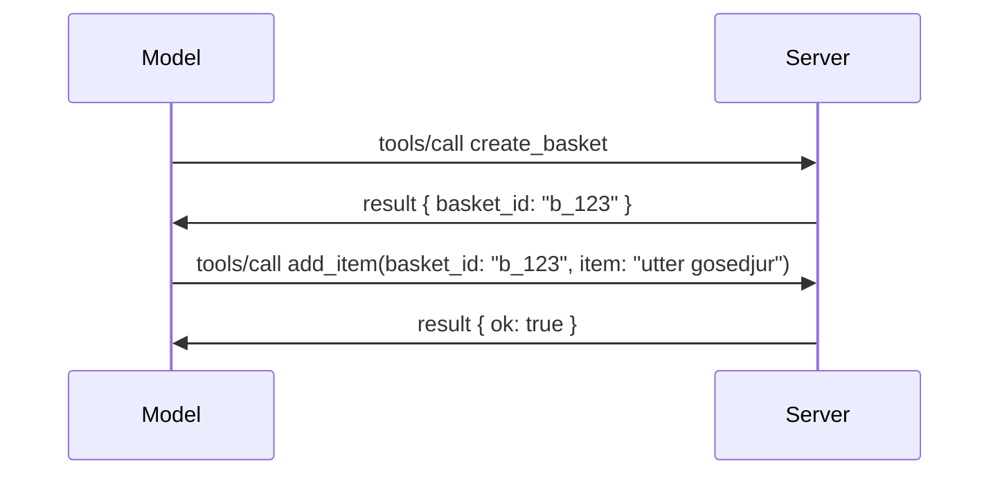

# Vad som förändras i MCP: Release Candidate för 2026-07-28

> **Status:** Release Candidate. Specifikationen `2026-07-28` är inte slutgiltig vid skrivande stund. Den tillkännagavs den 21 maj 2026 och är planerad att levereras den 28 juli 2026. Allt i denna lektion beskriver release candidate; kontrollera [utkastspecifikationen](https://modelcontextprotocol.io/specification/draft) och dess [ändringslogg](https://modelcontextprotocol.io/specification/draft/changelog) för senaste status innan du bygger mot den. Resten av detta kursinnehåll är skrivet mot den nuvarande stabila releasen, **MCP Specification 2025-11-25**, och kommer att uppdateras när `2026-07-28` levereras.

## Översikt

`2026-07-28` är den största revisionen av MCP sedan starten. Sex Specification Enhancement Proposals (SEPs) tar bort sessions på protokollnivå och gör MCP stateless på transportlagret, tillägg blir en förstklassig, versionerad mekanism, och flera funktioner du lärt dig tidigare i detta kursinnehåll (Roots, Sampling, Logging) markeras som föråldrade enligt en ny livscykelpolicy. Den här lektionen sammanfattar vad som förändras, varför det är viktigt och vad det betyder för koden du redan skrivit mot `2025-11-25`.

Källa: [The 2026-07-28 MCP Specification Release Candidate](https://blog.modelcontextprotocol.io/posts/2026-07-28-release-candidate/) (Model Context Protocol Blog, David Soria Parra och Den Delimarsky).

## Lärandemål

I slutet av denna lektion kommer du att kunna:

- Förklara varför MCP går mot en stateless protokollkärna och vilket problem det löser för horisontellt skalade distributioner.
- Beskriva hur `initialize`/`initialized`-handshaken och `Mcp-Session-Id`-headern ersätts.
- Identifiera de nya `Mcp-Method` och `Mcp-Name` headerna samt `ttlMs`/`cacheScope` cachemetadata.
- Känna igen Extensions-ramverket och de två tillägg som levereras med denna release: MCP Apps och Tasks.
- Lista de sex authorization-SEPs som stärker OAuth 2.0 / OIDC-justering.
- Identifiera vilka kärnfunktioner (Roots, Sampling, Logging) som nu är föråldrade, och vad det innebär i praktiken.
- Förklara Full JSON Schema 2020-12-förändringen för verktygens `inputSchema`/`outputSchema`.

## Ett Stateless-protokoll

Huvudförändringen: MCP blir stateless på protokollnivå.

### Före (2025-11-25): sessioner fäster dig vid en serverinstans

Att anropa ett verktyg över Streamable HTTP börjar med en `initialize`-handshake. Servern svarar med en `Mcp-Session-Id`-header som varje efterföljande förfrågan måste bära:

```http
POST /mcp HTTP/1.1
Mcp-Session-Id: 1868a90c-3a3f-4f5b
Content-Type: application/json

{"jsonrpc":"2.0","id":2,"method":"tools/call",
 "params":{"name":"search","arguments":{"q":"otters"}}}
```

Eftersom sessionen är bunden till den serverinstans som utfärdade den behöver horisontellt skalade distributioner **sticky routing** vid lastbalanseraren och en **delad sessionslagring** över instanser.

### Efter (2026-07-28): varje förfrågan är självständig

```http
POST /mcp HTTP/1.1
MCP-Protocol-Version: 2026-07-28
Mcp-Method: tools/call
Mcp-Name: search
Content-Type: application/json

{"jsonrpc":"2.0","id":1,"method":"tools/call",
 "params":{"name":"search","arguments":{"q":"otters"},
           "_meta":{"io.modelcontextprotocol/clientInfo":{"name":"my-app","version":"1.0"}}}}
```

Vilken serverinstans som helst kan hantera denna förfrågan. Viktiga förändringar:

- **`initialize`/`initialized`-handshaken tas bort** ([SEP-2575](https://github.com/modelcontextprotocol/modelcontextprotocol/pull/2575)). Protokollversion, klientinfo och klientfunktioner flyttas in i `_meta` på varje förfrågan. En ny `server/discover`-metod låter en klient hämta serverfunktioner i förväg när den behöver dem.
- **`Mcp-Session-Id`-headern och protokollnivå-sessionen tas bort** ([SEP-2567](https://github.com/modelcontextprotocol/modelcontextprotocol/pull/2567)). Sticky routing och delade sessionslagringar krävs inte längre på protokollnivå.

### Stateless-protokoll, stateful-applikationer

Att ta bort sessionen på protokollnivå betyder inte att din server inte kan vara stateful. Det rekommenderade mönstret är detsamma som HTTP-API:er alltid använt: skapa ett explicit handtag (en `basket_id`, en `browser_id`) från ett verktygsanrop och låt modellen skicka tillbaka det som ett vanligt argument vid senare anrop.



Det här gör tillståndet synligt och begripligt för modellen istället för att dölja det i transportmetadata, och det gör att vilken serverinstans som helst kan hantera vilket anrop som helst.

### Server-till-klient-förfrågningar, omstrukturerade

Ett stateless-protokoll behöver fortfarande ett sätt för en server att be klienten om något mitt i anropet (till exempel en eliciteringsprompt):

- **Serverinitierade förfrågningar får endast skickas medan servern aktivt behandlar en klientförfrågan** ([SEP-2260](https://github.com/modelcontextprotocol/modelcontextprotocol/pull/2260)) — tidigare en rekommendation, nu ett krav. En användare uppmanas aldrig utan förvarning.
- **Flerfaldiga rundrese-förfrågningar** ([SEP-2322](https://github.com/modelcontextprotocol/modelcontextprotocol/pull/2322)) ersätter att hålla en SSE-ström öppen. Istället returnerar servern ett `InputRequiredResult`:

  ```json
  {
    "resultType": "inputRequired",
    "inputRequests": {
      "confirm": {
        "type": "elicitation",
        "message": "Delete 3 files?",
        "schema": { "type": "boolean" }
      }
    },
    "requestState": "eyJzdGVwIjoxLCJmaWxlcyI6WyJhIiwiYiIsImMiXX0="
  }
  ```

  Klienten samlar in svaren och skickar om det ursprungliga anropet med `inputResponses` plus den ekoade `requestState`. Vilken serverinstans som helst kan ta över retry eftersom allt som behövs finns i payloaden.

### Routbart, cachbart, spårbart

Tre mindre förändringar gör stateless trafik lättare att hantera:

- **`Mcp-Method` och `Mcp-Name`-headers krävs på Streamable HTTP** ([SEP-2243](https://github.com/modelcontextprotocol/modelcontextprotocol/pull/2243)), så lastbalanserare, gateways och hastighetsbegränsare kan routa på operationen utan att inspektera JSON-kroppen. Servrar avvisar förfrågningar där headers och kropp motsäger varandra.
- **`tools/list` och resursläsresultat bär `ttlMs` och `cacheScope`** ([SEP-2549](https://github.com/modelcontextprotocol/modelcontextprotocol/pull/2549)), modellerade på HTTP `Cache-Control`. Klienter vet hur länge ett listresultat är färskt och om det är säkert att dela över användare, utan att behöva en långlivad SSE-ström för att lära sig om förändringar.
- **W3C Trace Context-propagation i `_meta` dokumenteras** ([SEP-414](https://github.com/modelcontextprotocol/modelcontextprotocol/pull/414)), vilket fastställer nyckelnamnen `traceparent`, `tracestate` och `baggage` så att ett distribuerat spår kan följa ett anrop över klientens SDK, MCP-servern och nedströms system i en [OpenTelemetry](https://opentelemetry.io/)-kompatibel backend.

## Tillägg blir förstaklassiga

Tillägg fanns informellt i `2025-11-25`. [SEP-2133](https://github.com/modelcontextprotocol/modelcontextprotocol/pull/2133) formalisera dem:

- Tillägg identifieras med reverse-DNS-ID:n.
- De förhandlas via en `extensions`-karta på klient- och serverfunktioner.
- De lever i egna `ext-*`-repositories med delegerade underhållare och versioneras oberoende av kärnspecifikationen.
- En ny Extensions Track i SEP-processen ger dem en väg från experimentell till officiell.

Denna release levererar två officiella tillägg.

### MCP Apps: serverrenderade användargränssnitt

[MCP Apps](https://blog.modelcontextprotocol.io/posts/2026-01-26-mcp-apps/) ([SEP-1865](https://github.com/modelcontextprotocol/modelcontextprotocol/pull/1865)) låter servrar leverera interaktiva HTML-gränssnitt som värdar renderar i en sandboxad iframe. Verktyg deklarerar sina UI-mallar i förväg så att värdar kan förhämta, cachelagra och säkerhetsgranska dem innan något körs. Du gick igenom grunderna för detta i [Lektionen 15: MCP Apps](../03-GettingStarted/15-mcp-apps/README.md) — under Extensions-ramverket är MCP Apps nu formellt ett tillägg istället för en experimentell kärnfunktion.

### Tasks går från kärnfunktion till tillägg

Tasks levererades som en experimentell kärnfunktion i `2025-11-25`. Produktionsanvändning visade att det behövs en omskrivning och rätt hem är ett tillägg: [Tasks extension](https://github.com/modelcontextprotocol/modelcontextprotocol/pull/2663) omformar livscykeln kring den stateless modellen — en server kan svara `tools/call` med ett task-handtag, och klienten driver det vidare med `tasks/get`, `tasks/update` och `tasks/cancel`. Task-skapande är serverstyrt: klienten annonserar tillägget och servern bestämmer när ett anrop ska köras som ett task. `tasks/list` tas bort helt eftersom det inte går att säkert scopa utan sessioner.

> **Migreringsnotis:** om du implementerade den experimentella `2025-11-25` Tasks-API:n behöver du migrera till den nya tilläggslivscykeln — den är inte bakåtkompatibel.

## Behörighetssäkring

Sex SEPs stärker [behörighetsspecifikationen](https://modelcontextprotocol.io/specification/draft/basic/authorization) för att bättre överensstämma med verkliga OAuth 2.0 / OpenID Connect-deployment:

| SEP | Förändring |
|---|---|
| [SEP-2468](https://github.com/modelcontextprotocol/modelcontextprotocol/pull/2468) | Klienter måste validera `iss`-parametern i auktorisationssvar enligt [RFC 9207](https://www.rfc-editor.org/rfc/rfc9207), vilket minskar mix-up-attacker vanliga i MCP:s mönster med en klient och många servrar. En framtida version kommer kräva avvisning av svar som saknar `iss`. |
| [SEP-837](https://github.com/modelcontextprotocol/modelcontextprotocol/pull/837) | Klienter deklarerar sin OpenID Connect `application_type` under Dynamic Client Registration, för att undvika att auktoriseringsservrar sätter skrivbords-/CLI-klient till `"web"` och avvisar dess localhost-redirect URI. |
| [SEP-2352](https://github.com/modelcontextprotocol/modelcontextprotocol/pull/2352) | Klienter binder registrerade autentiseringsuppgifter till utfärdande auktoriseringsservers `issuer` och registrerar om när en resurs migrerar mellan auktoriseringsservrar. |
| [SEP-2207](https://github.com/modelcontextprotocol/modelcontextprotocol/pull/2207) | Dokumenterar hur man begär refresh tokens från OpenID Connect-liknande auktoriseringsservrar. |
| [SEP-2350](https://github.com/modelcontextprotocol/modelcontextprotocol/pull/2350) | Förtydligar ackumulering av scope vid step-up-auktorisation. |
| [SEP-2351](https://github.com/modelcontextprotocol/modelcontextprotocol/pull/2351) | Förtydligar suffixet `.well-known` i discovery. |

Om du bygger en auktoriseringsserver för MCP idag, börja skicka `iss` på auktorisationssvar nu — se [02-Security](../02-Security/README.md) för aktuell auktorisationsvägledning som detta bygger vidare på.

## Roots, Sampling och Logging är föråldrade

Under den nya [funktionslivscykelpolicyn](https://github.com/modelcontextprotocol/modelcontextprotocol/pull/2577) ([SEP-2577](https://github.com/modelcontextprotocol/modelcontextprotocol/pull/2577)) flyttas tre kärnklientprimärer du lärde dig i [Core Concepts](./README.md#roots) till **Föråldrat**-status:

| Funktion | Rekommenderad ersättning |
|---|---|
| Roots | Verktygsparametrar, resurs-URI:er eller serverkonfiguration |
| Sampling | Direkt integration med LLM-leverantörers API:er |
| Logging | `stderr` för stdio-transporter; OpenTelemetry för strukturerad observabilitet |

Detta är **endast annoteringsföråldringar**: metoder, typer och förmågeflaggor fortsätter fungera i denna release och i varje versionspublikation inom ett år efter denna. Att ta bort någon av dem helt kräver en separat SEP under livscykelpolicyn — så inget går sönder i dina befintliga [Sampling](../03-GettingStarted/14-sampling/README.md)-exempel idag, men nya servrar bör föredra ersättningsmönstren ovan.

## Full JSON Schema 2020-12 för Verktyg

Verktygets `inputSchema` och `outputSchema` uppgraderas till full [JSON Schema 2020-12](https://json-schema.org/draft/2020-12) ([SEP-2106](https://github.com/modelcontextprotocol/modelcontextprotocol/pull/2106)):

- Inschema behåller rotavgränsningen `type: "object"` men tillåter nu sammansättning (`oneOf`, `anyOf`, `allOf`), villkor och referenser (`$ref`, `$defs`).
- Utschema är obegränsade, och `structuredContent` kan nu vara vilken JSON-värde som helst i stället för bara ett objekt.
- Implementationer får inte auto-dereferera externa `$ref`-URI:er och bör begränsa schemats djup och valideringstid (en denial-of-service-aspekt att ta hänsyn till vid servervalidering).

Separat ändras felkoden för saknad resurs från den MCP-anpassade `-32002` till JSON-RPC-standarden `-32602` (Invalid Params) ([SEP-2164](https://github.com/modelcontextprotocol/modelcontextprotocol/pull/2164)). Om din klient matchar mot det exakta värdet `-32002` behöver du uppdatera den.

## Så här utvecklas protokollet härifrån

Denna release innehåller bakåtkompatibla förändringar, vilket MCP-ansvariga inte avser ska vara normen framöver. Tre styrnings-SEPs syftar till att förhindra upprepningar:

- Den **funktionslivscykelpolicy** ger varje funktion en väg Aktiv → Föråldrad → Borttagen med minst tolv månader mellan föråldring och tidigaste möjliga borttagning.
- **Extensions-ramverket** låter nya funktioner levereras som valfria tillägg och stabiliseras där innan de (om någonsin) flyttar in i kärnspecifikationen.

- En Standard Track SEP kan inte längre nå Final-status förrän ett matchande scenario landar i [conformance suite](https://github.com/modelcontextprotocol/conformance) ([SEP-2484](https://github.com/modelcontextprotocol/modelcontextprotocol/pull/2484)) — samma svit som [SDK tier system](https://github.com/modelcontextprotocol/modelcontextprotocol/pull/1777) använder för att poängsätta officiella SDK:er mot.

## Tidslinje för release och validering

- Releasekandidaten låstes den 21 maj 2026.
- Den slutgiltiga specifikationen är schemalagd till den 28 juli 2026.
- Den tio veckor långa perioden mellan de två ger SDK-ansvariga och klientimplementerare tid att validera ändringarna mot verkliga arbetsbelastningar; Tier 1 SDK:er förväntas leverera stöd inom denna period enligt [SDK tier system](https://modelcontextprotocol.io/docs/sdk).
- Följ hela uppsättningen förändringar i [utkastet till specifikationen](https://modelcontextprotocol.io/specification/draft) och dess [ändringslogg](https://modelcontextprotocol.io/specification/draft/changelog).

## Vad detta innebär för denna kursplan

Allt du har lärt dig hittills i denna kurs riktar sig mot **2025-11-25**, som förblir den nuvarande stabila specifikationen tills `2026-07-28` släpps. Konkreta punkter:

- **Sessioner och `initialize`-handshaken** (behandlad i [Core Concepts](./README.md) och [Lektion 6: HTTP Streaming](../03-GettingStarted/06-http-streaming/README.md)) fungerar fortfarande som dokumenterat idag, men förvänta dig att de ersätts av den tillståndslösa begäranmodellen ovan när du uppgraderar till SDK:er kompatibla med `2026-07-28`.
- **Sampling och Roots** (också täckt i [Core Concepts](./README.md)) är fullt fungerande men är föråldrade — nya designer bör föredra ersättningsmönstren som listas ovan.
- **Den experimentella Tasks-funktionen**, om du använt den, måste migreras till Tasks-tilläggens nya livscykel.
- **MCP Apps** ([Lektion 15](../03-GettingStarted/15-mcp-apps/README.md)) påverkas praktiskt taget inte; den flyttas helt enkelt under det formella Extensions-ramverket.

## Ytterligare resurser

- [Releasekandidat för MCP-specifikationen 2026-07-28 (blogginlägg)](https://blog.modelcontextprotocol.io/posts/2026-07-28-release-candidate/)
- [Framtiden för MCP-transporter](https://blog.modelcontextprotocol.io/posts/2025-12-19-mcp-transport-future/)
- [Utkast till MCP-specifikation](https://modelcontextprotocol.io/specification/draft)
- [Ändringslogg för MCP-utkast](https://modelcontextprotocol.io/specification/draft/changelog)
- [SEP-riktlinjer](https://modelcontextprotocol.io/community/sep-guidelines)
- [MCP SDK Tier System](https://modelcontextprotocol.io/docs/sdk)

## Nästa steg

Gå tillbaka till [Core Concepts](./README.md) eller fortsätt till [Security](../02-Security/README.md) för att se hur dagens `2025-11-25`-riktlinjer matchar det som kommer.

---

<!-- CO-OP TRANSLATOR DISCLAIMER START -->
**Ansvarsfriskrivning**:
Detta dokument har översatts med hjälp av AI-översättningstjänsten [Co-op Translator](https://github.com/Azure/co-op-translator). Även om vi strävar efter noggrannhet, var vänlig notera att automatiska översättningar kan innehålla fel eller brister. Det ursprungliga dokumentet på dess modersmål bör betraktas som den auktoritativa källan. För kritisk information rekommenderas professionell mänsklig översättning. Vi ansvarar inte för några missförstånd eller feltolkningar som uppstår till följd av användningen av denna översättning.
<!-- CO-OP TRANSLATOR DISCLAIMER END -->