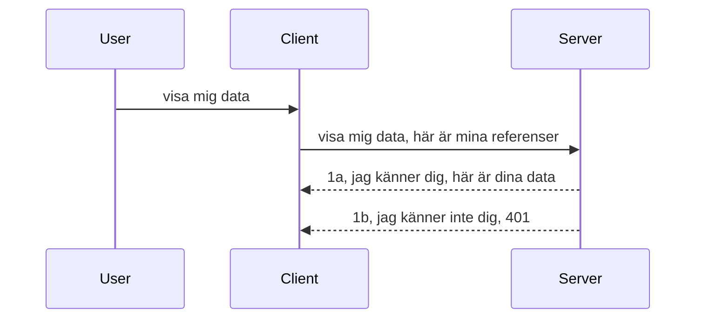

# Enkel autentisering

MCP SDK:er stöder användning av OAuth 2.1 som för att vara rättvis är en ganska invecklad process som involverar koncept som auktoriseringsserver, resurserver, inlämning av referenser, erhållande av en kod, byte av koden mot en access-token tills du slutligen kan hämta dina resursdata. Om du är ovan vid OAuth som är en fantastisk sak att implementera, är det en bra idé att börja med någon grundläggande nivå av autentisering och bygga upp till bättre och bättre säkerhet. Det är därför detta kapitel finns, för att bygga upp dig till mer avancerad autentisering.

## Autentisering, vad menar vi?

Autentisering är kort för autentisering och auktorisering. Idén är att vi behöver göra två saker:

- **Autentisering**, vilket är processen att ta reda på om vi låter en person komma in i vårt hus, att de har rätt att vara "här", det vill säga ha tillgång till vår resurserver där våra MCP Server-funktioner finns.
- **Auktorisering**, är processen att ta reda på om en användare ska ha tillgång till dessa specifika resurser de begär, till exempel dessa beställningar eller dessa produkter eller om de får läsa innehållet men inte radera som ett annat exempel.

## Referenser: hur vi talar om för systemet vem vi är

Tja, de flesta webbutvecklare där ute börjar tänka i termer av att tillhandahålla en referens till servern, vanligtvis en hemlighet som säger om de får vara här "Autentisering". Denna referens är vanligtvis en base64-kodad version av användarnamn och lösenord eller en API-nyckel som unikt identifierar en specifik användare.

Detta involverar att skicka den via en header kallad "Authorization" på följande sätt:

```json
{ "Authorization": "secret123" }
```

Detta kallas vanligtvis grundläggande autentisering. Hur den övergripande flödet sedan fungerar är på följande sätt:



Nu när vi förstår hur det fungerar ur ett flödesperspektiv, hur implementerar vi det? Tja, de flesta webbservrar har ett koncept som kallas middleware, en kodbit som körs som en del av förfrågan som kan verifiera referenser, och om referenser är giltiga kan låta förfrågan passera. Om förfrågan inte har giltiga referenser får du ett autentiseringsfel. Låt oss se hur detta kan implementeras:

**Python**

```python
class AuthMiddleware(BaseHTTPMiddleware):
    async def dispatch(self, request, call_next):

        has_header = request.headers.get("Authorization")
        if not has_header:
            print("-> Missing Authorization header!")
            return Response(status_code=401, content="Unauthorized")

        if not valid_token(has_header):
            print("-> Invalid token!")
            return Response(status_code=403, content="Forbidden")

        print("Valid token, proceeding...")
       
        response = await call_next(request)
        # lägg till eventuella kundhuvuden eller ändra svaret på något sätt
        return response


starlette_app.add_middleware(CustomHeaderMiddleware)
```

Här har vi:

- Skapat en middleware kallad `AuthMiddleware` där dess `dispatch`-metod anropas av webbservern.
- Lagt till middleware i webbservern:

    ```python
    starlette_app.add_middleware(AuthMiddleware)
    ```

- Skrivit valideringslogik som kontrollerar om Authorization-headern är närvarande och om den hemlighet som skickas är giltig:

    ```python
    has_header = request.headers.get("Authorization")
    if not has_header:
        print("-> Missing Authorization header!")
        return Response(status_code=401, content="Unauthorized")

    if not valid_token(has_header):
        print("-> Invalid token!")
        return Response(status_code=403, content="Forbidden")
    ```

    Om hemligheten är närvarande och giltig låter vi förfrågan passera genom att anropa `call_next` och returnera svaret.

    ```python
    response = await call_next(request)
    # lägg till eventuella kundhuvuden eller ändra svaret på något sätt
    return response
    ```

Hur det fungerar är att om en webbförfrågan görs till servern kommer middleware att anropas och med dess implementation kommer den antingen låta förfrågan passera eller returnera ett fel som indikerar att klienten inte får fortsätta.

**TypeScript**

Här skapar vi en middleware med den populära ramen Express och avlyssnar förfrågan innan den når MCP Servern. Här är koden för det:

```typescript
function isValid(secret) {
    return secret === "secret123";
}

app.use((req, res, next) => {
    // 1. Auktoriseringshuvud närvarande?
    if(!req.headers["Authorization"]) {
        res.status(401).send('Unauthorized');
    }
    
    let token = req.headers["Authorization"];

    // 2. Kontrollera giltighet.
    if(!isValid(token)) {
        res.status(403).send('Forbidden');
    }

   
    console.log('Middleware executed');
    // 3. Skicka vidare förfrågan till nästa steg i förfrågningskedjan.
    next();
});
```

I denna kod:

1. Kontrollerar vi om Authorization-headern finns från början, annars skickar vi ett 401-fel.
2. Säkerställer vi att referensen/token är giltig, annars skickar vi ett 403-fel.
3. Slutligen passeras förfrågan vidare i förfrågningspipen och returnerar den efterfrågade resursen.

## Övning: Implementera autentisering

Låt oss ta vår kunskap och försöka implementera det. Här är planen:

Server

- Skapa en webbserver och MCP-instans.
- Implementera en middleware för servern.

Klient

- Skicka webbförfrågan med referens via header.

### -1- Skapa en webbserver och MCP-instans

> **Framåtblick:** TypeScript-exemplet nedan spårar HTTP-transporter i en `transports`-karta nycklad med `mcp-session-id`, enligt **MCP Specification 2025-11-25**. Release-kandidaten `2026-07-28` tar bort `initialize`-handskakningen och session-ID helt, så denna per-session transportkarta försvinner till förmån för stateless, självständiga förfrågningar. Se [What’s Changing in MCP: The 2026-07-28 Release Candidate](../../01-CoreConcepts/mcp-2026-07-28-release-candidate.md).

I vårt första steg behöver vi skapa webserverinstansen och MCP Servern.

**Python**

Här skapar vi en MCP-serverinstans, skapar en Starlette webapplikation och hostar den med uvicorn.

```python
# skapar MCP-server

app = FastMCP(
    name="MCP Resource Server",
    instructions="Resource Server that validates tokens via Authorization Server introspection",
    host=settings["host"],
    port=settings["port"],
    debug=True
)

# skapar starlette webapp
starlette_app = app.streamable_http_app()

# servar app via uvicorn
async def run(starlette_app):
    import uvicorn
    config = uvicorn.Config(
            starlette_app,
            host=app.settings.host,
            port=app.settings.port,
            log_level=app.settings.log_level.lower(),
        )
    server = uvicorn.Server(config)
    await server.serve()

run(starlette_app)
```

I denna kod:

- Skapar MCP Servern.
- Konstruerar Starlette webappen från MCP Servern, `app.streamable_http_app()`.
- Hostar och serverar webappen med uvicorn `server.serve()`.

**TypeScript**

Här skapar vi en MCP Server-instans.

```typescript
const server = new McpServer({
      name: "example-server",
      version: "1.0.0"
    });

    // ... ställa in serverresurser, verktyg och uppmaningar ...
```

Denna MCP Server-skapande måste ske inom vår POST /mcp-routedefinition, så låt oss ta ovanstående kod och flytta den så här:

```typescript
import express from "express";
import { randomUUID } from "node:crypto";
import { McpServer } from "@modelcontextprotocol/sdk/server/mcp.js";
import { StreamableHTTPServerTransport } from "@modelcontextprotocol/sdk/server/streamableHttp.js";
import { isInitializeRequest } from "@modelcontextprotocol/sdk/types.js"

const app = express();
app.use(express.json());

// Karta för att lagra transporter efter sessions-ID
const transports: { [sessionId: string]: StreamableHTTPServerTransport } = {};

// Hantera POST-förfrågningar för klient-till-server-kommunikation
app.post('/mcp', async (req, res) => {
  // Kontrollera befintligt sessions-ID
  const sessionId = req.headers['mcp-session-id'] as string | undefined;
  let transport: StreamableHTTPServerTransport;

  if (sessionId && transports[sessionId]) {
    // Återanvänd befintlig transport
    transport = transports[sessionId];
  } else if (!sessionId && isInitializeRequest(req.body)) {
    // Ny initialiseringsbegäran
    transport = new StreamableHTTPServerTransport({
      sessionIdGenerator: () => randomUUID(),
      onsessioninitialized: (sessionId) => {
        // Lagra transporten efter sessions-ID
        transports[sessionId] = transport;
      },
      // DNS-rebinding-skydd är som standard avstängt för bakåtkompatibilitet. Om du kör denna server
      // lokalt, se till att ställa in:
      // enableDnsRebindingProtection: true,
      // allowedHosts: ['127.0.0.1'],
    });

    // Rensa upp transport när den stängs
    transport.onclose = () => {
      if (transport.sessionId) {
        delete transports[transport.sessionId];
      }
    };
    const server = new McpServer({
      name: "example-server",
      version: "1.0.0"
    });

    // ... ställ in serverresurser, verktyg och uppmaningar ...

    // Anslut till MCP-servern
    await server.connect(transport);
  } else {
    // Ogiltig förfrågan
    res.status(400).json({
      jsonrpc: '2.0',
      error: {
        code: -32000,
        message: 'Bad Request: No valid session ID provided',
      },
      id: null,
    });
    return;
  }

  // Hantera förfrågan
  await transport.handleRequest(req, res, req.body);
});

// Återanvändbar hanterare för GET- och DELETE-förfrågningar
const handleSessionRequest = async (req: express.Request, res: express.Response) => {
  const sessionId = req.headers['mcp-session-id'] as string | undefined;
  if (!sessionId || !transports[sessionId]) {
    res.status(400).send('Invalid or missing session ID');
    return;
  }
  
  const transport = transports[sessionId];
  await transport.handleRequest(req, res);
};

// Hantera GET-förfrågningar för server-till-klient-notiser via SSE
app.get('/mcp', handleSessionRequest);

// Hantera DELETE-förfrågningar för sessionsavslutning
app.delete('/mcp', handleSessionRequest);

app.listen(3000);
```

Nu ser du hur MCP Server-skapandet flyttades inuti `app.post("/mcp")`.

Låt oss gå vidare till nästa steg att skapa middleware så att vi kan validera den inkommande referensen.

### -2- Implementera en middleware för servern

Nästa steg är middleware-delen. Här skapar vi en middleware som letar efter en referens i `Authorization`-headern och validerar den. Om den accepteras går förfrågan vidare för att göra vad den behöver (t.ex. lista verktyg, läsa en resurs eller vad än MCP-funktionaliteten klienten begärde).

**Python**

För att skapa middleware behöver vi skapa en klass som ärver från `BaseHTTPMiddleware`. Det finns två intressanta delar:

- Förfrågan `request`, som vi läser headerinformationen från.
- `call_next`, callbacken vi behöver anropa om klienten har medfört en referens vi accepterar.

Först behöver vi hantera fallet när `Authorization`-headern saknas:

```python
has_header = request.headers.get("Authorization")

# ingen header finns, misslyckas med 401, annars fortsätt.
if not has_header:
    print("-> Missing Authorization header!")
    return Response(status_code=401, content="Unauthorized")
```

Här skickar vi ett 401 unauthorized-meddelande eftersom klienten misslyckas med autentiseringen.

Nästa, om en referens skickades in, behöver vi kontrollera dess giltighet på följande sätt:

```python
 if not valid_token(has_header):
    print("-> Invalid token!")
    return Response(status_code=403, content="Forbidden")
```

Notera hur vi skickar ett 403 forbidden-meddelande ovan. Låt oss se hela middleware-koden nedan som implementerar allt vi nämnt ovan:

```python
class AuthMiddleware(BaseHTTPMiddleware):
    async def dispatch(self, request, call_next):

        has_header = request.headers.get("Authorization")
        if not has_header:
            print("-> Missing Authorization header!")
            return Response(status_code=401, content="Unauthorized")

        if not valid_token(has_header):
            print("-> Invalid token!")
            return Response(status_code=403, content="Forbidden")

        print("Valid token, proceeding...")
        print(f"-> Received {request.method} {request.url}")
        response = await call_next(request)
        response.headers['Custom'] = 'Example'
        return response

```

Bra, men hur är det med `valid_token`-funktionen? Här är den nedan:

```python
# ANVÄND INTE för produktion - förbättra det !!
def valid_token(token: str) -> bool:
    # ta bort prefixet "Bearer "
    if token.startswith("Bearer "):
        token = token[7:]
        return token == "secret-token"
    return False
```

Detta bör uppenbarligen förbättras.

VIKTIGT: Du bör ALDRIG ha hemligheter som denna i kod. Du bör idealiskt hämta värdet att jämföra med från en datakälla eller från en IDP (identitetsleverantör) eller ännu bättre, låta IDP göra valideringen.

**TypeScript**

För att implementera detta med Express, behöver vi anropa `use`-metoden som tar middleware-funktioner.

Vi behöver:

- Interagera med förfrågningsvariabeln för att kontrollera den passerade referensen i `Authorization`-egenskapen.
- Validera referensen, och om så, låta förfrågan fortsätta och låta klientens MCP-förfrågan göra vad den ska (t.ex. lista verktyg, läsa resurs eller något annat MCP-relaterat).

Här kontrollerar vi om `Authorization`-headern finns och om inte stoppar vi förfrågan från att gå igenom:

```typescript
if(!req.headers["authorization"]) {
    res.status(401).send('Unauthorized');
    return;
}
```

Om headern inte skickas från början får du en 401.

Nästa, vi kontrollerar om referensen är giltig, om inte stoppar vi återigen förfrågan men med ett något annorlunda meddelande:

```typescript
if(!isValid(token)) {
    res.status(403).send('Forbidden');
    return;
} 
```

Notera hur du nu får ett 403-fel.

Här är hela koden:

```typescript
app.use((req, res, next) => {
    console.log('Request received:', req.method, req.url, req.headers);
    console.log('Headers:', req.headers["authorization"]);
    if(!req.headers["authorization"]) {
        res.status(401).send('Unauthorized');
        return;
    }
    
    let token = req.headers["authorization"];

    if(!isValid(token)) {
        res.status(403).send('Forbidden');
        return;
    }  

    console.log('Middleware executed');
    next();
});
```

Vi har satt upp webservern att acceptera en middleware för att kontrollera referensen klienten förhoppningsvis skickar till oss. Vad sägs om klienten själv?

### -3- Skicka webbförfrågan med referens via header

Vi behöver säkerställa att klienten skickar referensen genom headern. Eftersom vi ska använda en MCP-klient för detta behöver vi ta reda på hur det görs.

**Python**

För klienten behöver vi skicka en header med vår referens så här:

```python
# HÅRDKODA INTE värdet, ha det minst i en miljövariabel eller ett mer säkert lagringsställe
token = "secret-token"

async with streamablehttp_client(
        url = f"http://localhost:{port}/mcp",
        headers = {"Authorization": f"Bearer {token}"}
    ) as (
        read_stream,
        write_stream,
        session_callback,
    ):
        async with ClientSession(
            read_stream,
            write_stream
        ) as session:
            await session.initialize()
      
            # TODO, vad du vill göra i klienten, t.ex. lista verktyg, kalla verktyg etc.
```

Notera hur vi fyller `headers`-egenskapen som `headers = {"Authorization": f"Bearer {token}"}`.

**TypeScript**

Vi kan lösa detta i två steg:

1. Fyll ett konfigurationsobjekt med vår referens.
2. Skicka konfigurationsobjektet till transporten.

```typescript

// Hårdkoda INTE värdet som visas här. Minst bör det vara en miljövariabel och använda något som dotenv (i utvecklingsläge).
let token = "secret123"

// definiera ett klienttransportalternativ-objekt
let options: StreamableHTTPClientTransportOptions = {
  sessionId: sessionId,
  requestInit: {
    headers: {
      "Authorization": "secret123"
    }
  }
};

// skicka options-objektet till transporten
async function main() {
   const transport = new StreamableHTTPClientTransport(
      new URL(serverUrl),
      options
   );
```

Här ser du ovan hur vi behövde skapa ett `options`-objekt och placera våra headers under `requestInit`-egenskapen.

VIKTIGT: Hur förbättrar vi det härifrån? Tja, den nuvarande implementeringen har vissa problem. Först och främst, att skicka en referens så här är ganska riskabelt om du inte minst har HTTPS. Även då kan referensen stjälas så du behöver ett system där du enkelt kan återkalla token och lägga till ytterligare kontroller som var i världen det kommer ifrån, händer förfrågan allt för ofta (bot-liknande beteende), kort sagt, det finns en hel rad frågor.

Det bör dock nämnas att för väldigt enkla API:er där du inte vill att vem som helst anropar ditt API utan att autentisera sig är det här en bra start.

Med det sagt, låt oss försöka stärka säkerheten lite genom att använda ett standardiserat format som JSON Web Token, även känt som JWT eller "JOT"-tokens.

## JSON Web Tokens, JWT

Så, vi försöker förbättra saker från att skicka väldigt enkla referenser. Vad är de omedelbara förbättringarna vi får genom att adoptera JWT?

- **Säkerhetsförbättringar**. I grundläggande autentisering skickar du användarnamn och lösenord som en base64-kodad token (eller du skickar en API-nyckel) gång på gång vilket ökar risken. Med JWT skickar du ditt användarnamn och lösenord och får en token i retur och den är också tidsbegränsad vilket innebär att den löper ut. JWT låter dig enkelt använda finmaskig åtkomstkontroll med roller, scopes och behörigheter.
- **Statelessness och skalbarhet**. JWT är självförsörjande, de bär all användarinformation med sig och eliminerar behovet av att lagra sessionsdata på serversidan. Token kan också valideras lokalt.
- **Interoperabilitet och federation**. JWT är centralt i Open ID Connect och används med kända identitetsleverantörer som Entra ID, Google Identity och Auth0. De gör det också möjligt att använda single sign-on och mycket mer vilket gör det företagsklassat.
- **Modularitet och flexibilitet**. JWT kan också användas med API Gateways som Azure API Management, NGINX och fler. Den stödjer även autentiseringsscenarier och server-till-service-kommunikation inklusive impersonering och delegeringsscenarier.
- **Prestanda och caching**. JWT kan cachas efter avkodning vilket minskar behovet av att parsa. Detta hjälper särskilt med appar med hög trafik eftersom det förbättrar genomströmningen och minskar belastningen på din valda infrastruktur.
- **Avancerade funktioner**. Den stödjer också introspektion (kontroll av giltighet på servern) och återkallelse (att ogiltigförklara en token).

Med alla dessa fördelar, låt oss se hur vi kan ta vår implementation till nästa nivå.

## Omvandla grundläggande autentisering till JWT

Så, de förändringar vi behöver göra på en hög nivå är:

- **Lära oss att konstruera en JWT-token** och göra den redo att skickas från klient till server.
- **Validera en JWT-token**, och om så, låta klienten få våra resurser.
- **Säkra token-lagring**. Hur vi lagrar denna token.
- **Skydda routarna**. Vi behöver skydda rutterna, i vårt fall behöver vi skydda både rutterna och specifika MCP-funktioner.
- **Lägg till refresh tokens**. Säkerställ att vi skapar tokens som är kortlivade men refresh tokens som är långlivade och kan användas för att erhålla nya tokens om de går ut. Säkerställ också att det finns en refresh-endpoint och en rotationsstrategi.

### -1- Konstruera en JWT-token

Först av allt har en JWT-token följande delar:

- **header**, algoritm som används och token-typ.
- **payload**, krav, som sub (användaren eller entiteten token representerar. I ett autentiseringsscenario är detta vanligtvis userid), exp (när den löper ut) roll (rollen)
- **signature**, signerad med en hemlighet eller privat nyckel.

För detta behöver vi konstruera header, payload och den kodade token.

**Python**

```python

import jwt
import jwt
from jwt.exceptions import ExpiredSignatureError, InvalidTokenError
import datetime

# Hemlig nyckel som används för att signera JWT
secret_key = 'your-secret-key'

header = {
    "alg": "HS256",
    "typ": "JWT"
}

# användarinformationen och dess påståenden och utgångstid
payload = {
    "sub": "1234567890",               # Ämne (användar-ID)
    "name": "User Userson",                # Anpassat påstående
    "admin": True,                     # Anpassat påstående
    "iat": datetime.datetime.utcnow(),# Utfärdat vid
    "exp": datetime.datetime.utcnow() + datetime.timedelta(hours=1)  # Utgång
}

# koda den
encoded_jwt = jwt.encode(payload, secret_key, algorithm="HS256", headers=header)
```

I ovanstående kod har vi:

- Definierat en header med HS256 som algoritm och typ som JWT.
- Konstruerat en payload som innehåller subject eller användarid, ett användarnamn, en roll, när den utfärdades och när den är inställd att löpa ut därigenom implementerar den tidsbegränsade aspekten vi nämnt tidigare.

**TypeScript**

Här behöver vi vissa beroenden som hjälper oss att konstruera JWT-token.

Beroenden

```sh

npm install jsonwebtoken
npm install --save-dev @types/jsonwebtoken
```

Nu när vi har det på plats, låt oss skapa header, payload och genom det skapa den kodade token.

```typescript
import jwt from 'jsonwebtoken';

const secretKey = 'your-secret-key'; // Använd miljövariabler i produktion

// Definiera nyttolasten
const payload = {
  sub: '1234567890',
  name: 'User usersson',
  admin: true,
  iat: Math.floor(Date.now() / 1000), // Utfärdad vid
  exp: Math.floor(Date.now() / 1000) + 60 * 60 // Går ut om 1 timme
};

// Definiera headern (valfritt, jsonwebtoken sätter standardvärden)
const header = {
  alg: 'HS256',
  typ: 'JWT'
};

// Skapa token
const token = jwt.sign(payload, secretKey, {
  algorithm: 'HS256',
  header: header
});

console.log('JWT:', token);
```

Denna token är:

Signerad med HS256
Giltig i 1 timme
Inkluderar claims som sub, name, admin, iat och exp.

### -2- Validera en token

Vi behöver också validera en token, detta bör vi göra på servern för att säkerställa att det klienten skickar oss faktiskt är giltigt. Det finns många kontroller vi bör göra här från att validera dess struktur till dess giltighet. Du uppmuntras också att lägga till andra kontroller för att se om användaren finns i ditt system med mera.

För att validera en token behöver vi avkoda den så vi kan läsa den och sedan börja kontrollera dess giltighet:

**Python**

```python

# Dekoda och verifiera JWT
try:
    decoded = jwt.decode(token, secret_key, algorithms=["HS256"])
    print("✅ Token is valid.")
    print("Decoded claims:")
    for key, value in decoded.items():
        print(f"  {key}: {value}")
except ExpiredSignatureError:
    print("❌ Token has expired.")
except InvalidTokenError as e:
    print(f"❌ Invalid token: {e}")

```


I denna kod anropar vi `jwt.decode` med token, hemliga nyckeln och den valda algoritmen som inmatning. Notera hur vi använder en try-catch-konstruktion eftersom ett misslyckat valideringsförsök leder till att ett fel kastas.

**TypeScript**

Här behöver vi anropa `jwt.verify` för att få en avkodad version av token som vi kan analysera vidare. Om detta anrop misslyckas betyder det att tokenens struktur är felaktig eller att den inte längre är giltig.

```typescript

try {
  const decoded = jwt.verify(token, secretKey);
  console.log('Decoded Payload:', decoded);
} catch (err) {
  console.error('Token verification failed:', err);
}
```

OBS: som nämnts tidigare bör vi utföra ytterligare kontroller för att säkerställa att denna token pekar ut en användare i vårt system och försäkra oss om att användaren har de rättigheter den påstår sig ha.

Nästa steg är att titta på rollbaserad åtkomstkontroll, även känd som RBAC.

## Lägg till rollbaserad åtkomstkontroll

Idén är att uttrycka att olika roller har olika behörigheter. Till exempel antar vi att en admin kan göra allt, en vanlig användare kan läsa/skriva och att en gäst endast kan läsa. Därför är här några möjliga behörighetsnivåer:

- Admin.Write
- User.Read
- Guest.Read

Låt oss se hur vi kan implementera sådan kontroll med middleware. Middleware kan läggas till per rutt såväl som för alla rutter.

**Python**

```python
from starlette.middleware.base import BaseHTTPMiddleware
from starlette.responses import JSONResponse
import jwt

# HA INTE hemligheten i koden som detta, det är endast för demonstrationsändamål. Läs det från en säker plats.
SECRET_KEY = "your-secret-key" # lägg detta i en miljövariabel
REQUIRED_PERMISSION = "User.Read"

class JWTPermissionMiddleware(BaseHTTPMiddleware):
    async def dispatch(self, request, call_next):
        auth_header = request.headers.get("Authorization")
        if not auth_header or not auth_header.startswith("Bearer "):
            return JSONResponse({"error": "Missing or invalid Authorization header"}, status_code=401)

        token = auth_header.split(" ")[1]
        try:
            decoded = jwt.decode(token, SECRET_KEY, algorithms=["HS256"])
        except jwt.ExpiredSignatureError:
            return JSONResponse({"error": "Token expired"}, status_code=401)
        except jwt.InvalidTokenError:
            return JSONResponse({"error": "Invalid token"}, status_code=401)

        permissions = decoded.get("permissions", [])
        if REQUIRED_PERMISSION not in permissions:
            return JSONResponse({"error": "Permission denied"}, status_code=403)

        request.state.user = decoded
        return await call_next(request)


```

Det finns några olika sätt att lägga till middleware som nedan:

```python

# Alt 1: lägg till middleware medan starlette-appen byggs
middleware = [
    Middleware(JWTPermissionMiddleware)
]

app = Starlette(routes=routes, middleware=middleware)

# Alt 2: lägg till middleware efter att starlette-appen redan är byggd
starlette_app.add_middleware(JWTPermissionMiddleware)

# Alt 3: lägg till middleware per rutt
routes = [
    Route(
        "/mcp",
        endpoint=..., # hanterare
        middleware=[Middleware(JWTPermissionMiddleware)]
    )
]
```

**TypeScript**

Vi kan använda `app.use` och en middleware som körs för alla förfrågningar.

```typescript
app.use((req, res, next) => {
    console.log('Request received:', req.method, req.url, req.headers);
    console.log('Headers:', req.headers["authorization"]);

    // 1. Kontrollera om auktoriseringshuvudet har skickats

    if(!req.headers["authorization"]) {
        res.status(401).send('Unauthorized');
        return;
    }
    
    let token = req.headers["authorization"];

    // 2. Kontrollera om token är giltig
    if(!isValid(token)) {
        res.status(403).send('Forbidden');
        return;
    }  

    // 3. Kontrollera om token-användaren finns i vårt system
    if(!isExistingUser(token)) {
        res.status(403).send('Forbidden');
        console.log("User does not exist");
        return;
    }
    console.log("User exists");

    // 4. Verifiera att token har rätt behörigheter
    if(!hasScopes(token, ["User.Read"])){
        res.status(403).send('Forbidden - insufficient scopes');
    }

    console.log("User has required scopes");

    console.log('Middleware executed');
    next();
});

```

Det finns ganska många saker som vi kan och SOM VÅR MIDDLEWARE BÖR göra, nämligen:

1. Kontrollera om auktoriseringshuvudet finns
2. Kontrollera om token är giltig, vi anropar `isValid` som är en metod vi skrivit som kontrollerar integritet och giltighet för JWT-token.
3. Verifiera att användaren finns i vårt system, detta bör vi kontrollera.

   ```typescript
    // användare i databasen
   const users = [
     "user1",
     "User usersson",
   ]

   function isExistingUser(token) {
     let decodedToken = verifyToken(token);

     // TODO, kontrollera om användaren finns i databasen
     return users.includes(decodedToken?.name || "");
   }
   ```

   Ovan har vi skapat en mycket enkel lista `users`, som förstås borde finnas i en databas.

4. Dessutom bör vi också kontrollera att token har rätt behörigheter.

   ```typescript
   if(!hasScopes(token, ["User.Read"])){
        res.status(403).send('Forbidden - insufficient scopes');
   }
   ```

   I denna kod ovan från middleware kontrollerar vi att token innehåller User.Read-behörighet, annars skickar vi ett 403-fel. Nedan är hjälpfunktionen `hasScopes`.

   ```typescript
   function hasScopes(scope: string, requiredScopes: string[]) {
     let decodedToken = verifyToken(scope);
    return requiredScopes.every(scope => decodedToken?.scopes.includes(scope));
  }
   ```

Have a think which additional checks you should be doing, but these are the absolute minimum of checks you should be doing.

Using Express as a web framework is a common choice. There are helpers library when you use JWT so you can write less code.

- `express-jwt`, helper library that provides a middleware that helps decode your token.
- `express-jwt-permissions`, this provides a middleware `guard` that helps check if a certain permission is on the token.

Here's what these libraries can look like when used:

```typescript
const express = require('express');
const jwt = require('express-jwt');
const guard = require('express-jwt-permissions')();

const app = express();
const secretKey = 'your-secret-key'; // put this in env variable

// Decode JWT and attach to req.user
app.use(jwt({ secret: secretKey, algorithms: ['HS256'] }));

// Check for User.Read permission
app.use(guard.check('User.Read'));

// multiple permissions
// app.use(guard.check(['User.Read', 'Admin.Access']));

app.get('/protected', (req, res) => {
  res.json({ message: `Welcome ${req.user.name}` });
});

// Error handler
app.use((err, req, res, next) => {
  if (err.code === 'permission_denied') {
    return res.status(403).send('Forbidden');
  }
  next(err);
});

```

Nu när du har sett hur middleware kan användas för både autentisering och auktorisering, vad händer med MCP då, ändrar det hur vi gör auth? Låt oss ta reda på det i nästa avsnitt.

### -3- Lägg till RBAC till MCP

Du har hittills sett hur du kan lägga till RBAC via middleware, men för MCP finns det inget enkelt sätt att lägga till RBAC per MCP-funktion, så vad gör vi? Jo, vi måste helt enkelt lägga till kod som denna som kontrollerar i detta fall om klienten har rättigheter att anropa ett specifikt verktyg:

Du har några olika val för hur du kan åstadkomma RBAC per funktion, här är några:

- Lägg till en kontroll för varje verktyg, resurs, prompt där du behöver kontrollera behörighetsnivå.

   **python**

   ```python
   @tool()
   def delete_product(id: int):
      try:
          check_permissions(role="Admin.Write", request)
      catch:
        pass # klienten misslyckades med auktorisering, kasta auktoriseringsfel
   ```

   **typescript**

   ```typescript
   server.registerTool(
    "delete-product",
    {
      title: Delete a product",
      description: "Deletes a product",
      inputSchema: { id: z.number() }
    },
    async ({ id }) => {
      
      try {
        checkPermissions("Admin.Write", request);
        // todo, skicka id till productService och remote entry
      } catch(Exception e) {
        console.log("Authorization error, you're not allowed");  
      }

      return {
        content: [{ type: "text", text: `Deletected product with id ${id}` }]
      };
    }
   );
   ```


- Använd en avancerad servermetod och begär-hanterare så att du minimerar antalet platser där kontrollen måste göras.

   **Python**

   ```python
   
   tool_permission = {
      "create_product": ["User.Write", "Admin.Write"],
      "delete_product": ["Admin.Write"]
   }

   def has_permission(user_permissions, required_permissions) -> bool:
      # user_permissions: lista över behörigheter som användaren har
      # required_permissions: lista över behörigheter som krävs för verktyget
      return any(perm in user_permissions for perm in required_permissions)

   @server.call_tool()
   async def handle_call_tool(
     name: str, arguments: dict[str, str] | None
   ) -> list[types.TextContent]:
    # Anta att request.user.permissions är en lista med behörigheter för användaren
     user_permissions = request.user.permissions
     required_permissions = tool_permission.get(name, [])
     if not has_permission(user_permissions, required_permissions):
        # Kasta fel "Du har inte behörighet att använda verktyget {name}"
        raise Exception(f"You don't have permission to call tool {name}")
     # fortsätt och anropa verktyget
     # ...
   ```   
   

   **TypeScript**

   ```typescript
   function hasPermission(userPermissions: string[], requiredPermissions: string[]): boolean {
       if (!Array.isArray(userPermissions) || !Array.isArray(requiredPermissions)) return false;
       // Returnera sant om användaren har minst en nödvändig behörighet
       
       return requiredPermissions.some(perm => userPermissions.includes(perm));
   }
  
   server.setRequestHandler(CallToolRequestSchema, async (request) => {
      const { params: { name } } = request;
  
      let permissions = request.user.permissions;
  
      if (!hasPermission(permissions, toolPermissions[name])) {
         return new Error(`You don't have permission to call ${name}`);
      }
  
      // fortsätt..
   });
   ```

   Observera att du måste försäkra dig om att din middleware tilldelar en avkodad token till begärans user-egenskap så att koden ovan blir enkel.

### Sammanfattning

Nu när vi har diskuterat hur man lägger till stöd för RBAC generellt och för MCP specifikt, är det dags att försöka implementera säkerhet själv för att säkerställa att du förstått koncepten som presenterats.

## Uppgift 1: Bygg en mcp-server och mcp-klient med grundläggande autentisering

Här kommer du att använda vad du lärt dig om att skicka inloggningsuppgifter via headers.

## Lösning 1

[Lösning 1](./code/basic/README.md)

## Uppgift 2: Uppgradera lösningen från Uppgift 1 till att använda JWT

Ta den första lösningen men den här gången ska vi förbättra den.

Istället för att använda Basic Auth, låt oss använda JWT.

## Lösning 2

[Lösning 2](./solution/jwt-solution/README.md)

## Utmaning

Lägg till RBAC per verktyg som vi beskriver i avsnittet "Lägg till RBAC till MCP".

## Sammanfattning

Förhoppningsvis har du lärt dig mycket i detta kapitel, från ingen säkerhet alls till grundläggande säkerhet, till JWT och hur den kan läggas till MCP.

Vi har byggt en solid grund med anpassade JWT:er, men när vi växer rör vi oss mot en standardbaserad identitetsmodell. Att adoptera en IdP som Entra eller Keycloak låter oss avlasta utfärdande, validering och livscykelhantering av token till en betrodd plattform – vilket frigör oss att fokusera på applikationslogik och användarupplevelse.

För detta har vi ett mer [avancerat kapitel om Entra](../../05-AdvancedTopics/mcp-security-entra/README.md)

## Vad är nästa steg

- Nästa: [Ställa in MCP Hosts](../12-mcp-hosts/README.md)

---

<!-- CO-OP TRANSLATOR DISCLAIMER START -->
**Ansvarsfriskrivning**:
Detta dokument har översatts med hjälp av AI-översättningstjänsten [Co-op Translator](https://github.com/Azure/co-op-translator). Även om vi strävar efter noggrannhet, var vänlig notera att automatiska översättningar kan innehålla fel eller brister. Det ursprungliga dokumentet på dess modersmål bör betraktas som den auktoritativa källan. För kritisk information rekommenderas professionell mänsklig översättning. Vi ansvarar inte för några missförstånd eller feltolkningar som uppstår till följd av användningen av denna översättning.
<!-- CO-OP TRANSLATOR DISCLAIMER END -->