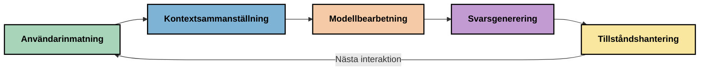
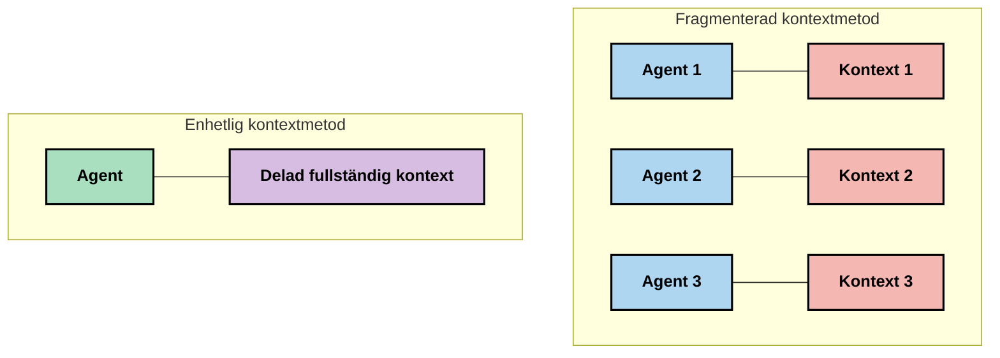
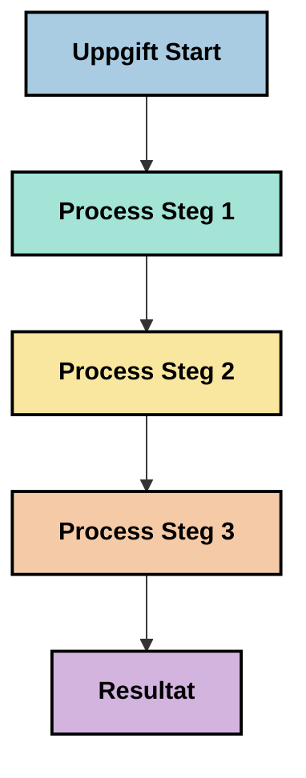
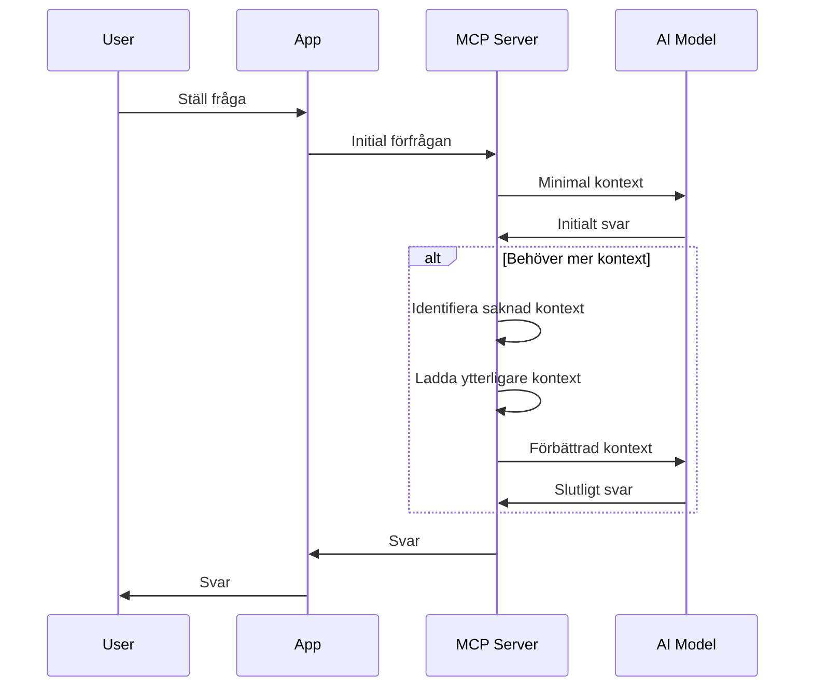
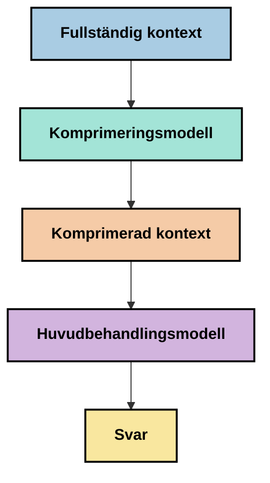
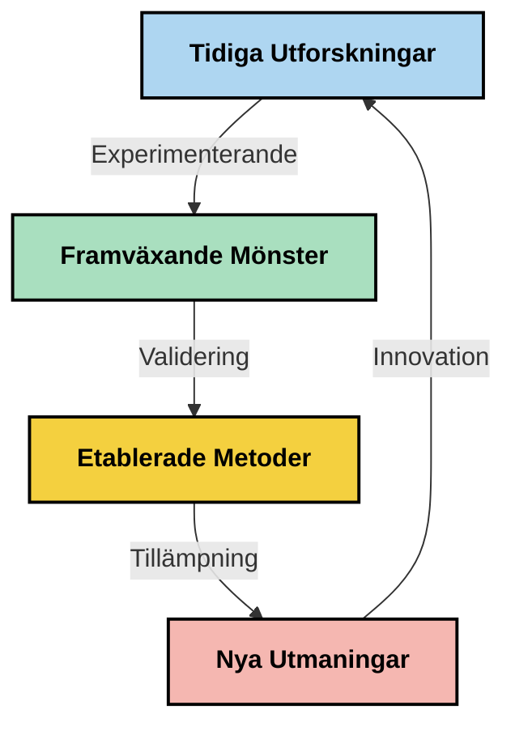

# Context Engineering: Ett framväxande koncept inom MCP-ekosystemet

## Översikt

Context engineering är ett framväxande koncept inom AI-området som undersöker hur information struktureras, levereras och underhålls under interaktioner mellan klienter och AI-tjänster. Allt eftersom Model Context Protocol (MCP)-ekosystemet utvecklas blir förståelsen för hur man effektivt hanterar kontext allt viktigare. Denna modul introducerar konceptet context engineering och utforskar dess möjliga tillämpningar i MCP-implementationer.

## Lärandemål

I slutet av denna modul ska du kunna:

- Förstå det framväxande konceptet context engineering och dess potentiella roll i MCP-applikationer
- Identifiera viktiga utmaningar inom kontexthantering som MCP-protokolldesignen adresserar
- Utforska tekniker för att förbättra modellens prestanda genom bättre kontexthantering
- Överväga metoder för att mäta och utvärdera kontextens effektivitet
- Tillämpa dessa framväxande koncept för att förbättra AI-upplevelser genom MCP-ramverket

## Introduktion till Context Engineering

Context engineering är ett framväxande koncept som fokuserar på medveten utformning och hantering av informationsflödet mellan användare, applikationer och AI-modeller. Till skillnad från etablerade områden som prompt engineering är context engineering fortfarande under definition av praktiker när de försöker lösa de unika utmaningarna med att förse AI-modeller med rätt information vid rätt tidpunkt.

Eftersom stora språkmodeller (LLM) har utvecklats har vikten av kontext blivit allt tydligare. Kvaliteten, relevansen och strukturen på den kontext vi tillhandahåller påverkar direkt modellens uttalanden. Context engineering utforskar denna relation och strävar efter att utveckla principer för effektiv kontexthantering.

> "År 2025 är modellerna där ute extremt intelligenta. Men även den smartaste människan kommer inte att kunna utföra sitt jobb effektivt utan kontexten i vad de ombeds göra... 'Context engineering' är nästa nivå av prompt engineering. Det handlar om att göra detta automatiskt i ett dynamiskt system." — Walden Yan, Cognition AI

Context engineering kan omfatta:

1. **Kontextval**: Att avgöra vilken information som är relevant för en given uppgift
2. **Kontextstrukturering**: Organisera information för att maximera modellens förståelse
3. **Kontextleverans**: Optimera hur och när information skickas till modeller
4. **Kontexthantering**: Hantera tillstånd och utveckling av kontext över tid
5. **Kontextevaluering**: Mäta och förbättra kontextens effektivitet

Dessa fokusområden är särskilt relevanta för MCP-ekosystemet, som erbjuder ett standardiserat sätt för applikationer att tillhandahålla kontext till LLMs.


## Perspektivet kring Kontextresan

Ett sätt att visualisera context engineering är att följa resan information tar genom ett MCP-system:



### Viktiga steg i Kontextresan:

1. **Användarinmatning**: Rå information från användaren (text, bilder, dokument)
2. **Kontextsammanställning**: Kombinera användarinmatning med systemkontext, konversationshistorik och annan hämtad information
3. **Modellbearbetning**: AI-modellen bearbetar den sammanställda kontexten
4. **Svarsproduktion**: Modellen producerar svar baserat på den tillhandahållna kontexten
5. **Tillståndshantering**: Systemet uppdaterar sitt interna tillstånd baserat på interaktionen

Detta perspektiv belyser den dynamiska naturen av kontext i AI-system och väcker viktiga frågor om hur man bäst hanterar information i varje steg.

## Framväxande principer i Context Engineering

När context engineering tar form börjar några tidiga principer dyka upp från praktiker. Dessa principer kan hjälpa till att informera val i MCP-implementationer:

### Princip 1: Dela Kontext Fullständigt

Kontext bör delas fullständigt mellan alla komponenter i ett system snarare än fragmenteras över flera agenter eller processer. När kontext distribueras kan beslut som tas i en del av systemet motsäga beslut som fattas någon annanstans.



I MCP-applikationer antyder detta att designa system där kontext flyter sömlöst genom hela pipelinen snarare än att vara uppdelad i separata delar.

### Princip 2: Erkänn att handlingar bär på implicita beslut

Varje handling som en modell utför inrymmer implicita beslut om hur kontexten ska tolkas. När flera komponenter agerar utifrån olika kontexter kan dessa implicita beslut kollidera och leda till inkonsekventa resultat.

Denna princip har viktiga konsekvenser för MCP-applikationer:
- Föredra linjär bearbetning av komplexa uppgifter framför parallell exekvering med fragmenterad kontext
- Säkerställ att alla beslutsfattande punkter har tillgång till samma kontextuella information
- Designa system där senare steg kan se hela kontexten för tidigare beslut

### Princip 3: Balansera kontextdjup med fönsterbegränsningar

Allteftersom konversationer och processer blir längre svämmar kontextfönstren till slut över. Effektiv context engineering undersöker metoder för att hantera denna balans mellan heltäckande kontext och tekniska begränsningar.

Potentiella metoder som utforskas inkluderar:
- Kontextkomprimering som bibehåller essentiell information samtidigt som tokenanvändningen minskas
- Progressiv inläsning av kontext baserat på relevans för aktuella behov
- Sammanfattning av tidigare interaktioner samtidigt som nyckelbeslut och fakta bevaras

## Kontextutmaningar och MCP-protokollets design

Model Context Protocol (MCP) designades med medvetenhet om de unika utmaningarna med kontexthantering. Att förstå dessa utmaningar hjälper till att förklara viktiga aspekter av MCP-protokollets design:


### Utmaning 1: Begränsningar i kontextfönster
De flesta AI-modeller har fasta storlekar på kontextfönstret, vilket begränsar hur mycket information de kan bearbeta samtidigt.

**MCP-designsvar:** 
- Protokollet stödjer strukturerad, resursbaserad kontext som kan refereras effektivt
- Resurser kan pagineras och laddas progressivt

### Utmaning 2: Bestämning av relevans
Att avgöra vilken information som är mest relevant att inkludera i kontext är svårt.

**MCP-designsvar:**
- Flexibla verktyg möjliggör dynamisk hämtning av information baserat på behov
- Strukturerade prompts möjliggör konsekvent kontextorganisation

### Utmaning 3: Kontextpersistens
Att hantera tillstånd över interaktioner kräver noggrann spårning av kontext.

**MCP-designsvar:**
- Standardiserad sessionshantering
- Klart definierade interaktionsmönster för kontextevolution

### Utmaning 4: Multi-modal kontext
Olika typer av data (text, bilder, strukturerad data) kräver olika behandling.

**MCP-designsvar:**
- Protokolldesignen rymmer olika innehållstyper
- Standardiserad representation av multi-modal information

### Utmaning 5: Säkerhet och integritet
Kontext innehåller ofta känslig information som måste skyddas.

**MCP-designsvar:**
- Klara gränser mellan klient- och serveransvar
- Lokala bearbetningsalternativ för att minimera dataexponering

Att förstå dessa utmaningar och hur MCP adresserar dem ger en grund för att utforska mer avancerade tekniker inom context engineering.

## Framväxande metoder inom Context Engineering

Allt eftersom fältet context engineering utvecklas, framträder flera lovande metoder. Dessa representerar aktuell tankegång snarare än etablerade bästa praxis, och kommer sannolikt att utvecklas med ökad erfarenhet av MCP-implementationer.

### 1. En-trådad linjär bearbetning

Till skillnad från multi-agent-arkitekturer som distribuerar kontext, upptäcker vissa praktiker att en-trådad linjär bearbetning ger mer konsekventa resultat. Detta överensstämmer med principen att bibehålla en enhetlig kontext.



Även om detta tillvägagångssätt kan verka mindre effektivt än parallell bearbetning, ger det ofta mer sammanhängande och pålitliga resultat eftersom varje steg bygger på en fullständig förståelse av tidigare beslut.

### 2. Kontextbrytning och prioritering

Att dela upp stora kontexter i hanterbara delar och prioritera vad som är viktigast.

```python
# Konceptuellt exempel: Kontextindelning och prioritering
def process_with_chunked_context(documents, query):
    # 1. Dela upp dokument i mindre delar
    chunks = chunk_documents(documents)
    
    # 2. Beräkna relevanspoäng för varje del
    scored_chunks = [(chunk, calculate_relevance(chunk, query)) for chunk in chunks]
    
    # 3. Sortera delar efter relevanspoäng
    sorted_chunks = sorted(scored_chunks, key=lambda x: x[1], reverse=True)
    
    # 4. Använd de mest relevanta delarna som kontext
    context = create_context_from_chunks([chunk for chunk, score in sorted_chunks[:5]])
    
    # 5. Bearbeta med den prioriterade kontexten
    return generate_response(context, query)
```

Konceptet ovan illustrerar hur vi kan dela upp stora dokument i hanterbara delar och välja endast de mest relevanta delarna för kontext. Detta tillvägagångssätt kan hjälpa till att arbeta inom begränsningar i kontextfönster samtidigt som stora kunskapsbaser utnyttjas.

### 3. Progressiv kontextinläsning

Att läsa in kontext progressivt vid behov snarare än på en gång.



Progressiv kontextinläsning startar med minimal kontext och expanderar endast när det är nödvändigt. Detta kan avsevärt minska tokenanvändningen för enkla frågor samtidigt som förmågan att hantera komplexa frågor bibehålls.

### 4. Kontextkomprimering och sammanfattning

Att minska kontextstorleken samtidigt som essentiell information bevaras.



Kontextkomprimering fokuserar på:
- Att ta bort redundant information
- Sammanfatta omfattande innehåll
- Extrahera nyckelfakta och detaljer
- Bevara kritiska kontextelement
- Optimera för token-effektivitet

Denna metod kan vara särskilt värdefull för att bibehålla långa konversationer inom kontextfönster eller för effektiv bearbetning av stora dokument. Vissa praktiker använder specialiserade modeller specifikt för kontextkomprimering och sammanfattning av konversationshistorik.


## Explorativa överväganden vid Context Engineering

När vi utforskar det framväxande fältet context engineering är flera överväganden värda att hålla i minnet när man arbetar med MCP-implementationer. Dessa är inte föreskrivande bästa praxis utan snarare områden för utforskning som kan leda till förbättringar i ditt specifika användningsfall.

### Överväg dina kontextmål

Innan du implementerar komplexa lösningar för kontexthantering, formulera tydligt vad du försöker uppnå:
- Vilken specifik information behöver modellen för att lyckas?
- Vilken information är väsentlig kontra kompletterande?
- Vilka är dina prestandabegränsningar (latens, tokenbegränsningar, kostnader)?

### Utforska lagerindelade kontextmetoder

Vissa praktiker har framgång med kontext arrangerad i konceptuella lager:
- **Kärnlager**: Väsentlig information som modellen alltid behöver
- **Situationslager**: Kontext specifik för aktuell interaktion
- **Stödlager**: Extra information som kan vara hjälpsam
- **Reservlager**: Information som endast nås när det behövs

### Undersök strategier för informationhämtning

Effektiviteten i din kontext beror ofta på hur du hämtar information:
- Semantisk sökning och inbäddningar för att hitta konceptuellt relevant information
- Nyckelordsbaserad sökning för specifika faktadetaljer
- Hybrida metoder som kombinerar flera sökmetoder
- Metadatafiltrering för att begränsa omfattningen baserat på kategorier, datum eller källor

### Experimentera med kontextsammanhang

Struktur och flöde i din kontext kan påverka modellens förståelse:
- Gruppera relaterad information tillsammans
- Använd konsekvent formatering och organisering
- Bibehålla logisk eller kronologisk ordning där det är lämpligt
- Undvik motsägelsefull information

### Väg för- och nackdelar med multi-agent-arkitekturer

Även om multi-agent-arkitekturer är populära i många AI-ramverk, medför de betydande utmaningar för kontexthantering:
- Kontextfragmentering kan leda till inkonsekventa beslut mellan agenter
- Parallell bearbetning kan orsaka konflikter som är svåra att lösa
- Kommunikationsöverbelastning mellan agenter kan motverka prestandafördelar
- Komplex tillståndshantering krävs för att bibehålla sammanhang

I många fall kan ett enkelt-agent-tillvägagångssätt med omfattande kontexthantering ge mer pålitliga resultat än flera specialiserade agenter med fragmenterad kontext.

### Utveckla utvärderingsmetoder

För att förbättra context engineering över tid, fundera över hur du ska mäta framgång:
- A/B-testning av olika kontextstrukturer
- Övervakning av tokenanvändning och svarstider
- Spårning av användartillfredsställelse och uppgiftsfärdigställandegrad
- Analys av när och varför kontextstrategier misslyckas

Dessa överväganden representerar aktiva områden för utforskning inom context engineering. När området mognar kommer mer bestämda mönster och praxis sannolikt att framträda.

## Mätning av kontexteffektivitet: Ett utvecklande ramverk

Eftersom context engineering framträder som ett koncept börjar praktiker utforska hur dess effektivitet kan mätas. Inget etablerat ramverk finns ännu, men olika mått övervägs som kan hjälpa till att styra framtida arbete.

### Potentiella mätdimensioner


#### 1. Inmatningseffektivitet

- **Kontext-till-svar-förhållande**: Hur mycket kontext krävs i förhållande till svarsstorleken?
- **Tokenanvändning**: Vilken andel av de tillhandahållna kontexttoken verkar påverka svaret?
- **Kontextreduktion**: Hur effektivt kan vi komprimera rå information?

#### 2. Prestanda

- **Latenspåverkan**: Hur påverkar kontexthantering svarstiden?
- **Tokenekonomi**: Optimerar vi tokenanvändningen effektivt?
- **Hämtprecision**: Hur relevant är den hämtade informationen?
- **Resursanvändning**: Vilka beräkningsresurser krävs?

#### 3. Kvalitet

- **Svarens relevans**: Hur väl svarar svaret på frågeställningen?
- **Faktuell korrekthet**: Förbättrar kontexthantering den faktiska riktigheten?
- **Konsekvens**: Är svaren konsekventa över liknande frågor?
- **Hallucinationsfrekvens**: Minskar bättre kontext modellens hallucinationer?

#### 4. Användarupplevelse

- **Uppföljningsfrekvens**: Hur ofta behöver användare förtydliganden?
- **Uppgiftsavslutning**: Lyckas användare uppnå sina mål?
- **Tillfredsställelseindikatorer**: Hur värderar användare sin upplevelse?

### Explorativa mätmetoder

När du experimenterar med context engineering inom MCP-implementationer, överväg dessa explorativa metoder:

1. **Baslinjajämförelser**: Etablera en baslinje med enkla kontextmetoder innan mer sofistikerade metoder testas

2. **Inkrementella förändringar**: Ändra en aspekt av kontexthanteringen åt gången för att isolera effekterna

3. **Användarcentrerad utvärdering**: Kombinera kvantitativa mått med kvalitativ användarfeedback

4. **Felanalys**: Undersökfall där kontextstrategier misslyckas för att förstå potentiella förbättringar

5. **Multidimensionell bedömning**: Överväg avvägningar mellan effektivitet, kvalitet och användarupplevelse

Detta experimentella, mångfacetterade tillvägagångssätt för mätning överensstämmer med context engineerings framväxande karaktär.

## Avslutande tankar

Context engineering är ett framväxande utforskningsområde som kan visa sig vara centralt för effektiva MCP-applikationer. Genom att medvetet överväga hur information flödar genom ditt system kan du potentiellt skapa AI-upplevelser som är mer effektiva, exakta och värdefulla för användarna.

De tekniker och metoder som presenteras i denna modul representerar tidig tankegång inom området, inte etablerade metoder. Context engineering kan utvecklas till en tydligare disciplin allteftersom AI-kapaciteter utvecklas och vår förståelse fördjupas. För närvarande verkar experimenterande i kombination med noggrann mätning vara det mest produktiva tillvägagångssättet.

## Potentiella framtida riktningar

Fältet context engineering är fortfarande i sin linda, men flera lovande riktningar framträder:

- Principer för context engineering kan avsevärt påverka modellprestanda, effektivitet, användarupplevelse och tillförlitlighet
- En-trådade tillvägagångssätt med omfattande kontexthantering kan prestera bättre än multi-agent-arkitekturer för många användningsfall
- Specialiserade modeller för kontextkomprimering kan bli standardkomponenter i AI-pipelines
- Spänningen mellan kontextfullständighet och tokenbegränsningar kommer sannolikt att driva innovation inom kontexthantering
- Allt eftersom modeller blir mer kapabla att kommunicera effektivt på mänskligt sätt kan sann multi-agent-samarbete bli mer genomförbart
- MCP-implementationer kan utvecklas för att standardisera kontexthanteringsmönster som framträder från nuvarande experiment



## Resurser

### Officiella MCP-resurser
- [Model Context Protocol Website](https://modelcontextprotocol.io/)
- [Model Context Protocol Specification](https://github.com/modelcontextprotocol/modelcontextprotocol)

- [MCP Dokumentation](https://modelcontextprotocol.io/docs)
- [MCP C# SDK](https://github.com/modelcontextprotocol/csharp-sdk)
- [MCP Python SDK](https://github.com/modelcontextprotocol/python-sdk)
- [MCP TypeScript SDK](https://github.com/modelcontextprotocol/typescript-sdk)
- [MCP Inspector](https://github.com/modelcontextprotocol/inspector) - Visuellt testverktyg för MCP-servrar

### Artiklar om kontextteknik
- [Bygg inte Multi-Agents: Principer för kontextteknik](https://cognition.ai/blog/dont-build-multi-agents) - Walden Yans insikter om principer för kontextteknik
- [En praktisk guide för att bygga agenter](https://cdn.openai.com/business-guides-and-resources/a-practical-guide-to-building-agents.pdf) - OpenAIs guide för effektiv agentdesign
- [Att bygga effektiva agenter](https://www.anthropic.com/engineering/building-effective-agents) - Anthropics synsätt på agentutveckling

### Relaterad forskning
- [Dynamisk uppslagsförstärkning för stora språkmodeller](https://arxiv.org/abs/2310.01487) - Forskning om dynamiska uppslagsmetoder
- [Förlorad i mitten: Hur språkmodeller använder långa kontexter](https://arxiv.org/abs/2307.03172) - Viktig forskning om mönster i kontextbehandling
- [Hierarkisk textbetingad bildgenerering med CLIP Latents](https://arxiv.org/abs/2204.06125) - DALL-E 2 artikel med insikter om kontextstrukturering
- [Utforska kontextens roll i arkitekturer för stora språkmodeller](https://aclanthology.org/2023.findings-emnlp.124/) - Senaste forskningen om kontexthantering
- [Samarbete mellan multi-agenter: En översikt](https://arxiv.org/abs/2304.03442) - Forskning om multi-agent system och deras utmaningar

### Ytterligare resurser
- [Optimeringstekniker för kontextfönster](https://learn.microsoft.com/en-us/azure/ai-services/openai/concepts/context-window)
- [Avancerade RAG-tekniker](https://www.microsoft.com/en-us/research/blog/retrieval-augmented-generation-rag-and-frontier-models/)
- [Semantic Kernel-dokumentation](https://github.com/microsoft/semantic-kernel)
- [AI-verktyg för kontexthantering](https://github.com/microsoft/aitoolkit)

## Vad händer härnäst 

- [5.15 MCP Custom Transport](../mcp-transport/README.md)

---

<!-- CO-OP TRANSLATOR DISCLAIMER START -->
**Ansvarsfriskrivning**:
Detta dokument har översatts med hjälp av AI-översättningstjänsten [Co-op Translator](https://github.com/Azure/co-op-translator). Även om vi strävar efter noggrannhet, var vänlig notera att automatiska översättningar kan innehålla fel eller brister. Det ursprungliga dokumentet på dess modersmål bör betraktas som den auktoritativa källan. För kritisk information rekommenderas professionell mänsklig översättning. Vi ansvarar inte för några missförstånd eller feltolkningar som uppstår till följd av användningen av denna översättning.
<!-- CO-OP TRANSLATOR DISCLAIMER END -->