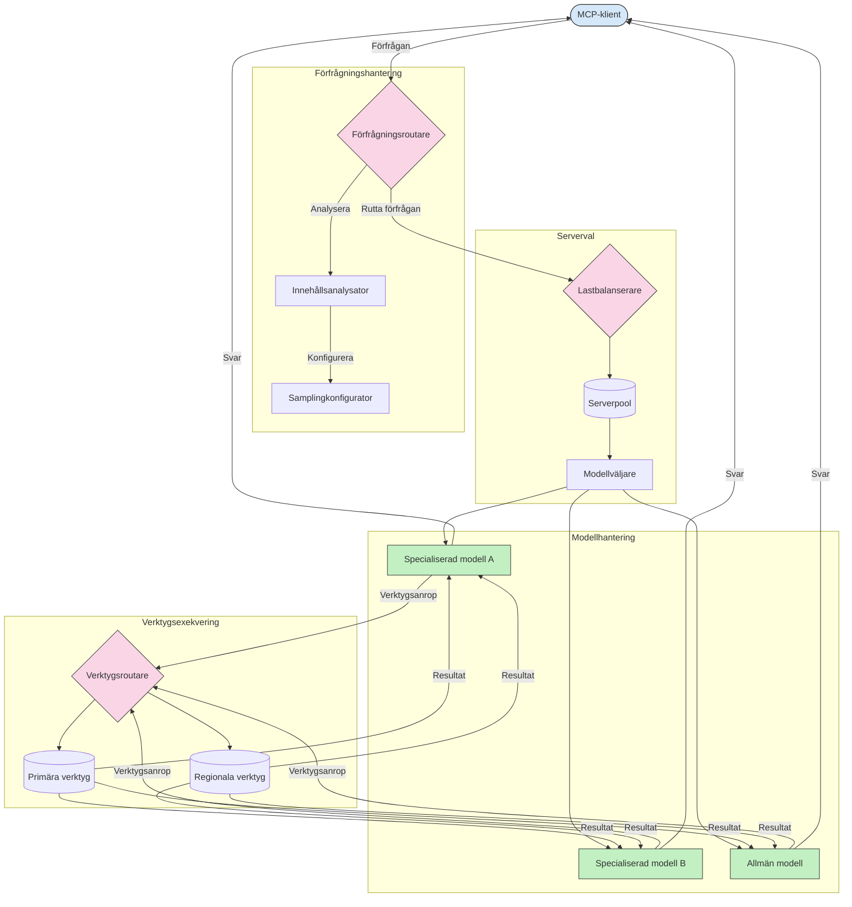

# Routing i Model Context Protocol

Routing är avgörande för att styra förfrågningar till rätt modeller, verktyg eller tjänster inom ett MCP-ekosystem.

## Introduktion

Routing i Model Context Protocol (MCP) innebär att dirigera förfrågningar till de mest lämpliga modellerna eller tjänsterna baserat på olika kriterier såsom innehållstyp, användarkontext och systembelastning. Detta säkerställer effektiv bearbetning och optimal resursanvändning.

## Läromål

I slutet av denna lektion kommer du att kunna:

- Förstå principerna för routing i MCP.
- Implementera innehållsbaserad routing för att dirigera förfrågningar till specialiserade tjänster.
- Tillämpa intelligenta lastbalanseringsstrategier för att optimera resursanvändning.
- Implementera dynamisk verktygsrouting baserat på förfrågningskontext.

## Innehållsbaserad routing

Innehållsbaserad routing styr förfrågningar till specialiserade tjänster baserat på innehållet i förfrågan. Till exempel kan förfrågningar relaterade till kodgenerering skickas till en specialiserad kodmodell, medan kreativa skrivförfrågningar kan skickas till en kreativ skrivmodell.

Låt oss titta på ett exempel på implementation i olika programmeringsspråk.

<details>
<summary>.NET</summary>

```csharp
// .NET Example: Content-based routing in MCP
public class ContentBasedRouter
{
    private readonly Dictionary<string, McpClient> _specializedClients;
    private readonly RoutingClassifier _classifier;
    
    public ContentBasedRouter()
    {
        // Initialize specialized clients for different domains
        _specializedClients = new Dictionary<string, McpClient>
        {
            ["code"] = new McpClient("https://code-specialized-mcp.com"),
            ["creative"] = new McpClient("https://creative-specialized-mcp.com"),
            ["scientific"] = new McpClient("https://scientific-specialized-mcp.com"),
            ["general"] = new McpClient("https://general-mcp.com")
        };
        
        // Initialize content classifier
        _classifier = new RoutingClassifier();
    }
    
    public async Task<McpResponse> RouteAndProcessAsync(string prompt, IDictionary<string, object> parameters = null)
    {
        // Classify the prompt to determine the best specialized service
        string category = await _classifier.ClassifyPromptAsync(prompt);
        
        // Get the appropriate client or fall back to general
        var client = _specializedClients.ContainsKey(category) 
            ? _specializedClients[category] 
            : _specializedClients["general"];
            
        Console.WriteLine($"Routing request to {category} specialized service");
        
        // Send request to the selected service
        return await client.SendPromptAsync(prompt, parameters);
    }
    
    // Simple classifier for routing decisions
    private class RoutingClassifier
    {
        public Task<string> ClassifyPromptAsync(string prompt)
        {
            prompt = prompt.ToLowerInvariant();
            
            if (prompt.Contains("code") || prompt.Contains("function") || 
                prompt.Contains("program") || prompt.Contains("algorithm"))
            {
                return Task.FromResult("code");
            }
            
            if (prompt.Contains("story") || prompt.Contains("creative") || 
                prompt.Contains("imagine") || prompt.Contains("design"))
            {
                return Task.FromResult("creative");
            }
            
            if (prompt.Contains("science") || prompt.Contains("research") || 
                prompt.Contains("analyze") || prompt.Contains("study"))
            {
                return Task.FromResult("scientific");
            }
            
            return Task.FromResult("general");
        }
    }
}
```

I den föregående koden har vi:

- Skapat en `ContentBasedRouter`-klass som dirigerar förfrågningar baserat på innehållet i prompten.
- Initierat specialiserade klienter för olika domäner (kod, kreativt, vetenskapligt, allmänt).
- Implementerat en enkel klassificerare som bestämmer promptens kategori och dirigerar den till rätt specialiserade tjänst.
- Använt en fallback-mekanism för att dirigera förfrågningar till en allmän tjänst om ingen specialiserad tjänst finns tillgänglig.
- Implementerat asynkron bearbetning för att hantera förfrågningar effektivt.
- Använt en ordbok för att mappa innehållskategorier till specialiserade MCP-klienter.
- Implementerat en enkel klassificerare som analyserar prompten och returnerar rätt kategori.
- Använt den specialiserade klienten för att skicka förfrågan och ta emot svar.
- Hanterat fall där prompten inte matchar någon specialiserad kategori genom att dirigera till en allmän tjänst.

</details>

## Intelligent lastbalansering

Lastbalansering optimerar resursanvändningen och säkerställer hög tillgänglighet för MCP-tjänster. Det finns olika sätt att implementera lastbalansering, såsom round-robin, viktad responstid eller innehållsmedvetna strategier.

Låt oss titta på nedanstående exempel som använder följande strategier:

- **Round Robin**: Fördelar förfrågningar jämnt över tillgängliga servrar.
- **Viktad responstid**: Dirigerar förfrågningar till servrar baserat på deras genomsnittliga responstid.
- **Innehållsmedveten**: Dirigerar förfrågningar till specialiserade servrar baserat på förfrågans innehåll.

<details>
<summary>Java</summary>

```java
// Java Exempel: Intelligent lastbalansering för MCP-servrar
public class McpLoadBalancer {
    private final List<McpServerNode> serverNodes;
    private final LoadBalancingStrategy strategy;
    
    public McpLoadBalancer(List<McpServerNode> nodes, LoadBalancingStrategy strategy) {
        this.serverNodes = new ArrayList<>(nodes);
        this.strategy = strategy;
    }
    
    public McpResponse processRequest(McpRequest request) {
        // Välj den bästa servern baserat på strategi
        McpServerNode selectedNode = strategy.selectNode(serverNodes, request);
        
        try {
            // Skicka förfrågan till den valda noden
            return selectedNode.processRequest(request);
        } catch (Exception e) {
            // Hantera fel - implementera omförsök eller reservlogik
            System.err.println("Error processing request on node " + selectedNode.getId() + ": " + e.getMessage());
            
            // Markera noden som potentiellt ohälsosam
            selectedNode.recordFailure();
            
            // Försök nästa bästa nod som reserv
            List<McpServerNode> remainingNodes = new ArrayList<>(serverNodes);
            remainingNodes.remove(selectedNode);
            
            if (!remainingNodes.isEmpty()) {
                McpServerNode fallbackNode = strategy.selectNode(remainingNodes, request);
                return fallbackNode.processRequest(request);
            } else {
                throw new RuntimeException("All MCP server nodes failed to process the request");
            }
        }
    }
    
    // Uppgift för nodhälsokontroll
    public void startHealthChecks(Duration interval) {
        ScheduledExecutorService scheduler = Executors.newScheduledThreadPool(1);
        scheduler.scheduleAtFixedRate(() -> {
            for (McpServerNode node : serverNodes) {
                try {
                    boolean isHealthy = node.checkHealth();
                    System.out.println("Node " + node.getId() + " health status: " + 
                                      (isHealthy ? "HEALTHY" : "UNHEALTHY"));
                } catch (Exception e) {
                    System.err.println("Health check failed for node " + node.getId());
                    node.setHealthy(false);
                }
            }
        }, 0, interval.toMillis(), TimeUnit.MILLISECONDS);
    }
    
    // Gränssnitt för lastbalanseringsstrategier
    public interface LoadBalancingStrategy {
        McpServerNode selectNode(List<McpServerNode> nodes, McpRequest request);
    }
    
    // Rund-robin-strategi
    public static class RoundRobinStrategy implements LoadBalancingStrategy {
        private AtomicInteger counter = new AtomicInteger(0);
        
        @Override
        public McpServerNode selectNode(List<McpServerNode> nodes, McpRequest request) {
            List<McpServerNode> healthyNodes = nodes.stream()
                .filter(McpServerNode::isHealthy)
                .collect(Collectors.toList());
            
            if (healthyNodes.isEmpty()) {
                throw new RuntimeException("No healthy nodes available");
            }
            
            int index = counter.getAndIncrement() % healthyNodes.size();
            return healthyNodes.get(index);
        }
    }
    
    // Viktad svarstidstrategi
    public static class ResponseTimeStrategy implements LoadBalancingStrategy {
        @Override
        public McpServerNode selectNode(List<McpServerNode> nodes, McpRequest request) {
            return nodes.stream()
                .filter(McpServerNode::isHealthy)
                .min(Comparator.comparing(McpServerNode::getAverageResponseTime))
                .orElseThrow(() -> new RuntimeException("No healthy nodes available"));
        }
    }
    
    // Innehållsmedveten strategi
    public static class ContentAwareStrategy implements LoadBalancingStrategy {
        @Override
        public McpServerNode selectNode(List<McpServerNode> nodes, McpRequest request) {
            // Bestäm förfrågningskarakteristika
            boolean isCodeRequest = request.getPrompt().contains("code") || 
                                   request.getAllowedTools().contains("codeInterpreter");
            
            boolean isCreativeRequest = request.getPrompt().contains("creative") || 
                                       request.getPrompt().contains("story");
            
            // Hitta specialiserade noder
            Optional<McpServerNode> specializedNode = nodes.stream()
                .filter(McpServerNode::isHealthy)
                .filter(node -> {
                    if (isCodeRequest && node.getSpecialization().equals("code")) {
                        return true;
                    }
                    if (isCreativeRequest && node.getSpecialization().equals("creative")) {
                        return true;
                    }
                    return false;
                })
                .findFirst();
            
            // Returnera specialiserad nod eller minst belastad nod
            return specializedNode.orElse(
                nodes.stream()
                    .filter(McpServerNode::isHealthy)
                    .min(Comparator.comparing(McpServerNode::getCurrentLoad))
                    .orElseThrow(() -> new RuntimeException("No healthy nodes available"))
            );
        }
    }
}
```

I den föregående koden har vi:

- Skapat en `McpLoadBalancer`-klass som hanterar en lista över MCP-servernoder och dirigerar förfrågningar baserat på vald lastbalanseringsstrategi.
- Implementerat olika lastbalanseringsstrategier: `RoundRobinStrategy`, `ResponseTimeStrategy` och `ContentAwareStrategy`.
- Använt en `ScheduledExecutorService` för att periodiskt kontrollera hälsan hos servernoder.
- Implementerat en hälsokontrollmekanism som markerar noder som friska eller ohälsosamma baserat på deras svar på hälsokontroller.
- Hanterat förfrågningsbearbetning med felhantering och fallback-logik för att säkerställa hög tillgänglighet.
- Använt en `McpServerNode`-klass för att representera individuella MCP-servernoder, inklusive deras hälsostatus, genomsnittliga responstid och aktuell belastning.
- Implementerat en `McpRequest`-klass för att kapsla in förfrågningsdetaljer såsom prompt och tillåtna verktyg.
- Använt Java Streams för att filtrera och välja noder baserat på hälsostatus och specialisering.

</details>

## Dynamisk verktygsrouting

Verktygsrouting säkerställer att verktygsanrop dirigeras till den mest lämpliga tjänsten baserat på kontext. Till exempel kan ett väderverktygsanrop behöva dirigeras till en regional endpoint baserat på användarens plats, eller ett kalkylatorverktyg kan behöva använda en specifik version av API:et.

Låt oss titta på ett exempel som demonstrerar dynamisk verktygsrouting baserat på förfrågningsanalys, regionala endpoints och versionshantering.

<details>
<summary>Python</summary>

```python
# Python Exempel: Dynamisk verktygsdirigering baserat på förfrågningsanalys
class McpToolRouter:
    def __init__(self):
        # Registrera tillgängliga verktygspunktändar
        self.tool_endpoints = {
            "weatherTool": "https://weather-service.example.com/api",
            "calculatorTool": "https://calculator-service.example.com/compute",
            "databaseTool": "https://database-service.example.com/query",
            "searchTool": "https://search-service.example.com/search"
        }
        
        # Regionala punktändar för global distribution
        self.regional_endpoints = {
            "us": {
                "weatherTool": "https://us-west.weather-service.example.com/api",
                "searchTool": "https://us.search-service.example.com/search"
            },
            "europe": {
                "weatherTool": "https://eu.weather-service.example.com/api",
                "searchTool": "https://eu.search-service.example.com/search"
            },
            "asia": {
                "weatherTool": "https://asia.weather-service.example.com/api",
                "searchTool": "https://asia.search-service.example.com/search"
            }
        }
        
        # Stöd för verktygsversionering
        self.tool_versions = {
            "weatherTool": {
                "default": "v2",
                "v1": "https://weather-service.example.com/api/v1",
                "v2": "https://weather-service.example.com/api/v2",
                "beta": "https://weather-service.example.com/api/beta"
            }
        }
    
    async def route_tool_request(self, tool_name, parameters, user_context=None):
        """Route a tool request to the appropriate endpoint based on context"""
        endpoint = self._select_endpoint(tool_name, parameters, user_context)
        
        if not endpoint:
            raise ValueError(f"No endpoint available for tool: {tool_name}")
        
        # Utför själva förfrågan till den valda punktändan
        return await self._execute_tool_request(endpoint, tool_name, parameters)
    
    def _select_endpoint(self, tool_name, parameters, user_context=None):
        """Select the most appropriate endpoint based on context"""
        # Baspunktända från registret
        if tool_name not in self.tool_endpoints:
            return None
            
        base_endpoint = self.tool_endpoints[tool_name]
        
        # Kontrollera om vi behöver använda en specifik verktygsversion
        if tool_name in self.tool_versions:
            version_info = self.tool_versions[tool_name]
            
            # Använd angiven version eller standard
            requested_version = parameters.get("_version", version_info["default"])
            if requested_version in version_info:
                base_endpoint = version_info[requested_version]
        
        # Kontrollera regional dirigering om användarregion är känd
        if user_context and "region" in user_context:
            user_region = user_context["region"]
            
            if user_region in self.regional_endpoints:
                regional_tools = self.regional_endpoints[user_region]
                
                if tool_name in regional_tools:
                    # Använd regionsspecifik punktända
                    return regional_tools[tool_name]
        
        # Kontrollera krav på datalagring
        if user_context and "data_residency" in user_context:
            # Detta skulle implementera logik för att säkerställa att data förblir inom angiven jurisdiktion
            pass
        
        # Kontrollera dirigering baserat på latens
        if user_context and "latency_sensitive" in user_context and user_context["latency_sensitive"]:
            # Detta skulle implementera logik för att välja punktända med lägst latens
            pass
            
        return base_endpoint
        
    async def _execute_tool_request(self, endpoint, tool_name, parameters):
        """Execute the actual tool request to the selected endpoint"""
        try:
            async with aiohttp.ClientSession() as session:
                async with session.post(
                    endpoint,
                    json={"toolName": tool_name, "parameters": parameters},
                    headers={"Content-Type": "application/json"}
                ) as response:
                    if response.status == 200:
                        result = await response.json()
                        return result
                    else:
                        error_text = await response.text()
                        raise Exception(f"Tool execution failed: {error_text}")
        except Exception as e:
            # Implementera logik för omförsök eller fallback-strategi
            print(f"Error executing tool {tool_name} at {endpoint}: {str(e)}")
            raise
```

I den föregående koden har vi:

- Skapat en `McpToolRouter`-klass som hanterar verktygsrouting baserat på förfrågningsanalys, regionala endpoints och stöd för versionshantering.
- Registrerat tillgängliga verktygsendpoints och regionala endpoints för global distribution.
- Implementerat dynamisk routinglogik som väljer lämplig endpoint baserat på användarkontext, såsom region och krav på datahemvist.
- Implementerat versionsstöd för verktyg, vilket tillåter användare att specificera vilken version av ett verktyg de vill använda.
- Använt asynkrona HTTP-förfrågningar för att utföra verktygsanrop och hantera svar.

</details>

## Sampling och routingarkitektur i MCP

Sampling är en kritisk komponent i Model Context Protocol (MCP) som möjliggör effektiv förfrågningsbearbetning och routing. Det innebär att analysera inkommande förfrågningar för att avgöra den mest lämpliga modellen eller tjänsten att hantera dem, baserat på olika kriterier såsom innehållstyp, användarkontext och systembelastning.

Sampling och routing kan kombineras för att skapa en robust arkitektur som optimerar resursanvändning och säkerställer hög tillgänglighet. Samplingprocessen kan användas för att klassificera förfrågningar, medan routing styr dem till rätt modeller eller tjänster.

Diagrammet nedan illustrerar hur sampling och routing samarbetar i en omfattande MCP-arkitektur:



## Vad händer härnäst

- [5.6 Sampling](../mcp-sampling/README.md)

---

<!-- CO-OP TRANSLATOR DISCLAIMER START -->
**Ansvarsfriskrivning**:
Detta dokument har översatts med hjälp av AI-översättningstjänsten [Co-op Translator](https://github.com/Azure/co-op-translator). Även om vi strävar efter noggrannhet, var vänlig notera att automatiska översättningar kan innehålla fel eller brister. Det ursprungliga dokumentet på dess modersmål bör betraktas som den auktoritativa källan. För kritisk information rekommenderas professionell mänsklig översättning. Vi ansvarar inte för några missförstånd eller feltolkningar som uppstår till följd av användningen av denna översättning.
<!-- CO-OP TRANSLATOR DISCLAIMER END -->