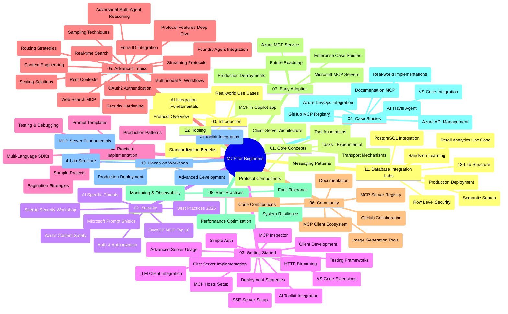

# Model Context Protocol (MCP) för nybörjare - Studieguid

Denna studieguid ger en översikt över arkivstrukturen och innehållet för kursplanen "Model Context Protocol (MCP) för nybörjare". Använd denna guide för att navigera i arkivet effektivt och få ut det mesta av de tillgängliga resurserna.

## Arkivöversikt

Model Context Protocol (MCP) är ett standardiserat ramverk för interaktioner mellan AI-modeller och klientapplikationer. MCP skapades ursprungligen av Anthropic och underhålls nu av den bredare MCP-gemenskapen via den officiella GitHub-organisationen. Detta arkiv innehåller en omfattande kursplan med praktiska kodexempel i C#, Java, JavaScript, Python och TypeScript, utformad för AI-utvecklare, systemarkitekter och mjukvaruingenjörer.

## Visuell kurskarta

## Arkivstruktur

Arkivet är organiserat i tolv huvudavsnitt, var och en med fokus på olika aspekter av MCP:

1. **Introduktion (00-Introduction/)**
   - Översikt av Model Context Protocol
   - Varför standardisering är viktigt i AI-pipelines
   - Praktiska användningsfall och fördelar

2. **Kärnbegrepp (01-CoreConcepts/)**
   - Klient-server-arkitektur
   - Protokollkomponenter
   - Meddelandemönster i MCP
   - Framåtblickande: [Vad förändras i MCP: Release Candidate 2026-07-28](./01-CoreConcepts/mcp-2026-07-28-release-candidate.md) — den stateless protocol-kärnan, Extensions-ramverket, och Roots/Sampling/Logging som fasas ut i nästa specifikationsversion

3. **Säkerhet (02-Security/)**
   - Säkerhetshot i MCP-baserade system
   - Bästa praxis för säkra implementationer
   - Autentiserings- och auktoriseringsstrategier
   - **Omfattande säkerhetsdokumentation**:
     - MCP Security Best Practices 2025
     - Azure Content Safety Implementation Guide
     - MCP Security Controls and Techniques
     - MCP Best Practices Quick Reference
   - **Viktiga säkerhetsämnen**:
     - Promptinjektion och verktygsförgiftning
     - Sessionskapning och confused deputy-problem
     - Token passthrough-sårbarheter
     - Överdrivna behörigheter och åtkomstkontroll
     - Säkerhet i leverantörskedjan för AI-komponenter
     - Microsoft Prompt Shields-integration

4. **Kom igång (03-GettingStarted/)**
   - Miljöuppsättning och konfiguration
   - Skapa grundläggande MCP-servrar och klienter
   - Integration med befintliga applikationer
   - Inkluderar avsnitt för:
     - Första serverimplementationen
     - Klientutveckling
     - LLM-klientintegration
     - VS Code-integration
     - Server-Sent Events (SSE)-server
     - Avancerad serveranvändning
     - HTTP-streaming
     - AI Toolkit-integration
     - Teststrategier
     - Riktlinjer för distribution

5. **Praktisk implementation (04-PracticalImplementation/)**
   - Användning av SDK:er i olika programmeringsspråk
   - Debugging, testning och valideringstekniker
   - Skapande av återanvändbara promptmallar och arbetsflöden
   - Exempelprojekt med implementationsexempel

6. **Avancerade ämnen (05-AdvancedTopics/)**
   - Tekniker för kontextutformning
   - Foundry-agentintegration
   - Multi-modal AI-arbetsflöden
   - OAuth2-autentiseringsdemonstrationer
   - Realtidssökfunktioner
   - Realtidsstreaming
   - Implementation av root contexts
   - Routingstrategier
   - Samplingstekniker
   - Skalningsmetoder
   - Säkerhetsöverväganden
   - Entra ID-säkerhetsintegration
   - Webbsökintegration
   - Adversarial multi-agent resonemang (debattmönster)

7. **Gemenskapsbidrag (06-CommunityContributions/)**
   - Hur man bidrar med kod och dokumentation
   - Samarbete via GitHub
   - Gemenskapsdrivna förbättringar och feedback
   - Använda olika MCP-klienter (Claude Desktop, Cline, VSCode)
   - Arbeta med populära MCP-servrar inklusive bildgenerering

8. **Lärdomar från tidig adoption (07-LessonsfromEarlyAdoption/)**
   - Verkliga implementationer och framgångshistorier
   - Bygga och distribuera MCP-baserade lösningar
   - Trender och framtida färdplan
   - **Microsoft MCP Servers Guide**: Omfattande guide till 10 produktionsredo Microsoft MCP-servrar inklusive:
     - Microsoft Learn Docs MCP Server
     - Azure MCP Server (15+ specialiserade anslutningar)
     - GitHub MCP Server
     - Azure DevOps MCP Server
     - MarkItDown MCP Server
     - SQL Server MCP Server
     - Playwright MCP Server
     - Dev Box MCP Server
     - Microsoft Foundry MCP Server
     - Microsoft 365 Agents Toolkit MCP Server

9. **Bästa praxis (08-BestPractices/)**
   - Prestandaoptimering och tuning
   - Design av fel-toleranta MCP-system
   - Testning och resiliensstrategier

10. **Fallstudier (09-CaseStudy/)**
    - **Sju omfattande fallstudier** som demonstrerar MCP:s mångsidighet i olika scenarier:
    - **Azure AI Travel Agents**: Multi-agent orkestrering med Azure OpenAI och AI Search
    - **Azure DevOps Integration**: Automatisering av arbetsflödesprocesser med YouTube-datauppdateringar
    - **Realtidsdokumenthämtning**: Python-konsultient med HTTP-streaming
    - **Interaktiv studieplansgenerator**: Chainlit-webbapp med konverserande AI
    - **In-Editor-dokumentation**: VS Code-integration med GitHub Copilot-arbetsflöden
    - **Azure API Management**: Integrering av företags-API med skapande av MCP-server
    - **GitHub MCP Registry**: Ekosystemutveckling och agentisk integrationsplattform
    - Implementations exempel som sträcker sig över företagsintegration, utvecklarproduktivitet och ekosystemutveckling

11. **Praktisk workshop (10-StreamliningAIWorkflowsBuildingAnMCPServerWithAIToolkit/)**
    - Omfattande praktisk workshop som kombinerar MCP med AI Toolkit
    - Bygga intelligenta applikationer som förbinder AI-modeller med verkliga verktyg
    - Praktiska moduler som täcker grunder, anpassad serverutveckling och produktionsdistributionsstrategier
    - **Labstruktur**:
      - Lab 1: MCP Server Fundamentals
      - Lab 2: Avancerad MCP-serverutveckling
      - Lab 3: AI Toolkit-integration
      - Lab 4: Produktionsdistribution och skalning
    - Labbaserat lärande med steg-för-steg-instruktioner

12. **MCP Server Database Integration Labs (11-MCPServerHandsOnLabs/)**
    - **Omfattande 13-labbars lärandevag** för att bygga produktionsredo MCP-servrar med PostgreSQL-integration
    - **Verklig detaljerad implementering inom detaljhandel** med Zava Retail-användarfallet
    - **Enterprise-klassmönster** inklusive Row Level Security (RLS), semantisk sökning och multi-tenant dataåtkomst
    - **Fullständig labstruktur**:
      - **Labs 00-03: Grunder** - Introduktion, Arkitektur, Säkerhet, Miljöuppsättning
      - **Labs 04-06: Bygga MCP-servern** - Databasedesign, MCP-serverimplementation, verktygsutveckling
      - **Labs 07-09: Avancerade funktioner** - Semantisk sökning, testning & debugging, VS Code-integration
      - **Labs 10-12: Produktion & bästa praxis** - Distribution, övervakning, optimering
    - **Teknologier som täcks**: FastMCP-ramverk, PostgreSQL, Azure OpenAI, Azure Container Apps, Application Insights
    - **Lärandemål**: Produktionsklara MCP-servrar, databasintegrationsmönster, AI-driven analys, företagsäkerhet

13. **Verktyg (12-tooling/)**
    - Lär dig hur du använder MCP i Copilot-appen och andra verktyg

## Ytterligare resurser

Arkivet inkluderar stödresurser:

- **Mapp för bilder**: Innehåller diagram och illustrationer som används i hela kursplanen
- **Översättningar**: Fler språk med automatiserade översättningar av dokumentationen
- **Officiella MCP-resurser**:
  - [MCP-dokumentation](https://modelcontextprotocol.io/)
  - [MCP-specifikation](https://spec.modelcontextprotocol.io/)
  - [MCP GitHub-arkiv](https://github.com/modelcontextprotocol)

## Hur man använder detta arkiv

1. **Sekventiellt lärande**: Följ kapitlen i ordning (00 till 11) för en strukturerad inlärningsupplevelse.
2. **Språkspecifik fokus**: Om du är intresserad av ett visst programmeringsspråk, utforska katalogerna med exempel för implementationer i ditt föredragna språk.
3. **Praktisk implementation**: Börja med avsnittet "Kom igång" för att ställa in din miljö och skapa din första MCP-server och klient.
4. **Avancerad utforskning**: När du är bekväm med grunderna, fördjupa dig i de avancerade ämnena för att utöka din kunskap.
5. **Gemenskapsengagemang**: Gå med i MCP-gemenskapen via GitHub-diskussioner och Discord-kanaler för att knyta kontakt med experter och andra utvecklare.

## MCP-klienter och verktyg

Kursplanen täcker olika MCP-klienter och verktyg:

1. **Officiella klienter**:
   - Visual Studio Code
   - MCP i Visual Studio Code
   - Claude Desktop
   - Claude i VSCode
   - Claude API

2. **Gemenskapsklienter**:
   - Cline (terminalbaserad)
   - Cursor (kodredigerare)
   - ChatMCP
   - Windsurf

3. **MCP-hanteringsverktyg**:
   - MCP CLI
   - MCP Manager
   - MCP Linker
   - MCP Router

## Populära MCP-servrar

Arkivet presenterar olika MCP-servrar, inklusive:

1. **Officiella Microsoft MCP-servrar**:
   - Microsoft Learn Docs MCP Server
   - Azure MCP Server (15+ specialiserade anslutningar)
   - GitHub MCP Server
   - Azure DevOps MCP Server
   - MarkItDown MCP Server
   - SQL Server MCP Server
   - Playwright MCP Server
   - Dev Box MCP Server
   - Microsoft Foundry MCP Server
   - Microsoft 365 Agents Toolkit MCP Server

2. **Officiella referensservrar**:
   - Filesystem
   - Fetch
   - Memory
   - Sequential Thinking

3. **Bildgenerering**:
   - Azure OpenAI DALL-E 3
   - Stable Diffusion WebUI
   - Replicate

4. **Utvecklingsverktyg**:
   - Git MCP
   - Terminal Control
   - Code Assistant

5. **Specialiserade servrar**:
   - Salesforce
   - Microsoft Teams
   - Jira & Confluence

## Bidra

Detta arkiv välkomnar bidrag från gemenskapen. Se avsnittet Gemenskapsbidrag för vägledning om hur du kan bidra effektivt till MCP-ekosystemet.

----

*Denna studieguid uppdaterades senast den 5 februari 2026, speglande den senaste MCP-specifikationen 2025-11-25 och ger en översikt över arkivet per det datumet. Arkivets innehåll kan uppdateras efter detta datum.*

*Tillägg (2 juli 2026): en lektion om `2026-07-28` MCP-specifikations Release Candidate lades till under [01-CoreConcepts](./01-CoreConcepts/mcp-2026-07-28-release-candidate.md); kursplanens baslinje förblir 2025-11-25 tills ny specifikation släpps.*

---

<!-- CO-OP TRANSLATOR DISCLAIMER START -->
**Ansvarsfriskrivning**:
Detta dokument har översatts med hjälp av AI-översättningstjänsten [Co-op Translator](https://github.com/Azure/co-op-translator). Även om vi strävar efter noggrannhet, var vänlig notera att automatiska översättningar kan innehålla fel eller brister. Det ursprungliga dokumentet på dess modersmål bör betraktas som den auktoritativa källan. För kritisk information rekommenderas professionell mänsklig översättning. Vi ansvarar inte för några missförstånd eller feltolkningar som uppstår till följd av användningen av denna översättning.
<!-- CO-OP TRANSLATOR DISCLAIMER END -->