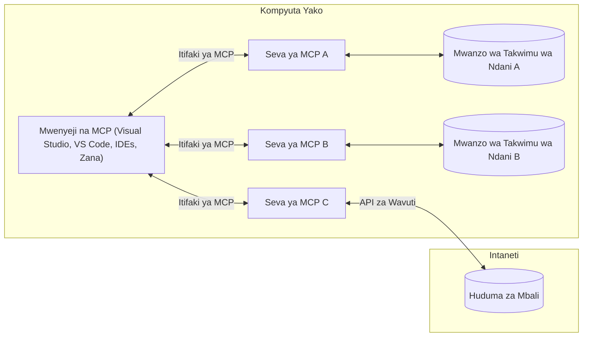

# Dhana za Msingi za MCP: Kumiliki Itifaki ya Muktadha wa Mfano kwa Uunganishaji wa AI

[](https://youtu.be/earDzWGtE84)

_(Bonyeza picha hapo juu kutazama video ya somo hili)_

[Itifaki ya Muktadha wa Mfano (MCP)](https://github.com/modelcontextprotocol) ni mfumo wenye nguvu, uliowekwa viwango unaoboreshwa mawasiliano kati ya Miundo Mikubwa ya Lugha (LLMs) na zana za nje, programu, na vyanzo vya data. 
Mwongozo huu utakuelekeza kupitia dhana za msingi za MCP. Utajifunza kuhusu usanifu wa mteja-seva, vipengele muhimu, mbinu za mawasiliano, na mbinu bora za utekelezaji.

- **Idhini Elekezi ya Mtumiaji**: Upatikanaji wa data na shughuli zote zinahitaji idhini wazi ya mtumiaji kabla ya utekelezaji. Watumiaji lazima wawe na ufahamu wazi wa data gani itapatikana na ni hatua gani zitachukuliwa, kwa udhibiti wa kina juu ya ruhusa na vibali.

- **Ulinzi wa Faragha ya Data**: Data za mtumiaji zinaonyeshwa tu kwa idhini elekezi na lazima zilindwa na udhibiti wa upatikanaji thabiti katika mzunguko mzima wa mwingiliano. Utekelezaji lazima uzuie usambazaji usiopewa ruhusa wa data na kudumisha mipaka madhubuti ya faragha.

- **Usalama wa Utekelezaji wa Zana**: Kila kuanzishwa kwa zana kunahitaji idhini elekezi ya mtumiaji huku mtumiaji akielewa kwa uwazi utendaji, vigezo, na athari zinazowezekana za zana hiyo. Mipaka thabiti ya usalama lazima izuie utekelezaji wa zana ambao si salama, usiozalishwa, au wenye madhara.

- **Usalama wa Tabaka la Usafirishaji**: Njia zote za mawasiliano zinapaswa kutumia mbinu zinazofaa za usimbaji fiche na uthibitishaji. Mikutano ya mbali inapaswa kutekeleza itifaki salama za usafirishaji na usimamizi sahihi wa vitambulisho.

#### Mwongozo wa Utekelezaji:

- **Usimamizi wa Ruhusa**: Tekeleza mifumo ya ruhusa ya kina inayowaruhusu watumiaji kudhibiti seva, zana, na rasilimali zinazopatikana
- **Uthibitishaji na Uidhinishaji**: Tumia mbinu salama za uthibitishaji (OAuth, API keys) na usimamizi sahihi wa tokeni na muda wake wa matumizi  
- **Uthibitishaji wa Ingizo**: Thibitisha vigezo na data zote zinazoingizwa kulingana na muundo ulioainishwa ili kuzuia mashambulizi ya kuingiza
- **Rekodi za Ukaguzi**: Dumisha rekodi kamili za shughuli zote kwa ufuatiliaji wa usalama na utimilifu

## Muhtasari

Somo hili linachunguza usanifu wa msingi na vipengele vinavyounda mfumo wa Itifaki ya Muktadha wa Mfano (MCP). Utajifunza kuhusu usanifu wa mteja-seva, vipengele kuu, na mbinu za mawasiliano zinazofanikisha mwingiliano wa MCP.

## Malengo Muhimu ya Kujifunza

Mwisho wa somo hili, utakuwa umejifunza:

- Kutambua usanifu wa mteja-seva wa MCP.
- Kubaini majukumu na wajibu wa Wenyeji, Wateja, na Seva.
- Kuchambua vipengele vya msingi vinavyofanya MCP kuwa tabaka linalobadilika la uunganishaji.
- Kujifunza jinsi taarifa zinavyosambazwa ndani ya mfumo wa MCP.
- Kupata maarifa ya vitendo kupitia mifano ya nambari katika .NET, Java, Python, na JavaScript.

## Usanifu wa MCP: Muangazo wa Kina

Mfumo wa MCP umejengwa kwa mfano wa mteja-seva. Muundo huu wa moduli unaruhusu programu za AI kuingiliana na zana, hifadhidata, API, na rasilimali za muktadha kwa ufanisi. Tuchambue usanifu huu kwa vipengele vyake vikuu.

Kwenye msingi wake, MCP inafuata usanifu wa mteja-seva ambapo programu mwenyeji inaweza kuungana na seva nyingi:



- **Wenyeji wa MCP**: Programu kama VSCode, Claude Desktop, IDEs, au zana za AI zinazotaka kupata data kupitia MCP
- **Wateja wa MCP**: Wateja wa itifaki wanaoshikilia uhusiano wa 1:1 na seva
- **Seva za MCP**: Programu nyepesi zinazoweka uwezo maalum kupitia Itifaki ya Muktadha wa Mfano uliowekwa viwango
- **Vyanzo vya Data vya Mitaa**: Faili za kompyuta yako, hifadhidata, na huduma ambazo seva za MCP zinaweza kufikia kwa usalama
- **Huduma za Mbali**: Mifumo ya nje inayopatikana mtandaoni ambayo seva za MCP zinaweza kuungana nayo kupitia API.

Itifaki ya MCP ni kiwango kinachoendelea kutengenezwa kinachotumia toleo la tarehe (muundo YYYY-MM-DD). Toleo la sasa la itifaki ni **2025-11-25**. Unaweza kuona masasisho ya hivi punde kwenye [vipimo vya itifaki](https://modelcontextprotocol.io/specification/2025-11-25/)

> **Kuangalia mbele:** mgombea wa toleo la toleo lijalo, **2026-07-28**, ulitangazwa Mei 2026 na umepangwa kutoa tarehe 28 Julai, 2026. Unafanya itifaki kuwa isiyohifadhi hali kwenye tabaka la usafirishaji (kuondoa usalama wa `initialize` na vitambulisho vya kikao), kuweka rasmi Mfumo wa Upanuzi, na kuachana na Roots, Sampling, na Logging kwa faida ya mifumo mipya. Tazama [Mabadiliko katika MCP: Mgombea wa Toleo la 2026-07-28](./mcp-2026-07-28-release-candidate.md) kwa ufafanuzi kamili.

### 1. Wenyeji

Kwenye Itifaki ya Muktadha wa Mfano (MCP), **Wenyeji** ni programu za AI ambazo hutumika kama kiolesura kikuu ambacho watumiaji hutumia kuingiliana na itifaki. Wenyeji huandaa na kusimamia miunganisho kwa seva nyingi za MCP kwa kuunda wateja wa MCP waliotengwa kwa kila muunganisho wa seva. Mifano ya Wenyeji ni:

- **Programu za AI**: Claude Desktop, Visual Studio Code, Claude Code
- **Mazungumzo ya Maendeleo**: IDEs na wahariri wa nambari wenye ujumuishaji wa MCP  
- **Programu za Kipekee**: Wakala na zana za AI zilizojengwa kwa madhumuni maalum

**Wenyeji** ni programu zinazoratibu mwingiliano wa miundo ya AI. Wanahakikisha:

- **Kupangilia Miundo ya AI**: Kutekeleza au kuingiliana na LLMs ili kuzalisha majibu na kuratibu mtiririko wa kazi za AI
- **Kusimamia Miunganisho ya Wateja**: Kuunda na kudumisha mteja mmoja wa MCP kwa kila muunganisho wa seva wa MCP
- **Kudhibiti Kiolesura cha Mtumiaji**: Kudhibiti mchakato wa mazungumzo, mwingiliano wa watumiaji, na uwasilishaji wa majibu  
- **Kutekeleza Usalama**: Kudhibiti ruhusa, vikwazo vya usalama, na uthibitishaji
- **Kushughulikia Idhini ya Mtumiaji**: Kusimamia idhini ya mtumiaji kwa kushiriki data na utekelezaji wa zana


### 2. Wateja

**Wateja** ni vipengele muhimu vinavyoendeleza miunganisho ya moja kwa moja kati ya Wenyeji na seva za MCP. Kila mteja wa MCP hutengenezwa na Mwenyeji kuungana na seva maalum ya MCP, kuhakikisha njia za mawasiliano zilizopangwa na zenye usalama. Wateja wengi huruhusu Wenyeji kuungana na seva nyingi kwa wakati mmoja.

**Wateja** ni vipengele vya kiunganishi ndani ya programu mwenyeji. Wanahakikisha:

- **Mawasiliano ya Itifaki**: Kutuma maombi ya JSON-RPC 2.0 kwa seva zenye maelekezo na maagizo
- **Mazungumzo ya Uwezo**: Kujadiliana vipengele vinavyounga mkono na toleo za itifaki na seva wakati wa usanifu
- **Utekelezaji wa Zana**: Kusimamia maombi ya utekelezaji wa zana kutoka kwa miundo na kushughulikia majibu
- **Masasisho ya Wakati Halisi**: Kushughulikia taarifa za arifa na masasisho ya wakati halisi kutoka kwa seva
- **Ushughulikiaji wa Majibu**: Kusindika na kuunda muundo wa majibu ya seva kwa ajili ya kuonyeshwa kwa watumiaji

### 3. Seva

**Seva** ni programu zinazotoa muktadha, zana, na uwezo kwa wateja wa MCP. Zinapatikana kutekeleza kwa ndani (kwenye mashine ile ile na Mwenyeji) au kwa mbali (juu ya majukwaa ya nje), na zinawajibika kushughulikia maombi ya mteja na kutoa majibu yaliyopangwa. Seva hutoa utendaji maalum kupitia Itifaki ya Muktadha wa Mfano iliyowekwa viwango.

**Seva** ni huduma zinazotoa muktadha na uwezo. Wanahakikisha:

- **Usajili wa Vipengele**: Kusajili na kuonyesha vitu vinavyopatikana (rasilimali, maagizo, zana) kwa wateja
- **Ushughulikiaji wa Maombi**: Kupokea na kutekeleza simu za zana, maombi ya rasilimali, na maombi ya maagizo kutoka kwa wateja
- **Utoaji wa Muktadha**: Kutoa taarifa za muktadha na data ili kuboresha majibu ya mfano
- **Usimamizi wa Hali**: Kudumisha hali ya kikao na kushughulikia mwingiliano wenye hali inapohitajika
- **Arifa za Wakati Halisi**: Kutuma taarifa kuhusu mabadiliko ya uwezo na masasisho kwa wateja waliounganishwa

Seva zinaweza kuendelezwa na mtu yeyote ili kupanua uwezo wa modeli kwa utendaji maalum, na zinaunga mkono mazingira ya usambazaji wa ndani na mbali.

### 4. Vituasili vya Seva

Seva katika Itifaki ya Muktadha wa Mfano (MCP) hutoa vitu vitatu vya msingi **vituasili** vinavyobainisha vipengele vya msingi vya mwingiliano tajiri kati ya wateja, wenyeji, na miundo ya lugha. Vituasili hivi vinafafanua aina za taarifa za muktadha na vitendo vinavyopatikana kupitia itifaki.

Seva za MCP zinaweza kuonyesha mchanganyiko wowote wa vituasili vitatu vifuatavyo:

#### Rasilimali 

**Rasilimali** ni vyanzo vya data vinavyotoa taarifa za muktadha kwa programu za AI. Zinawakilisha maudhui ya statiki au ya mabadiliko yanayoweza kuboresha ufahamu wa mfano na uamuzi:

- **Data za Muktadha**: Taarifa zilizopangwa na muktadha kwa matumizi ya mfano wa AI
- **Maktaba za Maarifa**: Mabuku, makala, mikataba, na karatasi za utafiti
- **Vyanzo vya Data vya Mitaa**: Faili, hifadhidata, na taarifa za mfumo wa ndani  
- **Data za Nje**: Majibu ya API, huduma za wavuti, na data za mifumo ya mbali
- **Maudhui Yanayobadilika**: Data ya wakati halisi inayosasishwa kulingana na hali za nje

Rasilimali hutambulishwa kwa URIs na husaidia kugunduliwa kupitia `resources/list` na kupatikana kupitia `resources/read`:

```text
file://documents/project-spec.md
database://production/users/schema
api://weather/current
```

#### Maagizo

**Maagizo** ni mifano inayoweza kutumika tena ambayo husaidia kuunda muingiliano na miundo ya lugha. Hutoa mifumo ya mawasiliano iliyowekwa viwango na mtiririko wa kazi uliopangwa awali:

- **Mizunguko ya Mifano**: Ujumbe uliotengenezwa awali na mwanzo wa mazungumzo
- **Mifumo ya Mtiririko wa Kazi**: Mfululizo uliowekwa viwango kwa kazi na mwingiliano ya kawaida
- **Mifano ya Few-shot**: Mifano ya maelekezo ya mfano
- **Maagizo ya Mfumo**: Maagizo ya msingi yanayobainisha tabia na muktadha wa mfano
- **Mifumo Inayobadilika**: Maagizo yaliyoparametirika yanayobadilika kwa muktadha maalum

Maagizo yanasaidia uingizaji wa vigezo na yanaweza kugunduliwa kupitia `prompts/list` na kupatikana kupitia `prompts/get`:

```markdown
Generate a {{task_type}} for {{product}} targeting {{audience}} with the following requirements: {{requirements}}
```

#### Zana

**Zana** ni kazi zinazotekelezwa ambazo miundo ya AI inaweza kuitisha kutekeleza vitendo maalum. Zinawakilisha "vitenzi" vya mfumo wa MCP, kuwezesha miundo kuingiliana na mifumo ya nje:

- **Kazi Zinazotekelezwa**: Operesheni za pekee zinazoweza kuitishwa na miundo kwa vigezo maalum
- **Uunganishaji wa Mifumo ya Nje**: Simu za API, maswali ya hifadhidata, operesheni za faili, mahesabu
- **Utambulisho wa Kipekee**: Kila zana ina jina la kipekee, maelezo, na muundo wa vigezo
- **Ingizo/Mwisho ulioandaliwa**: Zana zinakubali vigezo vilivyothibitishwa na kurudisha majibu yaliyo na muundo na aina
- **Uwezo wa Vitendo**: Kuwezesha miundo kutekeleza vitendo halisi na kupata data inayoendelea

Zana zinafafanuliwa kwa Schema ya JSON kwa ajili ya uthibitishaji wa vigezo na kugunduliwa kupitia `tools/list` na kutekelezwa kupitia `tools/call`. Zana pia zinaweza kujumuisha **ikoni** kama metadata ya ziada kwa uwasilishaji bora wa kiolesura.

**Maelezo ya Zana**: Zana zinaunga mkono maelezo ya tabia (kwa mfano, `readOnlyHint`, `destructiveHint`) yanayobainisha ikiwa zana ni ya kusoma tu au hatari, kusaidia wateja kufanya maamuzi sahihi kuhusu utekelezaji wa zana.

Mfano wa ufafanuzi wa zana:

```typescript
server.tool(
  "search_products", 
  {
    query: z.string().describe("Search query for products"),
    category: z.string().optional().describe("Product category filter"),
    max_results: z.number().default(10).describe("Maximum results to return")
  }, 
  async (params) => {
    // Fanya utafutaji na rudisha matokeo yaliyo na muundo
    return await productService.search(params);
  }
);
```

## Vituasili vya Wateja

Kwenye Itifaki ya Muktadha wa Mfano (MCP), **wateja** wanaweza kuonyesha vituasili vinavyozwia seva kuomba uwezo zaidi kutoka kwa programu mwenyeji. Vituasili hivi vya upande wa mteja vinaruhusu utekelezaji tajiri zaidi na mwingiliano mzuri wa seva unaoweza kupata uwezo wa miundo ya AI na mwingiliano wa watumiaji.

### Sampuli

> **Taarifa ya Kuachwa:** mgombea wa toleo la `2026-07-28` hutoa Sampuli kama kiwango kilichoachwa kwa faida ya ujumuishaji wa moja kwa moja na API za wasambazaji wa LLM. Inaendelea kufanya kazi katika `2025-11-25` na kwa angalau mwaka mmoja baada ya kuachwa, lakini miundo mipya inapaswa kutumia mfano uliobadilishwa. Tazama [Mabadiliko katika MCP: Mgombea wa Toleo la 2026-07-28](./mcp-2026-07-28-release-candidate.md).

**Sampuli** inaruhusu seva kuomba ukamilifu wa modeli ya lugha kutoka kwa programu ya AI ya mteja. Vituasili hii inawawezesha seva kufikia uwezo wa LLM bila kuingiza utegemezi wa modeli:

- **Upatikanaji Huru wa Mfano**: Seva zinaweza kuomba ukamilifu bila kujumuisha SDK za LLM au kusimamia upatikanaji wa modeli
- **AI Inayoanzishwa na Seva**: Inawezesha seva kuzalisha maudhui kwa uhuru kwa kutumia mfano wa AI wa mteja
- **Mwingiliano wa Kurudia wa LLM**: Inasaidia hali ngumu ambapo seva zinahitaji msaada wa AI kwa usindikaji
- **Uzalishaji wa Maudhui Yanayobadilika**: Inaruhusu seva kuunda majibu ya muktadha kwa kutumia mfano wa mwenyeji
- **Msaada wa Kuwaita Zana**: Seva zinaweza kujumuisha vigezo vya `tools` na `toolChoice` kuwezesha mfano wa mteja kuitisha zana wakati wa sampuli

Sampuli huanzishwa kupitia njia ya `sampling/complete`, ambapo seva hutuma maombi ya ukamilifu kwa wateja.

### Mizizi

> **Taarifa ya Kuachwa:** mgombea wa toleo la `2026-07-28` hutoa Mizizi kama kiwango kilichoachwa kwa faida ya vigezo vya zana, URI za rasilimali, au usanifu wa seva. Inaendelea kufanya kazi katika `2025-11-25` na kwa angalau mwaka mmoja baada ya kuachwa. Tazama [Mabadiliko katika MCP: Mgombea wa Toleo la 2026-07-28](./mcp-2026-07-28-release-candidate.md).

**Mizizi** hutoa njia iliyowekwa viwango ya wateja kuonyesha mipaka ya mfumo wa faili kwa seva, kusaidia seva kuelewa ni folda na faili gani wanazo ruhusa ya kufikia:

- **Mipaka ya Mfumo wa Faili**: Bainisha mipaka ya maeneo ambayo seva zinaweza kufanya kazi ndani ya mfumo wa faili
- **Udhibiti wa Upatikanaji**: Saidia seva kuelewa ni folda na faili gani wanazo ruhusa ya kufikia
- **Masasisho Yanayobadilika**: Wateja wanaweza kuarifu seva wakati orodha ya mizizi inabadilika
- **Utambulisho wa Kulingana na URI**: Mizizi hutumia URIs za `file://` kutambua folda na faili zinazopatikana

Mizizi hugunduliwa kupitia njia ya `roots/list`, na wateja hutuma `notifications/roots/list_changed` wakati mizizi inapo badilika.

### Ukiwa  

**Ukiwa** unawawezesha seva kuomba taarifa zaidi au uthibitisho kutoka kwa watumiaji kupitia kiolesura cha mteja:

- **Maombi ya Uingizaji wa Mtumiaji**: Seva zinaweza kuomba taarifa zaidi inapohitajika kwa utekelezaji wa zana
- **Mizunguko ya Uthibitisho**: Kuomba idhini ya mtumiaji kwa shughuli nyeti au zenye athari kubwa
- **Mtiririko wa Kazi wa Kuingiliana**: Kuwezesha seva kuunda mwingiliano wa mtumiaji hatua kwa hatua
- **Ukusanyaji wa Vigezo Vinavyobadilika**: Kukusanya vigezo vilivyokosa au hiari wakati wa utekelezaji wa zana

Maombi ya ukitishaji hufanywa kwa kutumia njia ya `elicitation/request` kukusanya uingizaji wa mtumiaji kupitia kiolesura cha mteja.

**Ukiwa wa Hali ya URL**: Seva pia zinaweza kuomba mwingiliano wa mtumiaji wenye msingi wa URL, kuruhusu seva kuelekeza watumiaji kwenye kurasa za mtandao za nje kwa uthibitishaji, uthibitisho, au uingizaji wa data.

### Kurekodi


> **Taarifa ya Kuachwa Kutumika:** mgombea wa kutolewa `2026-07-28` unaashiria Logging kama haitegekwi tena kwa faida ya `stderr` kwa usafirishaji wa stdio na OpenTelemetry kwa uangalizi wa muundo. Inaendelea kufanya kazi katika `2025-11-25` na kwa angalau mwaka mmoja baada ya kuachwa kutumika. Angalia [Kitu Kinachobadilika MCP: Mgombea wa Kutolewa wa 2026-07-28](./mcp-2026-07-28-release-candidate.md).

**Logging** inaruhusu seva kutuma ujumbe wa rekodi ulio na muundo kwa wateja kwa ajili ya utatuzi wa matatizo, ufuatiliaji, na uonekano wa kiutendaji:

- **Msaada wa Utatuzi:** Wasaidia seva kutoa rekodi za kina za utekelezaji kwa ajili ya utatuzi wa matatizo
- **Ufuatiliaji wa Kiutendaji:** Tuma taarifa za hali na vipimo vya utendaji kwa wateja
- **Ripoti za Makosa:** Toa muktadha wa makosa ya kina na taarifa za uchunguzi
- **Mfuatano wa Ukaguzi:** Unda rekodi kamili za shughuli na maamuzi ya seva

Ujumbe wa logging hutumwa kwa wateja kutoa uwazi katika shughuli za seva na kuwezesha utatuzi wa matatizo.

## Mtiririko wa Taarifa katika MCP

Itifaki ya Muktadha wa Mfano (MCP) inaeleza mtiririko wa taarifa ulio na muundo kati ya mwenyeji, wateja, seva, na mifano. Kuelewa mtiririko huu husaidia kufafanua jinsi maombi ya mtumiaji yanavyosindikwa na jinsi zana na data za nje zinavyoingizwa katika majibu ya mfano.

- **Mwanzilishi wa Muunganisho ni Mwenyeji**  
  Programu mwenyeji (kama IDE au kiolesura cha mazungumzo) huanzisha muunganisho na seva ya MCP, kwa kawaida kupitia STDIO, WebSocket, au usafirishaji mwingine unaoendeshwa.

- **Majadiliano ya Uwezo**  
  Mteja (aliyejengwa ndani ya mwenyeji) na seva hubadilishana taarifa kuhusu sifa zao zinazounga mkono, zana, rasilimali, na matoleo ya itifaki. Hii huhakikisha pande zote zinaelewa ni uwezo gani unaopatikana kwa kikao.

- **Ombi la Mtumiaji**  
  Mtumiaji huingiliana na mwenyeji (mfano, kuingiza ombi au amri). Mwenyeji hukusanya maingizo haya na kuyaweka kwa mteja kwa usindikaji.

- **Matumizi ya Rasilimali au Zana**  
  - Mteja anaweza kuomba muktadha wa ziada au rasilimali kutoka seva (kama faili, rekodi za hifadhidata, au makala za msingi wa maarifa) ili kuimarisha uelewa wa mfano.
  - Ikiwa mfano unahitimisha kuwa zana inahitajika (mfano, kupata data, kufanya hesabu, au kuita API), mteja hutuma ombi la kuitisha zana kwa seva, akielezea jina la zana na vigezo.

- **Utekelezaji wa Seva**  
  Seva hupokea ombi la rasilimali au zana, hufanya shughuli zinazohitajika (kama kuendesha kazi, kuulizia hifadhidata, au kupata faili), na hurudisha matokeo kwa mteja katika muundo ulio wazi.

- **Uundaji wa Jibu**  
  Mteja huunganisha majibu ya seva (data ya rasilimali, matokeo ya zana, n.k.) katika mwingiliano unaoendelea wa mfano. Mfano hutumia taarifa hii kutengeneza jibu kamili na linaloendana na muktadha.

- **Uwasilishaji wa Matokeo**  
  Mwenyeji hupokea matokeo ya mwisho kutoka kwa mteja na kuiwasilisha kwa mtumiaji, mara nyingi pamoja na maandishi yaliyotengenezwa na mfano na matokeo yoyote kutoka kwa utekelezaji wa zana au upokezi wa rasilimali.

Mtiririko huu unamuwezesha MCP kusaidia programu za AI zenye mwingiliano mkubwa, ufahamu wa muktadha kwa urahisi kuunganisha mifano na zana na vyanzo vya data vya nje.

## Miundo na Tabaka za Itifaki

MCP ina tabaka mbili tofauti za usanifu zinazoshirikiana kutoa mfumo kamili wa mawasiliano:

### Tabaka la Data

**Tabaka la Data** linafanya utekelezaji wa msingi wa itifaki ya MCP kwa kutumia **JSON-RPC 2.0** kama msingi wake. Tabaka hili linaeleza muundo wa ujumbe, maana, na mifumo ya mwingiliano:

#### Vipengele Muhimu:

- **Itifaki ya JSON-RPC 2.0**: Mawasiliano yote hutumia fomati ya ujumbe ya JSON-RPC 2.0 iliyosawazishwa kwa simu za mbinu, majibu, na taarifa
- **Usimamizi wa Mzunguko wa Maisha**: Hushughulikia kuanzishwa kwa muunganisho, majadiliano ya uwezo, na kufungwa kwa kikao kati ya wateja na seva
- **Asili za Seva**: Inaruhusu seva kutoa kazi za msingi kupitia zana, rasilimali, na maelekezo
- **Asili za Mteja**: Inaruhusu seva kuomba sampuli kutoka kwa LLMs, kuibua maingizo ya mtumiaji, na kutuma ujumbe wa rekodi
- **Taarifa za Muda Halisi**: Inasaidia taarifa zisizopangwa kwa mabadiliko ya hali bila kuhoji mara kwa mara

#### Sifa za Msingi:

- **Majadiliano ya Matoleo ya Itifaki**: Inatumia toleo lililotegemea tarehe (YYYY-MM-DD) kuhakikisha uthabiti
- **Uvumbuzi wa Uwezo**: Wateja na seva hubadilishana taarifa za sifa zinazoungwa mkono wakati wa kuanzishwa
- **Vikao Vyenye Hali**: Huhifadhi hali ya muunganisho katika mwingiliano mingi kwa mfululizo

### Tabaka la Usafirishaji

**Tabaka la Usafirishaji** husimamia njia za mawasiliano, ufafanuzi wa ujumbe, na uthibitishaji kati ya washiriki wa MCP:

#### Mbinu Zinazounga Mkono za Usafirishaji:

1. **Usafirishaji wa STDIO**:
   - Inatumia mitiririko ya pembejeo/pembezoni kwa mawasiliano ya moja kwa moja ya mchakato
   - Inafaa kwa michakato ya ndani katika mashine ile ile bila mzigo wa mtandao
   - Inatumiwa sana kwa utekelezaji wa seva za MCP za ndani

2. **Usafirishaji wa HTTP Unaoweza Kuingizwa Mtiririko**:
   - Inatumia POST ya HTTP kwa ujumbe wa mteja kwenda seva  
   - Chaguo la Matukio Yanayotumwa na Seva (SSE) kwa uhuishaji wa mfululizo kutoka seva kwenda mteja
   - Inaruhusu mawasiliano ya seva ya mbali kupitia mitandao
   - Inasaidia uthibitishaji wa HTTP wa kawaida (alama za kubeba, funguo za API, vichwa vya kawaida)
   - MCP inapendekeza OAuth kwa uthibitishaji salama unaotegemea alama

#### Ufafanuzi wa Usafirishaji:

Tabaka la usafirishaji linaifanya maelezo ya mawasiliano kuwa huru na tabaka la data, kuwezesha fomati hiyo hiyo ya ujumbe ya JSON-RPC 2.0 katika mbinu zote za usafirishaji. Ufafanuzi huu unaruhusu programu kubadili kati ya seva za ndani na za mbali kwa urahisi.

### Mambo ya Usalama

Utekelezaji wa MCP lazima uzingatie kanuni kadhaa muhimu za usalama ili kuhakikisha mwingiliano salama, wa kuaminika, na usio na hatari katika shughuli zote za itifaki:

- **Idhini na Udhibiti wa Mtumiaji**: Watumiaji lazima watoe idhini wazi kabla data yoyote ipatikane au shughuli zozote zifanyike. Wanapaswa kuwa na udhibiti wa wazi juu ya data gani inashirikiwa na ni vitendo gani vilivyoidhinishwa, vinavyoungwa mkono na kiolesura cha mtumiaji kinachokubalika kwa upitiaji na kuidhinisha shughuli.

- **Usiri wa Data**: Data ya mtumiaji inapaswa kuonyeshwa tu kwa idhini ya wazi na lazima ilindwe na udhibiti madhubuti wa upatikanaji. Utekelezaji wa MCP lazima ulinde dhidi ya usambazaji usioidhinishwa wa data na kuhakikisha faragha inahifadhiwa katika mwingiliano wote.

- **Usalama wa Zana**: Kabla ya kuitisha zana yoyote, idhini ya wazi ya mtumiaji inahitajika. Watumiaji wanapaswa kuelewa kazi ya kila zana, na mipaka madhubuti ya usalama lazima itekelezwe kuzuia utekelezaji hatari au usiozuilika wa zana.

Kwa kufuata kanuni hizi za usalama, MCP huhakikisha imani ya mtumiaji, usiri, na usalama vinadumishwa katika mwingiliano wote wa itifaki huku ikiruhusu ujumuishaji mkubwa wa AI.

## Mifano ya Msimbo: Vipengele Muhimu

Hapo chini ni mifano ya misimbo katika lugha kadhaa maarufu inayoonyesha jinsi ya kutekeleza vipengele muhimu vya seva ya MCP na zana.

### Mfano wa .NET: Kuunda Seva Rahisi ya MCP na Zana

Hapa kuna mfano wa msimbo wa .NET unaoonyesha jinsi ya kutekeleza seva rahisi ya MCP na zana maalum. Mfano huu unaonyesha jinsi ya kufafanua na kusajili zana, kushughulikia maombi, na kuunganisha seva kwa kutumia Itifaki ya Muktadha wa Mfano.

```csharp
using System;
using System.Threading.Tasks;
using ModelContextProtocol.Server;
using ModelContextProtocol.Server.Transport;
using ModelContextProtocol.Server.Tools;

public class WeatherServer
{
    public static async Task Main(string[] args)
    {
        // Create an MCP server
        var server = new McpServer(
            name: "Weather MCP Server",
            version: "1.0.0"
        );
        
        // Register our custom weather tool
        server.AddTool<string, WeatherData>("weatherTool", 
            description: "Gets current weather for a location",
            execute: async (location) => {
                // Call weather API (simplified)
                var weatherData = await GetWeatherDataAsync(location);
                return weatherData;
            });
        
        // Connect the server using stdio transport
        var transport = new StdioServerTransport();
        await server.ConnectAsync(transport);
        
        Console.WriteLine("Weather MCP Server started");
        
        // Keep the server running until process is terminated
        await Task.Delay(-1);
    }
    
    private static async Task<WeatherData> GetWeatherDataAsync(string location)
    {
        // This would normally call a weather API
        // Simplified for demonstration
        await Task.Delay(100); // Simulate API call
        return new WeatherData { 
            Temperature = 72.5,
            Conditions = "Sunny",
            Location = location
        };
    }
}

public class WeatherData
{
    public double Temperature { get; set; }
    public string Conditions { get; set; }
    public string Location { get; set; }
}
```

### Mfano wa Java: Vipengele vya Seva ya MCP

Mfano huu unaonyesha seva hiyo hiyo ya MCP na usajili wa zana kama mfano wa .NET hapo juu, lakini umetekelezwa kwa Java.

```java
import io.modelcontextprotocol.server.McpServer;
import io.modelcontextprotocol.server.McpToolDefinition;
import io.modelcontextprotocol.server.transport.StdioServerTransport;
import io.modelcontextprotocol.server.tool.ToolExecutionContext;
import io.modelcontextprotocol.server.tool.ToolResponse;

public class WeatherMcpServer {
    public static void main(String[] args) throws Exception {
        // Tengeneza seva ya MCP
        McpServer server = McpServer.builder()
            .name("Weather MCP Server")
            .version("1.0.0")
            .build();
            
        // Sajili chombo cha hali ya hewa
        server.registerTool(McpToolDefinition.builder("weatherTool")
            .description("Gets current weather for a location")
            .parameter("location", String.class)
            .execute((ToolExecutionContext ctx) -> {
                String location = ctx.getParameter("location", String.class);
                
                // Pata data ya hali ya hewa (imepunguzwa)
                WeatherData data = getWeatherData(location);
                
                // Rudisha majibu yaliyoandaliwa
                return ToolResponse.content(
                    String.format("Temperature: %.1f°F, Conditions: %s, Location: %s", 
                    data.getTemperature(), 
                    data.getConditions(), 
                    data.getLocation())
                );
            })
            .build());
        
        // Unganisha seva ukitumia usafirishaji wa stdio
        try (StdioServerTransport transport = new StdioServerTransport()) {
            server.connect(transport);
            System.out.println("Weather MCP Server started");
            // Rudisha seva ikienda mpaka mchakato uchunguzwe
            Thread.currentThread().join();
        }
    }
    
    private static WeatherData getWeatherData(String location) {
        // Utekelezaji ungetumia API ya hali ya hewa
        // Imepunguzwa kwa madhumuni ya mfano
        return new WeatherData(72.5, "Sunny", location);
    }
}

class WeatherData {
    private double temperature;
    private String conditions;
    private String location;
    
    public WeatherData(double temperature, String conditions, String location) {
        this.temperature = temperature;
        this.conditions = conditions;
        this.location = location;
    }
    
    public double getTemperature() {
        return temperature;
    }
    
    public String getConditions() {
        return conditions;
    }
    
    public String getLocation() {
        return location;
    }
}
```

### Mfano wa Python: Kujenga Seva ya MCP

Mfano huu unatumia fastmcp, tafadhali hakikisha umeisakinisha kwanza:

```python
pip install fastmcp
```
Mfano wa Msimbo:

```python
#!/usr/bin/env python3
import asyncio
from fastmcp import FastMCP
from fastmcp.transports.stdio import serve_stdio

# Unda seva ya FastMCP
mcp = FastMCP(
    name="Weather MCP Server",
    version="1.0.0"
)

@mcp.tool()
def get_weather(location: str) -> dict:
    """Gets current weather for a location."""
    return {
        "temperature": 72.5,
        "conditions": "Sunny",
        "location": location
    }

# Njia mbadala inayotumia darasa
class WeatherTools:
    @mcp.tool()
    def forecast(self, location: str, days: int = 1) -> dict:
        """Gets weather forecast for a location for the specified number of days."""
        return {
            "location": location,
            "forecast": [
                {"day": i+1, "temperature": 70 + i, "conditions": "Partly Cloudy"}
                for i in range(days)
            ]
        }

# Sajili zana za darasa
weather_tools = WeatherTools()

# Anzisha seva
if __name__ == "__main__":
    asyncio.run(serve_stdio(mcp))
```

### Mfano wa JavaScript: Kuunda Seva ya MCP

Mfano huu unaonyesha uundaji wa seva ya MCP kwa JavaScript na jinsi ya kusajili zana mbili zinazohusiana na hali ya hewa.

```javascript
// Kutumia SDK rasmi ya Itifaki ya Muktadha wa Mfano
import { McpServer } from "@modelcontextprotocol/sdk/server/mcp.js";
import { StdioServerTransport } from "@modelcontextprotocol/sdk/server/stdio.js";
import { z } from "zod"; // Kwa ajili ya uhakiki wa vigezo

// Tengeneza seva ya MCP
const server = new McpServer({
  name: "Weather MCP Server",
  version: "1.0.0"
});

// Tambua zana ya hali ya hewa
server.tool(
  "weatherTool",
  {
    location: z.string().describe("The location to get weather for")
  },
  async ({ location }) => {
    // Hii kawaida itaomba API ya hali ya hewa
    // Imefupishwa kwa madhumuni ya maonyesho
    const weatherData = await getWeatherData(location);
    
    return {
      content: [
        { 
          type: "text", 
          text: `Temperature: ${weatherData.temperature}°F, Conditions: ${weatherData.conditions}, Location: ${weatherData.location}` 
        }
      ]
    };
  }
);

// Tambua zana ya utabiri
server.tool(
  "forecastTool",
  {
    location: z.string(),
    days: z.number().default(3).describe("Number of days for forecast")
  },
  async ({ location, days }) => {
    // Hii kawaida itaomba API ya hali ya hewa
    // Imefupishwa kwa madhumuni ya maonyesho
    const forecast = await getForecastData(location, days);
    
    return {
      content: [
        { 
          type: "text", 
          text: `${days}-day forecast for ${location}: ${JSON.stringify(forecast)}` 
        }
      ]
    };
  }
);

// Kazi msaada
async function getWeatherData(location) {
  // iga simu ya API
  return {
    temperature: 72.5,
    conditions: "Sunny",
    location: location
  };
}

async function getForecastData(location, days) {
  // iga simu ya API
  return Array.from({ length: days }, (_, i) => ({
    day: i + 1,
    temperature: 70 + Math.floor(Math.random() * 10),
    conditions: i % 2 === 0 ? "Sunny" : "Partly Cloudy"
  }));
}

// Unganisha seva usingia usafirishaji wa stdio
const transport = new StdioServerTransport();
server.connect(transport).catch(console.error);

console.log("Weather MCP Server started");
```

Mfano huu wa JavaScript unaonyesha jinsi ya kuunda seva ya MCP kwa kutumia SDK ya Itifaki ya Muktadha wa Mfano. Unaonyesha jinsi ya kusajili zana mbili zinazojulikana kama `weatherTool` na `forecastTool` na kuzipa wateja wa MCP kupitia `StdioServerTransport`.

## Usalama na Idhini

MCP inajumuisha dhana na mbinu kadhaa za kuendesha usalama na idhini katika itifaki yote:

1. **Udhibiti wa Ruhusa za Zana**:  
  Wateja wanaweza kubainisha zana gani mfano anaruhusiwa kutumia wakati wa kikao. Hii huhakikisha kuwa zana pekee zilizoidhinishwa wazi zinapatikana, kupunguza hatari ya shughuli zisizotakiwa au hatari. Ruhusa zinaweza kusanidiwa kwa nguvu kulingana na mapendeleo ya mtumiaji, sera za shirika, au muktadha wa mwingiliano.

2. **Uthibitishaji**:  
  Seva zinaweza kuhitaji uthibitishaji kabla ya kutoa upatikanaji wa zana, rasilimali, au shughuli nyeti. Hii inaweza kuhusisha funguo za API, alama za OAuth, au mifumo mingine ya uthibitishaji. Uthibitishaji sahihi huhakikisha kuwa wateja wa kuaminika na watumiaji pekee ndio wanaoweza kuitisha uwezo wa upande wa seva.

3. **Uthibitishaji wa Vigezo**:  
  Uthibitishaji wa vigezo unatekelezwa kwa kuitisha zana zote. Kila zana huainisha aina, fomati, na vizingiti vinavyotarajiwa kwa vigezo vyake, na seva huhakikisha maombi yanayokuja ni sahihi. Hii huzuia maingizo yasiyofaa au yenye nia mbaya kufikia utekelezaji wa zana na husaidia kudumisha uadilifu wa shughuli.

4. **Kuzuia Kufikia Mara kwa Mara**:  
  Kuzuia matumizi kupita kiasi na kuhakikisha utoaji wa rasilimali kwa usawa, seva za MCP zinaweza kutekeleza kuzuia idadi ya maombi kwa kuitisha zana na upatikanaji wa rasilimali. Mipaka ya idadi inaweza kutumika kwa mtumiaji, kikao, au kwa ujumla, na husaidia kulinda dhidi ya mashambulizi ya kutojali huduma au matumizi makubwa ya rasilimali.

Kwa kuunganisha mbinu hizi, MCP hutoa msingi salama wa kuingiza mifano ya lugha na zana za nje na vyanzo vya data, huku ikimpa mtumiaji na waendelezaji udhibiti wa kina juu ya upatikanaji na matumizi.

## Ujumbe wa Itifaki na Mtiririko wa Mawasiliano

Mawasiliano ya MCP hutumia ujumbe ulio na muundo wa **JSON-RPC 2.0** kuwezesha mwingiliano wazi na wa kuaminika kati ya wenyeji, wateja, na seva. Itifaki inaeleza mifumo maalum ya ujumbe kwa aina tofauti za shughuli:

### Aina Muhimu za Ujumbe:

#### **Ujumbe wa Kuanzisha**
- **Ombi la `initialize`**: Huanzisha muunganisho na kujadiliana matoleo na uwezo wa itifaki
- **Jibu la `initialize`**: Huthibitisha sifa zinazoungwa mkono na taarifa za seva  
- **`notifications/initialized`**: Inaashiria kuwa kuanzishwa kumekamilika na kikao kiko tayari

#### **Ujumbe wa Ugunduzi**
- **Ombi la `tools/list`**: Hugundua zana zilizopo kutoka kwa seva
- **Ombi la `resources/list`**: Orodhesha rasilimali zinazopatikana (vyanzo vya data)
- **Ombi la `prompts/list`**: Hupata templeti za ombi zinazopatikana

#### **Ujumbe wa Utekelezaji**  
- **Ombi la `tools/call`**: Huitisha zana maalum na vigezo vilivyotolewa
- **Ombi la `resources/read`**: Hupata maudhui kutoka rasilimali maalum
- **Ombi la `prompts/get`**: Hunyakua templeti ya ombi yenye vigezo chaguo

#### **Ujumbe wa Upande wa Mteja**
- **Ombi la `sampling/complete`**: Seva inaomba kukamilisha LLM kutoka kwa mteja
- **`elicitation/request`**: Seva inaomba maingizo ya mtumiaji kupitia kiolesura cha mteja
- **Ujumbe wa Logging**: Seva hutuma ujumbe wa rekodi ulio na muundo kwa mteja

#### **Ujumbe wa Taarifa**
- **`notifications/tools/list_changed`**: Seva inaarifu mteja kuhusu mabadiliko ya zana
- **`notifications/resources/list_changed`**: Seva inaarifu mteja kuhusu mabadiliko ya rasilimali  
- **`notifications/prompts/list_changed`**: Seva inaarifu mteja kuhusu mabadiliko ya ombi

### Muundo wa Ujumbe:

Ujumbe wote wa MCP hufuata muundo wa JSON-RPC 2.0 na:
- **Ujumbe wa Ombi**: Hutumia `id`, `method`, na `params` chaguo
- **Ujumbe wa Jibu**: Hutumia `id` na ama `result` au `error`  
- **Ujumbe wa Taarifa**: Hutumia `method` na `params` chaguo (hakuna `id` wala jibu linalotarajiwa)

Mawasiliano haya yaliyokuwa na muundo huhakikisha mwingiliano wa kuaminika, unaofuatiliwa, na unaoweza kupanuliwa kusaidia hali za juu kama masasisho ya wakati halisi, mfuatano wa zana, na kushughulikia makosa kwa nguvu.

### Kazi (Jaribio)

> **Kusonga mbele:** mgombea wa kutolewa `2026-07-28` huondoa Kazi kutoka katika vipengele vya msingi vya majaribio na kuviingiza katika ugani maalum wa Kazi na mzunguko wa maisha uliobadilishwa (`tasks/get`, `tasks/update`, `tasks/cancel`; `tasks/list` imeondolewa). Ikiwa unajenga kulingana na API jaribio iliyoelezewa hapa chini, panga kuhama. Angalia [Kitu Kinachobadilika MCP: Mgombea wa Kutolewa wa 2026-07-28](./mcp-2026-07-28-release-candidate.md).

**Kazi** ni kipengele cha majaribio kinachotoa vifungashio vya utekelezaji vya kudumu vinavyowezesha upokeaji wa matokeo kwa kucheleweshwa na ufuatiliaji wa hali kwa maombi ya MCP:

- **Shughuli Ndefu za Kuendesha**: Fuatilia mahesabu ghali, otomatiki ya mtiririko wa kazi, na usindikaji wa kundi
- **Matokeo yaliyochelewa**: Fanyia kura hali ya kazi na upokee matokeo baada ya shughuli kukamilika
- **Ufuatiliaji wa Hali**: Angalia maendeleo ya kazi kupitia hali zilizobainishwa za mzunguko wa maisha
- **Shughuli Ndefu Moja kwa Moja**: Saidia mitiririko ya kazi tata inayoshughulikia mwingiliano mingi

Kazi hufunika maombi ya kawaida ya MCP kuwezesha mifumo ya utekelezaji isiyokuwa ya papo hapo kwa shughuli ambazo haziwezi kukamilika mara moja.

## Muhimu Kusikiliza

- **Usanifu**: MCP inatumia usanifu wa mteja-seva ambapo wenyeji hushughulikia muunganisho wa wateja wengi kwa seva
- **Washiriki**: Eko Mfumo unajumuisha wenyeji (programu za AI), wateja (viunganishi vya itifaki), na seva (watoa uwezo)
- **Mbinu za Usafirishaji**: Mawasiliano yanasaidia STDIO (ndani) na HTTP Unaoweza Kuingizwa Mtiririko na SSE chaguo-la (mbali)
- **Asili za Msingi**: Seva zinaonyesha zana (kazi zinazoendeshwa), rasilimali (vyanzo vya data), na maelekezo (templeti)
- **Asili za Mteja**: Seva zinaweza kuomba sampuli (malizia LLM zikiwa na msaada wa kuitisha zana), kuibua (maingizo ya mtumiaji ikiwa ni pamoja na hali ya URL), mizizi (mipaka ya mfumo wa faili), na rekodi kutoka kwa wateja
- **Vipengele vya Majaribio**: Kazi hutoa vifungashio vya utekelezaji wa kudumu kwa shughuli ndefu za kuendesha
- **Msingi wa Itifaki**: Imetengenezwa kwa JSON-RPC 2.0 na utegemezi wa toleo la tarehe (sasa: 2025-11-25)
- **Uwezo wa Wakati Halisi**: Inasaidia taarifa kwa masasisho ya muktadha na usawazishaji wa wakati halisi
- **Usalama Kwanza**: Idhini wazi ya mtumiaji, ulinzi wa usiri wa data, na usafirishaji salama ni mahitaji makuu

## Zoeezi

Buni zana rahisi ya MCP itakayokuwa na manufaa katika eneo lako. Tafsiri:
1. Jina la zana
2. Vigezo itakavyokubali
3. Matokeo itakayorudisha
4. Jinsi mfano unaweza kutumia zana hii kutatua matatizo ya mtumiaji


---

## Kitu Kifuatazo

Ifuatayo: [Sura ya 2: Usalama](../02-Security/README.md)


Una hamu ya kujua kinachofuata baada ya `2025-11-25`? Soma [Mabadiliko Yapi Katika MCP: Mteule wa Toleo la 2026-07-28](./mcp-2026-07-28-release-candidate.md).

---

<!-- CO-OP TRANSLATOR DISCLAIMER START -->
**Kionyozo**:
Hati hii imetafsiriwa kwa kutumia huduma ya tafsiri ya AI [Co-op Translator](https://github.com/Azure/co-op-translator). Ingawa tunajitahidi kupata usahihi, tafadhali fahamu kwamba tafsiri za kiotomatiki zinaweza kuwa na makosa au upungufu wa usahihi. Hati ya asili katika lugha yake halisi inapaswa kuchukuliwa kama chanzo cha mamlaka. Kwa taarifa muhimu, tafsiri ya kitaalamu inayofanywa na binadamu inapendekezwa. Hatutojibu kwa kuelewa vibaya au tafsiri potofu zinazotokea kutokana na matumizi ya tafsiri hii.
<!-- CO-OP TRANSLATOR DISCLAIMER END -->