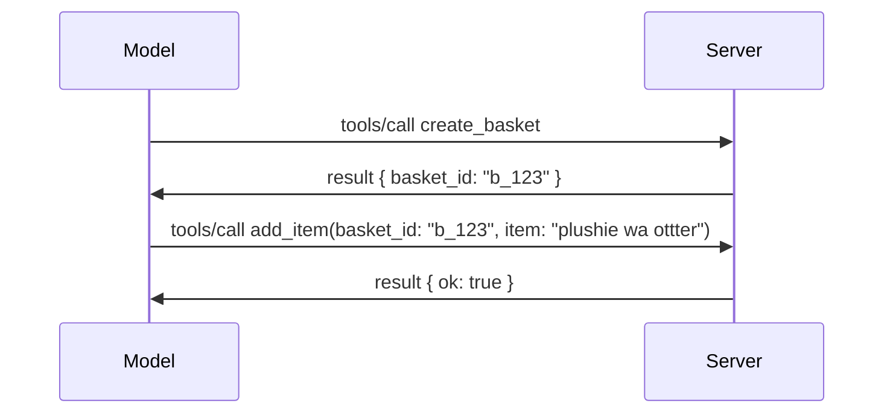

# Nini Kinabadilika katika MCP: Mteule wa Toleo la 2026-07-28

> **Hali:** Mteule wa Toleo. Maelezo ya `2026-07-28` hayajakamilika wakati wa kuandika. Yalitangazwa Mei 21, 2026, na yamepangwa kusambazwa Julai 28, 2026. Kila kitu katika somo hili kinaelezea mteule wa toleo; angalia [rasimu ya maelezo](https://modelcontextprotocol.io/specification/draft) na [rekodi yake ya mabadiliko](https://modelcontextprotocol.io/specification/draft/changelog) kwa hali mpya kabla ya kujenga dhidi yake. Sehemu nyingine ya mitaala hii imeandikwa dhidi ya toleo thabiti la sasa, **Maelezo ya MCP 2025-11-25**, na itasasishwa mara toleo la `2026-07-28` litakapo toka.

## Muhtasari

`2026-07-28` ni marekebisho makubwa zaidi ya MCP tangu ilipozinduliwa. Mapendekezo sita ya Kuboresha Maelezo (SEP) yanachukua vikao vya ngazi ya itifaki na kufanya MCP kuwa haijali hali katika safu ya usafirishaji, nyongeza zinakuwa njia ya hali ya juu, inayotegemewa katika toleo, na vipengele kadhaa ulivyosoma awali katika mitaala hii (Mizizi, Sampuli, Kurekodi) vinalengwa kama havitumiwi chini ya sera mpya ya maisha ya kipengele. Somo hili linakazia kinachobadilika, kwanini ni muhimu, na inamaanisha nini kwa msimbo ulioandika tayari dhidi ya `2025-11-25`.

Chanzo: [Mteule wa Toleo la Maelezo ya MCP ya 2026-07-28](https://blog.modelcontextprotocol.io/posts/2026-07-28-release-candidate/) (Blogu ya Model Context Protocol, David Soria Parra na Den Delimarsky).

## Malengo ya Kujifunza

Mwisho wa somo hili, utaweza:

- Elezea kwa nini MCP inahamia kwenye msingi wa itifaki usio na hali na ni shida gani inatatua kwa usambazaji uliopanuliwa usawa.
- Elezea jinsi mabadilishano ya `initialize`/`initialized` na kichwa cha habari cha `Mcp-Session-Id` vinavyobadilishwa.
- Tambua vichwa vipya vya habari `Mcp-Method` na `Mcp-Name` na metadata ya kuweka akiba `ttlMs`/`cacheScope`.
- Tambua mfumo wa Nyongeza na nyongeza mbili zinazopakiwa na toleo hili: MCP Apps na Tasks.
- Taja SEP sita za mamlaka zinazoiimarisha muafaka wa OAuth 2.0 / OIDC.
- Tambua vipengele vipi vya msingi (Mizizi, Sampuli, Kurekodi) vilivyo sasa vimetengwa, na maana yake katika vitendo.
- Elezea mabadiliko ya Kamili ya Mpango wa JSON 2020-12 kwa chombo `inputSchema`/`outputSchema`.

## Itifaki Isiyo na Hali

Mabadiliko makubwa: MCP inakuwa isiyo na hali katika safu ya itifaki.

### Kabla (2025-11-25): vikao vinakuwekea kwenye seva moja tu

Kupiga simu kwa chombo kupitia Streamable HTTP huanza na mabadilishano ya `initialize`. Seva hutuma kichwa cha habari cha `Mcp-Session-Id` ambacho kila ombi linalofuata lazima lifanye nao:

```http
POST /mcp HTTP/1.1
Mcp-Session-Id: 1868a90c-3a3f-4f5b
Content-Type: application/json

{"jsonrpc":"2.0","id":2,"method":"tools/call",
 "params":{"name":"search","arguments":{"q":"otters"}}}
```

Kwa sababu kikao kinahusishwa na seva yoyote iliyotoa, usanifu wa usambazaji usawa unahitaji **uratibu wa kubandika** kwenye msawazishaji mzigo na **hifadhi ya kikao ya pamoja** kati ya seva.

### Baada (2026-07-28): kila ombi ni lenye kujisimamia

```http
POST /mcp HTTP/1.1
MCP-Protocol-Version: 2026-07-28
Mcp-Method: tools/call
Mcp-Name: search
Content-Type: application/json

{"jsonrpc":"2.0","id":1,"method":"tools/call",
 "params":{"name":"search","arguments":{"q":"otters"},
           "_meta":{"io.modelcontextprotocol/clientInfo":{"name":"my-app","version":"1.0"}}}}
```

Seva yoyote inaweza kushughulikia ombi hili. Mabadilishano muhimu:

- **Mabadilishano ya `initialize`/`initialized` yameondolewa** ([SEP-2575](https://github.com/modelcontextprotocol/modelcontextprotocol/pull/2575)). Toleo la itifaki, taarifa za mteja, na uwezo wa mteja huruhusiwa kuwa katika `_meta` kwenye kila ombi. Njia mpya ya `server/discover` inaruhusu mteja kupata uwezo wa seva mapema anapohitaji.
- **Kichwa cha habari cha `Mcp-Session-Id` na kikao cha itifaki vimeondolewa** ([SEP-2567](https://github.com/modelcontextprotocol/modelcontextprotocol/pull/2567)). Uratibu wa kubandika na hifadhi za vikao za pamoja hazihitajiki tena kwenye safu ya itifaki.

### Itifaki isiyo na hali, programu zinazojiendesha

Kuondoa kikao cha ngazi ya itifaki hakimaanishi seva yako hawezi kuwa na hali. Mstari unaopendekezwa ni ule ule API za HTTP zimekuwa zikitumia: tengeneza kitambulisho wazi (kama `basket_id`, `browser_id`) kutoka kwa simu moja ya chombo, na modeli ipe kitambulisho hicho nyuma kama hoja ya kawaida kwa simu za baadaye.



Hii inaonyesha na inafanya hali iwe rahisi kwa modeli badala ya kuificha katika metadata ya usafirishaji, na inaruhusu seva yoyote kushughulikia simu yoyote.

### Maombi ya seva kwa mteja, yamepangwa upya

Itifaki isiyo na hali bado inahitaji njia kwa seva kuomba kitu kwa mteja wakati wa simu (kwa mfano, ombi la maelezo):

- **Maombi yanayotokana na seva yameruhusiwa tu wakati seva inashughulikia ombi la mteja** ([SEP-2260](https://github.com/modelcontextprotocol/modelcontextprotocol/pull/2260)) — hapo awali ilikuwa pendekezo, sasa ni lazima. Mtumiaji hataiwezwi kupewa ombi ghafla bila taarifa.
- **Maombi ya Ziyara Nyingi** ([SEP-2322](https://github.com/modelcontextprotocol/modelcontextprotocol/pull/2322)) yanachukua nafasi ya kuacha mtiririko wa SSE wazi. Badala yake, seva inarudisha `InputRequiredResult`:

  ```json
  {
    "resultType": "inputRequired",
    "inputRequests": {
      "confirm": {
        "type": "elicitation",
        "message": "Delete 3 files?",
        "schema": { "type": "boolean" }
      }
    },
    "requestState": "eyJzdGVwIjoxLCJmaWxlcyI6WyJhIiwiYiIsImMiXX0="
  }
  ```

  Mteja anakusanya majibu na kuomba tena simu ya awali na `inputResponses` pamoja na `requestState` iliyorudiwa. Seva yoyote inaweza kupokea jaribio tena kwa sababu kila kinachohitajika kipo katika mzigo wa data.

### Inayoelekezwa, inayoweza kuhifadhiwa akiba, inayoweza kufuatiliwa

Mabadiliko madogo matatu hufanya usafirishaji usio na hali uwe rahisi kufanya kazi:

- **Vichwa vya habari vya `Mcp-Method` na `Mcp-Name` vinahitajika kwenye Streamable HTTP** ([SEP-2243](https://github.com/modelcontextprotocol/modelcontextprotocol/pull/2243)), ili wasawazishaji mzigo, lango, na wasimamizi wa kiwango cha maombi waweze kuelekeza kulingana na operesheni bila kuchunguza mwili wa JSON. Seva hupinga maombi ambapo vichwa na mwili havikubaliani.
- **Matokeo ya `tools/list` na kusoma rasilimali yanabeba `ttlMs` na `cacheScope`** ([SEP-2549](https://github.com/modelcontextprotocol/modelcontextprotocol/pull/2549)), yaliyoiga `Cache-Control` ya HTTP. Wateja wanajua muda matokeo ya orodha ni mapya na kama ni salama kugawana baina ya watumiaji, bila hitaji la mtiririko wa SSE wa muda mrefu kujifunza kuhusu mabadiliko.
- **Usambazaji wa Muktadha wa Ufuatiliaji wa W3C katika `_meta` umeandikwa** ([SEP-414](https://github.com/modelcontextprotocol/modelcontextprotocol/pull/414)), ukirekebisha majina ya funguo `traceparent`, `tracestate`, na `baggage` ili ufuatiliaji wa kusambazwa ufuatilie simu kupitia SDK ya mteja, seva ya MCP, na mifumo ya chini katika mshahara unaoendana na [OpenTelemetry](https://opentelemetry.io/).

## Nyongeza Zinakuwa za Kiwango cha Kwanza

Nyongeza zilikuwepo kwa njia isiyo rasmi katika `2025-11-25`. [SEP-2133](https://github.com/modelcontextprotocol/modelcontextprotocol/pull/2133) zinazifikisha rasmi:

- Nyongeza zinatambulika kwa vitambulisho vya DNS ya mwelekeo wa nyuma.
- Zinapobadilishana kupitia ramani ya `extensions` kwenye uwezo wa mteja na seva.
- Zinaishi katika hifadhi zao za `ext-*` zilizo na watunzaji waliogawanywa na zinavuta matoleo tofauti na maelezo ya msingi.
- Njia Mpya ya Nyongeza katika mchakato wa SEP zinawapa njia kutoka kwa majaribio hadi rasmi.

Toleo hili linatuma nyongeza mbili rasmi.

### MCP Apps: vikundi vya mtumiaji vinavyotengenezwa na seva

[MCP Apps](https://blog.modelcontextprotocol.io/posts/2026-01-26-mcp-apps/) ([SEP-1865](https://github.com/modelcontextprotocol/modelcontextprotocol/pull/1865)) huruhusu seva kutuma interface za HTML za kuingiliana ambazo mwenyeji hutengeneza katika iframe iliyolindwa. Vifaa hujulisha templeti zao za kiolesura mapema kwa hivyo wenyeji wanaweza kusambaza kabla, kuhifadhi akiba, na hakiki usalama kabla ya kitu chochote kuendeshwa. Umeshahakikisha misingi ya hili katika [Somo la 15: MCP Apps](../03-GettingStarted/15-mcp-apps/README.md) — chini ya mfumo wa Nyongeza, MCP Apps sasa ni rasmi kama nyongeza badala ya kipengele cha msingi cha majaribio.

### Tasks zinapandishwa hadhi kuwa nyongeza

Tasks zililetwa kama kipengele cha msingi cha majaribio katika `2025-11-25`. Matumizi ya utengenezaji yalionyesha hitaji la muundo mpya wa maisha na sehemu sahihi kwake ni nyongeza: [Nyongeza ya Tasks](https://github.com/modelcontextprotocol/modelcontextprotocol/pull/2663) inarekebisha mzunguko wa maisha kwa mfano usio na hali — seva inaweza kujibu `tools/call` kwa utambulisho wa kazi, na mteja unaendesha mbele kwa `tasks/get`, `tasks/update`, na `tasks/cancel`. Uundaji wa kazi unaongozwa na seva: mteja hujulisha nyongeza, na seva huchagua wakati simu iendeshwe kama kazi. `tasks/list` imeondolewa kabisa kwa sababu haiwezi kufungwa salama bila vikao.

> **Kumbuka mabadiliko:** ikiwa umeanzisha API ya majaribio ya `2025-11-25` Tasks, utahitaji kuhama kwenda mzunguko mpya wa maisha ya nyongeza — haitakiwi kuwa nyuma.

## Kuimarisha Uidhinishaji

SEP sita zinasisitiza [maelezo ya uidhinishaji](https://modelcontextprotocol.io/specification/draft/basic/authorization) ili kuendana zaidi na usanidi halisi wa OAuth 2.0 / OpenID Connect:

| SEP | Mabadiliko |
|---|---|
| [SEP-2468](https://github.com/modelcontextprotocol/modelcontextprotocol/pull/2468) | Wateja wanapaswa kuthibitisha kipengele `iss` katika majibu ya uidhinishaji kulingana na [RFC 9207](https://www.rfc-editor.org/rfc/rfc9207), kupunguza mashambulizi ya mchanganyiko ya kawaida katika muundo wa MCP wa mteja mmoja, seva nyingi. Toa toleo lijalo litahitaji kukataa majibu yasiyo na `iss`. |
| [SEP-837](https://github.com/modelcontextprotocol/modelcontextprotocol/pull/837) | Wateja hujulisha `application_type` ya OpenID Connect wakati wa Usajili wa Mteja wa Wakati, kuepusha seva za uidhinishaji kutuma chaguo la default ya mteja wa desktop/CLI kwa `"web"` na kukataa alama ya localhost ya mteja. |
| [SEP-2352](https://github.com/modelcontextprotocol/modelcontextprotocol/pull/2352) | Wateja hufunga nyaraka zilizosajiliwa na seva ya uidhinishaji ya `issuer` na kusajili tena wakati rasilimali inahamia kati ya seva za uidhinishaji. |
| [SEP-2207](https://github.com/modelcontextprotocol/modelcontextprotocol/pull/2207) | Inatoa mwongozo wa jinsi ya kuomba tokeni za marekebisho kutoka kwa seva za uidhinishaji za mtindo wa OpenID Connect. |
| [SEP-2350](https://github.com/modelcontextprotocol/modelcontextprotocol/pull/2350) | Inaelezea mkusanyiko wa funzo wakati wa uidhinishaji wa hatua zaidi. |
| [SEP-2351](https://github.com/modelcontextprotocol/modelcontextprotocol/pull/2351) | Inaelezea kitambulisho cha ugunduzi `.well-known`. |

Ikiwa unajenga seva ya uidhinishaji kwa MCP leo, anza kutoa `iss` kwenye majibu ya uidhinishaji sasa — angalia [02-Security](../02-Security/README.md) kwa mwongozo wa sasa wa uidhinishaji utakaojengwa juu yake.

## Mizizi, Sampuli, na Kurekodi vimetengwa

Chini ya [sera mpya ya maisha ya kipengele](https://github.com/modelcontextprotocol/modelcontextprotocol/pull/2577) ([SEP-2577](https://github.com/modelcontextprotocol/modelcontextprotocol/pull/2577)), vipengele vitatu vya msingi vya mteja ambavyo ulijifunza katika [Mwongozo wa Msingi](./README.md#roots) vinahamia hadhi ya **Kutengwa**:

| Kipengele | Mbadala uliopendekezwa |
|---|---|
| Mizizi | Vigezo vya chombo, URI za rasilimali, au usanidi wa seva |
| Sampuli | Muunganisho wa moja kwa moja na API za muuzaji wa LLM |
| Kurekodi | `stderr` kwa usafirishaji wa stdio; OpenTelemetry kwa uchunguzi wa muundo |

Hii ni **kutengwa kwa alama tu**: mbinu, aina, na bendera za uwezo zitaendelea kufanya kazi katika toleo hili na katika kila toleo la maelezo litakalochapishwa ndani ya mwaka mmoja tangu hili. Kuondoa moja kwa moja kutahitaji SEP tofauti chini ya sera ya maisha ya kipengele — hivyo hakuna kilichovunjika katika sampuli zako za [Sampling](../03-GettingStarted/14-sampling/README.md) leo, lakini seva mpya zinapaswa kutumia mifumo mbadala iliyo hapo juu.

## Mpango Kamili wa JSON Schema 2020-12 kwa Vyombo

Chombo `inputSchema` na `outputSchema` zimepandishwa hadi [JSON Schema 2020-12](https://json-schema.org/draft/2020-12) kamili ([SEP-2106](https://github.com/modelcontextprotocol/modelcontextprotocol/pull/2106)):

- Mipango ya ingizo inaendelea kuweka vikwazo vya mizizi vya `type: "object"` lakini sasa huruhusu muundo (`oneOf`, `anyOf`, `allOf`), masharti, na rejea (`$ref`, `$defs`).
- Mipango ya matokeo haina vikwazo, na `structuredContent` sasa inaweza kuwa thamani yoyote ya JSON badala ya tu kitu.
- Utekelezaji haupaswi kujirejelea moja kwa moja kwa URI za nje za `$ref` na zinapaswa kuweka kina na muda wa uthibitishaji wa mpango (kuzingatia kuzuiliwa kwa huduma ikiwa kambe unathibitisha mipango upande wa seva).

Pamoja, msimbo wa kosa kwa rasilimali iliyokosekana unabadilishwa kutoka ya kibinafsi ya MCP ya `-32002` kwenda kiwango cha kawaida cha JSON-RPC `-32602` (Params Isiyo Sahihi) ([SEP-2164](https://github.com/modelcontextprotocol/modelcontextprotocol/pull/2164)). Ikiwa mteja wako unalenga thamani halisi ya `-32002`, utahitaji kuiboresha.

## Jinsi Itifaki Inavyobadilika Kuanzia Hapa

Toleo hili lina mabadiliko yanayovunja, ambayo watunzaji wa MCP hawajatakia kuwa hali ya kawaida. SEP tatu za usimamizi zinataka kuzuia kurudia:

- **Sera ya maisha ya kipengele** inampa kipengele kila mzunguko wa Active → Deprecated → Removed na hadi miezi kumi na miwili kati ya kutengwa na uondoaji unaowezekana wa mapema.
- **Mfumo wa Nyongeza** unaruhusu uwezo mpya kusambazwa kama nyongeza za chaguo na kuimarika hapo kabla ya (kama zitahama) kuingia katika maelezo ya msingi.

- Kifungu cha Viwango cha SEP hakiwezi tena kufikia hadhi ya Mwisho hadi tukio linalofanana lifikie kwenye [suite ya ulinganifu](https://github.com/modelcontextprotocol/conformance) ([SEP-2484](https://github.com/modelcontextprotocol/modelcontextprotocol/pull/2484)) — suite ile ile ambayo [mfumo wa ngazi za SDK](https://github.com/modelcontextprotocol/modelcontextprotocol/pull/1777) huweka alama za rasmi kwa SDKs.

## Ratiba ya Kutolewa na Uhalisia

- Mgombea wa toleo alifungwa Mei 21, 2026.
- Maelezo ya mwisho yamepangwa kwa tarehe Julai 28, 2026.
- Dirisha la wiki kumi kati ya hizo mbili linaruhusu watunzaji wa SDK na watumiaji wa mteja kuthibitisha mabadiliko dhidi ya mizigo halisi ya kazi; SDK za Ngazi ya 1 zinatarajiwa kupeleka msaada ndani ya dirisha hili chini ya [mfumo wa ngazi za SDK](https://modelcontextprotocol.io/docs/sdk).
- Fuata mabadiliko yote katika [rasimu ya maelezo](https://modelcontextprotocol.io/specification/draft) na [rekodi ya mabadiliko](https://modelcontextprotocol.io/specification/draft/changelog).

## Hii Inamaanisha Nini kwa Mtaala Huu

Kila kitu ulichojifunza hadi sasa katika kozi hii kinawalenga **2025-11-25**, ambacho bado ni maelezo thabiti ya sasa hadi `2026-07-28` yatakapotoa. Kwa ufafanuzi:

- **Vikao na mikataba ya `initialize`** (imetajwa katika [Dhana za Msingi](./README.md) na [Somo la 6: Uenezaji wa HTTP](../03-GettingStarted/06-http-streaming/README.md)) bado vinatumika kama ilivyoelezwa leo, lakini tarajia zibadilishwe na mfano wa ombi lisilo na hali ulio hapo juu mara ukiboresha kwenda SDK zinazolingana na `2026-07-28`.
- **Uchambuzi na Mizizi** (pia zimejumuishwa katika [Dhana za Msingi](./README.md)) bado zinafanya kazi kikamilifu lakini zimepitwa na wakati — miundo mipya inapaswa kutumia mifumo ya uingizwaji iliyotajwa hapo juu.
- **Kipengele cha majaribio cha Kazi**, kama umeitumia, kitahitaji kuhamishiwa kwenye mzunguko mpya wa maisha wa nyongeza ya Kazi.
- **Programu za MCP** ([Somo la 15](../03-GettingStarted/15-mcp-apps/README.md)) hazibadiliki kiutendaji; zinaweka tu chini ya mfumo rasmi wa Nyongeza.

## Rasilimali Zaidi

- [Mgombea wa Toleo la Maelezo ya MCP la 2026-07-28 (mabadiliko ya blogi)](https://blog.modelcontextprotocol.io/posts/2026-07-28-release-candidate/)
- [Mabaki ya Usafirishaji wa MCP](https://blog.modelcontextprotocol.io/posts/2025-12-19-mcp-transport-future/)
- [Rasimu ya Maelezo ya MCP](https://modelcontextprotocol.io/specification/draft)
- [Rekodi ya Mabadiliko ya Rasimu ya MCP](https://modelcontextprotocol.io/specification/draft/changelog)
- [Miongozo ya SEP](https://modelcontextprotocol.io/community/sep-guidelines)
- [Mfumo wa Ngazi za SDK za MCP](https://modelcontextprotocol.io/docs/sdk)

## Hatua Zinazofuata

Rudi nyuma kwa [Dhana za Msingi](./README.md) au endelea kwa [Usalama](../02-Security/README.md kuona jinsi mwongozo wa leo `2025-11-25` unavyoendana na kile kinachokuja.

---

<!-- CO-OP TRANSLATOR DISCLAIMER START -->
**Kionyozo**:
Hati hii imetafsiriwa kwa kutumia huduma ya tafsiri ya AI [Co-op Translator](https://github.com/Azure/co-op-translator). Ingawa tunajitahidi kupata usahihi, tafadhali fahamu kwamba tafsiri za kiotomatiki zinaweza kuwa na makosa au upungufu wa usahihi. Hati ya asili katika lugha yake halisi inapaswa kuchukuliwa kama chanzo cha mamlaka. Kwa taarifa muhimu, tafsiri ya kitaalamu inayofanywa na binadamu inapendekezwa. Hatutojibu kwa kuelewa vibaya au tafsiri potofu zinazotokea kutokana na matumizi ya tafsiri hii.
<!-- CO-OP TRANSLATOR DISCLAIMER END -->