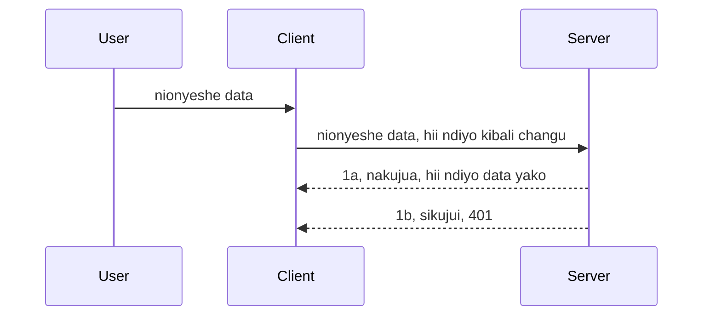

# Uthibitishaji rahisi

MCP SDK zinaunga mkono matumizi ya OAuth 2.1 ambacho kwa kweli ni mchakato mgumu ukihusisha dhana kama seva ya uthibitishaji, seva ya rasilimali, kutuma taarifa za kujitambulisha, kupata msimbo, kubadilisha msimbo kwa tokeni mpaka hatimaye uweze kupata data ya rasilimali zako. Ukizoea OAuth ambayo ni kitu kizuri kutekeleza, ni wazo zuri kuanza na kiwango cha msingi cha uthibitishaji na kujenga hadi usalama bora zaidi. Ndiyo sababu sura hii ipo, kukuandalia uthibitishaji wa hali ya juu zaidi.

## Uthibitishaji, tunamaanisha nini?

Uthibitishaji ni kifupi cha authentication na authorization. Fikra ni kwamba tunahitaji kufanya mambo mawili:

- **Authentication**, ambayo ni mchakato wa kubaini kama tunamruhusu mtu kuingia nyumbani kwetu, kwamba ana haki ya kuwa "hapa" yaani anaweza kupata seva ya rasilimali ambapo huduma za MCP Server ziko.
- **Authorization**, ni mchakato wa kubaini kama mtumiaji anapaswa kupata rasilimali hizi maalum anazozitaka, kwa mfano maagizo haya au bidhaa hizi au kama anaruhusiwa kusoma maudhui lakini asifute kama mfano mwingine.

## Taarifa za kujitambulisha: jinsi tunavyoambia mfumo sisi ni nani

Naam, wataalamu wengi wa wavuti wanaanza kufikiria kwa kutoa taarifa za kujitambulisha kwa seva, kawaida siri inayoonyesha kama wanaruhusiwa kuwa hapa "Authentication". Taarifa hii kawaida ni toleo lililomo encoded kwa base64 la jina la mtumiaji na nywila au API key inayotambulisha mtumiaji mahususi. 

Hii inahusisha kutuma kupitia kichwa kinachoitwa "Authorization" kama hivi:

```json
{ "Authorization": "secret123" }
```

Hii mara nyingi huitwa uthibitishaji wa msingi. Mtiririko mzima unavyofanya kazi ni kwa njia ifuatayo:



Sasa tunapojua jinsi inavyofanya kazi kutoka mtazamo wa mtiririko, tunatekelezaje? Naam, seva nyingi za wavuti zina dhana inayoitwa middleware, kipande cha msimbo kinachoendeshwa kama sehemu ya ombi ambacho kinaweza kuthibitisha taarifa za kujitambulisha, na kama taarifa ni sahihi kinaweza kuruhusu ombi liendelee. Ikiwa ombi halina taarifa sahihi basi unapata kosa la uthibitishaji. Tuwe taze jinsi hii inavyoweza kutekelezwa:

**Python**

```python
class AuthMiddleware(BaseHTTPMiddleware):
    async def dispatch(self, request, call_next):

        has_header = request.headers.get("Authorization")
        if not has_header:
            print("-> Missing Authorization header!")
            return Response(status_code=401, content="Unauthorized")

        if not valid_token(has_header):
            print("-> Invalid token!")
            return Response(status_code=403, content="Forbidden")

        print("Valid token, proceeding...")
       
        response = await call_next(request)
        # ongeza vichwa vya wateja au badilisha jibu kwa njia fulani
        return response


starlette_app.add_middleware(CustomHeaderMiddleware)
```

Hapa tuna:

- Tumeunda middleware inayoitwa `AuthMiddleware` ambapo njia yake `dispatch` inaitwa na seva ya wavuti.
- Tumeongeza middleware kwenye seva ya wavuti:

    ```python
    starlette_app.add_middleware(AuthMiddleware)
    ```

- Tumeandika mantiki ya uthibitishaji inayokagua kama kichwa cha Authorization kiko na ikiwa siri inayotumwa ni halali:

    ```python
    has_header = request.headers.get("Authorization")
    if not has_header:
        print("-> Missing Authorization header!")
        return Response(status_code=401, content="Unauthorized")

    if not valid_token(has_header):
        print("-> Invalid token!")
        return Response(status_code=403, content="Forbidden")
    ```

    ikiwa siri iko na ni halali basi tunaruhusu ombi liendelee kwa kuitwa `call_next` na kurejesha majibu.

    ```python
    response = await call_next(request)
    # ongeza vichwa vya wateja au badilisha jibu kwa njia fulani
    return response
    ```

Jinsi inavyofanya kazi ni kwamba ikiwa ombi la wavuti limefanywa kuelekea seva, middleware itaitwa na kutokana na utekelezaji wake itaamua kama ombi litaruhusiwa au litarudisha kosa linaloashiria mteja hana ruhusa ya kuendelea.

**TypeScript**

Hapa tunaunda middleware kwa kutumia framework maarufu Express na kukamata ombi kabla ya kufikia MCP Server. Hii ni sehemu ya msimbo:

```typescript
function isValid(secret) {
    return secret === "secret123";
}

app.use((req, res, next) => {
    // 1. Kichwa cha Idhini kiko hapo?
    if(!req.headers["Authorization"]) {
        res.status(401).send('Unauthorized');
    }
    
    let token = req.headers["Authorization"];

    // 2. Angalia uhalali.
    if(!isValid(token)) {
        res.status(403).send('Forbidden');
    }

   
    console.log('Middleware executed');
    // 3. Pitia ombi kwenye hatua inayofuata katika mchakato wa ombi.
    next();
});
```

Katika msimbo huu tunafanya:

1. Kukagua kama kichwa cha Authorization kiko, ikiwa hakipo, tunatuma kosa la 401.
2. Kuhakiki kama taarifa/token ni halali, ikiwa siyo, tunatuma kosa la 403.
3. Hatimaye kuendelea na ombi kwenye mtiririko wa ombi na kurudisha rasilimali iliyohitajika.

## Zoef: Tekeleza uthibitishaji

Tuchukue maarifa yetu na tujaribu kutekeleza. Huu ndio mpango:

Seva

- Unda seva ya wavuti na mfano wa MCP.
- Tekeleza middleware kwa seva.

Mteja 

- Tuma ombi la wavuti, na taarifa ya kujitambulisha kupitia kichwa.

### -1- Unda seva ya wavuti na mfano wa MCP

> **Kuangalia mbele:** mfano wa TypeScript hapa chini unafuata usafirishaji wa HTTP katika ramani ya `transports` iliyofunguliwa kwa `mcp-session-id`, kwa mujibu wa **Maelezo ya MCP 2025-11-25**. Toleo la mteule wa `2026-07-28` linatupa nyuma usawa wa mkono wa kuanzisha na kitambulisho cha kikao kabisa, hivyo ramani hii ya usafirishaji kwa kikao itafutwa kwa ajili ya maombi yasiyo na hali ya kuendelea yanayojitegemea. Angalia [Mabadiliko yaliyotokea MCP: Toleo la mteule la 2026-07-28](../../01-CoreConcepts/mcp-2026-07-28-release-candidate.md).

Katika hatua yetu ya kwanza, tunahitaji kuunda mfano wa seva ya wavuti na MCP Server.

**Python**

Hapa tunaunda mfano wa MCP server, kuunda app ya wavuti ya starlette na kuiendesha kwa uvicorn.

```python
# kuunda seva ya MCP

app = FastMCP(
    name="MCP Resource Server",
    instructions="Resource Server that validates tokens via Authorization Server introspection",
    host=settings["host"],
    port=settings["port"],
    debug=True
)

# kuunda programu ya wavuti ya starlette
starlette_app = app.streamable_http_app()

# kuhudumia programu kupitia uvicorn
async def run(starlette_app):
    import uvicorn
    config = uvicorn.Config(
            starlette_app,
            host=app.settings.host,
            port=app.settings.port,
            log_level=app.settings.log_level.lower(),
        )
    server = uvicorn.Server(config)
    await server.serve()

run(starlette_app)
```

Katika msimbo huu tunafanya:

- Unda MCP Server.
- Tengeneza app ya wavuti ya starlette kutoka MCP Server, `app.streamable_http_app()`.
- Kuendesha na kuhudumia app ya wavuti kwa kutumia uvicorn `server.serve()`.

**TypeScript**

Hapa tunaunda mfano wa MCP Server.

```typescript
const server = new McpServer({
      name: "example-server",
      version: "1.0.0"
    });

    // ... tengeneza rasilimali za seva, zana, na maelekezo ...
```

Uundaji huu wa MCP Server utatokea ndani ya ufafanuzi wa njia ya POST /mcp, hivyo tuiweke msimbo huu hapo:

```typescript
import express from "express";
import { randomUUID } from "node:crypto";
import { McpServer } from "@modelcontextprotocol/sdk/server/mcp.js";
import { StreamableHTTPServerTransport } from "@modelcontextprotocol/sdk/server/streamableHttp.js";
import { isInitializeRequest } from "@modelcontextprotocol/sdk/types.js"

const app = express();
app.use(express.json());

// Ramani ya kuhifadhi usafirishaji kwa kitambulisho cha kikao
const transports: { [sessionId: string]: StreamableHTTPServerTransport } = {};

// Shughulikia maombi ya POST kwa mawasiliano ya mteja-kwa-server
app.post('/mcp', async (req, res) => {
  // Angalia kama kitambulisho cha kikao kipo
  const sessionId = req.headers['mcp-session-id'] as string | undefined;
  let transport: StreamableHTTPServerTransport;

  if (sessionId && transports[sessionId]) {
    // Tumia tena usafirishaji uliopo
    transport = transports[sessionId];
  } else if (!sessionId && isInitializeRequest(req.body)) {
    // Ombi jipya la kuanzisha
    transport = new StreamableHTTPServerTransport({
      sessionIdGenerator: () => randomUUID(),
      onsessioninitialized: (sessionId) => {
        // Hifadhi usafirishaji kwa kitambulisho cha kikao
        transports[sessionId] = transport;
      },
      // Ulinzi wa DNS rebinding umezimwa kwa chaguo-msingi kwa ajili ya urudufu wa nyuma. Ikiwa unaendesha seva hii
      // kwa ndani ya kompyuta, hakikisha kuweka:
      // enableDnsRebindingProtection: kweli,
      // allowedHosts: ['127.0.0.1'],
    });

    // Safisha usafirishaji linapofunguliwa
    transport.onclose = () => {
      if (transport.sessionId) {
        delete transports[transport.sessionId];
      }
    };
    const server = new McpServer({
      name: "example-server",
      version: "1.0.0"
    });

    // ... weka rasilimali za seva, zana, na viito ...

    // Unganisha na seva ya MCP
    await server.connect(transport);
  } else {
    // Ombi batili
    res.status(400).json({
      jsonrpc: '2.0',
      error: {
        code: -32000,
        message: 'Bad Request: No valid session ID provided',
      },
      id: null,
    });
    return;
  }

  // Shughulikia ombi
  await transport.handleRequest(req, res, req.body);
});

// Shughulikia ombi zinazoweza kutumika tena za GET na DELETE
const handleSessionRequest = async (req: express.Request, res: express.Response) => {
  const sessionId = req.headers['mcp-session-id'] as string | undefined;
  if (!sessionId || !transports[sessionId]) {
    res.status(400).send('Invalid or missing session ID');
    return;
  }
  
  const transport = transports[sessionId];
  await transport.handleRequest(req, res);
};

// Shughulikia maombi ya GET kwa notisi za seva-kwa-mteja kupitia SSE
app.get('/mcp', handleSessionRequest);

// Shughulikia maombi ya DELETE kwa kumaliza kikao
app.delete('/mcp', handleSessionRequest);

app.listen(3000);
```

Sasa unaona jinsi uundaji wa MCP Server ulivyo hamishwa ndani ya `app.post("/mcp")`.

Tuendelee na hatua inayofuata ya kuunda middleware ili kuthibitisha taarifa zinazokuja.

### -2- Tekeleza middleware kwa seva

Tufanye sehemu ya middleware ijayo. Hapa tutaunda middleware inayotafuta taarifa za kujitambulisha kwenye kichwa cha `Authorization` na kuthibitisha. Ikiwa ni sawa basi ombi linaendelea kufanya kinachotakiwa (mfano kama kuorodhesha zana, kusoma rasilimali au huduma za MCP anazozitaka mteja).

**Python**

Kuunda middleware, tunahitaji kuunda darasa linalo mrithi `BaseHTTPMiddleware`. Kuna sehemu mbili zinazovutia:

- Ombi `request`, ambalo tunasoma taarifa ya kichwa.
- `call_next` ni callback tunayohitaji kuitisha ikiwa mteja ameleta taarifa tunazokubaliana nazo.

Kwanza, tunahitaji kushughulikia kesi ya ukosefu wa kichwa cha `Authorization`:

```python
has_header = request.headers.get("Authorization")

# hakuna kichwa kilichopo, shiriki na 401, vinginevyo endelea.
if not has_header:
    print("-> Missing Authorization header!")
    return Response(status_code=401, content="Unauthorized")
```

Hapa tunatuma ujumbe wa 401 unauthorized kwa kuwa mteja hana uthibitishaji mzuri.

Ifuatayo, ikiwa taarifa za kujitambulisha zimetumwa, tunakagua uhalali wake kama hivi:

```python
 if not valid_token(has_header):
    print("-> Invalid token!")
    return Response(status_code=403, content="Forbidden")
```

Tazama jinsi tunavyotuma ujumbe wa 403 forbidden hapo juu. Hebu tazame middleware kamili hapa chini inayotekeleza yote tuliyosema:

```python
class AuthMiddleware(BaseHTTPMiddleware):
    async def dispatch(self, request, call_next):

        has_header = request.headers.get("Authorization")
        if not has_header:
            print("-> Missing Authorization header!")
            return Response(status_code=401, content="Unauthorized")

        if not valid_token(has_header):
            print("-> Invalid token!")
            return Response(status_code=403, content="Forbidden")

        print("Valid token, proceeding...")
        print(f"-> Received {request.method} {request.url}")
        response = await call_next(request)
        response.headers['Custom'] = 'Example'
        return response

```

Nzuri, lakini kuhusu `valid_token` function? Hapa iko:

```python
# USITUMIE kwa uzalishaji - boresha !!
def valid_token(token: str) -> bool:
    # ondoa kiambishi "Bearer "
    if token.startswith("Bearer "):
        token = token[7:]
        return token == "secret-token"
    return False
```

Hii inapaswa kuboreshwa zaidi waziwazi.

MUHIMU: Huenda ukawa na siri kama hizi ndani ya msimbo huna budi. Kawaida ni bora kupata thamani hii kulingana na chanzo cha data au kutoka kwa IDP (mtoa huduma ya utambulisho) au bora zaidi, ruhusu IDP ifanye uthibitishaji.

**TypeScript**

Kuutekeleza huu kwa Express, tunahitaji kuita njia `use` inayokubali middleware functions.

Tunahitaji:

- Kuingiliana na ombi kuchunguza taarifa iliyotumwa kama `Authorization`.
- Thibitisha taarifa, na ikiwa ni sahihi ruhusu ombi liendelee na mteja apate rasilimali anazotaka.

Hapa, tunakagua kama kichwa cha `Authorization` kiko na ikiwa hakipo, tuzuie ombi kuendelea:

```typescript
if(!req.headers["authorization"]) {
    res.status(401).send('Unauthorized');
    return;
}
```

Ikiwa kichwa hakijatumwa kabisa, unapata 401.

Ifuatayo, tunakagua uhalali wa taarifa, ikiwa si sahihi tena tunazuia ombi na ujumbe tofauti kidogo:

```typescript
if(!isValid(token)) {
    res.status(403).send('Forbidden');
    return;
} 
```

Ona sasa unapata kosa la 403.

Huu ni msimbo mzima:

```typescript
app.use((req, res, next) => {
    console.log('Request received:', req.method, req.url, req.headers);
    console.log('Headers:', req.headers["authorization"]);
    if(!req.headers["authorization"]) {
        res.status(401).send('Unauthorized');
        return;
    }
    
    let token = req.headers["authorization"];

    if(!isValid(token)) {
        res.status(403).send('Forbidden');
        return;
    }  

    console.log('Middleware executed');
    next();
});
```

Tumeandaa seva ya wavuti ili kukubali middleware ya kukagua taarifa zinazotumwa na mteja. Basi mteja mwenyewe je?

### -3- Tuma ombi la wavuti na taarifa kupitia kichwa

Tunahitaji kuhakikisha mteja anatuma taarifa kupitia kichwa. Kwa kuwa tutatumia mteja wa MCP hii, hatari yangu ni kuchukua jinsi ya kufanya hivi.

**Python**

Kwa mteja, tunahitaji kupeleka kichwa cha taarifa kama hivi:

```python
# USIHARAMI thamani, iwe angalau katika mabadiliko ya mazingira au uhifadhi salama zaidi
token = "secret-token"

async with streamablehttp_client(
        url = f"http://localhost:{port}/mcp",
        headers = {"Authorization": f"Bearer {token}"}
    ) as (
        read_stream,
        write_stream,
        session_callback,
    ):
        async with ClientSession(
            read_stream,
            write_stream
        ) as session:
            await session.initialize()
      
            # TODO, kile unachotaka kifanyike kwa mteja, mfano orodhesha zana, ita zana n.k.
```

Tazama jinsi tunajaza `headers` kama ` headers = {"Authorization": f"Bearer {token}"}`.

**TypeScript**

Tunaweza kutatua hili kwa hatua mbili:

1. Jaza configuration objekti na taarifa zetu.
2. Pitia configuration objekti kwenye transport.

```typescript

// USIweke thamani moja kwa moja kama ilivyoonyeshwa hapa. Angalau iwe kama variable ya mazingira na tumia kitu kama dotenv (katika hali ya maendeleo).
let token = "secret123"

// fafanua kitu cha chaguo la usafirishaji wa mteja
let options: StreamableHTTPClientTransportOptions = {
  sessionId: sessionId,
  requestInit: {
    headers: {
      "Authorization": "secret123"
    }
  }
};

// pita kitu cha chaguzi kwa usafirishaji
async function main() {
   const transport = new StreamableHTTPClientTransport(
      new URL(serverUrl),
      options
   );
```

Hapa unaona juu jinsi tulivyounda objekti `options` na kuweka vichwa vyetu chini ya `requestInit`.

MUHIMU: Tunawezaje kuboresha kutoka hapa? Naam, utekelezaji huu una matatizo. Kwanza, kutuma taarifa hivi ni hatari kama huna HTTPS angalau. Hata hivyo, taarifa inaweza kuibiwa hivyo unahitaji mfumo unaoweza kwa urahisi kufuta tokeni na kuongeza ukaguzi kama ni kutoka wapi duniani, kama ombi linatokea sana (tabia ya bot), kwa kifupi kuna masuala mengi.

Inapaswa kusemwa, kwa API rahisi ambapo hutaki mtu yeyote aitake API yako bila kuthibitishwa na kile kilichopo hapa ni mwanzo mzuri.

Kwa kusema hivyo, tujaribu kuongeza usalama kidogo kwa kutumia fomati sanifu kama JSON Web Token, inayojulikana pia kama JWT au tokeni "JOT".

## JSON Web Tokens, JWT

Hivyo, tunajitahidi kuboresha kutoka kwenye taarifa rahisi. Ni maboresho gani ya mara moja tunayopata tunapotumia JWT?

- **Maboresho ya usalama**. Katika uthibitishaji wa msingi, unatumia jina la mtumiaji na nywila kama tokeni za base64 (au API key) kila mara ambayo huongeza hatari. Kwa JWT, unatumia jina na nywila na unapata tokeni inayokwisha baada ya muda. JWT inaruhusu udhibiti wa upatikanaji kwa kiwango kidogo kinachotegemea majukumu, mipaka na ruhusa.
- **Kutotegemea hali na ukubwa**. JWT ni tokeni zilizo katika mwili wake mwenyewe, zinabeba taarifa zote za mtumiaji na hazihitaji kuhifadhi session kwenye seva. Tokeni pia zinaweza kuthibitishwa eneo husika.
- **Ushirikiano na ushirikiano**. JWT ni msingi wa Open ID Connect na hutumika na watoa utambulisho maarufu kama Entra ID, Google Identity na Auth0. Pia hutoa mwelekeo wa kuingia mara moja na zaidi kwa viwango vya kampuni.
- **Moduli na urahisi**. JWT pia inaweza kutumika na API Gateways kama Azure API Management, NGINX na zaidi. Inasaidia hali za uthibitishaji na mawasiliano kati ya seva na huduma ikiwa ni pamoja na kutengeneza mdudu na kudhibiti kwa wingi.
- **Utendaji na caching**. JWT zinaweza kuhifadhiwa baada ya kufichuliwa ili kupunguza hitaji la kupeana. Hii husaidia hasa kwa app zenye trafiki kubwa kwa kuongeza matokeo na kupunguza mzigo kwenye miundombinu yako.
- **Vipengele vya hali ya juu**. Pia zinaunga mkono introspection (kukagua uhalali kwenye seva) na revoked (kufanya tokeni isizidi kutumika).

Kwa faida zote hizi, tazama jinsi tunavyoweza kuboresha utekelezaji wetu hadi kiwango kingine.

## Kubadilisha uthibitishaji wa msingi kuwa JWT

Hivyo, mabadiliko tunayohitaji kufanya kwa kiwango cha juu ni:

- **Jifunze kuunda tokeni ya JWT** na kuiandaa kwa kutumwa kutoka kwa mteja kwenda seva.
- **Thibitisha tokeni ya JWT**, na ikiwa ni sawa, mteja apate rasilimali zetu.
- **Uhifadhi salama wa tokeni**. Jinsi tunavyohifadhi tokeni hii.
- **Linda njia**. Tunahitaji kulinda njia, kwenye kesi yetu, kulinda njia na vipengele maalum vya MCP.
- **Ongeza tokeni za refresh**. Hakikisha tunatengeneza tokeni zenye muda mfupi lakini tokeni za refresh zenye muda mrefu zinazoweza kutumika kupata tokeni mpya ikiwa zinapita muda. Pia hakikisha kuna njia ya refresh pamoja na mkakati wa mzunguko.

### -1- Tengeneza tokeni ya JWT

Kwanza, tokeni ya JWT ina sehemu zifuatazo:

- **kichwa**, algoriti zinazotumika na aina ya tokeni.
- **mzigo**, madai, kama sub (mtumiaji au sehemu tokeni inawakilisha. Katika hali ya uthibitishaji huu kawaida ni userid), exp (lini inaisha) role (jina la jukumu)
- **sahihi**, imesainiwa na siri au kiufunguo binafsi.

Kwa hili, tutahitaji kutengeneza kichwa, mzigo na tokeni iliyochapishwa.

**Python**

```python

import jwt
import jwt
from jwt.exceptions import ExpiredSignatureError, InvalidTokenError
import datetime

# Ufunguzi wa siri unaotumika kusaini JWT
secret_key = 'your-secret-key'

header = {
    "alg": "HS256",
    "typ": "JWT"
}

# habari za mtumiaji na madai yake na muda wa kumalizika
payload = {
    "sub": "1234567890",               # Mada (kitambulisho cha mtumiaji)
    "name": "User Userson",                # Dai la kawaida
    "admin": True,                     # Dai la kawaida
    "iat": datetime.datetime.utcnow(),# Iliyochapishwa
    "exp": datetime.datetime.utcnow() + datetime.timedelta(hours=1)  # Kumalizika
}

# fanyia msimbo
encoded_jwt = jwt.encode(payload, secret_key, algorithm="HS256", headers=header)
```

Katika msimbo huo tume:

- Tambua kichwa kinachotumia HS256 kama algoriti na aina kuwa JWT.
- Tengeneza mzigo unaojumuisha somo au userid, jina la mtumiaji, jukumu, lini ilitolewa na lini itamalizika ili kutekeleza kipengele cha muda tulichosema awali.

**TypeScript**

Hapa tutahitaji baadhi ya tegemezi zitakazotusaidia kutengeneza tokeni ya JWT.

Tegemezi

```sh

npm install jsonwebtoken
npm install --save-dev @types/jsonwebtoken
```

Sasa tumeboreshwa, hebu tengeneza kichwa, mzigo na kupitia hilo tengeneza tokeni iliyochapishwa.

```typescript
import jwt from 'jsonwebtoken';

const secretKey = 'your-secret-key'; // Tumia vigezo vya mazingira katika uzalishaji

// Eleza mzigo wa data
const payload = {
  sub: '1234567890',
  name: 'User usersson',
  admin: true,
  iat: Math.floor(Date.now() / 1000), // Imetolewa saa
  exp: Math.floor(Date.now() / 1000) + 60 * 60 // Hutaisha baada ya saa 1
};

// Eleza kichwa (hiari, jsonwebtoken inaweka chaguo-msingi)
const header = {
  alg: 'HS256',
  typ: 'JWT'
};

// Tengeneza tokeni
const token = jwt.sign(payload, secretKey, {
  algorithm: 'HS256',
  header: header
});

console.log('JWT:', token);
```

Tokeni hii ni:

Imesainiwa kwa kutumia HS256
Inatumika kwa saa 1
Inajumuisha madai kama sub, name, admin, iat, na exp.

### -2- Thibitisha tokeni

Pia tunahitaji kuthibitisha tokeni, hili ni jambo la kufanya upande wa seva kuhakikisha kile mteja anakituma ni halali. Kuna ukaguzi mwingi wa kufanya hapa kutoka kwenye muundo hadi uhalali wake. Pia unahimizwa kuongeza ukaguzi kama kama mtumiaji yupo kwenye mfumo na zaidi.

Kuthibitisha tokeni, tunahitaji kuisambaza ili tuiisome kisha tukagaye uhalali wake:

**Python**

```python

# Tafsiri na hakiki JWT
try:
    decoded = jwt.decode(token, secret_key, algorithms=["HS256"])
    print("✅ Token is valid.")
    print("Decoded claims:")
    for key, value in decoded.items():
        print(f"  {key}: {value}")
except ExpiredSignatureError:
    print("❌ Token has expired.")
except InvalidTokenError as e:
    print(f"❌ Invalid token: {e}")

```


Katika msimbo huu, tunaita `jwt.decode` tukitumia tokeni, ufunguo wa siri na algorithm iliyochaguliwa kama ingizo. Angalia jinsi tunavyotumia muundo wa jaribu-kamata kwani uthibitisho usiofanikiwa husababisha hitilafu kuibuka.

**TypeScript**

Hapa tunahitaji kuita `jwt.verify` kupata toleo lililofasiriwa la tokeni ambalo tunaweza kuchambua zaidi. Ikiwa simu hii itashindikana, hiyo inamaanisha muundo wa tokeni sio sahihi au haubadiliki tena.

```typescript

try {
  const decoded = jwt.verify(token, secretKey);
  console.log('Decoded Payload:', decoded);
} catch (err) {
  console.error('Token verification failed:', err);
}
```

KUMBUKA: kama ilivyosemwa awali, tunapaswa kufanya ukaguzi zaidi ili kuhakikisha tokeni hii inaelezea mtumiaji katika mfumo wetu na kuhakikisha mtumiaji ana haki anazodai kuwa nazo.

Sasa, tuchunguze udhibiti wa upatikanaji unaotegemea majukumu, unaojulikana pia kama RBAC.

## Kuongeza udhibiti wa upatikanaji unaotegemea majukumu

Wazo ni kwamba tunataka kuonyesha kuwa majukumu tofauti yana ruhusa tofauti. Kwa mfano, tunadhani msimamizi anaweza kufanya kila kitu na kwamba mtumiaji wa kawaida anaweza kusoma/kuandika na mgeni anaweza kusoma tu. Kwa hiyo, hizi ni baadhi ya viwango vya ruhusa vinavyowezekana:

- Admin.Write 
- User.Read
- Guest.Read

Tangalie jinsi tunavyoweza kutekeleza udhibiti huo kwa kutumia middleware. Middleware zinaweza kuongezwa kwa kila njia pamoja na kwa njia zote.

**Python**

```python
from starlette.middleware.base import BaseHTTPMiddleware
from starlette.responses import JSONResponse
import jwt

# USIWE na siri katika msimbo kama huu, huu ni kwa madhumuni ya kuonyesha tu. Ibasishe kutoka mahali salama.
SECRET_KEY = "your-secret-key" # weka hii katika kigezo cha mazingira
REQUIRED_PERMISSION = "User.Read"

class JWTPermissionMiddleware(BaseHTTPMiddleware):
    async def dispatch(self, request, call_next):
        auth_header = request.headers.get("Authorization")
        if not auth_header or not auth_header.startswith("Bearer "):
            return JSONResponse({"error": "Missing or invalid Authorization header"}, status_code=401)

        token = auth_header.split(" ")[1]
        try:
            decoded = jwt.decode(token, SECRET_KEY, algorithms=["HS256"])
        except jwt.ExpiredSignatureError:
            return JSONResponse({"error": "Token expired"}, status_code=401)
        except jwt.InvalidTokenError:
            return JSONResponse({"error": "Invalid token"}, status_code=401)

        permissions = decoded.get("permissions", [])
        if REQUIRED_PERMISSION not in permissions:
            return JSONResponse({"error": "Permission denied"}, status_code=403)

        request.state.user = decoded
        return await call_next(request)


```

Kuna njia chache tofauti za kuongeza middleware kama ifuatavyo:

```python

# Alt 1: ongeza middleware wakati wa kujenga programu ya starlette
middleware = [
    Middleware(JWTPermissionMiddleware)
]

app = Starlette(routes=routes, middleware=middleware)

# Alt 2: ongeza middleware baada ya programu ya starlette tayari kujengwa
starlette_app.add_middleware(JWTPermissionMiddleware)

# Alt 3: ongeza middleware kwa kila njia
routes = [
    Route(
        "/mcp",
        endpoint=..., # mhudumu
        middleware=[Middleware(JWTPermissionMiddleware)]
    )
]
```

**TypeScript**

Tunaweza kutumia `app.use` na middleware ambayo itaendesha kwa maombi yote.

```typescript
app.use((req, res, next) => {
    console.log('Request received:', req.method, req.url, req.headers);
    console.log('Headers:', req.headers["authorization"]);

    // 1. Angalia kama kichwa cha ruhusa kimetumwa

    if(!req.headers["authorization"]) {
        res.status(401).send('Unauthorized');
        return;
    }
    
    let token = req.headers["authorization"];

    // 2. Angalia kama tokeni ni halali
    if(!isValid(token)) {
        res.status(403).send('Forbidden');
        return;
    }  

    // 3. Angalia kama mtumiaji wa tokeni yupo katika mfumo wetu
    if(!isExistingUser(token)) {
        res.status(403).send('Forbidden');
        console.log("User does not exist");
        return;
    }
    console.log("User exists");

    // 4. Thibitisha tokeni ina ruhusa sahihi
    if(!hasScopes(token, ["User.Read"])){
        res.status(403).send('Forbidden - insufficient scopes');
    }

    console.log("User has required scopes");

    console.log('Middleware executed');
    next();
});

```

Kuna mambo mengi tunayoweza kuruhusu middleware yetu na yale middleware inapaswa kufanya, yaani:

1. Angalia kama kichwa cha idhini kiko
2. Angalia kama tokeni ni halali, tunaita `isValid` ambayo ni njia tuliyoandika ambayo inakagua uadilifu na uhalali wa tokeni ya JWT.
3. Thibitisha mtumiaji yupo katika mfumo wetu, tunapaswa kuangalia hili.

   ```typescript
    // watumiaji katika DB
   const users = [
     "user1",
     "User usersson",
   ]

   function isExistingUser(token) {
     let decodedToken = verifyToken(token);

     // TODO, angalia kama mtumiaji yupo katika DB
     return users.includes(decodedToken?.name || "");
   }
   ```

   Juu, tumetengeneza orodha rahisi sana ya `users`, ambayo kwa wazi inapaswa kuwa katika hifadhidata.

4. Zaidi ya hayo, tunapaswa pia kuangalia tokeni ina ruhusa sahihi.

   ```typescript
   if(!hasScopes(token, ["User.Read"])){
        res.status(403).send('Forbidden - insufficient scopes');
   }
   ```

   Katika msimbo huu ulio juu kutoka kwenye middleware, tunakagua ikiwa tokeni ina ruhusa ya User.Read, kama haina tunatuma hitilafu ya 403. Chini ni njia ya msaada `hasScopes`.

   ```typescript
   function hasScopes(scope: string, requiredScopes: string[]) {
     let decodedToken = verifyToken(scope);
    return requiredScopes.every(scope => decodedToken?.scopes.includes(scope));
  }
   ```

Have a think which additional checks you should be doing, but these are the absolute minimum of checks you should be doing.

Using Express as a web framework is a common choice. There are helpers library when you use JWT so you can write less code.

- `express-jwt`, helper library that provides a middleware that helps decode your token.
- `express-jwt-permissions`, this provides a middleware `guard` that helps check if a certain permission is on the token.

Here's what these libraries can look like when used:

```typescript
const express = require('express');
const jwt = require('express-jwt');
const guard = require('express-jwt-permissions')();

const app = express();
const secretKey = 'your-secret-key'; // put this in env variable

// Decode JWT and attach to req.user
app.use(jwt({ secret: secretKey, algorithms: ['HS256'] }));

// Check for User.Read permission
app.use(guard.check('User.Read'));

// multiple permissions
// app.use(guard.check(['User.Read', 'Admin.Access']));

app.get('/protected', (req, res) => {
  res.json({ message: `Welcome ${req.user.name}` });
});

// Error handler
app.use((err, req, res, next) => {
  if (err.code === 'permission_denied') {
    return res.status(403).send('Forbidden');
  }
  next(err);
});

```

Sasa umeona jinsi middleware inaweza kutumika kwa uthibitishaji na idhini, lakini MCP inafanyaje? Je, hubadilisha jinsi tunavyofanya uthibitishaji? Tuchunguze katika sehemu inayofuata.

### -3- Ongeza RBAC kwenye MCP

Umeona hadi sasa jinsi unavyoweza kuongeza RBAC kupitia middleware, hata hivyo, kwa MCP hakuna njia rahisi ya kuongeza RBAC kwa kila kipengele cha MCP, basi tunafanya nini? Kweli, tunapaswa tu kuongeza msimbo kama huu unaokagua katika kesi hii kama mteja ana haki za kutumia chombo maalum:

Una chaguzi chache tofauti za kufanikisha RBAC kwa kila kipengele, hapa ni baadhi:

- Ongeza ukaguzi kwa kila chombo, rasilimali, hatua ambapo unahitaji kuangalia kiwango cha ruhusa.

   **python**

   ```python
   @tool()
   def delete_product(id: int):
      try:
          check_permissions(role="Admin.Write", request)
      catch:
        pass # mteja alimshindwa kuidhinishwa, inua kosa la idhini
   ```

   **typescript**

   ```typescript
   server.registerTool(
    "delete-product",
    {
      title: Delete a product",
      description: "Deletes a product",
      inputSchema: { id: z.number() }
    },
    async ({ id }) => {
      
      try {
        checkPermissions("Admin.Write", request);
        // fanya, tuma kitambulisho kwa productService na ingizo la mbali
      } catch(Exception e) {
        console.log("Authorization error, you're not allowed");  
      }

      return {
        content: [{ type: "text", text: `Deletected product with id ${id}` }]
      };
    }
   );
   ```


- Tumia mbinu ya hali ya juu ya seva na wasimamizi wa maombi ili kupunguza sehemu nyingi unazohitaji kufanya ukaguzi.

   **Python**

   ```python
   
   tool_permission = {
      "create_product": ["User.Write", "Admin.Write"],
      "delete_product": ["Admin.Write"]
   }

   def has_permission(user_permissions, required_permissions) -> bool:
      # user_permissions: orodha ya ruhusa ambazo mtumiaji ana
      # required_permissions: orodha ya ruhusa zinazohitajika kwa chombo
      return any(perm in user_permissions for perm in required_permissions)

   @server.call_tool()
   async def handle_call_tool(
     name: str, arguments: dict[str, str] | None
   ) -> list[types.TextContent]:
    # Kubali request.user.permissions ni orodha ya ruhusa za mtumiaji
     user_permissions = request.user.permissions
     required_permissions = tool_permission.get(name, [])
     if not has_permission(user_permissions, required_permissions):
        # Toa hitilafu "Huna ruhusa ya kuitisha chombo {name}"
        raise Exception(f"You don't have permission to call tool {name}")
     # endelea na uitishe chombo
     # ...
   ```   
   

   **TypeScript**

   ```typescript
   function hasPermission(userPermissions: string[], requiredPermissions: string[]): boolean {
       if (!Array.isArray(userPermissions) || !Array.isArray(requiredPermissions)) return false;
       // Rudisha kweli ikiwa mtumiaji ana angalau ruhusa moja muhimu
       
       return requiredPermissions.some(perm => userPermissions.includes(perm));
   }
  
   server.setRequestHandler(CallToolRequestSchema, async (request) => {
      const { params: { name } } = request;
  
      let permissions = request.user.permissions;
  
      if (!hasPermission(permissions, toolPermissions[name])) {
         return new Error(`You don't have permission to call ${name}`);
      }
  
      // endelea..
   });
   ```

   Kumbuka, utahitaji kuhakikisha middleware yako inamhusisha tokeni iliyotafsiriwa kwenye mali ya mtumiaji ya ombi ili msimbo ulio juu uwe rahisi.

### Muhtasari

Sasa tumejadili jinsi ya kuongeza msaada wa RBAC kwa ujumla na kwa MCP hasa, ni wakati wa kujaribu kutekeleza usalama kwa njia yako mwenyewe ili kuhakikisha umeelewa dhana zilizokuwekwa mbele yako.

## Kazi ya Nyumba 1: Tengeneza seva ya mcp na mcp mteja ukitumia uthibitishaji wa msingi

Hapa utachukua kile ulichojifunza kuhusu kutuma taarifa za uthibitisho kupitia vichwa.

## Suluhisho 1

[Suluhisho 1](./code/basic/README.md)

## Kazi ya Nyumba 2: Boresha suluhisho kutoka Kazi ya Nyumba 1 kwa kutumia JWT

Chukua suluhisho la kwanza lakini wakati huu, tuboreshe zaidi.

Badala ya kutumia Basic Auth, tumia JWT.

## Suluhisho 2

[Suluhisho 2](./solution/jwt-solution/README.md)

## Changamoto

Ongeza RBAC kwa chombo kulingana na maelezo katika sehemu "Ongeza RBAC kwenye MCP".

## Muhtasari

Tumefanya tumaini umejifunza mengi katika sura hii, kutoka usalama wowote usiopo, hadi usalama wa msingi, hadi JWT na jinsi inavyoweza kuongezwa kwa MCP.

Tumejenga msingi thabiti na JWT za kawaida, lakini tunapoendelea, tunahamia kuelekea mfano wa utambulisho unaozingatia viwango. Kutumia IdP kama Entra au Keycloak kunaturuhusu kuachia utoaji wa tokeni, uthibitishaji, na usimamizi wa mzunguko wa maisha kwa jukwaa linaloaminika — ikituachia kuzingatia mantiki ya programu na uzoefu wa mtumiaji.

Kwa hili, tuna [sura ya hali ya juu kuhusu Entra](../../05-AdvancedTopics/mcp-security-entra/README.md)

## Nini Kufuata

- Ifuatayo: [Kuweka Seva za MCP](../12-mcp-hosts/README.md)

---

<!-- CO-OP TRANSLATOR DISCLAIMER START -->
**Kionyozo**:
Hati hii imetafsiriwa kwa kutumia huduma ya tafsiri ya AI [Co-op Translator](https://github.com/Azure/co-op-translator). Ingawa tunajitahidi kupata usahihi, tafadhali fahamu kwamba tafsiri za kiotomatiki zinaweza kuwa na makosa au upungufu wa usahihi. Hati ya asili katika lugha yake halisi inapaswa kuchukuliwa kama chanzo cha mamlaka. Kwa taarifa muhimu, tafsiri ya kitaalamu inayofanywa na binadamu inapendekezwa. Hatutojibu kwa kuelewa vibaya au tafsiri potofu zinazotokea kutokana na matumizi ya tafsiri hii.
<!-- CO-OP TRANSLATOR DISCLAIMER END -->