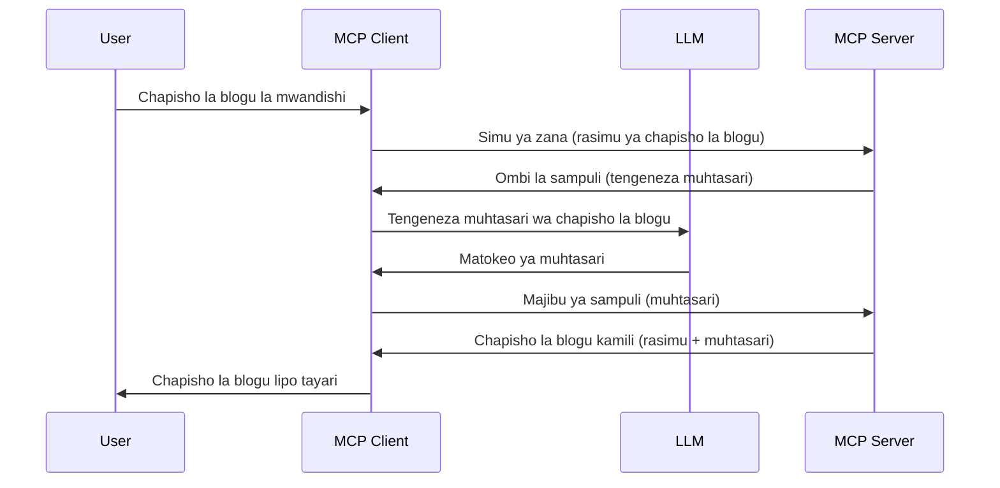

# Uchunguzi - kupeana sifa kwa Mteja

> **Tangazo la kuachwa:** mgombea wa toleo la tambulisho la MCP la `2026-07-28` unaonyesha Uchunguzi kuwa umeachwa kwa ajili ya muunganisho wa moja kwa moja na API za mtoa huduma wa LLM. Uchunguzi unaendelea kufanya kazi katika `2025-11-25` na kwa angalau mwaka mmoja baada ya kuachwa rasmi, hivyo kila kitu katika somo hili kinabaki halali — lakini miundo mipya ya seva inapaswa kutathmini muundo wa kubadilisha. Angalia [Mabadiliko katika MCP: Mgombea wa Toleo la 2026-07-28](../../01-CoreConcepts/mcp-2026-07-28-release-candidate.md).

Wakati mwingine, unahitaji Mteja wa MCP na Seva ya MCP kushirikiana ili kufikia lengo la pamoja. Unaweza kuwa na hali ambapo Seva inahitaji msaada wa LLM ambayo iko kwenye mteja. Kwa hali hii, uchunguzi ndio unapaswa kutumia.

Hebu tuchunguze baadhi ya matumizi na jinsi ya kujenga suluhisho linalohusisha uchunguzi.

## Muhtasari

Katika somo hili, tunazingatia kuelezea lini na wapi kutumia Uchunguzi na jinsi ya kuupangilia.

## Malengo ya Kujifunza

Katika sura hii, tuta:

- Elezea ni nini Uchunguzi na lini kuutumia.
- Onyesha jinsi ya kupanga Uchunguzi katika MCP.
- Toa mifano ya Uchunguzi ukiwa unafanya kazi.

## Ni nini Uchunguzi na kwa nini kuutumia?

Uchunguzi ni sifa ya juu inayofanya kazi kwa njia ifuatayo:



### Ombi la Uchunguzi

Sawa, sasa tuna mtazamo wa juu wa hali inayowezekana, hebu tuzungumze kuhusu ombi la uchunguzi ambalo seva inarudisha kwa mteja. Hapa ni kama ombi kama hilo linavyoweza kuonekana kwa muundo wa JSON-RPC:

```json
{
  "jsonrpc": "2.0",
  "id": 1,
  "method": "sampling/createMessage",
  "params": {
    "messages": [
      {
        "role": "user",
        "content": {
          "type": "text",
          "text": "Create a blog post summary of the following blog post: <BLOG POST>"
        }
      }
    ],
    "modelPreferences": {
      "hints": [
        {
          "name": "claude-3-sonnet"
        }
      ],
      "intelligencePriority": 0.8,
      "speedPriority": 0.5
    },
    "systemPrompt": "You are a helpful assistant.",
    "maxTokens": 100
  }
}
```

Kuna mambo machache hapa yanayostahili kutajwa:

- Prompt, chini ya content -> text, ni maagizo yetu kwa LLM ya kufupisha maudhui ya makala ya blogu.

- **modelPreferences**. Sehemu hii ni upendeleo tu, mapendekezo ya usanidi wa kutumia LLM. Mtumiaji anaweza kuchagua kuzingatia mapendekezo haya au kubadilisha. Katika kesi hii kuna mapendekezo juu ya mfano wa kutumia na kipaumbele cha kasi na akili.
- **systemPrompt**, huu ni ujumbe wako wa kawaida wa mfumo unaompa LLM sifa na una maelekezo ya mwongozo.
- **maxTokens**, hii ni mali nyingine inayotumika kusema idadi ya tokeni inayopendekezwa kwa kazi hii.

### Jibu la Uchunguzi

Jibu hili ndilo MCP Client hufanya kumrudisha MCP Server na ni matokeo ya mteja kupiga simu LLM, kusubiri jibu hilo kisha kutengeneza ujumbe huu. Hapa ni jinsi linavyoweza kuonekana katika JSON-RPC:

```json
{
  "jsonrpc": "2.0",
  "id": 1,
  "result": {
    "role": "assistant",
    "content": {
      "type": "text",
      "text": "Here's your abstract <ABSTRACT>"
    },
    "model": "gpt-5",
    "stopReason": "endTurn"
  }
}
```

Angalia jinsi jibu ni muhtasari wa makala ya blogu kama tulivyoomba. Pia angalia jinsi `model` iliyotumika si ile tuliyoomba bali "gpt-5" badala ya "claude-3-sonnet". Hii ni kuonyesha kwamba mtumiaji anaweza kubadilisha mawazo juu ya kinachotakiwa kutumia na ombi lako la uchunguzi ni mapendekezo.

Sawa, sasa tunapoelewa mtiririko kuu, na kazi muhimu kutumia kwa "kuunda makala ya blogu + muhtasari", hebu tuone tunachohitaji kufanya ili kuifanya ifanye kazi.

### Aina za Ujumbe

Ujumbe wa uchunguzi hauzuiliwi kwa maandishi tu bali unaweza pia kutuma picha na sauti. Hii ni jinsi JSON-RPC inavyoonekana tofauti:

**Maandishi**

```json
{
  "type": "text",
  "text": "The message content"
}
```

**Maudhui ya Picha**

```json
{
  "type": "image",
  "data": "base64-encoded-image-data",
  "mimeType": "image/jpeg"
}
```

**Maudhui ya Sauti**

```json
{
  "type": "audio",
  "data": "base64-encoded-audio-data",
  "mimeType": "audio/wav"
}
```

> NOTE: kwa maelezo zaidi kuhusu Uchunguzi, angalia [nyaraka rasmi](https://modelcontextprotocol.io/specification/2025-11-25/client/sampling)

## Jinsi ya Kupangilia Uchunguzi katika Mteja

> Kumbuka: kama unajenga seva tu, huna haja ya kufanya mengi hapa.

Katika mteja, unahitaji kufafanua sifa ifuatayo hivi:

```json
{
  "capabilities": {
    "sampling": {}
  }
}
```

Hii itachukuliwa wakati mteja wako aliyechaguliwa anapoanzisha na seva.

## Mfano wa Uchunguzi Unaofanya Kazi - Tengeneza Kifungu cha Blogu

Hebu tuchapishe seva ya uchunguzi pamoja, tutahitaji kufanya yafuatayo:

1. Tengeneza chombo kwenye Seva.
1. Chombo hicho kinapaswa kuunda ombi la uchunguzi
1. Chombo kisubiri jibu la uchunguzi la mteja.
1. Kisha matokeo ya chombo yanapaswa kutolewa.

Hebu tuangalie msimbo hatua kwa hatua:

### -1- Tengeneza chombo

**python**

```python
@mcp.tool()
async def create_blog(title: str, content: str, ctx: Context[ServerSession, None]) -> str:
    """Create a blog post and generate a summary"""

```

### -2- Tengeneza ombi la uchunguzi

Panua chombo chako kwa msimbo huu:

**python**

```python
post = BlogPost(
        id=len(posts) + 1,
        title=title,
        content=content,
        abstract=""
    )

prompt = f"Create an abstract of the following blog post: title: {title} and draft: {content} "

result = await ctx.session.create_message(
        messages=[
            SamplingMessage(
                role="user",
                content=TextContent(type="text", text=prompt),
            )
        ],
        max_tokens=100,
)

```

### -3- Subiri jibu na rudisha jibu

**python**

```python
post.abstract = result.content.text

posts.append(post)

# rudisha bidhaa kamili
return json.dumps({
    "id": post.title,
    "abstract": post.abstract
})
```

### -4- Msimbo kamili

**python**

```python
from starlette.applications import Starlette
from starlette.routing import Mount, Host

from mcp.server.fastmcp import Context, FastMCP

from mcp.server.session import ServerSession
from mcp.types import SamplingMessage, TextContent

import json


from uuid import uuid4
from typing import List
from pydantic import BaseModel


mcp = FastMCP("Blog post generator")

# app = FastAPI()

posts = []

class BlogPost(BaseModel):
    id: int
    title: str
    content: str
    abstract: str

posts: List[BlogPost] = []

@mcp.tool()
async def create_blog(title: str, content: str, ctx: Context[ServerSession, None]) -> str:
    """Create a blog post and generate a summary"""

    post = BlogPost(
        id=len(posts) + 1,
        title=title,
        content=content,
        abstract=""
    )

    prompt = f"Create an abstract of the following blog post: title: {title} and draft: {content} "

    result = await ctx.session.create_message(
        messages=[
            SamplingMessage(
                role="user",
                content=TextContent(type="text", text=prompt),
            )
        ],
        max_tokens=100,
    )

    post.abstract = result.content.text

    posts.append(post)

    # rudisha chapisho la blogi kamili
    return json.dumps({
        "id": post.title,
        "abstract": post.abstract
    })

if __name__ == "__main__":
    print("Starting server...")
    # mcp.run()
    mcp.run(transport="streamable-http")

# endesha app na: python server.py
```

### -5- Kuipima katika Visual Studio Code

Ili kuipima hii katika Visual Studio Code, fanya yafuatayo:

1. Anzisha seva kwenye terminali
1. Iongeze kwenye *mcp.json* (na hakikisha imeanzishwa) mfano kama ifuatavyo:

   ```json
   "servers": {
      "blog-server": {
        "type": "http",
        "url": "http://localhost:8000/mcp"
      }
   }
   ```

1. Andika ombi:

   ```text
   create a blog post named "Where Python comes from", the content is "Python is actually named after Monty Python Flying Circus"
   ```

1. Ruhusu uchunguzi ufanyike. Mara ya kwanza unapo jaribu hii utaonyeshwa kidirisha kingine zaidi unahitaji kukikubali, kisha utaona kidirisha cha kawaida cha kukuuliza utumie chombo

1. Kagua matokeo. Utaona matokeo yakiwa yametengenezwa vizuri katika GitHub Copilot Chat lakini pia unaweza kukagua jibu ghalani la JSON.

**Ziada**. Zana za Visual Studio Code zina msaada mzuri kwa uchunguzi. Unaweza kupanga upatikanaji wa Uchunguzi kwenye seva uliyoweka kwa kusogea sehemu hiyo hivi:

1. Nenda kwenye sehemu ya ugani.
1. Chagua ikoni ya gia ya seva yako iliyowekwa katika sehemu ya "MCP SERVERS - INSTALLED".
1 Chagua "Configure Model Access", hapa unaweza kuchagua ni modeli zipi GitHub Copilot inaruhusiwa kutumia wakati wa kufanya uchunguzi. Pia unaweza kuona maombi yote ya uchunguzi yaliyotokea hivi karibuni kwa kuchagua "Show Sampling requests".

## Kazi

Katika kazi hii, utajenga Uchunguzi kidogo tofauti yaani muunganiko wa uchunguzi unaounga mkono uzalishaji wa maelezo ya bidhaa. Huu ndio ulimwengu wako:

**Hali**: Mfanyakazi wa ofisi nyuma katika e-commerce anahitaji msaada, inachukua muda mwingi sana kuunda maelezo ya bidhaa. Kwa hiyo, unapaswa kujenga suluhisho ambapo unaweza kuitisha chombo "create_product" ukiwa na "title" na "keywords" kama hoja na kinapaswa kuzalisha bidhaa kamili ikiwa na sehemu ya "description" inayotakiwa kujazwa na LLM ya mteja.

TUMIA: tumia uliyojifunza mapema kujenga seva hii na chombo chake kwa kutumia ombi la uchunguzi.

## Suluhisho

[Suluhisho](./solution/README.md)

## Muhimu wa Kukumbuka

Uchunguzi ni sifa yenye nguvu inayoruhusu seva kupeana majukumu kwa mteja anapohitaji msaada wa LLM.

## Kinachofuata

- [Sura 4 - Utekelezaji wa vitendo](../../04-PracticalImplementation/README.md)

---

<!-- CO-OP TRANSLATOR DISCLAIMER START -->
**Kionyozo**:
Hati hii imetafsiriwa kwa kutumia huduma ya tafsiri ya AI [Co-op Translator](https://github.com/Azure/co-op-translator). Ingawa tunajitahidi kupata usahihi, tafadhali fahamu kwamba tafsiri za kiotomatiki zinaweza kuwa na makosa au upungufu wa usahihi. Hati ya asili katika lugha yake halisi inapaswa kuchukuliwa kama chanzo cha mamlaka. Kwa taarifa muhimu, tafsiri ya kitaalamu inayofanywa na binadamu inapendekezwa. Hatutojibu kwa kuelewa vibaya au tafsiri potofu zinazotokea kutokana na matumizi ya tafsiri hii.
<!-- CO-OP TRANSLATOR DISCLAIMER END -->