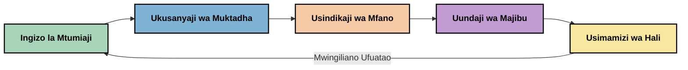
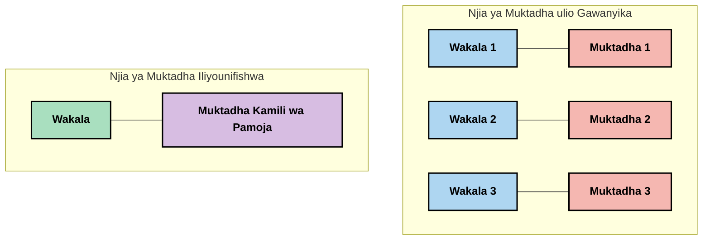
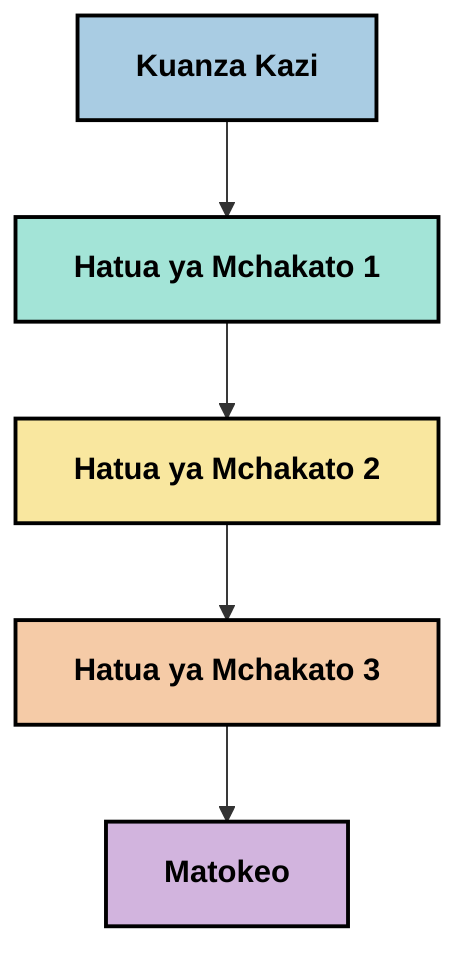
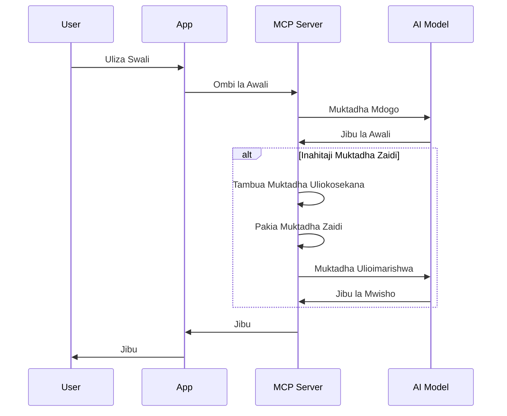
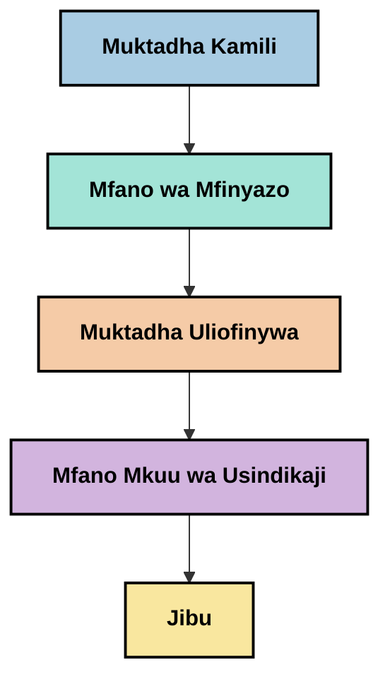
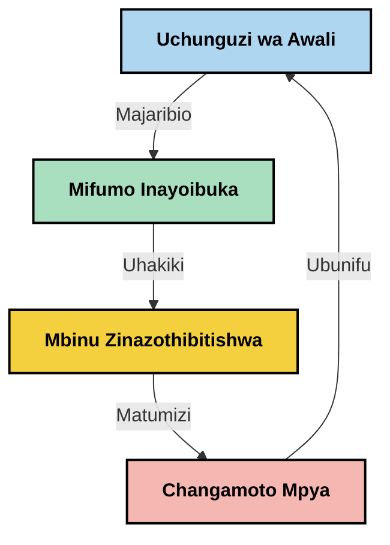

# Uhandisi wa Muktadha: Dhana Inayoibuka Katika Eneo la MCP

## Muhtasari

Uhandisi wa muktadha ni dhana inayoibuka katika eneo la AI inayochunguza jinsi habari inavyopangwa, kuwasilishwa, na kudumishwa kupitia mwingiliano kati ya wateja na huduma za AI. Kadiri mfumo wa Model Context Protocol (MCP) unavyoendelea, kuelewa jinsi ya kusimamia muktadha kwa ufanisi kunakuwa muhimu zaidi. Moduli hii inatambulisha dhana ya uhandisi wa muktadha na kuchunguza matumizi yake yanayoweza kutekelezwa katika utekelezaji wa MCP.

## Malengo ya Kujifunza

Mwisho wa moduli hii, utaweza:

- Kuelewa dhana inayoibuka ya uhandisi wa muktadha na nafasi yake inayowezekana katika programu za MCP
- Kubainisha changamoto kuu katika usimamizi wa muktadha ambazo muundo wa itifaki ya MCP unazitendea kazi
- Kuchunguza mbinu za kuboresha utendaji wa modeli kupitia usimamizi bora wa muktadha
- Kuzingatia njia za kupima na kutathmini ufanisi wa muktadha
- Kutumia dhana hizi zinazoinuka kuboresha uzoefu wa AI kupitia mfumo wa MCP

## Utangulizi wa Uhandisi wa Muktadha

Uhandisi wa muktadha ni dhana inayoibuka inayolenga kubuni na kusimamia mtiririko wa taarifa kwa makusudi kati ya watumiaji, programu, na mifano ya AI. Tofauti na nyanja zilizowekwa kama vile uhandisi wa maelekezo, uhandisi wa muktadha bado unafafanuliwa na wataalamu wanapojitahidi kutatua changamoto za kipekee za kutoa mifano ya AI taarifa sahihi kwa wakati sahihi.

Kadiri mifano mikubwa ya lugha (LLMs) inavyobadilika, umuhimu wa muktadha umeongezeka. Ubora, umuhimu, na muundo wa muktadha tunaopewa huathiri moja kwa moja matokeo ya modeli. Uhandisi wa muktadha unachunguza uhusiano huu na unatafuta kuendeleza kanuni za usimamizi mzuri wa muktadha.

> "Mnamo 2025, mifano ile iko huko ni yenye akili sana. Lakini hata mwanadamu mwerevu zaidi hatataweza kufanya kazi yao kwa ufanisi bila muktadha wa kile wanachoombwa kufanya... 'Uhandisi wa muktadha' ni ngazi inayofuata ya uhandisi wa maelekezo. Ni kuhusu kufanya hivi kiotomatiki katika mfumo unaobadilika." — Walden Yan, Cognition AI

Uhandisi wa muktadha unaweza kujumuisha:

1. **Uchaguzi wa Muktadha**: Kuamua ni taarifa gani zinazofaa kwa kazi fulani
2. **Upangaji wa Muktadha**: Kupanga taarifa ili kuongeza ufahamu wa modeli
3. **Uwasilishaji wa Muktadha**: Kuboresha jinsi na lini taarifa zinatolewa kwa mifano
4. **Uendelezaji wa Muktadha**: Kusimamia hali na mabadiliko ya muktadha kwa muda
5. **Tathmini ya Muktadha**: Kupima na kuboresha ufanisi wa muktadha

Sehemu hizi za kuzingatia ni muhimu hasa katika mfumo wa MCP, ambao hutoa njia iliyopanuliwa kwa programu kutoa muktadha kwa LLMs.


## Mtazamo wa Safari ya Muktadha

Njia moja ya kuona uhandisi wa muktadha ni kufuatilia safari ya taarifa kupitia mfumo wa MCP:



### Hatua Muhimu katika Safari ya Muktadha:

1. **Ingizo la Mtumiaji**: Taarifa mbichi kutoka kwa mtumiaji (maandishi, picha, nyaraka)
2. **Muungano wa Muktadha**: Kuchanganya ingizo la mtumiaji na muktadha wa mfumo, historia ya mazungumzo, na taarifa nyingine zilizopatikana
3. **Usindishaji wa Modeli**: Modeli ya AI inasindika muktadha uliounganishwa
4. **Uundaji wa Majibu**: Modeli hutoa matokeo kulingana na muktadha uliotolewa
5. **Usimamizi wa Hali**: Mfumo huboresha hali yake ya ndani kulingana na mwingiliano

Mtazamo huu unaonyesha asili ya mabadiliko ya muktadha katika mifumo ya AI na unaongeza maswali muhimu kuhusu jinsi bora ya kusimamia taarifa katika kila hatua.

## Kanuni Zinazoibuka katika Uhandisi wa Muktadha

Wakati eneo la uhandisi wa muktadha linapoanza kuchukua muundo, baadhi ya kanuni za mapema zinaanza kuibuka kutoka kwa wataalamu. Kanuni hizi zinaweza kusaidia kuelekeza chaguzi za utekelezaji wa MCP:

### Kanuni 1: Sambaza Muktadha Kwa Ukamilifu

Muktadha unapaswa kusambazwa kikamilifu kati ya vipengele vyote vya mfumo badala ya kugawanywa kwa sehemu nyingi za mawakala au michakato. Wakati muktadha unategemezwa, maamuzi yanayofanywa sehemu moja ya mfumo yanaweza kutofautiana na yale yanayotolewa sehemu nyingine.



Katika programu za MCP, hili linaashiria kubuni mifumo ambapo muktadha hujielea bila mshono katika njia nzima badala ya kutojumuishwa.

### Kanuni 2: Tambua Kwamba Hatua Zinabeba Maamuzi Yasiyo ya Kusimuliwa

Kila hatua inayochukuliwa na modeli ina maamuzi yasiyo ya wazi kuhusu jinsi ya kutafsiri muktadha. Wakati vipengele vingi vinapochukua hatua kwenye muktadha tofauti, maamuzi haya yasiyo rasmi yanaweza kutofautiana, na kusababisha matokeo yasiyo sawia.

Kanuni hii ina maana muhimu kwa programu za MCP:
- Tumia usindikaji wa mistari kwa kazi ngumu badala ya utekelezaji sambamba na muktadha uliogawanywa
- Hakikisha kwamba mahali pa maamuzi yote panapata taarifa sawa za muktadha
- Tengeneza mifumo ambapo hatua za baadaye zinaweza kuona muktadha kamili wa maamuzi ya awali

### Kanuni 3: Linganisha Kina cha Muktadha na Mipaka ya Dirisha

Kadiri mazungumzo na michakato inavyoongezeka, madirisha ya muktadha huweza kuzidiwa. Uhandisi mzuri wa muktadha unachunguza mbinu za kusimamia mvutano kati ya muktadha kamili na vikwazo vya kiufundi.

Mbinu zinazoweza kutafutwa ni pamoja na:
- Usisiki wa muktadha unaodumisha taarifa muhimu huku ukipunguza matumizi ya tokeni
- Kupakia muktadha kidogo kidogo kulingana na umuhimu kwa mahitaji ya sasa
- Muhtasari wa maongezi ya awali huku ukihifadhi maamuzi na ukweli muhimu

## Changamoto za Muktadha na Muundo wa Itifaki ya MCP

Model Context Protocol (MCP) ilitumika kuundwa kwa kuzingatia changamoto za kipekee za usimamizi wa muktadha. Kuelewa changamoto hizi kunasaidia kufafanua vipengele kuu vya muundo wa itifaki ya MCP:


### Changamoto 1: Mipaka ya Dirisha la Muktadha
Mifano mingi ya AI ina ukubwa wa dirisha la muktadha uliowekwa, ukizuia kiasi cha taarifa zinazoweza kusindika mara moja.

**Jibu la Muundo wa MCP:** 
- Itifaki inaunga mkono muktadha uliopangwa kwa rasilimali unaoweza kutumiwa kwa ufanisi
- Rasilimali zinaweza kupangwa kwa kurasa na kupakiwa hatua kwa hatua

### Changamoto 2: Uamuzi wa Umuhimu
Kuamua ni taarifa gani ambazo ni muhimu zaidi kujumuisha katika muktadha ni ngumu.

**Jibu la Muundo wa MCP:**
- Vifaa vya kubadilika vinavyowezesha upokezi wa muktadha kwa hali ya sasa kulingana na mahitaji
- Maelekezo yaliyopangwa hutoa muundo thabiti wa muktadha

### Changamoto 3: Uendelevu wa Muktadha
Kusimamia hali katika mwingiliano kunahitaji ufuatiliaji makini wa muktadha.

**Jibu la Muundo wa MCP:**
- Usimamizi uliosawazishwa wa vikao
- Mifumo ya wazi ya mabadiliko ya muktadha katika mwingiliano

### Changamoto 4: Muktadha wa Modal Wingi
Aina tofauti za data (maandishi, picha, data iliyopangwa) zinahitaji usimamizi tofauti.

**Jibu la Muundo wa MCP:**
- Muundo wa itifaki unazingatia aina mbalimbali za maudhui
- Uwakilishi uliosawahishwa wa taarifa za modal nyingi

### Changamoto 5: Usalama na Faragha
Muktadha mara nyingi una taarifa nyeti ambazo zinapaswa kulindwa.

**Jibu la Muundo wa MCP:**
- Mipaka wazi kati ya majukumu ya mteja na seva
- Chaguo za usindikaji wa ndani kupunguza ufunuo wa data

Kuelewa changamoto hizi na jinsi MCP inazitendea kazi hutoa msingi wa kuchunguza mbinu za uhandisi wa muktadha zilizoendelea zaidi.

## Njia Zinazoibuka za Uhandisi wa Muktadha

Kadiri eneo la uhandisi wa muktadha linavyoendelea, mbinu kadhaa zenye matumaini zinaibuka. Hizi zinaonyesha fikra za sasa badala ya mbinu zilizothibitishwa, na huenda zikabadilika kadiri tunavyopata uzoefu zaidi na utekelezaji wa MCP.

### 1. Usindikaji Mstari wa Mtu Mmoja

Tofauti na miundo ya mawakala wengi inayosambaza muktadha, baadhi ya wataalamu wanagundua kwamba usindikaji mtari wa mtu mmoja huleta matokeo thabiti zaidi. Hii inaendana na kanuni ya kudumisha muktadha uliojumlishwa.



Ingawa njia hii inaweza kuonekana si yenye ufanisi kama usindikaji sambamba, mara nyingi hutoa matokeo ya kueleweka na ya kuaminika kwa sababu kila hatua hujengwa juu ya kuelewa kikamilifu maamuzi ya awali.

### 2. Kugawanya na Kuweka Kipaumbele Muktadha

Kuvunja muktadha mkubwa katika vipande vinavyoweza kudhibitiwa na kuweka kipaumbele kwa mambo muhimu zaidi.

```python
# Mfano wa Kifanananishi: Kugawanya na Kuweka Kipaumbele Muktadha
def process_with_chunked_context(documents, query):
    # 1. Gawanya nyaraka kuwa vipande vidogo
    chunks = chunk_documents(documents)
    
    # 2. Hesabu alama za umuhimu kwa kila kipande
    scored_chunks = [(chunk, calculate_relevance(chunk, query)) for chunk in chunks]
    
    # 3. Panga vipande kwa alama ya umuhimu
    sorted_chunks = sorted(scored_chunks, key=lambda x: x[1], reverse=True)
    
    # 4. Tumia vipande vyenye umuhimu zaidi kama muktadha
    context = create_context_from_chunks([chunk for chunk, score in sorted_chunks[:5]])
    
    # 5. Fanya kazi kwa kutumia muktadha uliowekwa kipaumbele
    return generate_response(context, query)
```

Dhana hapo juu inaonyesha jinsi tunavyoweza kuvunja nyaraka kubwa kuwa vipande vinavyoshughulikiwa na kuchagua sehemu tu zinazofaa zaidi kwa muktadha. Njia hii inaweza kusaidia kufanya kazi ndani ya mipaka ya dirisha la muktadha huku ikitumia vituo vikubwa vya maarifa.

### 3. Kupakia Muktadha Kidogo Kidogo

Kupakia muktadha pole pole kulingana na mahitaji badala ya kwa mara moja.



Kupakia muktadha pole pole huanza na muktadha mdogo sana na kuongezeka tu wakati ni muhimu. Hii inaweza kupunguza sana matumizi ya tokeni kwa maswali rahisi huku ikidumisha uwezo wa kushughulikia maswali magumu.

### 4. Usikisaji na Muhtasari wa Muktadha

Kupunguza ukubwa wa muktadha huku ukidumisha taarifa muhimu.



Usisiki wa muktadha unazingatia:
- Kuondoa taarifa rudufu
- Kufupisha maudhui marefu
- Kutoa ukweli na maelezo muhimu
- Kuhifadhi vipengele muhimu vya muktadha
- Kuboresha matumizi ya tokeni

Njia hii inaweza kuwa na thamani sana kwa kudumisha mazungumzo marefu ndani ya madirisha ya muktadha au kusindika nyaraka kubwa kwa ufanisi. Wataalamu wengine hutumia mifano maalumu hasa kwa ajili ya usisiki na muhtasari wa historia ya mazungumzo.


## Mambo ya Kuzingatia Katika Uhandisi wa Muktadha

Tunapoendelea kuchunguza eneo la uhandisi wa muktadha linaloibuka, mambo kadhaa yanastahili kuzingatiwa wakati wa kufanya kazi na utekelezaji wa MCP. Haya si mbinu bora zilizopendekezwa lakini ni maeneo ya uchunguzi ambayo yanaweza kuleta maboresho katika matumizi yako maalum.

### Angalia Malengo Yako ya Muktadha

Kabla ya kutekeleza suluhisho tata za usimamizi wa muktadha, fafanua wazi unachojaribu kufanikisha:
- Taarifa gani hasa modeli inahitaji kufanikisha
- Ni taarifa gani muhimu dhidi ya zisizo za lazima?
- Ni vizuizi gani vinaathiri utendaji wako (kasoro, mipaka ya tokeni, gharama)?

### Chunguza Njia za Muktadha Zinazopangwa Kiwanda

Wataalamu wengine wanapata mafanikio na muktadha uliopangwa kwa tabaka za dhana:
- **Tabaka la Msingi**: Taarifa muhimu ambazo modeli daima inahitaji
- **Tabaka la Hali**: Muktadha maalum wa mwingiliano wa sasa
- **Tabaka la Msaada**: Taarifa za ziada zinazoweza kusaidia
- **Tabaka la Kurejea**: Taarifa zinazopatikana tu wakati zinahitajika

### Chunguza Mikakati ya Upokezi

Ufanisi wa muktadha wako mara nyingi hutegemea jinsi unavyopata taarifa:
- Utafutaji wa maana na embeddings kwa kupata taarifa zinazohusiana kidhania
- Utafutaji kwa misamiati kwa taarifa dhabiti maalum
- Njia mseto zinazochanganya mbinu tofauti za upokezi
- Kuchuja metadata kupunguza eneo kulingana na makundi, tarehe, au vyanzo

### Jaribu Ulinganifu wa Muktadha

Muundo na mtiririko wa muktadha wako unaweza kuathiri ufahamu wa modeli:
- Kuhusisha taarifa zinazohusiana pamoja
- Kutumia muundo na mpangilio thabiti
- Kudumisha mpangilio wa kimantiki au wa kihistoria inapafaa
- Kuepuka taarifa zinazoleta mgongano

### Pima Upinzani wa Miundo ya Multi-Agent

Ingawa miundo ya mawakala wengi ni maarufu katika mifumo mingi ya AI, ina changamoto kubwa za usimamizi wa muktadha:
- Kugawanyika kwa muktadha kunaweza kusababisha maamuzi yasiyo sawia kati ya mawakala
- Usindikaji sambamba unaweza kuanzisha migongano ambayo ni vigumu kutatua
- Mzigo wa mawasiliano kati ya mawakala unaweza kupunguza faida za utendaji
- Usimamizi wa hali tata unahitajika kudumisha ulinganifu

Katika matukio mengi, njia ya wakala mmoja yenye usimamizi wa kina wa muktadha inaweza kutoa matokeo ya kuaminika zaidi kuliko mawakala wengi maalumu wenye muktadha uliogawanyika.

### Tengeneza Mbinu za Tathmini

Ili kuboresha uhandisi wa muktadha kwa muda, zingatia jinsi utakavyopima mafanikio:
- Kujaribu A/B aina mbalimbali za muundo wa muktadha
- Kufuatilia matumizi ya tokeni na muda wa jibu
- Kufuatilia kuridhika kwa watumiaji na viwango vya kukamilika kwa kazi
- Kuchambua wakati na sababu za kushindwa kwa mikakati ya muktadha

Mambo haya yanaonyesha maeneo ya shughuli katika eneo la uhandisi wa muktadha. Kadiri eneo linavyoendelea, mifumo na mbinu thabiti huenda zikajitokeza.

## Kupima Ufanisi wa Muktadha: Mfumo Unaobadilika

Kadiri uhandisi wa muktadha unavyoibuka kama dhana, wataalamu wanaanza kuchunguza jinsi tunavyoweza kupima ufanisi wake. Hakuna mfumo uliowekwa bado, lakini vipimo mbalimbali vinaangaliwa ambavyo vinaweza kusaidia kuelekeza kazi za baadaye.

### Vipimo Vinavyoweza Kuangaliwa


#### 1. Mambo ya Ufanisi wa Ingizo

- **Kiwango cha Muktadha-Kwa-Jibu**: Muktadha kiasi gani unahitajika ikilinganishwa na ukubwa wa jibu?
- **Matumizi ya Tokeni**: Ni asilimia ngapi ya tokeni za muktadha zinazotumika inaonekana kuathiri jibu?
- **Kupunguza Muktadha**: Tunawezaje kusisitiza taarifa ghafi kwa ufanisi?

#### 2. Mambo ya Utendaji

- **Athari ya Kasoro**: Usimamizi wa muktadha huathirije muda wa jibu?
- **Uchumi wa Tokeni**: Je, tunaboresha matumizi ya tokeni kwa ufanisi?
- **Usahihi wa Upokezi**: Taarifa zilizopatikana ni muhimu kiasi gani?
- **Matumizi ya Rasilimali**: Rasilimali gani za kompyuta zinahitajika?

#### 3. Mambo ya Ubora

- **Umuhimu wa Jibu**: Jibu linashughulikia swali vizuri kiasi gani?
- **Usahihi wa Ukweli**: Usimamizi wa muktadha unaboresha usahihi wa ukweli?
- **Ulinganifu**: Majibu ni thabiti kwa maswali yanayofanana?
- **Kiwango cha Uongo**: Je, muktadha bora hupunguza utabiri wa uwongo wa modeli?

#### 4. Mambo ya Uzoefu wa Mtumiaji

- **Kiwango cha Ufuatiliaji**: Watumiaji huwa na maswali ya ufafanuzi mara ngapi?
- **Kukamilika kwa Kazi**: Watumiaji hufanikisha malengo yao vyema?
- **Viashiria vya Kuridhika**: Watumiaji hupewa kiwango gani cha uzoefu wao?

### Njia Za Uchunguzi wa Upimaji

Wakati wa kujaribu uhandisi wa muktadha katika utekelezaji wa MCP, zingatia njia hizi za uchunguzi:

1. **Ulinganifu wa Msingi**: Anzisha kiwango cha msingi kwa njia rahisi za muktadha kabla ya kujaribu mbinu ngumu zaidi

2. **Mabadiliko ya Polepole**: Badilisha kipengele kimoja cha usimamizi wa muktadha kwa wakati kutenganisha athari yake

3. **Tathmini Zinazoangazia Mtumiaji**: Changanya vipimo vya kiasi na maoni ya watumiaji

4. **Uchambuzi wa Kushindwa**: Chunguza kesi ambapo mikakati ya muktadha inashindwa kuelewa maboresho yanayowezekana

5. **Tathmini Zenye Vipengele Vingi**: Zingatia mzigo kati ya ufanisi, ubora, na uzoefu wa mtumiaji

Njia hii ya majaribio yenye vipengele vingi inalingana na asili inayoibuka ya uhandisi wa muktadha.

## Mawazo ya Mwisho

Uhandisi wa muktadha ni eneo linaloibuka la uchunguzi ambalo linaweza kuwa msingi wa programu bora za MCP. Kwa kuzingatia kwa makini jinsi taarifa inavyopeperushwa kupitia mfumo wako, unaweza kuunda uzoefu wa AI unaofaa zaidi, sahihi, na wenye thamani kwa watumiaji.

Mbinu na njia zilizotajwa katika moduli hii zinaonyesha fikra za mapema katika eneo hili, si mbinu zilizothibitishwa. Uhandisi wa muktadha unaweza kuendelea kuwa somo lililobainishwa zaidi kadiri uwezo wa AI unavyobadilika na kuelewa kwetu kunavyozidi kuwa kina. Kwa sasa, majaribio yanayochanganywa na upimaji makini huonekana kuwa njia yenye tija zaidi.

## Mwelekeo Inayoweza Kuja Baadaye

Eneo la uhandisi wa muktadha bado liko katika hatua za awali, lakini mwelekeo kadhaa wenye matumaini yanaibuka:

- Kanuni za uhandisi wa muktadha zinaweza kuathiri sana utendaji wa modeli, ufanisi, uzoefu wa mtumiaji, na kuaminika
- Njia za mstari mmoja na usimamizi kamili wa muktadha huenda zikashinda miundo ya mawakala wengi kwa matumizi mengi
- Mifano maalumu ya usisiki wa muktadha huenda zikawa sehemu za kawaida katika minyororo ya AI
- Mvutano kati ya ukamilifu wa muktadha na mipaka ya tokeni huenda ukaweka msukumo wa ubunifu katika usimamizi wa muktadha
- Kadiri mifano inavyosonga mbele katika mawasiliano yenye ufanisi kama binadamu, ushirikiano wa kweli wa mawakala wengi unaweza kuwa halali zaidi
- Utekelezaji wa MCP huenda ukabadilika ili kuekeza mifumo ya usimamizi wa muktadha inayotokana na majaribio ya sasa



## Rasilimali

### Rasilimali Rasmi za MCP
- [Tovuti ya Model Context Protocol](https://modelcontextprotocol.io/)
- [Maelezo ya Model Context Protocol](https://github.com/modelcontextprotocol/modelcontextprotocol)

- [Nyaraka za MCP](https://modelcontextprotocol.io/docs)
- [MCP C# SDK](https://github.com/modelcontextprotocol/csharp-sdk)
- [MCP Python SDK](https://github.com/modelcontextprotocol/python-sdk)
- [MCP TypeScript SDK](https://github.com/modelcontextprotocol/typescript-sdk)
- [MCP Inspector](https://github.com/modelcontextprotocol/inspector) - Chombo cha mtihani wa kuona kwa seva za MCP

### Makala za Uhandisi wa Muktadha
- [Usijenge Wagent Wengi: Kanuni za Uhandisi wa Muktadha](https://cognition.ai/blog/dont-build-multi-agents) - Maoni ya Walden Yan juu ya kanuni za uhandisi wa muktadha
- [Mwongozo wa Kivitendo wa Kujenga Wagent](https://cdn.openai.com/business-guides-and-resources/a-practical-guide-to-building-agents.pdf) - Mwongozo wa OpenAI juu ya muundo wa wagent wenye ufanisi
- [Kujenga Wagent Wenye Ufanisi](https://www.anthropic.com/engineering/building-effective-agents) - Mbinu ya Anthropic ya ukuzaji wa wagent

### Utafiti Unaohusiana
- [Uongezaji wa Uvutaji wa Muktadha kwa Models za Lugha Kubwa](https://arxiv.org/abs/2310.01487) - Utafiti juu ya mbinu za uvutaji wa muktadha zinazobadilika
- [Kupotea Katikati: Jinsi Models za Lugha Zinavyotumia Muktadha Mrefu](https://arxiv.org/abs/2307.03172) - Utafiti muhimu juu ya mifumo ya usindikaji muktadha
- [Uundaji wa Picha Ulioungwa kwa Maandishi wa Ngazi za Juu kwa CLIP Latents](https://arxiv.org/abs/2204.06125) - Karatasi ya DALL-E 2 yenye maarifa juu ya muundo wa muktadha
- [Kuchunguza Nafasi ya Muktadha katika Miundo ya Modeli Kubwa za Lugha](https://aclanthology.org/2023.findings-emnlp.124/) - Utafiti wa hivi karibuni juu ya usimamizi wa muktadha
- [Ushirikiano wa Multi-Agent: Utafiti wa Mapitio](https://arxiv.org/abs/2304.03442) - Utafiti juu ya mifumo ya wagent wengi na changamoto zao

### Rasilimali Zaidi
- [Mbinu za Uboreshaji Dirisha la Muktadha](https://learn.microsoft.com/en-us/azure/ai-services/openai/concepts/context-window)
- [Mbinu Zinazoendelea za RAG](https://www.microsoft.com/en-us/research/blog/retrieval-augmented-generation-rag-and-frontier-models/)
- [Nyaraka za Semantic Kernel](https://github.com/microsoft/semantic-kernel)
- [Seti ya Zana za AI kwa Usimamizi wa Muktadha](https://github.com/microsoft/aitoolkit)

## Nini kinachofuata

- [5.15 Usafirishaji Maalum wa MCP](../mcp-transport/README.md)

---

<!-- CO-OP TRANSLATOR DISCLAIMER START -->
**Kionyozo**:
Hati hii imetafsiriwa kwa kutumia huduma ya tafsiri ya AI [Co-op Translator](https://github.com/Azure/co-op-translator). Ingawa tunajitahidi kupata usahihi, tafadhali fahamu kwamba tafsiri za kiotomatiki zinaweza kuwa na makosa au upungufu wa usahihi. Hati ya asili katika lugha yake halisi inapaswa kuchukuliwa kama chanzo cha mamlaka. Kwa taarifa muhimu, tafsiri ya kitaalamu inayofanywa na binadamu inapendekezwa. Hatutojibu kwa kuelewa vibaya au tafsiri potofu zinazotokea kutokana na matumizi ya tafsiri hii.
<!-- CO-OP TRANSLATOR DISCLAIMER END -->