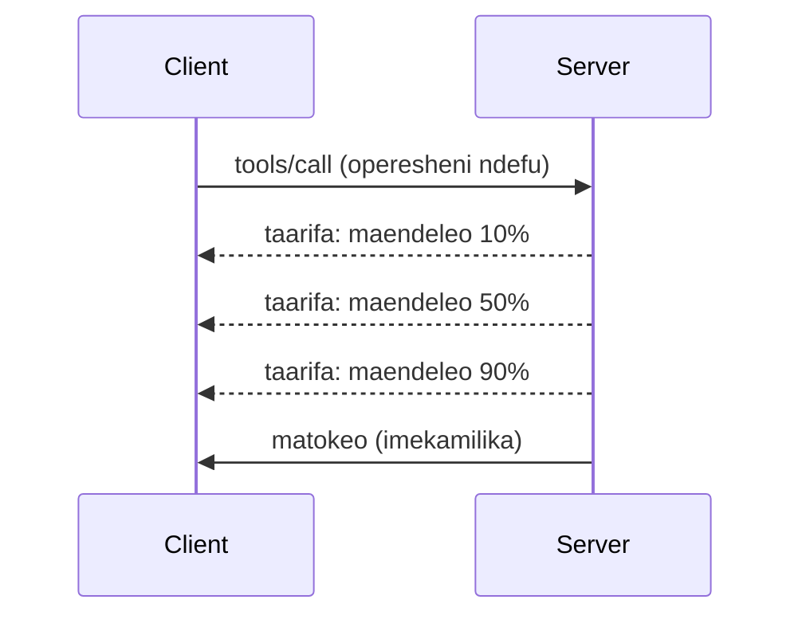

# Uchunguzi wa Kina wa Vipengele vya Itifaki ya MCP

Mwongozo huu unachunguza vipengele vya juu vya itifaki ya MCP ambavyo vinavuka usindikaji wa zana na rasilimali za msingi. Kuelewa vipengele hivi kuna kusaidia kujenga seva za MCP zenye nguvu zaidi, rafiki kwa mtumiaji, na tayari kwa uzalishaji.

> **Kuangalia mbele:** toleo la kandarasi la `2026-07-28` linaacha kutumia kipengele cha Upigaji Kumbukumbu (Logging primitive) (linapendelea `stderr` kwa stdio na OpenTelemetry kwa uangalizi uliopangwa), linaondoa mfano wa `initialize`/kikao kilichotajwa katika Matukio ya Mzunguko wa Maisha ya Seva hapa chini, na linaweka kipengele cha Majukumu cha majaribio katika ugani maalum wa Majukumu wenye mzunguko mpya wa `tasks/get`/`tasks/update`/`tasks/cancel`. Angalia [Nini Kina Badilika katika MCP: Toleo la Kandarasi la 2026-07-28](../../01-CoreConcepts/mcp-2026-07-28-release-candidate.md).

## Vipengele Vilivyoshughulikiwa

1. **Arifa za Maendeleo** - Ripoti maendeleo kwa shughuli zinazochukua muda mrefu
2. **Kughairi Maombi** - Ruhusu wateja kughairi maombi yaliyoanzishwa
3. **Mifano ya Rasilimali** - URI zenye vigezo kwa rasilimali zinazorudishwa kiotomatiki
4. **Matukio ya Mzunguko wa Maisha ya Seva** - Uanzishaji na kufunga kwa usahihi
5. **Udhibiti wa Upigaji Kumbukumbu** - Usanidi wa upigaji kumbukumbu upande wa seva
6. **Mifumo ya Kushughulikia Makosa** - Majibu ya makosa yanayolingana

---

## 1. Arifa za Maendeleo

Kwa shughuli zinazochukua muda (kusindika data, kupakua faili, miito ya API), arifa za maendeleo zinawasaidia watumiaji kupata taarifa.

### Jinsi Inavyofanya Kazi



### Utekelezaji wa Python

```python
from mcp.server import Server, NotificationOptions
from mcp.types import ProgressNotification
import asyncio

app = Server("progress-server")

@app.tool()
async def process_large_file(file_path: str, ctx) -> str:
    """Process a large file with progress updates."""
    
    # Pata ukubwa wa faili kwa ajili ya hesabu ya maendeleo
    file_size = os.path.getsize(file_path)
    processed = 0
    
    with open(file_path, 'rb') as f:
        while chunk := f.read(8192):
            # Shughulikia kipande
            await process_chunk(chunk)
            processed += len(chunk)
            
            # Tuma taarifa ya maendeleo
            progress = (processed / file_size) * 100
            await ctx.send_notification(
                ProgressNotification(
                    progressToken=ctx.request_id,
                    progress=progress,
                    total=100,
                    message=f"Processing: {progress:.1f}%"
                )
            )
    
    return f"Processed {file_size} bytes"

@app.tool()
async def batch_operation(items: list[str], ctx) -> str:
    """Process multiple items with progress."""
    
    results = []
    total = len(items)
    
    for i, item in enumerate(items):
        result = await process_item(item)
        results.append(result)
        
        # Ripoti maendeleo baada ya kila kipengee
        await ctx.send_notification(
            ProgressNotification(
                progressToken=ctx.request_id,
                progress=i + 1,
                total=total,
                message=f"Processed {i + 1}/{total}: {item}"
            )
        )
    
    return f"Completed {total} items"
```

### Utekelezaji wa TypeScript

```typescript
import { Server } from "@modelcontextprotocol/sdk/server/index.js";

server.setRequestHandler(CallToolSchema, async (request, extra) => {
  const { name, arguments: args } = request.params;
  
  if (name === "process_data") {
    const items = args.items as string[];
    const results = [];
    
    for (let i = 0; i < items.length; i++) {
      const result = await processItem(items[i]);
      results.push(result);
      
      // Tuma taarifa ya maendeleo
      await extra.sendNotification({
        method: "notifications/progress",
        params: {
          progressToken: request.id,
          progress: i + 1,
          total: items.length,
          message: `Processing item ${i + 1}/${items.length}`
        }
      });
    }
    
    return { content: [{ type: "text", text: JSON.stringify(results) }] };
  }
});
```

### Ushughulikiaji wa Mteja (Python)

```python
async def handle_progress(notification):
    """Handle progress notifications from server."""
    params = notification.params
    print(f"Progress: {params.progress}/{params.total} - {params.message}")

# Sajili mshughulikiaji
session.on_notification("notifications/progress", handle_progress)

# Piga zana (mabadiliko ya maendeleo yatafika kupitia mshughulikiaji)
result = await session.call_tool("process_large_file", {"file_path": "/data/large.csv"})
```

---

## 2. Kughairi Maombi

Ruhusu wateja kughairi maombi ambao hayahitajiki tena au yanachukua muda mrefu mno.

### Utekelezaji wa Python

```python
from mcp.server import Server
from mcp.types import CancelledError
import asyncio

app = Server("cancellable-server")

@app.tool()
async def long_running_search(query: str, ctx) -> str:
    """Search that can be cancelled."""
    
    results = []
    
    try:
        for page in range(100):  # Tafuta kupitia kurasa nyingi
            # Angalia kama kuairisha kulikuwa kwa ombi
            if ctx.is_cancelled:
                raise CancelledError("Search cancelled by user")
            
            # Onyesha kutafuta kurasa
            page_results = await search_page(query, page)
            results.extend(page_results)
            
            # Chelezo kidogo huruhusu ukaguzi wa kuairisha
            await asyncio.sleep(0.1)
            
    except CancelledError:
        # Rejesha matokeo ya sehemu
        return f"Cancelled. Found {len(results)} results before cancellation."
    
    return f"Found {len(results)} total results"

@app.tool()
async def download_file(url: str, ctx) -> str:
    """Download with cancellation support."""
    
    async with aiohttp.ClientSession() as session:
        async with session.get(url) as response:
            total_size = int(response.headers.get('content-length', 0))
            downloaded = 0
            chunks = []
            
            async for chunk in response.content.iter_chunked(8192):
                if ctx.is_cancelled:
                    return f"Download cancelled at {downloaded}/{total_size} bytes"
                
                chunks.append(chunk)
                downloaded += len(chunk)
            
            return f"Downloaded {downloaded} bytes"
```

### Kutekeleza Muktadha wa Kughairi

```python
class CancellableContext:
    """Context object that tracks cancellation state."""
    
    def __init__(self, request_id: str):
        self.request_id = request_id
        self._cancelled = asyncio.Event()
        self._cancel_reason = None
    
    @property
    def is_cancelled(self) -> bool:
        return self._cancelled.is_set()
    
    def cancel(self, reason: str = "Cancelled"):
        self._cancel_reason = reason
        self._cancelled.set()
    
    async def check_cancelled(self):
        """Raise if cancelled, otherwise continue."""
        if self.is_cancelled:
            raise CancelledError(self._cancel_reason)
    
    async def sleep_or_cancel(self, seconds: float):
        """Sleep that can be interrupted by cancellation."""
        try:
            await asyncio.wait_for(
                self._cancelled.wait(),
                timeout=seconds
            )
            raise CancelledError(self._cancel_reason)
        except asyncio.TimeoutError:
            pass  # Muda wa kawaida wa kungojea, endelea
```

### Kughairi Upande wa Mteja

```python
import asyncio

async def search_with_timeout(session, query, timeout=30):
    """Search with automatic cancellation on timeout."""
    
    task = asyncio.create_task(
        session.call_tool("long_running_search", {"query": query})
    )
    
    try:
        result = await asyncio.wait_for(task, timeout=timeout)
        return result
    except asyncio.TimeoutError:
        # Ombi la kughairi
        await session.send_notification({
            "method": "notifications/cancelled",
            "params": {"requestId": task.request_id, "reason": "Timeout"}
        })
        return "Search timed out"
```

---

## 3. Mifano ya Rasilimali

Mifano ya rasilimali huruhusu uundaji wa URI za mabadiliko kwa kutumia vigezo, muhimu kwa API na hifadhidata.

### Kufafanua Mifano

```python
from mcp.server import Server
from mcp.types import ResourceTemplate

app = Server("template-server")

@app.list_resource_templates()
async def list_templates() -> list[ResourceTemplate]:
    """Return available resource templates."""
    return [
        ResourceTemplate(
            uriTemplate="db://users/{user_id}",
            name="User Profile",
            description="Fetch user profile by ID",
            mimeType="application/json"
        ),
        ResourceTemplate(
            uriTemplate="api://weather/{city}/{date}",
            name="Weather Data",
            description="Historical weather for city and date",
            mimeType="application/json"
        ),
        ResourceTemplate(
            uriTemplate="file://{path}",
            name="File Content",
            description="Read file at given path",
            mimeType="text/plain"
        )
    ]

@app.read_resource()
async def read_resource(uri: str) -> str:
    """Read resource, expanding template parameters."""
    
    # Tafsiri URI ili kutoa vigezo
    if uri.startswith("db://users/"):
        user_id = uri.split("/")[-1]
        return await fetch_user(user_id)
    
    elif uri.startswith("api://weather/"):
        parts = uri.replace("api://weather/", "").split("/")
        city, date = parts[0], parts[1]
        return await fetch_weather(city, date)
    
    elif uri.startswith("file://"):
        path = uri.replace("file://", "")
        return await read_file(path)
    
    raise ValueError(f"Unknown resource URI: {uri}")
```

### Utekelezaji wa TypeScript

```typescript
server.setRequestHandler(ListResourceTemplatesSchema, async () => {
  return {
    resourceTemplates: [
      {
        uriTemplate: "github://repos/{owner}/{repo}/issues/{issue_number}",
        name: "GitHub Issue",
        description: "Fetch a specific GitHub issue",
        mimeType: "application/json"
      },
      {
        uriTemplate: "db://tables/{table}/rows/{id}",
        name: "Database Row",
        description: "Fetch a row from a database table",
        mimeType: "application/json"
      }
    ]
  };
});

server.setRequestHandler(ReadResourceSchema, async (request) => {
  const uri = request.params.uri;
  
  // Tafsiri URI ya tatizo la GitHub
  const githubMatch = uri.match(/^github:\/\/repos\/([^/]+)\/([^/]+)\/issues\/(\d+)$/);
  if (githubMatch) {
    const [_, owner, repo, issueNumber] = githubMatch;
    const issue = await fetchGitHubIssue(owner, repo, parseInt(issueNumber));
    return {
      contents: [{
        uri,
        mimeType: "application/json",
        text: JSON.stringify(issue, null, 2)
      }]
    };
  }
  
  throw new Error(`Unknown resource URI: ${uri}`);
});
```

---

## 4. Matukio ya Mzunguko wa Maisha ya Seva

Uanzishaji na kufungwa kwa usahihi huhakikisha usimamizi safi wa rasilimali.

### Usimamizi wa Mzunguko wa Maisha kwa Python

```python
from mcp.server import Server
from contextlib import asynccontextmanager

app = Server("lifecycle-server")

# Hali iliyoshirikiwa
db_connection = None
cache = None

@asynccontextmanager
async def lifespan(server: Server):
    """Manage server lifecycle."""
    global db_connection, cache
    
    # Kuanzishwa
    print("🚀 Server starting...")
    db_connection = await create_database_connection()
    cache = await create_cache_client()
    print("✅ Resources initialized")
    
    yield  # Server inaendesha hapa
    
    # Kufunga
    print("🛑 Server shutting down...")
    await db_connection.close()
    await cache.close()
    print("✅ Resources cleaned up")

app = Server("lifecycle-server", lifespan=lifespan)

@app.tool()
async def query_database(sql: str) -> str:
    """Use the shared database connection."""
    result = await db_connection.execute(sql)
    return str(result)
```

### Mzunguko wa Maisha wa TypeScript

```typescript
import { Server } from "@modelcontextprotocol/sdk/server/index.js";

class ManagedServer {
  private server: Server;
  private dbConnection: DatabaseConnection | null = null;
  
  constructor() {
    this.server = new Server({
      name: "lifecycle-server",
      version: "1.0.0"
    });
    
    this.setupHandlers();
  }
  
  async start() {
    // Anzisha rasilimali
    console.log("🚀 Server starting...");
    this.dbConnection = await createDatabaseConnection();
    console.log("✅ Database connected");
    
    // Anzisha seva
    await this.server.connect(transport);
  }
  
  async stop() {
    // Safisha rasilimali
    console.log("🛑 Server shutting down...");
    if (this.dbConnection) {
      await this.dbConnection.close();
    }
    await this.server.close();
    console.log("✅ Cleanup complete");
  }
  
  private setupHandlers() {
    this.server.setRequestHandler(CallToolSchema, async (request) => {
      // Tumia this.dbConnection kwa usalama
      // ...
    });
  }
}

// Matumizi na kufunga kwa heshima
const server = new ManagedServer();

process.on('SIGINT', async () => {
  await server.stop();
  process.exit(0);
});

await server.start();
```

---

## 5. Udhibiti wa Upigaji Kumbukumbu

MCP inaunga mkono ngazi za upigaji kumbukumbu upande wa seva ambazo wateja wanaweza kudhibiti.

### Kutekeleza Ngazi za Upigaji Kumbukumbu

```python
from mcp.server import Server
from mcp.types import LoggingLevel
import logging

app = Server("logging-server")

# Ramisha viwango vya MCP kwa viwango vya uandishi wa kumbukumbu vya Python
LEVEL_MAP = {
    LoggingLevel.DEBUG: logging.DEBUG,
    LoggingLevel.INFO: logging.INFO,
    LoggingLevel.WARNING: logging.WARNING,
    LoggingLevel.ERROR: logging.ERROR,
}

logger = logging.getLogger("mcp-server")

@app.set_logging_level()
async def set_logging_level(level: LoggingLevel) -> None:
    """Handle client request to change logging level."""
    python_level = LEVEL_MAP.get(level, logging.INFO)
    logger.setLevel(python_level)
    logger.info(f"Logging level set to {level}")

@app.tool()
async def debug_operation(data: str) -> str:
    """Tool with various logging levels."""
    logger.debug(f"Processing data: {data}")
    
    try:
        result = process(data)
        logger.info(f"Successfully processed: {result}")
        return result
    except Exception as e:
        logger.error(f"Processing failed: {e}")
        raise
```

### Kutuma Ujumbe za Kumbukumbu kwa Mteja

```python
@app.tool()
async def complex_operation(input: str, ctx) -> str:
    """Operation that logs to client."""
    
    # Tuma taarifa ya kumbukumbu kwa mteja
    await ctx.send_log(
        level="info",
        message=f"Starting complex operation with input: {input}"
    )
    
    # Fanya kazi...
    result = await do_work(input)
    
    await ctx.send_log(
        level="debug",
        message=f"Operation complete, result size: {len(result)}"
    )
    
    return result
```

---

## 6. Mifumo ya Kushughulikia Makosa

Kushughulikia makosa kwa uwiano huongeza urahisi wa utambuzi wa matatizo na uzoefu wa mtumiaji.

### Nambari za Makosa ya MCP

```python
from mcp.types import McpError, ErrorCode

class ToolError(McpError):
    """Base class for tool errors."""
    pass

class ValidationError(ToolError):
    """Invalid input parameters."""
    def __init__(self, message: str):
        super().__init__(ErrorCode.INVALID_PARAMS, message)

class NotFoundError(ToolError):
    """Requested resource not found."""
    def __init__(self, resource: str):
        super().__init__(ErrorCode.INVALID_REQUEST, f"Not found: {resource}")

class PermissionError(ToolError):
    """Access denied."""
    def __init__(self, action: str):
        super().__init__(ErrorCode.INVALID_REQUEST, f"Permission denied: {action}")

class InternalError(ToolError):
    """Internal server error."""
    def __init__(self, message: str):
        super().__init__(ErrorCode.INTERNAL_ERROR, message)
```

### Majibu ya Makosa Yaliyopangwa

```python
@app.tool()
async def safe_operation(input: str) -> str:
    """Tool with comprehensive error handling."""
    
    # Hakiki ingizo
    if not input:
        raise ValidationError("Input cannot be empty")
    
    if len(input) > 10000:
        raise ValidationError(f"Input too large: {len(input)} chars (max 10000)")
    
    try:
        # Angalia ruhusa
        if not await check_permission(input):
            raise PermissionError(f"read {input}")
        
        # Fanya operesheni
        result = await perform_operation(input)
        
        if result is None:
            raise NotFoundError(input)
        
        return result
        
    except ConnectionError as e:
        raise InternalError(f"Database connection failed: {e}")
    except TimeoutError as e:
        raise InternalError(f"Operation timed out: {e}")
    except Exception as e:
        # Andika makosa yasiyotarajiwa
        logger.exception(f"Unexpected error in safe_operation")
        raise InternalError(f"Unexpected error: {type(e).__name__}")
```

### Kushughulikia Makosa kwa TypeScript

```typescript
import { McpError, ErrorCode } from "@modelcontextprotocol/sdk/types.js";

function validateInput(data: unknown): asserts data is ValidInput {
  if (typeof data !== "object" || data === null) {
    throw new McpError(
      ErrorCode.InvalidParams,
      "Input must be an object"
    );
  }
  // Uthibitishaji zaidi...
}

server.setRequestHandler(CallToolSchema, async (request) => {
  try {
    validateInput(request.params.arguments);
    
    const result = await performOperation(request.params.arguments);
    
    return {
      content: [{ type: "text", text: JSON.stringify(result) }]
    };
    
  } catch (error) {
    if (error instanceof McpError) {
      throw error;  // Tayari ni hitilafu ya MCP
    }
    
    // Geuza makosa mengine
    if (error instanceof NotFoundError) {
      throw new McpError(ErrorCode.InvalidRequest, error.message);
    }
    
    // Hitilafu isiyojulikana
    console.error("Unexpected error:", error);
    throw new McpError(
      ErrorCode.InternalError,
      "An unexpected error occurred"
    );
  }
});
```

---

## Vipengele vya Maajaribio (MCP 2025-11-25)

Vipengele hivi vimewekwa kama majaribio katika vipimo:

### Majukumu (Shughuli Ndefu Zinazofanyika)

```python
# Kazi zinawezesha kufuatilia shughuli za muda mrefu zenye hali
@app.task()
async def training_task(model_id: str, data_path: str, ctx) -> str:
    """Long-running ML training task."""
    
    # Ripoti kazi ilianza
    await ctx.report_status("running", "Initializing training...")
    
    # Mzunguko wa mafunzo
    for epoch in range(100):
        await train_epoch(model_id, data_path, epoch)
        await ctx.report_status(
            "running",
            f"Training epoch {epoch + 1}/100",
            progress=epoch + 1,
            total=100
        )
    
    await ctx.report_status("completed", "Training finished")
    return f"Model {model_id} trained successfully"
```

### Maelezo ya Zana

```python
# Maelezo ya ziada hutoa metadata kuhusu tabia ya chombo
@app.tool(
    annotations={
        "destructive": False,      # Hailizi data
        "idempotent": True,        # Salama kujaribu tena
        "timeout_seconds": 30,     # Muda wa juu unaotarajiwa
        "requires_approval": False # Hakuna idhini ya mtumiaji inahitajika
    }
)
async def safe_query(query: str) -> str:
    """A read-only database query tool."""
    return await execute_read_query(query)
```

---

## Nini Kinachofuata

- [Moduli 8 - Mizingiro Bora](../../08-BestPractices/README.md)
- [5.14 - Uhandisi wa Muktadha](../mcp-contextengineering/README.md)
- [Mabadiliko ya Maelezo ya MCP](https://spec.modelcontextprotocol.io/)

---

## Rasilimali Zingine

- [Maelezo ya MCP 2025-11-25](https://spec.modelcontextprotocol.io/specification/2025-11-25/)
- [Nambari za Makosa za JSON-RPC 2.0](https://www.jsonrpc.org/specification#error_object)
- [Mifano ya SDK ya Python](https://github.com/modelcontextprotocol/python-sdk/tree/main/examples)
- [Mifano ya SDK ya TypeScript](https://github.com/modelcontextprotocol/typescript-sdk/tree/main/examples)

---

<!-- CO-OP TRANSLATOR DISCLAIMER START -->
**Kionyozo**:
Hati hii imetafsiriwa kwa kutumia huduma ya tafsiri ya AI [Co-op Translator](https://github.com/Azure/co-op-translator). Ingawa tunajitahidi kupata usahihi, tafadhali fahamu kwamba tafsiri za kiotomatiki zinaweza kuwa na makosa au upungufu wa usahihi. Hati ya asili katika lugha yake halisi inapaswa kuchukuliwa kama chanzo cha mamlaka. Kwa taarifa muhimu, tafsiri ya kitaalamu inayofanywa na binadamu inapendekezwa. Hatutojibu kwa kuelewa vibaya au tafsiri potofu zinazotokea kutokana na matumizi ya tafsiri hii.
<!-- CO-OP TRANSLATOR DISCLAIMER END -->