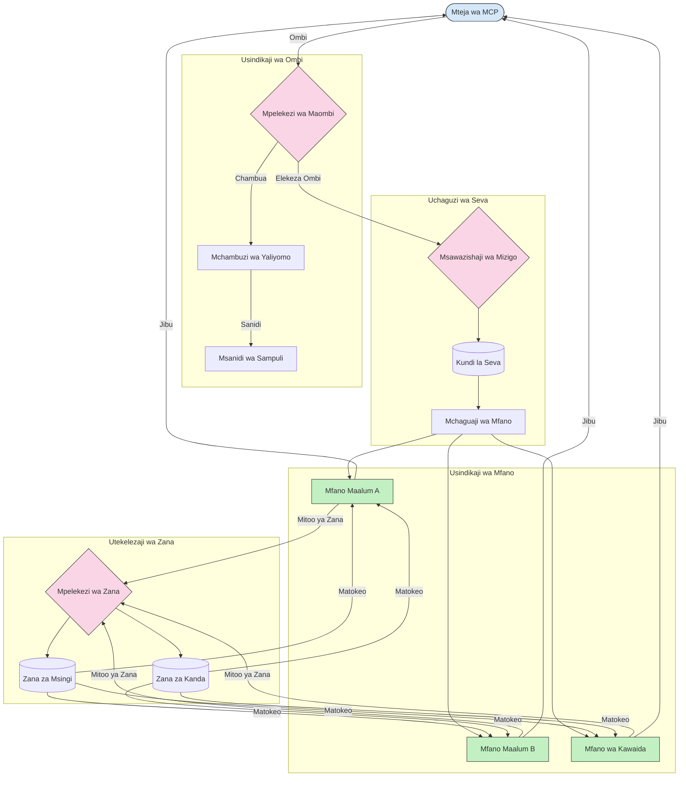

# Upatanishi katika Itifaki ya Muktadha wa Mfano

Upatanishi ni muhimu kwa kuelekeza maombi kwa mifano, zana, au huduma sahihi ndani ya mfumo wa MCP.

## Utangulizi

Upatanishi katika Itifaki ya Muktadha wa Mfano (MCP) unahusisha kuelekeza maombi kwa mifano au huduma zinazofaa zaidi kulingana na vigezo mbalimbali kama vile aina ya maudhui, muktadha wa mtumiaji, na mzigo wa mfumo. Hii huhakikisha usindikaji mzuri na matumizi bora ya rasilimali.

## Malengo ya Kujifunza

Mwisho wa somo hili, utaweza:

- Kuelewa misingi ya upatanishi katika MCP.
- Kutekeleza upatanishi unaotegemea maudhui kuelekeza maombi kwa huduma maalum.
- Kutumia mbinu za usawa mzigo zenye akili kuboresha matumizi ya rasilimali.
- Kutekeleza upatanishi wa zana za mabadiliko kulingana na muktadha wa ombi.

## Upatanishi Unaotegemea Maudhui

Upatanishi unaotegemea maudhui hupeleka maombi kwa huduma maalum kulingana na maudhui ya ombi. Kwa mfano, maombi yanayohusiana na utengenezaji wa msimbo yanaweza kupangwa kwa mfano maalum wa msimbo, wakati maombi ya uandishi wa ubunifu yanaweza kutumwa kwa mfano wa uandishi wa ubunifu.

Tuchunguze mfano wa utekelezaji katika lugha tofauti za programu.

<details>
<summary>.NET</summary>

```csharp
// .NET Example: Content-based routing in MCP
public class ContentBasedRouter
{
    private readonly Dictionary<string, McpClient> _specializedClients;
    private readonly RoutingClassifier _classifier;
    
    public ContentBasedRouter()
    {
        // Initialize specialized clients for different domains
        _specializedClients = new Dictionary<string, McpClient>
        {
            ["code"] = new McpClient("https://code-specialized-mcp.com"),
            ["creative"] = new McpClient("https://creative-specialized-mcp.com"),
            ["scientific"] = new McpClient("https://scientific-specialized-mcp.com"),
            ["general"] = new McpClient("https://general-mcp.com")
        };
        
        // Initialize content classifier
        _classifier = new RoutingClassifier();
    }
    
    public async Task<McpResponse> RouteAndProcessAsync(string prompt, IDictionary<string, object> parameters = null)
    {
        // Classify the prompt to determine the best specialized service
        string category = await _classifier.ClassifyPromptAsync(prompt);
        
        // Get the appropriate client or fall back to general
        var client = _specializedClients.ContainsKey(category) 
            ? _specializedClients[category] 
            : _specializedClients["general"];
            
        Console.WriteLine($"Routing request to {category} specialized service");
        
        // Send request to the selected service
        return await client.SendPromptAsync(prompt, parameters);
    }
    
    // Simple classifier for routing decisions
    private class RoutingClassifier
    {
        public Task<string> ClassifyPromptAsync(string prompt)
        {
            prompt = prompt.ToLowerInvariant();
            
            if (prompt.Contains("code") || prompt.Contains("function") || 
                prompt.Contains("program") || prompt.Contains("algorithm"))
            {
                return Task.FromResult("code");
            }
            
            if (prompt.Contains("story") || prompt.Contains("creative") || 
                prompt.Contains("imagine") || prompt.Contains("design"))
            {
                return Task.FromResult("creative");
            }
            
            if (prompt.Contains("science") || prompt.Contains("research") || 
                prompt.Contains("analyze") || prompt.Contains("study"))
            {
                return Task.FromResult("scientific");
            }
            
            return Task.FromResult("general");
        }
    }
}
```

Katika msimbo uliopita, tume:

- Kuunda darasa `ContentBasedRouter` linaloelekeza maombi kulingana na maudhui ya ombi.
- Kuanzisha wateja maalum kwa maeneo tofauti (msimbo, ubunifu, kisayansi, jumla).
- Kutekeleza kipangaji rahisi kinachobaini aina ya ombi na kuliwaelekeza kwa huduma maalum inayofaa.
- Kutumia utaratibu wa kurudi nyuma kuelekeza maombi kwa huduma ya jumla ikiwa hakuna huduma maalum inayopatikana.
- Kutekeleza usindikaji wa asynchro kuendesha maombi kwa ufanisi.
- Kutumia kamusi kuoanisha aina za maudhui na wateja maalum wa MCP.
- Kutekeleza kipangaji rahisi kinachochambua ombi na kurudisha aina inayofaa.
- Kutumia mteja maalum kutuma ombi na kupokea jibu.
- Kushughulikia visa ambapo ombi halilingani na aina yoyote maalum kwa kuelekeza kwa huduma ya jumla.

</details>

## Usawazishaji Mzigo wa Kifahamu

Usawazishaji mzigo unaboresha matumizi ya rasilimali na kuhakikisha upatikanaji wa juu kwa huduma za MCP. Kuna njia mbalimbali za kutekeleza usawazishaji mzigo, kama vile round-robin, wakati wa majibu ulioyepukwa, au mbinu zinazojali maudhui.

Tuchunguze mfano wa utekelezaji ufuatao unaotumia mikakati ifuatayo:

- **Round Robin**: Hugawa maombi kwa usawa miongoni mwa seva zinazopatikana.
- **Wakati wa Majibu ulioyepukwa**: Huelekeza maombi kwa seva kulingana na wastani wa wakati wa majibu yao.
- **Mbadala unaojali Maudhui**: Huelekeza maombi kwa seva maalum kulingana na maudhui ya ombi.

<details>
<summary>Java</summary>

```java
// Mfano wa Java: Usawazishaji mzuri wa mzigo kwa seva za MCP
public class McpLoadBalancer {
    private final List<McpServerNode> serverNodes;
    private final LoadBalancingStrategy strategy;
    
    public McpLoadBalancer(List<McpServerNode> nodes, LoadBalancingStrategy strategy) {
        this.serverNodes = new ArrayList<>(nodes);
        this.strategy = strategy;
    }
    
    public McpResponse processRequest(McpRequest request) {
        // Chagua seva bora kulingana na mkakati
        McpServerNode selectedNode = strategy.selectNode(serverNodes, request);
        
        try {
            // Panga ombi kwenda nodi iliyochaguliwa
            return selectedNode.processRequest(request);
        } catch (Exception e) {
            // Shughulikia kushindwa - tekeleza jaribio tena au mantiki ya mbadala
            System.err.println("Error processing request on node " + selectedNode.getId() + ": " + e.getMessage());
            
            // Taja nodi kama inayoweza kuwa na afya duni
            selectedNode.recordFailure();
            
            // Jaribu nodi inayofuata bora kama mbadala
            List<McpServerNode> remainingNodes = new ArrayList<>(serverNodes);
            remainingNodes.remove(selectedNode);
            
            if (!remainingNodes.isEmpty()) {
                McpServerNode fallbackNode = strategy.selectNode(remainingNodes, request);
                return fallbackNode.processRequest(request);
            } else {
                throw new RuntimeException("All MCP server nodes failed to process the request");
            }
        }
    }
    
    // Kazi ya ukaguzi wa afya ya nodi
    public void startHealthChecks(Duration interval) {
        ScheduledExecutorService scheduler = Executors.newScheduledThreadPool(1);
        scheduler.scheduleAtFixedRate(() -> {
            for (McpServerNode node : serverNodes) {
                try {
                    boolean isHealthy = node.checkHealth();
                    System.out.println("Node " + node.getId() + " health status: " + 
                                      (isHealthy ? "HEALTHY" : "UNHEALTHY"));
                } catch (Exception e) {
                    System.err.println("Health check failed for node " + node.getId());
                    node.setHealthy(false);
                }
            }
        }, 0, interval.toMillis(), TimeUnit.MILLISECONDS);
    }
    
    // Kiolesura kwa mikakati ya usawazishaji mzigo
    public interface LoadBalancingStrategy {
        McpServerNode selectNode(List<McpServerNode> nodes, McpRequest request);
    }
    
    // Mkakati wa mzunguko wa mviringo
    public static class RoundRobinStrategy implements LoadBalancingStrategy {
        private AtomicInteger counter = new AtomicInteger(0);
        
        @Override
        public McpServerNode selectNode(List<McpServerNode> nodes, McpRequest request) {
            List<McpServerNode> healthyNodes = nodes.stream()
                .filter(McpServerNode::isHealthy)
                .collect(Collectors.toList());
            
            if (healthyNodes.isEmpty()) {
                throw new RuntimeException("No healthy nodes available");
            }
            
            int index = counter.getAndIncrement() % healthyNodes.size();
            return healthyNodes.get(index);
        }
    }
    
    // Mkakati wa muda wa majibu wenye uzito
    public static class ResponseTimeStrategy implements LoadBalancingStrategy {
        @Override
        public McpServerNode selectNode(List<McpServerNode> nodes, McpRequest request) {
            return nodes.stream()
                .filter(McpServerNode::isHealthy)
                .min(Comparator.comparing(McpServerNode::getAverageResponseTime))
                .orElseThrow(() -> new RuntimeException("No healthy nodes available"));
        }
    }
    
    // Mkakati unaojali maudhui
    public static class ContentAwareStrategy implements LoadBalancingStrategy {
        @Override
        public McpServerNode selectNode(List<McpServerNode> nodes, McpRequest request) {
            // Bainisha sifa za ombi
            boolean isCodeRequest = request.getPrompt().contains("code") || 
                                   request.getAllowedTools().contains("codeInterpreter");
            
            boolean isCreativeRequest = request.getPrompt().contains("creative") || 
                                       request.getPrompt().contains("story");
            
            // Tafuta nodi maalum
            Optional<McpServerNode> specializedNode = nodes.stream()
                .filter(McpServerNode::isHealthy)
                .filter(node -> {
                    if (isCodeRequest && node.getSpecialization().equals("code")) {
                        return true;
                    }
                    if (isCreativeRequest && node.getSpecialization().equals("creative")) {
                        return true;
                    }
                    return false;
                })
                .findFirst();
            
            // Rudisha nodi maalum au nodi iliyopewa mzigo mdogo zaidi
            return specializedNode.orElse(
                nodes.stream()
                    .filter(McpServerNode::isHealthy)
                    .min(Comparator.comparing(McpServerNode::getCurrentLoad))
                    .orElseThrow(() -> new RuntimeException("No healthy nodes available"))
            );
        }
    }
}
```

Katika msimbo uliopita, tume:

- Kuunda darasa `McpLoadBalancer` linalosimamia orodha ya nodi za seva za MCP na kuelekeza maombi kulingana na mkakati wa usawazishaji mzigo uliotumiwa.
- Kutekeleza mikakati tofauti ya usawazishaji mzigo: `RoundRobinStrategy`, `ResponseTimeStrategy`, na `ContentAwareStrategy`.
- Kutumia `ScheduledExecutorService` kuangalia afya ya nodi za seva mara kwa mara.
- Kutekeleza utaratibu wa ukaguzi wa afya unaoashiria nodi kama zenye afya au zisizo na afya kulingana na majibu kwa ukaguzi wa afya.
- Kushughulikia usindikaji wa maombi kwa kushughulikia makosa na mantiki ya kurudi nyuma ili kuhakikisha upatikanaji wa juu.
- Kutumia darasa la `McpServerNode` kuwakilisha nodi binafsi za seva za MCP, ikiwa ni pamoja na hali ya afya, wastani wa wakati wa majibu, na mzigo wa sasa.
- Kutekeleza darasa la `McpRequest` kuhifadhi maelezo ya ombi kama vile ombi la maelekezo na zana zinazoruhusiwa.
- Kutumia Java Streams kuchuja na kuchagua nodi kulingana na hali ya afya na utaalamu.

</details>

## Upatanishi wa Zana za Mabadiliko

Upatanishi wa zana huhakikisha kwamba simu za zana zinaelekezwa kwa huduma inayofaa zaidi kulingana na muktadha. Kwa mfano, simu ya zana ya hali ya hewa inaweza kuhitaji kuelekezwa kwa sehemu ya kikanda kulingana na eneo la mtumiaji, au zana ya kalkuleta inaweza kuhitaji kutumia toleo maalum la API.

Tuchunguze mfano wa utekelezaji unaoonyesha upatanishi wa zana za mabadiliko kulingana na uchambuzi wa ombi, sehemu za kikanda, na msaada wa matoleo.

<details>
<summary>Python</summary>

```python
# Mfano wa Python: Kupanga njia ya chombo kwa msingi wa uchambuzi wa ombi
class McpToolRouter:
    def __init__(self):
        # Sajili sehemu za zana zinazopatikana
        self.tool_endpoints = {
            "weatherTool": "https://weather-service.example.com/api",
            "calculatorTool": "https://calculator-service.example.com/compute",
            "databaseTool": "https://database-service.example.com/query",
            "searchTool": "https://search-service.example.com/search"
        }
        
        # Sehemu za kikanda kwa usambazaji wa kimataifa
        self.regional_endpoints = {
            "us": {
                "weatherTool": "https://us-west.weather-service.example.com/api",
                "searchTool": "https://us.search-service.example.com/search"
            },
            "europe": {
                "weatherTool": "https://eu.weather-service.example.com/api",
                "searchTool": "https://eu.search-service.example.com/search"
            },
            "asia": {
                "weatherTool": "https://asia.weather-service.example.com/api",
                "searchTool": "https://asia.search-service.example.com/search"
            }
        }
        
        # Msaada wa toleo la zana
        self.tool_versions = {
            "weatherTool": {
                "default": "v2",
                "v1": "https://weather-service.example.com/api/v1",
                "v2": "https://weather-service.example.com/api/v2",
                "beta": "https://weather-service.example.com/api/beta"
            }
        }
    
    async def route_tool_request(self, tool_name, parameters, user_context=None):
        """Route a tool request to the appropriate endpoint based on context"""
        endpoint = self._select_endpoint(tool_name, parameters, user_context)
        
        if not endpoint:
            raise ValueError(f"No endpoint available for tool: {tool_name}")
        
        # Fanya ombi halisi kwa sehemu iliyochaguliwa
        return await self._execute_tool_request(endpoint, tool_name, parameters)
    
    def _select_endpoint(self, tool_name, parameters, user_context=None):
        """Select the most appropriate endpoint based on context"""
        # Sehemu ya msingi kutoka kwenye rejista
        if tool_name not in self.tool_endpoints:
            return None
            
        base_endpoint = self.tool_endpoints[tool_name]
        
        # Angalia kama tunahitaji kutumia toleo maalum la zana
        if tool_name in self.tool_versions:
            version_info = self.tool_versions[tool_name]
            
            # Tumia toleo lililotajwa au chaguo-msingi
            requested_version = parameters.get("_version", version_info["default"])
            if requested_version in version_info:
                base_endpoint = version_info[requested_version]
        
        # Angalia upangaji wa njia ukitumia eneo la mtumiaji linapojulikana
        if user_context and "region" in user_context:
            user_region = user_context["region"]
            
            if user_region in self.regional_endpoints:
                regional_tools = self.regional_endpoints[user_region]
                
                if tool_name in regional_tools:
                    # Tumia sehemu maalum ya eneo
                    return regional_tools[tool_name]
        
        # Angalia mahitaji ya ukaaji wa data
        if user_context and "data_residency" in user_context:
            # Hii itatekeleza mantiki kuhakikisha data inabaki katika mamlaka iliyotajwa
            pass
        
        # Angalia upangaji wa njia unaotegemea ucheleweshaji
        if user_context and "latency_sensitive" in user_context and user_context["latency_sensitive"]:
            # Hii itatekeleza mantiki ya kuchagua sehemu yenye ucheleweshaji mdogo zaidi
            pass
            
        return base_endpoint
        
    async def _execute_tool_request(self, endpoint, tool_name, parameters):
        """Execute the actual tool request to the selected endpoint"""
        try:
            async with aiohttp.ClientSession() as session:
                async with session.post(
                    endpoint,
                    json={"toolName": tool_name, "parameters": parameters},
                    headers={"Content-Type": "application/json"}
                ) as response:
                    if response.status == 200:
                        result = await response.json()
                        return result
                    else:
                        error_text = await response.text()
                        raise Exception(f"Tool execution failed: {error_text}")
        except Exception as e:
            # Tekeleza mantiki ya jaribu tena au mkakati wa kurejea nyuma
            print(f"Error executing tool {tool_name} at {endpoint}: {str(e)}")
            raise
```

Katika msimbo uliopita, tume:

- Kuunda darasa `McpToolRouter` linasimamia upatanishi wa zana kulingana na uchambuzi wa ombi, sehemu za kikanda, na msaada wa matoleo.
- Kusajili sehemu za zana zinazopatikana na sehemu za kikanda kwa usambazaji wa kimataifa.
- Kutekeleza mantiki ya upatanishi wa mabadiliko inayochagua sehemu inayofaa kulingana na muktadha wa mtumiaji, kama eneo na mahitaji ya makazi ya data.
- Kutekeleza msaada wa matoleo kwa zana, kuwezesha watumiaji kubainisha toleo la zana wanayotaka kutumia.
- Kutumia maombi ya HTTP ya asynchro kutekeleza simu za zana na kushughulikia majibu.

</details>

## Muundo wa Sampuli na Upatanishi katika MCP

Sampuli ni sehemu muhimu ya Itifaki ya Muktadha wa Mfano (MCP) inayoruhusu usindikaji mzuri wa maombi na upatanishi. Inahusisha kuchambua maombi yanayoingia ili kubaini mfano au huduma inayofaa kushughulikia, kulingana na vigezo mbalimbali kama aina ya maudhui, muktadha wa mtumiaji, na mzigo wa mfumo.

Sampuli na upatanishi vinaweza kuunganishwa kuunda muundo imara unaoboresha matumizi ya rasilimali na kuhakikisha upatikanaji wa juu. Mchakato wa sampuli unaweza kutumika kupanga maombi, wakati upatanishi huyaelekeza kwa mifano au huduma zinazofaa.

Mchoro hapa chini unaonyesha jinsi sampuli na upatanishi vinavyofanya kazi pamoja katika muundo kamili wa MCP:



## Nini Kifuatacho

- [5.6 Sampuli](../mcp-sampling/README.md)

---

<!-- CO-OP TRANSLATOR DISCLAIMER START -->
**Kionyozo**:
Hati hii imetafsiriwa kwa kutumia huduma ya tafsiri ya AI [Co-op Translator](https://github.com/Azure/co-op-translator). Ingawa tunajitahidi kupata usahihi, tafadhali fahamu kwamba tafsiri za kiotomatiki zinaweza kuwa na makosa au upungufu wa usahihi. Hati ya asili katika lugha yake halisi inapaswa kuchukuliwa kama chanzo cha mamlaka. Kwa taarifa muhimu, tafsiri ya kitaalamu inayofanywa na binadamu inapendekezwa. Hatutojibu kwa kuelewa vibaya au tafsiri potofu zinazotokea kutokana na matumizi ya tafsiri hii.
<!-- CO-OP TRANSLATOR DISCLAIMER END -->