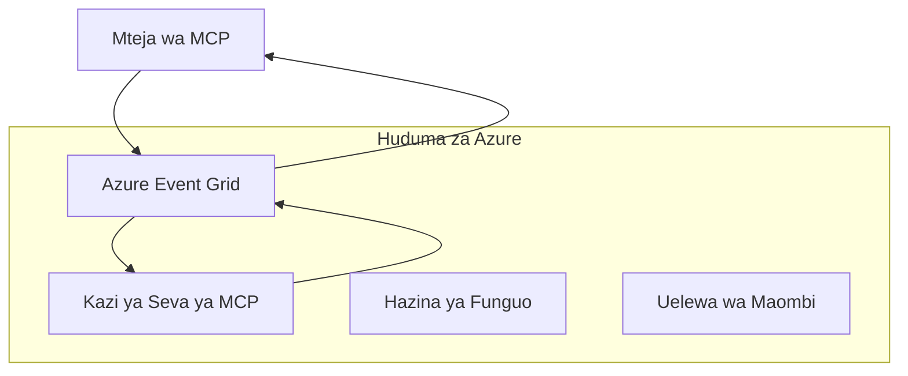
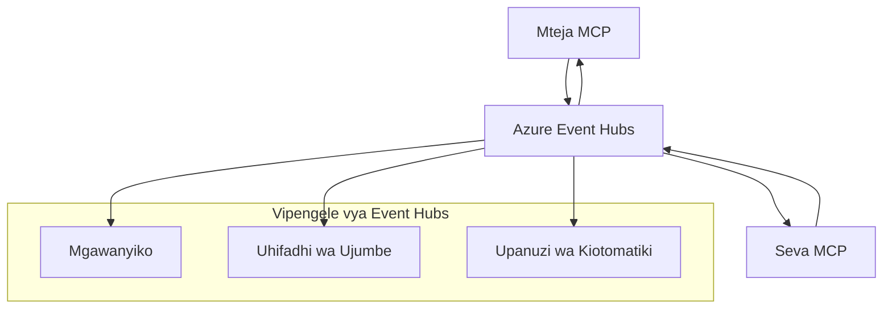

# Usafirishaji wa MCP wa Kiwango cha Juu - Mwongozo wa Utekelezaji wa Kipekee

Itifaki ya Muktadha wa Mfano (MCP) hutoa ufanisi katika mbinu za usafirishaji, kuruhusu utekelezaji wa kipekee kwa mazingira ya biashara maalum. Mwongozo huu wa hali ya juu unachunguza utekelezaji wa usafirishaji wa kawaida kwa kutumia Azure Event Grid na Azure Event Hubs kama mifano ya vitendo kwa ujenzi wa suluhisho za MCP zinazoweza kupanuliwa na asili ya wingu.

> **Kuangalia mbele:** mwongozo huu umeandikwa kwa mujibu wa **Maelezo ya MCP ya 2025-11-25**, ambapo ufuatiliaji wa vikao lazima uhifadhiwe kwa kila kikao (angalia Itifaki ya Ujumbe hapa chini). Mtoaji wa toleo la `2026-07-28` unaondoa kabisa hatua ya kikao kwenye itifaki na unahitaji vichwa vya `Mcp-Method`/`Mcp-Name` ili lango na usafirishaji wa kawaida waweze kupitisha ombi kwa ombi badala ya kwa kikao. Angalia [Mabadiliko katika MCP: Mtoaji wa Toleo la 2026-07-28](../../01-CoreConcepts/mcp-2026-07-28-release-candidate.md).

## Utangulizi

Wakati usafirishaji wa kawaida wa MCP (stdio na uondoaji wa HTTP) unahudumia matumizi mengi, mazingira ya biashara mara nyingi yanahitaji mbinu za usafirishaji maalum kwa kuimarisha upanuzi, kuaminika, na mwingiliano na miundombinu ya wingu iliyopo. Usafirishaji wa kawaida huruhusu MCP kutumia huduma za ujumbe za asili za wingu kwa mawasiliano ya kando, usanifu unaoendeshwa na matukio, na usindikaji ulioenea.

Somo hili linachunguza utekelezaji wa hali ya juu wa usafirishaji ulioanzishwa kulingana na maelezo ya hivi karibuni ya MCP (2025-11-25), huduma za ujumbe za Azure, na mifumo ya kawaida ya mwingiliano wa biashara iliyothibitishwa.

### **Usanifu wa Usafirishaji wa MCP**

**Kutoka Maelezo ya MCP (2025-11-25):**

- **Usafirishaji wa Kawaida**: stdio (inayopendekezwa), uondoaji wa HTTP (kwa hali za mbali)
- **Usafirishaji wa Kipekee**: Usafirishaji wowote unaotekeleza itifaki ya kubadilishana ujumbe ya MCP
- **Muundo wa Ujumbe**: JSON-RPC 2.0 na nyongeza maalum za MCP
- **Mawasiliano ya Pande Zote Mbili**: Mawasiliano ya duplex kamili yanahitajika kwa taarifa na majibu

## Malengo ya Kujifunza

Mwisho wa somo hili la hali ya juu, utaweza:

- **Kuelewa Mahitaji ya Usafirishaji wa Kipekee**: Tekeleza itifaki ya MCP juu ya tabaka lolote la usafirishaji huku ukihakikisha ufuataji
- **Kujenga Usafirishaji wa Azure Event Grid**: Unda seva za MCP zinazoendeshwa na matukio kwa kupanua kisasa bila seva
- **Kutekeleza Usafirishaji wa Azure Event Hubs**: Tengeneza suluhisho zenye mtiririko wa juu wa MCP kwa kutumia Azure Event Hubs kwa mtiririko wa wakati halisi
- **Kutumia Mifumo ya Biashara**: Jumuisha usafirishaji wa kawaida na miundombinu ya Azure iliyopo na mifano ya usalama
- **Kushughulikia Kuaminika kwa Usafirishaji**: Tekeleza uendelevu wa ujumbe, upangaji, na utendakazi wa makosa kwa hali za biashara
- **Kuboresha Utendaji**: Tengeneza suluhisho za usafirishaji kwa mahitaji ya upanuzi, ucheleweshaji, na mtiririko

## **Mahitaji ya Usafirishaji**

### **Mahitaji Muhimu kutoka Maelezo ya MCP (2025-11-25):**

```yaml
Message Protocol:
  format: "JSON-RPC 2.0 with MCP extensions"
  bidirectional: "Full duplex communication required"
  ordering: "Message ordering must be preserved per session"
  
Transport Layer:
  reliability: "Transport MUST handle connection failures gracefully"
  security: "Transport MUST support secure communication"
  identification: "Each session MUST have unique identifier"
  
Custom Transport:
  compliance: "MUST implement complete MCP message exchange"
  extensibility: "MAY add transport-specific features"
  interoperability: "MUST maintain protocol compatibility"
```

## **Utekelezaji wa Usafirishaji wa Azure Event Grid**

Azure Event Grid hutoa huduma ya kusambaza matukio isiyo na seva inayofaa kwa usanifu wa MCP unaoendeshwa na matukio. Utekelezaji huu unaonyesha jinsi ya kujenga mifumo ya MCP inayoweza kupanuliwa na isiyo shikamana.

### **Muhtasari wa Usanifu**



### **Utekelezaji wa C# - Usafirishaji wa Event Grid**

```csharp
using Azure.Messaging.EventGrid;
using Microsoft.Extensions.Azure;
using System.Text.Json;

public class EventGridMcpTransport : IMcpTransport
{
    private readonly EventGridPublisherClient _publisher;
    private readonly string _topicEndpoint;
    private readonly string _clientId;
    
    public EventGridMcpTransport(string topicEndpoint, string accessKey, string clientId)
    {
        _publisher = new EventGridPublisherClient(
            new Uri(topicEndpoint), 
            new AzureKeyCredential(accessKey));
        _topicEndpoint = topicEndpoint;
        _clientId = clientId;
    }
    
    public async Task SendMessageAsync(McpMessage message)
    {
        var eventGridEvent = new EventGridEvent(
            subject: $"mcp/{_clientId}",
            eventType: "MCP.MessageReceived",
            dataVersion: "1.0",
            data: JsonSerializer.Serialize(message))
        {
            Id = Guid.NewGuid().ToString(),
            EventTime = DateTimeOffset.UtcNow
        };
        
        await _publisher.SendEventAsync(eventGridEvent);
    }
    
    public async Task<McpMessage> ReceiveMessageAsync(CancellationToken cancellationToken)
    {
        // Event Grid is push-based, so implement webhook receiver
        // This would typically be handled by Azure Functions trigger
        throw new NotImplementedException("Use EventGridTrigger in Azure Functions");
    }
}

// Azure Function for receiving Event Grid events
[FunctionName("McpEventGridReceiver")]
public async Task<IActionResult> HandleEventGridMessage(
    [EventGridTrigger] EventGridEvent eventGridEvent,
    ILogger log)
{
    try
    {
        var mcpMessage = JsonSerializer.Deserialize<McpMessage>(
            eventGridEvent.Data.ToString());
        
        // Process MCP message
        var response = await _mcpServer.ProcessMessageAsync(mcpMessage);
        
        // Send response back via Event Grid
        await _transport.SendMessageAsync(response);
        
        return new OkResult();
    }
    catch (Exception ex)
    {
        log.LogError(ex, "Error processing Event Grid MCP message");
        return new BadRequestResult();
    }
}
```

### **Utekelezaji wa TypeScript - Usafirishaji wa Event Grid**

```typescript
import { EventGridPublisherClient, AzureKeyCredential } from "@azure/eventgrid";
import { McpTransport, McpMessage } from "./mcp-types";

export class EventGridMcpTransport implements McpTransport {
    private publisher: EventGridPublisherClient;
    private clientId: string;
    
    constructor(
        private topicEndpoint: string,
        private accessKey: string,
        clientId: string
    ) {
        this.publisher = new EventGridPublisherClient(
            topicEndpoint,
            new AzureKeyCredential(accessKey)
        );
        this.clientId = clientId;
    }
    
    async sendMessage(message: McpMessage): Promise<void> {
        const event = {
            id: crypto.randomUUID(),
            source: `mcp-client-${this.clientId}`,
            type: "MCP.MessageReceived",
            time: new Date(),
            data: message
        };
        
        await this.publisher.sendEvents([event]);
    }
    
    // Kupokea kunasababishwa na tukio kupitia Azure Functions
    onMessage(handler: (message: McpMessage) => Promise<void>): void {
        // Utekelezaji utatumia kuwezesha tukio la Azure Functions Event Grid
        // Huu ni wigo wa dhana kwa mpokeaji wa webhook
    }
}

// Utekelezaji wa Azure Functions
import { app, InvocationContext, EventGridEvent } from "@azure/functions";

app.eventGrid("mcpEventGridHandler", {
    handler: async (event: EventGridEvent, context: InvocationContext) => {
        try {
            const mcpMessage = event.data as McpMessage;
            
            // Chakata ujumbe wa MCP
            const response = await mcpServer.processMessage(mcpMessage);
            
            // Tuma jibu kupitia Event Grid
            await transport.sendMessage(response);
            
        } catch (error) {
            context.error("Error processing MCP message:", error);
            throw error;
        }
    }
});
```

### **Utekelezaji wa Python - Usafirishaji wa Event Grid**

```python
from azure.eventgrid import EventGridPublisherClient, EventGridEvent
from azure.core.credentials import AzureKeyCredential
import asyncio
import json
from typing import Callable, Optional
import uuid
from datetime import datetime

class EventGridMcpTransport:
    def __init__(self, topic_endpoint: str, access_key: str, client_id: str):
        self.client = EventGridPublisherClient(
            topic_endpoint, 
            AzureKeyCredential(access_key)
        )
        self.client_id = client_id
        self.message_handler: Optional[Callable] = None
    
    async def send_message(self, message: dict) -> None:
        """Send MCP message via Event Grid"""
        event = EventGridEvent(
            data=message,
            subject=f"mcp/{self.client_id}",
            event_type="MCP.MessageReceived",
            data_version="1.0"
        )
        
        await self.client.send(event)
    
    def on_message(self, handler: Callable[[dict], None]) -> None:
        """Register message handler for incoming events"""
        self.message_handler = handler

# Utekelezaji wa Azure Functions
import azure.functions as func
import logging

def main(event: func.EventGridEvent) -> None:
    """Azure Functions Event Grid trigger for MCP messages"""
    try:
        # Changanua ujumbe wa MCP kutoka tukio la Event Grid
        mcp_message = json.loads(event.get_body().decode('utf-8'))
        
        # Fanyia kazi ujumbe wa MCP
        response = process_mcp_message(mcp_message)
        
        # Tuma majibu tena kupitia Event Grid
        # (Utekelezaji utaunda mteja mpya wa Event Grid)
        
    except Exception as e:
        logging.error(f"Error processing MCP Event Grid message: {e}")
        raise
```

## **Utekelezaji wa Usafirishaji wa Azure Event Hubs**

Azure Event Hubs hutoa uwezo wa mtiririko mkubwa wa wakati halisi kwa hali za MCP zinazohitaji ucheleweshaji mdogo na kiasi kikubwa cha ujumbe.

### **Muhtasari wa Usanifu**



### **Utekelezaji wa C# - Usafirishaji wa Event Hubs**

```csharp
using Azure.Messaging.EventHubs;
using Azure.Messaging.EventHubs.Producer;
using Azure.Messaging.EventHubs.Consumer;
using System.Text;

public class EventHubsMcpTransport : IMcpTransport, IDisposable
{
    private readonly EventHubProducerClient _producer;
    private readonly EventHubConsumerClient _consumer;
    private readonly string _consumerGroup;
    private readonly CancellationTokenSource _cancellationTokenSource;
    
    public EventHubsMcpTransport(
        string connectionString, 
        string eventHubName,
        string consumerGroup = "$Default")
    {
        _producer = new EventHubProducerClient(connectionString, eventHubName);
        _consumer = new EventHubConsumerClient(
            consumerGroup, 
            connectionString, 
            eventHubName);
        _consumerGroup = consumerGroup;
        _cancellationTokenSource = new CancellationTokenSource();
    }
    
    public async Task SendMessageAsync(McpMessage message)
    {
        var messageBody = JsonSerializer.Serialize(message);
        var eventData = new EventData(Encoding.UTF8.GetBytes(messageBody));
        
        // Add MCP-specific properties
        eventData.Properties.Add("MessageType", message.Method ?? "response");
        eventData.Properties.Add("MessageId", message.Id);
        eventData.Properties.Add("Timestamp", DateTimeOffset.UtcNow);
        
        await _producer.SendAsync(new[] { eventData });
    }
    
    public async Task StartReceivingAsync(
        Func<McpMessage, Task> messageHandler)
    {
        await foreach (PartitionEvent partitionEvent in _consumer.ReadEventsAsync(
            _cancellationTokenSource.Token))
        {
            try
            {
                var messageBody = Encoding.UTF8.GetString(
                    partitionEvent.Data.EventBody.ToArray());
                var mcpMessage = JsonSerializer.Deserialize<McpMessage>(messageBody);
                
                await messageHandler(mcpMessage);
            }
            catch (Exception ex)
            {
                // Handle deserialization or processing errors
                Console.WriteLine($"Error processing message: {ex.Message}");
            }
        }
    }
    
    public void Dispose()
    {
        _cancellationTokenSource?.Cancel();
        _producer?.DisposeAsync().AsTask().Wait();
        _consumer?.DisposeAsync().AsTask().Wait();
        _cancellationTokenSource?.Dispose();
    }
}
```

### **Utekelezaji wa TypeScript - Usafirishaji wa Event Hubs**

```typescript
import { 
    EventHubProducerClient, 
    EventHubConsumerClient, 
    EventData 
} from "@azure/event-hubs";

export class EventHubsMcpTransport implements McpTransport {
    private producer: EventHubProducerClient;
    private consumer: EventHubConsumerClient;
    private isReceiving = false;
    
    constructor(
        private connectionString: string,
        private eventHubName: string,
        private consumerGroup: string = "$Default"
    ) {
        this.producer = new EventHubProducerClient(
            connectionString, 
            eventHubName
        );
        this.consumer = new EventHubConsumerClient(
            consumerGroup,
            connectionString,
            eventHubName
        );
    }
    
    async sendMessage(message: McpMessage): Promise<void> {
        const eventData: EventData = {
            body: JSON.stringify(message),
            properties: {
                messageType: message.method || "response",
                messageId: message.id,
                timestamp: new Date().toISOString()
            }
        };
        
        await this.producer.sendBatch([eventData]);
    }
    
    async startReceiving(
        messageHandler: (message: McpMessage) => Promise<void>
    ): Promise<void> {
        if (this.isReceiving) return;
        
        this.isReceiving = true;
        
        const subscription = this.consumer.subscribe({
            processEvents: async (events, context) => {
                for (const event of events) {
                    try {
                        const messageBody = event.body as string;
                        const mcpMessage: McpMessage = JSON.parse(messageBody);
                        
                        await messageHandler(mcpMessage);
                        
                        // Sasisha alama ya uhifadhi kwa usambazaji wa angalau mara moja
                        await context.updateCheckpoint(event);
                    } catch (error) {
                        console.error("Error processing Event Hubs message:", error);
                    }
                }
            },
            processError: async (err, context) => {
                console.error("Event Hubs error:", err);
            }
        });
    }
    
    async close(): Promise<void> {
        this.isReceiving = false;
        await this.producer.close();
        await this.consumer.close();
    }
}
```

### **Utekelezaji wa Python - Usafirishaji wa Event Hubs**

```python
from azure.eventhub import EventHubProducerClient, EventHubConsumerClient
from azure.eventhub import EventData
import json
import asyncio
from typing import Callable, Dict, Any
import logging

class EventHubsMcpTransport:
    def __init__(
        self, 
        connection_string: str, 
        eventhub_name: str,
        consumer_group: str = "$Default"
    ):
        self.producer = EventHubProducerClient.from_connection_string(
            connection_string, 
            eventhub_name=eventhub_name
        )
        self.consumer = EventHubConsumerClient.from_connection_string(
            connection_string,
            consumer_group=consumer_group,
            eventhub_name=eventhub_name
        )
        self.is_receiving = False
    
    async def send_message(self, message: Dict[str, Any]) -> None:
        """Send MCP message via Event Hubs"""
        event_data = EventData(json.dumps(message))
        
        # Ongeza mali maalum za MCP
        event_data.properties = {
            "messageType": message.get("method", "response"),
            "messageId": message.get("id"),
            "timestamp": "2025-01-14T10:30:00Z"  # Tumia wakati halisi wa alama
        }
        
        async with self.producer:
            event_data_batch = await self.producer.create_batch()
            event_data_batch.add(event_data)
            await self.producer.send_batch(event_data_batch)
    
    async def start_receiving(
        self, 
        message_handler: Callable[[Dict[str, Any]], None]
    ) -> None:
        """Start receiving MCP messages from Event Hubs"""
        if self.is_receiving:
            return
        
        self.is_receiving = True
        
        async with self.consumer:
            await self.consumer.receive(
                on_event=self._on_event_received(message_handler),
                starting_position="-1"  # Anza kutoka mwanzo
            )
    
    def _on_event_received(self, handler: Callable):
        """Internal event handler wrapper"""
        async def handle_event(partition_context, event):
            try:
                # Tafsiri ujumbe wa MCP kutoka kwenye tukio la Event Hubs
                message_body = event.body_as_str(encoding='UTF-8')
                mcp_message = json.loads(message_body)
                
                # Fanya mchakato wa ujumbe wa MCP
                await handler(mcp_message)
                
                # Sasisha alama ya ukaguzi kwa usambazaji wa angalau mara moja
                await partition_context.update_checkpoint(event)
                
            except Exception as e:
                logging.error(f"Error processing Event Hubs message: {e}")
        
        return handle_event
    
    async def close(self) -> None:
        """Clean up transport resources"""
        self.is_receiving = False
        await self.producer.close()
        await self.consumer.close()
```

## **Mifano ya Usafirishaji wa Kiwango cha Juu**

### **Uendelevu na Kuaminika kwa Ujumbe**

```csharp
// Implementing message durability with retry logic
public class ReliableTransportWrapper : IMcpTransport
{
    private readonly IMcpTransport _innerTransport;
    private readonly RetryPolicy _retryPolicy;
    
    public async Task SendMessageAsync(McpMessage message)
    {
        await _retryPolicy.ExecuteAsync(async () =>
        {
            try
            {
                await _innerTransport.SendMessageAsync(message);
            }
            catch (TransportException ex) when (ex.IsRetryable)
            {
                // Log and retry
                throw;
            }
        });
    }
}
```

### **Ushirikiano wa Usalama wa Usafirishaji**

```csharp
// Integrating Azure Key Vault for transport security
public class SecureTransportFactory
{
    private readonly SecretClient _keyVaultClient;
    
    public async Task<IMcpTransport> CreateEventGridTransportAsync()
    {
        var accessKey = await _keyVaultClient.GetSecretAsync("EventGridAccessKey");
        var topicEndpoint = await _keyVaultClient.GetSecretAsync("EventGridTopic");
        
        return new EventGridMcpTransport(
            topicEndpoint.Value.Value,
            accessKey.Value.Value,
            Environment.MachineName
        );
    }
}
```

### **Ufuatiliaji na Uwezekano wa Usafirishaji**

```csharp
// Adding telemetry to custom transports
public class ObservableTransport : IMcpTransport
{
    private readonly IMcpTransport _transport;
    private readonly ILogger _logger;
    private readonly TelemetryClient _telemetryClient;
    
    public async Task SendMessageAsync(McpMessage message)
    {
        using var activity = Activity.StartActivity("MCP.Transport.Send");
        activity?.SetTag("transport.type", "EventGrid");
        activity?.SetTag("message.method", message.Method);
        
        var stopwatch = Stopwatch.StartNew();
        
        try
        {
            await _transport.SendMessageAsync(message);
            
            _telemetryClient.TrackDependency(
                "EventGrid",
                "SendMessage",
                DateTime.UtcNow.Subtract(stopwatch.Elapsed),
                stopwatch.Elapsed,
                true
            );
        }
        catch (Exception ex)
        {
            _telemetryClient.TrackException(ex);
            throw;
        }
    }
}
```

## **Mazingira ya Muungano wa Biashara**

### **Mazingira 1: Usindikaji Uliosambazwa wa MCP**

Kutumia Azure Event Grid kwa kusambaza maombi ya MCP kupitia nodi nyingi za usindikaji:

```yaml
Architecture:
  - MCP Client sends requests to Event Grid topic
  - Multiple Azure Functions subscribe to process different tool types
  - Results aggregated and returned via separate response topic
  
Benefits:
  - Horizontal scaling based on message volume
  - Fault tolerance through redundant processors
  - Cost optimization with serverless compute
```

### **Mazingira 2: Mtiririko wa Wakati Halisi wa MCP**

Kutumia Azure Event Hubs kwa mwingiliano wa juu wa MCP:

```yaml
Architecture:
  - MCP Client streams continuous requests via Event Hubs
  - Stream Analytics processes and routes messages
  - Multiple consumers handle different aspect of processing
  
Benefits:
  - Low latency for real-time scenarios
  - High throughput for batch processing
  - Built-in partitioning for parallel processing
```

### **Mazingira 3: Usanifu Mchanganyiko wa Usafirishaji**

Kuchanganya usafirishaji mbalimbali kwa matumizi tofauti:

```csharp
public class HybridMcpTransport : IMcpTransport
{
    private readonly IMcpTransport _realtimeTransport; // Event Hubs
    private readonly IMcpTransport _batchTransport;    // Event Grid
    private readonly IMcpTransport _fallbackTransport; // HTTP Streaming
    
    public async Task SendMessageAsync(McpMessage message)
    {
        // Route based on message characteristics
        var transport = message.Method switch
        {
            "tools/call" when IsRealtime(message) => _realtimeTransport,
            "resources/read" when IsBatch(message) => _batchTransport,
            _ => _fallbackTransport
        };
        
        await transport.SendMessageAsync(message);
    }
}
```

## **Kuboresha Utendaji**

### **Kukusanya Ujumbe kwa Event Grid**

```csharp
public class BatchingEventGridTransport : IMcpTransport
{
    private readonly List<McpMessage> _messageBuffer = new();
    private readonly Timer _flushTimer;
    private const int MaxBatchSize = 100;
    
    public async Task SendMessageAsync(McpMessage message)
    {
        lock (_messageBuffer)
        {
            _messageBuffer.Add(message);
            
            if (_messageBuffer.Count >= MaxBatchSize)
            {
                _ = Task.Run(FlushMessages);
            }
        }
    }
    
    private async Task FlushMessages()
    {
        List<McpMessage> toSend;
        lock (_messageBuffer)
        {
            toSend = new List<McpMessage>(_messageBuffer);
            _messageBuffer.Clear();
        }
        
        if (toSend.Any())
        {
            var events = toSend.Select(CreateEventGridEvent);
            await _publisher.SendEventsAsync(events);
        }
    }
}
```

### **Mbinu ya Ugawaji kwa Event Hubs**

```csharp
public class PartitionedEventHubsTransport : IMcpTransport
{
    public async Task SendMessageAsync(McpMessage message)
    {
        // Partition by client ID for session affinity
        var partitionKey = ExtractClientId(message);
        
        var eventData = new EventData(JsonSerializer.SerializeToUtf8Bytes(message))
        {
            PartitionKey = partitionKey
        };
        
        await _producer.SendAsync(new[] { eventData });
    }
}
```

## **Kujaribu Usafirishaji wa Kipekee**

### **Kujaribu Vitengo kwa Vitendo**

```csharp
[Test]
public async Task EventGridTransport_SendMessage_PublishesCorrectEvent()
{
    // Arrange
    var mockPublisher = new Mock<EventGridPublisherClient>();
    var transport = new EventGridMcpTransport(mockPublisher.Object);
    var message = new McpMessage { Method = "tools/list", Id = "test-123" };
    
    // Act
    await transport.SendMessageAsync(message);
    
    // Assert
    mockPublisher.Verify(
        x => x.SendEventAsync(
            It.Is<EventGridEvent>(e => 
                e.EventType == "MCP.MessageReceived" &&
                e.Subject == "mcp/test-client"
            )
        ),
        Times.Once
    );
}
```

### **Kujaribu Muungano kwa Kontena za Jaribio za Azure**

```csharp
[Test]
public async Task EventHubsTransport_IntegrationTest()
{
    // Using Testcontainers for integration testing
    var eventHubsContainer = new EventHubsContainer()
        .WithEventHub("test-hub");
    
    await eventHubsContainer.StartAsync();
    
    var transport = new EventHubsMcpTransport(
        eventHubsContainer.GetConnectionString(),
        "test-hub"
    );
    
    // Test message round-trip
    var sentMessage = new McpMessage { Method = "test", Id = "123" };
    McpMessage receivedMessage = null;
    
    await transport.StartReceivingAsync(msg => {
        receivedMessage = msg;
        return Task.CompletedTask;
    });
    
    await transport.SendMessageAsync(sentMessage);
    await Task.Delay(1000); // Allow for message processing
    
    Assert.That(receivedMessage?.Id, Is.EqualTo("123"));
}
```

## **Mbinu Bora na Miongozo**

### **Misingi ya Ubunifu wa Usafirishaji**

1. **Utiririshaji Sawa**: Hakikisha usindikaji wa ujumbe ni sawa kuzuia nakala
2. **Utendakazi wa Makosa**: Tekeleza utendakazi kamili wa makosa na foleni za barua kuu
3. **Ufuatiliaji**: Ongeza telemetri ya kina na ukaguzi wa afya
4. **Usalama**: Tumia utambulisho uliofadhiliwa na upatikanaji wa hadhi ya chini kabisa
5. **Utendaji**: Tengeneza kwa mahitaji yako maalum ya ucheleweshaji na mtiririko

### **Mapendekezo Maalum ya Azure**

1. **Tumia Utambulisho Uliodhibitiwa**: Epuka mistari ya muunganisho katika uzalishaji
2. **Tekeleza Vipunguza Mizunguko**: Linda dhidi ya kutofaulu kwa huduma za Azure
3. **Fuatilia Gharama**: Rekebisha kiasi cha ujumbe na gharama za usindikaji
4. **Panga Upanuzi**: Tengeneza mbinu za ugawaji na upanuzi mapema
5. **Jaribu kwa Kina**: Tumia Azure DevTest Labs kwa majaribio kamili

## **Hitimisho**

Usafirishaji wa kawaida wa MCP huruhusu hali za biashara zenye nguvu kwa kutumia huduma za ujumbe za Azure. Kwa kutekeleza usafirishaji wa Event Grid au Event Hubs, unaweza kujenga suluhisho za MCP zinazoweza kupanuliwa, kuaminika, na zinaunganishwa kwa urahisi na miundombinu ya Azure iliyopo.

Mifano iliyotolewa inaonyesha mifumo inayotumika katika uzalishaji kwa utekelezaji wa usafirishaji wa kawaida huku ikidumisha ufuataji wa itifaki ya MCP na mbinu bora za Azure.

## **Rasilimali Zaidi**

- [Maelezo ya MCP 2025-11-25](https://modelcontextprotocol.io/specification/2025-11-25/)
- [Nyaraka za Azure Event Grid](https://docs.microsoft.com/azure/event-grid/)
- [Nyaraka za Azure Event Hubs](https://docs.microsoft.com/azure/event-hubs/)
- [Azure Functions Event Grid Trigger](https://docs.microsoft.com/azure/azure-functions/functions-bindings-event-grid)
- [Azure SDK kwa .NET](https://github.com/Azure/azure-sdk-for-net)
- [Azure SDK kwa TypeScript](https://github.com/Azure/azure-sdk-for-js)
- [Azure SDK kwa Python](https://github.com/Azure/azure-sdk-for-python)

---

> *Mwongozo huu unazingatia mifano ya utekelezaji wa vitendo kwa mifumo ya MCP ya uzalishaji. Daima hakikisha utekelezaji wa usafirishaji unakidhi mahitaji yako maalum na mipaka ya huduma za Azure.*
> **Kawaida ya Sasa**: Mwongozo huu unaakisi mahitaji ya usafirishaji na mifano ya hali ya juu ya MCP kutoka [Maelezo ya MCP 2025-11-25](https://modelcontextprotocol.io/specification/2025-11-25/) kwa mazingira ya biashara.


## Nini Kifuatacho
- [6. Michango ya Jamii](../../06-CommunityContributions/README.md)

---

<!-- CO-OP TRANSLATOR DISCLAIMER START -->
**Kionyozo**:
Hati hii imetafsiriwa kwa kutumia huduma ya tafsiri ya AI [Co-op Translator](https://github.com/Azure/co-op-translator). Ingawa tunajitahidi kupata usahihi, tafadhali fahamu kwamba tafsiri za kiotomatiki zinaweza kuwa na makosa au upungufu wa usahihi. Hati ya asili katika lugha yake halisi inapaswa kuchukuliwa kama chanzo cha mamlaka. Kwa taarifa muhimu, tafsiri ya kitaalamu inayofanywa na binadamu inapendekezwa. Hatutojibu kwa kuelewa vibaya au tafsiri potofu zinazotokea kutokana na matumizi ya tafsiri hii.
<!-- CO-OP TRANSLATOR DISCLAIMER END -->