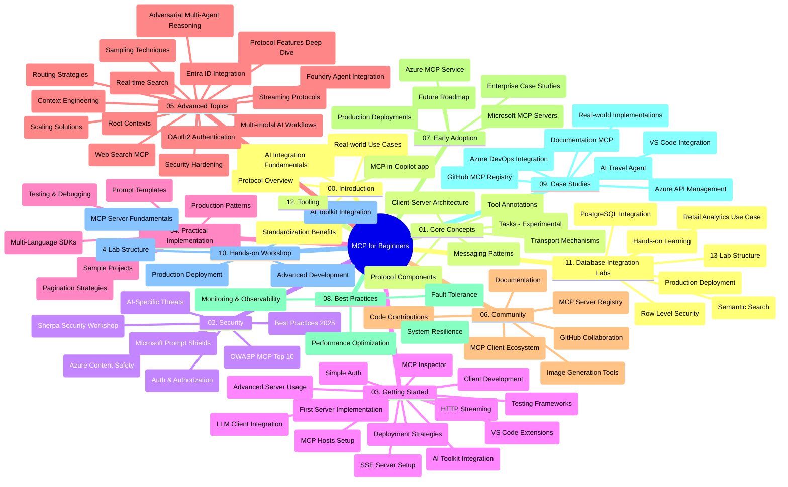

# Itifaki ya Muktadha wa Mfano (MCP) kwa Waanzilishi - Mwongozo wa Kusoma

Mwongozo huu wa kusoma unatoa muhtasari wa muundo na yaliyomo kwenye ghala la kumbukumbu kwa mtaala wa "Itifaki ya Muktadha wa Mfano (MCP) kwa Waanzilishi". Tumia mwongozo huu kuongozwa ghala la kumbukumbu kwa ufanisi na kuepuka matumizi bora ya rasilimali zilizopo.

## Muhtasari wa Ghala la Kumbukumbu

Itifaki ya Muktadha wa Mfano (MCP) ni mfumo uliosanifiwa kwa maingiliano kati ya mifano ya AI na programu za mteja. Ilianzishwa awali na Anthropic, MCP sasa inadhibitiwa na jamii pana ya MCP kupitia shirika rasmi la GitHub. Ghala hili la kumbukumbu linatoa mtaala kamili wenye mifano ya vitendo ya nambari katika C#, Java, JavaScript, Python, na TypeScript, iliyoundwa kwa waendelezaji wa AI, wahandisi wa mifumo, na wahandisi wa programu.

## Ramani ya Mtaala ya Kuonekanwa

## Muundo wa Ghala la Kumbukumbu

Ghala la kumbukumbu limegawanywa katika sehemu kumi na mbili kuu, kila moja ikiangazia nyanja tofauti za MCP:

1. **Utangulizi (00-Introduction/)**
   - Muhtasari wa Itifaki ya Muktadha wa Mfano
   - Kwa nini uimara wa viwango ni muhimu katika mizunguko ya AI
   - Matumizi halisi na faida zake

2. **Madharia Msingi (01-CoreConcepts/)**
   - Miundo ya mteja-server
   - Vipengele muhimu vya itifaki
   - Mifumo ya ujumbe katika MCP
   - Kuangalia mbele: [Nini Kinabadilika MCP: Mgombea Toleo la 2026-07-28](./01-CoreConcepts/mcp-2026-07-28-release-candidate.md) — msingi wa itifaki isiyo na hali (stateless), mfumo wa Nyongeza, na matatizo yanayotarajiwa ya Kuondolewa kwa Mizizi/Kuchagua/Kuandika katika toleo lijalo la sifa

3. **Usalama (02-Security/)**
   - Vitisho vya usalama katika mifumo inayotumia MCP
   - Mbinu bora za kuhakikisha usalama wa utekelezaji
   - Mikakati ya uthibitishaji na idhini
   - **Nyaraka Kamili za Usalama**:
     - Mbinu Bora za Usalama MCP 2025
     - Mwongozo wa Utekelezaji wa Usalama wa Azure Content Safety
     - Udhibiti na Mbinu za Usalama MCP
     - Marejeleo ya Haraka ya Mbinu Bora MCP
   - **Mada Muhimu za Usalama**:
     - Kujaza haraka (prompt injection) na mashambulio ya sumu katika zana
     - Misuari ya vikao na matatizo ya mhasibu mchanganyiko
     - Udhaifu wa kupitia tokeni
     - Ruhusa nyingi mno na udhibiti wa upatikanaji
     - Usalama wa mnyororo wa ugavi kwa vipengele vya AI
     - Msaada wa kuunganisha Microsoft Prompt Shields

4. **Kuanza (03-GettingStarted/)**
   - Kuandaa mazingira na usanidi
   - Kuunda seva na wateja wa MCP wa msingi
   - Kuunganishwa na programu zilizopo
   - Inajumuisha sehemu za:
     - Utekelezaji wa seva ya kwanza
     - Maendeleo ya mteja
     - Uunganisho wa mteja wa LLM
     - Uunganisho wa VS Code
     - Seva ya Matukio yanayotumwa (SSE)
     - Matumizi ya seva ya hali ya juu
     - Kupelekwa kwa data kwa kutumia HTTP streaming
     - Uunganisho wa AI Toolkit
     - Mikakati ya upimaji
     - Mwongozo wa usambazaji

5. **Utekelezaji wa Vitendo (04-PracticalImplementation/)**
   - Matumizi ya SDK katika lugha mbalimbali za programu
   - Mbinu za debugging, upimaji, na uthibitishaji
   - Kuunda templeti za haraka zinazotumika tena na mtiririko wa kazi
   - Miradi ya mfano yenye mifano ya utekelezaji

6. **Mada za Juu (05-AdvancedTopics/)**
   - Mbinu za uhandisi wa muktadha
   - Uunganisho wa wakala wa Foundry
   - Mtaratibu ya AI wa aina nyingi (multi-modal)
   - Maonyesho ya uthibitishaji wa OAuth2
   - Uwezo wa utafutaji wa wakati halisi
   - Utoaji wa data wa wakati halisi (real-time streaming)
   - Utekelezaji wa muktadha wa mizizi
   - Mikakati ya uelekezaji
   - Mbinu za kuchagua sampuli
   - Mbinu za kupanua ukubwa
   - Mazingatio ya usalama
   - Uunganisho wa usalama wa Entra ID
   - Uunganisho wa utafutaji wa wavuti
   - Uelewa wa wakala wengi wenye mashindano (mifumo ya mabishano)

7. **Michango ya Jamii (06-CommunityContributions/)**
   - Jinsi ya kuchangia nambari na nyaraka
   - Kushirikiana kupitia GitHub
   - Maboresho ya jamii na mrejesho
   - Matumizi ya wateja wa MCP mbalimbali (Claude Desktop, Cline, VSCode)
   - Kufanya kazi na seva maarufu za MCP ikiwa ni pamoja na uzalishaji wa picha

8. **Mafunzo kutoka kwa Waanzishaji wa Mapema (07-LessonsfromEarlyAdoption/)**
   - Utekelezaji halisi na hadithi za mafanikio
   - Kujenga na kusambaza suluhisho za MCP
   - Mwelekeo na ramani ya njia ya baadaye
   - **Mwongozo wa Seva za Microsoft MCP**: Mwongozo kamili wa seva 10 za MCP za uzalishaji wa Microsoft zikiwemo:
     - Seva ya Microsoft Learn Docs MCP
     - Seva ya Azure MCP (viunganishi maalum 15+)
     - Seva ya GitHub MCP
     - Seva ya Azure DevOps MCP
     - Seva ya MarkItDown MCP
     - Seva ya SQL Server MCP
     - Seva ya Playwright MCP
     - Seva ya Dev Box MCP
     - Seva ya Microsoft Foundry MCP
     - Seva ya Microsoft 365 Agents Toolkit MCP

9. **Mbinu Bora (08-BestPractices/)**
   - Urekebishaji wa utendaji na uboreshaji
   - Ubunifu wa mifumo ya MCP isiyovunjika
   - Mikakati ya upimaji na ustahimilivu

10. **Masomo ya Kesi (09-CaseStudy/)**
    - **Masomo saba kamili ya kesi** yanaonyesha ufanisi wa MCP katika muktadha mbalimbali:
    - **Wakala wa Kusafiri wa Azure AI**: Uratibu wa wakala wengi kwa kutumia Azure OpenAI na AI Search
    - **Uunganisho wa Azure DevOps**: Uendeshaji wa mchakato wa mtiririko wa kazi kwa masasisho ya data ya YouTube
    - **Urejeshaji wa Hati za Wakati Halisi**: Mteja wa console wa Python na uambajaji wa HTTP
    - **Kizalishaji cha Mpango wa Kujifunza wa Kushirikiana**: Tovuti ya Chainlit yenye AI ya mazungumzo
    - **Nyaraka Ndani ya Mhariri (In-Editor)**: Uunganisho wa VS Code na mchakato wa GitHub Copilot
    - **Usimamizi wa API wa Azure**: Uunganisho wa API wa taasisi na uundaji wa seva ya MCP
    - **Sajili ya MCP ya GitHub**: Maendeleo ya mazingira na jukwaa la uunganisho wa wakala
    - Mifano ya utekelezaji inahusisha uunganisho wa taasisi, uzalishaji wa mtaalam na maendeleo ya mazingira

11. **Warsha ya Vitendo (10-StreamliningAIWorkflowsBuildingAnMCPServerWithAIToolkit/)**
    - Warsha ya vitendo ya kina inayochanganya MCP na AI Toolkit
    - Kuunda programu mahiri zinazounganisha mifano ya AI na zana halisi duniani
    - Moduli za vitendo zinazojumuisha msingi, maendeleo ya seva maalum, na mikakati ya usambazaji wa uzalishaji
    - **Muundo wa Maabara**:
      - Maabara 1: Misingi ya Seva ya MCP
      - Maabara 2: Maendeleo ya Seva ya MCP ya Juu
      - Maabara 3: Uunganisho wa AI Toolkit
      - Maabara 4: Usambazaji wa Uzalishaji na Panua
    - Njia ya kujifunza kwa maabara kwa maelekezo ya hatua kwa hatua

12. **Maabara za Uunganisho wa Hifadhidata za Seva ya MCP (11-MCPServerHandsOnLabs/)**
    - **Njia ya kujifunza yenye maabara 13 kamili** kwa uundaji wa seva za MCP za uzalishaji zenye uunganisho wa PostgreSQL
    - **Utekelezaji wa uchambuzi wa rejareja wa ulimwengu wa kweli** kwa kutumia kesi ya matumizi ya Zava Retail
    - **Mifumo ya kiwango cha taasisi** ikijumuisha Usalama wa Ngazi ya Safu (RLS), utafutaji wa semantic, na upatikanaji wa data kwa wapangaji wengi
    - **Muundo Kamili wa Maabara**:
      - **Maabara 00-03: Misingi** - Utangulizi, Miundo, Usalama, Usanidi wa Mazingira
      - **Maabara 04-06: Ujenzi wa Seva ya MCP** - Ubunifu wa Hifadhidata, Utekelezaji wa Seva ya MCP, Maendeleo ya Zana
      - **Maabara 07-09: Vipengele vya Juu** - Utafutaji wa Semantic, Upimaji & Debugging, Uunganisho wa VS Code
      - **Maabara 10-12: Uzalishaji & Mbinu Bora** - Usambazaji, Ufuatiliaji, Uboreshaji
    - **Teknolojia Zilizofunikwa**: Mfumo wa FastMCP, PostgreSQL, Azure OpenAI, Azure Container Apps, Application Insights
    - **Matokeo ya Kujifunza**: Seva za MCP za uzalishaji, mifumo ya uunganisho hifadhidata, uchambuzi unaoendeshwa na AI, usalama wa taasisi

13. **Zana (12-tooling/)**
    - Jifunze jinsi ya kutumia MCP katika programu ya Copilot na zana nyingine

## Rasilimali Zaidi

Ghala la kumbukumbu lina rasilimali za msaada:

- **Folda ya Picha**: Ina michoro na vielelezo vinavyotumiwa katika mtaala mzima
- **Tafsiri**: Msaada wa lugha nyingi na tafsiri za moja kwa moja za nyaraka
- **Rasilimali Rasmi za MCP**:
  - [Nyaraka za MCP](https://modelcontextprotocol.io/)
  - [Sifa za MCP](https://spec.modelcontextprotocol.io/)
  - [Ghala la MCP GitHub](https://github.com/modelcontextprotocol)

## Jinsi ya Kutumia Ghala Hili

1. **Mafunzo Mfululizo**: Fuata sura kwa sura kwa mpangilio (00 hadi 11) kwa uzoefu wa kujifunza uliopangwa.
2. **Mkazo wa Lugha Mahususi**: Ikiwa unavutiwa na lugha fulani ya programu, chunguza folda za mifano kwa utekelezaji katika lugha unayopendelea.
3. **Utekelezaji wa Vitendo**: Anza na sehemu ya "Kuanza" ili kuandaa mazingira yako na kuunda seva na mteja wako wa MCP wa kwanza.
4. **Uchunguzi wa Juu**: Pindi unapojua msingi, ingia katika mada za juu ili kupanua maarifa yako.
5. **Ushiriki wa Jamii**: Jiunge na jamii ya MCP kupitia mijadala ya GitHub na chaneli za Discord kuwasiliana na wataalamu na waendelezaji wenzako.

## Wateja na Zana za MCP

Mtaala unahusisha wateja na zana mbalimbali za MCP:

1. **Wateja Rasmi**:
   - Visual Studio Code 
   - MCP katika Visual Studio Code
   - Claude Desktop
   - Claude katika VSCode 
   - Claude API

2. **Wateja wa Jamii**:
   - Cline (inayotumia terminal)
   - Cursor (mhariri wa nambari)
   - ChatMCP
   - Windsurf

3. **Zana za Usimamizi wa MCP**:
   - MCP CLI
   - Meneja wa MCP
   - MCP Linker
   - MCP Router

## Seva Maarufu za MCP

Ghala la kumbukumbu linaleta seva mbalimbali za MCP, zikiwemo:

1. **Seva Rasmi za Microsoft MCP**:
   - Seva ya Microsoft Learn Docs MCP
   - Seva ya Azure MCP (viunganishi maalum 15+)
   - Seva ya GitHub MCP
   - Seva ya Azure DevOps MCP
   - Seva ya MarkItDown MCP
   - Seva ya SQL Server MCP
   - Seva ya Playwright MCP
   - Seva ya Dev Box MCP
   - Seva ya Microsoft Foundry MCP
   - Seva ya Microsoft 365 Agents Toolkit MCP

2. **Seva za Marejeleo Rasmi**:
   - Filesystem
   - Fetch
   - Memory
   - Sequential Thinking

3. **Uzalishaji wa Picha**:
   - Azure OpenAI DALL-E 3
   - Stable Diffusion WebUI
   - Replicate

4. **Zana za Maendeleo**:
   - Git MCP
   - Udhibiti wa Terminal
   - Msaidizi wa Nambari

5. **Seva Maalum**:
   - Salesforce
   - Microsoft Teams
   - Jira & Confluence

## Kuchangia

Ghala la kumbukumbu linakaribisha michango kutoka jamii. Angalia sehemu ya Michango ya Jamii kwa mwongozo wa jinsi ya kuchangia kiafya kwa mfumo wa MCP.

----

*Mwongozo huu wa kusoma ulisasishwa mwisho tarehe 5 Februari 2026, ukionyesha toleo jipya la MCP Specification ya 2025-11-25 na unatoa muhtasari wa ghala la kumbukumbu hadi tarehe hiyo. Yaliyomo ghala yanaweza kusasishwa baada ya tarehe hii.*

*Ongeza (2 Julai, 2026): somo juu ya Mgombea Toleo la MCP Specification `2026-07-28` limeongezwa chini ya [01-CoreConcepts](./01-CoreConcepts/mcp-2026-07-28-release-candidate.md); mstari wa msingi wa mtaala unabaki kuwa 2025-11-25 hadi sifa mpya itakapotolewa.*

---

<!-- CO-OP TRANSLATOR DISCLAIMER START -->
**Kionyozo**:
Hati hii imetafsiriwa kwa kutumia huduma ya tafsiri ya AI [Co-op Translator](https://github.com/Azure/co-op-translator). Ingawa tunajitahidi kupata usahihi, tafadhali fahamu kwamba tafsiri za kiotomatiki zinaweza kuwa na makosa au upungufu wa usahihi. Hati ya asili katika lugha yake halisi inapaswa kuchukuliwa kama chanzo cha mamlaka. Kwa taarifa muhimu, tafsiri ya kitaalamu inayofanywa na binadamu inapendekezwa. Hatutojibu kwa kuelewa vibaya au tafsiri potofu zinazotokea kutokana na matumizi ya tafsiri hii.
<!-- CO-OP TRANSLATOR DISCLAIMER END -->