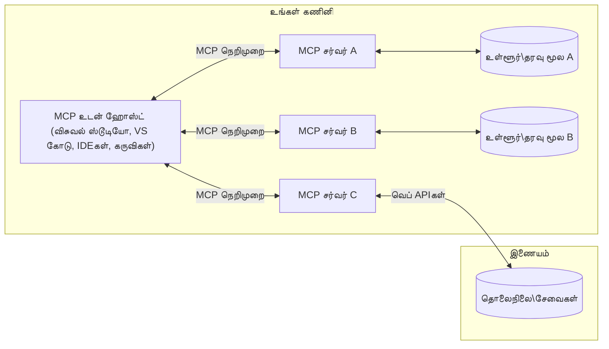

# MCP Core Concepts: AI ஒருங்கிணைக்கான மாதிரிக் கோட்பாட்டை கையாளுதல்

[](https://youtu.be/earDzWGtE84)

_(இந்த பாடத்தின் காணொளியை دیکھ பதிலாக படத்தின் மீது கிளிக் செய்யவும்)_

[Model Context Protocol (MCP)](https://github.com/modelcontextprotocol) என்பது பெரிய மொழி மாதிரிகள் (LLMs) மற்றும் வெளிப்புற கருவிகள், செயலிகள், தரவுத் தொகுதிகளுக்கு இடையேயான தொடர்பை மேம்படுத்தும் சக்திவாய்ந்த, தரநிலைப்படுத்தப்பட்ட அமைப்பு ஆகும்.  
இந்த வழிகாட்டி MCP இன் முக்கியக் கருத்துக்களை உங்களுக்கு விளக்குகிறது. இது அதன் கிளையன்ட்-செர்வர் معماري, அடிப்படை கூறுகள், தொடர்பு முறைகள் மற்றும் நடைமுறை சிறந்த முறைகள் பற்றி அறிய உதவும்.

- **தெளிவான பயனர் அனுமதி**: அனைத்து தரவு அணுகலும் மற்றும் செயல்பாடுகளும் செயற்படுத்துவதற்கு முன் தெளிவான பயனர் அனுமதியை தேவைப்படுத்துகிறது. பயனர்கள் எந்த தரவு அணுகப்படும் மற்றும் எந்த செயல்பாடுகள் நடக்கும் என்பதைக் கொண்டிருக்கும் நுணுக்கமான அனுமதிகளை தெளிவாக புரிந்துகொள்ள வேண்டும்.  

- **தரவு தனியுரிமை பாதுகாப்பு**: பயனர் தரவு தெளிவான அனுமதியுடன் மட்டுமே வெளிப்படுத்தப்படுகிறது மற்றும் முழுமையான தொடர்பு வளாகத்தில் வலுவான அணுகல் கட்டுப்பாடுகளால் பாதுகாக்கப்பட வேண்டும். செயலாக்கங்கள் அனுமதி இல்லாத தரவு பரிமாற்றத்தை தடுக்கும் மற்றும் கடுமையான தனியுரிமை எல்லைகளை பராமரிக்க வேண்டும்.

- **கருவி செயல்பாடு பாதுகாப்பு**: ஒவ்வொரு கருவி அழைப்பும் கருவியின் செயல்பாடு, அளவுருக்கள், மற்றும் சாத்தியமான தாக்கத்தின் தெளிவான புரிதலுடன் கூடிய தெளிவான பயனர் அனுமதியை வேண்டுகிறது. வலுவான பாதுகாப்பு எல்லைகள் தவறான, அபாயகரமான அல்லது தீங்கு விளைவிக்கும் கருவி செயல்பாட்டை தடுக்கும்.

- **பரிமாற்ற அடுக்கு பாதுகாப்பு**: அனைத்து தொடர்பு வழிகளும் பொருத்தமான குறியாக்கம் மற்றும் அங்கீகார முறைகளைக் கையாள வேண்டும். தொலைதூர இணைப்புகள் பாதுகாப்பான பரிமாற்ற நெறிமுறைகளையும் சரியான அங்கீகார மேலாண்மையையும் பின்பற்ற வேண்டும்.

#### நடைமுறை வழிகாட்டுதல்கள்:

- **அனுமதி மேலாண்மை**: பயனர்கள் எந்த சர்வர்கள், கருவிகள் மற்றும் வளங்களை அணுக முடியும் என்பதைக் கட்டுப்படுத்துதலுக்கான நுணுக்கமான அனுமதி அமைப்புகளை நடைமுறைப்படுத்தவும்  
- **அங்கீகாரம் மற்றும் அங்கீகார கண்காணிப்பு**: பாதுகாப்பான அங்கீகார முறைகளைக் பயன்படுத்தவும் (OAuth, API விசைகள்) சரியான டோக்கன் மேலாண்மை மற்றும் காலாவதியுடன்  
- **உள்ளீடு சரிபார்த்தல்**: நிரல் வழியில் செய்யப்பட்ட அனைத்து அளவுரு மற்றும் தரவு உள்ளீடுகளையும் நிர்ணயிக்கப்பட்ட திட்டங்களுக்கு ஏற்ப சரிபார்த்து ஊழியச் தாக்குதல்களைத் தடுக்கும்  
- **ஆடிட் பதிவுகள்**: அனைத்து செயல்பாடுகளுக்குமான விரிவான பதிவுகளை பாதுகாப்பு கண்காணிப்பு மற்றும் இணக்கத்திற்காக பராமரிக்கவும்

## நோக்கு

இந்த பாடம் Model Context Protocol (MCP) சூழலை உருவாக்கும் அடிப்படை معماري மற்றும் கூறுகளை ஆராய்கிறது. MCP தொடர்புகளுக்கான பிரதான அம்சங்கள், கிளையன்ட்-செர்வர் معماري, முக்கிய கூறுகள் மற்றும் தொடர்பு முறைகளை நீங்கள்த் தெரிந்து கொள்வீர்கள்.

## முக்கியக் கற்றல் குறிக்கோள்கள்

இந்த பாடத்தின் முடிவில், நீங்கள்:

- MCP கிளையன்ட்-செர்வர் معماري பற்றி புரிந்துகொள்ளுவீர்கள்.  
- ஹோஸ்ட்கள், கிளையன்ட்கள், மற்றும் சர்வர்களின் பங்கு மற்றும் பொறுப்புகளை அடையாளம் காண்பீர்கள்.  
- MCP ஐ ஒரு நெகிழ்வான ஒருங்கிணைப்பு அடுக்கு ஆக்கும் அடிப்படை அம்சங்களை பகுப்பாய்வு செய்வீர்கள்.  
- MCP சூழலின் உள்ளே தகவல் ஓட்டங்களைக் கற்றுக்கொள்வீர்கள்.  
- .NET, ஜாவா, பைதான் மற்றும் ஜாவாஸ்கிரிப்ட் ஆகியவில் குறியீடு உதாரணங்களின் மூலம் நடைமுறை அனுபவத்தைப் பெறுவீர்கள்.

## MCP معماري: விரிவான பார்வை

MCP சூழல் ஒரு கிளையன்ட்-செர்வர் மாதிரியில் கட்டப்பட்டுள்ளது. இந்த மொடுலார் அமைப்பு AI செயலிகள் கருவிகள், தரவுத்தோற்றங்கள், API கள் மற்றும் சூழலியல் வளங்களுடன் திறம்பட தொடர்பு கொள்ள உதவும். இந்த معماري அமைப்பை அதன் அடிப்படை கூறுகளாக பிரிப்போம்.

அதன் அடிப்படையில், MCP ஒரு கிளையன்ட்-செர்வர் معماريக்கு உட்பட்டு, ஒரு ஹோஸ்ட் செயலி பல சர்வர்களுடன் இணைக்கலாம்:



- **MCP ஹோஸ்ட்கள்**: VSCode, Claude Desktop, IDEங்கள் அல்லது MCP மூலமாக தரவிற்கு அணுக விரும்பும் AI கருவிகள் போன்ற செயலிகள்  
- **MCP கிளையன்ட்கள்**: சர்வர்களுடன் 1:1 தொடர்பை பராமரிக்கும் நெறிமுறை கிளையன்ட்கள்  
- **MCP சர்வர்கள்**: ஒவ்வொரு சர்வரும் Model Context Protocol இல் தரநிலையிடப்பட்ட தனிச்சிறப்புகளை வெளிப்படுத்தும் எளிய செயலிகள்  
- **உள்ளூர்தல் தரவு மூலங்கள்**: உங்கள் கணினியின் கோப்புகள், தரவுத்தளங்கள் மற்றும் MCP சர்வர்கள் பாதுகாப்புடன் அணுகக்கூடிய சேவைகள்  
- **தொலைதூர சேவைகள்**: MCP சர்வர்கள் API களை வழியாக இணையத்தில் கிடைக்கும் வெளியுறவு அமைப்புகளுடன் இணைக்கலாம்.

MCP நெறிமுறை ஒரு தொடர்ச்சியான தரநிலை மற்றும் தேதி-அடிப்படையிலான பதிப்பு முறையை (YYYY-MM-DD வடிவம்) பின்பற்றுகிறது. தற்போதைய நெறிமுறை பதிப்பு **2025-11-25** ஆகும். [நெறிமுறை விவரக்குறிப்பு](https://modelcontextprotocol.io/specification/2025-11-25/) இல் அடுத்தபடியாக உள்ள புதுப்பிப்புகளைப் பார்க்கலாம்.

> **எதிர்கால நோக்கு:** அடுத்த நெறிமுறை பதிப்பான **2026-07-28** இன் வெளியீட்டு வேதிக்கான அறிவிப்பு 2026 மே மாதம் வெளியிடப்பட்டது மற்றும் 2026 ஜூலை 28 அன்று வெளியிட திட்டமிடப்பட்டுள்ளது. இது பரிமாற்ற அடுக்கில் நிலைமையை அகற்றுகிறது (`initialize` கைபிடி மற்றும் அமர்வு அடையாள எண்களை நீக்குகிறது), விரிவாக்கங்கள் கட்டமைப்பை அதிகாரப்பூர்வமாக்குகிறது, புதிய வடிவமைப்புகளுக்காக Roots, Sampling மற்றும் Logging ஐ பயன்பாட்டில் இருந்து விட்டு வைக்கிறது. முழுமையான விளக்கத்திற்காக [MCP இல் என்ன மாற்றமா: 2026-07-28 வெளியீட்டு வேதிக்கான அறிவிப்பு](./mcp-2026-07-28-release-candidate.md) பாருங்கள்.

### 1. ஹோஸ்ட்கள்

Model Context Protocol (MCP) இல், **ஹோஸ்ட்கள்** என்பது பயனர்கள் நெறிமுறை மூலம் தொடர்பு கொள்ளும் பிரதான இடைமுகமாக செயல்படும் AI செயலிகள் ஆகும். ஹோஸ்ட்கள் பல MCP சர்வர்களுடன் தொடர்புகளை ஒருங்கிணைத்து ஒரு சர்வர் இணைப்புக்கு தனித்தனியான MCP கிளையன்ட்களை உருவாக்கி பராமரிக்கின்றன. ஹோஸ்ட்களின் எடுத்துக்காட்டுகள்:

- **AI செயலிகள்**: Claude Desktop, Visual Studio Code, Claude Code  
- **முன்நிலை மேம்பாட்டு சூழல்கள்**: MCP ஒருங்கிணைப்புடன் IDEகள் மற்றும் குறியீடு ஆசிரியர்கள்  
- **அனுசரணைக்குரிய செயலிகள்**: நோக்கமிட்ட AI முகவர்கள் மற்றும் கருவிகள்

**ஹோஸ்ட்கள்** AI மாதிரி தொடர்புகளை ஒருங்கிணைக்கும் செயலிகள் ஆகும். அவைய:

- **AI மாதிரிகளை ஒருங்கிணைக்கும்**: LLM களை இயக்கி பதில்களை உருவாக்கவும் AI பணிகள் ஒருங்கிணைக்கவும்  
- **கிளையன்ட் இணைப்புகளை மேலாண்மை**: MCP சர்வர் இணைப்புக்கு ஒவ்வொன்றாக ஒரொன்றுக் கிளையன்ட்களை உருவாக்கி பராமரிக்கவும்  
- **பயனர் இடைமுகம் கட்டுப்பாடு**: உரையாடல் ஓட்டம், பயனர் தொடர்புகள் மற்றும் பதில் காண்பிப்புகளைக் கையாளுதல்  
- **பாதுகாப்பு செயல்படுத்தல்**: அனுமதிகள், பாதுகாப்பு கட்டுப்பாடுகள் மற்றும் அங்கீகாரங்களை கட்டுப்படுத்துதல்  
- **பயனர் அனுமதி கையாளுதல்**: தரவு பகிர்வு மற்றும் கருவி இயக்கத்துக்கான பயனர் ஒப்புதலை நிர்வகித்தல்

### 2. கிளையன்ட்கள்

**கிளையன்ட்கள்** ஹோஸ்ட்களுக்கும் MCP சர்வர்களுக்கும் இடையேயான தனித்தனிவழி 1:1 தொடர்புகளை பராமரிக்கும் முக்கிய கூறுகள் ஆகும். ஒவ்வொரு MCP கிளையன்டும் ஹோஸ்ட் மூலம் ஒரு குறிப்பிட்ட MCP சர்வருடன் இணைக்கப்படுவதன் மூலம் ஒழுங்கமைக்கப்பட்ட மற்றும் பாதுகாப்பான தொடர்பு வழிகளை உறுதி செய்கிறது. பல கிளையன்ட்கள் ஹோஸ்ட்களுக்கு ஒரே நேரத்தில் பல சர்வர்களுடன் இணைக்க உதவுகின்றன.

**கிளையன்ட்கள்** என்பது ஹோஸ்ட் செயலியின் இணைப்புக் கூறுகள் ஆகும். அவைய:

- **நெறிமுறை தொடர்பு**: சர்வர்களுக்கு JSON-RPC 2.0 கோரிக்கைகளை அனுப்பி செய்தி மற்றும் வழிமுறைகளை வழங்குதல்  
- **சக்தி பேச்சுவார்த்தை**: துவக்கத்தில் சர்வர்களுடன் ஆதரவு கொண்ட அம்சங்கள் மற்றும் நெறிமுறை பதிப்புகளை பேச்சுவார்த்தை செய்வது  
- **கருவி இயக்கம்**: மாதிரிகளின் கருவி இயக்க கோரிக்கைகளை நிர்வகிப்பதும் பதில்களை செயலாக்குவதும்  
- **நேரடி புதுப்பிப்புகள்**: சர்வர்களிடமிருந்து அறிவிப்புகளும் நேரடி புதுப்பிப்புகளும் கையாளுதல்  
- **பதில் செயலாக்கம்**: பயனர்களுக்கு காட்சி அளிப்பதற்காக சர்வர் பதில்களை செயலாக்கி வடிவமைத்தல்

### 3. சர்வர்கள்

**சர்வர்கள்** MCP கிளையன்ட்களுக்கு சூழல், கருவிகள் மற்றும் திறன்களை வழங்கும் செயலிகள். அவை உள்ளூரிலும் (ஹோஸ்ட் இயங்கும் இயந்திரத்தில்) அல்லது தொலைதூரத்திலும் (வெளியக அமைப்புகளில்) இயங்கக்கூடும். சர்வர்கள் கிளையன்ட் கோரிக்கைகளை கையாள்வதும் கட்டப்படுத்தப்பட்ட பதில்களை வழங்குவதிலும் பொறுப்புக் கொண்டவை. standardized Model Context Protocol மூலம் தனிச்சிறப்பான செயல்பாடுகளை வெளிப்படுத்துகின்றன.

**சர்வர்கள்** ஆனவை சூழல் மற்றும் திறன்களை வழங்கும் சேவைகள் ஆகும்.  
அவைய:

- **அம்ச பதிவேற்றம்**: உள்ளூர் (ஆதாரம், அழைப்புகள், கருவிகள்) primitives ஐ கிளையன்ட்களுக்கு பதிவு செய்து வெளிப்படுத்துதல்  
- **கோரிக்கை செயலாக்கம்**: கருவி அழைகள், ஆதார கோரிக்கைகள், மற்றும் அழைப்புகளை பெற்றுக்கொண்டு இயக்கு  
- **சூழல் வழங்கல்**: மாதிரிக்கு பதில்களை மேம்படுத்ததற்கு தொடர்பான தகவல்கள் மற்றும் தரவுகளை வழங்குதல்  
- **நிலைத்தன்மை மேலாண்மை**: அமர்வு நிலைகளை பராமரித்து தேவையான போது மாநில சார்ந்த தொடர்புகளை கையாளுதல்  
- **நேரடி அறிவிப்புகள்**: திறன் மாற்றங்கள் மற்றும் புதுப்பிப்புகளுக்கான அறிவிப்புகளை இணைக்கப்பட்ட கிளையன்டுகளுக்கு அனுப்புதல்

சர்வர்கள் யாரும் உருவாக்கி மாதிரி திறன்களை விரிவுபடுத்தலாம் மற்றும் உள்ளூரில் அல்லது தொலைதூர பரிமாற்ற சூழல்களில் பயன்படுத்த முடியும்.

### 4. சர்வர் ப்ரிமிடிவ்ஸ்

Model Context Protocol (MCP) இல் சர்வர்கள் மூன்று அடிப்படை **ப்ரிமிடிவ்ஸ்** களை வழங்கி கிளையன்ட்கள், ஹோஸ்ட்கள் மற்றும் மொழி மாதிரிகளுக்கு இடையேயான வளமான தொடர்புகளுக்கான அடித்தள கட்டளைகளை நிர்ணயிக்கின்றன. இந்த ப்ரிமிடிவ்கள் நெறிமுறை மூலம் கிடைக்கும் சூழல் தகவல் மற்றும் நடவடிக்கைகளின் வகைகளைத் தெரிவித்துக் கொள்கின்றன.

MCP சர்வர்கள் கீழ்காணும் மூன்று முக்கிய ப்ரிமிடிவ்ஸ் எந்த கலவையையும் வெளிப்படுத்தலாம்:

#### வளங்கள் (Resources)

**வளங்கள்** என்பது AI செயலிகளுக்கு சூழல் தகவலை வழங்கும் தரவு மூலங்களாகும். அவை நிலையான அல்லது இயக்கநிலையில் உள்ள உள்ளடக்கங்களை பிரதிநிதித்துவப்படுத்துகின்றன, இது மாதிரி புரிதலையும் முடிவெட்டலையும் மேம்படுத்த உதவும்:

- **சூழல் தரவு**: AI மாதிரி பயன்பாட்டுக்கான கட்டமைக்கப்பட்ட தகவல் மற்றும் சூழல்  
- **அறிவு தரவுத்தளம்**: ஆவணக் களஞ்சியங்கள், கட்டுரைகள், கையேடுகள் மற்றும் ஆராய்ச்சி கட்டுரைகள்  
- **உள்ளூர் தரவு மூலங்கள்**: கோப்புகள், தரவுத்தளங்கள் மற்றும் உள்ளூர் அமைப்பு தகவல்கள்  
- **வெளிப்புற தரவு**: API பதில்கள், வலை சேவைகள் மற்றும் தொலைதூர அமைப்பு தரவு  
- **ஊர்ஜித உள்ளடக்கம்**: வெளிப்புற நிலைமைகளால் புதுப்பிக்கப்படும் நேரடி தரவு

வளங்கள் URIகளால் அடையாளம் காணப்படுகின்றன மற்றும் `resources/list` மூலம் கண்டுபிடிக்கப்படவும், `resources/read` மூலம் பெறப்படவும் முடியும்:

```text
file://documents/project-spec.md
database://production/users/schema
api://weather/current
```

#### நெறிமுறைகள் (Prompts)

**நெறிமுறைகள்** என்பது மொழி மாதிரிகளுடன் உள்ளடக்கத் தொடர்புகளை அமைப்பதற்கு உதவும் மீள்பயன்பாட்டு வடிவமைப்புகள் ஆகும். அவை தரநிலைப்படுத்தப்பட்ட தொடர்பு முறைமைகளையும் வடிவமைக்கப்பட்ட பணிகள் தொடர்களையும் வழங்குகின்றன:

- **வடிவமைப்பு அடிப்படையிலான தொடர்பு**: முன் அமைக்கப்பட்ட செய்திகள் மற்றும் உரையாடல் தொடக்கிகள்  
- **பணி தொடர்குழுக்கள்**: பொதுவான பணிகள் மற்றும் தொடர்புகளுக்கான தரநிலையையும் ஒழுங்கையும் கொண்ட தொடர்கள்  
- **சின்ன எடுத்துக்காட்டுகள்**: மாதிரிக்கு வழிகாட்டும் उदाहरण அடிப்படையிலான வடிவங்கள்  
- **ச스템் நெறிமுறைகள்**: மாதிரி நடத்தைகள் மற்றும் சூழல் வரையறுக்கும் அடிப்படையான நெறிமுறைகள்  
- **இடையென்கொள்ளும் வடிவங்கள்**: குறிப்பிட்ட சூழலுக்கு தகுந்த வகையில் மாறும் அளவுருக்கள்

நெறிமுறைகள் மாறிலி மாற்றத்தையும் ஆதரிக்கின்றன; `prompts/list` மூலம் கண்டறிந்து, `prompts/get` மூலம் பெறப்படலாம்:

```markdown
Generate a {{task_type}} for {{product}} targeting {{audience}} with the following requirements: {{requirements}}
```

#### கருவிகள் (Tools)

**கருவிகள்** என்பது AI மாதிரிகள் குறிப்பிட்ட செயல்களை செய்ய வேண்டும் என்பதற்கான செயல்படுத்தக்கூடிய செயல்பாடுகள் ஆகும். அவை MCP சூழலின் "வினைகள்" ஆக இருந்து மாதிரிகள் வெளியுறவு அமைப்புகளுடன் தொடர்பு கொள்வதற்கான திறனை வழங்குகின்றன:

- **செயல்படுத்தக்கூடிய செயல்பாடுகள்**: மாதிரிகள் குறிப்பிட்ட அளவுருக்களுடன் அழைக்கக்கூடிய தனித்துணுக்குகளான செயல்பாடுகள்  
- **வெளியுறவு அமைப்புடன் ஒருங்கிணைவு**: API அழைப்புகள், தரவுத்தள வினவல்கள், கோப்பு செயல்பாடுகள், கணக்கீடுகள்  
- **தனித்துவ அடையாளம்**: ஒவ்வொரு கருவிக்கும் தனித்துப் பெயர், விளக்கம் மற்றும் அளவுரு திட்டம் உள்ளது  
- **கட்டமைக்கப்பட்ட உள்ளீடு/வெளியீடு**: கருவிகள் சரிபார்க்கப்பட்ட அளவுருக்களை ஏற்றுக்கொண்டு கட்டமைக்கப்பட்ட, வகைப்படுத்தப்பட்ட பதில்களை வழங்குகின்றன  
- **செயல் திறன்கள்**: மாதிரிகள் வீச்சில் செயல்களைச் செய்ய மற்றும் நேரடி தரவுகளை பெற உதவும்

கருவிகள் அளவுரு சரிபார்ப்பிற்குப் JSON Schema இல் விவரிக்கப்பட்டுள்ளன. அவை `tools/list` மூலம் கண்டறியப்படவும், `tools/call` மூலம் இயங்கவும் முடியும். மேலும் சிறந்த UI க்கான மேலும் தகவல்களுக்காக **ஒன்றுக்களம்** (icons) உடையவை இருக்கலாம்.

**கருவி குறிப்புருக்கள்**: கருவிகள் செயல்பாட்டுக்கான குறிப்புருக்கள் (உதாரணமாக, `readOnlyHint`, `destructiveHint`) மூலம் கருவி வாசிப்பு மட்டுமே அல்லது அழிப்பு செயல்பாடாக இருக்கவோ என்பதை விளக்கி, கிளையன்ட்களுக்கு கருவி நிறைவேற்றத்தை நன்றாக தீர்மானிக்க உதவுகின்றன.

கருவி விளக்கக் குறிப்பின் எடுத்துக்காட்டு:

```typescript
server.tool(
  "search_products", 
  {
    query: z.string().describe("Search query for products"),
    category: z.string().optional().describe("Product category filter"),
    max_results: z.number().default(10).describe("Maximum results to return")
  }, 
  async (params) => {
    // தேடலை செயற்படுத்தி அமைக்கப்பட்ட முடிவுகளை திருப்பி வழங்குக
    return await productService.search(params);
  }
);
```

## கிளையன்ட் ப்ரிமிடிவ்ஸ்

Model Context Protocol (MCP) இல், **கிளையன்ட்கள்** என்பது சர்வர்கள் ஹோஸ்ட் செயலியில் இருந்து கூடுதல் திறன்களை கோர அடைந்தவற்றைக் வெளிப்படுத்த முடியும். இந்த கிளையன்ட் பக்க ப்ரிமிடிவ்கள் செறிவான மற்றும் அதிக தொடர்புடைய சர்வர் செயலாக்கங்களுக்கு AI மாதிரி திறன்களும் பயனர் தொடர்புகளும் அணுக உதவும்.

### சாம்பிளிங் (Sampling)

> **தவிர்க்கப்படுதல் அறிவிப்பு:** `2026-07-28` வெளியீட்டு வேதிக்கான அறிவிப்பில் Sampling தவிர்க்கப்படுவதாக அடையாளம் காணப்பட்டது, அடுத்த தலைமுறையான LLM வழங்குநர் APIகளுடன் நேரடியான ஒருங்கிணைப்பாக மாற்றப்படுகிறது. இது `2025-11-25` பதிப்பில் மற்றும் ஒரு வருடம் கூட இயங்கும், ஆனால் புதிய வடிவமைப்புகள் மாற்று முறையை முன்னுரிமை வேண்டும். [MCP இல் என்ன மாற்றமா: 2026-07-28 வெளியீட்டு வேதிக்கான அறிவிப்பு](./mcp-2026-07-28-release-candidate.md) ஐப் பார்க்கவும்.

**Sampling** சர்வர்களுக்கு கிளையன்டின் AI செயலியில் இருந்து மொழி மாதிரி முடிவுகளை கோர அனுமதிக்கிறது. இந்த ப்ரிமிடிவு சர்வர்களுக்கு தங்களுடைய மாதிரி சார்புக் கட்டமைப்புகளை உள்கொள்வதில்லாமல் LLM திறன்களை அணுக அனுமதிக்கிறது:

- **மாதிரி சார்பின்றி அணுகல்**: சர்வர்கள் LLM SDKகளை உள்ளடக்காமல் அல்லது மாதிரி அணுகலை நிர்வகிக்காமல் முடிவுகளை வேண்டலாம்  
- **சர்வர்-துவக்கப்பட்ட AI**: சர்வர்கள் தங்களது தேவைக்கேற்ப கிளையன்ட் AI மாதிரியை பயன்படுத்தி உள்ளடக்கங்களை தானாக உருவாக்க உதவும்  
- **மீள்பரிசீலனை LLM தொடர்புகள்**: சர்வர்கள் AI உதவியுடன்க் கூடிய சிக்கலான பரிமாணங்கள் மற்றும் செயலாக்கங்களுக்கு ஆதரவு  
- **ஊர்ஜித உள்ளடக்கம் உருவாக்கல்**: ஹோஸ்ட் மாதிரியை பயன்படுத்தி சூழல் சார்ந்த பதில்களை உருவாக்கு வாய்ப்பு  
- **கருவி அழைப்புகளுக்கு ஆதரவு**: சர்வர்கள் `tools` மற்றும் `toolChoice` அளவுருக்களை உள்ளடக்கி sampling போது கிளையன்ட் மாதிரி கருவிகளை அழைக்க உதவும்

Sampling `sampling/complete` முறையினால் துவக்கப்படுவதாகும், இதில் சர்வர்கள் முடிவுகள் கோரிக்கைகளை கிளையண்ட்களுக்குப் அனுப்புவார்கள்.

### ரூட்டுகள் (Roots)

> **தவிர்க்கப்படுதல் அறிவிப்பு:** `2026-07-28` வெளியீட்டு வேதிக்கான அறிவிப்பில் Roots கருவி அளவுருக்கள், ஆதார URIகள் அல்லது சர்வர் கட்டமைப்புக்கு இடம் கொடுக்கி தவிர்க்கப்படுவதாக அடையாளம் காணப்பட்டது. இது `2025-11-25` பதிப்பிலும் ஒரு வருடம் அடுத்தான காலத்திலும் இயங்கும். [MCP இல் என்ன மாற்றமா: 2026-07-28 வெளியீட்டு வேதிக்கான அறிவிப்பு](./mcp-2026-07-28-release-candidate.md) ஐப் பார்க்கவும்.

**Roots** சர்வர்களுக்கு கணினி கோப்பக எல்லைகளை கிளையன்ட் வழியாக வெளிப்படுத்துவது மூலம் சர்வர்கள் எந்த கோப்பகங்கள் மற்றும் கோப்புகள் அணுகச் செய்தல் அனுமதி உள்ளன என்பதை புரிந்துகொள்ள உதவுகிறது:

- **கோப்பக எல்லைகள்**: சர்வர்களின் கோப்பகக் கட்டுப்பாடு எல்லைகளை வரையறுத்தல்  
- **அணுகல் கட்டுப்பாடு**: சர்வர்கள் எந்த கோப்பகங்கள் மற்றும் கோப்புகள் அனுமதி உள்ளன என்பதை அறிய உதவும்  
- **நடவடிக்கை புதுப்பிப்புகள்**: ஆண்டுக்குள் அதிகார முக்கியமான ருட்களுக்கு மாற்றம் வரும் போது கிளையன்ட் சர்வர்களுக்கு அறிவிக்கிறது  
- **URI அடிப்படையிலான அடையாளம்**: ரூட்டுகள் `file://` URIகளைப் பயன்படுத்தி அணுகக்கூடிய கோப்பகங்கள் மற்றும் கோப்புகளை அடையாளம் காண்கின்றன

Roots `roots/list` முறையினால் கண்டறியப்படுகின்றன, கிளையன்ட்கள் `notifications/roots/list_changed` அனுப்பி வேறு இடங்களில் மாற்றியுள்ளதை சர்வர்களுக்கு அறிவிக்கின்றன.

### கோரல்கள் (Elicitation)  

**Elicitation** சர்வர்களுக்கு கிளையன்ட் இடைமுகம் மூலமாக பயனர் அதிகாரத்திற்கான கூடுதல் தகவல் அல்லது உறுதிப்பத்திரம் கோர அனுமதிக்கிறது:

- **பயனர் உள்ளீடு கோரிக்கைகள்**: கருவி இயக்கத் தேவையான கூடுதல் தகவல்களை சர்வர்கள் கேட்கலாம்  
- **உறுதிப்பத்திர உரையாடல்கள்**: செவ்வனான அல்லது தாக்கம் உள்ள நடவடிக்கைகளுக்கு பயனர் ஒப்புதலை கோருதல்  
- **இணையடக் பணிகள்**: பயனர் படி படியாக நடக்கும் தொடர்புகளுக்கான ஆதரவு  
- **ஊர்ஜித அளவுருக்கள் சேகரித்தல்**: கருவி இயக்கத்தில் எடுக்கப்படாத அல்லது விருப்ப அளவுருக்களை சேகரிக் கொள்ளுதல்

Elicitation கோரிக்கைகள் `elicitation/request` முறையில் கிளையன்டின் இடைமுகம் மூலம் பயனரிடமிருந்து உள்ளீடு பெற அமைக்கப்படுகின்றன.

**URL முறை elicitation**: சர்வர்கள் URL அடிப்படையிலான பயனர் தொடர்புகளையும் கோரப்போகலாம், பயனர்களை அங்கீகாரம், உறுதிப்பத்திரம் அல்லது தரவு உள்ளீட்டிற்கு வெளிப்புற வலைப் பக்கங்களுக்கு வழிநடத்த அனுமதிக்கிறது.

### பதிவு (Logging)
> **மூல்யமீடை அறிவிப்பு:** `2026-07-28` வெளியீடு வேட்பாளர் stdio போக்குவரத்திற்கான `stderr` மற்றும் கட்டமைக்கப்பட்ட பார்வைக்கும் OpenTelemetryக்குமான Logging-ஐ நிறுத்தவைக்கிறது. இது `2025-11-25` மற்றும் எந்த மூல்யமீடை பிறகு ஒரு வருடம் வரை செயல்படத் தொடர்கிறது. பார்க்கவும் [MCP இல் என்ன மாற்றம்: 2026-07-28 வெளியீடு வேட்பாளர்](./mcp-2026-07-28-release-candidate.md).

**Logging** சர்வர்களை பிழைத்திருத்தம், கண்காணிப்பு, மற்றும் இயங்கும் காணொளிக்காக பயனர்களுக்கு கட்டமைக்கப்பட்ட பதிவு செய்திகளை அனுப்ப அனுமதிக்கிறது:

- **பிழைத்திருத்த உதவி**: பிரச்சனைகளை தீர்க்க விவரமான செயல் பதிவுகளை சர்வர்கள் வழங்க அனுமதிக்கும்
- **இயங்கு கண்காணிப்பு**: பயனர்களுக்கு நிலை புதுப்பிப்புகள் மற்றும் செயல்திறன் அளவுகோல்களை அனுப்பும்
- **பிழை அறிக்கை**: விரிவான பிழை சூழல் மற்றும் கண்டறிதல் தகவலை வழங்கும்
- **ஆடிட் தடங்கள்**: சர்வர் செயல்பாடுகள் மற்றும் முடிவுகளின் பரிபூரண பதிவுகளை உருவாக்கும்

Logging செய்திகள் சர்வர் செயல்பாடுகள் தெளிவை வழங்க மற்றும் பிழைத்திருத்தத்தை எளிதாக்க பயனர்களுக்கு அனுப்பப்படும்.

## MCP இல் தகவல் ஓட்டம்

Model Context Protocol (MCP) ஹோஸ்ட்கள், கிளையன்ட்கள், சர்வர்கள் மற்றும் மாடல்களுக்கிடையில் கட்டமைக்கப்பட்ட தகவல் ஓட்டத்தை வரையறுக் கூற்றுகிறது. இந்த ஓட்டத்தைப் புரிந்து கொள்வதால் பயனர் கோரிக்கைகள் எவ்வாறு செயல்படுகின்றன மற்றும் வெளிப்புற கருவிகள் மற்றும் தரவு எவ்வாறு மாடல் பதில்களில் இணைக்கப்படுகிறதென தெளிவாகிறது.

- **ஹோஸ்ட் இணைப்பைத் தொடங்குகிறது**  
  ஹோஸ்ட் செயலி (IDE அல்லது உரையாடல் இடைமுகம் போல) பொதுவாக STDIO, WebSocket அல்லது மற்ற ஆதரவு போக்குவரத்துகளின் மூலம் MCP சர்வருடன் இணைப்பை நிறுவுகிறது.

- **திறன் பேச்சுவார்த்தை**  
  கிளையன்ட் (ஹோஸ்டில் நிறுவப்பட்ட) மற்றும் சர்வர் தங்கள் ஆதரவு உள்ள அம்சங்கள், கருவிகள், வளங்கள் மற்றும் நெறிமுறை பதிப்புகள் பற்றி தகவலை மாற்றுகின்றனர். இது இரண்டு தரப்பும் அமர்விற்கு உள்ள திறன்களை புரிந்து கொள்ள உறுதி செய்யும்.

- **பயனர் கோரிக்கை**  
  பயனர் ஹோஸ்டுடன் (எ.கா. ஒரு குறிக்கோள் அல்லது கட்டளை உள்ளிட்ட) தொடர்பு கொள்கின்றார். ஹோஸ்ட் இந்த உள்ளீட்டை சேகரித்து செயலாக்கத்திற்காக கிளையன்டுக்குக் கொடுக்கிறது.

- **வளம் அல்லது கருவி பயன்**  
  - கிளையன்ட் மாடல் புரிதலைப் பெருக்க சர்வரிடமிருந்து கூடுதல் சூழல் அல்லது வளங்கள் (கோப்புகள், தரவுத்தளம் பதிவுகள், அறிவுத் தளம் கட்டுரைகள்) கோரலாம்.
  - மாடல் கருவி தேவைப்படுவதாக தீர்மானித்தால் (உதா. தரவு பெற, கணக்கிட, API அழைப்பு செய்ய), கிளையன்ட் சர்வருக்கு கருவி அழைப்பு கோரிக்கையை அனுப்பி, கருவி பெயர் மற்றும் அளவுருக்களை குறிப்பிடும்.

- **சர்வர் செயல்பாடு**  
  சர்வர் வளம் அல்லது கருவி கோரிக்கையை பெறுகிறது, தேவையான செயல்பாடுகளை மேற்கொண்டு (எ.கா. ஒரு செயல்பாட்டை இயக்குதல், தரவுத்தளத்தைக் கேட்குதல், கோப்பை மீட்டெடுப்பது) முடிவுகளை கட்டமைக்கப்பட்ட வடிவில் கிளையன்டுக்கு அனுப்புகிறது.

- **பதில் உருவாக்கல்**  
  கிளையன்ட் சர்வரின் பதில்களை (வள தகவல்கள், கருவி வெளியீடுகள், மற்றும் பல) தொடரும் மாடல் தொடர்பில் ஒருங்கிணைக்கிறது. மாடல் இந்த தகவலை முழுமையான மற்றும் சூழலுக்கு பொருந்தும் பதிலை உருவாக்க பயன்படுத்தும்.

- **முடிவு வழங்கல்**  
  ஹோஸ்ட் கிளையன்டிடமிருந்து இறுதி வெளியீட்டை பெற்று பயனருக்கு வழங்குகிறது, இதில் பொதுவாக மாடல் உருவாக்கிய உரையும் கருவி செயல்பாடு அல்லது வல தேர்வு முடிவுகளும் அடங்கும்.

இந்த ஓட்டம் MCP-ஐ முன்னேறிய, தொடர்பு கொண்ட மற்றும் சூழலை உணர்தல் கொண்ட AI பயன்பாடுகளுக்கு வெளிப்புற கருவிகள் மற்றும் தரவுத்தளங்களுடன் எளிதில் இணைக்கும் வகையில் செயல்படுத்துகின்றது.

## நெறிமுறை கட்டமைப்பு மற்றும் அடுக்குைகள்

MCP இரண்டு வேறுபட்ட கட்டமைப்பு அடுக்குகளை கொண்டுள்ளது, இது முழுமையான தொடர்பு அமைப்பை வழங்க இணைந்து செயல்படுகின்றன:

### தரவு அடுக்கு

**தரவு அடுக்கு** MCP நெறிமுறையின் கோட்பாடுகளை **JSON-RPC 2.0** அடிப்படையில் அமல்படுத்துகிறது. இந்த அடுக்கு தகவல் வடிவம், பொருள் மற்றும் தொடர்பு முறைகளை வரையறுக்கிறது:

#### முதன்மை கூறுகள்:

- **JSON-RPC 2.0 நெறிமுறை**: அனைத்து தொடர்புகளும் முறை அழைப்புகள், பதில்கள், அறிவிப்புகளுக்கு நிலையான JSON-RPC 2.0 செய்தியுடன் நடக்கும்
- **வாழ்க்கைச்சுழற்சி மேலாண்மை**: கிளையன்ட் மற்றும் சர்வர்களுக்கிடையில் இணைப்பு தொடக்கம், திறன் பேச்சுவார்த்தை, அமர்வு முடிப்பு கையாளும்
- **சர்வர் நொடிகள்**: கருவிகள், வளங்கள் மற்றும் குறிகள் மூலம் அடிப்படை செயல்பாட்டை சர்வர்கள் வழங்கும்
- **கிளையன்ட் நொடிகள்**: LLM-களை சாம்பிள் செய்ய கோருதல், பயனர் உள்ளீட்டைப் பெறுதல் மற்றும் பதிவு செய்திகளை அனுப்பதற்கான சர்வர் கோரிக்கைகளை கிளையன்ட்கள் அனுப்பும்
- **நேரடி அறிவிப்புகள்**: பிள்ளைகளுடன் ஒருமிக்க புதுப்பிப்புகளை ஆதரிக்கும் அசிங்கர் அறிவிப்புகளுக்கு ஆதரவு

#### முக்கிய அம்சங்கள்:

- **நெறிமுறை பதிப்பு பேச்சுவார்த்தை**: YYYY-MM-DD நேரத் தேர்வு முறையைப் பயன்படுத்தி ஒத்திசைவினை உறுதி செய்கிறது
- **திறன் கண்டறிதல்**: துவக்கத்தில் கிளையன்ட் மற்றும் சர்வர் ஆதரவு உள்ள அம்சங்களை பரிமாறும்
- **நிலைத்த அமர்வுகள்**: பல தொடர்புகளின் போது இணைப்பு நிலத்தை பராமரித்து சூழலை தொடர்கிறது

### போக்குவரத்து அடுக்கு

**போக்குவரத்து அடுக்கு** MCP பங்கேற்பாளர்களுக்கு இடையிலான தொடர்பு சேனல்கள், செய்தி ஒட்டுமொத்தம், மற்றும் அங்கீகாரம் நிர்வகிக்கிறது:

#### ஆதரிக்கப்படும் போக்குவரத்து முறைகள்:

1. **STDIO போக்குவரத்து**:  
   - நேரடி செயல்முறை தொடர்புக்கு நிலையான உள்ளீடு/வெளியீடு படுக்களைப் பயன்படுத்துகிறது  
   - அதே கணினி உள்ளூர் செயல்முறைகளுக்கு சிறந்தது, வலைப்பின்னல் தவிர்க்கப்படுகிறது  
   - பொதுவாக உள்ளூர் MCP சர்வர் செயலாக்கத்திற்கு உபயோகிக்கப்படுகிறது

2. **நீர் ஓடும் HTTP போக்குவரத்து**:  
   - கிளையன்டு-சர்வர் செய்திகளுக்கு HTTP POST  
   - விருப்பமாக சர்வர்-சங்கிலான நிகழ்வுகள் (SSE) சர்வர்-கிளையன்ட் நீர்வாகத்தை வழங்கும்  
   - வலைப்பின்னல்களைக் குறியிட்டு தொலை சர்வர் தொடர்பை அனுமதிக்கும்  
   - நிலையான HTTP அங்கீகாரம் (பேரர் டோக்கன்கள், API திறந்துச்சாவிகள், தனிப்பயன் தலைப்புகள்) ஆதரவு  
   - பாதுகாப்பான டோக்கன் அடிப்படையிலான அங்கீகாரத்திற்கு MCP OAuth ஐ பரிந்துரைக்கிறது

#### போக்குவரத்து பரிமாற்றம்:

போக்குவரத்து அடுக்கு தரவு அடுக்கில் இருந்து தொடர்பு விவரங்களை மறைத்துள்ளது, அனைத்து போக்குவரத்து முறைகளிலும் ஒரே JSON-RPC 2.0 செய்திக் கட்டமைப்பைப் பயன்படுத்த முடிகிறது. இந்த மறைவு செயலிகளுக்கு உள்ளூர் மற்றும் தொலை சர்வர்களுக்கு இடையில் எளிதாக மாற்ற உதவும்.

### பாதுகாப்பு பரிசீலனைகள்

MCP செயலாக்கங்கள் அனைத்து நெறிமுறை நடவடிக்கைகளிலும் பாதுகாப்பான, நம்பத்தகுந்த, மற்றும் பாதுகாப்பு தொடர்புகளை உறுதி செய்ய சில முக்கிய பாதுகாப்பு 원칙ங்களுக்கு உடன்பட வேண்டும்:

- **பயனர் அனுமதி மற்றும் கட்டுப்பாடு**: எந்தவொரு தரவுகளும் அணுகப்படுவதற்கு அல்லது செயல்பாடுகள் நடைமுறைக்கு வருவதற்கு முன் பயனரின் தெளிவான அனுமதி தேவை. அவர்கள் பகிரப்படும் தரவு மற்றும் அங்கீகரிக்கப்பட்ட செயல்பாடுகள் பற்றி தெளிவான கட்டுப்பாடு உடையவராக இருக்க வேண்டும். செயல்களின் மறுவீச்சு மற்றும் ஒப்புதலுக்கு தெளிவான பயனர் இடைமுகங்களால் ஆதரிக்கப்பட வேண்டும்.

- **தரவு தனியுரிமை**: பயனர் தரவு தெளிவான அனுமதியுடன் மட்டுமே வெளிப்படுத்தப்பட வேண்டும் மற்றும் உரிய அணுகல் கட்டுப்பாடுகளால் பாதுகாக்கப்பட வேண்டும். MCP செயலிகள் அனுமதி இல்லாத தரவு பரிமாற்றத்திடம் பாதுகாப்பாக இருக்க வேண்டும் மற்றும் அனைத்து தொடர்புகளிலும் தனியுரிமை இருந்து மலர்ச்சி பெற வேண்டும்.

- **கருவி பாதுகாப்பு**: எந்த கருவியை அழைப்பதற்கும் முன் தெளிவான பயனர் அனுமதி தேவை. பயனர்களுக்கு ஓர் கருவி செயல்பாடு விளக்கம் தெளிவாக இருக்க வேண்டும் மற்றும் எதிர்பாராத அல்லது பாதுகாப்பற்ற கருவி செயல்பாட்டைத் தவிர்க்க உறுதிசெய்யும் வலுவான பாதுகாப்பு எல்லைகள் நடைமுறைப்படுத்தப்பட வேண்டும்.

இந்த பாதுகாப்பு 원칙ங்களை பின்பற்றுவதன் மூலம், MCP பயனர் நம்பிக்கை, தனியுரிமை மற்றும் பாதுகாப்பை உறுதி செய்யும், அதேசமயம் சக்திவாய்ந்த AI ஒருங்கிணைப்புகளை இயலவைக்கிறது.

## குறியீடு எடுத்துக்காட்டுகள்: முக்கிய கூறுகள்

ஓர் சில பிரபலமான நிரல் மொழிகளில் முக்கிய MCP சர்வர் கூறுகள் மற்றும் கருவிகளை செயல்படுத்த எப்படி என்பதை விளக்கும் குறியீடு எடுத்துக்காட்டுகள் கீழே உள்ளன.

### .NET எடுத்துக்காட்டு: கருவிகளுடன் எளிய MCP சர்வர் உருவாக்கல்

இங்கு தனிப்பயன் கருவிகளுடன் எளிய MCP சர்வரை உருவாக்கும் .NET குறியீடு எடுத்துக்காட்டு உள்ளது. இந்த எடுத்துக்காட்டு கருவிகளை வரையறுத்து பதிவு செய்வது, கோரிக்கைகளை கையாள்வது, மற்றும் Model Context Protocol மூலம் சர்வரை இணைப்பதை எதிர்க காட்டுகிறது.

```csharp
using System;
using System.Threading.Tasks;
using ModelContextProtocol.Server;
using ModelContextProtocol.Server.Transport;
using ModelContextProtocol.Server.Tools;

public class WeatherServer
{
    public static async Task Main(string[] args)
    {
        // Create an MCP server
        var server = new McpServer(
            name: "Weather MCP Server",
            version: "1.0.0"
        );
        
        // Register our custom weather tool
        server.AddTool<string, WeatherData>("weatherTool", 
            description: "Gets current weather for a location",
            execute: async (location) => {
                // Call weather API (simplified)
                var weatherData = await GetWeatherDataAsync(location);
                return weatherData;
            });
        
        // Connect the server using stdio transport
        var transport = new StdioServerTransport();
        await server.ConnectAsync(transport);
        
        Console.WriteLine("Weather MCP Server started");
        
        // Keep the server running until process is terminated
        await Task.Delay(-1);
    }
    
    private static async Task<WeatherData> GetWeatherDataAsync(string location)
    {
        // This would normally call a weather API
        // Simplified for demonstration
        await Task.Delay(100); // Simulate API call
        return new WeatherData { 
            Temperature = 72.5,
            Conditions = "Sunny",
            Location = location
        };
    }
}

public class WeatherData
{
    public double Temperature { get; set; }
    public string Conditions { get; set; }
    public string Location { get; set; }
}
```

### ஜாவா எடுத்துக்காட்டு: MCP சர்வர் கூறுகள்

இந்த எடுத்துக்காட்டு மேலுள்ள .NET எடுத்துக்காட்டின் MCP சர்வர் மற்றும் கருவி பதிவு செயலை ஜாவாவில் செயல்படுத்துகிறது.

```java
import io.modelcontextprotocol.server.McpServer;
import io.modelcontextprotocol.server.McpToolDefinition;
import io.modelcontextprotocol.server.transport.StdioServerTransport;
import io.modelcontextprotocol.server.tool.ToolExecutionContext;
import io.modelcontextprotocol.server.tool.ToolResponse;

public class WeatherMcpServer {
    public static void main(String[] args) throws Exception {
        // ஒரு MCP சேவையகத்தை உருவாக்கவும்
        McpServer server = McpServer.builder()
            .name("Weather MCP Server")
            .version("1.0.0")
            .build();
            
        // ஒரு வானிலை கருவியை பதிவு செய்யவும்
        server.registerTool(McpToolDefinition.builder("weatherTool")
            .description("Gets current weather for a location")
            .parameter("location", String.class)
            .execute((ToolExecutionContext ctx) -> {
                String location = ctx.getParameter("location", String.class);
                
                // வானிலை தரவை பெறவும் (எளிமைப்படுத்தப்பட்டது)
                WeatherData data = getWeatherData(location);
                
                // வடிவமைக்கப்பட்ட பதிலை வழங்கவும்
                return ToolResponse.content(
                    String.format("Temperature: %.1f°F, Conditions: %s, Location: %s", 
                    data.getTemperature(), 
                    data.getConditions(), 
                    data.getLocation())
                );
            })
            .build());
        
        // stdio போக்குவரத்தைக் கொண்டு சேவையகத்தை இணைக்கவும்
        try (StdioServerTransport transport = new StdioServerTransport()) {
            server.connect(transport);
            System.out.println("Weather MCP Server started");
            // செயல்முறை முடிவடையும் வரை சேவையகத்தை இயக்கி வைவும்
            Thread.currentThread().join();
        }
    }
    
    private static WeatherData getWeatherData(String location) {
        // செயலாக்கம் ஒரு வானிலை API ஐ அழைக்கும்
        // எடுத்துக்காட்டு நோக்கங்களுக்காக எளிமைப்படுத்தப்பட்டது
        return new WeatherData(72.5, "Sunny", location);
    }
}

class WeatherData {
    private double temperature;
    private String conditions;
    private String location;
    
    public WeatherData(double temperature, String conditions, String location) {
        this.temperature = temperature;
        this.conditions = conditions;
        this.location = location;
    }
    
    public double getTemperature() {
        return temperature;
    }
    
    public String getConditions() {
        return conditions;
    }
    
    public String getLocation() {
        return location;
    }
}
```

### பைத்தான் எடுத்துக்காட்டு: MCP சர்வர் கட்டமைப்பு

இந்த எடுத்துக்காட்டு fastmcp-ஐ பயன்படுத்துகிறது, முதலில் அதை நிறுவிக் கொள்ளவும்:

```python
pip install fastmcp
```
 குறியீடு எடுத்துக்காட்டு:

```python
#!/usr/bin/env python3
import asyncio
from fastmcp import FastMCP
from fastmcp.transports.stdio import serve_stdio

# ஒரு FastMCP சேவையகத்தை உருவாக்கவும்
mcp = FastMCP(
    name="Weather MCP Server",
    version="1.0.0"
)

@mcp.tool()
def get_weather(location: str) -> dict:
    """Gets current weather for a location."""
    return {
        "temperature": 72.5,
        "conditions": "Sunny",
        "location": location
    }

# ஒரு வகுப்பைப் பயன்படுத்தி மாற்று அணுகுமுறை
class WeatherTools:
    @mcp.tool()
    def forecast(self, location: str, days: int = 1) -> dict:
        """Gets weather forecast for a location for the specified number of days."""
        return {
            "location": location,
            "forecast": [
                {"day": i+1, "temperature": 70 + i, "conditions": "Partly Cloudy"}
                for i in range(days)
            ]
        }

# வகுப்பு கருவிகளை பதிவு செய்யவும்
weather_tools = WeatherTools()

# சேவையகத்தை துவங்கவும்
if __name__ == "__main__":
    asyncio.run(serve_stdio(mcp))
```

### ஜாவாஸ்கிரிப்ட் எடுத்துக்காட்டு: MCP சர்வர் உருவாக்கல்

இந்த எடுத்துக்காட்டு Model Context Protocol SDK-ஐப் பயன்படுத்தி MCP சர்வரை ஜாவாஸ்கிரிப்டில் எப்படி உருவாக்குவது மற்றும் காற்றாலை சார்ந்த இரண்டு கருவிகளை பதிவு செய்வது காட்டுகிறது.

```javascript
// அதிகாரப்பூர்வ மாடல் கட்டமைப்பு நெறிமுறை SDK பயன்படுத்துதல்
import { McpServer } from "@modelcontextprotocol/sdk/server/mcp.js";
import { StdioServerTransport } from "@modelcontextprotocol/sdk/server/stdio.js";
import { z } from "zod"; // அளவுரு சரிபார்ப்பு க்காக

// ஒரு MCP சேவையகம் உருவாக்கவும்
const server = new McpServer({
  name: "Weather MCP Server",
  version: "1.0.0"
});

// ஒரு காலநிலை கருவி வரையறுக்கவும்
server.tool(
  "weatherTool",
  {
    location: z.string().describe("The location to get weather for")
  },
  async ({ location }) => {
    // இது சாதாரணமாக ஒரு காலநிலை API ஐ அழைக்கும்
    // காட்டிக்கொடுக்கும் பணி க்கு எளிமைப்படுத்தப்பட்டது
    const weatherData = await getWeatherData(location);
    
    return {
      content: [
        { 
          type: "text", 
          text: `Temperature: ${weatherData.temperature}°F, Conditions: ${weatherData.conditions}, Location: ${weatherData.location}` 
        }
      ]
    };
  }
);

// ஒரு முன்னறிவிப்பு கருவி வரையறுக்கவும்
server.tool(
  "forecastTool",
  {
    location: z.string(),
    days: z.number().default(3).describe("Number of days for forecast")
  },
  async ({ location, days }) => {
    // இது சாதாரணமாக ஒரு காலநிலை API ஐ அழைக்கும்
    // காட்டிக்கொடுக்கும் பணி க்கு எளிமைப்படுத்தப்பட்டது
    const forecast = await getForecastData(location, days);
    
    return {
      content: [
        { 
          type: "text", 
          text: `${days}-day forecast for ${location}: ${JSON.stringify(forecast)}` 
        }
      ]
    };
  }
);

// உதவி செயல்பாடுகள்
async function getWeatherData(location) {
  // API அழைப்பை சிமுலேட் செய்க
  return {
    temperature: 72.5,
    conditions: "Sunny",
    location: location
  };
}

async function getForecastData(location, days) {
  // API அழைப்பை சிமுலேட் செய்க
  return Array.from({ length: days }, (_, i) => ({
    day: i + 1,
    temperature: 70 + Math.floor(Math.random() * 10),
    conditions: i % 2 === 0 ? "Sunny" : "Partly Cloudy"
  }));
}

// stdio போக்குவரத்தைக் கொண்டு சேவையகத்துடன் இணைக்கவும்
const transport = new StdioServerTransport();
server.connect(transport).catch(console.error);

console.log("Weather MCP Server started");
```

இந்த ஜாவாஸ்கிரிப்ட் எடுத்துக்காட்டு `weatherTool` மற்றும் `forecastTool` எனும் இரண்டு கருவிகளை பதிவுசெய்து, `StdioServerTransport` மூலம் MCP கிளையன்ட்களுக்கு வழங்க MCP சர்வரை உருவாக்குவது எப்படி என்பதை விளக்குகிறது.

## பாதுகாப்பும் அங்கீகாரமும்

MCP மேற்பார்வையில் பாதுகாப்பு மற்றும் அங்கீகார மேலாண்மைக்கு பல அகம் அடங்கிய கருத்துக்களையும் இயந்திரங்களையும் கொண்டுள்ளது:

1. **கருவி அனுமதி கட்டுப்பாடு**:  
  அமர்வு காலத்தில் மாடல் பயன்படுத்த அனுமதிக்கப்பட்ட கருவிகளை கிளையன்ட்கள் குறிப்பிடலாம். இது தெளிவாக அங்கீகரிக்கப்பட்ட கருவிகள் மட்டுமே அணுகப்படுவதை உறுதி செய்கிறது, எதிர்பாராத அல்லது பாதுகாப்பற்ற செயல்பாடுகளை குறைக்கிறது. அனுமதிகள் பயனர் விருப்பங்கள், நிறுவன கொள்கைகள், அல்லது தொடர்பு சூழலைப் பொறுத்து தானாக மாற்றப்படலாம்.

2. **அங்கீகாரம்**:  
  கருவிகள், வளங்கள் அல்லது உணர்வுகூர்ந்த செயல்பாடுகளுக்கு அணுகும் முன் சர்வர்கள் அங்கீகாரத்தை கோரலாம். இதில் API திறந்துச்சாவிகள், OAuth டோக்கன்கள் அல்லது பிற அங்கீகார திட்டங்கள் அடங்கலாம். சரியான அங்கீகாரம் நம்பகமான கிளையன்ட்கள் மற்றும் பயனர்கள் மட்டுமே சர்வர்-பக்கம் செயல்பாடுகளை அழைக்க உறுதி செய்கிறது.

3. **சரிபார்ப்பு**:  
  அனைத்து கருவி அழைப்புகளுக்கும் அளவுரு சரிபார்ப்பு கடைப்பிடிக்கப்படுகிறது. ஒவ்வொரு கருவும் தேவையான வகைகள், வடிவங்கள் மற்றும் கட்டுப்பாடுகளைக் குறிப்பிடுகிறது, மேலும் சர்வர் வரும் கோரிக்கைகளை அவற்றின் அடிப்படையில் சரிபார்க்கிறது. இது தவறான அல்லது தீங்கு விளைவிக்கும் உள்ளீடுகளை கருவி நடைமுறைகளிலைக்கு செல்லாமல் தடுக்கிறது மற்றும் செயல்பாடுகளின் இயல்வை நிலைத்திட உதவுகிறது.

4. **விகித வரம்பு**:  
  சேவையை தவறான பயன்பாடுகளிலிருந்து பாதுகாப்பதற்கும் சர்வர் வளங்களை சமமாக பயன்படுத்துவதற்கும் MCP சர்வர்கள் கருவி அழைப்புகளுக்கும் வள அணுகலுக்கும் விகித வரம்புகளை நடைமுறைப்படுத்த முடியும். விகித வரம்புகள் பயனர், அமர்வு அல்லது உலகளாவியவாக அமைக்கப்படலாம் மற்றும் சேவை மறுத்தல் தாக்குதல்களிலிருந்து அல்லது அதிக அளவு வளக்குழப்பத்திலிருந்து பாதுகாக்க உதவுகின்றன.

இந்த இயந்திரங்களை இணைத்தல் மூலம், MCP மொழி மாடல்களை வெளிப்புற கருவிகள் மற்றும் தரவுத்தளங்களுடன் பாதுகாப்பாக ஒருங்கிணைப்பதற்கான வலுவான அடித்தளத்தைக் கொடுக்கும், பயனர்களுக்கும் மேம்பாட்டு கூறுகளுக்கும் அணுகல் மற்றும் பயன்பாட்டில் கூர்மையான கட்டுப்பாடுகளை வழங்குகின்றது.

## நெறிமுறை செய்தி & தொடர்பு ஓட்டம்

MCP தொடர்பு தெளிவான மற்றும் நம்பகமான தொடர்புகளை வலுப்படுத்த கட்டமைக்கப்பட்ட **JSON-RPC 2.0** செய்திகளைப் பயன்படுத்துகிறது. நெறிமுறை வெவ்வேறு செயல்பாடுகளுக்கான குறிப்பிட்ட செய்தி முறைமைகளை வரையறுக்கிறது:

### முதன்மை செய்தி வகைகள்:

#### **துவக்கக் செய்திகள்**  
- **`initialize` கோரிக்கை**: இணைப்பை நிறுவி நெறிமுறை பதிப்பு மற்றும் திறன்களை பேச்சுவார்த்தை செய்கிறது  
- **`initialize` பதில்**: ஆதரவு உள்ள அம்சங்களை மற்றும் சர்வர் தகவலை உறுதி செய்கிறது  
- **`notifications/initialized`**: துவக்கம் நிறைவடைந்தது மற்றும் அமர்வு தயார் என்பதை குறிக்கின்றது

#### **கண்டறிதல் செய்திகள்**  
- **`tools/list` கோரிக்கை**: சர்வரில் உள்ள கருவிகளை கண்டறிகிறது  
- **`resources/list` கோரிக்கை**: கிடைக்கும் வளங்களை (தரவு மூலங்களை) பட்டியலிடுகிறது  
- **`prompts/list` கோரிக்கை**: கிடைக்கும் குறி வார்ப்புருக்களை தேடுகிறது

#### **செயற்பாட்டு செய்திகள்**  
- **`tools/call` கோரிக்கை**: வழங்கப்பட்ட அளவுருக்களுடன் குறிப்பிட்ட கருவி செயல்படுத்தப்படுகிறது  
- **`resources/read` கோரிக்கை**: குறிப்பிட்ட வளத்திலிருந்து உள்ளடக்கம் பெறப்படுகிறது  
- **`prompts/get` கோரிக்கை**: விருப்ப அளவுருக்களுடன் குறி வார்ப்புரு பெறப்படுகிறது

#### **கிளையன்ட் பக்க செய்திகள்**  
- **`sampling/complete` கோரிக்கை**: சர்வர் LLM முடிவை கிளையன்டிடமிருந்து கேட்கிறது  
- **`elicitation/request`**: சர்வர் கிளையன்ட் இடைமுகம் மூலம் பயனர் உள்ளீட்டை கேட்கிறது  
- **Logging செய்திகள்**: சர்வர் கிளையன்ட் க்கு கட்டமைக்கப்பட்ட பதிவு செய்திகளை அனுப்புகிறது

#### **அறிவிப்பு செய்திகள்**  
- **`notifications/tools/list_changed`**: கருவி மாற்றங்களை சர்வர் கிளையன்டிற்கு அறிவிக்கிறது  
- **`notifications/resources/list_changed`**: வள மாற்றங்களை சர்வர் கிளையன்டிற்கு அறிவிக்கிறது  
- **`notifications/prompts/list_changed`**: குறி மாற்றங்களை சர்வர் கிளையன்டிற்கு அறிவிக்கிறது

### செய்தி அமைப்பு:

 அனைத்து MCP செய்திகள் JSON-RPC 2.0 வடிவத்தை பின்பற்றுகின்றன:  
- **கோரிக்கை செய்திகள்**:  `id`, `method` மற்றும் விருப்பமான `params` உடன்  
- **பதில் செய்திகள்**: `id` உடன் மற்றும் `result` அல்லது `error` ஒன்று  
- **அறிவிப்பு செய்திகள்**: `method` மற்றும் விருப்ப `params` ஆனால் `id` அல்லது பதில் தேவை இல்லை

இந்த கட்டமைக்கபட்ட தொடர்பு நம்பகமான, தடம் காணக்கூடிய மற்றும் நீட்டிக்க கூடிய தொடர்புக்களை உறுதி செய்கிறது, நேரடி புதுப்பிப்புகள், கருவி சங்கிலிகள் மற்றும் வலுவான பிழை மேலாண்மை போன்ற முன்னேற்ற நிலைகளை ஆதரிக்கிறது.

### பணிகள் (பரிசோதனை)

> **அடுத்தது:** `2026-07-28` வெளியீடு வேட்பாளர் பணிகளை பரிசோதனை ஆற்றல் குறிப்பு முக்கியத்துவத்திலிருந்து தனி பணிகள் விரிவாக்கமாக மாற்றுகிறது, மறுபடியும் வடிவமைக்கப்பட்ட வாழ்க்கைச்சுழற்சி உடன் (`tasks/get`, `tasks/update`, `tasks/cancel`; `tasks/list` நீக்கப்பட்டது). கீழே விவரிக்கப்பட்ட பரிசோதனை API-க்கு எதிராக கட்டுமானத்தை செய்யப்போகின்றால், இடமாற்றத்தை திட்டமிடுங்கள். பார்க்கவும் [MCP இல் என்ன மாற்றம்: 2026-07-28 வெளியீடு வேட்பாளர்](./mcp-2026-07-28-release-candidate.md).

**பணிகள்** MCP கோரிக்கைகளுக்கான தாமதம் கூடிய முடிவுகளை மீட்க மற்றும் நிலை கண்காணிக்க உயர்தரமான செயல்பாடுகள் oழுவியாகும்:

- **நீண்டநாள் செயல்பாடுகள்**: செலவான கணக்கீடுகள், வேலைஞ் செயற்பாடு, மற்றும் தொகுப்பு செயலாக்கத்தை கண்காணிக்கும்  
- **தாமதம் கூடிய முடிவுகள்**: பணியின் நிலை குறித்து ஆய்வதும், செயல்பாட்டின் முடிவு கிடைக்கும் போது பெறுவதும்  
- **நிலை கண்காணிப்பு**: வரையறுக்கப்பட்ட வாழ்க்கைச்சுழற்சி நிலைகள் வழியாக பணியினை கண்காணிக்கும்  
- **பல படி செயல்பாடுகள்**: பல தொடர்புக்களை ஆகக்கூடிய சிக்கலான வேலைநிறுவனத் திட்டங்களை ஆதரிக்கும்

பணிகள் உடனடி முடிவடைய முடியாத செயல்பாடுகளை அசிங்க நகர்த்தும் நிலையான செயல்பாட்டு முறைகளை வழங்க MCP நிலையான கோரிக்கைகளை சுற்றி போர்த்துகின்றன.

## முக்கிய எடுத்துக்கொள்ள வேண்டியவை

- **கட்டமைப்பு**: MCP கிளையன்ட்-சர்வர் கட்டமைப்பைக் கொண்டு ஹோஸ்ட்கள் பல கிளையன்ட் இணைப்புகளை சர்வர்களை நிர்வகிக்கின்றன  
- **பங்கேற்பாளர்கள்**: சூழலில் ஹோஸ்ட்கள் (AI பயன்பாடுகள்), கிளையன்ட்கள் (நெறிமுறை இணைப்பாளர்கள்) மற்றும் சர்வர்கள் (திறன் வழங்குநர்கள்) உள்ளனர்  
- **போக்குவரத்து முறைகள்**: தொடர்பு STDIO (உள்ளூர்) மற்றும் நீர்வாக HTTP/SSE வாயிலாக (தொலை) ஆதரிக்கிறது  
- **அடிப்படை கூறுகள்**: சர்வர்கள் கருவிகள் (இயக்கக்கூடிய செயல்பாடுகள்), வளங்கள் (தரவு மூலங்கள்), மற்றும் குறிகள் (வார்ப்புருக்கள்) வழங்குகின்றன  
- **கிளையன்ட் கூறுகள்**: LLM முடிவுகள் ஆதரவு-கருவி அழைப்போடு, பயனர் உள்ளீடு பெறுதல் (URL முறை உட்பட), கோப்பு அமைப்பின் எல்லைகள், மற்றும் பதிவுகளை அனுப்பல் சர்வர் கோரிக்கைகள்  
- **பரிசோதனைக் குறிப்புகள்**: பணிகள் நீண்டநாள் செயல்பாடுகளுக்கான நிலையான செயல்பாட்டைக் கொடுக்கின்றன  
- **நெறிமுறை அடித்தளம்**: JSON-RPC 2.0-ன் அடிப்படையில் கால தேதிப் பதிப்புடன் (தற்போதையது: 2025-11-25)  
- **நேரடி திறன்கள்**: இயக்கரீதியா புதுப்பிப்புகள் மற்றும் நேரடி ஒத்திசைவை ஆதரிக்கிறது  
- **பாதுகாப்பு முதன்மை**: தெளிவான பயனர் அனுமதி, தரவு தனியுரிமை பாதுகாப்பு, மற்றும் பாதுகாப்பான போக்குவரத்து முக்கிய தேவைகள்

## பயிற்சி

உங்கள் துறையில் பயனுள்ள எளிய MCP கருவியை வடிவமைக்கவும். வரையறுக்கவும்:  
1. கருவியின் பெயர் என்ன இருக்கும்  
2. எந்த அளவுருக்களை அது ஏற்கும்  
3. எவ்வகை வெளியீட்டை அது தரும்  
4. ஒரு மாடல் இந்த கருவியை எவ்வாறு பயனாளியின் பிரச்சனைகளைத் தீர்க்க பயன்படுத்தும்

---

## அடுத்தது

அடுத்து: [அத்தியாயம் 2: பாதுகாப்பு](../02-Security/README.md)
2025-11-25க்கு பிறகு என்ன உள்ளது என்று அறிய ஆர்வமா? [MCP-இல் என்ன மாற்றம் வருகிறது: 2026-07-28 வெளியீடு வேட்பாளர்](./mcp-2026-07-28-release-candidate.md) என்பதை படியுங்கள்.

---

<!-- CO-OP TRANSLATOR DISCLAIMER START -->
**மறுப்பு**:
இந்த ஆவணம் AI மொழிபெயர்ப்பு சேவை [Co-op Translator](https://github.com/Azure/co-op-translator) பயன்படுத்தி மொழிபெயர்க்கப்பட்டுள்ளது. நாங்கள் துல்லியத்திற்காக முயற்சி செய்துள்ளோம், ஆனால் தானாக செய்யப்படும் மொழிபெயர்ப்புகளில் பிழைகள் அல்லது தவறுகள் இருக்கலாம் என்பதை கவனத்தில் கொள்ளவும். அசல் ஆவணம் அதன் தாய்மொழியில் அதிகாரப்பூர்வ ஆதாரமாக கருதப்பட வேண்டும். முக்கியமான தகவல்களுக்கு, தொழில்நுட்பமான மனித மொழிபெயர்ப்பு பரிந்துரைக்கப்படுகிறது. இந்த மொழிபெயர்ப்பைப் பயன்படுத்துவதால் ஏற்படும் எந்த தவறான புரிதல்கள் அல்லது தவறான விளக்கத்திற்கும் நாங்கள் பொறுப்பில்வில்லை.
<!-- CO-OP TRANSLATOR DISCLAIMER END -->