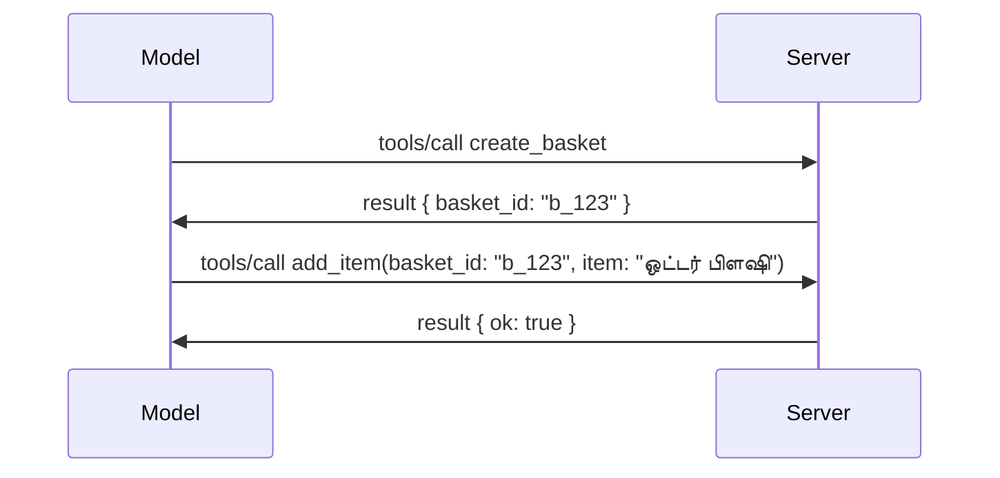

# MCP இல் என்ன மாற்றப்படுகிறது: 2026-07-28 ரிலீஸ் மாணவர்

> **நிலைமை:** ரிலீஸ் மாணவர். `2026-07-28` விவரக்குறிப்பு தற்போது இறுதி நிலை இல்லை. இது 2026 மே 21 அன்று அறிவிக்கப்பட்டது, மற்றும் 2026 ஜூலை 28 அன்று வெளியீடாக திட்டமிடப்பட்டுள்ளது. இந்த பாடத்தில் உள்ள அனைத்தும் ரிலீஸ் மாணவரைப் பற்றியது; அதனை முன்னிட்டு கட்டமைக்க முன் [வரைவோவிய விவரக்குறிப்பு](https://modelcontextprotocol.io/specification/draft) மற்றும் அதன் [மாற்றத்திரயாசல்](https://modelcontextprotocol.io/specification/draft/changelog) நிகழ்கால நிலையை சரிபார்க்கவும். இந்த பாடநெறியின் மற்ற பகுதிகள் தற்போதைய நிலையான வெளியீட்டையொட்டி எழுதப்பட்டுள்ளன, **MCP விவரக்குறிப்பு 2025-11-25**, மற்றும் `2026-07-28` வெளியிடப்பட்டவுடன் புதுப்பிக்கப்படும்.

## மேற்பார்வை

`2026-07-28` MCP இன் தொடக்கத்திலிருந்து மிகப்பெரிய திருத்தமாகும். ஆறு விவரக்குறிப்பு மேம்பாட்டு யோசனைகள் (SEPs) பாகப்பிரிவு-நிலை அமர்வுகளை நீக்கி, MCP ஐ பரிமாற்ற அடுக்கில் நிலைஇல்லா செயலாக்கமாக மாற்றுகின்றன, நீட்டிப்புகள் முதன்மைப் வகை, பதிப்பு கொண்ட இயந்திரமாக மாறுகின்றன, மேலும் நீங்கள் இத்திட்டத்தில் முன்பு கற்றுக்கொண்ட பல அம்சங்கள் (Roots, Sampling, Logging) புதிய வாழ்க்கைச் சுழற்சி கொள்கையின் கீழ் பழமைவாதமாக மாற்றப்பட்டுள்ளன. இந்த பாடம் என்ன மாற்றப்படுகிறது, அது ஏன் முக்கியம், மற்றும் நீங்கள் `2025-11-25` அடிப்படையில் ஏற்கனவே எழுதின குறியீட்டிற்கு அதன் பொருள் என்ன என்பதை சுருக்கமாக விளக்குகிறது.

மூலதளம்: [The 2026-07-28 MCP Specification Release Candidate](https://blog.modelcontextprotocol.io/posts/2026-07-28-release-candidate/) (பரிந்துரை: Model Context Protocol Blog, David Soria Parra மற்றும் Den Delimarsky).

## கற்றல் குறிக்கோள்கள்

இந்த பாடத்தின் முடிவில், நீங்கள்:

- MCP ஏன் நிலைஇல்லாத புரோட்டோகால் நெறிமுறை நோக்கம் செலுத்துகிறது என்பதை மற்றும் அது பாணி அதிகரிக்கப்பட்ட செயலாக்கங்களில் எந்த பிரச்சினையை தீர்க்கின்றது என்பதை விளக்க முடியும்.
- `initialize`/`initialized` கைமாற்று மற்றும் `Mcp-Session-Id` தலைப்பு எப்படி மாற்றப்படுகின்றது என்பதை விவரிக்க முடியும்.
- புதிய `Mcp-Method` மற்றும் `Mcp-Name` தலைப்புகள் மற்றும் `ttlMs`/`cacheScope` சேமிப்புக் குறியீடு முகாமைப் பகுப்பாய்வு செய்ய முடியும்.
- நீட்டிப்பு கட்டமைப்பையும், இந்த வெளியீட்டுடன் இருப்பவையாக இரண்டு நீட்டிப்புகளான MCP அப்ஸ் மற்றும் பணிகளையும் அடையாளம் காட்ட முடியும்.
- OAuth 2.0 / OIDC ஒருங்கிணைப்பை வலுப்படுத்தும் ஆறு அங்கீகார SEPs பட்டியலிட முடியும்.
- எந்த முக்கிய அம்சங்கள் (Roots, Sampling, Logging) இப்போது பழமைவாதமாக உள்ளன மற்றும் அதன் நடைமுறை விளைவுகள் என்ன என்பதை உணர முடியும்.
- கருவி `inputSchema`/`outputSchema` க்கான முழு JSON Schema 2020-12 மாற்றத்தை விளக்க முடியும்.

## நிலைஇல்லா புரோட்டோகால்

முக்கிய மாற்றம்: MCP பரிமாற்ற அடுக்கில் நிலைஇல்லாத பிரதியாக மாறுகிறது.

### முந்தைய நிலை (2025-11-25): அமர்வுகள் ஒரே சேவையகமான அலகை நிர்ணயம் செய்கின்றன

Streamable HTTP வழியாக ஒரு கருவியை அழைப்பது `initialize` கைமாற்றுடன் துவங்குகிறது. சேவையகம் `Mcp-Session-Id` தலைப்போடு பதில் அளிக்கிறது, இது அடுத்த எல்லா கோரிக்கைகளும் கொண்டிருப்பது அவசியம்:

```http
POST /mcp HTTP/1.1
Mcp-Session-Id: 1868a90c-3a3f-4f5b
Content-Type: application/json

{"jsonrpc":"2.0","id":2,"method":"tools/call",
 "params":{"name":"search","arguments":{"q":"otters"}}}
```

ஏனெனில் அமர்வு அதை வெளியிட்ட எந்த சேவையக அலகுக்கும் பொருந்தும், பாணி அதிகரிக்கப்பட்ட செயலாக்கங்கள் ஏற்றுமதி சமநிலை திருத்துநிலை வழிமுகம் மற்றும் பகிரப்பட்ட அமர்வு கடை தேவைப்படுகிறது.

### பின் நிலை (2026-07-28): ஒவ்வொரு கோரிக்கையும் தானாகவே சுயாதீனமாகும்

```http
POST /mcp HTTP/1.1
MCP-Protocol-Version: 2026-07-28
Mcp-Method: tools/call
Mcp-Name: search
Content-Type: application/json

{"jsonrpc":"2.0","id":1,"method":"tools/call",
 "params":{"name":"search","arguments":{"q":"otters"},
           "_meta":{"io.modelcontextprotocol/clientInfo":{"name":"my-app","version":"1.0"}}}}
```

எந்த சேவையக அலகும் இந்த கோரிக்கையை கையாள முடியும். முக்கிய மாற்றங்கள்:

- **`initialize`/`initialized` கைமாற்று நீக்கப்பட்டுள்ளது** ([SEP-2575](https://github.com/modelcontextprotocol/modelcontextprotocol/pull/2575)). புரோட்டோக்கால் பதிப்பு, கிளையண்ட் தகவல் மற்றும் திறன்கள் ஒவ்வொரு கோரிக்கையிலும் `_meta` இல் செலுத்தப்படுகின்றன. புதிய `server/discover` முறை கிளையண்டுக்கு முன் சேவையக திறன்களை பெற்று கொள்ளவாய் வழங்குகிறது.
- **`Mcp-Session-Id` தலைப்பும் புரோட்டோக்கால் நிலை அமர்வும் நீக்கப்பட்டுள்ளன** ([SEP-2567](https://github.com/modelcontextprotocol/modelcontextprotocol/pull/2567)). நிலைத்த வழிமுறை மற்றும் பகிரப்பட்ட அமர்வு கடைகள் பரிமாற்ற அடுக்கில் தேவையில்லை.

### நிலைஇல்லா புரோட்டோகால், நிலை கொண்ட செயலிகள்

புரோட்டோக்கால் நிலை அமர்வை நீக்குவதன் பொருள் சர்வர் நிலை இல்லையென்று அல்ல. பரிந்துரைக்கப்படுகிற நடைமுறை HTTP API-கள் எப்போதும் பயன்படுத்திய முறையாகவே இருக்கிறது: ஒரு கருவி அழைப்பிலிருந்து ஒரு தெளிவான கைப்பிடி (ஒரு `basket_id`, ஒரு `browser_id`) முறையாக உருவாக்கி, பின்னர் அது சர்வர் அழைப்புகளில் சாதாரண அளவுருவாக மாற்றுகிறார்.



இது நிலையை காண்பிக்கும் மற்றும் மாதிரிக்கு பயன்படுத்தத் தகுதியானவையாக மாற்றுகிறது, பரிமாற்ற மெட்டாடேட்டாவில் மறைக்காமல் செய்து, எந்த சர்வர் அலகும் எந்த அழைப்பையும் கையாள அனுமதிக்கிறது.

### சர்வர்-மூலம்-கிளையண்ட் கோரிக்கைகள், மறுசீரமைப்பு

நிலைஇல்லாத புரோட்டோகால் சர்வர் கிளையண்ட் கோரிக்கையின் நடுவில் (எ.கா., தகவல் கேட்க) கோரிக்கைகளை செய்ய வழி தேவைப்படுகின்றது:

- **சர்வர் துவங்கிய கோரிக்கைகள் சர்வர் செயலாக்கும் நேரத்தில் மட்டுமே பூட்டி செய்யப்பட வேண்டும்** ([SEP-2260](https://github.com/modelcontextprotocol/modelcontextprotocol/pull/2260)) — முன்னதாக பரிந்துரைக்கப்பெற்றது, இப்போது கட்டாயம். பயனர் எங்கும் இருந்து திடீரென்று கேள்வி கேட்கப்பட மாட்டார்.
- **பல சுற்றுப்பயண கோரிக்கைகள்** ([SEP-2322](https://github.com/modelcontextprotocol/modelcontextprotocol/pull/2322)) SSE ஸ்ட்ரீமை திறந்து வைத்திருப்பதை மாற்றுகின்றன. ஒர் மாதிரியில், சர்வர் `InputRequiredResult` ஐ திருப்புகிறது:

  ```json
  {
    "resultType": "inputRequired",
    "inputRequests": {
      "confirm": {
        "type": "elicitation",
        "message": "Delete 3 files?",
        "schema": { "type": "boolean" }
      }
    },
    "requestState": "eyJzdGVwIjoxLCJmaWxlcyI6WyJhIiwiYiIsImMiXX0="
  }
  ```

  கிளையண்ட் பதில்களை சேகரித்து, `inputResponses` உடன் அசல் அழைப்பை மீண்டும் அனுப்புகிறது, தொடரும் `requestState` உடன். எந்த சர்வர் அலகும் மீண்டும் முயற்சியை மேற்கொள்ள முடியும் ஏனெனில் தேவையான அனைத்தும் தரவுத் தொகுப்பில் இருக்கிறது.

### வழிமுறை மற்றும் சேமிக்கக்கூடிய மற்றும் கண்காணிக்கக்கூடிய

மூன்று சிறிய மாற்றங்கள் நிலைஇல்லாத போக்குவரத்தை எளிதாக்குகின்றன:

- **Streamable HTTP இல் `Mcp-Method` மற்றும் `Mcp-Name` தலைப்புகள் கட்டாயம்** ([SEP-2243](https://github.com/modelcontextprotocol/modelcontextprotocol/pull/2243)) — ஆகவே ஏற்றுமதி சமநிலை திருத்துநிலையாளர், வாயில்கள் மற்றும் விகிதக் கட்டுப்படுத்திகள் JSON உடலை பரிசோதிக்காமல் செயல்பாட்டை வழிசெய்யலாம். தலைப்புகள் மற்றும் உடல் முரண்பட்டால் சேவையகம் கோரிக்கையை மறுக்கிறது.
- **`tools/list` மற்றும் வள வாசிப்பு முடிவுகள் `ttlMs` மற்றும் `cacheScope` உடனிருக்கின்றன** ([SEP-2549](https://github.com/modelcontextprotocol/modelcontextprotocol/pull/2549)) HTTP `Cache-Control` ஐ முறைப்படுத்தி. கிளையண்டுகள் ஒரு பட்டியல் முடிவு எவ்வளவு காலம் புதியதாக இருக்கும் மற்றும் அது பயனர்களுக்கு பகிர வேண்டுமா என்பதை அறிகிறது, மாற்றங்களை அறிய நீண்டகால SSE ஸ்ட்ரீம் தேவையில்லை.
- **W3C Trace Context பரிமாற்றம் `_meta` இல் ஆவணப்படுத்தப்பட்டுள்ளது** ([SEP-414](https://github.com/modelcontextprotocol/modelcontextprotocol/pull/414)), `traceparent`, `tracestate`, மற்றும் `baggage` முக்கிய பெயர்களை சரிசெய்கிறது, ஆகி பரவல் கண்காணிப்பு ஒரு அழைப்பை கிளையண்ட் SDK, MCP சர்வர் மற்றும் கீழ்நிலை அமைப்புகளில் [OpenTelemetry](https://opentelemetry.io/) உடன் பொருந்தக்கூடிய பின்னணி வழியாக பின்தொடரலாம்.

## நீட்டிப்புக்கள் முதல்தரமாக மாறுகின்றன

`2025-11-25` இல் நீட்டிப்புகள் அநுமதிக்கப்படாத நிலையில் இருந்தன. [SEP-2133](https://github.com/modelcontextprotocol/modelcontextprotocol/pull/2133) அவற்றை முறையாக்குகிறது:

- நீட்டிப்புக்கள் விலகிய-DNS அடையாளங்களுடன் அடையாளம் காணப்படுகின்றன.
- அவற்றை கிளையண்ட் மற்றும் சர்வர் திறன்களில் `extensions` வரைபடம் வழியாக அலசிக்கொள்ளப்படும்.
- அவர்கள் தமது சொந்த `ext-*` களஞ்சியங்களில் உயிருப்பெற்று, தந்திரங்கரவிஸ்தாரர்களால் பராமரிக்கப்பட, மற்றும் முதன்மைப் விவரக்குறிப்பிலிருந்து தனித்தனியாக பதிப்புதானாக இயங்கும்.
- SEP செயற்பாடு முறையில் புதிய நீட்டிப்புக்கள் ஒரு வழியைப் பெறுகின்றன, பரிசோதனையில் இருந்து அதிகாரபூர்வ நிலைக்கு.

இந்த வெளியீடு இரண்டு அதிகாரபூர்வ நீட்டிப்புக்களுடன் வருகிறது.

### MCP அப்ஸ்கள்: சர்வர்-உருவான பயனர் இடைமுகங்கள்

[MCP Apps](https://blog.modelcontextprotocol.io/posts/2026-01-26-mcp-apps/) ([SEP-1865](https://github.com/modelcontextprotocol/modelcontextprotocol/pull/1865)) சர்வர்கள் sandboxed iframe-ல் ஹோஸ்ட்கள் இயக்கும் இடைமுகத்தை வழங்க அனுமதிக்கிறது. கருவிகள் தம் UI வார்ப்புருக்களை முந்தாமை அறிவித்து, ஹோஸ்ட்கள் அதை முன்கூட்டியே பெறவும், சேமிக்கவும், பாதுகாப்பு மதிப்பாய்வு செய்யவும் முடியும். இதன் அடிப்படைகளை நீங்கள் [பாடம் 15: MCP செயலிகள்](../03-GettingStarted/15-mcp-apps/README.md) இல் கற்றுக்கொள்ளுள்ளீர்கள் — நீட்டிப்புக் கட்டமைப்பின் கீழ், MCP செயலிகள் தற்போது முறையாக்கப்பட்ட நீட்டிப்பு ஆகிவிட்டன, பயிற்சி கோருவாக அல்ல.

### பணிகள் நீட்டிப்பாக இறங்குகின்றன

`2025-11-25` இல் பணிகள் பயிற்சி முதன்மைப் அம்சமாக வந்தன. உற்பத்தி பயன்பாடு மறுவடிவமைப்பை வெளிப்படுத்தியது; ஆகவே அதற்கான சரியான இடம் நீட்டிப்பு: [பணிகள் நீட்டிப்பு](https://github.com/modelcontextprotocol/modelcontextprotocol/pull/2663) நிலைஇல்லாத மாதிரிக்கும் உருட்டுகிறது — ஒரு சர்வர் `tools/call` ஐ பணிக் கைப்பிடியோடு பதிலளிக்கக்கூடும், கிளையண்ட் அதை `tasks/get`, `tasks/update`, மற்றும் `tasks/cancel` மூலம் இயக்கி முன்செல்வான். பணியிடை உருவாக்கம் சர்வர் வழிகாட்டப்பட்டு நடக்கும்: கிளையண்ட் நீட்டிப்பை விளம்பரம் செய்து, சர்வர் அழைக்கும்போது பணியாக ஓடுமா என்பதை முடிவெடுக்கிறது. `tasks/list` முழுக்க நீக்கப்பட்டது ஏனெனில் அமர்வுகள் இல்லாமல் பாதுகாப்பாக குறிப்பிட இயலாது.

> **மாற்றுகுறிப்பு:** நீங்கள் பயிற்சி `2025-11-25` பணிகள் API ஐ அமல்படுத்தியிருந்தால், புதிய நீட்டிப்பு வாழ்க்கைச் சுழற்சிக்கு மாற்ற வேண்டும் — இது பின்வாங்கி பொருந்தக்கூடாது.

## அங்கீகாரம் உறுதி செய்தல்

ஆறு SEP கள் [அங்கீகார விவரக்குறிப்பை](https://modelcontextprotocol.io/specification/draft/basic/authorization) வலுப்படுத்துகின்றன, OAuth 2.0 / OpenID Connect உற்பத்தி நிலைக்காக இணைக்கிறது:

| SEP | மாற்றம் |
|---|---|
| [SEP-2468](https://github.com/modelcontextprotocol/modelcontextprotocol/pull/2468) | கிளையண்டுகள் அங்கீகார பதில்களில் `iss` அளவுருவைப் [RFC 9207](https://www.rfc-editor.org/rfc/rfc9207) படி சரிபார்க்க வேண்டும், MCP இன் ஒரு கிளையண்டிலும் பல சர்வர் மாதிரியில் ஏற்படும் கலப்பு தாக்குதல்களை குறைக்க. எதிர்கால பதிப்பு `iss` இல்லாத பதில்களை நிராகரிக்க கட்டாயம் ஆகும். |
| [SEP-837](https://github.com/modelcontextprotocol/modelcontextprotocol/pull/837) | கிளையண்டுகள் தங்களுடைய OpenID Connect `application_type` ஐ Dynamic Client Registration நேரத்தில் அறிவிக்கின்றன, அங்கீகார சர்வர்கள் டெஸ்க்டாப்/CLI கிளையண்டை `"web"` ஆக குறிக்காமலும் அதன் localhost மறுமாற்ற URI ஐ நிராகரிக்காமலும் செய்கின்றன. |
| [SEP-2352](https://github.com/modelcontextprotocol/modelcontextprotocol/pull/2352) | கிளையண்டுகள் பதிவு செய்யப்பட்ட அங்கீகார ஆவணங்களை அங்கீகார சர்வர் `issuer` க்கு கட்டுப்படுத்தி, ஒரு வளம் அங்கீகார சர்வர்கள் இடையே நகரும் போது மறுபதிவு செய்கின்றன. |
| [SEP-2207](https://github.com/modelcontextprotocol/modelcontextprotocol/pull/2207) | OpenID Connect முறை அங்கீகார சர்வர்களிடமிருந்து மறுபிரதி டோகன் கேட்டு உரையாடல் செய்யும் முறையை ஆவணப்படுத்துகிறது. |
| [SEP-2350](https://github.com/modelcontextprotocol/modelcontextprotocol/pull/2350) | கட்டுப்பாடு உயர்வு அங்கீகாரத்தின் போது பரிமாணத் தொகுப்பை தெளிவுபடுத்துகிறது. |
| [SEP-2351](https://github.com/modelcontextprotocol/modelcontextprotocol/pull/2351) | `.well-known` கண்டுபிடிப்பு இடைமுகத்தை தெளிவுபடுத்துகிறது. |

நீங்கள் இன்று MCP க்கான அங்கீகார சர்வர் கட்டுமானத்தில் இருந்தால், உடனடியாக அங்கீகார பதில்களில் `iss` வழங்கத் தொடங்கவும் — தற்போதைய அங்கீகார வழிகாட்டலுக்கு [02-Security](../02-Security/README.md) ஐப் பாருங்கள்.

## Roots, Sampling, மற்றும் Logging பழமைவாதம் ஆகிவிட்டன

புதிய [அம்ச வாழ்க்கைச் சுழற்சி கொள்கையின்](https://github.com/modelcontextprotocol/modelcontextprotocol/pull/2577) கீழ் ([SEP-2577](https://github.com/modelcontextprotocol/modelcontextprotocol/pull/2577)), நீங்கள் கற்றுக் கொண்டம்சங்கள் மூன்று முக்கிய கிளையண்ட் மூலக்கருத்துக்கள் [Core Concepts](./README.md#roots) இல் **பழமைவாதம்** நிலைக்கு நகர்ந்துள்ளன:

| அம்சம் | பரிந்துரைக்கப்ட்ட மாற்று |
|---|---|
| Roots | கருவி அளவுருக்கள், வள URI கள், அல்லது சர்வர் அமைப்பு |
| Sampling | நேரடியாக LLM வழங்குநர் API களுடன் ஒருங்கிணைவு |
| Logging | stdio பரிவர்த்தனைகளுக்கு `stderr`; கட்டமைப்பு கண்காணிப்புக்கு OpenTelemetry |

இவை **மேற்பரிசீலனை மட்டும் பழமைவாதங்களை** குறிக்கின்றன: முறைகள், வகைகள் மற்றும் திறன் கொடிகள் இன்னும் இந்த வெளியீடும் பின்வந்த ஆண்டுக்குள் வெளியிடப்படும் அனைத்து விவரக்குறிப்புகளிலும் இயங்கும். அவற்றை முழுமையாக நீக்க தனித்த SEP வாழ்க்கைச் சுழற்சி கொள்கையின் கீழ் தேவைப்படும் — ஆகவே உங்கள் அன்றாட [Sampling](../03-GettingStarted/14-sampling/README.md) சோதனைகள் இன்று பாதிக்கப்பட மாட்டாது, ஆனால் புதிய சர்வர்கள் மேல் குறிப்பிடப்பட்ட மாற்றுகளை விரும்ப வேண்டும்.

## கருவிகளுக்கான முழு JSON Schema 2020-12

கருவிகளின் `inputSchema` மற்றும் `outputSchema` முழு [JSON Schema 2020-12](https://json-schema.org/draft/2020-12) ஆக உயர்த்தப்பட்டுள்ளன ([SEP-2106](https://github.com/modelcontextprotocol/modelcontextprotocol/pull/2106)):

- உள்ளீட்டு ஸ்கீமாக்கள் `type: "object"` என்ற மூல வரையறையை கொண்டிருந்தே compositional வகைகள் (`oneOf`, `anyOf`, `allOf`), நிலைமைகள் மற்றும் குறிச்சொற்கள் (`$ref`, `$defs`) அனுமதிக்கின்றன.
- வெளியீட்டு ஸ்கீமாக்கள் கட்டுப்பாடின்றி இருக்கலாம், மேலும் `structuredContent` இப்போது எது வேண்டுமானாலும் JSON மதிப்பாக இருக்கலாம், ஆனால் பொருள் மட்டுமல்ல.
- செயலாக்கங்கள் புற்குறிப்புகள் URI களை தானாக தளர்த்த வேண்டாம் மற்றும் ஸ்கீமா ஆழம் மற்றும் சரிபார்ப்பு நேரம் பிசுகப்பட வேண்டும் (ஒரு மறுக்கல்-சேவை-தடுப்பு கவனிப்பு).

தனித்துவாக, ஒரு காணாமல் போன வளத்திற்கான பிழை குறியீடு MCP தனிப்பயன் `-32002` இல் இருந்து JSON-RPC நிலையான `-32602` (தவறான அளவுருக்கள்) ஆக மாறியுள்ளது ([SEP-2164](https://github.com/modelcontextprotocol/modelcontextprotocol/pull/2164)). உங்கள் கிளையண்ட் `-32002` மதிப்புடன் பொருந்தினால் அதை புதுப்பிக்க வேண்டும்.

## புரோட்டோக்கால் இங்கிருந்து எவ்வாறு முன்னேறுகிறது

இந்த வெளியீடு உடைக்கும் மாற்றங்களை உள்ளடக்கியது, அதனை MCP பராமரிப்பாளர்களால் அடுத்தகாலத்தில் வழக்கம் ஆக்க முனைப்பில்லை. மூன்று ஆட்சியமைப்புக் SEPs மீண்டும் இடம்பெற தடுக்கும் நோக்கில் உள்ளன:

- **அம்ச வாழ்க்கைச் சுழற்சி கொள்கை** அனைத்து அம்சங்களுக்கும் செயலில் → பழமைவாதம் → அகற்றம் பாதை வழங்குகிறது, கீழிருந்து தொடங்கி அகற்றத்திற்கு குறைந்தது பன்னிரண்டு மாதங்கள் இடைவெளி உள்ளது.
- **நீட்டிப்புக் கட்டமைப்பு** புதிய திறன்கள் விருப்ப நீட்டிப்புகளாக வெளியிடப்பெற்று, அங்கு நிலைத்துவைக்கும் முதல் வழியை வழங்குகிறது, பிறகு (தேவையானால்) முதன்மைப் விவரக்குறிப்புக்கு நுழைவதற்கு வாய்ப்புள்ளது.
- ஒரு Standards Track SEP இன்னும் Final நிலையை அடைய முடியாது, ஒரே மாதிரியான காட்சிகைகள் [conformance suite](https://github.com/modelcontextprotocol/conformance) ([SEP-2484](https://github.com/modelcontextprotocol/modelcontextprotocol/pull/2484)) இல் இடம் பெற வேண்டும்—அதே சுயவிவரத்தில் [SDK tier system](https://github.com/modelcontextprotocol/modelcontextprotocol/pull/1777) அதிகாரப்பூர்வ SDKகளை மதிப்பிடுகிறது.

## வெளியீட்டு காலக்கெடு மற்றும் சரிபார்த்தல்

- வெளியீட்டு வேட்பாளர் மே 21, 2026 அன்று பூட்டப்பட்டது.
- இறுதி விவரக்குறிப்பு ஜூலை 28, 2026 க்கான திட்டமிடப்பட்டுள்ளது.
- இருவருக்கும் இடையேயான பத்து வார நேரம் SDK பராமரிப்பாளர்களும் கிளையண்ட் அமல்படுத்துபவர்களும் மாற்றங்களை உண்மை பணிச்சுமைகளை எதிர்பார்க்கச் சரிபார்க்க உதவுகிறது; Tier 1 SDKகள் இந்த நேரக் கட்டத்தில் ஆதரவுக்கு படைப்பு செய்யப்படுவன என்று எதிர்பார்க்கப்படுகிறது [SDK tier system](https://modelcontextprotocol.io/docs/sdk) கீழ்.
- மாற்றங்களின் முழுமையான தொகுப்பை [வரைகோப்பு விவரக்குறிப்பு](https://modelcontextprotocol.io/specification/draft) மற்றும் அதன் [மாற்றா் பதிவேடு](https://modelcontextprotocol.io/specification/draft/changelog) இல் கண்காணிக்கலாம்.

## இந்த பாடத்திட்டத்திற்கு இதன் பொருள் என்ன

இப்போ வரை நீங்கள் கற்றுக்கொண்ட அனைத்தும் **2025-11-25** மெய்நிகர் குறியீட்டிற்காக இதில் நடைபெறும், இது `2026-07-28` வெளியீடு வரும் வரை தற்போதைய நிலையான விவரக்குறிப்பு ஆகும். தெளிவாக:

- **அமர்வுகள் மற்றும் `initialize` கைமுறை** ([Core Concepts](./README.md) மற்றும் [Lesson 6: HTTP Streaming](../03-GettingStarted/06-http-streaming/README.md) இல் பின்பற்றப்பட்டது) இன்று உள்ளவரை வேலை செய்கிறது, ஆனால் நீங்கள் `2026-07-28`-க்கு இணக்கமான SDKகளை மேம்படுத்தும் போதே மேலே குறிப்பிடப்பட்ட Stateless கோரிக்கை முறைமையால் மாற்றப்படுவதாக எதிர்பாருங்கள்.
- **நீக்கம் மற்றும் அடிப்படைகள்** ([Core Concepts](./README.md) இலும் உள்ளது) முழுமையாக செயல்படுகின்றன, ஆனால் Deprecated — புதிய வடிவமைப்புக்கள் மேலே பட்டியலிடப்பட்ட மாற்று முறைகளை முன்னிறுத்த வேண்டும்.
- **சோதனைபடுத்தப்பட்ட Tasks அம்சம்**, நீங்கள் பயன்படுத்தினால், Tasks நீட்டிப்பின் புதிய வாழ்க்கைசுற்றத்திற்கு மாற்றப்பட வேண்டும்.
- **MCP செயலிகள்** ([Lesson 15](../03-GettingStarted/15-mcp-apps/README.md)) நடைமுறையில் பாதிக்கப்பட்ட இல்லை; அது அதிகாரபூர்வ நீட்டிப்புக் கட்டமைப்புக்குள் நகர்கிறது.

## கூடுதல் வளங்கள்

- [2026-07-28 MCP விவரக்குறிப்பு வெளியீட்டு வேட்பாளர் (வலைப்பதிவு)](https://blog.modelcontextprotocol.io/posts/2026-07-28-release-candidate/)
- [MCP போக்குவரத்தின் எதிர்காலம்](https://blog.modelcontextprotocol.io/posts/2025-12-19-mcp-transport-future/)
- [MCP வரைகோப்பு விவரக்குறிப்பு](https://modelcontextprotocol.io/specification/draft)
- [MCP வரைகோப்பு மாற்றா் பதிவேடு](https://modelcontextprotocol.io/specification/draft/changelog)
- [SEP வழிகாட்டுதல்கள்](https://modelcontextprotocol.io/community/sep-guidelines)
- [MCP SDK Tier System](https://modelcontextprotocol.io/docs/sdk)

## அடுத்த படிகள்

மீண்டும் [Core Concepts](./README.md) க்கு திரும்பவும் அல்லது தொடர்ந்து [Security](../02-Security/README.md) நோக்கி செல்லவும், இன்று வழங்கப்பட்ட `2025-11-25` வழிகாட்டுதல்கள் எதிர்காலத்துடன் எப்படி பொருந்துகின்றன என்பதை காண.

---

<!-- CO-OP TRANSLATOR DISCLAIMER START -->
**மறுப்பு**:
இந்த ஆவணம் AI மொழிபெயர்ப்பு சேவை [Co-op Translator](https://github.com/Azure/co-op-translator) பயன்படுத்தி மொழிபெயர்க்கப்பட்டுள்ளது. நாங்கள் துல்லியத்திற்காக முயற்சி செய்துள்ளோம், ஆனால் தானாக செய்யப்படும் மொழிபெயர்ப்புகளில் பிழைகள் அல்லது தவறுகள் இருக்கலாம் என்பதை கவனத்தில் கொள்ளவும். அசல் ஆவணம் அதன் தாய்மொழியில் அதிகாரப்பூர்வ ஆதாரமாக கருதப்பட வேண்டும். முக்கியமான தகவல்களுக்கு, தொழில்நுட்பமான மனித மொழிபெயர்ப்பு பரிந்துரைக்கப்படுகிறது. இந்த மொழிபெயர்ப்பைப் பயன்படுத்துவதால் ஏற்படும் எந்த தவறான புரிதல்கள் அல்லது தவறான விளக்கத்திற்கும் நாங்கள் பொறுப்பில்வில்லை.
<!-- CO-OP TRANSLATOR DISCLAIMER END -->