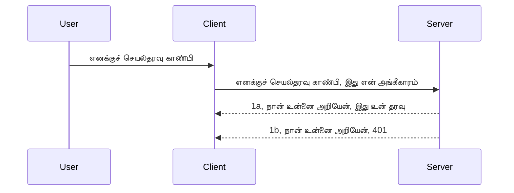

# எளிய அங்கீகாரம்

MCP SDKகள் OAuth 2.1 பயன்படுத்துதலை ஆதரிக்கிறது, இது உண்மையில் ஒரு சிக்கலான செயல்முறை ஆகும், auth சர்வர், resource சர்வர், சான்றுகளை அனுப்புவது, ஒரு குறியீட்டைப் பெறுவது, அந்த குறியீட்டை bearer token க்காக மாற்றுவது சேர்ந்து நீங்கள் உங்கள் resource தரவை இறுதியில் பெற முடியும். நீங்கள் OAuthக்கு பழக்கம் இல்லையெனில், அதை செயல்படுத்த வேண்டும் என்பது ஒரு சிறந்த விஷயம், அடிப்படையான அங்கீகாரத்துடன் தொடங்கிக் கொண்டு மேம்பட்ட பாதுகாப்புக்கு மேம்படுவது நல்லது. இதுவே இந்த அத்தியாயம் இருக்கக்கூடிய காரணம், உங்களை மேம்பட்ட அங்கீகாரத்துக்கு கொண்டு செல்ல.

## அங்கீகாரம், என்ன அர்த்தம்?

அங்கீகாரம் என்பது authentication மற்றும் authorization என்பதின் சுருக்கமாகும். நாம் இரண்டு விஷயங்களைச் செய்ய வேண்டியுள்ளது:

- **Authentication**, இது ஒரு நபர் எங்கள் வீட்டுக்கு நுழைய அனுமதிக்கிறோமா என்பதை கண்டறிதல் மற்றும் அவர்கள் எங்கள் resource server இல் உள்ள MCP Server அம்சங்களுக்கு அணுமதி உள்ளதா என்பதை நிரூபிப்பது.
- **Authorization**, ஒரு பயனாளி அவர்கள் கேட்கும் குறிப்பிட்ட வளங்களுக்கு அணுக வாய்ப்புள்ளார்களா என்பதை கண்டறிதல், உதாரணமாக இந்த ஆணைகள் அல்லது இந்த தயாரிப்புகள் அல்லது உள்ளடக்கத்தை படிக்க அனுமதி உள்ளது ஆனால் அழிக்க முடியாது என்பதுவும் ஒரு உதாரணமாக இருக்கலாம்.

## சான்றுகள்: எங்கள் ஒருவராக நிலைப்படுத்துவது

சமூக இணைய மேம்பாட்டாளர்கள் பெரும்பாலும் சர்வர் முன் ஒரு சான்றை வழங்குவது பற்றி நினைக்கிறார்கள், பொதுவாக ஒரு ரகசியம், அவர்கள் இங்கே இருக்க அனுமதிக்கப்படுவார்கள் என்று காட்டுகிறது "அங்கீகாரம்". இந்த சான்று பொதுவாக பயனர்பெயர் மற்றும் கடவுச்சொல் அடிப்படையில் base64 குறியாக்கம் செய்யப்பட்ட பதிப்பு அல்லது தனித்துவமாக ஒரு பயனாளியை கண்டறியும் API விசை ஆகும்.

இதை "Authorization" என்ற தலைப்புக் கொண்டு அனுப்புவது involves:

```json
{ "Authorization": "secret123" }
```

இதை பொதுவாக அடிப்படையான அங்கீகாரம் என்று குறிப்பிடுகிறார்கள். மொத்த செயல்முறை பின்வருமாறு நடைமுறைக்கு வருகிறது:



இப்போது செயல்முறை பார்வையிலிருந்து எப்படிப் பணியாற்றுகிறது என்பதைக் கற்றுக்கொண்டோம், இதை எப்படி செயல்படுத்துவது? பெரும்பாலான இணைய சர்வர்களில் middleware என்ற கருத்து உள்ளது, இது கோரிக்கையின் ஒரு பகுதியாக இயங்கும் ஒரு குறியீடு ஆகும், இது சான்றுகளை சரிபார்க்கலாம் மற்றும் அனுமதி இருந்தால் கோரிக்கையை அனுமதிக்கும். இல்லையெனில் அனுமதிப்பிழை வருகிறது. இதை எப்படிச் செய்யலாம் பார்க்கலாம்:

**Python**

```python
class AuthMiddleware(BaseHTTPMiddleware):
    async def dispatch(self, request, call_next):

        has_header = request.headers.get("Authorization")
        if not has_header:
            print("-> Missing Authorization header!")
            return Response(status_code=401, content="Unauthorized")

        if not valid_token(has_header):
            print("-> Invalid token!")
            return Response(status_code=403, content="Forbidden")

        print("Valid token, proceeding...")
       
        response = await call_next(request)
        # எந்தவொரு வாடிக்கையாளர் தலைப்புக்களைச் சேர்க்கவோ அல்லது பதிலில் ஏதாவது மாற்றங்களைக் காணவோ செய்யவும்
        return response


starlette_app.add_middleware(CustomHeaderMiddleware)
```

இதில்:

- `AuthMiddleware` என்ற middleware உருவாக்கப்பட்டுள்ளது, அதன் `dispatch` முறை web serverஆல் அழைக்கப்படுகிறது.
- middleware ஐ web serverக்கு இணைத்துள்ளோம்:

    ```python
    starlette_app.add_middleware(AuthMiddleware)
    ```

- "Authorization" தலைப்பு உள்ளது மற்றும் அனுப்பப்படும் ரகசியம் செல்லுபடியானதா என்பதை சரிபார்க்கும் செயல்முறையை எழுதியுள்ளோம்:

    ```python
    has_header = request.headers.get("Authorization")
    if not has_header:
        print("-> Missing Authorization header!")
        return Response(status_code=401, content="Unauthorized")

    if not valid_token(has_header):
        print("-> Invalid token!")
        return Response(status_code=403, content="Forbidden")
    ```

    ரகசியம் உள்ளதும் செல்லுபடியானதும் ஆக இருந்தால், `call_next` அழைத்து கோரிக்கையை அனுமதித்து பதிலளிக்கும்.

    ```python
    response = await call_next(request)
    # பின் வரும் பதிலில் எந்தவொரு வாடிக்கையாளர் தலைப்புகளையும் சேர்க்க அல்லது மாற்றவும்
    return response
    ```

இது இயங்குதல் இவ்வாறு: ஒரு web request சர்வருக்கு வந்தால் middleware செயல்படுகிறது, அதன் இயங்குமுறை படி கோரிக்கையை அனுமதிக்கவோ அல்லது பிழை விடுப்பதன் மூலம் அனுமதி இல்லை என காட்டவோ செய்கிறது.

**TypeScript**

இங்கு Express பிரபலமான கட்டமைப்புடன் middleware உருவாக்கி MCP Server-க்கு முன் கோரிக்கையை இடைநிறுத்துகின்றோம். குறியீடு:

```typescript
function isValid(secret) {
    return secret === "secret123";
}

app.use((req, res, next) => {
    // 1. அங்கீகார தலைப்பு உள்ளது?
    if(!req.headers["Authorization"]) {
        res.status(401).send('Unauthorized');
    }
    
    let token = req.headers["Authorization"];

    // 2. செல்லுபடித்தன்மை சரிபார்க்கவும்.
    if(!isValid(token)) {
        res.status(403).send('Forbidden');
    }

   
    console.log('Middleware executed');
    // 3. கோரிக்கையை கோரிக்கை குழாயில் அடுத்த படிக்கு அனுப்புகிறது.
    next();
});
```

இதில்:

1. முதலில் Authorization தலைப்பு இருக்கிறதா என்று சரிபார்க்கிறோம், இல்லையெனில் 401 பிழை அனுப்புகிறோம்.
2. சான்று/டோக்கன் செல்லுபடியா என சரிபார்க்கிறோம், இல்லையெனில் 403 பிழை.
3. இறுதியில் கோரிக்கையை தொடர்கிறது மற்றும் கேட்கப்பட்ட வளத்தை வழங்குகிறது.

## பயிற்சி: அங்கீகாரத்தை செயல்படுத்து

எங்கள் அறிவை எடுத்துக்கொண்டு செயல்படுத்துவோம். திட்டம்:

சர்வர்

- ஒரு web server மற்றும் MCP எடுத்துக்கோள் உருவாக்கு
- சர்வருக்கான middleware செயல்படுத்து

கிளையண்ட்

- சான்றுடன் கூடிய web request ஐ தலைப்பிற்குள் அனுப்பு

### -1- Web server மற்றும் MCP எடுத்துக்கோள் உருவாக்கு

> **எதிர்கால நோக்கு:** கீழுள்ள TypeScript உதாரணம் HTTP போக்குவரத்தைக் கண்காணிக்க `transports` என்ற வரைபடத்தில் `mcp-session-id` மூலம் திறவுகோல் காட்டுகிறது, **MCP Specification 2025-11-25** படி. `2026-07-28` வெளியீட்டு நிலை ஆசை `initialize` நடப்பதை மற்றும் சessie ஐ அகற்றுகிறது, அதனால் இந்த session போக்குவரத்து வரைபடம் உள்ளடக்கமற்ற, தனித்துவ கோரிக்கைகள் பயன்பாட்டிற்கு மாற்றப்படுகிறது. [Whats Changing in MCP: The 2026-07-28 Release Candidate](../../01-CoreConcepts/mcp-2026-07-28-release-candidate.md) பார்க்கவும்.

முதற் படியில், web server எடுத்துக்கோளை மற்றும் MCP Serverஐ நாம் உருவாக்க வேண்டும்.

**Python**

இங்கு MCP server instance உருவாக்கி starlette web app உருவாக்கி uvicorn மூலம் host செய்கின்றேன்.

```python
# MCP சர்வரை உருவாக்குகிறது

app = FastMCP(
    name="MCP Resource Server",
    instructions="Resource Server that validates tokens via Authorization Server introspection",
    host=settings["host"],
    port=settings["port"],
    debug=True
)

# ஸ்டார்லெட் வலை பயன்பாட்டை உருவாக்குகிறது
starlette_app = app.streamable_http_app()

# uvicorn மூலம் பயன்பாட்டை சேவைகள் செய்கிறது
async def run(starlette_app):
    import uvicorn
    config = uvicorn.Config(
            starlette_app,
            host=app.settings.host,
            port=app.settings.port,
            log_level=app.settings.log_level.lower(),
        )
    server = uvicorn.Server(config)
    await server.serve()

run(starlette_app)
```

இதில்:

- MCP Server உருவாக்கப்பட்டது.
- MCP Serverஇலிருந்து starlette web app உருவாக்கப்பட்டது `app.streamable_http_app()`.
- uvicorn மூலம் web appஐ host செய்து வழங்கியது `server.serve()`.

**TypeScript**

இங்கு MCP Server instance உருவாக்கப்பட்டுள்ளது.

```typescript
const server = new McpServer({
      name: "example-server",
      version: "1.0.0"
    });

    // ... சேவையக ஆதாரங்கள், கருவிகள் மற்றும் ஊக்கங்கள் அமைக்கவும் ...
```

இந்த MCP Server உருவாக்கி POST /mcp மார்க்கில் இட வேண்டும், எனவே மேலுள்ள கோடுகளை இங்கே வைப்போம்:

```typescript
import express from "express";
import { randomUUID } from "node:crypto";
import { McpServer } from "@modelcontextprotocol/sdk/server/mcp.js";
import { StreamableHTTPServerTransport } from "@modelcontextprotocol/sdk/server/streamableHttp.js";
import { isInitializeRequest } from "@modelcontextprotocol/sdk/types.js"

const app = express();
app.use(express.json());

// அமர்வு ID மூலம் போக்குவரத்தைக் காப்பதற்கான வரைபடம்
const transports: { [sessionId: string]: StreamableHTTPServerTransport } = {};

// கிளையண்ட்-செர்வர் தொடர்புக்கான POST கோரிக்கைகளை கையாளுதல்
app.post('/mcp', async (req, res) => {
  // இருந்தாலும் அமர்வு ID ஐச் சரிபார்க்கவும்
  const sessionId = req.headers['mcp-session-id'] as string | undefined;
  let transport: StreamableHTTPServerTransport;

  if (sessionId && transports[sessionId]) {
    // உள்ள போக்குவரத்தை மறுபயன்படுத்தவும்
    transport = transports[sessionId];
  } else if (!sessionId && isInitializeRequest(req.body)) {
    // புதிய துவக்கம் கோரிக்கை
    transport = new StreamableHTTPServerTransport({
      sessionIdGenerator: () => randomUUID(),
      onsessioninitialized: (sessionId) => {
        // அமர்வு ID மூலம் போக்குவரத்தை சேமிக்கவும்
        transports[sessionId] = transport;
      },
      // பின்வற்றை மென்பொருளுக்கு DNS மறுபிணைப்புக் காப்புப்பாதுகாப்பு இயல்பாக முடக்கப்பட்டுள்ளது. நீங்கள் இந்த சர்வரை இயக்கினால்
      // உள்ளூர் முறையில், பின்வருமாறு அமைக்கவும்:
      // enableDnsRebindingProtection: true,
      // allowedHosts: ['127.0.0.1'],
    });

    // மூடப்பட்டபோது போக்குவரத்தை சுத்தம் செய்க
    transport.onclose = () => {
      if (transport.sessionId) {
        delete transports[transport.sessionId];
      }
    };
    const server = new McpServer({
      name: "example-server",
      version: "1.0.0"
    });

    // ... சர்வர் வளங்கள், கருவிகள் மற்றும்ும்புதிமொழிகளை அமைக்கவும் ...

    // MCP சர்வருடன் இணைக்கவும்
    await server.connect(transport);
  } else {
    // தவறான கோரிக்கை
    res.status(400).json({
      jsonrpc: '2.0',
      error: {
        code: -32000,
        message: 'Bad Request: No valid session ID provided',
      },
      id: null,
    });
    return;
  }

  // கோரிக்கையை கையாளவும்
  await transport.handleRequest(req, res, req.body);
});

// GET மற்றும் DELETE கோரிக்கைகளுக்கான மறுபயன்பாட்டு கையாள்பு
const handleSessionRequest = async (req: express.Request, res: express.Response) => {
  const sessionId = req.headers['mcp-session-id'] as string | undefined;
  if (!sessionId || !transports[sessionId]) {
    res.status(400).send('Invalid or missing session ID');
    return;
  }
  
  const transport = transports[sessionId];
  await transport.handleRequest(req, res);
};

// SSE மூலம் சர்வர்-கிளையண்ட் அறிவிப்புகளுக்கான GET கோரிக்கைகளை கையாளவும்
app.get('/mcp', handleSessionRequest);

// அமர்வு முடிக்க DELETE கோரிக்கைகளை கையாளவும்
app.delete('/mcp', handleSessionRequest);

app.listen(3000);
```

இப்போ நீங்கள் MCP Server உருவாக்கம் `app.post("/mcp")` உள்ளே விவரிக்கப்பட்டதை பார்கிறீர்கள்.

அடுத்து middleware உருவாக்கி, வரும் சான்றை சோதிப்பதை மேற்கொண்டு செல்லலாம்.

### -2- சர்வருக்கான middleware உருவாக்கு

இப்போது middleware பாகத்துக்கு வருவோம். இங்கு `Authorization` தலைப்பில் சான்றை தேடி அதன் செல்லுபடித் தோதிக்க middleware ஒன்றை உருவாக்குவோம். ஏற்கெனில் சரிதானால் கோரிக்கை செய்பவரின் கோரிக்கையை எல் செய்யக் கூடிய வகையில் ஆகும் (எ.கா., கருவிகளை பட்டியலிடல், ஒரு வளத்தை படித்தல் போன்ற MCP செயல்பாடுகள்).

**Python**

middleware உருவாக்க `BaseHTTPMiddleware` க்கு முரண்பட்ட வகுப்பை உருவாக்க வேண்டும். இரண்டு முக்கிய கூறுகள் உள்ளன:

- `request` , தலைப்பில் இருந்து தகவலைப் படிக்கும்.
- `call_next` என்ற callback, இது செல்லுபடியான சான்று வந்தால் அழைக்க வேண்டும்.

முதலில் `Authorization` தலைப்பு இல்லை என்ற சந்தர்ப்பத்தை கையாள:

```python
has_header = request.headers.get("Authorization")

# தலைப்பு இல்லை, 401 மூலம் தோல்வி, இல்லையெனில் आगे செல்லவும்.
if not has_header:
    print("-> Missing Authorization header!")
    return Response(status_code=401, content="Unauthorized")
```

இங்கு 401 unauthorized பதில் அனுப்புகிறோம், ஏனெனில் client அங்கீகாரம் தோல்வியடைந்துள்ளது.

பின்னர் சான்று வந்திருந்தால், அதன் செல்லுபடியை இவ்வாறு பரிசோதனை செய்க:

```python
 if not valid_token(has_header):
    print("-> Invalid token!")
    return Response(status_code=403, content="Forbidden")
```

மேலே 403 forbidden பதில் அனுப்பப்படுவதை கவனிக்கவும். கீழே முழுக் middleware இயங்குமுறை:

```python
class AuthMiddleware(BaseHTTPMiddleware):
    async def dispatch(self, request, call_next):

        has_header = request.headers.get("Authorization")
        if not has_header:
            print("-> Missing Authorization header!")
            return Response(status_code=401, content="Unauthorized")

        if not valid_token(has_header):
            print("-> Invalid token!")
            return Response(status_code=403, content="Forbidden")

        print("Valid token, proceeding...")
        print(f"-> Received {request.method} {request.url}")
        response = await call_next(request)
        response.headers['Custom'] = 'Example'
        return response

```

சிறந்தது, ஆனாலும் `valid_token` செயல்பாடு பற்றி? அது இங்கே:

```python
# உற்பத்தியிற்காக பயன்படுத்த வேண்டாம் - அதை மேம்படுத்தவும் !!
def valid_token(token: str) -> bool:
    # "Bearer " முன்னோட்டத்தை அகற்று
    if token.startswith("Bearer "):
        token = token[7:]
        return token == "secret-token"
    return False
```

இது தெளிவாக மேம்படுத்தப்பட வேண்டும்.

[!IMPORTANT] கொடுக்கப்படும் ரகசியங்களை நிரலிலேயே வைக்க கூடாது; அதற்கு பதிலாக தரவு மூலத்திலிருந்து அல்லது IDP (அடையாள சேவை வழங்குநர்) மூலம் பெறுவது சரியானது; அல்லது IDP இல் செல்லுபடித்தலைச் செய்ய விடுங்கள்.

**TypeScript**

Express உடன் செயல்படுத்த `use` முறையை அழைக்க வேண்டும், இது middleware செயல்பாடுகளை ஏற்றுக்கொள்கிறது.

- கோரிக்கையைப் பார்வையிட்டு Authorization உள்ளதா பார்க்க வேண்டும்.
- சான்று சரியாக இருந்தால் கோரிக்கையை தொடர அனுமதிக்க வேண்டும்.

இங்கு `Authorization` தலைப்பு இல்லை எனில் உண்மையில் கோரிக்கையை நிறுத்துகிறோம்:

```typescript
if(!req.headers["authorization"]) {
    res.status(401).send('Unauthorized');
    return;
}
```

தலைப்பு இல்லாவிடில் 401 பதில் கிடைக்கும்.

அடுத்து சான்று செல்லுபடியானதா பார்க்கிறோம், இல்லை எனில் மீண்டும் கோரிக்கை நிறுத்தப்படுகிறது வேறுபட்ட தகவல் மூலம்:

```typescript
if(!isValid(token)) {
    res.status(403).send('Forbidden');
    return;
} 
```

இப்போது 403 பிழை கிடைக்கும்.

முழு கோடு:

```typescript
app.use((req, res, next) => {
    console.log('Request received:', req.method, req.url, req.headers);
    console.log('Headers:', req.headers["authorization"]);
    if(!req.headers["authorization"]) {
        res.status(401).send('Unauthorized');
        return;
    }
    
    let token = req.headers["authorization"];

    if(!isValid(token)) {
        res.status(403).send('Forbidden');
        return;
    }  

    console.log('Middleware executed');
    next();
});
```

இப்போது web server middleware-ஐ அமைத்து client அனுப்பும் சான்றை சோதிக்கிறோம். கிளையண்ட் பற்றி என்ன?

### -3- சான்றுடன் கூடிய web request தலைப்பில் அனுப்பு

client சான்றை தலைப்பின் மூலம் அனுப்புகிறது என்பதை உறுதிசெய்ய வேண்டும். MCP client பயன்படுத்தவுள்ளதால் அதை எப்படிப் பெறுவது என்பதைக் கண்டறிய வேண்டும்.

**Python**

clientக்கு சான்றுடன் ஒரு header அனுப்ப வேண்டும்:

```python
# மதிப்பை கடினமாக குறியிட வேண்டாம், குறைந்தது அதை ஒரு சுற்றுச்சூழல் மாறியில் அல்லது ஒரு பாதுகாப்பான சேமிப்பில் வைத்திருங்கள்
token = "secret-token"

async with streamablehttp_client(
        url = f"http://localhost:{port}/mcp",
        headers = {"Authorization": f"Bearer {token}"}
    ) as (
        read_stream,
        write_stream,
        session_callback,
    ):
        async with ClientSession(
            read_stream,
            write_stream
        ) as session:
            await session.initialize()
      
            # செய்ய வேண்டியது, கிளையன்டில் என்ன செய்யவேண்டும் என்பதைக் குறிப்பிடுக, உதா. கருவிகளை பட்டியலிடல், கருவிகளை அழைப்பு செய்யல் போன்றவை.
```

`headers` என்ற சொத்துக்குள் `{"Authorization": f"Bearer {token}"}` என நிரப்புவது கவனிக்கவும்.

**TypeScript**

இதை இரண்டு படிகளால் தீர்க்கலாம்:

1. ஒரு configuration பொருளில் சான்றை நிரப்புதல்.
2. அந்த configuration-ஐ transportக்கு வழங்குதல்.

```typescript

// இங்கே காட்டப்பட்ட மாதிரியில் மதிப்பை கடுமையாக குறியாக்கம் செய்ய வேண்டாம். குறைந்தபட்சமாக அதை ஒரு சுற்றுச்சூழல் மாறியாக வைத்திருங்கள் மற்றும் development முறையில் dotenv போன்றதை பயன்படுத்துங்கள்.
let token = "secret123"

// ஒரு கிளையன்ட் போக்குவரத்து விருப்பங்கள் பொருளை வரையறு
let options: StreamableHTTPClientTransportOptions = {
  sessionId: sessionId,
  requestInit: {
    headers: {
      "Authorization": "secret123"
    }
  }
};

// விருப்பங்கள் பொருளை போக்குவரத்துக்கு விடு
async function main() {
   const transport = new StreamableHTTPClientTransport(
      new URL(serverUrl),
      options
   );
```

மேலே `options` என கட்டமைந்து headers-ஐ `requestInit` சொத்துக்குள் வைக்கவேண்டியிருந்தது.

[!IMPORTANT] இதனை எப்படி மேம்படுத்துவது? தற்போதைய நடைமுறை சில பிரச்சனைகள் உள்ளன, முதலில் சான்றை இவ்வாறு அனுப்புவது பாரிய அபாயம், குறைந்தபட்சம் HTTPS இல்லாமல். அதுவும் சான்று திருடப்படலாம்; ஆகவே டோக்கன் மறுப்பு, அதிக சோதனைகள் (எ.கா., கோரிக்கை எங்கே இருந்து வருகிறது, அதிகப்படியான கோரிக்கைகள் - bot நடப்புகள் போன்றவை) கூடுதல் சோதனைகள் தேவை.

எனினும், எளிமையான APIகளில் அங்கீகாரம் இல்லாமல் யாரும் API_CALL செய்ய விரும்பாத பட்சத்தில் இவ்வாறு தொடங்குவது நல்லது.

இதையடுத்து பாதுகாப்பை மேம்படுத்த JSON Web Token (JWT / JOT) போன்ற நிலையான வடிவத்தைச் பயன்படுத்தி பாதுகாப்பை மேம்படுத்துவோம்.

## JSON Web Tokens, JWT

எனவே, மிகவும் எளிய சான்றுகளை அனுப்புவதை மேம்படுத்த முயல்கிறோம். JWT ஏற்றும்போது கிடைக்கும் உடனடி மேம்பாடுகள்:

- **பாதுகாப்பு முன்னேற்றங்கள்**. அடிப்படையான அங்கீகாரத்தில் பயனர்பெயர் மற்றும் கடவுச்சொல்லை base64 குறியாக்கத்தில் அனுப்புவது (அல்லது API விசை அனுப்புதல்) அதிக ஆபத்துகளை ஏற்படுத்துகிறது. JWTஇல் பயனர்பெயர்-கடவுச்சொல் அனுப்பி டோக்கன் பெறுவீர்கள், அது காலாவதியாகும் காலக்கோடுடன் இருக்கும். இதனால் நுணுக்கமான அணுகல் கட்டுப்பாடுகளை பங்கு, பரப்பளவு மற்றும் அனுமதிகள் மூலம் முன்பதிவுசெய்யலாம்.
- **Stateless மற்றும் விரிவாக்கம்**. JWT தானாகவே அனைத்து பயனர் தகவலையும் எடுத்துச் செல்லும்; சர்வர் பக்கம் session சேமிப்பை நீக்குகிறது. டோக்கன் உள்ளூர் சரிபார்ப்பு செய்யலாம்.
- **இணக்குமுறை மற்றும் கூட்டமைப்பு**. JWT Open ID Connect இன் மையமாக இருக்கிறது மற்றும் Entra ID, Google Identity, Auth0 போன்ற அடையாள வழங்குநர்களுடன் பயன்படுத்தப்படுகிறது. இது single sign on மற்றும் மேலும் உற்பத்தி தரம் Enterprise அளவில் இயக்க உதவுகிறது.
- **மாட்யுலாரிட்டி மற்றும் நெகிழ்வுத்தன்மை**. JWT Azure API Management, NGINX போன்ற API Gateways உடன் பயன்படுத்தலாம். இது அங்கீகார நிலைகள் மற்றும் சர்வர்-தொலை தொடர்பாடல் போன்ற பணிகளுக்கு உதவுகிறது.
- **செயற்பாடு மற்றும் கேசிங்**. JWT ஐ decode செய்தபின் கேசிங் செய்யலாம், பக்கம் பார்சிங் தேவையை குறைக்கிறது. இது அதிக தொழில்நுட்ப பயன்பாடுகளில் தரத்தையும் செயல்திறனை மேம்படுத்துகிறது.
- **திறமையான அம்சங்கள்**. introspection (சர்வரில் செல்லுபடுத்தல்) மற்றும் revocation (டோக்கன் செல்லாதது ஆக்குதல்) போன்ற விஷயங்களும் உள்ளன.

இந்த அனைத்துக் கொண்டாட்டங்களுடன் நாம் எப்படிப் பின்வட்டத்துக்கு மேம்படுத்தலாம் பார்க்கலாம்.

## அடிப்படையான அங்கீகாரத்தை JWT ஆக மாற்றுதல்

முதன்மையான மாற்றங்கள்:-

- **JWT டோக்கன் உருவாக்க கற்று**, அதை client இருந்து serverக்கு அனுப்ப தயாராக செய்யும்.
- **JWT டோக்கன் செல்லுபடியாகும் என்பதை சரிபார்த்தல்**, சரியானது என்றால் client எங்கள் வளங்கள் பெற.
- **டோக்கன் பாதுகாப்பான சேமிப்பு**. எப்படிக் பாதுகாப்பாக சேமிக்கப்படும்.
- **வழித்தடங்களை பாதுகாப்பது**. நமக்கு MCP அம்சங்கள் உள்ள வழித்தடங்கள் மற்றும் குறிப்புகளுக்கு பாதுகாப்பு வேண்டும்.
- **புதுப்பிக்கும் டோக்கின்கள் சேர்**. குறுகிய கால டோக்கின்களும் நீண்ட கால refresh tokens களும் உருவாக்கு; காலாவதியாகும் போது புதுப்பிக்கும் வசதி, மற்றும் refresh endpoint மற்றும் மாற்று நெறிமுறையும் வேண்டும்.

### -1- JWT டோக்கன் உருவாக்கு

JWT டோக்கனுக்கு கீழ்காணும் பகுதிகள் உள்ளன:

- **header**, கணினி குறிப்பிட்டு அனுப்பும் அலகல்கிரிதம் மற்றும் டோக்கன் வகை.
- **payload**, பெறுபவர்கள் சார்ந்த தகவல்கள், உதா. sub (பயனர் அல்லது நிறுவியம், auth காட்சியில் userid), exp (காலாவதியிடுவது), role (பங்கு)
- **signature**, ஒரு ரகசியம் அல்லது தனிப்பட்ட விசை கொண்டு கையொப்பமிடப்பட்டது.

இதற்கு header, payload மற்றும் குறியாக்க டோக்கனை உருவாக்க வேண்டும்.

**Python**

```python

import jwt
import jwt
from jwt.exceptions import ExpiredSignatureError, InvalidTokenError
import datetime

# JWT க்கு கையொப்பம் இட பயன்படுத்தப்படும் ரகசிய விசை
secret_key = 'your-secret-key'

header = {
    "alg": "HS256",
    "typ": "JWT"
}

# பயனரின் தகவல் மற்றும் அதன் உரிமைகள் மற்றும் கால அவசரம்
payload = {
    "sub": "1234567890",               # பொருள் (பயனர் ஐடி)
    "name": "User Userson",                # தனிப்பயன் உரிமை
    "admin": True,                     # தனிப்பயன் உரிமை
    "iat": datetime.datetime.utcnow(),# வழங்கிய தேதி
    "exp": datetime.datetime.utcnow() + datetime.timedelta(hours=1)  # காலாவதி
}

# இதை குறியாக்கம் செய்
encoded_jwt = jwt.encode(payload, secret_key, algorithm="HS256", headers=header)
```

மேலே:

- HS256ஆக algorithm மற்றும் JWT என்று header வரையறுக்கப்பட்டது.
- Payloadல் உருபடியானது உட்பட, யார், எப்போது வெளியிடப்பட்டது மற்றும் காலாவதியிடுவது ஆகியன உள்ளன.

**TypeScript**

JWT டோக்கன் உருவாக்க சில dependencyகள் தேவையாகின்றன.

Dependencies

```sh

npm install jsonwebtoken
npm install --save-dev @types/jsonwebtoken
```

இது நிறுவப்பட்ட பிறகு, header, payload உருவாக்கி குறியாக்க டோக்கனாக மாற்றுவோம்.

```typescript
import jwt from 'jsonwebtoken';

const secretKey = 'your-secret-key'; // உற்பத்தியில் env மாறிகளை பயன்படுத்தவும்

// பிலோடு குறிக்கவும்
const payload = {
  sub: '1234567890',
  name: 'User usersson',
  admin: true,
  iat: Math.floor(Date.now() / 1000), // வெளியிட்ட தேதி
  exp: Math.floor(Date.now() / 1000) + 60 * 60 // 1 மணிநேரத்தில் காலாவதியாகும்
};

// தலைப்பை வரையறுக்கவும் (விருப்பமானது, jsonwebtoken இயல்புகளை அமைக்கிறது)
const header = {
  alg: 'HS256',
  typ: 'JWT'
};

// டோக்கனை உருவாக்கவும்
const token = jwt.sign(payload, secretKey, {
  algorithm: 'HS256',
  header: header
});

console.log('JWT:', token);
```

இந்த டோக்கன்:

HS256ஆக கையொப்பமிடப்பட்டுள்ளது,
1 மணி நேரத்திற்கு செல்லுபடி,
sub, name, admin, iat மற்றும் exp போன்ற வாதங்கள் உள்ளன.

### -2- டோக்கனைக் செல்லுபடியானதா என சரிபார்த்து

டோக்கனின் செல்லுபடியை சரிபார்க்கவேண்டும்; இது சர்வரில் செய்யப்படும் மற்றும் client அனுப்பினது உண்மையா என்பதை உறுதி செய்கிறது. இதில் கட்டமைப்பு, செல்லுபடி ஆகியவற்றை பரிசோதிக்க வேண்டும் மேலும் பயனர் உங்கள் கணக்கில் இருக்கிறார்களா மற்றும் பிற சோதனைகளும் சேர்க்கலாம்.

டோக்கனை decode செய்து வாசித்து செல்லுபடியை begin செய்க:

**Python**

```python

# JWT ஐ விரி்ந்து சரிபார்க்கவும்
try:
    decoded = jwt.decode(token, secret_key, algorithms=["HS256"])
    print("✅ Token is valid.")
    print("Decoded claims:")
    for key, value in decoded.items():
        print(f"  {key}: {value}")
except ExpiredSignatureError:
    print("❌ Token has expired.")
except InvalidTokenError as e:
    print(f"❌ Invalid token: {e}")

```

இந்தக் குறியீட்டில், நாங்கள் `jwt.decode` ஐ டோக்கன், ரகசிய விசை மற்றும் தேர்ந்தெடுக்கப்பட்ட ஆல்கொரிதம் ஆகியவற்றைக் கொண்டு அழைக்கிறோம். தோல்வியுற்ற சரிபார்ப்புக்குப் பிறகு ஏதாவது பிழை எழும் என்பதால் try-catch கட்டமைப்பை எவ்வாறு பயன்படுத்துகிறோம் என்பதை கவனியுங்கள்.

**TypeScript**

இங்கு நாங்கள் டோக்கனின் டிகோட்ரிக்கப்பட்ட பதிப்பைப் பெற `jwt.verify` ஐ அழைக்க வேண்டும், அதனை நாம் மேலுமாக பகுப்பாய்வு செய்ய முடியும். இந்த அழைப்பு தோல்வியடைகையில், அதாவது டோக்கனின் கட்டமைப்பு தவறானது அல்லது அது இனி செல்லுபடியாகாது என்றும் பொருள்.

```typescript

try {
  const decoded = jwt.verify(token, secretKey);
  console.log('Decoded Payload:', decoded);
} catch (err) {
  console.error('Token verification failed:', err);
}
```

NOTE: முன்பு கூறியபடியே, இந்த டோக்கன் நமது அமைப்பில் உள்ள ஒரு பயனரை குறிக்கிறதா என்பதை உறுதிப்படுத்த கூடுதல் பரிசோதனைகள் செய்ய வேண்டும் மற்றும் பயனர் அதற்குரிய உரிமைகள் உள்ளதாகவும் உறுதிப்படுத்த வேண்டும்.

அடுத்து, பாத்திர அடிப்படையிலான அணுகல் கட்டுப்பாட்டைப் பார்ப்போம், இது RBAC என்று அழைக்கப்படுகிறது.

## பாத்திர அடிப்படையிலான அணுகல் கட்டுப்பாட்டைச் சேர்த்தல்

பலவகை பாத்திரங்களுக்கு பலவகை அனுமதிகள் உள்ளதை நாம் வெளிப்படுத்த விரும்புகிறோம். உதாரணமாக, ஒரு நிர்வாகி அனைத்தையும் செய்ய முடியும் என்று நாம் பொருள் கொள்ளலாம், ஒரு சாதாரண பயனர் படிக்க/எழுத முடியும் என்றும், ஒரு விருந்தினர் மட்டுமே படிக்க முடியும் என்றும் நாம் கருதுகிறோம். எனவே, சில சாத்தியமான அனுமதி நிலைகள் உள்ளன:

- Admin.Write
- User.Read
- Guest.Read

மிடில்웨어 மூலம் அத்தகைய கட்டுப்பாட்டை எவ்வாறு செயல்படுத்தலாம் என்பதைக் பார்ப்போம். மிடில் வேர் ஒரு வழிச்செலுத்தலுக்கோ அல்லது அனைத்து வழிகளுக்கும் சேர்க்கலாம்.

**Python**

```python
from starlette.middleware.base import BaseHTTPMiddleware
from starlette.responses import JSONResponse
import jwt

# இது காட்சி நோக்கத்திற்காக மட்டுமே, இரகசியத்தை கோடில் இதுபோல் வைத்துக் கொள்ள வேண்டாம். அதை பாதுகாப்பான இடத்தில் இருந்து படியுங்கள்.
SECRET_KEY = "your-secret-key" # இதை env மாறிலியில் வைக்கவும்
REQUIRED_PERMISSION = "User.Read"

class JWTPermissionMiddleware(BaseHTTPMiddleware):
    async def dispatch(self, request, call_next):
        auth_header = request.headers.get("Authorization")
        if not auth_header or not auth_header.startswith("Bearer "):
            return JSONResponse({"error": "Missing or invalid Authorization header"}, status_code=401)

        token = auth_header.split(" ")[1]
        try:
            decoded = jwt.decode(token, SECRET_KEY, algorithms=["HS256"])
        except jwt.ExpiredSignatureError:
            return JSONResponse({"error": "Token expired"}, status_code=401)
        except jwt.InvalidTokenError:
            return JSONResponse({"error": "Invalid token"}, status_code=401)

        permissions = decoded.get("permissions", [])
        if REQUIRED_PERMISSION not in permissions:
            return JSONResponse({"error": "Permission denied"}, status_code=403)

        request.state.user = decoded
        return await call_next(request)


```

கீழ்க்காணும் போல, மிடில் வேர் சேர்க்க பலவகை முறைகள் உள்ளன:

```python

# மாற்று 1: ஸ்டார்லெட்டே செயலியை உருவாக்கும் போது மிடில்வேரை சேர்க்கவும்
middleware = [
    Middleware(JWTPermissionMiddleware)
]

app = Starlette(routes=routes, middleware=middleware)

# மாற்று 2: ஸ்டார்லெட்டே செயலி உருவாக்கப்பட்ட பிறகு மிடில்வேரை சேர்க்கவும்
starlette_app.add_middleware(JWTPermissionMiddleware)

# மாற்று 3: பாதை ஒன்றுக்கு மிடில்வேரைச் சேர்க்கவும்
routes = [
    Route(
        "/mcp",
        endpoint=..., # கைமுறை நிர்வாகி
        middleware=[Middleware(JWTPermissionMiddleware)]
    )
]
```

**TypeScript**

நாம் `app.use` ஐப் பயன்படுத்தி அனைத்து கோரிக்கைகளுக்கும் இயங்கும் மிடில் வேர் ஒன்றை பயன்படுத்த முடியும்.

```typescript
app.use((req, res, next) => {
    console.log('Request received:', req.method, req.url, req.headers);
    console.log('Headers:', req.headers["authorization"]);

    // 1. அனுமதி தலைப்பு அனுப்பப்பட்டுள்ளதா என சரிபார்க்கவும்

    if(!req.headers["authorization"]) {
        res.status(401).send('Unauthorized');
        return;
    }
    
    let token = req.headers["authorization"];

    // 2. டோக்கன் செல்லுபடியானதா என சரிபார்க்கவும்
    if(!isValid(token)) {
        res.status(403).send('Forbidden');
        return;
    }  

    // 3. டோக்கன் பயனர் எங்கள் அமைப்பில் உள்ளார்களா என சரிபார்க்கவும்
    if(!isExistingUser(token)) {
        res.status(403).send('Forbidden');
        console.log("User does not exist");
        return;
    }
    console.log("User exists");

    // 4. டோக்கனில் சரியான அனுமதிகள் உள்ளனவா என்பதை உறுதிப்படுத்து
    if(!hasScopes(token, ["User.Read"])){
        res.status(403).send('Forbidden - insufficient scopes');
    }

    console.log("User has required scopes");

    console.log('Middleware executed');
    next();
});

```

நமது மிடில்வேர் செய்தாலும்கூட மற்றும் செய்யவேண்டியவை சில:

1. அதிகாரப்பூர்வ உரை தலைப்பு இருக்கிறதா என்பதைக் கண்டறியவும்
2. டோக்கன் செல்லுபடியாகின்றதா என்று சரிபார்க்கவும், நாங்கள் எழுதிய `isValid` என்ற முறையை அழைக்கிறோம், இது JWT டோக்கனின் முழுமையும் செல்லுபடியையும் சோதிக்கிறது.
3. பயனர் நமது அமைப்பில் உள்ளது என்பதை சரிபார்க்கவும், இதை நாம் சோதிக்க வேண்டும்.

   ```typescript
    // தரவுத்தளத்தில் பயனர்கள்
   const users = [
     "user1",
     "User usersson",
   ]

   function isExistingUser(token) {
     let decodedToken = verifyToken(token);

     // செய்யவேண்டியது, பயனர் தரவுத்தளத்தில் உள்ளாரா என்பதை சரிபார்க்கவும்
     return users.includes(decodedToken?.name || "");
   }
   ```

மேலே, நாம் மிகவும் எளிமையான `users` பட்டியலை உருவாக்கினோம், இது தெளிவாக ஒரு தரவுத்தளத்தில் இருக்க வேண்டும்.

4. கூடுதலாக, டோக்கனில் சரியான அனுமதிகள் உள்ளனவா என்றும் பார்த்துக் கொள்ள வேண்டும்.

   ```typescript
   if(!hasScopes(token, ["User.Read"])){
        res.status(403).send('Forbidden - insufficient scopes');
   }
   ```

மேலே உள்ள மிடில்வேர் குறியீட்டில், நாம் டோக்கனில் User.Read அனுமதி உள்ளதா என்று சரிபார்க்கிறோம், இல்லையென்றால் 403 பிழையைக் அனுப்புகிறோம். கீழே `hasScopes` உதவி முறை உள்ளது.

   ```typescript
   function hasScopes(scope: string, requiredScopes: string[]) {
     let decodedToken = verifyToken(scope);
    return requiredScopes.every(scope => decodedToken?.scopes.includes(scope));
  
   ```

Have a think which additional checks you should be doing, but these are the absolute minimum of checks you should be doing.

Using Express as a web framework is a common choice. There are helpers library when you use JWT so you can write less code.

- `express-jwt`, helper library that provides a middleware that helps decode your token.
- `express-jwt-permissions`, this provides a middleware `guard` that helps check if a certain permission is on the token.

Here's what these libraries can look like when used:

```typescript
const express = require('express');
const jwt = require('express-jwt');
const guard = require('express-jwt-permissions')();

const app = express();
const secretKey = 'your-secret-key'; // put this in env variable

// Decode JWT and attach to req.user
app.use(jwt({ secret: secretKey, algorithms: ['HS256'] }));

// Check for User.Read permission
app.use(guard.check('User.Read'));

// multiple permissions
// app.use(guard.check(['User.Read', 'Admin.Access']));

app.get('/protected', (req, res) => {
  res.json({ message: `Welcome ${req.user.name}` });
});

// Error handler
app.use((err, req, res, next) => {
  if (err.code === 'permission_denied') {
    return res.status(403).send('Forbidden');
  }
  next(err);
});

```

இப்போது நீங்கள் மிடில்வேர் எவ்வாறு அங்கீகாரம் மற்றும் அங்கீகாரத்திற்கான இரண்டும் பயன்படும் என்பதை பார்த்துவிட்டீர்கள், MCP என்பது எப்படி? அது எங்களுக்கு அங்கீகாரத்தைச் செய்யும் முறையை மாற்றுமா? அடுத்த பகுதியில் பார்க்கலாம்.

### -3- MCPயில் RBAC சேர்த்தல்

இடையில் நீங்கள் எப்படி மிடில்வேர் மூலம் RBAC சேர்க்கலாம் என்பதை பார்த்தீர்கள், இருப்பினும் MCPக்கு ஒரு எளிய வழி கிடையாது தனி MCP அம்சத்திற்கு RBAC சேர்ப்பதற்கு, அதனால் நாம் என்ன செய்வோம்? நிச்சயமாக, ஒரு குறிப்பிட்ட கருவியை அழைக்கக் கிளையன்டுக்கு உரிமைகள் உள்ளனவா என்று சோதிக்க ஒரு குறியீடு சேர்க்க வேண்டும்:

ஒரு அம்சத்திற்கு RBAC சேர்க்க பல விருப்பங்கள் உள்ளன, சில:

- நீங்கள் அனுமதிப் பதிவைச் சரிபார்க்க வேண்டிய ஒவ்வொரு கருவி, வளம், முன்மொழிவுக்கு ஒரு சரிபார்ப்பைச் சேர்க்கவும்.

   **python**

   ```python
   @tool()
   def delete_product(id: int):
      try:
          check_permissions(role="Admin.Write", request)
      catch:
        pass # கிளையன்ட் அங்கீகாரம் தோல்வியடைந்தது, அங்கீகாரம் பிழையை எழுப்புக
   ```

   **typescript**

   ```typescript
   server.registerTool(
    "delete-product",
    {
      title: Delete a product",
      description: "Deletes a product",
      inputSchema: { id: z.number() }
    },
    async ({ id }) => {
      
      try {
        checkPermissions("Admin.Write", request);
        // செய்ய, productService மற்றும் remote entry க்கு ஐடி அனுப்பவும்
      } catch(Exception e) {
        console.log("Authorization error, you're not allowed");  
      }

      return {
        content: [{ type: "text", text: `Deletected product with id ${id}` }]
      };
    }
   );
   ```


- மேம்பட்ட சேவையகம் அணுகுமுறை மற்றும் கோரிக்கை கையாளிகளைப் பயன்படுத்தி சோதனை செய்ய வேண்டிய இடங்களை குறைக்கவும்.

   **Python**

   ```python
   
   tool_permission = {
      "create_product": ["User.Write", "Admin.Write"],
      "delete_product": ["Admin.Write"]
   }

   def has_permission(user_permissions, required_permissions) -> bool:
      # user_permissions: பயனருக்கு உள்ள அனுமதிகள் பட்டியல்
      # required_permissions: கருவிக்குத் தேவைப்படும் அனுமதிகள் பட்டியல்
      return any(perm in user_permissions for perm in required_permissions)

   @server.call_tool()
   async def handle_call_tool(
     name: str, arguments: dict[str, str] | None
   ) -> list[types.TextContent]:
    # request.user.permissions என்பது பயனரின் அனுமதிகள் பட்டியலாக ஊகிக்கவும்
     user_permissions = request.user.permissions
     required_permissions = tool_permission.get(name, [])
     if not has_permission(user_permissions, required_permissions):
        # தவறை எழுப்பவும் "உங்களுக்கு கருவி {name} ஐ அழைக்கும் அனுமதி இல்லை"
        raise Exception(f"You don't have permission to call tool {name}")
     # தொடரவும் மற்றும் கருவியை அழைக்கவும்
     # ...
   ```   
   

   **TypeScript**

   ```typescript
   function hasPermission(userPermissions: string[], requiredPermissions: string[]): boolean {
       if (!Array.isArray(userPermissions) || !Array.isArray(requiredPermissions)) return false;
       // பயனருக்குக் குறைந்தது ஒரு தேவையான அனுமதி இருந்தால் உண்மையைத் திருப்புக
       
       return requiredPermissions.some(perm => userPermissions.includes(perm));
   }
  
   server.setRequestHandler(CallToolRequestSchema, async (request) => {
      const { params: { name } } = request;
  
      let permissions = request.user.permissions;
  
      if (!hasPermission(permissions, toolPermissions[name])) {
         return new Error(`You don't have permission to call ${name}`);
      }
  
      // தொடர்க..
   });
   ```

   கவனிக்க, உங்கள் மிடில்வேர் ஒரு டிகோட்ரிக்கப்பட்ட டோக்கனைக் கோரிக்கையின் user பண்புக்கு ஒதுக்க வேண்டும் என்பதில் உறுதி செய்யவேண்டும், அதனால் மேலே உள்ள குறியீடு எளிதாக இருக்கும்.

### சுருக்கமாக

RBAC பொதுவாகவும் MCPக்கான ஆதரவாகவும் எப்படி சேர்க்கலாம் என்பதைக் குறித்து நாம் பேசிவிட்டோம், இப்போது நீங்கள் தவறாமல் கொடுக்கப்பட்ட கருத்துக்களை புரிந்துகொண்டீர்களா என்பதை சரிபார்க்க உங்கள் சொந்தமாக பாதுகாப்பை செயல்படுத்த முயற்சிக்க நேரம்.

## பணிமிடம் 1: அடிப்படைக் அங்கீகாரம் கொண்டு mcp சேவையகம் மற்றும் mcp கிளையன்ட் உருவாக்கவும்

இங்கு நீங்கள் தலைப்புகளுக்குள் அங்கீகார தகவலை அனுப்புவதைக் குறித்து கற்றுக்கொண்டதை பயன்படுத்துவீர்கள்.

## தீர்வு 1

[Solution 1](./code/basic/README.md)

## பணிமிடம் 2: பணிமிடம் 1 இல் இருந்து தீர்வை JWT பயன்படுத்த மேம்படுத்தவும்

முதல் தீர்வைப் பெறுங்கள், ஆனால் இவ்வார்த்தையில் மேம்படுத்துவோம்.

Basic Auth பயன்படுத்தாமல் JWT ஐப் பயன்படுத்துவோம்.

## தீர்வு 2

[Solution 2](./solution/jwt-solution/README.md)

## சவால்

"Add RBAC to MCP" பகுதியில் விவரித்துள்ள அதிகாரங்களை ஒவ்வொரு கருவிக்கும் சேர்க்கவும்.

## சுருக்கம்

இந்த அதிகாரப்பாதையில் நீங்கள் நிறைய கற்றுக்கொண்டீர்கள் என்று நம்புகிறோம், பாதுகாப்பில்லாத நிலைமையிலிருந்து, அடிப்படைக் பாதுகாப்பு வரை, JWT மற்றும் அதனை MCPக்கு எவ்வாறு சேர்ப்பது என்பதுவரை.

நாங்கள் தனிப்பயனாக்கிய JWTகளை கொண்டு வலுவான அடித்தளத்தை உருவாக்கினோம், ஆனால் பரிமாணம் அதிகரிக்கும் போது நாங்கள் ஒரு தரநிலை அடிப்படையிலான அடையாள மாதிரிக்குக் கைவிடுகிறோம். Entra அல்லது Keycloak போன்ற IdPஐ ஏற்றுக்கொள்வதன் மூலம் நாங்கள் டோக்கன் வெளியீடு, சரிபார்ப்பு மற்றும் ஆயுள் நிர்வகிப்பைப் நம்பகமான ஒரு தளத்துக்கு ஒப்படைக்க முடியும் — அப்பிளிகேஷன் லாஜிக் மற்றும் பயனர் அனுபவம் மீது கவனம் செலுத்தத் திறக்கிறது.

அதற்கு, நமக்கு மேலும் ஒரு [மேம்பட்ட அதிகாரப்பாதை Entra பற்றி](../../05-AdvancedTopics/mcp-security-entra/README.md) உள்ளது.

## அடுத்து என்ன

- அடுத்து: [MCP ஹோஸ்ட்களை அமைத்தல்](../12-mcp-hosts/README.md)

---

<!-- CO-OP TRANSLATOR DISCLAIMER START -->
**மறுப்பு**:
இந்த ஆவணம் AI மொழிபெயர்ப்பு சேவை [Co-op Translator](https://github.com/Azure/co-op-translator) பயன்படுத்தி மொழிபெயர்க்கப்பட்டுள்ளது. நாங்கள் துல்லியத்திற்காக முயற்சி செய்துள்ளோம், ஆனால் தானாக செய்யப்படும் மொழிபெயர்ப்புகளில் பிழைகள் அல்லது தவறுகள் இருக்கலாம் என்பதை கவனத்தில் கொள்ளவும். அசல் ஆவணம் அதன் தாய்மொழியில் அதிகாரப்பூர்வ ஆதாரமாக கருதப்பட வேண்டும். முக்கியமான தகவல்களுக்கு, தொழில்நுட்பமான மனித மொழிபெயர்ப்பு பரிந்துரைக்கப்படுகிறது. இந்த மொழிபெயர்ப்பைப் பயன்படுத்துவதால் ஏற்படும் எந்த தவறான புரிதல்கள் அல்லது தவறான விளக்கத்திற்கும் நாங்கள் பொறுப்பில்வில்லை.
<!-- CO-OP TRANSLATOR DISCLAIMER END -->