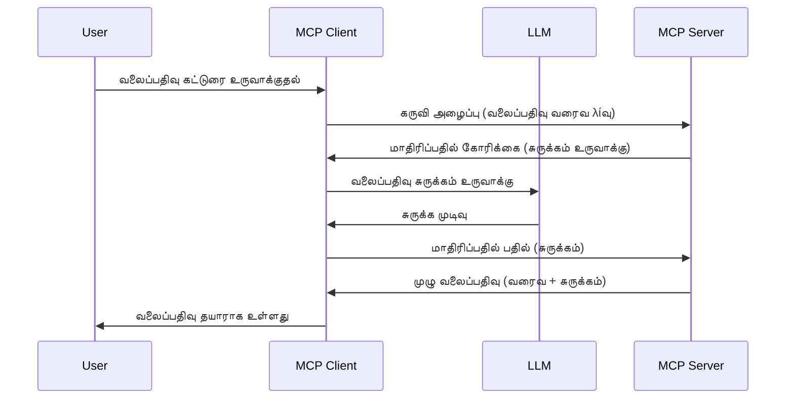

# மாதிரிமுனை - செயல்களை வாடிக்கையாளருக்கு ஒப்படைப்பு

> **மூச்சுத்திணறல் அறிவிப்பு:** `2026-07-28` MCP குறிப்பிடல் வெளியீட்டு kandidaat மாதிரிமுனையை LLM வழங்குநர் API-களுடன் நேரடி ஒருங்கிணைப்புக்காக காலாவதியாக்கப்படுகிறது என்று குறிக்கிறது. மாதிரிமுனை `2025-11-25` வரை மற்றும் எந்தவொரு அரசியல் காலாவதியாக்கத்திற்கும் குறைந்தது ஒரு வருடம் செயல்படும், எனவே இந்த பாடத்தில் உள்ள அனைத்தும் செல்லுபடியாகும் — ஆனால் புதிய சர்வர் வடிவமைப்புகள் மாற்று முறையை மதிப்பாய்வு செய்ய வேண்டும். பார்க்கவும் [MCP-இல் என்ன மாற்றம்: 2026-07-28 வெளியீட்டு kandidaat](../../01-CoreConcepts/mcp-2026-07-28-release-candidate.md).

சில சமயங்களில், பொதுவான ஒரு நோக்கத்தை அடைய MCP வாடிக்கையாளர் மற்றும் MCP சர்வர் இணைந்து செயல்பட வேண்டும். சர்வர், வாடிக்கையாளருக்கு உட்பட்டு இருக்கும் LLM உதவியைக் கேட்கும் நிலை இருக்கலாம். இவ்வாறு, மாதிரிமுனையை பயன்படுத்த வேண்டும்.

சில பயன்பாட்டு நிலைகளையும் மாதிரிமுனை அடிப்படையிலான தீர்வை எவ்வாறு உருவாக்க வேண்டும் என்பதையும் ஆராய்ந்து பார்ப்போம்.

## மேற்சோறும்

இந்த பாடத்தில், மாதிரிமுனையை எப்போது மற்றும் எங்கு பயன்படுத்துவது என்றும் அதை எப்படி கட்டமைப்பது என்றும் புரிந்துகொள்ளுவோம்.

## கற்றல் இலக்குகள்

இந்த அத்தியாயத்தில், நாம்:

- மாதிரிமுனை என்றால் என்ன மற்றும் அதை எப்போது பயன்படுத்துவது என்பதைக் விளக்குவோம்.
- MCP இல் மாதிரிமுனையை எவ்வாறு கட்டமைப்பது என்பதை காட்சிப்படுத்துவோம்.
- மாதிரிமுனையின் செயல்பாட்டில் சில உதாரணங்களை வழங்குவோம்.

## மாதிரிமுனை என்ன மற்றும் ஏன் பயன்படுத்த வேண்டும்?

மாதிரிமுனை ஒரு முன்னேற்ற பல அறிமுக அம்சமாகும், இது பின்வரும் முறையில் செயல்படுகிறது:



### மாதிரிமுனை கோரிக்கை

சரி, தற்போது நமக்கு விசுவாசமான ஒரு நிலைமை மிக உயரமாக பரவியுள்ளது; சர்வர் வாடிக்கையாளருக்கு அனுப்பும் மாதிரிமுனை கோரிக்கையைப் பார்ப்போம். JSON-RPC வடிவத்தில் இதுபோல் இருக்கும்:

```json
{
  "jsonrpc": "2.0",
  "id": 1,
  "method": "sampling/createMessage",
  "params": {
    "messages": [
      {
        "role": "user",
        "content": {
          "type": "text",
          "text": "Create a blog post summary of the following blog post: <BLOG POST>"
        }
      }
    ],
    "modelPreferences": {
      "hints": [
        {
          "name": "claude-3-sonnet"
        }
      ],
      "intelligencePriority": 0.8,
      "speedPriority": 0.5
    },
    "systemPrompt": "You are a helpful assistant.",
    "maxTokens": 100
  }
}
```

இதில் குறிப்பிடவேண்டிய சில விஷயங்கள்:

- Prompt, content -> text கீழ் உள்ளது, எங்கள் LLM க்கு ஒரு தள பதிவின் உள்ளடக்கத்தை சுருக்க உத்தரவாகும்.

- **modelPreferences**. இந்தப் பகுதி ஹோ, ஒரு விருப்பம், LLM உடன் பயன்படுத்த வேண்டிய கட்டமைப்புக்கான பரிந்துரையாகும். பயனாளர் இந்த பரிந்துரைகளை ஏற்கலாம் அல்லது மாற்றலாம். இக்கேஸில், பயன்படுத்த வேண்டிய மாடல், வேகம் மற்றும் அறிவுத்திறன் முன்னுரிமைப் பரிந்துரைகள் உள்ளன.
- **systemPrompt**, இது உங்கள் சாதாரண கணினி உத்தரவாகும், இது உங்கள் LLM-க்கு தனிப்பட்ட தன்மையையும் வழிகாட்டுதலையும் அளிக்கும்.
- **maxTokens**, இந்த பணிக்குத் பயன்படுத்த வரையறுக்கப்பட்ட அதிகபட்ச குறிகியக்க்கள் எண்ணிக்கையை குறிப்பிடும் சொத்தாகும்.

### மாதிரிமுனை பதில்

இந்த பதில் MCP வாடிக்கையாளர் மூலம் மதிப்பிடப்பட்டுள்ளது, இது MCP சர்வரை திரும்ப அனுப்பப்படும் முடிவாகும், வாடிக்கையாளர் LLM க்கு இந்தக் கேள்வியை அனுப்பி பதிலுக்கு காத்திருந்து பின்னர் இந்த செய்தியை உருவாக்குகிறது. JSON-RPC இல் இதுபோல் இருக்கும்:

```json
{
  "jsonrpc": "2.0",
  "id": 1,
  "result": {
    "role": "assistant",
    "content": {
      "type": "text",
      "text": "Here's your abstract <ABSTRACT>"
    },
    "model": "gpt-5",
    "stopReason": "endTurn"
  }
}
```

பதில் பிழைத்ததில், தோழர் கேட்டது போலத் தளப் பதிவு சுருக்கம் உள்ளது. மேலும் பயன்படுத்திய `model` கேட்கப்பட்ட "claude-3-sonnet" அல்லாமல் "gpt-5" ஆக உள்ளது என்பதை கவனியுங்கள். இது பயனாளர் எந்த மாடலை பயன்படுத்த வேண்டும் என்பது குறித்து மனசாட்சியுடன் மாற்றலாம் என்பதைக் காட்டுகிறது, மேலும் உங்கள் மாதிரிமுனை கோரிக்கை பரிந்துரையாகும்.

சரி, அற்புதமான மாற்ற முகவரியைப் புரிந்துகொண்டோம், மற்றும் பயனுள்ள பணியாக "தள பதிவு உருவாக்கல் + சுருக்கம்" பயன்படுத்துவோம், அதை வேலை செய்ய எப்படி செய்வது என்பதைப் பார்ப்போம்.

### செய்தி வகைகள்

மாதிரிமுனை செய்திகள் வெறும் உரைத்தாள் மட்டும் அல்ல, படம் மற்றும் ஒலி அனுப்பலாம். JSON-RPC இல் அது எப்படி வேறுபடுகிறது பார்ப்போம்:

**உரை**

```json
{
  "type": "text",
  "text": "The message content"
}
```

**பட உள்ளடக்கம்**

```json
{
  "type": "image",
  "data": "base64-encoded-image-data",
  "mimeType": "image/jpeg"
}
```

**ஒலி உள்ளடக்கம்**

```json
{
  "type": "audio",
  "data": "base64-encoded-audio-data",
  "mimeType": "audio/wav"
}
```

> குறிப்புரை: மாதிரிமுனை பற்றிய விரிவான தகவலுக்கு, [அங்கீகாரம் செய்யப்பட்ட ஆவணங்களை](https://modelcontextprotocol.io/specification/2025-11-25/client/sampling) பார்க்கவும்

## வாடிக்கையாளரிலுள்ள மாதிரிமுனையை எவ்வாறு கட்டமைப்பது

> குறிப்பாய்: நீங்கள் ஒரே சர்வர் உருவாக்கும் என்றால், இங்கே மிக அதிகப்படியான பணிகள் தேவையில்லை.

ஒரு வாடிக்கையாளருக்கு பின்வரும் அம்சத்தைக் குறிப்பிட வேண்டும்:

```json
{
  "capabilities": {
    "sampling": {}
  }
}
```

இது உங்கள் தேர்ந்தெடுத்த வாடிக்கையாளர் சர்வரோடு இணைப்பின் போது ஏற்றப்படும்.

## மாதிரிமுனை செயல்பாட்டில் உதாரணம் - ஒரு தள பதிவை உருவாக்குதல்

நாம் சேர்ந்து ஒரு மாதிரிமுனை சர்வரை குறியீட்டு செய்வோம், பின்வரும் படிகளைச் செய்யவேண்டும்:

1. சர்வரில் ஒரு கருவி உருவாக்கவும்.
1. அந்த கருவி மாதிரிமுனை கோரிக்கையை உருவாக்க வேண்டும்
1. கருவி வாடிக்கையாளர் மாதிரிமுனை கோரிக்கையை பதிலளிக்கும் வரை காத்திருக்க வேண்டும்.
1. பின்னர் கருவி முடிவை தயாரிக்க வேண்டும்.

குறியீட்டை படிப்படியாக பார்ப்போம்:

### -1- கருவியை உருவாக்கவும்

**python**

```python
@mcp.tool()
async def create_blog(title: str, content: str, ctx: Context[ServerSession, None]) -> str:
    """Create a blog post and generate a summary"""

```

### -2- மாதிரிமுனை கோரிக்கையை உருவாக்கவும்

உங்கள் கருவியை பின்வரும் குறியீட்டுடன் விரிவாக்கவும்:

**python**

```python
post = BlogPost(
        id=len(posts) + 1,
        title=title,
        content=content,
        abstract=""
    )

prompt = f"Create an abstract of the following blog post: title: {title} and draft: {content} "

result = await ctx.session.create_message(
        messages=[
            SamplingMessage(
                role="user",
                content=TextContent(type="text", text=prompt),
            )
        ],
        max_tokens=100,
)

```

### -3- பதிலுக்கு காத்திருந்து பதிலளிக்கவும்

**python**

```python
post.abstract = result.content.text

posts.append(post)

# முழுமையான பொருளை திரும்ப அனுப்பவும்
return json.dumps({
    "id": post.title,
    "abstract": post.abstract
})
```

### -4- முழு குறியீடு

**python**

```python
from starlette.applications import Starlette
from starlette.routing import Mount, Host

from mcp.server.fastmcp import Context, FastMCP

from mcp.server.session import ServerSession
from mcp.types import SamplingMessage, TextContent

import json


from uuid import uuid4
from typing import List
from pydantic import BaseModel


mcp = FastMCP("Blog post generator")

# app = FastAPI()

posts = []

class BlogPost(BaseModel):
    id: int
    title: str
    content: str
    abstract: str

posts: List[BlogPost] = []

@mcp.tool()
async def create_blog(title: str, content: str, ctx: Context[ServerSession, None]) -> str:
    """Create a blog post and generate a summary"""

    post = BlogPost(
        id=len(posts) + 1,
        title=title,
        content=content,
        abstract=""
    )

    prompt = f"Create an abstract of the following blog post: title: {title} and draft: {content} "

    result = await ctx.session.create_message(
        messages=[
            SamplingMessage(
                role="user",
                content=TextContent(type="text", text=prompt),
            )
        ],
        max_tokens=100,
    )

    post.abstract = result.content.text

    posts.append(post)

    # முழு வலைப்பதிவு பதிவை திருப்பவும்
    return json.dumps({
        "id": post.title,
        "abstract": post.abstract
    })

if __name__ == "__main__":
    print("Starting server...")
    # mcp.run()
    mcp.run(transport="streamable-http")

# பின்வருமாறு செயல்படுத்தவும்: python server.py
```

### -5- Visual Studio Code இல் சோதனை

Visual Studio Code இல் இதனை சோதிக்க கீழ்க்கண்ட படிகளைக் பின்பற்றவும்:

1. டெர்மினலில் சர்வரை தொடங்கு
1. *mcp.json* இல் அதை சேர்க்கவும் (தொடங்கியிருக்கும்படி உறுதி செய்யவும்) உதாரணமாக:

   ```json
   "servers": {
      "blog-server": {
        "type": "http",
        "url": "http://localhost:8000/mcp"
      }
   }
   ```

1. ஒரு வினா தட்டச்சு செய்க:

   ```text
   create a blog post named "Where Python comes from", the content is "Python is actually named after Monty Python Flying Circus"
   ```

1. மாதிரிமுனை நிகழ்வதற்காக அனுமதி வழங்கவும். முதன்முறையாக சோதனையிடும்போது கூடுதல் உரையாடல் காட்சியிடப்படும், அதை ஏற்றுக்கொண்டு, பிறகு கருவியை இயக்க சொல்லும் வழக்கமான உரையாடல் தோன்றும்.

1. முடிவுகளை பரிசீலிக்கவும். முடிவுகளை GitHub Copilot Chat இல் நன்றாக காட்சிப்படுத்தியும், பசுமையுள்ள JSON பதில்களையும் பார்வையிடலாம்.

**போனஸ்**. Visual Studio Code கருவி மாதிரிமுனையை சிறப்பாக ஆதரிக்கிறது. நிறுவப்பட்ட சர்வரில் மாதிரிமுனை அணுகலை கட்டமைக்க கீழ்க்கண்ட படிகள்:

1. விரிவாக்கப் பகுதியை திறக்கவும்.
1. "MCP SERVERS - INSTALLED" பகுதியில் உங்கள் நிறுவப்பட்ட சர்வருக்கான சக்கரம் ஐகானைத் தேர்ந்தெடுக்கவும்.
1. "Configure Model Access" ஐத் தேர்ந்தெடுக்கவும்; இங்கு GitHub Copilot மாதிரிமுனைச் செயலாக்குகிறபோது எந்த மாதிரிகளைக் பயன்படுத்த அனுமதிக்கப்படுகிறது என்பதை தேர்ந்தெடுக்கலாம். சமீபத்தில் நடந்த அனைத்து மாதிரிமுனை கோரிக்கைகளையும் "Show Sampling requests" மூலம் பார்க்கலாம்.

## பயிற்சி

இந்த பயிற்சியில், நீங்கள் சிறிது வேறுபட்ட மாதிரிமுனை ஒருங்கிணைப்பை உருவாக்குவீர்கள், இது ஒரு தயாரிப்பு விளக்கத்தை உருவாக்க தயாராகும். இதோ உங்கள் நிலைமை:

**நிலைமை**: ஒரு மின் வணிக பின்புறப் பணியாளர் சிறந்த நேரத்தில் தயாரிப்பு விளக்கங்களை உருவாக்க உதவியைத் தேவைப்படுகிறான். ஆகவே, "create_product" என்ற கருவியை "title" மற்றும் "keywords" எனும் குறியீட்டு அளவுருக்களை கொண்டு அழைத்துப் பயன்படுத்தி, முழுமையான தயாரிப்பை உருவாக்க வேண்டும், அதில் "description" என்ற பகுதியை வாடிக்கையாளர் LLM நிரப்பும்.

TIP: மேலே கற்றுக்கொண்டதை பயன்படுத்தி இந்த சர்வரும் கருவியும் மாதிரிமுனை கோரிக்கையை வரையறுக்கவும்.

## தீர்வு

[தீர்வு](./solution/README.md)

## முக்கிய கருத்துக்கள்

மாதிரிமுனை ஒரு சக்திவாய்ந்த அம்சமாகும், இது சர்வரை வாடிக்கையாளருக்கு பணிகளை ஒப்படைக்க அனுமதிக்கிறது, குறிப்பாக LLM உதவும் போது.

## அடுத்தது என்ன

- [அத்தியாயம் 4 - பயன்பாட்டுப் பணி](../../04-PracticalImplementation/README.md)

---

<!-- CO-OP TRANSLATOR DISCLAIMER START -->
**மறுப்பு**:
இந்த ஆவணம் AI மொழிபெயர்ப்பு சேவை [Co-op Translator](https://github.com/Azure/co-op-translator) பயன்படுத்தி மொழிபெயர்க்கப்பட்டுள்ளது. நாங்கள் துல்லியத்திற்காக முயற்சி செய்துள்ளோம், ஆனால் தானாக செய்யப்படும் மொழிபெயர்ப்புகளில் பிழைகள் அல்லது தவறுகள் இருக்கலாம் என்பதை கவனத்தில் கொள்ளவும். அசல் ஆவணம் அதன் தாய்மொழியில் அதிகாரப்பூர்வ ஆதாரமாக கருதப்பட வேண்டும். முக்கியமான தகவல்களுக்கு, தொழில்நுட்பமான மனித மொழிபெயர்ப்பு பரிந்துரைக்கப்படுகிறது. இந்த மொழிபெயர்ப்பைப் பயன்படுத்துவதால் ஏற்படும் எந்த தவறான புரிதல்கள் அல்லது தவறான விளக்கத்திற்கும் நாங்கள் பொறுப்பில்வில்லை.
<!-- CO-OP TRANSLATOR DISCLAIMER END -->