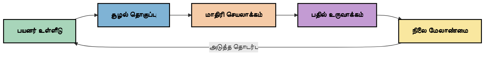
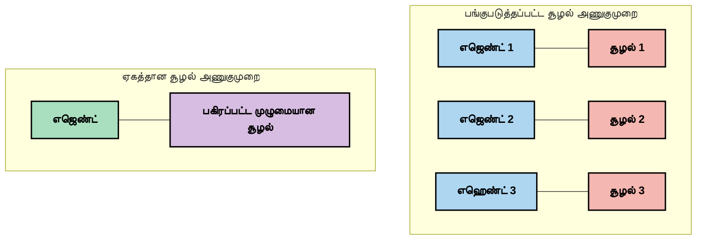
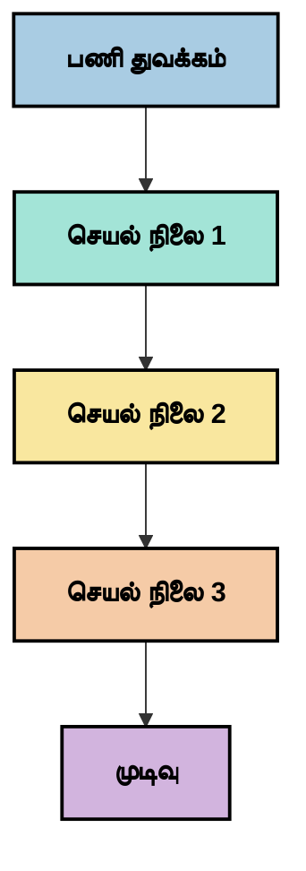
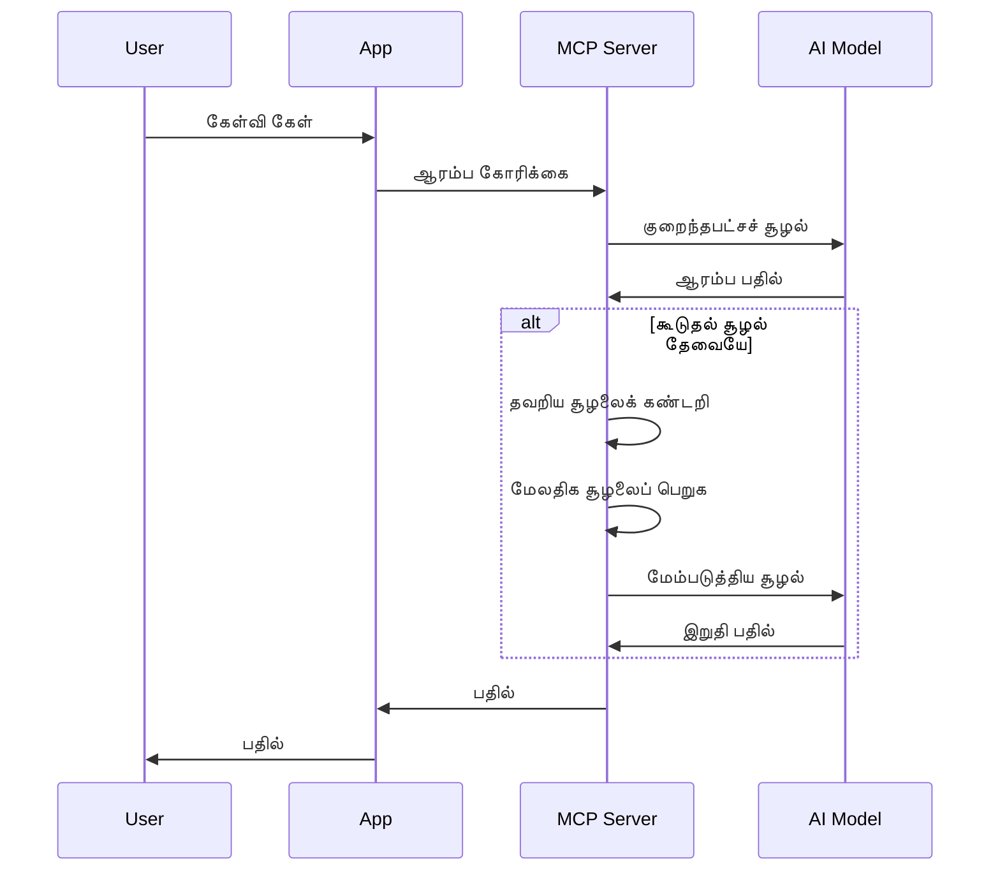
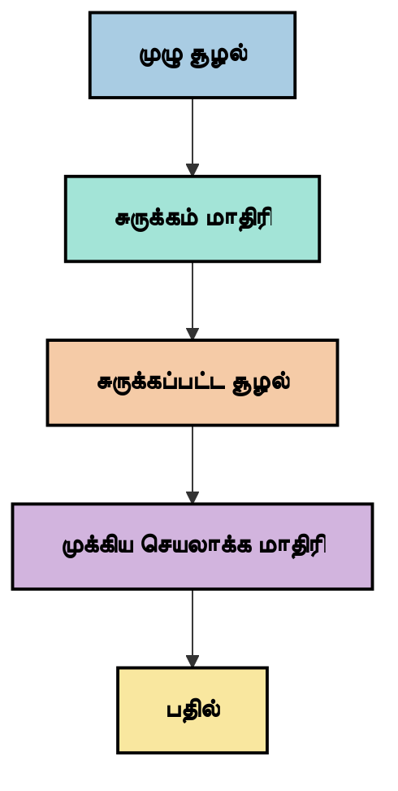
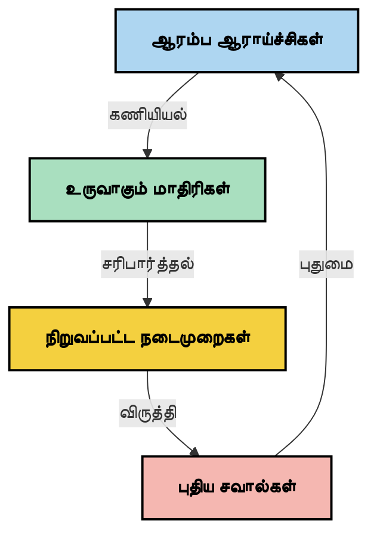

# Context Engineering: MCP சுற்றுச் சூழலின் எழுச்சி அடங்கிய கருத்து

## கண்ணோட்டம்

Context engineering என்பது AI துறையில் எழுது வரும் ஒரு கருத்தாகும், இது தகவல் எவ்வாறு அமைக்கப்படுகின்றது, வழங்கப்படுகின்றது மற்றும் கிளையன்ட்களுக்கும் AI சேவைகளுக்கும் இடையேயான தொடர்புகளின் முழுமையான காலத்திலும் எப்படி பராமரிக்கப்படுகிறது என்பதைக் கண்காணிக்கிறது. Model Context Protocol (MCP) சுற்றுச் சூழல் வளர்ந்து கொண்டிருக்கும் போது, contextஐ திறம்பட நிர்வகிப்பது மிகவும் முக்கியமாகின்றது. இந்த தொகுப்பு context engineering என்ற கருத்தை அறிமுகப்படுத்துகிறது மற்றும் MCP செயலாக்கங்களில் அதன் சாத்தியமான பயன்பாடுகளை ஆராய்கிறது.

## கற்றல் குறிக்கோள்கள்

இந்த தொகுப்பின் இறுதியில், நீங்கள்:

- context engineering என்ற எழுச்சி அடைந்த கருத்தையும் அதன் MCP செயலிகளுக்கு வாய்ப்புள்ள பங்கையும் புரிந்துகொள்ள
- MCP புரோட்டோக்கால் வடிவமைப்பால் சமாளிக்கப்படும் context நிர்வகிப்பில் முக்கிய சவால்களை அடையாளம் காண
- மேம்பட்ட context கையாள்வதன் மூலம் மாடல் செயல்திறனை மேம்படுத்தும் நுட்பங்களை ஆய்வு செய்ய
- context பயன்முறையை அளவிடுவதற்கும் மதிப்பீடு செய்வதற்குமான அணுகுமுறைகளை பரிசீலிக்க
- இத்தகைய எழுச்சி அடைந்த கருத்துக்களை MCP கட்டமைப்பின் மூலம் AI அனுபவங்களை மேம்படுத்த பயன்படுத்த

## Context Engineering அறிமுகம்

Context engineering என்பது பயனர்கள், பயன்பாடுகள் மற்றும் AI மாடல்களிடையே தகவல் பாய்ச்சலின் தீவிர வடிவமைப்பிற்கும் நிர்வகிப்பிற்குமான எழுச்சி அடைந்த கருத்தாகும். prompt engineering போன்ற நிர்ணயிக்கப்பட்ட துறைகள் போல அல்லாமல், context engineering இன்னும் நடைமுறை செயல்பாட்டாளர்களால் வரையறுக்கப்பட்டு வருகிறது, ஏனெனில் AI மாடல்களுக்கு சரியான நேரத்தில் சரியான தகவலை வழங்கும் தனித்துவ சவால்களை அவர்கள் தீர்க்க முயல்கின்றனர்.

பெரிய மொழி மாடல்கள் (LLMs) வளர்ந்ததுடன், context இன் முக்கியத்துவம் அதிகரித்துள்ளது. நாம் வழங்கும் context இன் தரம், பொருத்தம் மற்றும் அமைப்பு நேரடியாக மாடல் விளைவுகளை பாதிக்கிறது. Context engineering இந்த உறவை ஆராய்ந்து திறம்பட context நிர்வகிப்பிற்கான 원칙ங்களை உருவாக்க seeks செய்கிறது.

> "2025 ஆம் ஆண்டில், அங்கு உள்ள மாடல்கள் மிகவும் புத்திசாலிகள். ஆனால் மிகுந்த அறிவுள்ள மனிதருக்காக கூட, அவர்களுக்கு கேட்டுக்கொள்ளப்பட்ட காரியத்தின் context இல்லாமல் தங்கள் வேலையை சிறப்பாக செய்ய முடியாது... 'Context engineering' என்பது அடுத்த நிலை prompt engineering ஆகும். இது ஒரு dynamic அமைப்பில் தானாக செய்யும் பணியை குறிக்கிறது." — வால்டன் யான், Cognition AI

Context engineering பின்வரும் அம்சங்களை உள்ளடக்கக்கூடும்:

1. **Context தேர்வு**: ஒரு காரியத்திற்கு பொருத்தமான தகவலை தீர்மானித்தல்
2. **Context அமைத்தல்**: மாடலின் புரிதலை அதிகரிப்பதற்காக தகவலை ஒழுங்குபடுத்துதல்
3. **Context வழங்குதல்**: தகவல் எப்போது மற்றும் எப்படி மாடலுக்கு அனுப்பப்படும் என்பதை மேம்படுத்தல்
4. **Context பராமரிப்பு**: காலக்கட்டத்தின்போது context நிலை மற்றும் முறையை நிர்வகித்தல்
5. **Context மதிப்பீடு**: context பயன்முறையை அளவிடுதல் மற்றும் மேம்படுத்துதல்

இந்த கவனம் MCP சுற்றுச் சூழலுக்கு மிக பொருத்தமாகும், ஏனெனில் அது பயன்பாடுகள் LLM களுக்கு context வழங்க ஒரு தரநிலையினை வழங்குகிறது.

## Context பயணக் கோணத்தில் பார்வை

Context engineering ஐப் பார்ப்பதற்கு ஒரு வழி, தகவல் MCP அமைப்பில் பயணம் செய்யும் வழியை தடம் பார்க்கும் முறையாக உள்ளது:



### Context பயணத்தில் முக்கிய கட்டங்கள்:

1. **பயனர் உள்ளீடு**: பயனரிடமிருந்து பெறப்படும் அசல் தகவல் (உரை, படங்கள், ஆவணங்கள்)
2. **Context அசெம்பிளி**: பயனர் உள்ளீடு, அமைப்பு context, உரையாடல் வரலாறு மற்றும் பிற மீட்டெடுக்கப்பட்ட தகவலை ஒன்றிணைத்தல்
3. **மாடல் செயலாக்கம்**: AI மாடல் இணைந்த context ஐ செயலாக்குகிறது
4. **பதில் உருவாக்கம்**: வழங்கப்பட்ட context அடிப்படையில் விளைவுகளை உருவாக்கல்
5. **நிலைத்தன்மை நிர்வாகம்**: தொடர்புகளின் அடிப்படையில் அமைப்பு உள்ளக நிலையை புதுப்பித்தல்

இந்த பார்வை context இன் இயக்கமயமான தன்மையை AI அமைப்புகளுக்கு வெளிப்படுத்துகிறது மற்றும் தகவலை ஒவ்வொரு கட்டத்திலும் சிறப்பாக நிர்வகிப்பதற்கான முக்கிய கேள்விகளை எழுப்புகிறது.

## Context Engineering இல் எழுச்சி அடைந்த 원칙ங்கள்

Context engineering துறையின் உருவாக்கத்தில், சில ஆரம்ப 원칙ங்கள் நடைமுறை நிபுணர்களிடமிருந்து தோன்றக்கூடுகின்றன. இந்த 원칙ங்கள் MCP செயலாக்கத் தேர்வுகளில் உதவக்கூடும்:

### 원칙ம் 1: Context ஐ முழுமையாக பகிரவும்

ஒரு அமைப்பின் அனைத்து கூறுகளுக்குமிடையிலும் context முற்றிலும் பகிரப்பட வேண்டும், பல்வேறு மாநிலங்களாகப் பிரிக்கப்பட்டதாக இருக்கக் கூடாது. context விநியோகம் செய்யப்படும் போது, உள்ளோரின் முடிவுகள் ஒருவருடன் மோதலாம்.



MCP செயலிகள், context முழுமையாக முழு குழாயில் பிரிவற்றென்றுபோக வேண்டும் என அமைப்புகளை வடிவமைக்க வேண்டியது இதை குறிப்பதாகும்.

### 원칙ம் 2: செயல்கள் நிந்திக்கப்பட்ட முடிவுகளைக் கொண்டுள்ளன என்று அறியவும்

ஒரு மாடல் எடுக்கும每டி context ஐ புரிந்துகொள்ளுவதற்கான நிந்திக்கப்பட்ட முடிவுகளை உடையதாக இருக்கும். பல கூறுகள் வெவ்வேறு context களின் அடிப்படையில் செயல்படும் போது, இந்நிந்திக்கப்பட்ட முடிவுகள் மோதலாம், அதனால் பொருந்தாத விளைவுகள் உருவாகலாம்.

இந்த 원칙ம் MCP செயலிகளுக்கு முக்கிய தாக்கங்களை கொண்டுள்ளது:
- சிக்கலான பணிகளை வரிசைப்படுத்தி செயலாக்குவதில் தொடர் செயலாக்கத்தை முன்னுரிமை அளிக்கவும்
- அனைத்து முடிவு புள்ளிகளுக்கும் ஒரே context தகவல் கிடைக்க வேண்டும்
- பின்னர் செயல்கள் முன் முடிவுகளின் முழு context ஐ பார்வையிடக்கூடிய அமைப்புகளை வடிவமைக்கவும்

### 원칙ம் 3: Context ஆழத்தையும் விண்டோ வரம்புகளுடனும் சமநிலை பேணவும்

உரையாடல்கள் மற்றும் செயல்முறைகள் நீளமாகும் போது, context விண்டோக்கள் நிறைவுக்கு வருகிறது. முழுமையான context மற்றும் தொழில்நுட்ப வரம்புகளுக்கிடையில் உள்ள இக்கட்டுப்பாட்டை நிர்வகிக்க முறைகளை ஆராய context engineering முயல்கிறது.

முன்னிலை அணுகுமுறைகள்:

- token பயன்படுத்துதலை குறைத்து அவசியமான தகவலைச் சேமிக்கும் context குறைப்பு
- தற்போதைய தேவைகளுக்கு பொருத்தமான context முறைப்படி தொடர்ந்து ஏற்றுதல்
- முக்கிய முடிவுகள் மற்றும் விஷயங்களை பாதுகாக்கும் முன் உரையாடல்களின் சுருக்கம்

## Context சவால்கள் மற்றும் MCP புரோட்டோக்கால் வடிவமைப்பு

Model Context Protocol (MCP) context நிர்வகிப்பதில் தனித்துவமான சவால்களை மனதில் கொண்டு வடிவமைக்கப்பட்டது. இந்த சவால்களை புரிந்துகொள்வது MCP புரோட்டோக்கால் வடிவமைப்பின் முக்கிய அம்சங்களை விளக்குகிறது:

### சவால் 1: Context விண்டோ வரம்புகள்

அதிகபட்சம் வடிவமைக்கப்பட்ட context விண்டோ அளவுகள் பெரும்பாலான AI மாடல்களுக்கு உள்ளன, இது ஒரே நேரத்தில் கணக்கிட முடியும் தகவலின் அளவை கட்டுப்படுத்துகிறது.

**MCP வடிவமைப்பு பதில்:**
- கட்டமைக்கப்பட்ட, வள சார்ந்த context ஐ விளக்குவதற்கு ஆதரவு
- வளங்கள் பக்கவிளக்கமாகவும் முன்னேற்றமாக ஏற்றப்படவும் முடியும்

### சவால் 2: பொருத்தத்தை தீர்மானித்தல்

context உட்படப்படும் தகவல்களில் எந்ததானது மிகத் தொடர்புடையது என்பதை தீர்மானிப்பது கடினம்.

**MCP வடிவமைப்பு பதில்:**
- தேவையின் அடிப்படையில் கொளுத்தும் தகவலை இயக்கக்கூடிய எடுப்பு கருவிகள்
- ஒருமுறை செய்யப்பட்ட context அமைப்புக்கு உதவும் கட்டமைக்கப்பட்ட promptகள்

### சவால் 3: Context நிலைத்தன்மை

இணையுறவுகளுக்கு இடையிலான context நிலையை கவனமாக கண்காணிக்க வேண்டிய அவசியம்.

**MCP வடிவமைப்பு பதில்:**
- நிலையான அமர்வு நிர்வாகம்
- context மாற்றம் தொடர்பு செயல்பாட்டு முறைமைகள் தெளிவாக வரையறுக்கப்பட்டுள்ளன

### சவால் 4: பன்முக context

பல்வகை தரவுகள் (உரை, படம், கட்டமைக்கப்பட்ட தரவு) வேறுபட்ட கையாள்வை தேவைப்படுத்துகின்றன.

**MCP வடிவமைப்பு பதில்:**
- பன்முக உள்ளடக்க வகைகளுக்கு ஏற்ப புரோட்டோக்கால் வடிவமைப்பு
- பன்முக தகவல்களின் நிலையான பிரதிநிதித்துவம்

### சவால் 5: பாதுகாப்பு மற்றும் தனியுரிமை

context பொதுவாக நுண்ணறிவு தகவல்களை கொண்டிருக்கும், அதனால் பாதுகாப்பு தேவைப்படும்.

**MCP வடிவமைப்பு பதில்:**
- கிளையன்ட் மற்றும் சர்வர் பொறுப்புகளுக்கிடையில் தெளிவான எல்லைகள்
- தரவு வெளிப்படுவதை குறைக்க உள்ளூர் செயலாக்கத்துக்கான விருப்பங்கள்

இந்த சவால்கள் மற்றும் MCP எப்படி அவற்றை கொண்டாடுகின்றது என்பதை புரிந்து கொள்வது context engineering நுட்பங்களில் விரிவடைய ஒரு அடித்தளத்தை வழங்குகிறது.

## Context Engineering இல் எழுச்சி அடைந்த அணுகுமுறைகள்

Context engineering துறை ஒழுங்கு பெறும் போது, பல நம்பகமான அணுகுமுறைகள் தோன்றுகின்றன. இவை தற்போது நிலையான சிறந்த நடைமுறைகள் அல்ல, ஆனால் MCP செயல்பாட்டில் அனுபவம் பெறுவதன் மூலம் அவை மேம்படும்.

### 1. ஒரே திரையில் நேரிடைக் கட்டமைப்பான செயலாக்கம்

context-ஐ பகிர்ந்தளிக்கும் பல முகவர் வடிவமைப்புகளுக்கு மாறாக, சில நடைமுறை நிபுணர்கள் ஒரே திரையில் நேரிடையாக செயலாக்குவது ஒருங்கிணைந்த பாதிப்புகளைக் கொடுக்கிறது என கண்டுபிடிக்கின்றனர். இது ஒற்றுமையான context பராமரிப்பின் 원칙த்துடன் இணைகிறது.



இத்தகைய அணுகுமுறை சப்ளிடப்பட்ட செயல் படிகளுக்கு திருப்பில் குறைவாகத் தோன்றினாலும், கடந்த முடிவுகளின் முழுமையான புரிதலை அடிப்படையாக கொண்டு ஒவ்வொரு கட்டமும் கட்டமைக்கப்படுவதால் பொதுவாக ஒருங்கிணைந்த மற்றும் நம்பத்தக்க விளைவுகளை தரும்.

### 2. Context துண்டாக்கல் மற்றும் முன்னுரிமை அளித்தல்

பெரிய context களை பராமரிக்கப்பட்ட பகுதிகளாகப் பகுக்கி அவற்றில் முக்கியமானவை என நிர்ணயித்தல்.

```python
# கருத்துச் சித்தாந்த உதாரணம்: சூழல் துண்டாக்கல் மற்றும் முன்னுரிமை நிர்ணயம்
def process_with_chunked_context(documents, query):
    # 1. ஆவணங்கள் சிறு துண்டுகளாக பிரிக்கவும்
    chunks = chunk_documents(documents)
    
    # 2. ஒவ்வொரு துண்டுக்கும் பொருத்தத்திற்கான மதிப்பெண்கள் கணக்கிடவும்
    scored_chunks = [(chunk, calculate_relevance(chunk, query)) for chunk in chunks]
    
    # 3. பொருத்த மதிப்பெண்களின் அடிப்படையில் துண்டுகளை வரிசைப்படுத்தவும்
    sorted_chunks = sorted(scored_chunks, key=lambda x: x[1], reverse=True)
    
    # 4. மிகவும் பொருத்தமான துண்டுகளை சூழலாக பயன்படுத்தவும்
    context = create_context_from_chunks([chunk for chunk, score in sorted_chunks[:5]])
    
    # 5. முன்னுரிமை பெற்ற சூழலை கொண்டு செயலாக்கவும்
    return generate_response(context, query)
```

மேலே உள்ள கருத்து, பெரிய ஆவணங்களை பராமரிப்பதற்கான துண்டுகளாகப் பிரித்து பொருத்தமான பகுதிகளை மட்டும் context க்களுக்காக தேர்ந்தெடுக்கும் முறையை விளக்குகிறது. இதனால் context விண்டோ வரம்புகளுக்குள் இருந்தும் பெரிய அறிவுத்தளங்களை பயன்படுத்த முடியும்.

### 3. முறையாக context ஏற்றுதல்

context ஐ அனைத்தும் ஒரே நேரத்தில் ஏற்றாமல் தேவைக்கு ஏற்ப படிப்படியாக ஏற்றுதல்.



முறையாக context ஏற்றுதல் குறைந்த context கொண்டு ஆரம்பித்து, அவசியம் ஏற்பட்டால் அது விரிவடைகிறது. இது எளிதான கேள்விகளுக்கு token பயன்பாட்டை குறைக்க உதவுகிறது, அதேசமயம் சிக்கலான கேள்விகளை கையாளும் திறனையும் காக்கிறது.

### 4. Context குறைப்பு மற்றும் சுருக்கம்

பரவலான தகவலை குறைத்து அவசியமான தகவலை பாதுகாத்தல்.



Context குறைப்பில் கவனம் செலுத்தப்படுவது:
- அதிகமான தகவலை அகற்றுதல்
- நீண்ட உள்ளடக்கத்தை சுருக்குதல்
- முக்கிய உண்மைகள் மற்றும் விவரங்களை எடுத்துக் கொண்டல்
- தீர்மானமான context கூறுகளை பாதுகாத்தல்
- token பயன்பாட்டுக்கு எழுச்சி அளித்தல்

இத்தகைய அணுகுமுறை context விண்டோவில் நீண்ட உரையாடலை பராமரிப்பதற்கும் பெரிய ஆவணங்களை திறம்பட செயலாக்குவதற்கும் மதிப்பிடத்தக்கது. சில நடைமுறை நிபுணர்கள் உரையாடல் வரலாறின் context குறைப்பிற்கும் சுருக்கத்திற்கும் தனித்துவ மாடல்களைப் பயன்படுத்துகின்றனர்.

## Context Engineering ஆராய்ச்சிக் கருத்துகள்

Context engineering இல் ஆராயும் போது, MCP செயல்பாட்டில் பணியாற்றும் போது பரிசீலிப்பதற்குரிய சில கருத்துக்கள் உள்ளன. இவை கட்டாயமான சிறந்த நடைமுறைகள் அல்ல, உங்கள் தனிப்பட்ட பயன்பாட்டை மேம்படுத்தக்கூடிய ஆராய்ச்சி பகுதிகள்:

### உங்கள் context இலக்குகளை பரிசீலிக்கவும்

சிக்கலான context நிர்வகிப்பு தீர்வுகளை செயல்படுத்துவதற்கு முன், நீங்கள் எதை அடைய முயல்கிறீர்கள் என்பதை தெளிவாக உரைமொழியில் விவரிக்கவும்:
- மாடல் வெற்றிகரமாக செயல்பட எந்த குறிப்பிட்ட தகவல் அவசியம்?
- எந்த தகவல் அவசியமோ, எந்தது கூடுதல்?
- உங்கள் செயல்திறன் கட்டுப்பாடுகள் (தாமதம், token வரம்புகள், செலவுகள்) என்ன?

### அடுக்கப்பட்ட context அணுகுமுறைகளை ஆராயவும்

சில நடைமுறை நிபுணர்கள் கருத்துக்களில் context ஐ நிலைகளால் ஒழுங்குபடுத்து வெற்றி காண்கின்றனர்:
- **மைய layer**: மாடல் எப்போதும் பெற வேண்டிய அவசியமான தகவல்
- **நிலை layer**: தற்போதைய தொடர்புக்கான context
- **சகாய layer**: கூடுதல் உதவக்கூடிய தகவல்கள்
- **மறுபயன்பாடு layer**: தேவையான பொழுதே அணுகப்படும் தகவல்

### மீட்டெடுப்பு வியூகங்களை ஆய்வு செய்யவும்

context பயன்முறை அதிகமாக நீங்கள் எவ்வாறு தகவலை மீட்டெடுக்கிறீர்கள் என்பதில் உள்ளது:
- கருத்துனைத்தான் தேடல் மற்றும் நிறுவல்கள், கருத்துடனான பொருத்தமான தகவலைக் கண்டுபிடிப்பதற்காக
- விசையுருக்கள் அடிப்படையிலான தேடல் குறிப்பிட்ட உண்மையான விபரங்களை அறிய
- பல மீட்டெடுப்பு முறைகளை ஒன்றுமித்து இணைத்தல்
- வகைகள், தேதிகள் அல்லது வினைகளின் அடிப்படையில் Metadata வடிகட்டி வரம்பு குறைத்தல்

### Context உடன் ஒருங்கிணைக்கும் அனுபவத்தை முயற்சி செய்யவும்

context அமைப்பும் ஓட்டமும் மாடல் புரிதலை பாதிக்கும்:
- தொடர்புடைய தகவல்களை ஒருங்கிணைத்து வைப்பது
- தொடர் வடிவமைப்பும் அமைப்பும் கொண்ட பயன்பாடு
- குறைந்த பட்சமான அசங்கம் அல்லது காலவரிசை நிலை பேணி வைப்பது
- முரணான தகவலை தவிர்ப்பது

### பல முகவரியின்மையமைப்புகளின் வர்த்தகங்களை மதிப்பாய்வு செய்யவும்

பல முகவர் அமைப்புகள் பல AI கட்டமைப்புகளில் பிரபலமாக இருக்கின்றன, ஆனால் context நிர்வகிப்பதில் முக்கிய சவால்களுக்கு வழிவகுக்கின்றன:
- context துண்டாக்கல் முகவரிகளுக்கு இடையேயான முரண்பாடுகளை உண்டாக்கும்
- ஒத்த செயலாக்கம் முரண்பாடுகளை உருவாக்கவும் தூண்டலாம்
- முகவரிகளுக்கு இடையேயான தகவல் தொடர்பு அதிகரிப்பு செயல்திறனைத் தடுக்கும்
- ஒன்றிணைந்த நிலை நிர்வாகம் அவசியம்

பல சந்திப்புகளில் முழுமையான context நிர்வகிப்புடன் ஒரே முகவர் அணுகுமுறை பன்முக முகவரி அமைப்புகளைவிட நம்பகமான முடிவுகளை தரக்கூடும்.

### மதிப்பீட்டு முறைகளை வடிவமைக்கவும்

context engineering காலக்கட்டத்தில் மேம்படுத்த, நீங்கள் வெற்றி அளவிட எப்படி என்பதை தயார் செய்யவும்:
- வெவ்வேறு context கட்டமைப்புகளின் A/B சோதனை
- token பயன்பாடு மற்றும் பதில் காலம் கண்காணித்தல்
- பயனர் திருப்தி மற்றும் காரிய நிறைவு வாரியான கண்காணிப்பு
- context அணுகுமுறைகள் தோல்வியடையும் காரணங்களை பகுப்பாய்வு செய்தல்

இந்த கருத்துக்கள் context engineering தளத்தில் செயலில் இருக்கும் ஆராய்ச்சித் பகுதிகளை பிரதிநிதித்துவம் செய்கின்றன. துறை பெரியவராகும் பொழுது, மேலதிக Fix செய்யப்பட்ட மாதிரிகள் தோன்றும்.

## Context பயன்முறையை அளவிடுதல்: மேம்படும் கட்டமைப்பு

Context engineering எழுச்சி அடைந்ததாகும் போது, பயன்முறையை எவ்வாறு அளவிடுவது என்பதை நிபுணர்கள் ஆராய்ச்சியில் ஈடுபடி வருகின்றனர். நிலையான கட்டமைப்பு இன்னும் கிடையாது, ஆனால் பல அளவீடுகள் எதிர்கால பணிக்கு வழிகாட்டக்கூடியவையாக கருதப்படுகின்றன.

### சாத்தியமான அளவீட்டு பரிமாணங்கள்


#### 1. உள்ளீட்டு திறன் பரிசீலனைகள்

- **Context-க்கு எதிரான பதில் விகிதம்**: பதிலின் அளவுக்கு ஒப்பிடுகையில் எவ்வளவு context தேவை?
- **Token பயன்பாடு**: வழங்கப்பட்ட context token களில் எத்தனைப் பங்கு பதிலுக்கு சென்று விளைவிக்கின்றது?
- **Context குறைப்பு**: நெருக்கமான தகவலை எவ்வாறு குறைத்துக் கொள்ள முடியும்?

#### 2. செயல்திறன் பரிசீலனைகள்

- **தாமத தாக்கம்**: context நிர்வகிப்பு பதிலளிக்கும் நேரத்தை எவ்வாறு பாதிக்கிறது?
- **Token பொருளாதாரம்**: token பயன்பாட்டில் நாங்கள் சிறந்த முறையில் இருக்கிறோமா?
- **மீட்டெடுப்பு துல்லியம்**: மீட்டெடுக்கப்பட்ட தகவல் எவ்வளவு தொடர்புடையது?
- **வளம் பயன்பாடு**: எவ்வளவு கணினி வளங்கள் தேவை?

#### 3. தர பரிசீலனைகள்

- **பதில் தொடர்பு**: பதில் கேள்வியை எவ்வளவு நன்கு தொட்டுள்ளது?
- **அறிவுத்தன்மை உண்மைதன்மை**: context நிர்வகிப்பு உண்மையை மேம்படுத்துகிறதா?
- **தொடர்புத்தன்மை**: ஒத்த கேள்விகளில் பதில்கள் ஒரே மாதிரிதானா?
- **மாயை ஏற்படும் விகிதம்**: சிறந்த context மாடல் மாயை ஏற்படுத்தலை குறைப்பதா?

#### 4. பயனர் அனுபவ பரிசீலனைகள்

- **உயர்வு விகிதம்**: பயனர்கள் எவ்வளவு நேரம் தெளிவான விளக்கத்தை தேடுகின்றனர்?
- **காரிய நிறைவு**: பயனர்கள் தங்களது இலக்குகளை வெற்றிகரமாக அடைகிறார்களா?
- **திருப்தி குறியீடுகள்**: பயனர்கள் தங்கள் அனுபவத்தை எவ்வாறு மதிப்பிடுகின்றனர்?

### அளவீட்டிற்கான ஆராய்ச்சிப் பாணிகள்

MCP செயல்பாட்டில் context engineering முயற்சிக் காலத்தில், பின்வரும் ஆராய்ச்சிப் பாணிகளை பரிசீலிக்கவும்:

1. **அடிப்படை ஒப்பீடுகள்**: எளிமையான context அணுகுமுறைகளுடன் அடிப்படையை உருவாக்கி பின்னர் மேம்பட்ட முறைகளை சோதனை செய்க

2. **சிறு மாற்றங்கள்**: ஒரு நேரத்தில் context நிர்வகிப்பில் ஒரு அம்சத்தை மாற்றி அதன் தாக்கத்தை தனித்தனியாக ஆய்வு செய்க

3. **பயனர் மையமான மதிப்பீடு**: அளவிடும் அளவுகள் மற்றும் பயனர் கருத்துக்களை ஒன்றிணைத்து மதிப்பீடு செய்க

4. **தோல்வி பகுப்பாய்வு**: context நடைமுறைகள் தோல்வியடைகின்ற சூழ்நிலைகளை ஆய்வு செய்து மேம்படுத்தல் தேடுக

5. **பல்விமான மதிப்பீடு**: திறன், தரம் மற்றும் பயனர் அனுபவம் ஆகியவற்றிற்கிடையிலான வர்த்தகத்திறன் பரிசீலனை

இந்த பரிசீலனைகள் context engineering எழுச்சியின் தன்மையுடன் சீராய்ந்து உள்ளது.

## முடிவுரை

context engineering என்பது MCP செயலிகளை திறம்பட நிர்வகிப்பதில் முக்கியமாக விளங்கக்கூடிய எழுச்சி அடைந்த ஆராய்ச்சி துறை. உங்கள் அமைப்பில் தகவல் எவ்வாறு பாய்கிறது என்பதை கவனமாக பரிசீலித்து, நீங்கள் இ பண்புகளை சிறப்பு, துல்லியமான மற்றும் பயனர்களுக்கு மதிப்பு வாய்ந்த AI அனுபவங்களாக உருவாக்க முடியும்.

இந்த தொகுப்பில் விளக்கும் நுட்பங்கள் மற்றும் அணுகுமுறைகள் இதுவரை நிலையான நடைமுறைகள் அல்ல; அது மாற்றக்கூடிய மற்றும் AI திறன்கள் வளர்ந்தபிறகு மேலதிக நிர்ணயிக்கப்பட்ட துறையாக மாறக்கூடும். தற்போது சோதனை மற்றும் கவனமான அளவீடு மிகச் சிறந்த அணுகுமுறை எனும் நிலைப்பாட்டில் இருக்கிறது.

## எதிர்கால சாத்தியமான திசைகள்

context engineering துறை இன்னும் ஆரம்ப கட்டத்தில் இருந்தாலும், சில நம்பகமான திசைகள் தோன்றிக்கொண்டு உள்ளன:

- context engineering 원칙ங்கள் மாடல் செயல்திறன், திறமை, பயனர் அனுபவம் மற்றும் நம்பகத்தன்மையில் முக்கிய தாக்கம் ஏற்படுத்தக்கூடும்
- முழுமையான context நிர்வகிப்புடன் ஒரே திரை அணுகுமுறைகள் பல முகவர் அமைப்புகளைவிட பல பயன்பாடுகளுக்கு மேல் செயல்திறனைக் கொடுக்கக்கூடும்
- context குறைப்பிற்கு திறமையான மாடல்கள் AI குழாய்களில் நிலையான கூறுகளாக மாறக்கூடும்
- context முழுமைத்தன்மை மற்றும் token வரம்புகளுக்கிடையேயான கட்டுப்பாடு context கையாள்வில் புதுமைகளை தூண்டும்
- மாடல்கள் மனிதபோன்ற திறமையான தொடர்பில் திறனை வளர்ப்பதால், நிஜபல முகவர் ஒத்துழைப்பு சாத்தியமாக இருக்கும்
- MCP செயலாக்கங்கள் தற்போதைய ஆராய்ச்சியில் தோன்றும் context நிர்வகிப்பு மாதிரிகளை தரநிலைப்படுத்தும் திசையில் மேம்படும்



## மூலங்கள்

### அதிகாரப்பூர்வ MCP மூலங்கள்
- [Model Context Protocol Website](https://modelcontextprotocol.io/)
- [Model Context Protocol Specification](https://github.com/modelcontextprotocol/modelcontextprotocol)
- [MCP ஆவணங்கள்](https://modelcontextprotocol.io/docs)
- [MCP C# SDK](https://github.com/modelcontextprotocol/csharp-sdk)
- [MCP Python SDK](https://github.com/modelcontextprotocol/python-sdk)
- [MCP TypeScript SDK](https://github.com/modelcontextprotocol/typescript-sdk)
- [MCP இன்ஸ்பெக்டர்](https://github.com/modelcontextprotocol/inspector) - MCP சர்வர்களுக்கான பார்வை சோதனை கருவி

###Context Engineering கட்டுரைகள்
- [பல முகவரிகளை கட்ட வேண்டாம்: Context Engineering நெறிமுறைகள்](https://cognition.ai/blog/dont-build-multi-agents) - ஒவ்வொரு சுட்டியும் Context Engineering நெறிமுறைகள் குறித்து வால்டன் யானின்洞察ங்கள்
- [ஏஜெண்ட்கள் உருவாக்க ஒரு நடைமுறை வழிகாட்டி](https://cdn.openai.com/business-guides-and-resources/a-practical-guide-to-building-agents.pdf) - செயல்படுத்தக்கூடிய ஏஜெண்ட் வடிவமைப்புக்கான OpenAI வழிகாட்டி
- [பயனுள்ள ஏஜெண்ட்கள் உருவாக்குவது](https://www.anthropic.com/engineering/building-effective-agents) - ஏஜெண்ட் மேம்பாட்டுக்கான Anthropic அணுகுமுறை

### சம்பந்தமான ஆய்வுகள்
- [பெரிய மொழி மாதிரிகளுக்கான இயக்கூக மீட்பு மேம்பாடு](https://arxiv.org/abs/2310.01487) - இயக்கூக மீட்பு அணுகுமுறைகள் பற்றிய ஆய்வு
- [நடுத்தரையில் தொலைவு: மொழி மாதிரிகள் நீண்ட Context-ஐ எப்படி பயன்படுத்துகின்றன](https://arxiv.org/abs/2307.03172) - Context செயலாக்க பாணிகள் பற்றிய முக்கிய ஆய்வு
- [CLIP Latents உடன் முறையே பட வேறு படிம உருவாக்கம்](https://arxiv.org/abs/2204.06125) - DALL-E 2 ஆவணம் context கட்டமைப்பின்洞察ங்களுடன்
- [பெரிய மொழி மாதிரி கட்டமைப்புகளில் Context பங்கு ஆராய்ச்சி](https://aclanthology.org/2023.findings-emnlp.124/) - சமீபத்திய என்னும் context கையாள்வதில் ஆய்வு
- [பல ஏஜெண்ட் ஒத்துழைப்பு: ஒரு ஆய்வு](https://arxiv.org/abs/2304.03442) - பல ஏஜெண்ட் முறை மற்றும் அவற்றின் சவால்கள் பற்றிய ஆய்வு

### கூடுதல் வளங்கள்
- [Context சாளரம் உத்திகள் மேம்பாடு](https://learn.microsoft.com/en-us/azure/ai-services/openai/concepts/context-window)
- [மேம்படுத்தப்பட்ட RAG உத்திகள்](https://www.microsoft.com/en-us/research/blog/retrieval-augmented-generation-rag-and-frontier-models/)
- [Semantic Kernel ஆவணங்கள்](https://github.com/microsoft/semantic-kernel)
- [Context மேலாண்மைக்கான AI கருவி தொகுப்பு](https://github.com/microsoft/aitoolkit)

## அடுத்தது என்ன

- [5.15 MCP தனிப்பயன் போக்குவரத்து](../mcp-transport/README.md)

---

<!-- CO-OP TRANSLATOR DISCLAIMER START -->
**மறுப்பு**:
இந்த ஆவணம் AI மொழிபெயர்ப்பு சேவை [Co-op Translator](https://github.com/Azure/co-op-translator) பயன்படுத்தி மொழிபெயர்க்கப்பட்டுள்ளது. நாங்கள் துல்லியத்திற்காக முயற்சி செய்துள்ளோம், ஆனால் தானாக செய்யப்படும் மொழிபெயர்ப்புகளில் பிழைகள் அல்லது தவறுகள் இருக்கலாம் என்பதை கவனத்தில் கொள்ளவும். அசல் ஆவணம் அதன் தாய்மொழியில் அதிகாரப்பூர்வ ஆதாரமாக கருதப்பட வேண்டும். முக்கியமான தகவல்களுக்கு, தொழில்நுட்பமான மனித மொழிபெயர்ப்பு பரிந்துரைக்கப்படுகிறது. இந்த மொழிபெயர்ப்பைப் பயன்படுத்துவதால் ஏற்படும் எந்த தவறான புரிதல்கள் அல்லது தவறான விளக்கத்திற்கும் நாங்கள் பொறுப்பில்வில்லை.
<!-- CO-OP TRANSLATOR DISCLAIMER END -->