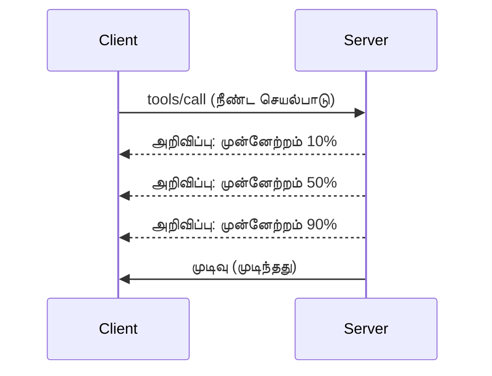

# MCP தொகுப்பு அம்சங்கள் விரிவான ஆய்வு

இந்த வழிகாட்டி அடிப்படை கருவி மற்றும் வளங்களை கையாள்வதற்கு அப்பாற்பட்டு உயர் MCP தொகுப்பு அம்சங்களை ஆராய்கிறது. இந்த அம்சங்களை புரிந்துகொள்வது, நீங்கள் மிகவும் வலுவான, பயனர் நட்பு மற்றும் தயாரிப்பு தயார் MCP சேவையகங்களை உருவாக்க உதவுகிறது.

> **எதிர்பார்த்தல்:** `2026-07-28` வெளியீட்டு வேட்பாளர் பதிவு தானியங்கி (Logging primitive) முறையை அப்புறப்படுத்துகிறது (`stderr` ஐ stdio க்கும், OpenTelemetry ஐ அமைந்த கண்காணிப்புக்குமானதாகக் கொண்டுள்ளது), கீழே குறிப்பிடப்பட்டுள்ள Server Lifecycle Events இல் உள்ள `initialize`/session மாடலை நீக்குகிறது, மற்றும் பரிசோதனை Tasks அம்சத்தை புதிய `tasks/get`/`tasks/update`/`tasks/cancel` வாழ்க்கைசுற்று கொண்ட தனி Tasks நீட்சியிலே கொண்டு செல்கிறது. விரிவாக காண [MCP இல் மாற்றங்கள்: 2026-07-28 வெளியீட்டு வேட்பாளர்](../../01-CoreConcepts/mcp-2026-07-28-release-candidate.md).

## உள்ளடக்க அம்சங்கள்

1. **முன்னேற்ற அறிவிப்புகள்** - நீண்டநேர செயல்பாடுகளுக்கான முன்னேற்றத்தை அறிவி
2. **விண்ணப்பம் நிறுத்தல்** - கிளையண்ட்களுக்கு நடுவிலுள்ள விண்ணப்பங்களை நிறுத்த அனுமதி
3. **வள அச்சுகள்** - அளவுருக்களுடன் கூடிய தன்னிச்சையான வள URI கள்
4. **சேவையக வாழ்க்கைசுற்று நிகழ்வுகள்** - சரியான ஆரம்பம் மற்றும் நிறுத்துதல்
5. **பதிவு கட்டுப்பாடு** - சேவையக மூலம் பதிவு கட்டமைப்பு
6. **பிழை கையாளும் விதிகள்** - ஒரே விதமான பிழை பதில்கள்

---

## 1. முன்னேற்ற அறிவிப்புகள்

நேரம் எடுத்துக் கொள்ளும் செயல்பாடுகளுக்கு (தரவு செயலாக்கம், கோப்பு பதிவிறக்கம், API அழைப்புகள்) முன்னேற்ற அறிவிப்புகள் பயனர்களை தகவல் கொடுக்கின்றன.

### செயல்பாடு எப்படி உள்ளது



### Python அமல்படுத்தல்

```python
from mcp.server import Server, NotificationOptions
from mcp.types import ProgressNotification
import asyncio

app = Server("progress-server")

@app.tool()
async def process_large_file(file_path: str, ctx) -> str:
    """Process a large file with progress updates."""
    
    # முன்னேற்ற கணக்கீட்டிற்கு கோப்பு அளவைப் பெறுக
    file_size = os.path.getsize(file_path)
    processed = 0
    
    with open(file_path, 'rb') as f:
        while chunk := f.read(8192):
            # துண்டை செயலாக்குக
            await process_chunk(chunk)
            processed += len(chunk)
            
            # முன்னேற்ற அறிவிப்பை அனுப்புக
            progress = (processed / file_size) * 100
            await ctx.send_notification(
                ProgressNotification(
                    progressToken=ctx.request_id,
                    progress=progress,
                    total=100,
                    message=f"Processing: {progress:.1f}%"
                )
            )
    
    return f"Processed {file_size} bytes"

@app.tool()
async def batch_operation(items: list[str], ctx) -> str:
    """Process multiple items with progress."""
    
    results = []
    total = len(items)
    
    for i, item in enumerate(items):
        result = await process_item(item)
        results.append(result)
        
        # ஒவ்வொரு பொருளுக்குப் பிறகும் முன்னேற்றத்தை அறிவிக்குக
        await ctx.send_notification(
            ProgressNotification(
                progressToken=ctx.request_id,
                progress=i + 1,
                total=total,
                message=f"Processed {i + 1}/{total}: {item}"
            )
        )
    
    return f"Completed {total} items"
```

### TypeScript அமல்படுத்தல்

```typescript
import { Server } from "@modelcontextprotocol/sdk/server/index.js";

server.setRequestHandler(CallToolSchema, async (request, extra) => {
  const { name, arguments: args } = request.params;
  
  if (name === "process_data") {
    const items = args.items as string[];
    const results = [];
    
    for (let i = 0; i < items.length; i++) {
      const result = await processItem(items[i]);
      results.push(result);
      
      // முன்னேற்ற அறிவிப்பை அனுப்பவும்
      await extra.sendNotification({
        method: "notifications/progress",
        params: {
          progressToken: request.id,
          progress: i + 1,
          total: items.length,
          message: `Processing item ${i + 1}/${items.length}`
        }
      });
    }
    
    return { content: [{ type: "text", text: JSON.stringify(results) }] };
  }
});
```

### கிளையண்ட் கையாளுதல் (Python)

```python
async def handle_progress(notification):
    """Handle progress notifications from server."""
    params = notification.params
    print(f"Progress: {params.progress}/{params.total} - {params.message}")

# ஹாண்ட்லரை பதிவு செய்க
session.on_notification("notifications/progress", handle_progress)

# கருவியை அழைத்தல் (முன்னேற்ற மேம்பாடுகள் ஹாண்ட்லரின் மூலம் வரும்)
result = await session.call_tool("process_large_file", {"file_path": "/data/large.csv"})
```

---

## 2. விண்ணப்பம் நிறுத்தல்

இன்னும் தேவையில்லாத அல்லது நீண்ட நேரம் எடுத்துக் கொள்கின்ற விண்ணப்பங்களை கிளையண்டுகள் நிறுத்த அனுமதிக்கவும்.

### Python அமல்படுத்தல்

```python
from mcp.server import Server
from mcp.types import CancelledError
import asyncio

app = Server("cancellable-server")

@app.tool()
async def long_running_search(query: str, ctx) -> str:
    """Search that can be cancelled."""
    
    results = []
    
    try:
        for page in range(100):  # பல பக்கங்களில் தேடு
            # இரத்து வேண்டுமா என்று சரிபார்
            if ctx.is_cancelled:
                raise CancelledError("Search cancelled by user")
            
            # பக்கம் தேடலை உண்மையானதாக கற்பனை செய்
            page_results = await search_page(query, page)
            results.extend(page_results)
            
            # சிறிய தாமதம் இரத்துதலைச் சரிபார்க்க உதவும்
            await asyncio.sleep(0.1)
            
    except CancelledError:
        # பகுதி முடிவுகளை திருப்பி விடு
        return f"Cancelled. Found {len(results)} results before cancellation."
    
    return f"Found {len(results)} total results"

@app.tool()
async def download_file(url: str, ctx) -> str:
    """Download with cancellation support."""
    
    async with aiohttp.ClientSession() as session:
        async with session.get(url) as response:
            total_size = int(response.headers.get('content-length', 0))
            downloaded = 0
            chunks = []
            
            async for chunk in response.content.iter_chunked(8192):
                if ctx.is_cancelled:
                    return f"Download cancelled at {downloaded}/{total_size} bytes"
                
                chunks.append(chunk)
                downloaded += len(chunk)
            
            return f"Downloaded {downloaded} bytes"
```

### நிறுத்தல் சூழலை செயல்படுத்துதல்

```python
class CancellableContext:
    """Context object that tracks cancellation state."""
    
    def __init__(self, request_id: str):
        self.request_id = request_id
        self._cancelled = asyncio.Event()
        self._cancel_reason = None
    
    @property
    def is_cancelled(self) -> bool:
        return self._cancelled.is_set()
    
    def cancel(self, reason: str = "Cancelled"):
        self._cancel_reason = reason
        self._cancelled.set()
    
    async def check_cancelled(self):
        """Raise if cancelled, otherwise continue."""
        if self.is_cancelled:
            raise CancelledError(self._cancel_reason)
    
    async def sleep_or_cancel(self, seconds: float):
        """Sleep that can be interrupted by cancellation."""
        try:
            await asyncio.wait_for(
                self._cancelled.wait(),
                timeout=seconds
            )
            raise CancelledError(self._cancel_reason)
        except asyncio.TimeoutError:
            pass  # சாதாரண கால முடிவு, தொடர்க
```

### கிளையண்ட் பக்க நிறுத்தல்

```python
import asyncio

async def search_with_timeout(session, query, timeout=30):
    """Search with automatic cancellation on timeout."""
    
    task = asyncio.create_task(
        session.call_tool("long_running_search", {"query": query})
    )
    
    try:
        result = await asyncio.wait_for(task, timeout=timeout)
        return result
    except asyncio.TimeoutError:
        # கோரிக்கை ரத்து செய்கிறது
        await session.send_notification({
            "method": "notifications/cancelled",
            "params": {"requestId": task.request_id, "reason": "Timeout"}
        })
        return "Search timed out"
```

---

## 3. வள அச்சுகள்

வள அச்சுகள் அளவுருக்கள் கொண்ட தன்னிச்சையான URI கட்டமைப்பை அனுமதிக்கின்றன, API கள் மற்றும் தரவுத்தொகுப்புகளுக்கு பயனுள்ளது.

### அச்சுகள் வரையறை

```python
from mcp.server import Server
from mcp.types import ResourceTemplate

app = Server("template-server")

@app.list_resource_templates()
async def list_templates() -> list[ResourceTemplate]:
    """Return available resource templates."""
    return [
        ResourceTemplate(
            uriTemplate="db://users/{user_id}",
            name="User Profile",
            description="Fetch user profile by ID",
            mimeType="application/json"
        ),
        ResourceTemplate(
            uriTemplate="api://weather/{city}/{date}",
            name="Weather Data",
            description="Historical weather for city and date",
            mimeType="application/json"
        ),
        ResourceTemplate(
            uriTemplate="file://{path}",
            name="File Content",
            description="Read file at given path",
            mimeType="text/plain"
        )
    ]

@app.read_resource()
async def read_resource(uri: str) -> str:
    """Read resource, expanding template parameters."""
    
    # URI-ஐப் பகுப்பாய்வு செய்து அளவுருக்களைப் பெறுதல்
    if uri.startswith("db://users/"):
        user_id = uri.split("/")[-1]
        return await fetch_user(user_id)
    
    elif uri.startswith("api://weather/"):
        parts = uri.replace("api://weather/", "").split("/")
        city, date = parts[0], parts[1]
        return await fetch_weather(city, date)
    
    elif uri.startswith("file://"):
        path = uri.replace("file://", "")
        return await read_file(path)
    
    raise ValueError(f"Unknown resource URI: {uri}")
```

### TypeScript அமல்படுத்தல்

```typescript
server.setRequestHandler(ListResourceTemplatesSchema, async () => {
  return {
    resourceTemplates: [
      {
        uriTemplate: "github://repos/{owner}/{repo}/issues/{issue_number}",
        name: "GitHub Issue",
        description: "Fetch a specific GitHub issue",
        mimeType: "application/json"
      },
      {
        uriTemplate: "db://tables/{table}/rows/{id}",
        name: "Database Row",
        description: "Fetch a row from a database table",
        mimeType: "application/json"
      }
    ]
  };
});

server.setRequestHandler(ReadResourceSchema, async (request) => {
  const uri = request.params.uri;
  
  // GitHub பிரச்சனை URI-ஐ பகுபடுத்தவும்
  const githubMatch = uri.match(/^github:\/\/repos\/([^/]+)\/([^/]+)\/issues\/(\d+)$/);
  if (githubMatch) {
    const [_, owner, repo, issueNumber] = githubMatch;
    const issue = await fetchGitHubIssue(owner, repo, parseInt(issueNumber));
    return {
      contents: [{
        uri,
        mimeType: "application/json",
        text: JSON.stringify(issue, null, 2)
      }]
    };
  }
  
  throw new Error(`Unknown resource URI: ${uri}`);
});
```

---

## 4. சேவையக வாழ்க்கைசுற்று நிகழ்வுகள்

சரியான துவக்க மற்றும் நிறுத்தலால் வள மேலாண்மை சுத்தமாகும்.

### Python வாழ்க்கைசுற்று மேலாண்மை

```python
from mcp.server import Server
from contextlib import asynccontextmanager

app = Server("lifecycle-server")

# பகிரப்பட்ட நிலை
db_connection = None
cache = None

@asynccontextmanager
async def lifespan(server: Server):
    """Manage server lifecycle."""
    global db_connection, cache
    
    # துவக்கம்
    print("🚀 Server starting...")
    db_connection = await create_database_connection()
    cache = await create_cache_client()
    print("✅ Resources initialized")
    
    yield  # சேவையகம் இங்கு இயக்கப்படுகிறது
    
    # முடக்கம்
    print("🛑 Server shutting down...")
    await db_connection.close()
    await cache.close()
    print("✅ Resources cleaned up")

app = Server("lifecycle-server", lifespan=lifespan)

@app.tool()
async def query_database(sql: str) -> str:
    """Use the shared database connection."""
    result = await db_connection.execute(sql)
    return str(result)
```

### TypeScript வாழ்க்கைசுற்று

```typescript
import { Server } from "@modelcontextprotocol/sdk/server/index.js";

class ManagedServer {
  private server: Server;
  private dbConnection: DatabaseConnection | null = null;
  
  constructor() {
    this.server = new Server({
      name: "lifecycle-server",
      version: "1.0.0"
    });
    
    this.setupHandlers();
  }
  
  async start() {
    // வளங்களை துவங்கு
    console.log("🚀 Server starting...");
    this.dbConnection = await createDatabaseConnection();
    console.log("✅ Database connected");
    
    // சேவையகத்தை துவங்கு
    await this.server.connect(transport);
  }
  
  async stop() {
    // வளங்களை சுத்தப்படுத்து
    console.log("🛑 Server shutting down...");
    if (this.dbConnection) {
      await this.dbConnection.close();
    }
    await this.server.close();
    console.log("✅ Cleanup complete");
  }
  
  private setupHandlers() {
    this.server.setRequestHandler(CallToolSchema, async (request) => {
      // இந்த this.dbConnection-ஐ பாதுகாப்பாக பயன்படுத்து
      // ...
    });
  }
}

// மென்மையான நிறுத்தத்துடன் பயன்பாடு
const server = new ManagedServer();

process.on('SIGINT', async () => {
  await server.stop();
  process.exit(0);
});

await server.start();
```

---

## 5. பதிவு கட்டுப்பாடு

MCP கிளையண்டுகள் கட்டுப்படுத்தக்கூடிய சேவையக பக்க பதிவு நிலைகளை ஆதரிக்கிறது.

### பதிவு நிலைகள் செயல்படுத்தல்

```python
from mcp.server import Server
from mcp.types import LoggingLevel
import logging

app = Server("logging-server")

# MCP நிலைகளை Python பதிவு நிலைகளுக்கு வரைபடமாக்குங்கள்
LEVEL_MAP = {
    LoggingLevel.DEBUG: logging.DEBUG,
    LoggingLevel.INFO: logging.INFO,
    LoggingLevel.WARNING: logging.WARNING,
    LoggingLevel.ERROR: logging.ERROR,
}

logger = logging.getLogger("mcp-server")

@app.set_logging_level()
async def set_logging_level(level: LoggingLevel) -> None:
    """Handle client request to change logging level."""
    python_level = LEVEL_MAP.get(level, logging.INFO)
    logger.setLevel(python_level)
    logger.info(f"Logging level set to {level}")

@app.tool()
async def debug_operation(data: str) -> str:
    """Tool with various logging levels."""
    logger.debug(f"Processing data: {data}")
    
    try:
        result = process(data)
        logger.info(f"Successfully processed: {result}")
        return result
    except Exception as e:
        logger.error(f"Processing failed: {e}")
        raise
```

### கிளையண்டிற்கு பதிவு செய்திகள் அனுப்புதல்

```python
@app.tool()
async def complex_operation(input: str, ctx) -> str:
    """Operation that logs to client."""
    
    # க்ளையண்டுக்கு பதிவு அறிவிப்பை அனுப்பு
    await ctx.send_log(
        level="info",
        message=f"Starting complex operation with input: {input}"
    )
    
    # வேலை செய்...
    result = await do_work(input)
    
    await ctx.send_log(
        level="debug",
        message=f"Operation complete, result size: {len(result)}"
    )
    
    return result
```

---

## 6. பிழை கையாளும் விதிகள்

ஒரே விதமான பிழை கையாளுதல் பிழைத்திருத்தத்தையும் பயனர் அனுபவத்தையும் மேம்படுத்துகிறது.

### MCP பிழை குறியீடுகள்

```python
from mcp.types import McpError, ErrorCode

class ToolError(McpError):
    """Base class for tool errors."""
    pass

class ValidationError(ToolError):
    """Invalid input parameters."""
    def __init__(self, message: str):
        super().__init__(ErrorCode.INVALID_PARAMS, message)

class NotFoundError(ToolError):
    """Requested resource not found."""
    def __init__(self, resource: str):
        super().__init__(ErrorCode.INVALID_REQUEST, f"Not found: {resource}")

class PermissionError(ToolError):
    """Access denied."""
    def __init__(self, action: str):
        super().__init__(ErrorCode.INVALID_REQUEST, f"Permission denied: {action}")

class InternalError(ToolError):
    """Internal server error."""
    def __init__(self, message: str):
        super().__init__(ErrorCode.INTERNAL_ERROR, message)
```

### அமைந்த பிழை பதில்கள்

```python
@app.tool()
async def safe_operation(input: str) -> str:
    """Tool with comprehensive error handling."""
    
    # உள்ளீட்டை சரிபார்க்கவும்
    if not input:
        raise ValidationError("Input cannot be empty")
    
    if len(input) > 10000:
        raise ValidationError(f"Input too large: {len(input)} chars (max 10000)")
    
    try:
        # அனுமதிகளை சரிபார்க்கவும்
        if not await check_permission(input):
            raise PermissionError(f"read {input}")
        
        # செயல்பாட்டை நடத்தவும்
        result = await perform_operation(input)
        
        if result is None:
            raise NotFoundError(input)
        
        return result
        
    except ConnectionError as e:
        raise InternalError(f"Database connection failed: {e}")
    except TimeoutError as e:
        raise InternalError(f"Operation timed out: {e}")
    except Exception as e:
        # எதிர்பாராத பிழைகளை பதிவுசெய்க
        logger.exception(f"Unexpected error in safe_operation")
        raise InternalError(f"Unexpected error: {type(e).__name__}")
```

### TypeScript இல் பிழை கையாளுதல்

```typescript
import { McpError, ErrorCode } from "@modelcontextprotocol/sdk/types.js";

function validateInput(data: unknown): asserts data is ValidInput {
  if (typeof data !== "object" || data === null) {
    throw new McpError(
      ErrorCode.InvalidParams,
      "Input must be an object"
    );
  }
  // மேலும் சரிபார்த்தல்...
}

server.setRequestHandler(CallToolSchema, async (request) => {
  try {
    validateInput(request.params.arguments);
    
    const result = await performOperation(request.params.arguments);
    
    return {
      content: [{ type: "text", text: JSON.stringify(result) }]
    };
    
  } catch (error) {
    if (error instanceof McpError) {
      throw error;  // ஏற்கனவே ஒரு MCP பிழை
    }
    
    // மற்ற பிழைகளை மாற்றவும்
    if (error instanceof NotFoundError) {
      throw new McpError(ErrorCode.InvalidRequest, error.message);
    }
    
    // தெரியாத பிழை
    console.error("Unexpected error:", error);
    throw new McpError(
      ErrorCode.InternalError,
      "An unexpected error occurred"
    );
  }
});
```

---

## பரிசோதனை அம்சங்கள் (MCP 2025-11-25)

இந்த அம்சங்கள் குறிப்பு சிறப்பாக பரிசோதனை நிலையில் உள்ளன:

### Tasks (நீண்டநேர செயல்பாடுகள்)

```python
# பணிகள் நிலைக்குள் நீண்ட நேரம் இயக்கப்படுகின்ற செயல்பாடுகளை கண்காணிக்க அனுமதிக்கின்றன
@app.task()
async def training_task(model_id: str, data_path: str, ctx) -> str:
    """Long-running ML training task."""
    
    # பணி துவங்கியது என்று அறிக்கை செய்யவும்
    await ctx.report_status("running", "Initializing training...")
    
    # பயிற்சி சுற்று
    for epoch in range(100):
        await train_epoch(model_id, data_path, epoch)
        await ctx.report_status(
            "running",
            f"Training epoch {epoch + 1}/100",
            progress=epoch + 1,
            total=100
        )
    
    await ctx.report_status("completed", "Training finished")
    return f"Model {model_id} trained successfully"
```

### கருவி குறிப்பு

```python
# கருவி செயல்பாட்டைப் பற்றிய மெட்டாடேட்டாவை குறிக்கிறது
@app.tool(
    annotations={
        "destructive": False,      # தரவை மாற்றவில்லை
        "idempotent": True,        # மீண்டும் முயற்சிக்க பரிதாபம் இல்லை
        "timeout_seconds": 30,     # எதிர்பார்க்கப்படும் அதிகபட்ச கால அளவு
        "requires_approval": False # பயனர் அனுமதி தேவையில்லை
    }
)
async def safe_query(query: str) -> str:
    """A read-only database query tool."""
    return await execute_read_query(query)
```

---

## அடுத்தது என்ன

- [அலகு 8 - சிறந்த நடைமுறைகள்](../../08-BestPractices/README.md)
- [5.14 - சூழல் பொறியியல்](../mcp-contextengineering/README.md)
- [MCP குறிச்சொல் மாற்றங்கள்](https://spec.modelcontextprotocol.io/)

---

## கூடுதல் வளங்கள்

- [MCP குறிச்சொல் 2025-11-25](https://spec.modelcontextprotocol.io/specification/2025-11-25/)
- [JSON-RPC 2.0 பிழை குறியீடுகள்](https://www.jsonrpc.org/specification#error_object)
- [Python SDK உதாரணங்கள்](https://github.com/modelcontextprotocol/python-sdk/tree/main/examples)
- [TypeScript SDK உதாரணங்கள்](https://github.com/modelcontextprotocol/typescript-sdk/tree/main/examples)

---

<!-- CO-OP TRANSLATOR DISCLAIMER START -->
**மறுப்பு**:
இந்த ஆவணம் AI மொழிபெயர்ப்பு சேவை [Co-op Translator](https://github.com/Azure/co-op-translator) பயன்படுத்தி மொழிபெயர்க்கப்பட்டுள்ளது. நாங்கள் துல்லியத்திற்காக முயற்சி செய்துள்ளோம், ஆனால் தானாக செய்யப்படும் மொழிபெயர்ப்புகளில் பிழைகள் அல்லது தவறுகள் இருக்கலாம் என்பதை கவனத்தில் கொள்ளவும். அசல் ஆவணம் அதன் தாய்மொழியில் அதிகாரப்பூர்வ ஆதாரமாக கருதப்பட வேண்டும். முக்கியமான தகவல்களுக்கு, தொழில்நுட்பமான மனித மொழிபெயர்ப்பு பரிந்துரைக்கப்படுகிறது. இந்த மொழிபெயர்ப்பைப் பயன்படுத்துவதால் ஏற்படும் எந்த தவறான புரிதல்கள் அல்லது தவறான விளக்கத்திற்கும் நாங்கள் பொறுப்பில்வில்லை.
<!-- CO-OP TRANSLATOR DISCLAIMER END -->