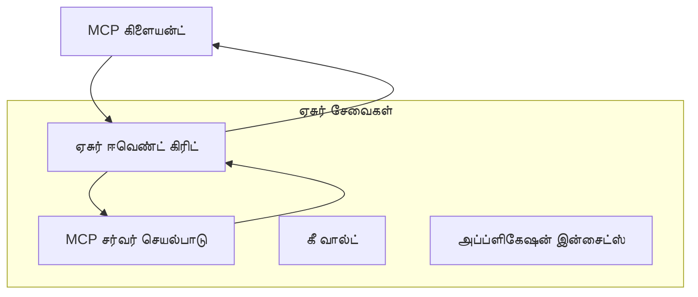
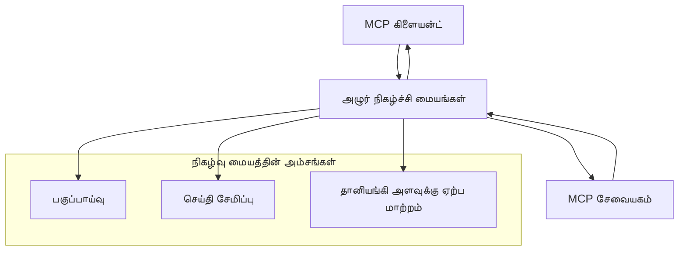

# MCP தனிப்பயன் வரவுகள் - மேம்படுத்தப்பட்ட செயலாக்கக் கையேடு

மாடல் காலநிலை நெறிமுறை (Model Context Protocol - MCP) கடத்தல் செயல்முறைகளில் நெகிழ்வ்தன்மையை வழங்குகிறது, சிறப்பான நிறுவன சூழல்களுக்கு தனிப்பயன் செயலாக்கங்களை அனுமதிக்கிறது. இந்த மேம்படுத்தப்பட்ட கையேடு Azure இன் Event Grid மற்றும் Event Hubs ஐப் பயன்படுத்தி அளவீடான, கிளவுட்-உயிரின் MCP தீர்வுகளை கட்டியமைக்கும் நடைமுறை உதாரணங்களாக தனிப்பயன் வரவு செயலாக்கங்களை ஆராய்கிறது.

> **எதிர்கால நோக்கு:** இந்த கையேடு **MCP குறிப்பிடப்பட்ட தேதி 2025-11-25** ஆகும், அப்போது ஒவ்வொரு அமர்விற்கும் அமர்வு வரிசை பாதுகாக்கப்பட வேண்டும் (கவனிக்கவும் Message Protocol). `2026-07-28` வெளியீட்டு பார்வையாளன் இல், முறையான அமர்வு முறையே அகற்றப்பட்டு, `Mcp-Method`/`Mcp-Name` தலைப்புகள் அவசியமாக்கப்பட்டு கோரிக்கை அடிப்படையில் (ஒரு அமர்வு அல்ல) பாதுகாவலர்கள் மற்றும் தனிப்பயன் வரவுகள் வழிமாற்ற முடியும். விவரம் இந்த குறிப்பு பக்கத்தில் உள்ளது: [MCP இல் என்ன மாற்றமாயுள்ளது: 2026-07-28 வெளியீட்டு பார்வையாளர்](../../01-CoreConcepts/mcp-2026-07-28-release-candidate.md).

## அறிமுகம்

MCP இன் வழக்கமான வரவுகள் (stdio மற்றும் HTTP ஸ்ட்ரீமிங்) பெரும்பாலான பயன்படுத்துபவர்களுக்கு வேலை செய்தாலும், நிறுவன சூழல்கள் பெரும்பாலும் முன்னேற்றப்பட்ட அளவீடு, நம்பகத்தன்மை மற்றும் இருந்த கிளவுட் உட்பொதிந்த கட்டமைப்போடு ஒருங்கிணைவதற்கான சிறப்புச் சிறப்பம்ச வரவு செயல்முறைகளை தேவைப்படுத்துகின்றன. தனிப்பயன் வரவுகள் MCP இன் கிளவுட்-உயிரி தகவல் சேவை பயன்படுத்தி அசிங்கிரான தகவல்தொடர்பு, நிகழ்வுத் தொழில்நுட்ப கட்டமைப்புகள் மற்றும் பகிரப்பட்ட செயலாக்கத்திற்கு உதவுகின்றன.

இந்த பாடம் சமீபத்திய MCP குறிப்பிட்ட தேதி (2025-11-25), Azure தகவல் சேவைகள் மற்றும் நிறுவனர் ஒருங்கிணைப்பு வடிவமைப்புகளின் அடிப்படையில் மேம்பட்ட வரவு செயலாக்கங்களை ஆராய்கிறது.

### **MCP வரவு கட்டமைப்பு**

**MCP குறிப்பிட்ட தேதி (2025-11-25) இலிருந்து:**

- **வழக்கமான வரவுகள்**: stdio (பரிந்துரைக்கப்பட்ட), HTTP ஸ்ட்ரீமிங் (தொலைநிலை சூழல்களுக்கு)
- **தனிப்பயன் வரவுகள்**: MCP செய்தி பரிமாற்ற நெறிமுறையை செயல்படுத்தும் எந்தவொரு வரவும்
- **செய்தி வடிவம்**: JSON-RPC 2.0 மற்றும் MCP-சார்ந்த நீட்டிப்புகள்
- **இருமுகத் தொடர்பு**: அறிவிப்புகள் மற்றும் பதில்களுக்கு முழு இருமுகக் தொடர்பு அவசியம்

## கற்றல் நோக்கங்கள்

இந்த மேம்பட்ட பாட முடிவில், நீங்கள் செய்யக் கூடியவை:

- **தனிப்பயன் வரவு தேவைகளை புரிந்துகொள்ளுதல்**: MCP நெறிமுறையை எந்த வரவு அடிப்படையிலும் தயார் செய்து தகுதிச் சென்று நிறைவேற்றுதல்
- **Azure Event Grid வரவு உருவாக்குதல்**: தவிர்ப்பாளரில்லா அளவீடும் ஆதரவுடன் Azure Event Grid ஐ பயன்படுத்தி நிகழ்வு இயக்க MCP சேவையகங்களை உருவாக்குதல்
- **Azure Event Hubs வரவு செயலாக்குதல்**: நேரடி ஸ்ட்ரீமிங்கிற்கு Azure Event Hubs பயன்படுத்தி உயர் ஓட்ட MCP தீர்வுகளை வடிவமைத்தல்
- **நிறுவனர் வடிவமைப்புகளைப் பயன்படுத்துதல்**: Azure கட்டமைப்புகள் மற்றும் பாதுகாப்பு மாதிரிகளுடன் தனிப்பயன் வரவுகளை ஒருங்கிணைத்தல்
- **வரவு நம்பகத்தன்மையை கையாளுதல்**: செய்தி நிலைத்தன்மை, வரிசை மற்றும் பிழை கையாளுதலை நிறுவனம் சார்ந்த சூழல்களுக்கு செயல்படுத்துதல்
- **செயற்பாட்டை மேம்படுத்துதல்**: அளவு, தாமதம் மற்றும் ஓட்டத் தேவைகளுக்கான வரவு தீர்வுகளை வடிவமைத்தல்

## **வரவு தேவைகள்**

### **MCP குறிப்பிட்ட நாள் (2025-11-25) இன் மைய தேவைகள்:**

```yaml
Message Protocol:
  format: "JSON-RPC 2.0 with MCP extensions"
  bidirectional: "Full duplex communication required"
  ordering: "Message ordering must be preserved per session"
  
Transport Layer:
  reliability: "Transport MUST handle connection failures gracefully"
  security: "Transport MUST support secure communication"
  identification: "Each session MUST have unique identifier"
  
Custom Transport:
  compliance: "MUST implement complete MCP message exchange"
  extensibility: "MAY add transport-specific features"
  interoperability: "MUST maintain protocol compatibility"
```

## **Azure Event Grid வரவு செயலாக்கம்**

Azure Event Grid நிகழ்வு இயக்க MCP கட்டமைப்புகளுக்கான தவிர்ப்பாளரில்லா நிகழ்வு வழிசார்பு சேவையை வழங்குகிறது. இந்த செயலாக்கம் அளவுத்திறந்த, சிதறிய MCP அமைப்புகளை உருவாக்குவதைக் காட்டுகிறது.

### **கட்டமைப்பு மேற்பார்வை**



### **C# செயலாக்கம் - Event Grid வரவு**

```csharp
using Azure.Messaging.EventGrid;
using Microsoft.Extensions.Azure;
using System.Text.Json;

public class EventGridMcpTransport : IMcpTransport
{
    private readonly EventGridPublisherClient _publisher;
    private readonly string _topicEndpoint;
    private readonly string _clientId;
    
    public EventGridMcpTransport(string topicEndpoint, string accessKey, string clientId)
    {
        _publisher = new EventGridPublisherClient(
            new Uri(topicEndpoint), 
            new AzureKeyCredential(accessKey));
        _topicEndpoint = topicEndpoint;
        _clientId = clientId;
    }
    
    public async Task SendMessageAsync(McpMessage message)
    {
        var eventGridEvent = new EventGridEvent(
            subject: $"mcp/{_clientId}",
            eventType: "MCP.MessageReceived",
            dataVersion: "1.0",
            data: JsonSerializer.Serialize(message))
        {
            Id = Guid.NewGuid().ToString(),
            EventTime = DateTimeOffset.UtcNow
        };
        
        await _publisher.SendEventAsync(eventGridEvent);
    }
    
    public async Task<McpMessage> ReceiveMessageAsync(CancellationToken cancellationToken)
    {
        // Event Grid is push-based, so implement webhook receiver
        // This would typically be handled by Azure Functions trigger
        throw new NotImplementedException("Use EventGridTrigger in Azure Functions");
    }
}

// Azure Function for receiving Event Grid events
[FunctionName("McpEventGridReceiver")]
public async Task<IActionResult> HandleEventGridMessage(
    [EventGridTrigger] EventGridEvent eventGridEvent,
    ILogger log)
{
    try
    {
        var mcpMessage = JsonSerializer.Deserialize<McpMessage>(
            eventGridEvent.Data.ToString());
        
        // Process MCP message
        var response = await _mcpServer.ProcessMessageAsync(mcpMessage);
        
        // Send response back via Event Grid
        await _transport.SendMessageAsync(response);
        
        return new OkResult();
    }
    catch (Exception ex)
    {
        log.LogError(ex, "Error processing Event Grid MCP message");
        return new BadRequestResult();
    }
}
```

### **TypeScript செயலாக்கம் - Event Grid வரவு**

```typescript
import { EventGridPublisherClient, AzureKeyCredential } from "@azure/eventgrid";
import { McpTransport, McpMessage } from "./mcp-types";

export class EventGridMcpTransport implements McpTransport {
    private publisher: EventGridPublisherClient;
    private clientId: string;
    
    constructor(
        private topicEndpoint: string,
        private accessKey: string,
        clientId: string
    ) {
        this.publisher = new EventGridPublisherClient(
            topicEndpoint,
            new AzureKeyCredential(accessKey)
        );
        this.clientId = clientId;
    }
    
    async sendMessage(message: McpMessage): Promise<void> {
        const event = {
            id: crypto.randomUUID(),
            source: `mcp-client-${this.clientId}`,
            type: "MCP.MessageReceived",
            time: new Date(),
            data: message
        };
        
        await this.publisher.sendEvents([event]);
    }
    
    // Azure Functions மூலம் நிகழ்வு சார்ந்த பெறுதல்
    onMessage(handler: (message: McpMessage) => Promise<void>): void {
        // அமலாக்கம் Azure Functions Event Grid தூண்டலும் பயன்படுத்தும்
        // இது webhook பெறுபவர் க்கான கருத்து இடைமுகம்
    }
}

// Azure Functions செயலாக்கம்
import { app, InvocationContext, EventGridEvent } from "@azure/functions";

app.eventGrid("mcpEventGridHandler", {
    handler: async (event: EventGridEvent, context: InvocationContext) => {
        try {
            const mcpMessage = event.data as McpMessage;
            
            // MCP செய்தியை செயலாக்கவும்
            const response = await mcpServer.processMessage(mcpMessage);
            
            // Event Grid மூலம் பதிலை அனுப்பு
            await transport.sendMessage(response);
            
        } catch (error) {
            context.error("Error processing MCP message:", error);
            throw error;
        }
    }
});
```

### **Python செயலாக்கம் - Event Grid வரவு**

```python
from azure.eventgrid import EventGridPublisherClient, EventGridEvent
from azure.core.credentials import AzureKeyCredential
import asyncio
import json
from typing import Callable, Optional
import uuid
from datetime import datetime

class EventGridMcpTransport:
    def __init__(self, topic_endpoint: str, access_key: str, client_id: str):
        self.client = EventGridPublisherClient(
            topic_endpoint, 
            AzureKeyCredential(access_key)
        )
        self.client_id = client_id
        self.message_handler: Optional[Callable] = None
    
    async def send_message(self, message: dict) -> None:
        """Send MCP message via Event Grid"""
        event = EventGridEvent(
            data=message,
            subject=f"mcp/{self.client_id}",
            event_type="MCP.MessageReceived",
            data_version="1.0"
        )
        
        await self.client.send(event)
    
    def on_message(self, handler: Callable[[dict], None]) -> None:
        """Register message handler for incoming events"""
        self.message_handler = handler

# அஜூர் ஃபங்க்ஷன்ஸ் நடைமுறைப்படுத்தல்
import azure.functions as func
import logging

def main(event: func.EventGridEvent) -> None:
    """Azure Functions Event Grid trigger for MCP messages"""
    try:
        # ஈவென்ட் கிரிட் நிகழ்வில் இருந்து MCP செய்தியை பகுப்பு
        mcp_message = json.loads(event.get_body().decode('utf-8'))
        
        # MCP செய்தியை செயலாக்கு
        response = process_mcp_message(mcp_message)
        
        # ஈவென்ட் கிரிட் வழியாக பதிலளி அனுப்பு
        # (நடைமுறைப்படுத்தல் புதிய ஈவென்ட் கிரிட் கிளையண்டை உருவாக்கும்)
        
    except Exception as e:
        logging.error(f"Error processing MCP Event Grid message: {e}")
        raise
```

## **Azure Event Hubs வரவு செயலாக்கம்**

Azure Event Hubs குறைந்த தாமதமும், அதிக செய்தி அளவையும் தேவைப்படுத்தும் MCP சூழல்களுக்கு நேரடி ஸ்ட்ரீமிங் திறன்களை வழங்கும்.

### **கட்டமைப்பு மேற்பார்வை**



### **C# செயலாக்கம் - Event Hubs வரவு**

```csharp
using Azure.Messaging.EventHubs;
using Azure.Messaging.EventHubs.Producer;
using Azure.Messaging.EventHubs.Consumer;
using System.Text;

public class EventHubsMcpTransport : IMcpTransport, IDisposable
{
    private readonly EventHubProducerClient _producer;
    private readonly EventHubConsumerClient _consumer;
    private readonly string _consumerGroup;
    private readonly CancellationTokenSource _cancellationTokenSource;
    
    public EventHubsMcpTransport(
        string connectionString, 
        string eventHubName,
        string consumerGroup = "$Default")
    {
        _producer = new EventHubProducerClient(connectionString, eventHubName);
        _consumer = new EventHubConsumerClient(
            consumerGroup, 
            connectionString, 
            eventHubName);
        _consumerGroup = consumerGroup;
        _cancellationTokenSource = new CancellationTokenSource();
    }
    
    public async Task SendMessageAsync(McpMessage message)
    {
        var messageBody = JsonSerializer.Serialize(message);
        var eventData = new EventData(Encoding.UTF8.GetBytes(messageBody));
        
        // Add MCP-specific properties
        eventData.Properties.Add("MessageType", message.Method ?? "response");
        eventData.Properties.Add("MessageId", message.Id);
        eventData.Properties.Add("Timestamp", DateTimeOffset.UtcNow);
        
        await _producer.SendAsync(new[] { eventData });
    }
    
    public async Task StartReceivingAsync(
        Func<McpMessage, Task> messageHandler)
    {
        await foreach (PartitionEvent partitionEvent in _consumer.ReadEventsAsync(
            _cancellationTokenSource.Token))
        {
            try
            {
                var messageBody = Encoding.UTF8.GetString(
                    partitionEvent.Data.EventBody.ToArray());
                var mcpMessage = JsonSerializer.Deserialize<McpMessage>(messageBody);
                
                await messageHandler(mcpMessage);
            }
            catch (Exception ex)
            {
                // Handle deserialization or processing errors
                Console.WriteLine($"Error processing message: {ex.Message}");
            }
        }
    }
    
    public void Dispose()
    {
        _cancellationTokenSource?.Cancel();
        _producer?.DisposeAsync().AsTask().Wait();
        _consumer?.DisposeAsync().AsTask().Wait();
        _cancellationTokenSource?.Dispose();
    }
}
```

### **TypeScript செயலாக்கம் - Event Hubs வரவு**

```typescript
import { 
    EventHubProducerClient, 
    EventHubConsumerClient, 
    EventData 
} from "@azure/event-hubs";

export class EventHubsMcpTransport implements McpTransport {
    private producer: EventHubProducerClient;
    private consumer: EventHubConsumerClient;
    private isReceiving = false;
    
    constructor(
        private connectionString: string,
        private eventHubName: string,
        private consumerGroup: string = "$Default"
    ) {
        this.producer = new EventHubProducerClient(
            connectionString, 
            eventHubName
        );
        this.consumer = new EventHubConsumerClient(
            consumerGroup,
            connectionString,
            eventHubName
        );
    }
    
    async sendMessage(message: McpMessage): Promise<void> {
        const eventData: EventData = {
            body: JSON.stringify(message),
            properties: {
                messageType: message.method || "response",
                messageId: message.id,
                timestamp: new Date().toISOString()
            }
        };
        
        await this.producer.sendBatch([eventData]);
    }
    
    async startReceiving(
        messageHandler: (message: McpMessage) => Promise<void>
    ): Promise<void> {
        if (this.isReceiving) return;
        
        this.isReceiving = true;
        
        const subscription = this.consumer.subscribe({
            processEvents: async (events, context) => {
                for (const event of events) {
                    try {
                        const messageBody = event.body as string;
                        const mcpMessage: McpMessage = JSON.parse(messageBody);
                        
                        await messageHandler(mcpMessage);
                        
                        // குறைந்தது ஒருமுறை டெலிவரிக்க புள்ளியீட்டை புதுப்பிக்கவும்
                        await context.updateCheckpoint(event);
                    } catch (error) {
                        console.error("Error processing Event Hubs message:", error);
                    }
                }
            },
            processError: async (err, context) => {
                console.error("Event Hubs error:", err);
            }
        });
    }
    
    async close(): Promise<void> {
        this.isReceiving = false;
        await this.producer.close();
        await this.consumer.close();
    }
}
```

### **Python செயலாக்கம் - Event Hubs வரவு**

```python
from azure.eventhub import EventHubProducerClient, EventHubConsumerClient
from azure.eventhub import EventData
import json
import asyncio
from typing import Callable, Dict, Any
import logging

class EventHubsMcpTransport:
    def __init__(
        self, 
        connection_string: str, 
        eventhub_name: str,
        consumer_group: str = "$Default"
    ):
        self.producer = EventHubProducerClient.from_connection_string(
            connection_string, 
            eventhub_name=eventhub_name
        )
        self.consumer = EventHubConsumerClient.from_connection_string(
            connection_string,
            consumer_group=consumer_group,
            eventhub_name=eventhub_name
        )
        self.is_receiving = False
    
    async def send_message(self, message: Dict[str, Any]) -> None:
        """Send MCP message via Event Hubs"""
        event_data = EventData(json.dumps(message))
        
        # MCP-சார்ந்த பண்புகளைச் சேர்க்கவும்
        event_data.properties = {
            "messageType": message.get("method", "response"),
            "messageId": message.get("id"),
            "timestamp": "2025-01-14T10:30:00Z"  # உண்மை காலச்சாளரைக் (timestamp) பயன்படுத்தவும்
        }
        
        async with self.producer:
            event_data_batch = await self.producer.create_batch()
            event_data_batch.add(event_data)
            await self.producer.send_batch(event_data_batch)
    
    async def start_receiving(
        self, 
        message_handler: Callable[[Dict[str, Any]], None]
    ) -> None:
        """Start receiving MCP messages from Event Hubs"""
        if self.is_receiving:
            return
        
        self.is_receiving = True
        
        async with self.consumer:
            await self.consumer.receive(
                on_event=self._on_event_received(message_handler),
                starting_position="-1"  # தொடக்கத்திலிருந்து துவங்கு
            )
    
    def _on_event_received(self, handler: Callable):
        """Internal event handler wrapper"""
        async def handle_event(partition_context, event):
            try:
                # Event Hubs நிகழ்விலிருந்து MCP செய்தியை பகுப்பாய்வு செய்க
                message_body = event.body_as_str(encoding='UTF-8')
                mcp_message = json.loads(message_body)
                
                # MCP செய்தியை செயலாக்கு
                await handler(mcp_message)
                
                # குறைந்தபட்சம் ஒருமுறை விநியோகத்திற்கான காய்ப்பாயிண்ட் (checkpoint) புதுப்பிக்கவும்
                await partition_context.update_checkpoint(event)
                
            except Exception as e:
                logging.error(f"Error processing Event Hubs message: {e}")
        
        return handle_event
    
    async def close(self) -> None:
        """Clean up transport resources"""
        self.is_receiving = False
        await self.producer.close()
        await self.consumer.close()
```

## **மேம்பட்ட வரவு வடிவமைப்புகள்**

### **செய்தி நிலைத்தன்மை மற்றும் நம்பகத்தன்மை**

```csharp
// Implementing message durability with retry logic
public class ReliableTransportWrapper : IMcpTransport
{
    private readonly IMcpTransport _innerTransport;
    private readonly RetryPolicy _retryPolicy;
    
    public async Task SendMessageAsync(McpMessage message)
    {
        await _retryPolicy.ExecuteAsync(async () =>
        {
            try
            {
                await _innerTransport.SendMessageAsync(message);
            }
            catch (TransportException ex) when (ex.IsRetryable)
            {
                // Log and retry
                throw;
            }
        });
    }
}
```

### **வரவு பாதுகாப்பு ஒருங்கிணைப்பு**

```csharp
// Integrating Azure Key Vault for transport security
public class SecureTransportFactory
{
    private readonly SecretClient _keyVaultClient;
    
    public async Task<IMcpTransport> CreateEventGridTransportAsync()
    {
        var accessKey = await _keyVaultClient.GetSecretAsync("EventGridAccessKey");
        var topicEndpoint = await _keyVaultClient.GetSecretAsync("EventGridTopic");
        
        return new EventGridMcpTransport(
            topicEndpoint.Value.Value,
            accessKey.Value.Value,
            Environment.MachineName
        );
    }
}
```

### **வரவு கண்காணிப்பு மற்றும் கவனித்தல்**

```csharp
// Adding telemetry to custom transports
public class ObservableTransport : IMcpTransport
{
    private readonly IMcpTransport _transport;
    private readonly ILogger _logger;
    private readonly TelemetryClient _telemetryClient;
    
    public async Task SendMessageAsync(McpMessage message)
    {
        using var activity = Activity.StartActivity("MCP.Transport.Send");
        activity?.SetTag("transport.type", "EventGrid");
        activity?.SetTag("message.method", message.Method);
        
        var stopwatch = Stopwatch.StartNew();
        
        try
        {
            await _transport.SendMessageAsync(message);
            
            _telemetryClient.TrackDependency(
                "EventGrid",
                "SendMessage",
                DateTime.UtcNow.Subtract(stopwatch.Elapsed),
                stopwatch.Elapsed,
                true
            );
        }
        catch (Exception ex)
        {
            _telemetryClient.TrackException(ex);
            throw;
        }
    }
}
```

## **நிறுவனர் ஒருங்கிணைப்பு சூழல்கள்**

### **சூழல் 1: பகிர்ந்த MCP செயலாக்கம்**

பல செயலாக்க மையங்களுக்கு Azure Event Grid கொண்டு MCP கோரிக்கைகளை பகிர்தல்:

```yaml
Architecture:
  - MCP Client sends requests to Event Grid topic
  - Multiple Azure Functions subscribe to process different tool types
  - Results aggregated and returned via separate response topic
  
Benefits:
  - Horizontal scaling based on message volume
  - Fault tolerance through redundant processors
  - Cost optimization with serverless compute
```

### **சூழல் 2: நேரடி MCP ஸ்ட்ரீமிங்**

அதிக அதிர்வெண் MCP தொடர்புகளுக்கு Azure Event Hubs பயன்படுத்துதல்:

```yaml
Architecture:
  - MCP Client streams continuous requests via Event Hubs
  - Stream Analytics processes and routes messages
  - Multiple consumers handle different aspect of processing
  
Benefits:
  - Low latency for real-time scenarios
  - High throughput for batch processing
  - Built-in partitioning for parallel processing
```

### **சூழல் 3: இணைந்து வரவு கட்டமைப்பு**

பல்வேறு பயன்பாடுகளுக்கு பல வரவுகளை ஒருங்கிணைத்தல்:

```csharp
public class HybridMcpTransport : IMcpTransport
{
    private readonly IMcpTransport _realtimeTransport; // Event Hubs
    private readonly IMcpTransport _batchTransport;    // Event Grid
    private readonly IMcpTransport _fallbackTransport; // HTTP Streaming
    
    public async Task SendMessageAsync(McpMessage message)
    {
        // Route based on message characteristics
        var transport = message.Method switch
        {
            "tools/call" when IsRealtime(message) => _realtimeTransport,
            "resources/read" when IsBatch(message) => _batchTransport,
            _ => _fallbackTransport
        };
        
        await transport.SendMessageAsync(message);
    }
}
```

## **செயற்பாட்டு மேம்பாடு**

### **Event Grid இல் செய்தி தொகுப்பு**

```csharp
public class BatchingEventGridTransport : IMcpTransport
{
    private readonly List<McpMessage> _messageBuffer = new();
    private readonly Timer _flushTimer;
    private const int MaxBatchSize = 100;
    
    public async Task SendMessageAsync(McpMessage message)
    {
        lock (_messageBuffer)
        {
            _messageBuffer.Add(message);
            
            if (_messageBuffer.Count >= MaxBatchSize)
            {
                _ = Task.Run(FlushMessages);
            }
        }
    }
    
    private async Task FlushMessages()
    {
        List<McpMessage> toSend;
        lock (_messageBuffer)
        {
            toSend = new List<McpMessage>(_messageBuffer);
            _messageBuffer.Clear();
        }
        
        if (toSend.Any())
        {
            var events = toSend.Select(CreateEventGridEvent);
            await _publisher.SendEventsAsync(events);
        }
    }
}
```

### **Event Hubs இல் பகுப்பு முன்னிடல்**

```csharp
public class PartitionedEventHubsTransport : IMcpTransport
{
    public async Task SendMessageAsync(McpMessage message)
    {
        // Partition by client ID for session affinity
        var partitionKey = ExtractClientId(message);
        
        var eventData = new EventData(JsonSerializer.SerializeToUtf8Bytes(message))
        {
            PartitionKey = partitionKey
        };
        
        await _producer.SendAsync(new[] { eventData });
    }
}
```

## **தனிப்பயன் வரவுகளுக்கான சோதனை**

### **சோதனை இரட்டைப்பயன்பாடு உடன் அலகு சோதனை**

```csharp
[Test]
public async Task EventGridTransport_SendMessage_PublishesCorrectEvent()
{
    // Arrange
    var mockPublisher = new Mock<EventGridPublisherClient>();
    var transport = new EventGridMcpTransport(mockPublisher.Object);
    var message = new McpMessage { Method = "tools/list", Id = "test-123" };
    
    // Act
    await transport.SendMessageAsync(message);
    
    // Assert
    mockPublisher.Verify(
        x => x.SendEventAsync(
            It.Is<EventGridEvent>(e => 
                e.EventType == "MCP.MessageReceived" &&
                e.Subject == "mcp/test-client"
            )
        ),
        Times.Once
    );
}
```

### **Azure Test Containers உடன் ஒருங்கிணைவு சோதனை**

```csharp
[Test]
public async Task EventHubsTransport_IntegrationTest()
{
    // Using Testcontainers for integration testing
    var eventHubsContainer = new EventHubsContainer()
        .WithEventHub("test-hub");
    
    await eventHubsContainer.StartAsync();
    
    var transport = new EventHubsMcpTransport(
        eventHubsContainer.GetConnectionString(),
        "test-hub"
    );
    
    // Test message round-trip
    var sentMessage = new McpMessage { Method = "test", Id = "123" };
    McpMessage receivedMessage = null;
    
    await transport.StartReceivingAsync(msg => {
        receivedMessage = msg;
        return Task.CompletedTask;
    });
    
    await transport.SendMessageAsync(sentMessage);
    await Task.Delay(1000); // Allow for message processing
    
    Assert.That(receivedMessage?.Id, Is.EqualTo("123"));
}
```

## **சிறந்த நடைமுறைகள் மற்றும் வழிகாட்டிகள்**

### **வரவு வடிவமைப்பு கொள்கைகள்**

1. **அடையாள மறுபயன்பாடு (Idempotency)**: நகல்களை கையாள அனுமதிக்கும் பொருத்தமான செய்தி செயலாக்கத்தை உறுதி செய்யுதல்
2. **பிழை கையாளுதல்**: விரிவான பிழை கையாளல் மற்றும் மரணக் கடிதக் கூட்டுகளை அமல்படுத்துதல்
3. **கண்காணிப்பு**: விரிவான தொலைபார்க்கும் மற்றும் ஆரோக்கியச் சோதனைகள் சேர்க்கல்
4. **பாதுகாப்பு**: பராமரிக்கப்பட்ட அடையாளங்கள் மற்றும் குறைந்த அனுமதி அணுகலை பயன்படுத்தல்
5. **செயற்பாடு**: உங்கள் குறிப்பிட்ட தாமதம் மற்றும் ஓட்டத் தேவைகளுக்கான வடிவமைப்பு

### **Azure-சார்ந்த பரிந்துரைகள்**

1. **நிர்வகிக்கப்பட்ட அடையாளம் பயன்படுத்துங்கள்**: தயாரிப்பில் இணைப்பு சரங்களை தவிர்க்கவும்
2. **சர்க்கிட் பிரேக்கர்களை செயல்படுத்துங்கள்**: Azure சேவை அவசர நிலைகளுக்கு பாதுகாப்பு
3. **கட்டணங்களை கண்காணியுங்கள்**: செய்தி அளவும் செயலாக்கக் கட்டணங்களும்
4. **அளவுக்கு திட்டமிடுங்கள்**: பகுப்பு மற்றும் அளவைப் முன்னிட்டுக் திட்டமிடல்
5. **முழுமையாக சோதியுங்கள்**: Azure DevTest Labs உடன் விரிவான சோதனை

## **கடைசி குறிப்பு**

தனிப்பயன் MCP வரவுகள் Azure இன் தகவல் சேவைகளை பயன்படுத்தி சக்திவாய்ந்த நிறுவன சூழல்களை இயற்றச் செய்கின்றன. Event Grid அல்லது Event Hubs வரவுகளை செயல்படுத்துவதன் மூலம் அளவிடத்தக்க, நம்பகமான MCP தீர்வுகளை Azure கட்டமைப்போடு இணைப்பதை நீங்கள் உருவாக்க முடியும்.

தயாரிக்கப்பட்ட உதாரணங்கள் MCP நெறிமுறை கட்டுப்பாட்டையும் Azure சிறந்த நடைமுறைகளையும் பின்பற்றி தனிப்பயன் வரவுகளை செயல்படுத்தும் தயாரிப்பு நிலைப் பேடார்ம் வடிவமைப்புகளை காட்டுகின்றன.

## **மேலும் வாசிக்க**

- [MCP குறிப்பிட்ட தேதி 2025-11-25](https://modelcontextprotocol.io/specification/2025-11-25/)
- [Azure Event Grid ஆவணம்](https://docs.microsoft.com/azure/event-grid/)
- [Azure Event Hubs ஆவணம்](https://docs.microsoft.com/azure/event-hubs/)
- [Azure Functions Event Grid தூண்டுதல்](https://docs.microsoft.com/azure/azure-functions/functions-bindings-event-grid)
- [Azure SDK for .NET](https://github.com/Azure/azure-sdk-for-net)
- [Azure SDK for TypeScript](https://github.com/Azure/azure-sdk-for-js)
- [Azure SDK for Python](https://github.com/Azure/azure-sdk-for-python)

---

> *இந்த கையேடு தயாரிப்பு MCP அமைப்புகளுக்கான நடைமுறை செயலாக்கக் கூற்றுகளைக் கவனித்து எழுதப்பட்டது. உங்கள் குறிப்பிட்ட தேவைகள் மற்றும் Azure சேவை வரம்புகளுக்கு எதிராக எப்போதும் வரவு செயலாக்கத்தை சோதிக்கவும்.*
> **தற்போதைய நிலை**: இந்த கையேடு [MCP குறிப்பிட்ட தேதி 2025-11-25](https://modelcontextprotocol.io/specification/2025-11-25/) இன் வரவு தேவைகள் மற்றும் மேம்பட்ட வரவு வடிவமைப்புகளுக்கு ஏற்ப உள்ளது.


## அடுத்தது என்ன
- [6. சமூக பங்கேற்புகள்](../../06-CommunityContributions/README.md)

---

<!-- CO-OP TRANSLATOR DISCLAIMER START -->
**மறுப்பு**:
இந்த ஆவணம் AI மொழிபெயர்ப்பு சேவை [Co-op Translator](https://github.com/Azure/co-op-translator) பயன்படுத்தி மொழிபெயர்க்கப்பட்டுள்ளது. நாங்கள் துல்லியத்திற்காக முயற்சி செய்துள்ளோம், ஆனால் தானாக செய்யப்படும் மொழிபெயர்ப்புகளில் பிழைகள் அல்லது தவறுகள் இருக்கலாம் என்பதை கவனத்தில் கொள்ளவும். அசல் ஆவணம் அதன் தாய்மொழியில் அதிகாரப்பூர்வ ஆதாரமாக கருதப்பட வேண்டும். முக்கியமான தகவல்களுக்கு, தொழில்நுட்பமான மனித மொழிபெயர்ப்பு பரிந்துரைக்கப்படுகிறது. இந்த மொழிபெயர்ப்பைப் பயன்படுத்துவதால் ஏற்படும் எந்த தவறான புரிதல்கள் அல்லது தவறான விளக்கத்திற்கும் நாங்கள் பொறுப்பில்வில்லை.
<!-- CO-OP TRANSLATOR DISCLAIMER END -->