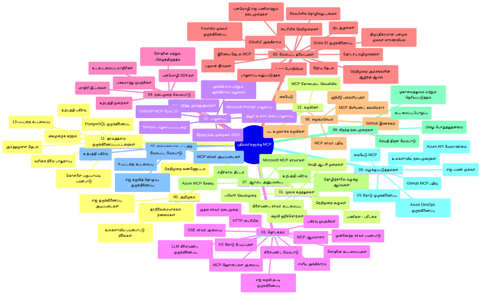

# ஆரம்பக்காரர்களுக்கான மாதிரிக் கூறு நெறிமுறை (MCP) - பயிற்சி வழிகாட்டி

இந்த பயிற்சி வழிகாட்டி "ஆரம்பக்காரர்களுக்கான மாதிரிக் கூறு நெறிமுறை (MCP)" பாடத்திட்டத்துக்கான களஞ்சிய அமைப்பு மற்றும் உள்ளடக்கத்தின் ஒரு தெரியும் வழங்குகிறது. இந்த வழிகாட்டியைக் கொண்டு களஞ்சியத்தை திறம்பட வழிசெய்து கிடைக்கும் வளங்களை முழுமையாக பயன்படுத்திக் கொள்ளலாம்.

## களஞ்சிய அறிக்கை

மாதிரிக் கூறு நெறிமுறை (MCP) என்பது செயற்கை நுண்ணறிவு மாதிரிகள் மற்றும் கிளையன்ட் செயலிகளுக்கிடையேயான தொடர்புகளுக்கு ஒரு ஒழுங்கமைக்கப்பட்ட அமைப்பு ஆகும். ஆரம்பத்தில் Anthropic உருவாக்கிய MCP, தற்போது அதிகாரப்பூர்வ GitHub அமைப்பின் மூலம் பெரிய MCP சமுதாயத்தால் பராமரிக்கப்படுகிறது. இந்த களஞ்சியம் AI வளர்ச்சியாளர்கள், அமைப்பு வடிவுநிலையாளர்கள் மற்றும் மென்பொருள் பொறியாளர்களுக்கான C#, Java, JavaScript, Python மற்றும் TypeScript மொழிகளில் செயல்பாட்டுடன் கூடிய பாடத்திட்டத்தைக் கொடுக்கும்.

## காணொலி பாடத்திட்ட வரைபடம்

## களஞ்சிய அமைப்பு

இந்தக் களஞ்சியம் பன்னிரண்டு முக்கிய பிரிவுகளில் ஒழுங்கமைக்கப்பட்டுள்ளது, ஒவ்வொன்றும் MCP இன் வேறுபட்ட அம்சங்களைக் கவனிக்கிறது:

1. **அறிமுகம் (00-Introduction/)**
   - மாதிரிக் கூறு நெறிமுறையின் அறிக்கையைப் பற்றி
   - AI பைப்லைன்களில் நிலைத்தன்மை ஏன் முக்கியம்
   - நடைமுறை பயன்பாடுகள் மற்றும் நன்மைகள்

2. **முக்கிய கருத்துக்கள் (01-CoreConcepts/)**
   - கிளையன்ட்-சர்வர் கட்டமைப்பு
   - முக்கிய நெறிமுறைகள் கூறுகள்
   - MCP இல் செய்தி பரிமாற்ற முறைமைகள்
   - முன்னோக்கி சிறப்புகள்: [MCP இல் என்ன மாறுகிறது: 2026-07-28 வெளியீடு வேட்பு](./01-CoreConcepts/mcp-2026-07-28-release-candidate.md) — நிலைத்தன்மையற்ற நெறிமுறை மேல், விரிவாக்க அமைப்புகள் மற்றும் அடுத்த உறுதி பதிப்பில் Roots/Sampling/Logging ரத்து எதிர்பார்ப்பு

3. **பாதுகாப்பு (02-Security/)**
   - MCP அடிப்படையிலான அமைப்புகளின் பாதுகாப்பு அச்சுறுத்தல்கள்
   - செயலாக்கங்களை பாதுகாப்பதற்கான சிறந்த நடைமுறைகள்
   - அங்கீகாரம் மற்றும் அங்கீகார நெறிமுறைகள்
   - **விரிவான பாதுகாப்பு ஆவணங்கள்**:
     - MCP பாதுகாப்பு சிறந்த நடைமுறைகள் 2025
     - Azure உள்ளடக்க பாதுகாப்பு செயல்முறை கையேடு
     - MCP பாதுகாப்பு கட்டுப்பாடுகள் மற்றும் நுட்பங்கள்
     - MCP சிறந்த நடைமுறைகள் விரைவு குறிப்பு
   - **முக்கிய பாதுகாப்பு தலைப்புகள்**:
     - உட்புகுத்தல் மற்றும் கருவி நாசம் தாக்குதல்
     - அமர்வு கள்வித்தனம் மற்றும் குழப்பப்பட்ட துணை பிரச்சினைகள்
     - குறியீட்டு கடத்தல் சாத்தியம்
     - அதிக அனுமதிகள் மற்றும் அணுகல் கட்டுப்பாடு
     - AI கூறுகளுக்கான வழங்கல் சுங்க பாதுகாப்பு
     - Microsoft Prompt Shields ஒருங்கிணைப்பு

4. **தொடக்கம் (03-GettingStarted/)**
   - சுற்றுச்சூழல் அமைப்பு மற்றும் கட்டமைப்பு
   - அடிப்படை MCP சர்வர் மற்றும் கிளையன்ட் உருவாக்கம்
   - உள்ளடக்கிய செயலிகளுடன் ஒருங்கிணைவு
   - கீழ்காணும் பிரிவுகள் உள்ளன:
     - முதல் சர்வர் செயலாக்கம்
     - கிளையன்ட் உருவாக்கம்
     - LLM கிளையன்ட் ஒருங்கிணைவு
     - VS Code ஒருங்கிணைவு
     - Server-Sent Events (SSE) சர்வர்
     - மேம்பட்ட சர்வர் பயன்பாடு
     - HTTP ஸ்ட்ரீமிங்
     - AI கருவி தொகுப்பு ஒருங்கிணைவு
     - சோதனை நடைமுறைகள்
     - பரப்புதல் வழிகாட்டிகள்

5. **நடைமுறை செயலாக்கம் (04-PracticalImplementation/)**
   - பல நிரலாக்க மொழிகளில் SDK கள் பயன்படுத்தல்
   - பிழைத்துவைப்பு, சோதனை மற்றும் சரிபார்ப்பு முறைகள்
   - மீண்டும் பயன்படுத்தக்கூடிய உட்புகுத்துக் கட்டமைப்புகள் மற்றும் வேலைநிரல்களை உருவாக்குதல்
   - செயலாக்க எடுத்துக்காட்டுகள் கொண்ட மாதிரிகள்

6. **மேம்பட்ட தலைப்புகள் (05-AdvancedTopics/)**
   - சூழல் பொறியியல் தொழில்நுட்பங்கள்
   - Foundry முகவர் ஒருங்கிணைவு
   - பன்முறை AI வேலைபாடுகள்
   - OAuth2 அங்கீகாரம் டெமோக்கள்
   - நேரடி தேடல் திறன்கள்
   - நேரடி ஸ்ட்ரீமிங்
   - ருட் சூழல்கள் செயலாக்கம்
   - வழிமாற்று நிலைகள்
   - சோதனை எடுத்துக்காட்டுகள்
   - அளவுகோல் அணுகுமுறை
   - பாதுகாப்பு கருதுகோள்கள்
   - Entra ID பாதுகாப்பு ஒருங்கிணைவு
   - வலை தேடல் ஒருங்கிணைவு
   - எதிர்ப்பார்ப்பு பல முகவர் யோசனை (பரிந்துரைகள்)

7. **சமூக பங்களிப்புகள் (06-CommunityContributions/)**
   - குறியீட்டு மற்றும் ஆவணங்களை பங்களிப்பது எப்படி
   - GitHub வழியாக ஒத்துழைப்பு
   - சமுதாய முன்னேற்றங்கள் மற்றும் கருத்துக்களங்கள்
   - பல MCP கிளையன்ட் பயன்பாடுகள் (Claude Desktop, Cline, VSCode)
   - புகழ்பெற்ற MCP சர்வர்களுடன் பணியாற்றுதல் (பட உருவாக்கம் உட்பட)

8. **முந்தைய ஏற்றுக்கொள்ளல் பாடங்கள் (07-LessonsfromEarlyAdoption/)**
   - நேர்மறை செயலாக்கங்கள் மற்றும் வெற்றி கதைகள்
   - MCP அடிப்படையிலான தீர்வுகளை அமைத்து பரப்புதல்
   - போக்குகள் மற்றும் எதிர்கால திட்டம்
   - **Microsoft MCP சர்வர் கையேடு**: 10 தயாரிப்பு-தயார் Microsoft MCP சர்வர்கள் விரிவான கையேடு:
     - Microsoft Learn Docs MCP Server
     - Azure MCP Server (15+ சிறப்பு இணைப்புகள்)
     - GitHub MCP Server
     - Azure DevOps MCP Server
     - MarkItDown MCP Server
     - SQL Server MCP Server
     - Playwright MCP Server
     - Dev Box MCP Server
     - Microsoft Foundry MCP Server
     - Microsoft 365 Agents Toolkit MCP Server

9. **சிறந்த நடைமுறைகள் (08-BestPractices/)**
   - செயல்திறன் மேம்படுத்தலும் உத்தேசிக்லவும்
   - பிழைப்பற்ற MCP அமைப்புகளை வடிவமைத்தல்
   - சோதனை மற்றும் உறுதிப் பல்நிலை

10. **கேஸ் ஸ்டடிகள் (09-CaseStudy/)**
    - MCP பல்துறை தன்மையை காட்டும் ஏழு விரிவான கேஸ் ஸ்டடிகள்:
    - **Azure AI பயணம் முகவர்கள்**: Azure OpenAI மற்றும் AI தேடல் உடன் பன்முக முகவர் ஒழுங்கமைப்பு
    - **Azure DevOps ஒருங்கிணைவு**: YouTube தரவுப் புதுப்பிப்புகளுடன் வேலைநிரல் தானியங்கி
    - **நேரடி ஆவண மீட்டெடுப்பு**: Python console கிளையன்ட் மற்றும் HTTP ஸ்ட்ரீமிங்
    - **இணையற்ற பயிற்சி திட்ட உற்பத்தியாளர்**: Chainlit வலை செயலி உரையாடல் AI உடன்
    - **ஆவண ஆசிரியர்**: VS Code மற்றும் GitHub Copilot வேலைநிரல்கள் ஒருங்கிணைவு
    - **Azure API மேலாண்மை**: MCP சர்வர் உருவாக்கம் கொண்ட நிறுவன API ஒருங்கிணைவு
    - **GitHub MCP பதிவேடு**: சூழல் உருவாக்கம் மற்றும் முகவர் ஒருங்கிணைவு தளம்
    - நிறுவன ஒருங்கிணைவு, வளர்ச்சியாளர் செயல்திறன் மற்றும் சூழல் வளர்ச்சியுடன் செயலாக்கக் காட்சிகள்

11. **கைசெயற்பாட்டு பங்கேற்பு (10-StreamliningAIWorkflowsBuildingAnMCPServerWithAIToolkit/)**
    - MCP மற்றும் AI கருவி தொகுப்புடன் கூடிய விரிவான கைசெயற்பாட்டு பணிமனை
    - செயற்கை நுண்ணறிவு மாதிரிகளையும் உலகிற்கு பயன்படும் கருவிகளுடன் இணைக்கும் அறிவார்ந்த செயலிகளின் உருவாக்கம்
    - அடிப்படைகள், தனிப்பயன் சர்வர் உருவாக்கம் மற்றும் தயாரிப்பு பரப்பல் முறைகளை உள்ளடக்கிய பயிற்சி தொகுதிகள்
    - **பணிமனை அமைப்பு**:
      - பணிமனை 1: MCP சர்வர் அடிப்படைகள்
      - பணிமனை 2: மேம்பட்ட MCP சர்வர் உருவாக்கம்
      - பணிமனை 3: AI கருவி தொகுப்பு ஒருங்கிணைவு
      - பணிமனை 4: தயாரிப்பு பரப்பல் மற்றும் அளவீடு
    - படிநிலையாக கற்றல் முறையை பின்பற்றுகிறது

12. **MCP சர்வர் தரவுத்தளம் ஒருங்கிணைவு பணிமனைகள் (11-MCPServerHandsOnLabs/)**
    - தயாரிப்பு-தயார் MCP சர்வர்கள் உருவாக்குவதற்கான முழுமையான 13 பணிமனை பயிற்சி பாதை, PostgreSQL ஒருங்கிணைவு உடன்
    - Zava Retail பயன்பாட்டைப் பயன் படுத்தி நேர்மறை சில்லறை பகுப்பாய்வுப் செயலாக்கம்
    - நிறுவன தரமான மாதிரிகள்: வரிசை நிலை பாதுகாப்பு (RLS), அர்த்தமுள்ள தேடல் மற்றும் பன்முக குத்தகை தரவுப் பெறுதல்
    - **முழுமையான பணிமனை அமைப்பு**:
      - பணிமனைகள் 00-03: அடிப்படைகள் - அறிமுகம், கட்டமைப்பு, பாதுகாப்பு, சுற்றுச்சூழல் அமைப்பு
      - பணிமனைகள் 04-06: MCP சர்வர் கட்டமைத்தல் - தரவுத்தளம் வடிவமைப்பு, MCP சர்வர் செயலாக்கம், கருவி உருவாக்கம்
      - பணிமனைகள் 07-09: மேம்பட்ட அம்சங்கள் - அர்த்தமுள்ள தேடல், சோதனை மற்றும் பிழைத்தவையாக்கல், VS Code ஒருங்கிணைவு
      - பணிமனைகள் 10-12: தயாரிப்பு மற்றும் சிறந்த நடைமுறைகள் - பரப்புதல், கண்காணிப்பு, செயல்திறன் மேம்படுத்தல்
    - **கையாளப்பட்ட தொழில்நுட்பங்கள்**: FastMCP அமைப்பு, PostgreSQL, Azure OpenAI, Azure Container Apps, Application Insights
    - **கற்றல் முடிவுகள்**: தயாரிப்பு-தயார் MCP சர்வர்கள், தரவுத்தளம் ஒருங்கிணைவு மாதிரிகள், AI வல்லுவனான பகுப்பாய்வு, நிறுவன பாதுகாப்பு

13. **கருவிகள் (12-tooling/)**
    - MCP ஐ Copilot செயலியில் மற்றும் பிற கருவிகளில் பயன்படுத்துவது எப்படி கற்றுக்கொள்ளுங்கள்

## கூடுதல் வளங்கள்

இந்தக் களஞ்சியத்தில் கீழ்க்காணும் ஆதரவுக் வளங்கள் உள்ளன:

- **படங்கள் கோப்புறை**: பாடத்திட்டத்தில் பயன்படுத்தப்படும் வரைபடம் மற்றும் விளக்கப்படங்கள்
- **மொழிபெயர்புகள்**: ஆவணங்களின் பல மொழி ஆதரவு மற்றும் தானியங்கி மொழிபெயர்ப்பு
- **அதிகாரப்பூர்வ MCP வளங்கள்**:
  - [MCP ஆவணங்கள்](https://modelcontextprotocol.io/)
  - [MCP குறிப்பிடுதல்](https://spec.modelcontextprotocol.io/)
  - [MCP GitHub களஞ்சியம்](https://github.com/modelcontextprotocol)

## இந்தக் களஞ்சியத்தை எப்படி பயன்படுத்துவது

1. **வரிசைப்படுத்தப்பட்ட கற்றல்**: ஒழுங்காக பாடங்களை (00 முதல் 11 வரை) பின்பற்றவும்.
2. **மொழி குறிப்பான கவனம்**: உங்கள் விருப்பமான நிரலாக்க மொழிக்கு பங்களிக்கும் மாதிரிகளைக் காணவும்.
3. **நடைமுறை செயலாக்கம்**: "தொடக்கம்" பிரிவோடு உங்களது சுற்றுச்சூழலை அமைத்து முதல் MCP சர்வர் மற்றும் கிளையன்டை உருவாக்கவும்.
4. **மேம்பட்ட ஆய்வு**: அடிப்படைகளுக்கு செம்மையாக கற்றுத் தந்திருப்பதும், மேம்பட்ட தலைப்புகளுக்குள் ஆழமாக நீங்கவும்.
5. **சமூக பங்கேற்பு**: MCP சமுதாய GitHub விவாதங்கள் மற்றும் Discord சேனல்களில் சேர்ந்து நிபுணர்கள் மற்றும் கூட்டாளர்களுடன் இணைக்கவும்.

## MCP கிளையன்டுகள் மற்றும் கருவிகள்

பாடத்திட்டம் பல MCP கிளையன்டுகள் மற்றும் கருவிகளை உள்ளடக்கியது:

1. **அதிகாரப்பூர்வ கிளையன்டுகள்**:
   - Visual Studio Code
   - Visual Studio Codeல் MCP
   - Claude Desktop
   - VSCodeல் Claude
   - Claude API

2. **சமூக கிளையன்டுகள்**:
   - Cline (கருவிமுழக்க கட்டளையாளர்)
   - Cursor (குறியீட்டு தொகுப்பான்)
   - ChatMCP
   - Windsurf

3. **MCP மேலாண்மை கருவிகள்**:
   - MCP CLI
   - MCP Manager
   - MCP Linker
   - MCP Router

## பிரபல MCP சர்வர்கள்

இந்தக் களஞ்சியம் பல MCP சர்வர்களை அறிமுகம் செய்கிறது, இதில்:

1. **அதிகாரப்பூர்வ Microsoft MCP சர்வர்கள்**:
   - Microsoft Learn Docs MCP Server
   - Azure MCP Server (15+ சிறப்பு இணைப்புகளுடன்)
   - GitHub MCP Server
   - Azure DevOps MCP Server
   - MarkItDown MCP Server
   - SQL Server MCP Server
   - Playwright MCP Server
   - Dev Box MCP Server
   - Microsoft Foundry MCP Server
   - Microsoft 365 Agents Toolkit MCP Server

2. **அதிகாரப்பூர்வ குறிப்புக் சர்வர்கள்**:
   - Filesystem
   - Fetch
   - Memory
   - Sequential Thinking

3. **பட உருவாக்கம்**:
   - Azure OpenAI DALL-E 3
   - Stable Diffusion WebUI
   - Replicate

4. **வளர்ச்சி கருவிகள்**:
   - Git MCP
   - Terminal Control
   - Code Assistant

5. **சிறப்பு சர்வர்கள்**:
   - Salesforce
   - Microsoft Teams
   - Jira & Confluence

## பங்களிப்பு

இந்தக் களஞ்சியம் சமுதாயத்திடமிருந்து பங்களிப்புகளை வரவேற்கிறது. MCP சூழலில் பயன்தரமான பங்களிப்புகளைச் செய்ய சமூக பங்களிப்பு பிரிவை பார்க்கவும்.

----

*இந்த பயிற்சி வழிகாட்டி 2026 பிப்ரவரி 5-ஆம் தேதி இறுதியாக புதுப்பிக்கப்பட்டது; அதில் சமீபத்திய MCP குறிப்பிடுதல் 2025-11-25 உடன் களஞ்சியத்தின் நிலைப்பாட்டைப் பிரதிபலிக்கிறது. இந்தத் தேதிக்குப் பிறகு களஞ்சிய உள்ளடக்கம் மேம்படுத்தப்படக்கூடும்.*

*சேர்க்கை (ஜூலை 2, 2026): `2026-07-28` MCP குறிப்பிடுதல் வெளியீடு வேட்புப் பாடம் [01-CoreConcepts](./01-CoreConcepts/mcp-2026-07-28-release-candidate.md) கீழ் சேர்க்கப்பட்டது; பாடத்திட்ட அடித்தளம் 2025-11-25 வரை நிலவுகின்றது புதிய குறிப்பிடுதல் வெளியிடப்படும் வரை.*

---

<!-- CO-OP TRANSLATOR DISCLAIMER START -->
**மறுப்பு**:
இந்த ஆவணம் AI மொழிபெயர்ப்பு சேவை [Co-op Translator](https://github.com/Azure/co-op-translator) பயன்படுத்தி மொழிபெயர்க்கப்பட்டுள்ளது. நாங்கள் துல்லியத்திற்காக முயற்சி செய்துள்ளோம், ஆனால் தானாக செய்யப்படும் மொழிபெயர்ப்புகளில் பிழைகள் அல்லது தவறுகள் இருக்கலாம் என்பதை கவனத்தில் கொள்ளவும். அசல் ஆவணம் அதன் தாய்மொழியில் அதிகாரப்பூர்வ ஆதாரமாக கருதப்பட வேண்டும். முக்கியமான தகவல்களுக்கு, தொழில்நுட்பமான மனித மொழிபெயர்ப்பு பரிந்துரைக்கப்படுகிறது. இந்த மொழிபெயர்ப்பைப் பயன்படுத்துவதால் ஏற்படும் எந்த தவறான புரிதல்கள் அல்லது தவறான விளக்கத்திற்கும் நாங்கள் பொறுப்பில்வில்லை.
<!-- CO-OP TRANSLATOR DISCLAIMER END -->