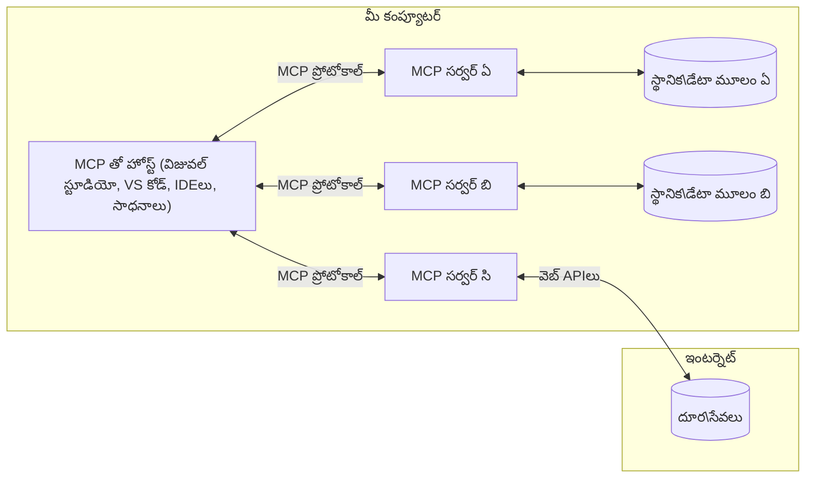

# MCP కోర్ కాన్సెప్ట్స్: AI సమగ్రత కోసం మోడల్ కాంటెక్స్ట్ ప్రోటో కాను అధిగమించడం

[](https://youtu.be/earDzWGtE84)

_(ఈ పాఠం వీడియోను వీక్షించడానికి పై చిత్రాన్ని క్లిక్ చేయండి)_

[Model Context Protocol (MCP)](https://github.com/modelcontextprotocol) అనేది పెద్ద భాషా మోడల్స్ (LLMs) మరియు బయటి టూల్స్, అనువర్తనాలు, డేటా వనరుల మధ్య కమ్యూనికేషన్‌ను మెరుగుపరచడానికి శక్తివంతమైన, ప్రమాణీకృత ఫ్రేమ్‌వర్క్.
ఈ గైడ్ MCP యొక్క ముఖ్యమైన కాన్సెప్ట్స్ ద్వారా మీకు దారినిర్దేశం చేస్తుంది. మీరు దీని క్లయింట్-సర్వర్ నిర్మాణం, ముఖ్య భాగాలు, కమ్యూనికేషన్ మెకానిక్స్, మరియు అమలు ఉత్తమపద్ధతులు గురించి తెలుసుకుంటారు.

- **స్పష్ట వినియోగదారుడు అనుమతి**: అన్ని డేటా యాక్సెస్ మరియు ఆపరేషన్లు అమలు కంటే ముందు స్పష్టమైన వినియోగదారుడు ఆమోదం అవసరం. వినియోగదారులు ఏ డేటా యాక్సెస్ అవుతుందో, ఏ చర్యలు తీసుకోబడతాయో, అనుమతులు మరియు అధికారాలను సంపూర్ణంగా అర్థం చేసుకోవాలి.

- **డేటా గోప్యత రక్షణ**: వినియోగదారుని డేటా స్పష్టమైన అనుమతి తో మాత్రమే వెల్లడించబడుతుంది మరియు సంపూర్ణ పరస్పర చర్య చరిత్ర లో దృఢమైన యాక్సెస్ నియంత్రణలతో రక్షించబడాలి. అమలులు అనధికార డేటా పంపిణీని నివారించాలి మరియు గోప్యతా సరిహద్దులను కఠోరంగా నిర్వహించాలి.

- **టూల్ అమలు భద్రత**: ప్రతి టూల్ పిలుపు స్పష్టమైన వినియోగదారుడు అనుమతి తో కూడినవి కావాలి, టూల్ యొక్క కలయిక, పారామీటర్లు మరియు ప్రభావం యొక్క స్పష్టమైన అవగాహనతో. ఊహించని, అప్రమత్తం కాని లేదా దుర్మార్గ టూల్ అమలును దృఢమైన భద్రతా సరిహద్దులు నిరోధించాలి.

- **ట్రాన్స్‌పోర్ట్ లేయర్ భద్రత**: అన్ని కమ్యూనికేషన్ ఛానల్స్ సరైన ఎన్క్రిప్షన్ మరియు ప్రామాణీకరణ పద్ధతులు ఉపయోగించాలి. రిమోట్ కనెక్షన్లు సురక్షిత ట్రాన్స్‌పోర్ట్ ప్రోటోకాల్‌లు మరియు సరైన ప్రమాణ పత్ర నిర్వహణను అమలు చేయాలి.

#### అమలు మార్గదర్శకాలు:

- **అనుమతి నిర్వహణ**: వినియోగదారులు ఏ సర్వర్లను, టూల్స్ మరియు వనరులను యాక్సెస్ చేయగలరో సంక్లిష్ట అనుమతి వ్యవస్థలను అమలు చేయండి
- **ప్రామాణీకరణ & అధికార ప్రదానం**: సరైన టోకెన్ నిర్వహణ మరియు కాలపరిమితితో భద్రతా ప్రామాణీకరణ విధానాలు (OAuth, API కీలు) ఉపయోగించండి 
- **ఇన్‌పుట్ ధ్రువీకరణ**: అన్ని పారామీటర్లు మరియు డేటా ఇన్‌పుట్లు నిర్వచన స్కీమాలు ప్రకారం ధృవీకరించండి మరియు ఇంజెక్షన్ దాడులను నివారించండి
- **ఆడిట్ లాగింగ్**: భద్రతా పర్యవేక్షణ మరియు అనుగుణత కోసం అన్ని ఆపరేషన్ల యొక్క సమగ్రమైన లాగ్‌లను నిర్వహించండి

## అవగాహన

ఈ పాఠం Model Context Protocol (MCP) పర్యావరణం నిర్మాణం మరియు భాగాలను పరిశీలిస్తుంది. మీరు క్లయింట్-సర్వర్ నిర్మాణం, ముఖ్య భాగాలు మరియు MCP పరస్పర చర్యలను నడిపించే కమ్యూనికేషన్ మెకానిజంల గురించి తెలుసుకుంటారు.

## ముఖ్యాల నేర్చుకోవాల్సిన అంశాలు

ఈ పాఠం ముగిసినప్పుడు, మీరు:

- MCP క్లయింట్-సర్వర్ నిర్మాణాన్ని అర్థం చేసుకోండి.
- హోస్ట్లు, క్లైంట్లు, మరియు సర్వర్ల పాత్రలు మరియు బాధ్యతలను గుర్తించండి.
- MCP ఒక అలవోకైన సమన్వయ పరత పొరకు చేసే కీలక లక్షణాలను విశ్లేషించండి.
- MCP పర్యావరణంలో సమాచార ప్రవాహాన్ని నేర్చుకోండి.
- .NET, జావా, పైథాన్ మరియు జావాస్క్రిప్ట్ కోడ్ ఉదాహరణల ద్వారా ప్రాక్టికల్ అవగాహనలు పొందండి.

## MCP నిర్మాణం: లోతైన విశ్లేషణ

MCP పర్యావరణం క్లయింట్-సర్వర్ మోడల్ ఆధారంగా రూపొందించబడింది. ఈ మాడ్యులర్ నిర్మాణం AI అనువర్తనాలకు టూల్స్, డేటాబేసులు, APIs మరియు పరిసర వనరులతో సమర్థవంతంగా వ్యవహరించడానికి అనుమతిస్తుంది. ఈ నిర్మాణాన్ని ముఖ్య భాగాలుగా విభజిద్దాం.

MCP యొక్క ములాగారం, క్లయింట్-సర్వర్ నిర్మాణం దీనితెలుపుతుంది, ఒక హోస్ట్ అనువర్తనం వేర్వేరు సర్వర్లకు కనెక్ట్ అవ్వగలదు:



- **MCP హోస్ట్లు**: VSCode, Claude Desktop, IDEs లేదా MCP ద్వారా డేటా యాక్సెస్ చేయాలని కోరుకునే AI టూల్స్ వంటి ప్రోగ్రామ్‌లు
- **MCP క్లైంట్లు**: సర్వర్లతో 1:1 కనెక్షన్‌లు నిర్వహించే ప్రోటోకాల్ క్లయింట్లు
- **MCP సర్వర్లు**: ప్రతి ఒకటి ప్రమాణీకృత Model Context Protocol ద్వారా నిర్దిష్ట సామర్థ్యాలను అందించే లైట్‌వెయిట్ ప్రోగ్రామ్‌లు
- **స్థానిక డేటా వనరులు**: మీ కంప్యూటర్ ఫైళ్ళు, డేటాబేసులు మరియు MCP సర్వర్లు సురక్షితంగా యాక్సెస్ చేయగల సేవలు
- **రిమోట్ సేవలు**: ఇంటర్నెట్ ద్వారా లభ్యమయ్యే బాహ్య వ్యవస్థలు MCP సర్వర్లు APIs ద్వారా కలవగలవు

MCP ప్రోటోకాల్ తేదీ ఆధారిత సంస్కరణతో అభివృద్ధి చెందుతున్న ప్రమాణం. ప్రస్తుత ప్రోటోకాల్ సంస్కరణ **2025-11-25**. మీరు [protocol specification](https://modelcontextprotocol.io/specification/2025-11-25/) తాజా అప్‌డేట్లను చూసుకోవచ్చు

> **ముందుగా చూస్తూ:** తదుపరి నిర్దేశిక సంస్కరణ ఐనీ రిలీజ్ కన్డిడేట్ **2026-07-28** మే 2026లో ప్రకటించబడింది మరియు 2026 జూలై 28న విడుదల కానుంది. ఇది ట్రాన్స్‌పోర్ట్ లేయర్ వద్ద ప్రోటోకాల్‌ను స్టేట్‌లెస్‌గా ( `initialize` హ్యాండ్‌షేక్ మరియు సెషన్ IDలను తొలగించి) చేస్తుంది, ఎక్స్‌టెన్షన్స్ ఫ్రేమ్‌వర్క్‌ను అధికారికం చేస్తుంది, మరియు Roots, Sampling, Loggingలను కొత్త నమూనాల కోసం డిప్రికారేట్ చేస్తుంది. పూర్తి వివరణ కోసం [What's Changing in MCP: The 2026-07-28 Release Candidate](./mcp-2026-07-28-release-candidate.md) చూడండి.

### 1. హోస్ట్లు

Model Context Protocol (MCP)లో, **హోస్ట్లు** అనేది వినియోగదారులు ప్రోటోకాల్‌తో పరస్పర క్రియిస్తున్న ప్రధాన ఇంటర్‌ఫేస్ యొక్క AI అనువర్తనాలు. హోస్ట్లు ఒకటి ఒకటి సర్వర్ కనెక్షన్ల కోసం ప్రత్యేక MCP క్లయింట్ల్ని సృష్టించి అనేక MCP సర్వర్లకు కనెక్షన్‌లను సమన్వయப்படுத்தి నిర్వహిస్తాయి. హోస్ట్ల ఉదాహరణలు:

- **AI అనువర్తనాలు**: Claude Desktop, Visual Studio Code, Claude Code
- **డెవలప్మెంట్ ఎన్‌విరాన్మెంట్లు**: MCP ఇంటిగ్రేషన్ ఉన్న IDEల మరియు కోడ్ ఎడిటర్ల
- **కస్టమ్ అనువర్తనాలు**: ఉద్దేశించిన AI ఏజెంట్లు మరియు టూల్స్

**హోస్ట్లు** అనేవి AI మోడల్ పరస్పర చర్యలను సమన్వయించే అనువర్తనాలు. అవి:

- **AI మోడల్స్‌ను ఆర్చిస్ట్రేట్ చేయండి**: LLMలతో ప్రతిస్పందనలు తయారు చేయడం లేదా పరస్పర చర్యలు జరిపడం మరియు AI పనిముట్లు సమన్వయించడం
- **క్లయింట్ కనెక్షన్‌ల నిర్వహణ**: MCP సర్వర్ కనెక్షన్‌కి ఒక MCP క్లయింట్ సృష్టించి నిర్వహించడం
- **వినియోగదారు ఇంటర్‌ఫేస్ నియంత్రణ**: సంభాషణ ప్రవాహం, వినియోగదారు పరస్పర చర్యలు మరియు ప్రతిస్పందన ప్రదర్శనను నిర్వహించడం
- **భద్రత అమలు**: అనుమతులు, భద్రతా పరిమితులు, మరియు ప్రామాణీకరణను నియంత్రించడం
- **వినియోగదారుడు అనుమతి నిర్వహణ**: డేటా పంచుకోవటం మరియు టూల్ అమలు కోసం వినియోగదారు ఆమోదాన్ని నిర్వహించడం


### 2. క్లయింట్లు

**క్లయింట్లు** అనేవి ముఖ్య భాగాలు, ఇవి హోస్ట్లు మరియు MCP సర్వర్ల మధ్య ప్రత్యేక 1:1 కనెక్షన్లను నిర్వహిస్తాయి. ప్రతి MCP క్లయింట్ హోస్ట్ చేత ఒక నిర్దిష్ట MCP సర్వర్‌కు కనెక్ట్ కావడానికి సృష్టించబడుతుంది, క్రమబద్ధీకరించిన మరియు సురక్షిత కమ్యూనికేషన్ ఛానల్స్‌ను నిర్ధారిస్తుంది. అనేక క్లయింట్లు హోస్ట్లకు బహుళ సర్వర్లకు సమకాలీన కనెక్షన్‌లను అనుమతిస్తాయి.

**క్లయింట్లు** అనేవి హోస్ట్ అనువర్తనంలో కనెక్టర్ భాగాలు. ఇవి:

- **ప్రోటోకాల్ కమ్యూనికేషన్**: సర్వర్‌లకు JSON-RPC 2.0 అభ్యర్థనలు పంపడం, ప్రాంప్ట్‌లు మరియు సూచనలతో
- **సామర్థ్యాల చర్చ**: ప్రారంభ దశలో సర్వర్లతో మద్దతు పొందిన లక్షణాలు మరియు ప్రోటోకాల్ సంస్కరణలను చర్చించడం
- **టూల్ అమలు**: మోడల్స్ నుండి టూల్ అమలు అభ్యర్థనలను నిర్వహించి స్పందనలను ప్రాసెస్ చేయడం
- **నిజ కాలం సవరణలు**: సర్వర్ల నుండి నోటిఫికేషన్లు మరియు నిజకాలం సవరణలను నిర్వహించడం
- **స్పందన ప్రాసెసింగ్**: వినియోగదారులకు ప్రదర్శన కోసం సర్వర్లు పునఃప్రాసెస్ చేయబడిన మరియు ఫార్మాట్ చేయబడిన ప్రతిస్పందనలను ప్రాసెస్ చేయడం

### 3. సర్వర్లు

**సర్వర్లు** అనేవి MCP క్లయింట్లకు పరిసరాలు, టూల్స్ మరియు సామర్థ్యాలను అందించే ప్రోగ్రాములు. అవి స్థానికంగా (హోస్ట్ ఉన్న యంత్రం మాదిరిగా) లేదా రిమోట్‌గా (బాహ్య వేదికలపై) అమలు చేయబడవచ్చు, క్లయింట్ అభ్యర్థనలను నిర్వహించి నిర్మితమైన ప్రతిస్పందనలు అందించవలసిన బాధ్యత ఉంటుంది. సర్వర్లు ప్రమాణీకృత Model Context Protocol ద్వారా నిర్దిష్ట ఫంక్షనాలిటీని అందిస్తాయి.

**సర్వర్లు** అనేవి పరిసరాలు మరియు సామర్థ్యాలను అందించే సేవలు. అవి:

- **లక్షణాల నమోదు**: క్లయింట్లకు అందుబాటులో ఉన్న ప్రిమిటివ్‌లు (వనరులు, ప్రాంప్ట్‌లు, టూల్స్) నమోదు చేసి అందించడం
- **అభ్యర్థన ప్రాసెసింగ్**: క్లయింట్ల నుంచి టూల్ పిలుపులు, వనరు అభ్యర్థనలు మరియు ప్రాంప్ట్ అభ్యర్థనలను స్వీకరించి అమలు చేయడం
- **పరిసరాల పొందుపరచడం**: మోడల్ ప్రతిస్పందనలను మెరుగుపరచడానికి సంబంధిత సమాచారాన్ని మరియు డేటాను అందించడం
- **స్టేట్ నిర్వహణ**: అవసరమైతే సెషన్ స్థితిని నిర్వహించడం మరియు స్థితಿಸంబంధిత పరస్పర చర్యలను నిర్వహించడం

- **రీయల్-టైమ్ నోటిఫికేషన్లు**: కేజీల మార్పులు మరియు నవీకరణలను కనెక్ట్ అయిన క్లైంట్లకు పంపండి

మోడల్ సామర్థ్యాలను ప్రత్యేకమైన ఫంక్షనాలిటీతో విస్తరించడానికి ఎవరు అయినా సర్వర్లు అభివృద్ధి చేయవచ్చు, అవి స్థానిక మరియు దూర నియామక పరిస్థితులను మద్దతు ఇస్తాయి.

### 4. సర్వర్ ప్రిమిటివ్లు

మోడల్ కాంటెక్స్ట్ ప్రోటోకాల్ (MCP)లో సర్వర్లు మూడు ప్రాథమిక **ప్రిమిటివ్స్**ను అందిస్తాయి, ఇవి క్లైంట్‌లు, హోస్ట్‌లు మరియు భాషా మోడళ్ల మధ్య సంపన్నమైన పరస్పర చర్యలకు మూల నిర్మాణాలను నిర్వచిస్తాయి. ఈ ప్రిమిటివ్లు ప్రోటోకాల్ ద్వారా అందుబాటులో ఉన్న సందర్భానుసార సమాచార మరియు చర్యల రకాల్ని నిర్దేశిస్తాయి.

MCP సర్వర్లు క్రింది మూడు ప్రాథమిక ప్రిమిటివ్స్ ఏదైనా కలపవచ్చు:

#### వనరులు

**వనరులు** అనేవి AI యాప్‌లకు సందర్భానుసార సమాచారాన్ని అందించే డేటా మూలాలు. అవి స్థిరమైన లేదా ప్రస్తుత పరిస్థితిలను బట్టి మారే కంటెంట్‌ను ప్రతినిధిస్తోంది, ఇవి మోడల్ అవగాహన మరియు నిర్ణయాల్లో మెరుగుదలను కలిగిస్తాయి:

- **సందర్భపు డేటా**: AI మోడల్ వినియోగానికి నిర్మిత సమాచారం మరియు సందర్భం
- **జ్ఞానాధారాలు**: డాక్యుమెంట్ రిపోజిటరీలు, ఆర్టికల్స్, మానువల్స్, మరియు పరిశోధన పత్రాలు
- **స్థానిక డేటా మూలాలు**: ఫైల్స్, డేటాబేసులు, మరియు స్థానిక సిస్టమ్ సమాచారం  
- **బాహ్య డేటా**: API స్పందనలు, వెబ్ సర్వీసులు, మరియు రిమోట్ సిస్టమ్ డేటా
- **గతిమంతమైన కంటెంట్**: బాహ్య పరిస్థితుల ఆధారంగా రియల్-టైమ్ డేటా నవీకరణలు

వనరులు URIలతో గుర్తించబడతాయి మరియు `resources/list` ద్వారా కనుగొనడం, `resources/read` ద్వారా పొందడం మద్దతు చేస్తాయి:

```text
file://documents/project-spec.md
database://production/users/schema
api://weather/current
```

#### ప్రాంప్ట్లు

**ప్రాంప్ట్‌లు** అనేవి మళ్ళీ ఉపయోగించగల టెంప్లేట్లు, ఇవి భాషా మోడల్స్‌తో పరస్పర చర్యలను నిర్మించడానికి సహాయపడతాయి. ఇవి ప్రమాణీకృత పరస్పర చర్య నమూనాలు మరియు టెంప్లేటెడ్ వర్క్‌ఫ్లోలను అందిస్తాయి:

- **టెంప్లేట్ ఆధారిత పరస్పర చర్యలు**: ముందుగానే నిర్మిత సందేశాలు మరియు సంభాషణ ప్రారంభాలు
- **వర్క్‌ఫ్లో టెంప్లేట్లు**: సాధారణ పనులు మరియు పరస్పర చర్యలకు ప్రమాణీకృత క్రమాలు
- **కొద్దిగా ఉదాహరణలు**: మోడల్ సూచనలకు ఉదాహరణల ఆధారిత టెంప్లేట్లు
- **సిస్టమ్ ప్రాంప్ట్లు**: మోడల్ వ్యహారం మరియు సందర్భాన్ని నిర్వచించే ప్రాథమిక ప్రాంప్ట్‌లు
- **గతిమంతమైన టెంప్లేట్లు**: నిర్దిష్ట సందర్భాలకు అనుగుణంగా మారే పారామేటర్ ప్రాంప్ట్‌లు

ప్రాంప్ట్‌లు변ి(variable) స్థానాల భర్తీని మద్దతు చేసి `prompts/list` ద్వారా కనుగొనబడతాయి మరియు `prompts/get` ద్వారా పొందవచ్చు:

```markdown
Generate a {{task_type}} for {{product}} targeting {{audience}} with the following requirements: {{requirements}}
```

#### టూల్స్

**టూల్స్** అనేవి AI మోడల్స్ నిర్దిష్ట చర్యలను చేయడానికి పిల్చే అమలు చేయగల ఫంక్షన్‌లు. ఇవి MCP వ్యవస్థలో "క్రియాపదాలు" ని ప్రతినిధిస్తాయి, మోడల్స్‌ను బాహ్య సిస్టమ్‌లతో పరస్పర చర్యకు అనుమతిస్తాయి:

- **అమలు చేయగల ఫంక్షన్‌లు**: నిర్దిష్ట పారామీటర్లతో మోడల్స్ పిలవగల స్వతంత్ర ఆపరేషన్‌లు
- **బాహ్య సిస్టమ్ సమీకరణ**: API కోళ్లు, డేటాబేస్ ప్రశ్నలు, ఫైల్ ఆపరేషన్లు, గణనాలు
- **వినూత్న గుర్తింపు**: ప్రతి టూల్ కలిగే ప్రత్యేక పేరు, వివరణ, మరియు పారామీటర్ స్కీమా
- **నిర్మితం I/O**: టూల్స్ ధృవీకరించిన పారామీటర్లను స్వీకరిస్తాయి మరియు నిర్మిత, టైపు చేసిన ప్రతిస్పందనలను ఇస్తాయి
- **చర్య సామర్థ్యాలు**: మోడల్స్ నిజ జీవిత చర్యలు చేయడం మరియు ప్రత్యక్ష డేటాను పొందగలుగుతాయి

టూల్స్ JSON స్కీమా తో పారామీటర్ ధృవీకరణకు నిర్వచించబడతాయి, `tools/list` ద్వారా కనుగొనబడతాయి మరియు `tools/call` ద్వారా అమలు చేయబడతాయి. కుడర UI అందించడానికి టూల్స్ **ఐకాన్లను** అదనపు మెటాడేటాగా కూడా కలిగి ఉండవచ్చు.

**టూల్ వ్యాఖ్యానాలు**: టూల్స్ ప్రవర్తనా వ్యాఖ్యానాలను (ఉదా: `readOnlyHint`, `destructiveHint`) మద్దతు చేస్తాయి, ఇవి టూల్ రీడ్-ఓన్లీ లేదా ధ్వంసాత్మకమయ్యే వివరాలను క్లైంట్లకు తెలుపుతూ, టూల్ అమలుకు సంబంధించిన జ్ఞానాన్ని మెరుగుపరుస్తాయి.

ఉదాహరణ టూల్ నిర్వచనం:

```typescript
server.tool(
  "search_products", 
  {
    query: z.string().describe("Search query for products"),
    category: z.string().optional().describe("Product category filter"),
    max_results: z.number().default(10).describe("Maximum results to return")
  }, 
  async (params) => {
    // శోధనను నిర్వహించి నిర్మిత ఫలితాలను తిరిగి ఇవ్వండి
    return await productService.search(params);
  }
);
```

## క్లైంట్ ప్రిమిటివ్లు

మోడల్ కాంటెక్స్ట్ ప్రోటోకాల్ (MCP)లో, **క్లైంట్‌లు** సర్వర్‌ను హోస్ట్ అనువర్తనంలో అదనపు సామర్థ్యాలు అభ్యర్థించడానికి ప్రిమిటివులను అందించవచ్చు. ఈ క్లైంట్-సైడ్ ప్రిమిటివ్లు సర్వర్ అమలులను మరింత సమృద్ధిగా, ఇంటరాక్టివ్‌గా చేస్తాయి, ఇవి AI మోడల్ సామర్థ్యాలు మరియు వినియోగదారు పరస్పర చర్యలను యాక్సెస్ చేయగలుగుతాయి.

### శాంప్లింగ్

> **డిప్రికేషన్ నోటీస్:** `2026-07-28` విడుదల కాండిడేట్ శాంప్లింగ్‌ను డిప్రికేట్ చేసినట్లు సూచిస్తుంది, LLM ప్రొవైడర్ APIsతో ప్రత్యక్ష సమీకరణను ప్రాధాన్యం ఇస్తుంది. అది `2025-11-25` లో మరియు డిప్రికేషన్ తర్వాత కనీసం ఒక సంవత్సరం వరకూ పనిచేస్తుంది, కానీ కొత్త ఆవిష్కరణలు ప్రత్యామ్నాయ నమూనాను ప్రాథమ్యత ఇవ్వాలి. చూడండి [MCPలో మార్పులు: 2026-07-28 విడుదల కాండిడేట్](./mcp-2026-07-28-release-candidate.md).

**శాంప్లింగ్** సర్వర్లకు క్లైంట్ AI యాప్ నుంచి భాషా మోడల్ పూర్తి కోడ్‌లను అభ్యర్థించగలిగే అవకాశం ఇస్తుంది. ఈ ప్రిమిటివ్ ద్వారా సర్వర్లు తమ స్వంత మోడల్ ఆధారిత దృఢత్వాలు లేకుండా LLM సామర్థ్యాలను యాక్సెస్ చేయగలవు:

- **మోడల్-స్వతంత్ర యాక్సెస్**: సర్వర్లు LLM SDKలను చేర్చకుండా లేదా మోడల్ యాక్సెస్ నిర్వహించకుండా పూర్తి కోడ్‌ల అభ్యర్థన చేయవచ్చు
- **సర్వర్-ప్రేరేపిత AI**: సర్వర్లు క్లైంట్ యొక్క AI మోడల్ ఉపయోగించి స్వయంచాలకంగా కంటెంట్ సృష్టించగలుగుతాయి
- **పునరూపయోగ LLM పరస్పర చర్యలు**: సర్వర్లకు AI సహాయం అవసరమైన సంక్లిష్ట పరిస్థితులను మద్దతు ఇస్తుంది
- **గతిమంతమైన కంటెంట్ ఉత్పత్తి**: హోస్ట్ యొక్క మోడల్ ఉపయోగించి సందర్భానుసార ప్రత్యుత్తరాలు సృష్టించేందుకు సర్వర్లకు అనుమతిస్తుంది
- **టూల్ పిలుస్తున్న మద్దతు**: సర్వర్లు శాంప్లింగ్ సమయంలో టూల్స్ పిలవడానికి క్లైంట్ యొక్క మోడల్ కోసం `tools` మరియు `toolChoice` పారామీటర్లను చేర్చవచ్చు

శాంప్లింగ్ `sampling/complete` పద్ధతితో ప్రారంభించబడుతుంది, ఇక్కడ సర్వర్లు క్లైంట్‌లకు పూర్తి అభ్యర్థనలు పంపుతారు.

### రూట్స్

> **డిప్రికేషన్ నోటీస్:** `2026-07-28` విడుదల కాండిడేట్ రూట్స్‌ను డిప్రికేట్ చేసినట్టు సూచిస్తుంది, టూల్ పారామీటర్లు, వనరు URIలు లేదా సర్వర్ ఆకృతీకరణకు బదులుగా. ఇది `2025-11-25` లో మరియు డిప్రికేషన్ తర్వాత కనీసం ఒక సంవత్సరం పనికిరాగా కొనసాగుతుంది. చూడండి [MCPలో మార్పులు: 2026-07-28 విడుదల కాండిడేట్](./mcp-2026-07-28-release-candidate.md).

**రూట్స్** క్లైంట్‌లకు సర్వర్లకు ఫైల్ సిస్టమ్ సరిహద్దులు అందించడానికి ప్రమాణీకృత మార్గాన్ని అందిస్తాయి, సర్వర్లు ఎటువంటి డైరెక్టరీలు మరియు ఫైల్స్ యాక్సెస్ చేసుకోవచ్చో అర్థం చేసుకునేందుకు సహాయపడతాయి:

- **ఫైల్‌సిస్టమ్ సరిహద్దులు**: సర్వర్లు ఫైల్ సిస్టమ్‌లో ఎక్కడ పని చేయగలరో సరిహద్దులు నిర్వచించండి
- **యాక్సెస్ నియంత్రణ**: సర్వర్లు ఎటువంటి డైరెక్టరీలు మరియు ఫైళ్లను యాక్సెస్ చేయడం అనుమతించబడ్డదో అర్థం చేసుకోవడంలో సహాయపడుతుంది
- **గతిమంతమైన నవీకరణలు**: రూట్స్ జాబితా మారినప్పుడు క్లైంట్‌లు సర్వర్లకు నోటిఫై చేయగలవు
- **URI ఆధారిత గుర్తింపు**: రూట్స్ `file://` URIల ద్వారా యాక్సెస్ అయ్యే డైరెక్టరీలు మరియు ఫైళ్లను గుర్తిస్తాయి

రూట్స్ `roots/list` పద్ధతితో కనుగొనబడతాయి, మరియూ రూట్స్ మారినప్పుడు క్లైంట్‌లు `notifications/roots/list_changed` ను పంపుతాయి.

### ఎలిసిటేషన్  

**ఎలిసిటేషన్** సర్వర్లు వినియోగదారుల నుండి అదనపు సమాచారం లేదా నిర్ధారణను క్లైంట్ ఇంటర్‌ఫేస్ ద్వారా అభ్యర్థించడానికి అనుమతిస్తుంది:

- **వినియోగదారు ఇన్‌పుట్ అభ్యర్థనలు**: టూల్ అమలుకు అవసరమైన అదనపు సమాచారాన్ని సర్వర్లు అడగగలవు
- **నిర్ధారణ సంభాషణలు**: సున్నితమైన లేదా ప్రభావవంతమైన చర్యలకు వినియోగదారుల ఆమోదం కోరండి
- **ఇంటరాక్టివ్ వర్క్‌ఫ్లోలు**: సరెవర్లు దశలవారీగా వినియోగదారుల పరస్పర చర్యలను సృష్టించడానికి అనుమతిస్తాయి
- **గతిమంతమైన పారామీటర్ సేకరణ**: టూల్ అమలులో లేని లేదా ఐచ్ఛిక పారామీటర్లను సేకరించండి

ఎలిసిటేషన్ అభ్యర్థనలు `elicitation/request` పద్ధతితో క్లైంట్ ఇంటర్‌ఫేస్ ద్వారా వినియోగదారుల ఇన్‌పుట్ సేకరిస్తాయి.

**URL మోడ్ ఎలిసిటేషన్**: సర్వర్లు URL ఆధారిత వినియోగదారు పరస్పర చర్యలను కూడా అభ్యర్థించవచ్చు, సర్వర్లు వినియోగదారులను ప్రామాణీకరణ, నిర్ధారణ లేదా డేటా నమోదు కోసం బాహ్య వెబ్ పేజీలకు దారి తీస్తాయి.

### లాగింగ్


> **పాతబడటం గమనిక:** `2026-07-28` విడుదల కోరిక MCPలో లాగ్ చేయడాన్ని పాతబడిపోయినట్టు గుర్తిస్తుంది, stdio రవాణాల కోసం `stderr` మరియు నిర్మిత పరిశీలనకు OpenTelemetryని ఉపయోగించడానికి ప్రోత్సహిస్తుంది. ఇది `2025-11-25` మరియు దేనియైనా పాతబడటానికి కనీసం ఒక సంవత్సరం వరకూ పనిచేస్తుంది. చూడండి [MCPలో మార్పులు: 2026-07-28 విడుదల కోరిక](./mcp-2026-07-28-release-candidate.md).

**లాగింగ్** సర్వర్లకు క్లయింట్లకు నిర్మిత లాగ్ సందేశాలను పంపడానికి అనుమతిస్తుంది డీబగ్గింగ్, పర్యవేక్షణ, మరియు ఆపరేషనల్ వీక్షణ కోసం:

- **డీబగ్గింగ్ మద్దతు**: సమస్య పరిష్కారానికై వివరమైన నిర్వహణ లాగ్లు అందించడానికి సర్వర్లను ప్రారంభిస్తుంది
- **ఆపరేషనల్ పర్యవేక్షణ**: క్లయింట్లకు స్థితి నవీకరణలు మరియు పనితీరు కొలతలను పంపుతుంది
- **లోప నివేదిక**: వివరమైన లోప సందర్భం మరియు డయాగ్నostic సమాచారాన్ని అందిస్తుంది
- **ఆడిట్ ట్రెయిల్స్**: సర్వర్ ఆపరేషన్లు మరియు నిర్ణయాల సమగ్రమైన లాగ్ లను సృష్టిస్తుంది

లాగింగ్ సందేశాలు సర్వర్ ఆపరేషన్లలో పారదర్శకతను అందించడానికి మరియు డీబగ్గింగ్ సులభతరం చేయడానికి క్లయింట్లకు పంపబడతాయి.

## MCPలో సమాచారం ప్రవాహం

మోడల్ కాన్‌టెక్స్ట్ ప్రోటోకాల్ (MCP) హోస్ట్‌లు, క్లయింట్లు, సర్వర్లు మరియు మోడల్స్ మధ్య నిర్మిత సమాచారం ప్రవాహాన్ని నిర్వచిస్తుంది. ఈ ప్రవాహాన్ని అర్థం చేసుకోవడం ద్వారా వినియోగదారు అభ్యర్థనలు ఎలా ప్రాసెస్ అవుతాయో మరియు బాహ్య సాధనాలు మరియు డేటాను ఎలా మోడల్ ప్రతిస్పందనలలో ఏకీకృతం చేస్తాయో స్పష్టత కలుగుతుంది.

- **హోస్ట్ కనెక్షన్ ప్రారంభం**  
  హోస్ట్ అప్లికేషన్ (ఐడీఈ లేదా చాట్ ఇంటర్‌ఫేస్ వంటి) సాధారణంగా STDIO, WebSocket లేదా మరేదైనా మద్దతు పొందిన రవాణా ద్వారా MCP సర్వర్‌కు కనెక్షన్ ఏర్పరుస్తుంది.

- **సాధ్యత చర్చింపు**  
  క్లయింట్ (హోస్ట్లో ఎంబెడ్డెడ్) మరియు సర్వర్ వారి మద్దతు పొందిన లక్షణాలు, సాధనాలు, వనరులు మరియు ప్రోటోకాల్ వెర్షన్ల గురించి సమాచారం మార్పిడి చేస్తారు. ఇది రెండు పక్షాలు యేడాది అందుబాటులో ఉన్న సామర్థ్యాలను అర్థం చేసుకోవడానికి సహాయపడుతుంది.

- **వినియోగదారు అభ్యర్థన**  
  వినియోగదారు హోస్ట్‌తో మాట్లాడుతాడు (ఉదా: ప్రాంప్ట్ లేదా కమాండ్ ను ఎంటర్ చేస్తాడు). హోస్ట్ ఈ ఇన్‌పుట్‌ను సేకరించి క్లయింట్‌కు ప్రాసెసింగ్ కోసం పంపుతుంది.

- **వనరు లేదా సాధన వినియోగం**  
  - మోడల్ అర్థం చేసుకోవడానికి పూర్తి సీరియల్ కంటెక్స్ట్ లేదా వనరులు (ఫైళ్ల, డేటాబేస్ ఎంట్రీలు, లేదా జ్ఞాన ఆధార వ్యాసాలు) కోరవచ్చు.
  - మోడల్ ఒక సాధనం అవసరం అని నిర్ణయిస్తే (ఉదా: డేటా తీసుకోవడానికి, గణన చేయడానికి, లేదా API కాల్ చేయడానికి), క్లయింట్ సాధనాన్ని సూచిస్తూ సాధన అన్వయ అభ్యర్థనను సర్వర్‌కు పంపుతుంది.

- **సర్వర్ అమలు**  
  సర్వర్ వనరు లేదా సాధన అభ్యర్థనను గ్రహించి, అవసరమైన ఆపరేషన్లను అమలు చేస్తుంది (ఉదా: ఫంక్షన్ రన్ చేయడం, డేటాబేస్ విచారణ, లేదా ఫైల్ తీసుకురావడం) మరియు ఫలితాలను క్లయింట్‌కు నిర్మిత ఫార్మాట్‌లో తిరిగి ఇస్తుంది.

- **ప్రతిస్పందన ఉత్పత్తి**  
  క్లయింట్ సర్వర్ ప్రతిస్పందనలను (వనరు డేటా, సాధన అవుట్‌పుట్స్ మొదలైనవి) కొనసాగుతున్న మోడల్ సంభాషణలో ఏకీకృతం చేస్తుంది. మోడల్ ఈ సమాచారంతో సమగ్ర మరియు సందర్భually అనుగుణమైన ప్రతిస్పందనను సృష్టిస్తుంది.

- **ఫలిత ప్రదర్శన**  
  హోస్ట్ క్లయింట్ నుండి తుది అవుట్‌పుట్‌ను స్వీకరించి వినియోగదారుకి ప్రదర్శిస్తుంది, సాధారణంగా మోడల్ రూపొందించిన టెక్స్ట్ మరియు సాధన అమలుల లేదా వనరు వెతుకుల ఫలితాలను కలిగి ఉంటుంది.

ఈ ప్రవాహం MCPని ఆధునిక, ఇంటరాక్టివ్ మరియు సందర్భాన్ని గ్రహించే AI అప్లికేషన్లను మోడల్స్‌ను బాహ్య సాధనాలు మరియు డేటా మూలాలతో సులభంగా সংযোগపరచగలిగేలా చేస్తుంది.

## ప్రోటోకాల్ నిర్మాణం & పొర

MCP రెండు విభిన్న నిర్మాణ పొరలతో కూడి పనిచేసి సంపూర్ణ కమ్యూనికేషన్ ఫ్రేమ్‌వర్క్‌ను అందిస్తుంది:

### డేటా పొర

**డేటా పొర** ప్రధాన MCP ప్రోటోకాల్‌ను **JSON-RPC 2.0** ఆధారంగా అమలు చేస్తుంది. ఈ పొర సందేశ నిర్మాణం, అర్ధాలు, మరియు సంభాషణ నమూనాలను నిర్వచిస్తుంది:

#### ప్రధాన భాగాలు:

- **JSON-RPC 2.0 ప్రోటోకాల్**: అన్ని సంభాషణలు ప్రమాణీకరించిన JSON-RPC 2.0 సందేశ ఫార్మాట్‌ను ఉపయోగిస్తాయి, పథకాలు, ప్రతిస్పందనలు మరియు నోటిఫికేషన్లు కోసం
- **జీవన చక్రం నిర్వహణ**: కనెక్షన్ ప్రారంభం, సామర్థ్యం చర్చింపు, మరియు సెషన్ ముగింపు నిర్వహణ క్లయింట్లు మరియు సర్వర్ల మధ్య
- **సర్వర్ ప్రిమిటివ్స్**: సర్వర్లు సాధనాలు, వనరులు, మరియు ప్రాంప్ట్‌ల ద్వారా ప్రధాన కార్యాచరణ అందించగలిగి ఉంటాయి
- **క్లయింట్ ప్రిమిటివ్స్**: సర్వర్లు LLMs నుండి నమూనా స్వీకరణ, వినియోగదారు ఇన్‌పుట్ తీసుకోవడం, మరియు లాగ్ సందేశాలను పంపే అవకాశాన్ని కలిగి ఉంటాయి
- **వాస్తవ సమయంలో నోటిఫికేషన్లు**: తక్షణ నవీకరణలకు అసింక్రోనస్ నోటిఫికేషన్ల వినియోగం, పోలింగ్ అవసరం లేకుండా

#### కీలక లక్షణాలు:

- **ప్రోటోకాల్ వెర్షన్ చర్చింపు**: తారీఖుల ఆధారిత వెర్షన్‌ను (YYYY-MM-DD) వినియోగించి అనుకూలతను నిర్ధారిస్తుంది
- **సామర్థ్య ఆవిష్కరణ**: ప్రారంభ సమయంలో క్లయింట్లు మరియు సర్వర్లు మద్దతు పొందే లక్షణాలను మార్పిడి చేస్తాయి
- **స్థితిస్థాపక సెషన్లు**: ఒకటి కంటే ఎక్కువ సంభాషణలలో కనెక్షన్ స్థితిని నిలుపుతూ కంటెక్స్ట్ అనుసంధానతను ఉంచుతుంది

### రవాణా పొర

**రవాణా పొర** MCP భాగస్వాముల మధ్య కమ్యూనికేషన్ ఛానెల్స్, సందేశ ఫ్రేమింగ్, మరియు ధృవీకరణను నిర్వహిస్తుంది:

#### మద్దతు పొందిన రవాణా తంత్రాలు:

1. **STDIO రవాణా**:
   - నేరుగా ప్రక్రియ కమ్యూనికేషన్ కోసం ప్రామాణిక ఇన్‌పుట్/ఆఉట్‌పుట్ స్ట్రీమ్స్‌ను ఉపయోగించుకుంటుంది
   - అదే యంత్రంపై స్థానిక ప్రక్రియలకు తక్కువ నెట్‌వర్క్ లోడుతో ఉత్తమం
   - స్థానిక MCP సర్వర్ అమలుల కోసం సాధారణంగా ఉపయోగిస్తారు

2. **స్ట్రీమబుల్ HTTP రవాణా**:
   - క్లయింట్-టు-సర్వర్ సందేశాలకు HTTP POSTను ఉపయోగిస్తుంది  
   - సర్వర్-టు-క్లయింట్ స్ట్రీమింగ్ కోసం ఐచ్చికంగా సర్వర్-సెంట్ ఈవెంట్స్ (SSE) అందిస్తుంది
   - నెట్‌వర్క్‌లలో దూర సర్వర్ కమ్యూనికేషన్‌కు అనుమతిస్తుంది
   - ప్రామాణిక HTTP ధృవీకరణ (బేరర్ టోక్‌లు, API కీలు, కస్టమ్ హెడర్లు)కు మద్దతును అందిస్తుంది
   - MCP భద్రతా ధృవీకరణ కోసం OAuthని సిఫారసు చేస్తుంది

#### రవాణా అమర్యాదం:

రవాణా పొర కమ్యూనికేషన్ వివరాలను డేటా పొర నుండి వేరుచేస్తుంది, అందువల్ల అన్ని రవాణా పద్ధతులలో కూడా అదే JSON-RPC 2.0 సందేశ ఫార్మాట్ ఉపయోగించబడుతుంది. ఈ అమర్యాదం అప్లికేషన్లకు స్థానిక మరియు దూర సర్వర్ల మధ్య సులభంగా మారే అవకాశం కలిగిస్తుంది.

### భద్రతా పరిగణనలు

MCP అమలులు ప్రోటోకాల్ లోపలి అన్ని ఆపరేషన్లకు సురక్షితం, నమ్మదగిన, భద్రత గల వాతావరణాన్ని కల్పించటానికి కొన్ని కీలక భద్రతా సూత్రాలను పాటించాలి:

- **వినియోగదారు ఒప్పು మరియు నియంత్రణ**: ఏదే అయినా డేటా యాక్సెస్ చేయబోయేటప్పుడు లేదా ఆపరేషన్లు చేయబోయేటప్పుడు వినియోగదారుల ప్రత్యక్ష ఒప్పు అవసరం. వారు ఏ డేటాను పంచుకోవాలో, ఏ చర్యలు అనుమతించబడ్డాయో స్పష్టంగా నియంత్రించగలగాలి, అలాగే కార్యకలాపాలను సమీక్షించడానికి మరియు ఆమోదించడానికి సులభమైన వినియోగదారు ఇంటర్‌ఫేస్‌లు ఉండాలి.

- **డేటా గోప్యత**: వినియోగదారు డేటా ప్రత్యక్ష ఒప్పుతోనే ప్రదర్శించబడాలి మరియు అనుకూల యాక్సెస్ నియంత్రణలతో రక్షించబడాలి. MCP అమలులు అనధికార డేటా ప్రసారం నుండి రక్షణ కల్పించాలి మరియు అన్ని సంభాషణలలో గోప్యతను నిర్ధారించాలి.

- **సాధన భద్రత**: ఏ సాధనం పిలవేటప్పుడు ప్రత్యక్ష వినియోగదారు ఒప్పు తప్పనిసరి. వినియోగదారులకు ప్రతి సాధన యొక్క పని విధానం అవగాహన ఉండాలి, అలాగే అనవసరమైన లేదా అప్రమత్త రహిత సాధన అమలు నివారించటానికి బలమైన భద్రతా సరిహద్దులు ఉండాలి.

ఈ భద్రతా సూత్రాలను పాటించడం వలన MCPలో వినియోగదారు నమ్మకం, గోప్యత మరియు భద్రత అన్ని ప్రోటోకాల్ సంభాషణల్లో నిలువబెడుతుంది, అదనంగా శక్తివంతమైన AI ఏకీకరణలను సాధిస్తుందని నిర్ధారిస్తుంది.

## కోడ్ ఉదాహరణలు: కీలక భాగాలు

దిగువ కొన్ని ప్రముఖ ప్రోగ్రామింగ్ భాషల్లో MCP సర్వర్ కీలక భాగాలు మరియు సాధనాలను ఎలా అమలు చేయాలో చూపించే కోడ్ ఉదాహరణలు ఉన్నాయి.

### .NET ఉదాహరణ: సాధనాలతో సాధారణ MCP సర్వర్ సృష్టించడం

ఇది సాధనాలను నిర్వచించడం, నమోదు చేయడం, అభ్యర్థనలు నిర్వహించడం మరియు Model Context Protocol ఉపయోగించి సర్వర్ ను కనెక్ట్ చేయడం ఎలా చేయాలో ప్రదర్శించే ఒక ప్రాక్టికల్ .NET కోడ్ ఉదాహరణ.

```csharp
using System;
using System.Threading.Tasks;
using ModelContextProtocol.Server;
using ModelContextProtocol.Server.Transport;
using ModelContextProtocol.Server.Tools;

public class WeatherServer
{
    public static async Task Main(string[] args)
    {
        // Create an MCP server
        var server = new McpServer(
            name: "Weather MCP Server",
            version: "1.0.0"
        );
        
        // Register our custom weather tool
        server.AddTool<string, WeatherData>("weatherTool", 
            description: "Gets current weather for a location",
            execute: async (location) => {
                // Call weather API (simplified)
                var weatherData = await GetWeatherDataAsync(location);
                return weatherData;
            });
        
        // Connect the server using stdio transport
        var transport = new StdioServerTransport();
        await server.ConnectAsync(transport);
        
        Console.WriteLine("Weather MCP Server started");
        
        // Keep the server running until process is terminated
        await Task.Delay(-1);
    }
    
    private static async Task<WeatherData> GetWeatherDataAsync(string location)
    {
        // This would normally call a weather API
        // Simplified for demonstration
        await Task.Delay(100); // Simulate API call
        return new WeatherData { 
            Temperature = 72.5,
            Conditions = "Sunny",
            Location = location
        };
    }
}

public class WeatherData
{
    public double Temperature { get; set; }
    public string Conditions { get; set; }
    public string Location { get; set; }
}
```

### జావా ఉదాహరణ: MCP సర్వర్ భాగాలు

పై .NET ఉదాహరణలో ఉన్నదే MCP సర్వర్ మరియు సాధన నమోదు జావాలో అమలు చేయడం ఎలా అనేది ఈ ఉదాహరణ చూపిస్తుంది.

```java
import io.modelcontextprotocol.server.McpServer;
import io.modelcontextprotocol.server.McpToolDefinition;
import io.modelcontextprotocol.server.transport.StdioServerTransport;
import io.modelcontextprotocol.server.tool.ToolExecutionContext;
import io.modelcontextprotocol.server.tool.ToolResponse;

public class WeatherMcpServer {
    public static void main(String[] args) throws Exception {
        // ఒక MCP సర్వర్ సృష్టించండి
        McpServer server = McpServer.builder()
            .name("Weather MCP Server")
            .version("1.0.0")
            .build();
            
        // ఒక వాతావరణ సాధనాన్ని నమోదు చేయండి
        server.registerTool(McpToolDefinition.builder("weatherTool")
            .description("Gets current weather for a location")
            .parameter("location", String.class)
            .execute((ToolExecutionContext ctx) -> {
                String location = ctx.getParameter("location", String.class);
                
                // వాతావరణ డేటాను పొందండి (సాధారణీకరించిన)
                WeatherData data = getWeatherData(location);
                
                // ఫార్మాట్ చేయబడిన ప్రతిస్పందనను తిరిగి ఇవ్వండి
                return ToolResponse.content(
                    String.format("Temperature: %.1f°F, Conditions: %s, Location: %s", 
                    data.getTemperature(), 
                    data.getConditions(), 
                    data.getLocation())
                );
            })
            .build());
        
        // stdio ტრანსპორტ్ ఉపయోగించి సర్వర్‌ను కనెక్ట్ చేయండి
        try (StdioServerTransport transport = new StdioServerTransport()) {
            server.connect(transport);
            System.out.println("Weather MCP Server started");
            // ప్రాసెస్ ముగిసే వరకు సర్వర్ నడిపించండి
            Thread.currentThread().join();
        }
    }
    
    private static WeatherData getWeatherData(String location) {
        // అమలు వాతావరణ APIని పిలుస్తుంది
        // ఉదాహరణ కోసం సరళీకృతం చేయబడింది
        return new WeatherData(72.5, "Sunny", location);
    }
}

class WeatherData {
    private double temperature;
    private String conditions;
    private String location;
    
    public WeatherData(double temperature, String conditions, String location) {
        this.temperature = temperature;
        this.conditions = conditions;
        this.location = location;
    }
    
    public double getTemperature() {
        return temperature;
    }
    
    public String getConditions() {
        return conditions;
    }
    
    public String getLocation() {
        return location;
    }
}
```

### పైథాన్ ఉదాహరణ: MCP సర్వర్ నిర్మాణం

ఈ ఉదాహరణ fastmcp ఉపయోగిస్తుంది, కనుక దయచేసి ముందుగా అది ఇన్‌స్టాల్ చేసుకోండి:

```python
pip install fastmcp
```
 కోడ్ నమూనా:

```python
#!/usr/bin/env python3
import asyncio
from fastmcp import FastMCP
from fastmcp.transports.stdio import serve_stdio

# FastMCP సర్వర్‌ని సృష్టించండి
mcp = FastMCP(
    name="Weather MCP Server",
    version="1.0.0"
)

@mcp.tool()
def get_weather(location: str) -> dict:
    """Gets current weather for a location."""
    return {
        "temperature": 72.5,
        "conditions": "Sunny",
        "location": location
    }

# ఒక క్లాస్ ఉపయోగించే ప్రత్యామ్నాయ దృష్టికోణం
class WeatherTools:
    @mcp.tool()
    def forecast(self, location: str, days: int = 1) -> dict:
        """Gets weather forecast for a location for the specified number of days."""
        return {
            "location": location,
            "forecast": [
                {"day": i+1, "temperature": 70 + i, "conditions": "Partly Cloudy"}
                for i in range(days)
            ]
        }

# క్లాస్ టూల్స్‌ను రిజిస్టర్ చేయండి
weather_tools = WeatherTools()

# సర్వర్‌ను ప్రారంభించండి
if __name__ == "__main__":
    asyncio.run(serve_stdio(mcp))
```

### జావాస్క్రిప్ట్ ఉదాహరణ: MCP సర్వర్ సృష్టించడం

ఈ ఉదాహరణ జావాస్క్రిప్ట్‌లో MCP సర్వర్ సృష్టించడం మరియు రెండు వాతావరణ సంబంధిత సాధనాలను నమోదు చేయడం చూపిస్తుంది.

```javascript
// అధికారిక మోడల్ కాంటెక్స్ట్ ప్రోటోకాల్ SDK ని ఉపయోగించడం
import { McpServer } from "@modelcontextprotocol/sdk/server/mcp.js";
import { StdioServerTransport } from "@modelcontextprotocol/sdk/server/stdio.js";
import { z } from "zod"; // ప్యారామీర్ ధృవీకరణ కోసం

// ఒక MCP సర్వర్ సృష్టించండి
const server = new McpServer({
  name: "Weather MCP Server",
  version: "1.0.0"
});

// ఒక వాతావరణ టూల్‌ని నిర్వచించండి
server.tool(
  "weatherTool",
  {
    location: z.string().describe("The location to get weather for")
  },
  async ({ location }) => {
    // ఇది సాధారణంగా వాతావరణ APIని కాల్ చేస్తుంది
    // ప్రదర్శన కోసం సులభతరమైనది
    const weatherData = await getWeatherData(location);
    
    return {
      content: [
        { 
          type: "text", 
          text: `Temperature: ${weatherData.temperature}°F, Conditions: ${weatherData.conditions}, Location: ${weatherData.location}` 
        }
      ]
    };
  }
);

// ఒక ఫోర్కాస్ట్ టూల్‌ని నిర్వచించండి
server.tool(
  "forecastTool",
  {
    location: z.string(),
    days: z.number().default(3).describe("Number of days for forecast")
  },
  async ({ location, days }) => {
    // ఇది సాధారణంగా వాతావరణ APIని కాల్ చేస్తుంది
    // ప్రదర్శన కోసం సులభతరమైనది
    const forecast = await getForecastData(location, days);
    
    return {
      content: [
        { 
          type: "text", 
          text: `${days}-day forecast for ${location}: ${JSON.stringify(forecast)}` 
        }
      ]
    };
  }
);

// సహాయక ఫంక్షన్లు
async function getWeatherData(location) {
  // API కాల్‌ని అనుకరించండి
  return {
    temperature: 72.5,
    conditions: "Sunny",
    location: location
  };
}

async function getForecastData(location, days) {
  // API కాల్‌ని అనుకరించండి
  return Array.from({ length: days }, (_, i) => ({
    day: i + 1,
    temperature: 70 + Math.floor(Math.random() * 10),
    conditions: i % 2 === 0 ? "Sunny" : "Partly Cloudy"
  }));
}

// stdio ట్రాన్స్‌పోర్ట్ ఉపయోగించి సర్వర్‌కి కనెక్ట్ అవ్వండి
const transport = new StdioServerTransport();
server.connect(transport).catch(console.error);

console.log("Weather MCP Server started");
```

ఈ జావాస్క్రిప్ట్ ఉదాహరణ Model Context Protocol SDK ఉపయోగించి MCP సర్వర్ ఎలా సృష్టించాలో చూపుతుంది. ఇది `weatherTool` మరియు `forecastTool` అనే రెండు సాధనాలను నమోదు చేసి, అవి MCP క్లయింట్లకు `StdioServerTransport` ద్వారా అందుబాటులో ఉంటాయని చూపిస్తుంది.

## భద్రత మరియు ఆర్థికీకరణ

MCP ప్రోటోకాల్ అంతటా భద్రత మరియు ఆర్థికీకరణను నిర్వహించడానికి అనేక అంతర్గత కాన్సెప్ట్‌లు మరియు యంత్రాంగాలు కలిగి ఉంది:

1. **సాధన అనుమతి నియంత్రణ**:  
  సెషన్ సమయంలో మోడల్ వినియోగించగల సాధనాలను క్లయింట్లు సూచించవచ్చు. ఇది స్పష్టంగా అనుమతించబడిన సాధనాలు మాత్రమే అందుబాటులో ఉండేలా చూసుకోవడముతో అనవసరమైన లేదా ప్రమాదకరమైన ఆపరేషన్ల ప్రమాదాన్ని తగ్గిస్తుంది. అనుమతులు వినియోగదారుల ప్రాధాన్యతల, సంస్థ విధానాల, లేదా సంభాషణ సందర్భం ఆధారంగా డైనమిక్‌గా అమర్చవచ్చు.

2. **ధృవీకరణ**:  
  సర్వర్లు సాధనాలు, వనరులు లేదా సున్నితమైన ఆపరేషన్ల యాక్సెస్‌కు ముందు ధృవీకరణ అవసరం చేయవచ్చు. ఇది API కీలు, OAuth టోకన్లు, లేదా ఇతర ధృవీకరణ పద్ధతులు ఉండవచ్చు. సరైన ధృవీకరణ ద్వారా మాత్రమే నమ్మదగిన క్లయింట్లు మరియు వినియోగదారులు సర్వర్ సైడ్ సామర్థ్యాలను పిలవగలరు.

3. **చెల్లింపుదారు ధృవీకరణ**:  
  అన్ని సాధన కాల్‌ల కోసం పరామితుల ధృవీకరణ అమలులో ఉంటుంది. ప్రతి సాధనం దాని పరామితుల కోసం ఆశించిన రకాలు, ఫార్మాట్లు మరియు ఉందిమితులు నిర్వచిస్తుంది, మరియు సర్వర్ ఆ అభ్యర్థనలను వాటికి అనుగుణంగా ధృవీకరిస్తుంది. ఇది తప్పు గల లేదా దుర్వినియోగం కలిగిన ఇన్‌పుట్ సాధన అమలుకి చేరకుండా నివారించి ఆపరేషన్ల సౌమర్యాన్ని కాపాడుతుంది.

4. **రేట్ పరిమితి**:  
  దుర్వినియోగాన్ని నివారించడానికి మరియు సర్వర్ వనరుల సామర్థ్యాన్ని న్యాయంగా ఉపయోగించడానికి MCP సర్వర్లు సాధన కాల్‌లు మరియు వనరు యాక్సెస్‌లకు రేట్ పరిమితులను అమలు చేయవచ్చు. రేట్ పరిమితులు యూజర్, సెషన్, లేదా గ్లోబల్ స్థాయిలో వర్తించవచ్చు మరియు డినయల్-ఆఫ్-సర్వీస్ దాడులు లేదా అధిక వనరు వినియోగాన్ని నివారించటానికి సహాయపడతాయి.

ఈ యంత్రాంగాలను కలిపి MCP బాహ్య సాధనాలు మరియు డేటా మూలాలతో భాషా మోడల్స్ ఏకీకరణకు ఒక భద్రతా ఆదారం అందిస్తుంది, వినియోగదారులు మరియు డెవలపర్లు యాక్సెస్ మరియు వినియోగంపై సుతిమెత్తని నియంత్రణను పొందుతారు.

## ప్రోటోకాల్ సందేశాలు & కమ్యూనికేషన్ ప్రవాహం

MCP కమ్యూనికేషన్ స్పష్టమైన మరియు నమ్మదగిన సంభాషణలకు నిర్మితమైన **JSON-RPC 2.0** సందేశాలను ఉపయోగిస్తుంది. ప్రోటోకాల్ వివిధ రకమైన ఆపరేషన్ల కోసం నిర్దిష్ట సందేశ నమూనాలను నిర్వచిస్తుంది:

### ప్రాథమిక సందేశ రకాలు:

#### **ప్రారంభ సందేశాలు**
- **`initialize` అభ్యర్థన**: కనెక్షన్ ఏర్పరచి ప్రోటోకాల్ వెర్షన్ మరియు సామర్థ్యాలు చర్చిస్తుంది
- **`initialize` ప్రతిస్పందన**: మద్దతు పొందిన లక్షణాలు మరియు సర్వర్ సమాచారాన్ని నిర్ధారిస్తుంది  
- **`notifications/initialized`**: ప్రారంభం పూర్తయి సెషన్ సిద్దంగా ఉన్నదని సంకేతాన్ని పంపుతుంది

#### **ఆవిష్కరణ సందేశాలు**
- **`tools/list` అభ్యర్థన**: సర్వర్ నుండి అందుబాటులో ఉన్న సాధనాలను ఆవిష్కరిస్తుంది
- **`resources/list` అభ్యర్థన**: అందుబాటులో ఉన్న వనరుల (డేటా మూలాలు) జాబితా పొందుతుంది
- **`prompts/list` అభ్యర్థన**: లభ్యమైన ప్రాంప్ట్ ఫార్మాట్లను తెస్తుంది

#### **అమలు సందేశాలు**  
- **`tools/call` అభ్యర్థన**: అందించిన పారామితులతో నిర్దిష్ట సాధనాన్ని అమలు చేస్తుంది
- **`resources/read` అభ్యర్థన**: ఒక నిర్దిష్ట వనరు నుండి సమాచారం తెస్తుంది
- **`prompts/get` అభ్యర్థన**: ఐచ్చిక పారామితులతో ప్రాంప్ట్ టెంప్లేట్‌ను పొందుతుంది

#### **క్లయింట్-వైపు సందేశాలు**
- **`sampling/complete` అభ్యర్థన**: సర్వర్ LLM పూర్తి కోసం క్లయింట్‌ను అభ్యర్థిస్తుంది
- **`elicitation/request`**: సర్వర్ వినియోగదారు ఇన్‌పుట్ కోసం క్లయింట్ ఇంటర్‌ఫేస్ ద్వారా అభ్యర్థిస్తుంది
- **లాగింగ్ సందేశాలు**: సర్వర్ నిర్మిత లాగ్ సందేశాలను క్లయింట్‌కు పంపుతుంది

#### **నోటిఫికేషన్ సందేశాలు**
- **`notifications/tools/list_changed`**: సాధన మార్పులు ఉన్నట్లు సర్వర్ క్లయింట్‌కు తెలియజేస్తుంది
- **`notifications/resources/list_changed`**: వనరు మార్పులు ఉన్నట్లు సర్వర్ క్లయింట్‌కు తెలియజేస్తుంది  
- **`notifications/prompts/list_changed`**: ప్రాంప్ట్ మార్పులు ఉన్నట్లు సర్వర్ క్లయింట్‌కు తెలియజేస్తుంది

### సందేశ నిర్మాణం:

అన్ని MCP సందేశాలు JSON-RPC 2.0 ఫార్మాట్‌ను అనుసరిస్తాయి:
- **అభ్యర్థన సందేశాలు**: `id`, `method`, మరియు ఐచ్చిక `params` కలిగి ఉంటాయి
- **ప్రతిస్పందన సందేశాలు**: `id` మరియు లేదా `result` లేదా `error` కలిగి ఉంటాయి  
- **నోటిఫికేషన్ సందేశాలు**: `method` మరియు ఐచ్చిక `params` కలిగి ఉంటాయి (పరిచ్ఛేదం లేదు లేదా ప్రతిస్పందన అవసరం లేదు)

ఈ నిర్మిత సంభాషణ ఒక విశ్వసనీయ, ట్రేసబుల్ మరియు విస్తరించదగిన సంభాషణను నిర్ధారిస్తుంది, వాస్తవ-సమయం నవీకరణలు, సాధన శ్రేణీకరణ, మరియు బలమైన లోపాల నిర్వహణ వంటి అధునాతన సందర్భాలను మద్దతు ఇస్తుంది.

### టాస్కులు (ప్రయోగాత్మక)

> **దృష్టి ముందుకు:** `2026-07-28` విడుదల కోరిక టాస్కుల్ని ప్రయోగాత్మక మూల నిర్దిష్టీకరణ నుండి ఒక ప్రత్యేక టాస్క్ పొడగింపుగా మార్చుతుంది, జీవన చక్రమును పునరుద్దేశిస్తుంది (`tasks/get`, `tasks/update`, `tasks/cancel`; `tasks/list` తొలగించబడింది). మీరు దిగువ వెల్లడించిన ప్రయోగాత్మక APIను ఉపయోగిస్తే, మార్పు చేయాలని పరిగణించండి. చూడండి [MCPలో మార్పులు: 2026-07-28 విడుదల కోరిక](./mcp-2026-07-28-release-candidate.md).

**టాస్కులు** MCP అభ్యర్థనలకు అనువైన ఫలిత అందుబాటు మరియు స్థితి ట్రాకింగ్ సరసమైన నిరంతర అమలు రాపర్లను అందించే ప్రయోగాత్మక లక్షణం:

- **దీర్ఘకాల అమలు**: ఖరీదైన గణనలు, వర్క్‌ఫ్లో ఆటోమేషన్, మరియు బ్యాచ్ ప్రాసెసింగ్‌ను ట్రాక్ చేస్తుంది
- **వాయిదా వేయబడిన ఫలితాలు**: టాస్క్ స్థితిని పోలింగ్ చేసి ఆపరేషన్ పూర్తి అయినప్పుడు ఫలితాలను తెచ్చుకుంటుంది
- **స్థితి ట్రాకింగ్**: నిర్వచిత జీవన చక్రాల ద్వారా టాస్క్ పురోగతిని పర్యవేక్షిస్తుంది
- **బహుళ-దశ‌ల ఆపరేషన్లు**: అనేక సంభాషణలను కవరింగ్ చేసే క్లిష్టమైన వర్క్‌ఫ్లోలను మద్దతు ఇస్తుంది

టాస్కులు సాధారణ MCP అభ్యర్థనలు అసింక్రోనస్ అమలు నమూనాలకు చుట్టి అలవాటు పడతాయి, ఇవి వెంటనే పూర్తి కాకపోవచ్చు.

## ప్రధాన సారాంశాలు

- **నిర్మాణం**: MCP ఒక క్లయింట్-సర్వర్ నిర్మాణం ఉపయోగిస్తుంది, ఇక్కడ హోస్ట్‌లు చాలా క్లయింట్ కనెక్షన్లను సర్వర్లకు నిర్వహిస్తాయి
- **పాల్గొనేవారికి**: ఈ వ్యవస్థ హోస్ట్‌లు (AI అప్లికేషన్లు), క్లయింట్లు (ప్రోటోకాల్ కనెక్టర్‌లు), మరియు సర్వర్లు (సామర్థ్య అందించే వారు) కలిగి ఉంటుంది
- **రవాణా తంత్రాలు**: కమ్యూనికేషన్ STDIO (స్థానిక) మరియు స్ట్రీమబుల్ HTTP ఐచ్చిక SSE (దూర) కి మద్దతు ఇస్తుంది
- **ప్రధాన ప్రిమిటివ్స్**: సర్వర్లు సాధనాలు (చాలించదగిన ఫంక్షన్లు), వనరులు (డేటా మూలాలు), మరియు ప్రాంప్ట్‌లు (టెంప్లేట్లు) అందించగలుగుతాయి
- **క్లయింట్ ప్రిమిటివ్స్**: సర్వర్లు LLM నమూనాకరణ (సాధన పిలుపుతో కలిసిన), elicitation (యూజర్ ఇన్‌పుట్ సహా URL మోడ్), రూట్స్ (ఫైల్‌సిస్టమ్ సరిహద్దులు), మరియు లాగింగ్‌ను విన్నియో ఆక్టర్ను చేయవచ్చు
- **ప్రయోగాత్మక లక్షణాలు**: టాస్కులు దీర్ఘకాల ఆపరేషన్ల కోసం నిరంతర అమలు రాపర్లను అందిస్తాయి
- **ప్రోటోకాల్ ఆధారం**: JSON-RPC 2.0 పై నిర్మించబడింది, తారీఖు-ఆధారిత వెర్షన్ (ప్రస్తుత: 2025-11-25)
- **వాస్తవ-సమయం సామర్థ్యాలు**: డైనమిక్ నవీకరణలు మరియు వాస్తవ-సమయం సమకక్షణకు నోటిఫికేషన్లకు మద్దతు ఇస్తుంది
- **భద్రత మొదటి ప్రాధాన్యం**: ప్రత్యక్ష వినియోగదారు ఒప్పు, డేటా గోప్యత రక్షణ, మరియు సురక్షిత రవాణా అనివార్యాలు

## వ్యాయామం

మీ డొమెయిన్‌లో ఉపయోగకరమైన ఒక సాధారణ MCP సాధనాన్ని డిజైన్ చేయండి. నిర్వచించండి:
1. ఆ సాధన పేరు ఏమిటి
2. దాని అందుకునే పరామితులు ఏమిటి
3. దాని ఉత్పత్తి ఏమిటి
4. ఒక మోడల్ ఈ సాధనాన్ని వినియోగదారు సమస్యలను పరిష్కరించడానికి ఎలా ఉపయోగించొచ్చు


---

## తర్వాత ఏం ఉంది

తర్వాత: [అధ్యాయం 2: భద్రత](../02-Security/README.md)


`2025-11-25` తరువాత ఏమి వస్తుందో తెలుసుకోవాలా? చదవండి [MCPలో ఏమి మారుతోంది: 2026-07-28 విడుదల అభ్యర్థి](./mcp-2026-07-28-release-candidate.md).

---

<!-- CO-OP TRANSLATOR DISCLAIMER START -->
**అస్వీకరణ**:
ఈ పత్రం AI అనువాద సేవ [Co-op Translator](https://github.com/Azure/co-op-translator) ఉపయోగించి అనువదించబడింది. మేము ఖచ్చితత్వానికి ప్రయత్నిస్తున్నప్పటికీ, ఆటోమేటెడ్ అనువాదాలు తప్పులు లేదా అసమగ్రతలను కలిగి ఉండవచ్చు. దాని స్వదేశ భాషలో ఉన్న అసలు పత్రాన్ని అధికారం కలిగిన మూలంగా పరిగణించాలి. కీలకమైన సమాచారం కోసం, ప్రొఫెషనల్ మానవ అనువాదాన్ని సిఫారసు చేస్తాము. ఈ అనువాదం ఉపయోగం వల్ల కలిగే ఏవైనా అపార్థాలు లేదా తప్పుదారులు కోసం మేము బాధ్యత వహించము.
<!-- CO-OP TRANSLATOR DISCLAIMER END -->