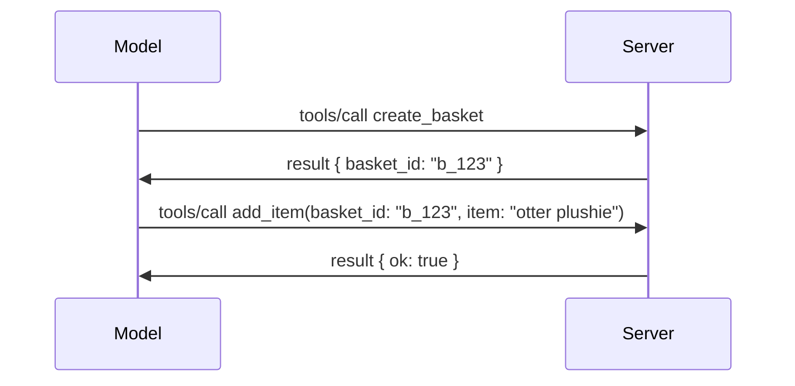

# MCPలో ఏమి మారుతుంది: 2026-07-28 రిలీజ్ కాండిడేట్

> **స్థితి:** రిలీజ్ కాండిడేట్. `2026-07-28` స్పెసిఫికేషన్ వ్రాసేటప్పుడు తుది కాదు. ఇది మే 21, 2026న ప్రకటించబడింది, మరియు జూలై 28, 2026 న విడుదలకి ఏర్పాట్లు ఉన్నాయి. ఈ పాఠంలో ఉన్న ప్రతీది రిలీజ్ కాండిడేట్‌ను వివరిస్తుంది; నిర్మాణం ప్రారంభించేముందు [డ్రాఫ్ట్ స్పెసిఫికేషన్](https://modelcontextprotocol.io/specification/draft) మరియు దాని [చేంజ్‌లాగ్](https://modelcontextprotocol.io/specification/draft/changelog) లో తాజా స్థితిని చూడండి. మిగిలిన కోర్సు ప్రస్తుత స్థిర విడుదల అయిన, **MCP స్పెసిఫికేషన్ 2025-11-25** ఆధారంగా వ్రాయబడింది, మరియు `2026-07-28` విడుదల అయినపుడు నవీకరించబడుతుంది.

## సమీక్ష

`2026-07-28` MCP ప్రారంభమైనప్పటి నుండి అత్యంత పెద్ద పునర్వినియోగం. ఆరు స్పెసిఫికేషన్ ఎnhancement ప్రపోసల్స్ (SEPs) ప్రోటోకాల్-స్థాయి సెషన్లను తొలగించి MCPని ట్రాన్స్‌పోర్ట్ లేయర్ వద్ద స్టేట్‌లెస్‌గా చేస్తాయి, ఎక్స్‌టెన్షన్స్ మొదటి-తరగతి, వర్షన్ నిర్ణయ మెకానిజంగా మారతాయి, మరియు ఈ తరగతి ముందు మీరు నేర్చుకున్న కొన్ని ఫీచర్లు (Roots, Sampling, Logging) కొత్త లైఫ్‌సైకిల్ పాలసీ క్రింద డిప్రికేటెడ్‌గా గుర్తించబడ్డాయి. ఈ పాఠం ఏమి మారుతున్నదో, ఎందుకు ముఖ్యం, మరియు మీరు ఇప్పటివరకు `2025-11-25` ఆధారంగా వ్రాసిన కోడ్‌కు ఇది ఏమిటి అర్థం అవుతుందో सारాంశంచేస్తుంది.

మూలం: [The 2026-07-28 MCP Specification Release Candidate](https://blog.modelcontextprotocol.io/posts/2026-07-28-release-candidate/) (Model Context Protocol Blog, డేవిడ్ సోరియా పారా మరియు డెన్ డెలిమార్స్కీ).

## నేర్చుకునే లక్ష్యాలు

ఈ పాఠం ముగిసేవరకు, మీరు చేయగలుగుతారు:

- MCP స్టేట్‌లెస్ ప్రోటోకాల్ కోర్ వైపు మారుతున్నందుకు కారణాన్ని మరియు ఇది హారిజాంటల్ స్కేల్డ్ డిప్లాయ్‌మెంట్‌ల కోసం ఏ సమస్య పరిష్కరిస్తుందో వివరణ ఇవ్వండి.
- `initialize`/`initialized` హ్యాండ్‌షేక్ మరియు `Mcp-Session-Id` హెడ్డర్ ఎలా మారాయో వివరించండి.
- కొత్త `Mcp-Method` మరియు `Mcp-Name` హెడ్డర్‌లు మరియు `ttlMs`/`cacheScope` క్యాచింగ్ మెటాడేటాను గుర్తించండి.
- ఎక్స్‌టెన్షన్స్ ఫ్రేమ్‌వర్క్ మరియు ఈ విడుదలతో వచ్చే రెండు ఎక్స్‌టెన్షన్స్: MCP Apps మరియు Tasks ను గుర్తించండి.
- ఆరు ఆథరిజేషన్ SEPs గుర్తించి అవి OAuth 2.0 / OIDC సారూప్యతను బలపరుస్తాయో చెప్పండి.
- ఏ కోర్ ఫీచర్లు (Roots, Sampling, Logging) ఇప్పుడు డిప్రికేటెడ్ అవుతున్నాయి మరియు దాని ఆచరణలో అర్థం ఏమిటో చెప్పండి.
- టూల్ `inputSchema`/`outputSchema` కోసం ఫుల్ JSON Schema 2020-12 మార్పు వివరణ ఇవ్వండి.

## ఒక స్టేట్‌లెస్ ప్రోటోకాల్

ప్రధాన మార్పు: MCP ప్రోటోకాల్ లేయర్ వద్ద స్టేట్‌లెస్ అవుతుంది.

### ముందు (2025-11-25): సెషన్లు ఒక సర్వర్ ఉదాహరణకు సంబంధించినవి అవుతాయి

Streamable HTTP పై టూల్‌ను కాల్ చేయడం `initialize` హ్యాండ్‌షేక్‌తో మొదలవుతుంది. సర్వర్ ప్రతిస్పందనగా మొత్తం తర్వాత ప్రతి అభ్యర్థన `Mcp-Session-Id` హెడ్డర్‌ను తీసుకుని ఉండాలి:

```http
POST /mcp HTTP/1.1
Mcp-Session-Id: 1868a90c-3a3f-4f5b
Content-Type: application/json

{"jsonrpc":"2.0","id":2,"method":"tools/call",
 "params":{"name":"search","arguments":{"q":"otters"}}}
```

ఎందుకంటే సెషన్ ఏ సర్వర్ ఉదాహరణ ఇచ్చిందో దానితో బంధించబడుతుంది, హారిజాంటల్ స్కేల్డ్ డిప్లాయ్‌మెంట్‌లకు లొడ్ బేలెన్సర్ వద్ద **స్టికీ రౌటీంగ్** మరియు ఉదాహరణల మధ్య **షేర్డ్ సెషన్ స్టోర్** అవసరం.

### తర్వాత (2026-07-28): ప్రతీ అభ్యర్థన స్వీయ కంటెయిన్డ్

```http
POST /mcp HTTP/1.1
MCP-Protocol-Version: 2026-07-28
Mcp-Method: tools/call
Mcp-Name: search
Content-Type: application/json

{"jsonrpc":"2.0","id":1,"method":"tools/call",
 "params":{"name":"search","arguments":{"q":"otters"},
           "_meta":{"io.modelcontextprotocol/clientInfo":{"name":"my-app","version":"1.0"}}}}
```

ఏ సర్వర్ ఉదాహరణ ఆ అభ్యర్థనను నిర్వహించగలదు. కీలక మార్పులు:

- **`initialize`/`initialized` హ్యాండ్‌షేక్ తొలగించబడింది** ([SEP-2575](https://github.com/modelcontextprotocol/modelcontextprotocol/pull/2575)). ప్రోటోకాల్ వర్షన్, క్లయింట్ సమాచారం మరియు క్లయింట్ సామర్థ్యాలు ప్రతి అభ్యర్థనలో `_meta` కు మళ్లించబడతాయి. ఒక కొత్త `server/discover` పద్ధతి క్లయింట్ అవసరమైతే ముందుగా సర్వర్ సామర్థ్యాలను పొందగలదు.
- **`Mcp-Session-Id` హెడ్డర్ మరియు ప్రోటోకాల్-స్థాయి సెషన్ తొలగించబడింది** ([SEP-2567](https://github.com/modelcontextprotocol/modelcontextprotocol/pull/2567)). స్టికీ రౌటీంగ్ మరియు షేర్డ్ సెషన్ స్టోర్లు ప్రోటోకాల్ లేయర్ వద్ద ఇక అవసరం కావు.

### స్టేట్‌లెస్ ప్రోటోకాల్, స్టేట్‌ఫుల్ అప్లికేషన్లు

ప్రోటోకాల్-స్థాయి సెషన్ తొలగించడం అంటే మీ సర్వర్ స్టేట్‌ఫుల్ కాలేదు అని కాదు. సిఫార్సు చేయబడిన నమూనా హింది HTTP APIs ఎప్పుడూ ఉపయోగించినదే: ఒక టూల్ కాల్ నుండీ ఒక స్పష్టమైన హ్యాండిల్ (ఉదా: `basket_id`, `browser_id`) సృష్టించి, ఆ హ్యాండిల్‌ను తర్వాతి కాల్‌లలో సాధారణ ఆర్గ్యుమెంట్‌గా మోడల్‌కు పంపాలని ఆమోదించటం.



ఇది ట్రాన్స్‌పోర్ట్ మెటాడేటాలో దాచినప్పటికీ స్థితిని మోడల్‌కు కనిపించేలా మరియు సమంజసముగా చేస్తుంది, మరియు ఏ సర్వర్ ఉదాహరణ ఏ కాల్‌ని నిర్వర్తించగలదు.

### సర్వర్-కు-క్లయింట్ అభ్యర్థనలు, పునఃరూపకల్పన

ఒక స్టేట్‌లెస్ ప్రోటోకాల్ సర్వర్ ఒక క్లయింట్ నుంచి ఏదైనా మధ్యలో అడగడానికి (ఉదా: elicitation ప్రాంప్ట్) మార్గం అవసరం:

- **సర్వర్-ప్రేరిత అభ్యర్థనలు కేవలం సర్వర్ యాక్టివ్‌గా క్లయింట్ అభ్యర్థనను ప్రాసెస్ చేస్తుండగా మాత్రమే జారీ చేయబడతాయి** ([SEP-2260](https://github.com/modelcontextprotocol/modelcontextprotocol/pull/2260)) – ఇది పూర్వం సిఫార్సుగా ఉండేది, ఇప్పుడు అవసరం. యూజర్ ఎప్పుడూ అనుకున్నపుడే ప్రాంప్ట్ కావాలి.
- **మల్టి రౌండ్-ట్రిప్ అభ్యర్థనలు** ([SEP-2322](https://github.com/modelcontextprotocol/modelcontextprotocol/pull/2322)) SSE స్ట్రీమ్ ని తెరిచి ఉంచడం పొదుపు చేస్తాయి. ఈ స్థానంలో, సర్వర్ `InputRequiredResult` ని తిరిగి పంపుతుంది:

  ```json
  {
    "resultType": "inputRequired",
    "inputRequests": {
      "confirm": {
        "type": "elicitation",
        "message": "Delete 3 files?",
        "schema": { "type": "boolean" }
      }
    },
    "requestState": "eyJzdGVwIjoxLCJmaWxlcyI6WyJhIiwiYiIsImMiXX0="
  }
  ```

  క్లయింట్ సమాధానాలను సేకరించి, `inputResponses` మరియు ప్రతిధ్వనించిన `requestState` తో అసలు కాల్‌ను తిరిగి పంపుతుంది. ఏ సర్వర్ ఉదాహరణ తిరిగి ప్రయత్నాన్ని చేపట్టవచ్చు ఎందుకంటే అవసరమైన ప్రతీటిం లోడ్‌లోనే ఉంటుంది.

### రూటబుల్, క్యాచబుల్, ట్రేసబుల్

మూడు చిన్న మార్పులు స్టేట్‌లెస్ ట్రాఫిక్‌ను నిర్వహించడం సులభం చేస్తాయి:

- **`Mcp-Method` మరియు `Mcp-Name` హెడ్డర్లను Streamable HTTP లో అవసరం** ([SEP-2243](https://github.com/modelcontextprotocol/modelcontextprotocol/pull/2243)), కాబట్టి లొడ్ బేలెన్సర్లు, గేట்வேలు, మరియు రేట్ లిమిటర్లు JSON బాడీ పరిశీలన లేకుండానే ఆపరేషన్ పై రౌటింగ్ చేయవచ్చు. హెడ్డర్లు మరియు బాడీ వాదన పగిలితే సర్వర్ అభ్యర్థనలను తిరస్కరిస్తుంది.
- **`tools/list` మరియు వనరు చదవడం ఫలితాలు `ttlMs` మరియు `cacheScope` కలిగి ఉంటాయి** ([SEP-2549](https://github.com/modelcontextprotocol/modelcontextprotocol/pull/2549)), HTTP `Cache-Control` ఆధారంగా రూపొందించబడ్డాయి. క్లయింట్లు లిస్ట్ ఫలితం ఎంతకాలం తాజా ఉన్నదో, మరియు అది వాడుకర్ల మధ్య పంచుకోవడం సురక్షితమా లేదా తెలుసుకోవచ్చు, దీర్ఘకాలిక SSE స్ట్రీమ్ అవసరం లేకుండా.
- **W3C ట్రేస్ కాంటెక్స్ట్ వ్యాప్తి `_meta` లో డాక్యుమెంట్** ([SEP-414](https://github.com/modelcontextprotocol/modelcontextprotocol/pull/414)), `traceparent`, `tracestate`, మరియు `baggage` కీలను స్థిరీకరిస్తూ, ఒక విస్తరించబడిన ట్రేస్ క్లయింట్ SDK, MCP సర్వర్, మరియు డౌన్‌స్ట్రీమ్ సిస్టమ్‌ల మధ్య [OpenTelemetry](https://opentelemetry.io/) అనుకూల బ్యాకెండ్‌లో అనుసరించగలదు.

## ఎక్స్‌టెన్షన్స్ మొదటి-తరగతి అవుతాయి

ఎక్స్‌టెన్షన్స్ అనధికారికంగా `2025-11-25` లో ఉన్నపు[SEP-2133](https://github.com/modelcontextprotocol/modelcontextprotocol/pull/2133) వాటిని అధికారికంగా రూపొందిస్తుంది:

- ఎక్స్‌టెన్షన్స్ రివర్స్-DNS IDs ద్వారా గుర్తింపు పొందతాయి.
- అవి క్లయింట్ మరియు సర్వర్ సామర్థ్యాలలో `extensions` మ్యాప్ ద్వారా చర్చించబడతాయి.
- అవి వారి సొంత `ext-*` రిపాజిటరీలు లో ఉంటాయి, డెలిగేటెడ్ నిర్వహణదారులతో మరియు ప్రాథమిక స్పెసిఫికేషన్ నుండి స్వతంత్రంగా వర్షన్ చేస్తాయి.
- SEP ప్రాసెస్‌లో కొత్త ఎక్స్‌టెన్షన్స్ ట్రాక్ వాటిని ప్రయోగాత్మకంగా నుంచి అధికారికంగా ప్రయాణం చేయడానికి మార్గం ఇస్తుంది.

ఈ విడుదల రెండు అధికారిక ఎక్స్‌టెన్షన్స్ విడుదల చేస్తుంది.

### MCP Apps: సర్వర్-రెంటెర్డ్ వాడుకరి ఇంటర్‌ఫేసులు

[MCP Apps](https://blog.modelcontextprotocol.io/posts/2026-01-26-mcp-apps/) ([SEP-1865](https://github.com/modelcontextprotocol/modelcontextprotocol/pull/1865)) సర్వర్లు ఇంటరాక్టివ్ HTML ఇంటర్‌ఫేసులను సపోర్ట్ చేస్తాయి, ఆ ఇన్ఫ్రేమ్‌లో హోస్టులు రోండరింగ్ చేస్తాయి. టూల్స్ తమ UI టెంప్లేట్లను ముందుగా ప్రకటిస్తాయి కాబట్టి హోస్టులు వాటిని పూర్వగతిగా పొందగలుగుతాయి, క్యాచింగ్, మరియు భద్రతా సమీక్ష చేస్తాయి. మీరు ఇప్పటికే [Lesson 15: MCP Apps](../03-GettingStarted/15-mcp-apps/README.md)లో ఈ విధానాల ప్రాథమికాలు నేర్చుకున్నారు — ఎక్స్‌టెంచన్ ఫ్రేమ్‌వర్క్ కింద MCP Apps ఇప్పుడు అధికారిక ఎక్స్‌టెన్షన్, ప్రయోగాత్మక ప్రాథమిక ఫీచర్ కాకుండా.

### Tasks ఎక్స్‌టెన్షన్ పై గ్రాడ్యుయేట్ అవుతుంది

Tasks `2025-11-25` వద్ద ప్రయోగాత్మక ప్రాథమిక ఫీచర్‌గా ship అయ్యింది. ఉత్పత్తి వాడకం పునఃవిన్యాస అవసరాన్ని చూపింది కాబట్టి దీని సరైన స్థానం ఎక్స్‌టెన్షన్: [Tasks ఎక్స్‌టెన్షన్](https://github.com/modelcontextprotocol/modelcontextprotocol/pull/2663) స్టేట్‌లెస్ మోడల్ చుట్టూ లైఫ్‌సైకిల్‌ను మార్చిస్తుంది — సర్వర్ `tools/call` కి టాస్క్ హ్యాండిల్‌తో స్పందించగలదు, క్లయింట్ `tasks/get`, `tasks/update`, మరియు `tasks/cancel` తో దానిని ముందుకు నడిపిస్తుంది. టాస్క్ సృష్టి సర్వర్ నిర్ణయితం: క్లయింట్ ఈ ఎక్స్‌టెన్షన్‌ను ప్రకటించి, సర్వర్ ఒక కాల్ టాస్క్ గా నడిపించాలా అనేది నిర్ణయిస్తాడు. సురక్షితంగా స్కోప్ చేయలేనందున `tasks/list` పూర్తిగా తొలగించబడింది.

> **మైగ్రేషన్ గమనిక:** మీరు ప్రయోగాత్మక `2025-11-25` Tasks API అమలు చేసినట్లయితే, మీరు కొత్త ఎక్స్‌టెన్షన్ లైఫ్‌సైకల్ కి మైగ్రేట్ కావాలి — ఇది పాతదానికి అనుకూలం కాదు.

## ఆథరిజేషన్ బలపరిచుట

ఆరు SEPs [ఆథరిజేషన్ స్పెసిఫికేషన్](https://modelcontextprotocol.io/specification/draft/basic/authorization) ను బలపరిచేందుకు OAuth 2.0 / OpenID Connect వాస్తవ వాడకాలకు దగ్గరగా చేస్తాయి:

| SEP | మార్పు |
|---|---|
| [SEP-2468](https://github.com/modelcontextprotocol/modelcontextprotocol/pull/2468) | ఆథరిజేషన్ ప్రతిస్పందనలలో `iss` ప్యారామీటర్‌ను క్లయింట్లు [RFC 9207](https://www.rfc-editor.org/rfc/rfc9207) ప్రకారం ధృవీకరించాలి, ఇది MCP యొక్క ఒకే క్లయింట్, అనేక సర్వర్ నమూనాలో సాధారణమైన మిక్స్-అప్ దాడులను నివారిస్తుంది. భవిష్యత్ వెర్షన్ `iss` లేకుండా ప్రతిస్పందనలను తిరస్కరించాలి. |
| [SEP-837](https://github.com/modelcontextprotocol/modelcontextprotocol/pull/837) | డైనమిక్ క్లయింట్ రిజిస్ట్రేషన్ సమయంలో క్లయింట్లు తమ OpenID Connect `application_type` ను ప్రకటిస్తారు, ఆథరిజేషన్ సర్వర్లు డెస్క్టాప్/CLI క్లయింట్‌ను `"web"`గా డిఫాల్ట్ చేయడాన్ని నివారించి, దాని లోకాహోస్ట్ redirect URIని తిరస్క‌రించ‌కుండా చేస్తుంది. |
| [SEP-2352](https://github.com/modelcontextprotocol/modelcontextprotocol/pull/2352) | క్లయింట్లు నమోదు చేసిన క్రెడెన్షియల్స్‌ను జారీ చేస్తున్న ఆథరిజేషన్ సర్వర్ `issuer`కి బధ్ధం చేస్తారు మరియు వనరు ఆథorizేషన్ సర్వర్లు మధ్య మార్చినప్పుడు మళ్లీ నమోదు చేస్తారు. |
| [SEP-2207](https://github.com/modelcontextprotocol/modelcontextprotocol/pull/2207) | OpenID Connect-శైలీ ఆథరిజేషన్ సర్వర్ల నుండి రిఫ్రెష్ టోకెన్లను ఎలా కోరుకోవాలి వివరిస్తుంది. |
| [SEP-2350](https://github.com/modelcontextprotocol/modelcontextprotocol/pull/2350) | స్టెప్-అప్ ఆథరిజేషన్ సమయంలో స్కోప్ సేకరణ స్పష్టత ఇస్తుంది. |
| [SEP-2351](https://github.com/modelcontextprotocol/modelcontextprotocol/pull/2351) | `.well-known` డిస్కవరీ సఫిక్స్ స్పష్టత ఇస్తుంది. |

మీరు ఈ రోజు MCP కోసం ఆథరిజేషన్ సర్వర్ తయారుచేస్తున్నట్లయితే, ఆథరిజేషన్ ప్రతిస్పందనలపై ఇప్పుడే `iss` అందించడం ప్రారంభించండి — ప్రస్తుతం `02-Security` ([02-Security](../02-Security/README.md)) లో ఉన్న ఆథరిజేషన్ మార్గదర్శకాలను చూడండి.

## Roots, Sampling, మరియు Logging డిప్రికేటెడ్ అయ్యాయి

కొత్త [ఫీచర్ లైఫ్‌సైకిల్ పాలసీ](https://github.com/modelcontextprotocol/modelcontextprotocol/pull/2577) ([SEP-2577](https://github.com/modelcontextprotocol/modelcontextprotocol/pull/2577)) క్రింద, మీరు [Core Concepts](./README.md#roots)లో నేర్చుకున్న మూడు ప్రధాన క్లయింట్ ప్రిమిటివ్స్ **డిప్రికేటెడ్** స్థితికి వెళ్తున్నాయి:

| ఫీచర్ | సిఫార్సు చేయబడిన ప్రత్యామ్నాయం |
|---|---|
| Roots | టూల్ పారామితులు, వనరు URIలు, లేదా సర్వర్ కాన్ఫిగరేషన్ |
| Sampling | LLM ప్రొవైడర్ APIsతో ప్రత్యక్ష సమ్మిళితీకరణ |
| Logging | stdio ట్రాన్స్‌పోర్ట్లకు `stderr`; నిర్మిత విషయపరచు కోసం OpenTelemetry |

ఇవి **కేవలం సూచనాత్మక డిప్రికేషన్లు**: ఈ విడుదలలో మరియు దీని నుండి గత సంవత్సరంలో ప్రచురిత ప్రతి స్పెసిఫికేషన్ వర్షన్‌లో పద్ధతులు, రకాల, మరియు సామర్థ్య ఫ్లాగ్‌లు పని చేస్తుంటాయి. వారిని పూర్తిగా తొలగించడానికి లైఫ్‌సైకిల్ పాలసీ కింద ప్రత్యేక SEP అవసరమవుతుంది — కాబట్టి మీ ప్రస్తుత [Sampling](../03-GettingStarted/14-sampling/README.md) నమూనాల్లో ఎటువంటి విఘాతం ఉండదు, కానీ కొత్త సర్వర్లు పై పేర్కొన్న ప్రత్యామ్నాయ నమూనాలను ప్రాధాన్యం ఇవ్వాలి.

## టూల్స్ కోసం పూర్తి JSON Schema 2020-12

టూల్ `inputSchema` మరియు `outputSchema` పూర్తిగా [JSON Schema 2020-12](https://json-schema.org/draft/2020-12) ([SEP-2106](https://github.com/modelcontextprotocol/modelcontextprotocol/pull/2106)) కు పైకి తీసుకు వచ్చాయి:

- ఇన్‌పుట్ స్కీమాలు `type: "object"` రూట్ పరిమితి ఉంచుతాయి కానీ ఇప్పుడు కంపోజిషన్ (`oneOf`, `anyOf`, `allOf`), షరతులు, మరియు సూచనలు (`$ref`, `$defs`) అనుమతిస్తాయి.
- అవుట్‌పుట్ స్కీమాలు అనియంత్రితం మరియు `structuredContent` ఇప్పుడు కేవలం ఒక ఆబ్జెక్ట్ కాకుండా ఏ JSON విలువైనా కావచ్చు.
- అమలు చేసే వారు బాహ్య `$ref` URIలను ఆటో-డిరెఫరెన్స్ చేయకూడదు మరియు స్కీమ్ లోతు మరియు ధృవీకరణ సమయాన్ని పరిమితం చేయాలి (సర్వర్ పక్కన స్కీమాల ధృవీకరణ నిర్వాహక దృష్టితో).

తప్పిపోయిన వనరు కోడ్ MCP-కస్టమ్ `-32002` నుండి JSON-RPC ప్రమాణ `-32602` (అసమర్థ ప్యారామ్స్) కు మారింది ([SEP-2164](https://github.com/modelcontextprotocol/modelcontextprotocol/pull/2164)). మీరు `-32002` విలువను గుర్తించి ఉంటే, దాన్ని నవీకరించుకోవాలి.

## ఇక్కడినుంచి ప్రోటోకాల్ ఎలా అభివృద్ధి చెందుతుంది

ఈ విడుదలలో బ్రేకింగ్ మార్పులు ఉన్నాయి, దానిని MCP నిర్వహకులు భవిష్యత్తులో సాధారణం కావాలని అనుకోరు. మూడు పాలన SEPs మళ్లీ కనబడకుండా ప్రయత్నిస్తాయి:

- **ఫీచర్ లైఫ్‌సైకిల్ పాలసీ** ప్రతి ఫీచర్‌కు ఒక Active → Deprecated → Removed మార్గం ఇస్తుంది, డిప్రికేషన్ మరియు తొలగింపుకు కనీసం పన్నెండు నెలల తేడాతో.
- **ఎక్స్‌టెన్షన్స్ ఫ్రేమ్‌వర్క్** కొత్త సామర్థ్యాలను ఆప్ట్-ఇన్ ఎక్స్‌టెన్షన్‌లుగా విడుదల చేసి అక్కడ స్థిరపరచటానికి, తరువాత (లేదా ఎప్పుడైనా) ప్రాథమిక స్పెసిఫికేషన్‌కు వెళ్లడానికి మార్గం ఇస్తుంది.

- సరిపోయే సూట్లో ([conformance suite](https://github.com/modelcontextprotocol/conformance)) సరిపోయే పరిస్థితి చివరకు వచ్చేవరకు - ఒక స్టాండర్డ్ ట్రాక్ SEP ఫైనల్ స్థితికి చేరుకోలదు ([SEP-2484](https://github.com/modelcontextprotocol/modelcontextprotocol/pull/2484)) — అదే సూట్ رسمی SDKలకు స్కోర్ చేసే [SDK టియర్ సిస్టమ్](https://github.com/modelcontextprotocol/modelcontextprotocol/pull/1777).

## విడుదల కాలపరిమాణం మరియు నిర్ధారణ

- విడుదల అభ్యర్థి మే 21, 2026 న లాక్ చేయబడింది.
- తుది స్పెసిఫికేషన్ జూలై 28, 2026కి షెడ్యూల్ చేయబడింది.
- ఇరు తేదీల మధ్య పది వారాల విండో SDK నిర్వహకులు మరియు క్లయింట్ అమలు దారులు వాస్తవ వర్క్‌లోడ్‌లతో మార్పులను నిర్ధారించడానికి అవకాశం ఇస్తుంది; టైర్ 1 SDKలు ఈ వ్యవధిలో [SDK టియర్ సిస్టమ్](https://modelcontextprotocol.io/docs/sdk) కింద మద్దతు పంపిణీ చేయాల్సి ఉంటుంది.
- పూర్తి మార్పుల సెట్ను [డ్రాఫ్ట్ స్పెసిఫికేషన్](https://modelcontextprotocol.io/specification/draft) మరియు దాని [చేంజ్‌లాగ్](https://modelcontextprotocol.io/specification/draft/changelog)లో ట్రాక్ చేయండి.

## ఈ పాఠ్యक्रमం కోసం దీని అర్ధం ఏమిటి

మీరు ఇప్పటివరకూ ఈ కోర్సులో నేర్చుకున్న ప్రతిదీ **2025-11-25** కోసం లక్ష్యంగా ఉంది, ఇది `2026-07-28` విడుదలయ్యే వరకు ప్రస్తుత స్థిరమైన స్పెసిఫికేషన్‌గా కొనసాగుతుంది. స్పష్టంగా:

- **సెషన్లు మరియు `initialize` హ్యాండ్‌షేక్** ([మూల సిధ్ధాంతాలు](./README.md) మరియు [పాఠం 6: HTTP స్ట్రీమింగ్](../03-GettingStarted/06-http-streaming/README.md)లో ఉంది) ఇప్పటి వలె పనిచేస్తాయి, కాని మీరు `2026-07-28` అనుగుణమైన SDKలకు అప్గ్రేడ్ చేసినప్పుడు పై Stateless రిక్వెస్ట్ మోడల్‌తో మార్పు అవ్వడానికి భావించండి.
- **సాంప్లింగ్ మరియు రూట్స్** (తదుపరి [మూల సిధ్ధాంతాలు](./README.md)లో కూడా ఉన్నాయి) పూర్తిగా కార్యచరమైనవి కానీ డిప్రికేటెడ్ — కొత్త డిజైన్లు పై ఉల్లేఖితమైన ప్రత్యామ్నాయ నమూనాలు పై పREFER చేయాలి.
- **ప్రయోగాత్మక టాస్కులు ఫీచర్**, మీరు ఉపయోగించిరా అయితే, టాస్క్‌ల ఎక్స్‌టెన్షన్ కొత్త లైఫ్సైకిల్‌కి మార్పిడి చేయాల్సి ఉంటుంది.
- **MCP యాప్స్** ([పాఠం 15](../03-GettingStarted/15-mcp-apps/README.md)) ప్రాక్టీసులో ప్రభావం లేదు; అది కేవలం అధికారిక ఎక్స్‌టెన్షన్స్ ఫ్రేమ్‌వర్క్ కిందకి మార్చబడుతుంది.

## అదనపు వనరులు

- [2026-07-28 MCP స్పెసిఫికేషన్ విడుదల అభ్యర్థి (బ్లాగ్ పోస్ట్)](https://blog.modelcontextprotocol.io/posts/2026-07-28-release-candidate/)
- [MCP ట్రాన్స్‌పోర్ట్స్ భవిష్యత్తు](https://blog.modelcontextprotocol.io/posts/2025-12-19-mcp-transport-future/)
- [MCP డ్రాఫ్ట్ స్పెసిఫికేషన్](https://modelcontextprotocol.io/specification/draft)
- [MCP డ్రాఫ్ట్ చేంజ్‌లాగ్](https://modelcontextprotocol.io/specification/draft/changelog)
- [SEP మార్గదర్శకాలు](https://modelcontextprotocol.io/community/sep-guidelines)
- [MCP SDK టియర్ సిస్టమ్](https://modelcontextprotocol.io/docs/sdk)

## తదుపరి దశలు

[మూల సిధ్ధాంతాలు](./README.md)కి తిరిగి వెళ్లండి లేదా [సెక్యూరిటీ](../02-Security/README.md) కి కొనసాగించండి, ఇక్కడ నేడు `2025-11-25` మార్గదర్శకాలు రాబోయే పాత్రలకు ఎలా మ్యాపవుతున్నాయో చూడండి.

---

<!-- CO-OP TRANSLATOR DISCLAIMER START -->
**అస్వీకరణ**:
ఈ పత్రం AI అనువాద సేవ [Co-op Translator](https://github.com/Azure/co-op-translator) ఉపయోగించి అనువదించబడింది. మేము ఖచ్చితత్వానికి ప్రయత్నిస్తున్నప్పటికీ, ఆటోమేటెడ్ అనువాదాలు తప్పులు లేదా అసమగ్రతలను కలిగి ఉండవచ్చు. దాని స్వదేశ భాషలో ఉన్న అసలు పత్రాన్ని అధికారం కలిగిన మూలంగా పరిగణించాలి. కీలకమైన సమాచారం కోసం, ప్రొఫెషనల్ మానవ అనువాదాన్ని సిఫారసు చేస్తాము. ఈ అనువాదం ఉపయోగం వల్ల కలిగే ఏవైనా అపార్థాలు లేదా తప్పుదారులు కోసం మేము బాధ్యత వహించము.
<!-- CO-OP TRANSLATOR DISCLAIMER END -->