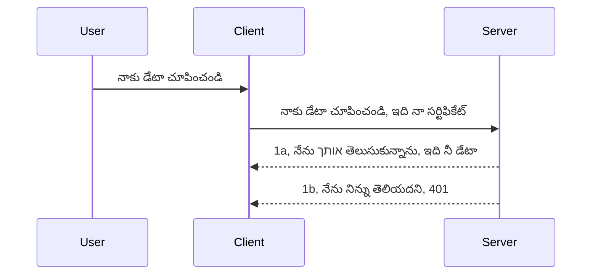

# సింపుల్ ఆథ్

MCP SDKలు OAuth 2.1 ఉపయోగాన్ని మద్దతు ఇస్తాయి, ఇది నిజానికి ఆథ్ సర్వర్, రిసోర్స్ సర్వర్, క్రెడెన్షియల్స్ పంపడం, కోడ్ పొందడం, కోడ్‌ను బేరర్ టోకెన్‌కు మార్పిడి చేయడం వంటి సంప్రదింపుల ప్రక్రియతో కూడుకున్న ఒక జట్ల ప్రక్రియ. మీరు OAuthకి అలవాటు కాకపోతే ఇది అమలు చేయడానికి గొప్ప విషయం అని, మీరు పరిక్షార్ధంగా సాధారణ స్థాయి ఆథ్ నుండి ప్రారంభించి మెరుగైన భద్రతకు ఎదగడం మంచి ఆలోచన. అందుకే ఈ అధ్యాయం ఉంది, ఇది మీకు మరింత అభివృద్ధి చెందిన ఆథ్ నిర్మించడానికి సహాయం చేస్తుంది.

## ఆథ్ అంటే ఏమిటి?

ఆథ్ అనగా authentication మరియు authorization కోసం సంక్షిప్త రూపం. మనం రెండు పనులు చేయాలి:

- **Authentication**, అంటే మన ఇంటికి వాడుకరి ఎంటర్ కావడానికి అనుమతిస్తామా అనేదాన్ని నిర్ణయించడం, అంటే వారు అక్కుడి రిసోర్స్ సర్వర్, మన MCP సర్వర్ ఫీచర్లు ఉన్న చోట ప్రవేశించేందుకు హక్కున్నదా అని తెలుసుకోవడం.
- **Authorization**, అంటే వాడుకరి అడిగిన ప్రత్యేక రిసోర్సులకు యాక్సెస్ ఉందా లేదా, ఉదాహరణకు ఆ ఆర్డర్లు లేదా ఉత్పత్తులు చదవడానికి అనుమతి ఉందా కానీ తొలగించడానిక కాదు వంటి ఇతర ఉదాహరణలను నిర్ధారించడం.

## క్రెడెన్షియల్స్: మనం సిస్టమ్ కు మనుగడ ఎలా చెప్పాలి

చాలా వెబ్ డెవలపర్లు సాధారణంగా సర్వర్ కు క్రెడెన్షియల్ ఇవ్వాలని ఆలోచిస్తారు, సాధారణంగా ఒక సీక్రెట్, ఇది వారు ఇక్కడ ఉండడానికి అనుమతించబడేదని చెబుతుంది "Authentication". ఈ క్రెడెన్షియల్ సాధారణంగా యూజర్నేమ్, పాస్వర్డ్ యొక్క base64 ఎన్‌కోడ్ చేసిన వెర్షన్ లేదా ఒక API కీ అవుతుంది, ఇది ప్రత్యేక యూజర్‌ను గుర్తిస్తుంది.

దీనిని "Authorization" అనే హెడ్డర్ ద్వారా ఇలా పంపిస్తారు:

```json
{ "Authorization": "secret123" }
```

దీనిని సాధారణంగా బేసిక్ ఆథెంటికేషన్ అంటారు. సంపూర్ణ ప్రవాహం ఇలా పని చేస్తుంది:



ఇప్పుడు ప్రవాహ దృక్పథం అర్థం చేసుకున్నాం, దీన్ని ఎలా అమలు చేయాలి? ఎక్కువ వెబ్ సర్వర్లలో మిడిల్‌వేర్ అనే కాన్సెప్ట్ ఉంటుంది, ఇది రిక్వెస్ట్ భాగంగా నడుస్తుంది, ఇది క్రెడెన్షియల్స్‌ని ధృవీకరించగలదు, మరియు వాటి సరైనదే అయితే రిక్వెస్ట్ ని అనుమతిస్తుంది. లేకపోతే ఆథ్ ఎర్రర్ని ఇస్తుంది. దీన్ని ఎలా అమలు చేయాలో చూద్దాం:

**Python**

```python
class AuthMiddleware(BaseHTTPMiddleware):
    async def dispatch(self, request, call_next):

        has_header = request.headers.get("Authorization")
        if not has_header:
            print("-> Missing Authorization header!")
            return Response(status_code=401, content="Unauthorized")

        if not valid_token(has_header):
            print("-> Invalid token!")
            return Response(status_code=403, content="Forbidden")

        print("Valid token, proceeding...")
       
        response = await call_next(request)
        # ఏదైనా కస్టమర్ హెడర్లు జోడించండి లేదా ప్రతిస్పందనలో ఏదైనా మార్పు జరపండి
        return response


starlette_app.add_middleware(CustomHeaderMiddleware)
```

ఇక్కడ:

- `AuthMiddleware` అనే మిడిల్‌వేర్ సృష్టించాము, దీనిలో `dispatch` మెతడ్ వెబ్ సర్వర్ ద్వారా అమలు చేయబడుతుంది.
- మిడిల్‌వేర్ ని వెబ్ సర్వర్ లో చేర్చాము:

    ```python
    starlette_app.add_middleware(AuthMiddleware)
    ```

- వెరిఫికేషన్ లాజిక్ రాశాము ఇది Authorization హెడ్డర్ ఉన్నదా మరియు పంపిన సీక్రెట్ సరైనదా చూసుకుంటుంది:

    ```python
    has_header = request.headers.get("Authorization")
    if not has_header:
        print("-> Missing Authorization header!")
        return Response(status_code=401, content="Unauthorized")

    if not valid_token(has_header):
        print("-> Invalid token!")
        return Response(status_code=403, content="Forbidden")
    ```

    సీక్రెట్ ఉన్నదో, సరైనదో అయితే `call_next` ని పిలిచి రిస్పాన్స్ ను తిరిగి ఇస్తుంది.

    ```python
    response = await call_next(request)
    # ఏదైనా కస్టమర్ హెడర్లను జోడించండి లేదా ప్రతిస్పందనలో ఏదైనా మార్పులు చేయండి
    return response
    ```

ఎలా పనిచేస్తుందంటే వెబ్ రిక్వెస్ట్ వచ్చినప్పుడు మిడిల్‌వేర్ అమలు అవుతుంది, వలన రిక్వెస్ట్ అనుమతించబడుతుంది లేదా క్లయింట్‌కు అనుమతి లేదు అనే ఎర్రరు తిరిగి ఇస్తుంది.

**TypeScript**

ఇక్కడ మనం Express ఫ్రేమ్‌వర్క్ తో మిడిల్‌వేర్ సృష్టించి MCP సర్వర్ కు రిక్వెస్ట్ చేరేముందు దాన్ని పట్టుకుంటాము. కింది కోడ్ చూడండి:

```typescript
function isValid(secret) {
    return secret === "secret123";
}

app.use((req, res, next) => {
    // 1. అధికారం హెడ్డర్ ఉందా?
    if(!req.headers["Authorization"]) {
        res.status(401).send('Unauthorized');
    }
    
    let token = req.headers["Authorization"];

    // 2. చెల్లుబాటుదాయినదేనా అని తనిఖీ చేయండి.
    if(!isValid(token)) {
        res.status(403).send('Forbidden');
    }

   
    console.log('Middleware executed');
    // 3. అభ్యర్థన పైపు లైన్లో తదుపరి దశకు పంపండి.
    next();
});
```

ఈ కోడ్ లో:

1. ముందుగా Authorization హెడ్డర్ ఉందా వద్దా చెక్ చేస్తాము, లేనైతే 401 ఎర్రర్ని ఇస్తాము.
2. క్రెడెన్షియల్/టోకెన్ సరైనదో లేదో చూసి, కాదు అయితే 403 ఎర్రర్ని ఇస్తాము.
3. చివరగా రిక్వెస్ట్‌ను అనుమతించి అడిగిన రిసోర్సును ఇస్తాము.

## వ్యాయామం: ఆథెంటికేషన్ అమలు చేయండి

మనం నేర్చుకున్న విషయాన్ని ఉపయోగించి అమలు చేద్దాం. ప్రణాళిక:

సర్వర్

- వెబ్ సర్వర్ మరియు MCP ఇన్స్టాన్స్ సృష్టించండి.
- సర్వర్ కోసం మిడిల్‌వేర్ అమలు చేయండి.

క్లయింట్

- క్రెడెన్షియల్ జతచేసి వెబ్ రిక్వెస్ట్ పంపండి హెడ్డర్ ద్వారా.

### -1- వెబ్ సర్వర్ మరియు MCP ఇన్స్టాన్స్ సృష్టించండి

> **ముందు చూడండి:** క్రింది TypeScript ఉదాహరణ HTTP ట్రాన్స్‌పోర్టులను `mcp-session-id` ఆధారంగా ట్రాన్స్‌పోర్ట్స్ మ్యాప్‌లో ట్రాక్ చేస్తుంది, ఇది **MCP Specification 2025-11-25** ప్రకారం. `2026-07-28` విడుదల అభ్యర్థనలో `initialize` హ్యాండ్షేక్ మరియు సెషన్ ఐడిని పూర్తిగా తొలగించబడుతుంది, కాబట్టి ప్రతి సెషన్ ట్రాన్స్‌పోర్ట్ మ్యాప్ స్థానంలో స్టేట్‌లెస్, స్వయం-contained రిక్వెస్ట్‌లు ఉంటాయి. మరింత సమాచారం కోసం చూడండి [What's Changing in MCP: The 2026-07-28 Release Candidate](../../01-CoreConcepts/mcp-2026-07-28-release-candidate.md).

మన మొదటి దశలో వెబ్ సర్వర్ ఇన్స్టాన్స్ మరియు MCP సర్వర్ ని సృష్టించాలి.

**Python**

ఇక్కడ MCP సర్వర్ ఇన్స్టాన్స్ ని సృష్టించి, starlette వెబ్ యాప్ సృష్టించి uvicorn తో హోస్ట్ చేస్తున్నాము.

```python
# MCP సర్వర్ సృష్టిస్తోంది

app = FastMCP(
    name="MCP Resource Server",
    instructions="Resource Server that validates tokens via Authorization Server introspection",
    host=settings["host"],
    port=settings["port"],
    debug=True
)

# starlette వెబ్ అనువర్తనం సృష్టిస్తోంది
starlette_app = app.streamable_http_app()

# uvicorn ద్వారా అనువర్తనాన్ని అందిస్తోంది
async def run(starlette_app):
    import uvicorn
    config = uvicorn.Config(
            starlette_app,
            host=app.settings.host,
            port=app.settings.port,
            log_level=app.settings.log_level.lower(),
        )
    server = uvicorn.Server(config)
    await server.serve()

run(starlette_app)
```

ఈ కోడ్ లో:

- MCP సర్వర్ సృష్టించాము.
- MCP సర్వర్ నుండి starlette వెబ్ యాప్ ని నిర్మించాము, `app.streamable_http_app()`.
- uvicorn ద్వారా వెబ్ యాప్ హోస్ట్ చేసి సర్వ్ చేయబడింది `server.serve()`.

**TypeScript**

ఇక్కడ MCP సర్వర్ ఇన్స్టాన్స్ సృష్టిస్తున్నాము.

```typescript
const server = new McpServer({
      name: "example-server",
      version: "1.0.0"
    });

    // ... సర్వర్ వనరులు, టూల్స్ మరియు ప్రాంప్ట్‌లను సెటప్ చేయండి ...
```

ఈ MCP సర్వర్ సృష్టికరణ POST /mcp రూట్ నిర్వచనల్లో జరగాలి కాబట్టి పై కోడ్‌ను పైన చెప్పిన విధంగా మార్చుకుందాం:

```typescript
import express from "express";
import { randomUUID } from "node:crypto";
import { McpServer } from "@modelcontextprotocol/sdk/server/mcp.js";
import { StreamableHTTPServerTransport } from "@modelcontextprotocol/sdk/server/streamableHttp.js";
import { isInitializeRequest } from "@modelcontextprotocol/sdk/types.js"

const app = express();
app.use(express.json());

// సెషన్ ID ద్వారా రవాణాలను నిల్వ చేయడం కోసం మ్యాప్
const transports: { [sessionId: string]: StreamableHTTPServerTransport } = {};

// క్లయింట్-టు-సర్వర్ కమ్యూనికేషన్ కోసం POST అభ్యర్థనలను నిర్వహించండి
app.post('/mcp', async (req, res) => {
  // ఉన్న సెషన్ ID కోసం తనిఖీ చేయండి
  const sessionId = req.headers['mcp-session-id'] as string | undefined;
  let transport: StreamableHTTPServerTransport;

  if (sessionId && transports[sessionId]) {
    // ఉన్న రవాణాను మళ్లీ ఉపయోగించండి
    transport = transports[sessionId];
  } else if (!sessionId && isInitializeRequest(req.body)) {
    // కొత్త ప్రారంభిక అభ్యర్థన
    transport = new StreamableHTTPServerTransport({
      sessionIdGenerator: () => randomUUID(),
      onsessioninitialized: (sessionId) => {
        // సెషన్ ID ద్వారా రవాణాను నిల్వ చేయండి
        transports[sessionId] = transport;
      },
      // DNS రీబైండింగ్ రక్షణ వెనుకబడిన అనుకూలత కోసం డిఫాల్ట్‌గా అచేతనం. మీరు ఈ సర్వర్‌ను
      // స్థానికంగా నడపుతున్నట్లయితే, ఖచ్చితంగా సెట్ చేయండి:
      // enableDnsRebindingProtection: true,
      // allowedHosts: ['127.0.0.1'],
    });

    // మూసివేయబడినప్పుడు రవాణాను శుభ్రపరచండి
    transport.onclose = () => {
      if (transport.sessionId) {
        delete transports[transport.sessionId];
      }
    };
    const server = new McpServer({
      name: "example-server",
      version: "1.0.0"
    });

    // ... సర్వర్ వనరులు, పరికరాలు మరియు ప్రాంప్ట్‌లను ఏర్పాటు చేయండి ...

    // MCP సర్వర్‌కు కనెక్ట్ అవ్వండి
    await server.connect(transport);
  } else {
    // చెల్లనిది అభ్యర్థన
    res.status(400).json({
      jsonrpc: '2.0',
      error: {
        code: -32000,
        message: 'Bad Request: No valid session ID provided',
      },
      id: null,
    });
    return;
  }

  // అభ్యర్థనను నిర్వహించండి
  await transport.handleRequest(req, res, req.body);
});

// GET మరియు DELETE అభ్యర్థనల కోసం మళ్లీ ఉపయోగించదగిన హ్యాండలర్
const handleSessionRequest = async (req: express.Request, res: express.Response) => {
  const sessionId = req.headers['mcp-session-id'] as string | undefined;
  if (!sessionId || !transports[sessionId]) {
    res.status(400).send('Invalid or missing session ID');
    return;
  }
  
  const transport = transports[sessionId];
  await transport.handleRequest(req, res);
};

// SSE ద్వారా సర్వర్-టు-క్లయింట్ నోటిఫికేషన్ల కోసం GET అభ్యర్థనలను నిర్వహించండి
app.get('/mcp', handleSessionRequest);

// సెషన్ ముగింపుకు DELETE అభ్యర్థనలను నిర్వహించండి
app.delete('/mcp', handleSessionRequest);

app.listen(3000);
```

ఇప్పుడు మీరు చూడవచ్చు MCP సర్వర్ సృష్టికరణ `app.post("/mcp")` లోకి తరలించబడింది.

ఇప్పుడు రాబోయే క్రెడెన్షియల్ ధృవీకరణ కోసం మిడ్‌ల్వేర్ సృష్టి దశకు ముందడుగు వేద్దాం.

### -2- సర్వర్ కోసం మిడిల్‌వేర్ అమలు చేయండి

ఇప్పుడు మిడిల్‌వేర్ భాగానికి వస్తాము. ఇక్కడ `Authorization` హెడ్డర్ లో క్రెడెన్షియల్ చూడండి మరియు ధృవీకరించండి. సరైనదైతే రిక్వెస్ట్ ఆమోదించి అవసరమైన పని చేద్దాం (ఉదా: టూల్స్ జాబితా, రిసోర్స్ చదవడం లేదా MCP ఫంక్షనాలిటీ).

**Python**

మిడిల్‌వేర్ సృష్టించడానికి, `BaseHTTPMiddleware` నుండి వారసత్వాన్ని కలిగించిన క్లాస్ అవసరం. ఇక్కడ రెండు ముఖ్యమైన అంశాలు ఉన్నాయి:

- రిక్వెస్ట్ `request` ఇది నుండి హెడ్డర్ సమాచారాన్ని చదువుతాం.
- క్లయింట్ సరైన క్రెడెన్షియల్ తీసుకువచ్చినట్లయితే `call_next` అనే కాల్‌బ్యాక్‌ని పిలవాలి.

ముందు చూడాలి `Authorization` హెడ్డర్ లేనప్పుడు ఎలా నిర్వహించాలి:

```python
has_header = request.headers.get("Authorization")

# హెడ్డర్ లేదు, 401 తో విఫలమవ్వండి, లేని పక్షంలో ముందుకు సాగండి.
if not has_header:
    print("-> Missing Authorization header!")
    return Response(status_code=401, content="Unauthorized")
```

ఇక్కడ క్లయింట్ ఆథెంటికేషన్ విఫలమై 401 అనధికార మేసేజ్ పంపబడుతుంది.

తరువాత, క్రెడెన్షియల్ పంపబడితే దాని సరైనదిగా ధృవీకరించాలి:

```python
 if not valid_token(has_header):
    print("-> Invalid token!")
    return Response(status_code=403, content="Forbidden")
```

ఎలా 403 నిషేధ మేసేజ్ పంపబడిందో గమనించండి. క్రింద పూర్తి మిడిల్‌వేర్ అమలును చూద్దాం:

```python
class AuthMiddleware(BaseHTTPMiddleware):
    async def dispatch(self, request, call_next):

        has_header = request.headers.get("Authorization")
        if not has_header:
            print("-> Missing Authorization header!")
            return Response(status_code=401, content="Unauthorized")

        if not valid_token(has_header):
            print("-> Invalid token!")
            return Response(status_code=403, content="Forbidden")

        print("Valid token, proceeding...")
        print(f"-> Received {request.method} {request.url}")
        response = await call_next(request)
        response.headers['Custom'] = 'Example'
        return response

```

బాగుంది, కానీ `valid_token` ఫంక్షన్ గురించి? ఇది ఇక్కడ ఉంది:

```python
# ఉత్పత్తి కొరకు వాడకండి - దయచేసి మెరుగుపరుచండి !!
def valid_token(token: str) -> bool:
    # "Bearer " ప్రిఫిక్స్ ను తీసివేయండి
    if token.startswith("Bearer "):
        token = token[7:]
        return token == "secret-token"
    return False
```

ఇది స్పష్టంగా మెరుగుపరచుకోవాలి.

ముఖ్యమైనది: ఈ రకమైన సీక్రెట్లు ఎప్పుడూ కోడ్ లో ఉండాలి కాదు. వీటిని డేటా సోర్స్ నుండి లేదా IDP (identity service provider) నుండి తీసుకోవడం లేదా IDP ను ధృవీకరణ చేయించడమే మంచిది.

**TypeScript**

Express తో దీన్ని అమలు చేయడానికి, మిడిల్‌వేర్ ఫంక్షన్‌లను తీసుకునే `use` మెతడ్‌ను పిలవాలి.

మనం చేయాల్సినవి:

- రిక్వెస్ట్ వేరియబుల్‌తో ఇంటరాక్ట్ చేసి `Authorization` ప్రాపర్టీలో పంపబడిన క్రెడెన్షియల్ చెక్ చేయాలి.
- క్రెడెన్షియల్ ధృవీకరిస్తే రిక్వెస్ట్ కొనసాగించనివ్వాలి (ఉదా: టూల్స్ జాబితా చదవడం, MCP సంబంధిత ఏదైనా).

ఇక్కడ Authorization హెడ్డర్ ఉందా అని మొదటి నడకలో చెక్ చేస్తూ, లేనపుడు రిక్వెస్ట్ ఆపేస్తున్నాం:

```typescript
if(!req.headers["authorization"]) {
    res.status(401).send('Unauthorized');
    return;
}
```

హెడ్డర్ లేని సందర్భంలో 401 వస్తుంది.

తరువాత క్రెడెన్షియల్ సరైనదో లేదో చెక్ చేయడంలో సక్రమంగా లేదంటే రిక్వెస్ట్ ఆపేస్తుంది, తేడాగా 403 మేసేజ్ పంపుతుంది:

```typescript
if(!isValid(token)) {
    res.status(403).send('Forbidden');
    return;
} 
```

ఇప్పుడు 403 ఎర్రరు వస్తుందని గమనించండి.

పూర్తి కోడ్ ఇక్కడ:

```typescript
app.use((req, res, next) => {
    console.log('Request received:', req.method, req.url, req.headers);
    console.log('Headers:', req.headers["authorization"]);
    if(!req.headers["authorization"]) {
        res.status(401).send('Unauthorized');
        return;
    }
    
    let token = req.headers["authorization"];

    if(!isValid(token)) {
        res.status(403).send('Forbidden');
        return;
    }  

    console.log('Middleware executed');
    next();
});
```

వెబ్ సర్వర్ మిడిల్‌వేర్ ద్వారా క్లయింట్ పంపే క్రెడెన్షియల్ ని చెక్ చేయటానికి సిద్ధంగా ఉంది. క్లయింట్ గురించి ఏమిటీ?

### -3- హెడ్డర్ ద్వారా క్రెడెన్షియల్ తో వెబ్ రిక్వెస్ట్ పంపండి

క్లయింట్ క్రెడెన్షియల్ హెడ్డర్ ద్వారా పంపుతున్నాడో లేదో నిర్ధారించాలి. MCP క్లయింట్ ఉపయోగిస్తుంటే దీన్ని ఎలా చేస్తామో చూడాలి.

**Python**

క్లయింట్ కోసం క్రెడెన్షియల్‌తో హెడ్డర్ పంపాలి ఇలా:

```python
# విలువను హార్డ్‌కోడ్ చేయకండి, కనీసం ఇది ఎన్విరాన్మెంట్ వేరియబుల్ లేదా మరింత సురక్షితమైన స్టోరేజీలో ఉండాలి
token = "secret-token"

async with streamablehttp_client(
        url = f"http://localhost:{port}/mcp",
        headers = {"Authorization": f"Bearer {token}"}
    ) as (
        read_stream,
        write_stream,
        session_callback,
    ):
        async with ClientSession(
            read_stream,
            write_stream
        ) as session:
            await session.initialize()
      
            # TODO, మీరు క్లయింట్‌లో చేయించాలనుకున్నది, ఉదాహరణకు, టూల్స్‌ను జాబితా చేయడం, టూల్స్‌ను కాల్ చేయడం మొదలైనవి.
```

`headers = {"Authorization": f"Bearer {token}"}` లాగా హెడ్డర్ ను ఎలా పూరించామో గమనించండి.

**TypeScript**

రెండు దశల్లో దీన్ని పరిష్కరించవచ్చు:

1. క్రెడెన్షియల్‌తో కాన్ఫిగరేషన్ ఆబ్జెక్టును పూరించండి.
2. ఆ కాన్ఫిగరేషన్ ఆబ్జెక్టును ట్రాన్స్‌పోర్ట్‌కు అందించండి.

```typescript

// ఇక్కడ చూపించినట్లుగా విలువను హార్డ్‌కోడ్ చేయకండి. కనీసం దీన్ని ఇన్విరాన్‌మెంట్ వేరియబుల్‌గా ఉంచి dev mode లో dotenv వంటి library ఉపయోగించండి.
let token = "secret123"

// ఒక క్లయింట్ ట్రాన్స్‌పోర్ట్ ఆప్షన్ ఆబ్జెక్ట్‌ను నిర్వచించండి
let options: StreamableHTTPClientTransportOptions = {
  sessionId: sessionId,
  requestInit: {
    headers: {
      "Authorization": "secret123"
    }
  }
};

// ఆ ఆప్షన్స్ ఆబ్జెక్ట్‌ను ట్రాన్స్‌పోర్ట్‌కు పంపండి
async function main() {
   const transport = new StreamableHTTPClientTransport(
      new URL(serverUrl),
      options
   );
```

పైన కనుగొన్నట్లు క్రెడెన్షియల్స్‌ను `requestInit` ప్రాపర్టీలో ఉంచాం.

ముఖ్యము: ఇక్కడ నుండి మనం ఎలా మెరుగుపరచాలి? ప్రస్తుత అమలు కొంత ప్రమాదకరం, అతిమితి ఐదు అంతకు ముందు కనీసం HTTPS ఉండాలి. అయినప్పటికీ, క్రెడెన్షియల్ దొంగిలింపు ప్రమాదం ఉంది. అందువల్ల టోకెన్‌ను సులభంగా రద్దు చేయగల వ్యవస్థ అవసరం, అదేవిధంగా ప్రపంచంలో ఎక్కడ నుండో రిక్వెస్ట్ వస్తుందో, బాట్ లాంటి అవసరం పెరిగింది కాదా వంటి ఇతర పరిశీలనలూ ఉండాలి.

చాలా సింపుల్ APIల వాడుకలో ఇది సరైన ఆరంభం.

అందుచేత, భద్రత మరింత పెంచుకోవడానికి JSON Web Token (JWT లేదా "JOT" టోకెన్లు) వంటి ప్రామాణీకృత ఫార్మాట్ వాడుదాం.

## JSON వెబ్ టోకెన్లు, JWT

సింపుల్ క్రెడెన్షియల్స్ పంపించడం నుంచి మనం మెరుగ్గ దిశగా వెళ్తున్నాం. JWT అనుసరిస్తే ఏ మెరుగుదలలు ఉంటాయంటే?

- **భద్రత మెరుగుదలలు**. బేసిక్ ఆథ్ లో యూజర్ నేమ్, పాస్వర్డ్ base64 లో encoded టోకెన్ గా క్షణికంగా పంపడం (లేదా API కీ పంపడం) ప్రమాదాన్ని పెంచుతుంది. JWT తో యూజర్ నేమ్, పాస్వర్డ్ పంపి టోకెన్ పొందుతారు, ఇది కారణంగా ఇది సమయపరిమితి కలిగి ఉంటుంది. JWT రోల్స్, స్కోప్‌లు మరియు అభిప్రాయాలు ఉపయోగించి సరిగ్గా నియంత్రణ ఇవ్వగలదు.
- **స్టేట్‌లెస్ మరియు స్కేలబిలిటీ**. JWT లభించిన సమాచారాన్ని కలిగి ఉంటుంది, సర్వర్ సైడ్ సెషన్ నిల్వ అవసరం లేకుండా చేస్తుంది. టోకెన్ స్థానికంగా వెరిఫై చేయబడుతుంది.
- **ఇంటర్పరబిలిటీ మరియు ఫెడరేషన్**. JWT Open ID Connect కేంద్రమైనది మరియు Entra ID, Google Identity, Auth0 వంటి ప్రఖ్యాత IDPలతో ఉపయోగిస్తారు. సింగిల్ సైన్ ఆన్ మరియు అంతర్జాతీయ స్థాయి వనరుల పాలనకు సహకరిస్తుంది.
- **మాడ్యులారిటీ మరియు ఫ్లెక్సిబిలిటీ**. JWT API గేట్వేలు (Azure API Management, NGINX) మరియు వాడుకరి ధృవీకరణ, సర్వర్ నుంచి-సర్వర్ సంభాషణ సహా అనేకాభిషేకాలకు ఉపయోగించవచ్చు.
- **పర్‌ఫార్మెన్స్ మరియు క్యాచింగ్**. JWT డీకోడ్ చెయ్యబడిన తరువాత క్యాష్ చేయవచ్చు, ఇది పార్సింగ్ అవసరాన్ని తగ్గిస్తుంది, ముఖ్యంగా హై ట్రాఫిక్ యాప్స్ కి ఉపయోగపడుతుంది.
- **అధిక సదుపాయాలు**. ఇది ఇంట్రోస్పెక్షన్ (సర్వర్ వద్ద టోకెన్ చెలామణీ నిర్ధారించడం) మరియు రివోకేషన్ (టోకెన్ చెలామణీ కాకుండా చేయడం) కు మద్దతు ఇస్తుంది.

ఈ అన్ని లాభాలతో, మన అమలును తదుపరి దశకు తీసుకుపోందాం.

## బేసిక్ ఆథ్ ను JWT గా మార్చడం

మైలెట్ హై స్థాయి మార్పులు:

- **JWT టోకెన్ సృష్టించడం** నేర్చుకోండి మరియు క్లయింట్ నుంచి సర్వర్‌కు పంపడానికి సిద్ధంగా ఉంచండి.
- **JWT టోకెన్ ధృవీకరణ** చేయండి, సరైనదైతే క్లయింట్ కి రిసోర్సులను అందించండి.
- **టోకెన్ భద్రత నిల్వ**. టోకెన్ నిల్వ విధానాన్ని సురక్షితం చేయండి.
- **రూట్స్ రక్షణ**. రూట్స్ మరియు MCP ఫీచర్ల రక్షణ చేయండి.
- **రిఫ్రెష్ టోకెన్లు జోడించండి**. చిన్న కాల పరిమితితో టోకెన్లు సృష్టించి, అవి కాలపరిమితి స్క్రైల్ అయినప్పుడు కొత్త టోకెన్లు పొందేందుకు రిఫ్రెష్ టోకెన్లు సృష్టించండి. రిఫ్రెష్ ఎండ్‌పాయింట్ మరియు రొటేషన్ విధానాన్ని సెట్ చేయండి.

### -1- JWT టోకెన్ సృష్టించండి

JWT టోకెన్ కింది భాగాలుగా ఉంటుంది:

- **హెడ్డర్**, అల్గోరిథం ఉపయోగించినది మరియు టోకెన్ రకం.
- **పేలొడ్**, reclamations, ఉదా: sub (టోకెన్ ప్రాతినిధ్యం వహించే యూజర్ లేదా ఏజెంట్, సాధారణ auth సందర్భంలో userid), exp (కాలపరిమితి), role (పాత్ర)
- **సంతకం**, సీక్రెట్ లేదా ప్రైవేట్ కీతో సంతకం చేయబడింది.

దీనికోసం హెడ్డర్, పేలొడ్‌ను సృష్టించి ఎన్‌కోడ్ టోకెన్ తయారు చేయాలి.

**Python**

```python

import jwt
import jwt
from jwt.exceptions import ExpiredSignatureError, InvalidTokenError
import datetime

# JWT సంతకం చేయడానికి ఉపయోగించిన రహస్య కీ
secret_key = 'your-secret-key'

header = {
    "alg": "HS256",
    "typ": "JWT"
}

# వినియోగదారు సమాచారం మరియు దాని హక్కులు మరియు మెలుకువ సమయం
payload = {
    "sub": "1234567890",               # విషయం (వినియోగదారు ID)
    "name": "User Userson",                # సాంప్రదాయ హక్కు
    "admin": True,                     # సాంప్రదాయ హక్కు
    "iat": datetime.datetime.utcnow(),# జారీ చేయబడింది
    "exp": datetime.datetime.utcnow() + datetime.timedelta(hours=1)  # మెలుకువ
}

# దీన్ని ఎన్‌కోడ్ చేయండి
encoded_jwt = jwt.encode(payload, secret_key, algorithm="HS256", headers=header)
```

పై కోడ్ లో:

- HS256 అల్గోరిథం మరియు JWT రకం కలిగిన హెడ్డర్ నిర్వచించాము.
- సబ్జెక్ట్ లేదా యూజర్ ఐడి, యూజర్ నేమ్, పాత్ర, జారీ తేదీ మరియు కాలపరిమితితో పేలొడ్ సృష్టించాము, ఇది సమయ పరిమితిని అమలు చేస్తుంది.

**TypeScript**

ఇక్కడ JWT టోకెన్ సృష్టించడానికి అవసరమైన డిపెండెన్సీలు అవసరం.

డిపెండెన్సీలు

```sh

npm install jsonwebtoken
npm install --save-dev @types/jsonwebtoken
```

ఇప్పుడు అవి సిద్ధంగా ఉన్నాయి, హెడ్డర్, పేలొడ్ సృష్టించి టోకెన్ తయారు చేద్దాం.

```typescript
import jwt from 'jsonwebtoken';

const secretKey = 'your-secret-key'; // ఉత్పత్తిలో env vars ఉపయోగించండి

// పేస్లోడ్ నిర్వచించండి
const payload = {
  sub: '1234567890',
  name: 'User usersson',
  admin: true,
  iat: Math.floor(Date.now() / 1000), // జారీ చేసిన సమయం
  exp: Math.floor(Date.now() / 1000) + 60 * 60 // 1 గంటలో ముగుస్తుంది
};

// హెడర్ నిర్వచించండి (ఐచ్ఛికం, jsonwebtoken డిఫాల్ట్స్ సెట్ చేస్తుంది)
const header = {
  alg: 'HS256',
  typ: 'JWT'
};

// టోకెన్ సృష్టించండి
const token = jwt.sign(payload, secretKey, {
  algorithm: 'HS256',
  header: header
});

console.log('JWT:', token);
```

ఈ టోకెన్:

HS256 తో సంతకం చేయబడింది
1 గంటకు చెలామణీ
sub, name, admin, iat, exp claims కలిగి ఉంది.

### -2- టోకెన్ ధృవీకరణ

టోకెన్ ధృవీకరించడానికి మేము సర్వర్ వద్ద చేయాలి. క్లయింట్ పంపినది నిజంగానే సరైనదిగా నిర్ధారించాలి. నిర్మాణం నుండి ధృవీకరణ పాటు బహుళ ధృవీకరణలు అవసరం. మీరు అదనపు తనిఖీలు కూడా జోడించవచ్చు, మీరు సిస్టమ్ లో యూజర్ ఉన్నాడో చూసుకోవచ్చు.

టోకెన్ ధృవీకరించడానికి, అర్థం చేసుకోవడానికి డీకోడ్ చేసి వారైడ్ చెయ్యాలి:

**Python**

```python

# JWT ను డీకోడ్ చేసి ధృవీకరించండి
try:
    decoded = jwt.decode(token, secret_key, algorithms=["HS256"])
    print("✅ Token is valid.")
    print("Decoded claims:")
    for key, value in decoded.items():
        print(f"  {key}: {value}")
except ExpiredSignatureError:
    print("❌ Token has expired.")
except InvalidTokenError as e:
    print(f"❌ Invalid token: {e}")

```


ఈ కోడ్‌లో, మనం టోకెన్, సీక్రెట్ కీ మరియు ఎంచుకున్న అల్గోరిథమ్‌ని ఇన్పుట్‌గా ఉపయోగించి `jwt.decode` ని పిలుస్తున్నాము. ఆపరిచయ ధృవీకరణ విఫలమైతే పിഴ వదిలించబడుతోందని గమనించండి, అందుకని మనం try-catch నిర్మాణాన్ని ఉపయోగిస్తున్నాము.

**TypeScript**

ఇక్కడ మనం టోకెన్ యొక్క డీకోడ్ చేసిన వెర్షన్ పొందాలనుకుంటున్నాము, తద్వారా దానిని మరింత విశ్లేషించవచ్చు. ఈ కాల్ విఫలమైతే, టోకెన్ నిర్మాణం తప్పు లేదా టోకెన్ మరింతప్రామాణికం కాదు అని అర్థం.

```typescript

try {
  const decoded = jwt.verify(token, secretKey);
  console.log('Decoded Payload:', decoded);
} catch (err) {
  console.error('Token verification failed:', err);
}
```

గమనిక: ముందు పేర్కొన్న విధంగా, ఈ టోకెన్ మన సిస్టంలో ఉన్న యూజర్‌ను సూచిస్తున్నదని నిర్ధారించడానికి అదనపు తనిఖీలు చేయాలి మరియు యూజర్ కోరికల హక్కులు కలిగిఉండాలని చూడాలి.

తదుపరి, రోల్ ఆధారిత యాక్సెస్ నియంత్రణ (RBAC)ను పరిశీలికీదాం.

## రోల్ ఆధారిత యాక్సెస్ నియంత్రణను జోడించడం

వివిధ పాత్రలకు వేరే హక్కులు ఉన్నాయని వ్యక్తపరచడం మన లక్ష్యం. ఉదాహరణకు, ఏడ్మిన్ అన్నీ చేయగలడని, సాధారణ యూజర్ చదవడం/రాయడం చేయగలడని, అతిథి కేవలం చదవగలడని అంచనా వేస్తాము. కాబట్టి, ఇవి కొన్ని అనుమతుల స్థాయిలు:

- Admin.Write 
- User.Read
- Guest.Read

మిడిల్‌వేర్‌తో ఈ నియంత్రణను ఎలా అమలు చేయాలో చూద్దాం. మిడిల్వేర్‌ను ప్రతి రూట్ కోసం లేదా అందరి రూట్ల కోసం జోడించవచ్చు.

**Python**

```python
from starlette.middleware.base import BaseHTTPMiddleware
from starlette.responses import JSONResponse
import jwt

# కోడులో రహస్యం ఉండకూడదు, ఇది ప్రదర్శన కోసం మాత్రమే. దాన్ని సురక్షితమైన ప్రదేశం నుండి చదవండి.
SECRET_KEY = "your-secret-key" # దీనిని env వేరియబుల్‌లో ఉంచండి
REQUIRED_PERMISSION = "User.Read"

class JWTPermissionMiddleware(BaseHTTPMiddleware):
    async def dispatch(self, request, call_next):
        auth_header = request.headers.get("Authorization")
        if not auth_header or not auth_header.startswith("Bearer "):
            return JSONResponse({"error": "Missing or invalid Authorization header"}, status_code=401)

        token = auth_header.split(" ")[1]
        try:
            decoded = jwt.decode(token, SECRET_KEY, algorithms=["HS256"])
        except jwt.ExpiredSignatureError:
            return JSONResponse({"error": "Token expired"}, status_code=401)
        except jwt.InvalidTokenError:
            return JSONResponse({"error": "Invalid token"}, status_code=401)

        permissions = decoded.get("permissions", [])
        if REQUIRED_PERMISSION not in permissions:
            return JSONResponse({"error": "Permission denied"}, status_code=403)

        request.state.user = decoded
        return await call_next(request)


```

క్రింద చూపినట్లుగా మిడిల్వేర్ జోడించే కొన్ని మార్గాలు ఉన్నాయి:

```python

# మార్గంలో స్టార్‌లెట్ అప్లికేషన్ రూపొందిస్తున్నప్పుడు మిడ్‌ల్వేర్‌ను జోడించండి
middleware = [
    Middleware(JWTPermissionMiddleware)
]

app = Starlette(routes=routes, middleware=middleware)

# స్టార్‌లెట్ అప్లికేషన్ ఇప్పటికే రూపొందించబడిన తర్వాత మిడ్‌ల్వేర్‌ను జోడించండి
starlette_app.add_middleware(JWTPermissionMiddleware)

# ప్రతి మార్గానికి మిడ్‌ల్వేర్‌ను జోడించండి
routes = [
    Route(
        "/mcp",
        endpoint=..., # హ్యాండ్‌లర్
        middleware=[Middleware(JWTPermissionMiddleware)]
    )
]
```

**TypeScript**

మనం `app.use` మరియు అన్ని అభ్యర్ధనల కోసం నడిచే మిడిల్వేర్ ను ఉపయోగించవచ్చు.

```typescript
app.use((req, res, next) => {
    console.log('Request received:', req.method, req.url, req.headers);
    console.log('Headers:', req.headers["authorization"]);

    // 1. సంతతిచేయబడిన హెడర్ పంపబడిందో లేదో తనిఖీ చేయండి

    if(!req.headers["authorization"]) {
        res.status(401).send('Unauthorized');
        return;
    }
    
    let token = req.headers["authorization"];

    // 2. టోకెన్ సరైనదా లేదో తనిఖీ చేయండి
    if(!isValid(token)) {
        res.status(403).send('Forbidden');
        return;
    }  

    // 3. టోకెన్ వినియోగదారు మన సిస్టమ్లో ఉన్నాడో లేదో తనిఖీ చేయండి
    if(!isExistingUser(token)) {
        res.status(403).send('Forbidden');
        console.log("User does not exist");
        return;
    }
    console.log("User exists");

    // 4. టోకెన్ సరైన అనుమతులు కలిగి ఉన్నదని ధృవీకరించండి
    if(!hasScopes(token, ["User.Read"])){
        res.status(403).send('Forbidden - insufficient scopes');
    }

    console.log("User has required scopes");

    console.log('Middleware executed');
    next();
});

```

మన మిడిల్వేర్ చేయగల మరియు చేయాల్సిన చాలా విషయాలు ఉన్నాయి, అవి:

1. అధికారం హెడర్ ఉందో లేదో పరీక్షించాలి
2. టోకెన్ సరైనదో లేదో పరీక్షించాలి, దీనికి మనం రాసిన `isValid` అనే మెథడ్‌ను పిలుస్తాము, ఇది జేపిటి టోకెన్ యొక్క సమగ్రత మరియు ప్రమాణికతను తనిఖీ చేస్తుంది.
3. యూజర్ మన సిస్టంలో ఉన్నాడో లేదో చెక్ చేయాలి.

   ```typescript
    // డేటాబేస్‌లో వినియోగదారులు
   const users = [
     "user1",
     "User usersson",
   ]

   function isExistingUser(token) {
     let decodedToken = verifyToken(token);

     // చేయవలసినది, వినియోగదారు డేటాబేస్‌లో ఉన్నారా అని తనిఖీ చేయండి
     return users.includes(decodedToken?.name || "");
   }
   ```

   పై కోడ్‌లో, మనం చాలా సులభమైన `users` జాబితాను సృష్టించాము, ఇది కచ్చితంగా డేటాబేస్‌లో ఉండాలి.

4. అదనంగా, టోకెన్ సరైన అనుమతులు కలిగి ఉన్నదో కూడా చెక్ చేయాలి.

   ```typescript
   if(!hasScopes(token, ["User.Read"])){
        res.status(403).send('Forbidden - insufficient scopes');
   }
   ```

   పై మిడిల్వేర్ కోడ్‌లో, మనం టోకెన్ User.Read అనుమతి కలిగి ఉందో లేదో చెక్ చేస్తాము, లేకపోతే 403 తప్పిదాన్ని పంపిస్తాము. క్రింద `hasScopes` సహాయక మెథడ్ ఉంది.

   ```typescript
   function hasScopes(scope: string, requiredScopes: string[]) {
     let decodedToken = verifyToken(scope);
    return requiredScopes.every(scope => decodedToken?.scopes.includes(scope));
  }
   ```

Have a think which additional checks you should be doing, but these are the absolute minimum of checks you should be doing.

Using Express as a web framework is a common choice. There are helpers library when you use JWT so you can write less code.

- `express-jwt`, helper library that provides a middleware that helps decode your token.
- `express-jwt-permissions`, this provides a middleware `guard` that helps check if a certain permission is on the token.

Here's what these libraries can look like when used:

```typescript
const express = require('express');
const jwt = require('express-jwt');
const guard = require('express-jwt-permissions')();

const app = express();
const secretKey = 'your-secret-key'; // put this in env variable

// Decode JWT and attach to req.user
app.use(jwt({ secret: secretKey, algorithms: ['HS256'] }));

// Check for User.Read permission
app.use(guard.check('User.Read'));

// multiple permissions
// app.use(guard.check(['User.Read', 'Admin.Access']));

app.get('/protected', (req, res) => {
  res.json({ message: `Welcome ${req.user.name}` });
});

// Error handler
app.use((err, req, res, next) => {
  if (err.code === 'permission_denied') {
    return res.status(403).send('Forbidden');
  }
  next(err);
});

```

ఇప్పుడు మీరు చూశారు మిడిల్వేర్ ను పాస్ వలన ప్రమాణీకరణ మరియు అధికార నిర్ధారణ రెండవ విధానాలుగా ఎలా ఉపయోగించవచ్చో, అయితే MCP విషయంలో ఏమిటి? మనం auth ఎలా చేస్తామో అది మారుతుందా? తదుపరి విభాగంలో తెలుసుకుందాం.

### -3- MCP కి RBAC జోడింపు

మీరు ఇప్పటివరకు మిడిల్వేర్ ద్వారా RBAC ఎలా జోడించాలో చూశారు, అయితే MCP కోసం ప్రత్యేకంగా RBAC జోడించేందుకు సులభ మార్గం లేదు, కాబట్టి మనం ఏం చేస్తాము? ఈ సందర్భంలో క్లయింట్ ఒక నిర్దిష్ట టూల్‌ని పిలవడానికి హక్కులు ఉన్నాయని పరీక్షించే కోడ్‌ని ఇలాగే జోడించాలి:

ఫీచర్ ప్రాతిపదిక RBAC నిర్వహించడానికి మీరు కొన్ని వేరే ఆప్షన్లు ఉన్నాయి, అవి:

- మీరు ప్రతి టూల్, వనరు, ప్రాంప్ట్ కోసం అనుమతి స్థాయిని పరీక్షించాలి.

   **python**

   ```python
   @tool()
   def delete_product(id: int):
      try:
          check_permissions(role="Admin.Write", request)
      catch:
        pass # క్లయింట్ అంగీకారం విఫలమయ్యింది, అంగీకార లోపాన్ని సృష్టించండి
   ```

   **typescript**

   ```typescript
   server.registerTool(
    "delete-product",
    {
      title: Delete a product",
      description: "Deletes a product",
      inputSchema: { id: z.number() }
    },
    async ({ id }) => {
      
      try {
        checkPermissions("Admin.Write", request);
        // చేయవలసినది, id ని productService మరియు remote entry కి పంపండి
      } catch(Exception e) {
        console.log("Authorization error, you're not allowed");  
      }

      return {
        content: [{ type: "text", text: `Deletected product with id ${id}` }]
      };
    }
   );
   ```


- అధునాతన సర్వర్ పద్ధతిని మరియు అభ్యర్థన హ్యాండ్లర్లను ఉపయోగించి, అందుబాటులో ఉన్న టచ్ పాయింట్లు తగ్గించండి.

   **Python**

   ```python
   
   tool_permission = {
      "create_product": ["User.Write", "Admin.Write"],
      "delete_product": ["Admin.Write"]
   }

   def has_permission(user_permissions, required_permissions) -> bool:
      # user_permissions: యూజర్ కలిగి ఉన్న అనుమతుల జాబితా
      # required_permissions: టూల్ కోసం అవసరమైన అనుమతుల జాబితా
      return any(perm in user_permissions for perm in required_permissions)

   @server.call_tool()
   async def handle_call_tool(
     name: str, arguments: dict[str, str] | None
   ) -> list[types.TextContent]:
    # request.user.permissions యూజర్ కు ఉన్న అనుమతుల జాబితాగా భావించండి
     user_permissions = request.user.permissions
     required_permissions = tool_permission.get(name, [])
     if not has_permission(user_permissions, required_permissions):
        # "మీకు టూల్ {name} ను పిలిచేందుకు అనుమతి లేదు" అనే పొరపాటు చూపించండి
        raise Exception(f"You don't have permission to call tool {name}")
     # కొనసాగించి టూల్ ను పిలవండి
     # ...
   ```   
   

   **TypeScript**

   ```typescript
   function hasPermission(userPermissions: string[], requiredPermissions: string[]): boolean {
       if (!Array.isArray(userPermissions) || !Array.isArray(requiredPermissions)) return false;
       // యూజర్ కనీసం ఒక అవసరమైన అనుమతి కలిగి ఉంటే true ని తిరిగి ఇవ్వండి
       
       return requiredPermissions.some(perm => userPermissions.includes(perm));
   }
  
   server.setRequestHandler(CallToolRequestSchema, async (request) => {
      const { params: { name } } = request;
  
      let permissions = request.user.permissions;
  
      if (!hasPermission(permissions, toolPermissions[name])) {
         return new Error(`You don't have permission to call ${name}`);
      }
  
      // కొనసాగించండి..
   });
   ```

   గమనిక, మీ మిడిల్వేర్ డీకోడ్ చేసిన టోకెన్‌ను అభ్యర్థన యొక్క యూజర్ గుణకానికి కేటాయించడం నిర్ధారించాలి, తద్వారా పై కోడ్ సులభంగా తయారవుతుంది.

### సంక్షిప్తంగా

ఇప్పటివరకు మనం RBACని సాధారణంగా మరియు MCPకి ఎలా జోడించాలో చర్చించాము, ఇప్పుడు మీరు ఈ సిద్ధాంతాలను అర్థం చేసుకున్నారని నిర్ధారించుకునేందుకు మీరు స్వయంగా భద్రత అమలు చేయడానికి సమయం.

## పని 1: ప్రాథమిక ప్రమాణీకరణతో ఒక mcp సర్వరు మరియు mcp క్లయింట్ నిర్మించడం

ఇక్కడ మీరు హెడ్‌ర్ల ద్వారా ప్రమాణాలు పంపడంలో నేర్చుకున్న విషయాలను ఉపయోగిస్తారు.

## పరిష్కారం 1

[Solution 1](./code/basic/README.md)

## పని 2: పని 1 పరిష్కారం‌ను JWT ఉపయోగించి మెరుగుపరచండి

మొదటి పరిష్కారాన్ని తీసుకోండి కానీ ఈ సారి, దానిని మెరుగుపరచుదాం.

ప్రాథమిక ప్రమాణీకరణ స్థానంలో JWT ఉపయోగిద్దాం.

## పరిష్కారం 2

[Solution 2](./solution/jwt-solution/README.md)

## సవాలు

"Add RBAC to MCP" విభాగంలో వివరిస్తున్నట్లుగా టూల్‌కు ప్రాతిపదిక RBACను జోడించండి.

## సారాంశం

ఈ అధ్యాయంలో మీరు బాగా నేర్చుకున్నారు: ఎలాంటి భద్రత లేకుండా, ప్రాథమిక భద్రత, JWT మరియు MCPకి ఎలా జోడించాలో.

మనం అనుకూల JWTలతో బలమైన పునాది నిర్మించామను, కానీ పెరిగేమొత్తానికి, ఒక ప్రమాణిత గుర్తింపు మోడల్ వైపు తరలుతున్నాము. Entra లేదా Keycloak వంటి IdPని ఉపయోగించడం ద్వారా టోకెన్ ఇష్యూ, ధృవీకరణ మరియు లైఫ్‌సైకిల్ నిర్వహణ విశ్వసనీయ వేదికకు అప్పగించవచ్చు — దాంతో మనం యాప్ లాజిక్ మరియు యూజర్ అనుభవంపై కేంద్రీకృతమవుతాము.

ఈ కారణం కోసం మనకు [Entra పై మరొక అధునాతన అధ్యాయం](../../05-AdvancedTopics/mcp-security-entra/README.md) ఉంది

## తదుపరి ఏమిటి

- తదుపరి: [MCP హోస్ట్స్ సెటప్ చేయడం](../12-mcp-hosts/README.md)

---

<!-- CO-OP TRANSLATOR DISCLAIMER START -->
**అస్వీకరణ**:
ఈ పత్రం AI అనువాద సేవ [Co-op Translator](https://github.com/Azure/co-op-translator) ఉపయోగించి అనువదించబడింది. మేము ఖచ్చితత్వానికి ప్రయత్నిస్తున్నప్పటికీ, ఆటోమేటెడ్ అనువాదాలు తప్పులు లేదా అసమగ్రతలను కలిగి ఉండవచ్చు. దాని స్వదేశ భాషలో ఉన్న అసలు పత్రాన్ని అధికారం కలిగిన మూలంగా పరిగణించాలి. కీలకమైన సమాచారం కోసం, ప్రొఫెషనల్ మానవ అనువాదాన్ని సిఫారసు చేస్తాము. ఈ అనువాదం ఉపయోగం వల్ల కలిగే ఏవైనా అపార్థాలు లేదా తప్పుదారులు కోసం మేము బాధ్యత వహించము.
<!-- CO-OP TRANSLATOR DISCLAIMER END -->